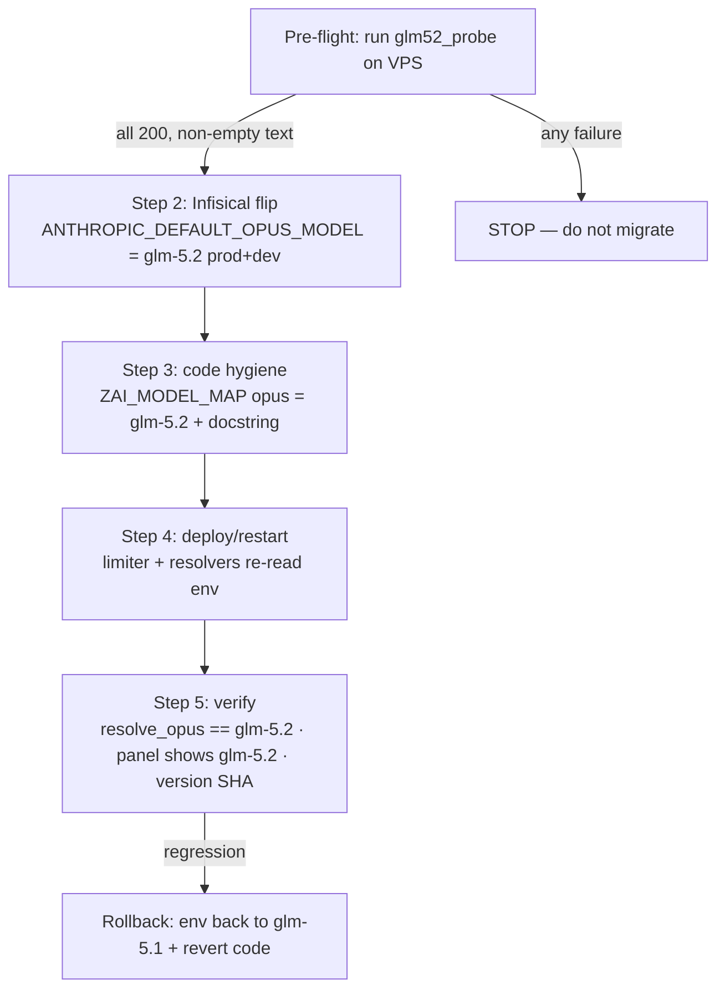
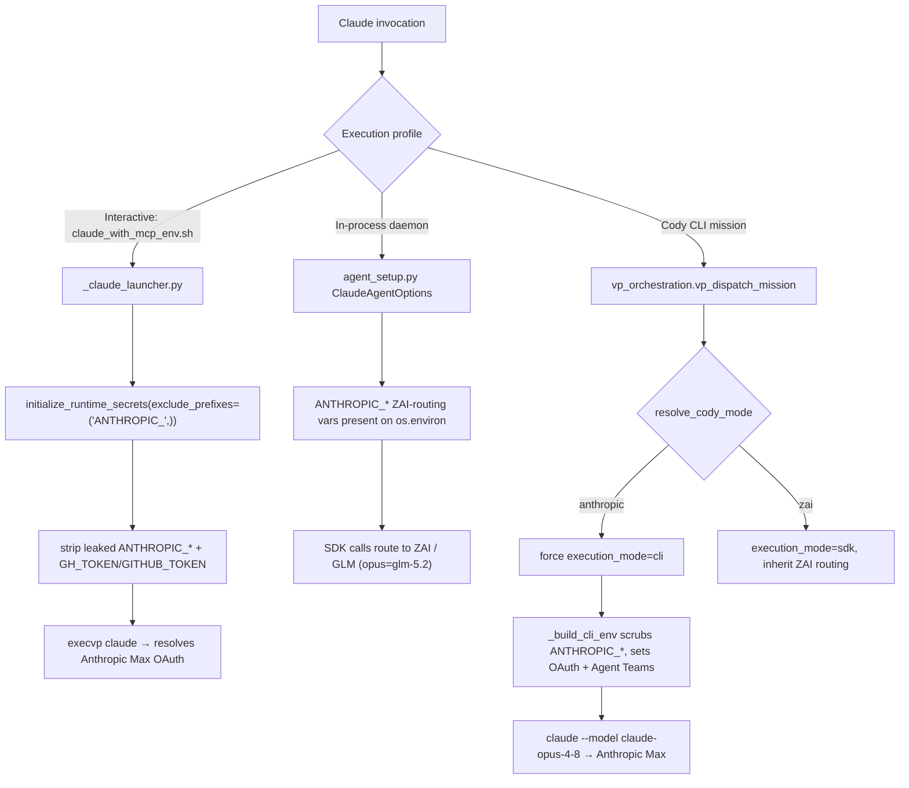

# Model Choice & Resolution

This subsystem answers two distinct questions:

1. **Which model string do we hand to the Anthropic SDK / Claude Code?** — the
   tier resolvers in `utils/model_resolution.py` (`resolve_opus` / `resolve_sonnet`
   / `resolve_haiku`) plus the ZAI tier→model map.
2. **Which *endpoint and credential* does a given execution use?** — ZAI/GLM proxy
   (cheap, via `ANTHROPIC_BASE_URL`/`ANTHROPIC_AUTH_TOKEN` on `os.environ`) vs. real
   Anthropic Max (OAuth, via env-scrub). This is governed by the **three execution
   profiles** and, for Cody specifically, by `cody_mode`.

Inference health governance (`zai_inference_health` invariant) watches the ZAI side
for throttling and ban risk.

These two axes are orthogonal. The tier resolvers always return a model *name*; what
that name means (a GLM model on ZAI, or an Anthropic model on Max) depends entirely
on which `ANTHROPIC_*` env vars are present in the process — which is what the
execution profile and env-scrub logic decide.

> **The single most important fact: routing is decided by `ANTHROPIC_BASE_URL`, not
> by the model string.** The official Anthropic SDK reads `ANTHROPIC_BASE_URL` at
> client-construction time. In the daemon, `initialize_runtime_secrets()` injects
> `ANTHROPIC_BASE_URL` (≈ `https://api.z.ai/api/anthropic`), `ANTHROPIC_AUTH_TOKEN`,
> `ANTHROPIC_API_KEY` (the **ZAI** key), and `ZAI_API_KEY` onto `os.environ`. So a
> bare `Anthropic()` anywhere in a daemon process hits ZAI — the model string
> `glm-5.1` is simply understood by the ZAI endpoint. To reach *real* Anthropic you
> must remove `ANTHROPIC_BASE_URL` (and the ZAI key) so the SDK/CLI falls back to
> `api.anthropic.com` + OAuth. That removal is exactly what the interactive launcher
> and the Cody anthropic-mode env-scrub do. The base URL value lives only in Infisical
> — `deploy.yml`'s `.env` bootstrap contains **no** ANTHROPIC/ZAI values.

---

## 1. Tier resolution — `utils/model_resolution.py`

UA code never hardcodes a model string. It calls a tier resolver. The canonical map
lives in `model_resolution.py::ZAI_MODEL_MAP`:

```python
ZAI_MODEL_MAP = {
    "haiku": "glm-4.5-air",     # Operator-locked.
    "sonnet": "glm-5-turbo",    # Z.AI standard model.
    "opus": "glm-5.2",          # Z.AI flagship (migrated 5.1→5.2 2026-06-13; NOT glm-5-2 — dash breaks it).
}
```

`resolve_model(tier)` is the core:

- For `tier="haiku"` it reads `ANTHROPIC_DEFAULT_HAIKU_MODEL`; `"sonnet"` reads
  `ANTHROPIC_DEFAULT_SONNET_MODEL`; anything else reads `ANTHROPIC_DEFAULT_OPUS_MODEL`.
- If that env var is set and non-empty, the env value wins. **Otherwise** it falls
  back to `ZAI_MODEL_MAP[tier]` (defaulting to the sonnet entry for unknown tiers).

**The reverse map — `model_resolution.py::model_id_to_tier` (added 2026-06-11):**
given a WIRE-LEVEL model id (the string actually sent to the proxy), returns the ZAI
rate-limiter's tier bucket (`opus`/`sonnet`/`mid`/`haiku`; `mid` covers the
Mission-Control `glm-4.7` lane and the `glm-4.6` literal, which bypass
`ZAI_MODEL_MAP`). Precedence is deliberately the INVERSE of `resolve_model`:
**wire identity first** (reverse-`ZAI_MODEL_MAP`, then literals), env intent vars
only for otherwise-unknown ids, unknown → `sonnet`. Rationale: an env override
expresses one caller's intent, but ZAI's limits follow the model actually on the
wire — env-first bucketing would let one variable capture every caller of that id
and invert the limiter's protection (e.g. `ANTHROPIC_DEFAULT_HAIKU_MODEL=glm-5.1`
must NOT run the flagship at haiku-tier concurrency).

The thin wrappers express intent at call sites:

| Resolver | Returns (default) | Notes |
|---|---|---|
| `resolve_haiku()` | `glm-4.5-air` | `model_resolution.py::resolve_haiku` |
| `resolve_sonnet()` | `glm-5-turbo` | `model_resolution.py::resolve_sonnet` |
| `resolve_opus()` | `glm-5.2` | `model_resolution.py::resolve_opus` (migrated from glm-5.1 2026-06-13) |
| `resolve_goal_eval_model(cody_mode)` | `glm-5-turbo` on ZAI, `None` on anthropic | `model_resolution.py::resolve_goal_eval_model` |
| `resolve_claude_code_model(default="sonnet")` | tier passthrough | the string passed to claude-agent-sdk |

### GLM-5.2 — validated opus-tier candidate (thinking semantics)

ZAI's GLM-5.2 is the **opus-tier model as of 2026-06-13** (migrated from `glm-5.1` — validated
on UA's existing Anthropic-compatible path through the production limiter + observability via
`scripts/glm52_probe.py`). It was a two-line flip — `ANTHROPIC_DEFAULT_OPUS_MODEL` (Infisical
prod+dev) and the `ZAI_MODEL_MAP["opus"]` literal — with **no other code change required**
(runbook below). The thinking semantics differ from every prior ZAI model UA has run, so know
them before relying on it:

- **Wire id is the bare string `glm-5.2`.** `glm-5.2[1m]` returns HTTP 400 "Unknown Model"
  on the `/v1/messages` endpoint — the `[1m]` suffix is a Claude-Code *settings.json*
  convention the CLI parses, never a wire id. (ZAI also appears to alias `glm-5.1`→`glm-5.2`
  server-side already.)
- **`glm-5.2` is NOT in `ZAI_MODEL_MAP`**, so `model_resolution.py::model_id_to_tier("glm-5.2")`
  falls through to the safe default **`sonnet`**. Any direct-SDK caller that wants it bucketed
  as opus (cap-1) must pass `model_tier="opus"` explicitly until the map is updated, or the
  limiter will run it at sonnet-tier concurrency.
- **GLM-5.1 had no thinking mode; GLM-5.2 adds it and defaults it ON.** This corrects the older
  "GLM-5.1 has no thinking mode — do NOT pass `thinking`" guidance (e.g. the 2026-05-07
  knowledge-extraction note), which is true for 5.1 but **wrong for 5.2**. The ZAI thinking
  parameter shape is `thinking: {"type": "enabled" | "disabled" | "auto"}`; the Anthropic-native
  `{"type": "enabled", "budget_tokens": N}` is also accepted. All shapes return HTTP 200.
- **No empty-response risk on UA's path.** The infamous empty-response gotcha (reasoning landing
  in `reasoning_content`) is specific to ZAI's *OpenAI-compatible* endpoint. On the
  *Anthropic-compatible* endpoint UA uses, a thinking-enabled response is `[thinking block,
  text block]`; UA's text extraction (`for b in resp.content: if hasattr(b, "text")`) skips the
  thinking block and still gets the answer. The default call (no `thinking`) also returns
  non-empty text. **No parser change needed.**
- **Thinking is expensive — budget-bound it.** On a trivial prompt: ~30 output tokens with thinking
  off (`disabled`/`auto`/default), but **428 with a 1024 budget and 724 with no budget**. So for
  cheap/fast crons (extraction, classification, triage) pass `thinking: {"type": "disabled"}` to
  keep 5.1-like cost/latency, and **always set `budget_tokens` when enabling** — the no-budget
  shape runs reasoning unbounded. Reserve thinking-on for genuine opus-tier reasoning work. Reasoning
  *depth* (High vs Max effort) is a Claude-Code reasoning-effort setting, not a wire parameter.

The eval harness `scripts/glm52_probe.py` runs both an SDK lane (UA's real call path) and a raw-httpx
lane (for the ZAI-specific shapes the SDK validates away client-side), routes every call through
`rate_limiter.py::with_rate_limit_retry` (FUP-respectful pacing) after `initialize_runtime_secrets()`
(so the calls are captured by the observability hook and show on the ZAI Control panel), and self-checks
panel visibility. Run it on the VPS: `python -m universal_agent.scripts.glm52_probe`.

### Migration runbook: switch the opus tier `glm-5.1` → `glm-5.2`

**Status: EXECUTED 2026-06-13.** The opus tier was switched to `glm-5.2` (Infisical
`ANTHROPIC_DEFAULT_OPUS_MODEL` prod+dev + `ZAI_MODEL_MAP["opus"]`). This runbook is retained as the
procedure + rollback reference. It is a **high-blast-radius** change, but a *scoped* one: it swaps
**only the opus-tier model** — every call that currently resolves to the opus tier (the default
daemon tier for Simone, Atlas, dispatch sweep, plus Cody-on-ZAI) moves to 5.2 at once. It does
**not** touch the sonnet or haiku tiers, so a mixed-tier agent only has its opus slice change — e.g.
convergence keeps its sonnet judge (`glm-5-turbo`) and haiku triage/signatures (`glm-4.5-air`)
unchanged, and only its opus-tier slice (ideation synthesis / un-overridden `resolve_opus()` calls)
moves to 5.2.

**What changes — and what explicitly does NOT:**

| Tier | Before | After | Touched? |
|---|---|---|---|
| opus | `glm-5.1` | `glm-5.2` | **YES** |
| sonnet | `glm-5-turbo` | `glm-5-turbo` | **NO — leave it** |
| haiku | `glm-4.5-air` | `glm-4.5-air` | **NO — operator-locked** |

> **The "glm-5.2 mis-buckets to sonnet" note is NOT a sonnet-model change.** It refers only to the
> rate-limiter *concurrency bucket*: until `glm-5.2` is in `ZAI_MODEL_MAP`, `model_resolution.py::model_id_to_tier`
> falls back to the `sonnet` bucket for it. **The opus flip fixes this automatically** — step 2 sets
> `ANTHROPIC_DEFAULT_OPUS_MODEL=glm-5.2`, which `model_id_to_tier` reads via its intent-env path and
> returns `opus`; step 3 makes the reverse-`ZAI_MODEL_MAP` path agree. The sonnet **model**
> (`glm-5-turbo`) is never involved and never changes.



**Step 1 — Pre-flight.** Re-run the harness on the VPS and confirm clean 200s:
`python -m universal_agent.scripts.glm52_probe`. If any lane errors (not a 429 — those are just
throttle), **stop**.

**Step 2 — The live lever (Infisical).** Flip `ANTHROPIC_DEFAULT_OPUS_MODEL` in **both** `production`
and `development` from `glm-5.1` to `glm-5.2`. `model_resolution.py::resolve_model` reads this env
var first (it wins over `ZAI_MODEL_MAP`), so this alone changes runtime opus resolution on the next
restart — **and** it fixes the tier bucketing, because `model_id_to_tier` matches `glm-5.2` against
`ANTHROPIC_DEFAULT_OPUS_MODEL` via its intent-env path → returns `opus`. Do **not** touch
`ANTHROPIC_DEFAULT_SONNET_MODEL` (`glm-5-turbo`) or `ANTHROPIC_DEFAULT_HAIKU_MODEL` (`glm-4.5-air`).

**Step 3 — Code hygiene (a normal branch→PR).** In `model_resolution.py::ZAI_MODEL_MAP` set
`"opus": "glm-5.2"` (leave `sonnet`/`haiku` lines as-is) and update the `model_resolution.py::resolve_opus`
docstring. This keeps the *fallback* default (used when the env var is unset) and the
reverse-`ZAI_MODEL_MAP` bucketing consistent with the env. Optional: refresh the cosmetic `glm-5.1`
comments scattered in `cron_service.py`, `agent_setup.py`, `wiki/llm.py`, `csi_intelligence_pass.py`,
`youtube_daily_digest.py` (they don't affect behavior). **No parser change is needed** — UA's text
extractor already skips the `thinking` block 5.2 emits.

**Step 4 — Activate.** The step-3 PR's deploy restarts the stack, which re-reads Infisical (picking up
step 2) and reconstructs the resolvers/limiter. (Or restart `universal-agent-gateway` to activate the
Infisical flip immediately without waiting for the code PR.)

**Step 5 — Verify.**
- `resolve_opus()` returns `glm-5.2` in a bootstrapped process.
- The ZAI Control "Token use by process" panel shows opus-tier callers (e.g. `proactive_convergence`)
  now emitting `model=glm-5.2`, bucketed under the **opus** cap (not sonnet).
- `/api/v1/version` SHA matches the deployed step-3 commit.

**Cost watch-out (the one real operational consideration).** GLM-5.2 **defaults `thinking` ON**, which
is 10–24× the output tokens of 5.1's no-thinking calls. After the flip, the cheap/fast opus-tier crons
(extraction, triage, classification) will get slower and pricier unless they pass
`thinking={"type":"disabled"}`. Decide per-caller: keep thinking ON for genuine reasoning work
(briefings, convergence synthesis), turn it OFF for high-volume mechanical calls. Watch the
token-use panel for the first 24h.

**Rollback.** Set `ANTHROPIC_DEFAULT_OPUS_MODEL` back to `glm-5.1` in Infisical (prod+dev) and revert
the step-3 commit; restart. Because the env lever wins, the Infisical revert alone restores 5.1 on the
next restart even before the code revert lands.

### Haiku and sonnet resolve to different models

`resolve_haiku()` returns `glm-4.5-air` (operator-locked; verified working) and
`resolve_sonnet()` returns `glm-5-turbo`. The Claude Agent SDK makes small **internal
preflight calls** (system-prompt cache management, compaction routing, tool-selection
classifier) on the haiku tier, which is why the haiku tier exists as its own lane.
`resolve_haiku()` is kept as a separate function so the haiku tier can be tuned without
touching every caller. The haiku tier is operator-locked to `glm-4.5-air`; do not
remap it.

### The `/goal` completion evaluator runs a stronger judge — without touching the haiku lock

Claude Code's built-in `/goal` loop judges its completion condition after every turn with
the CC **"small fast model"**, which current Claude Code reads from
`ANTHROPIC_DEFAULT_HAIKU_MODEL` (`ANTHROPIC_SMALL_FAST_MODEL` is deprecated — ref the
[Claude Code model-config docs](https://code.claude.com/docs/en/model-config)). On the ZAI
routing that is the operator-locked `glm-4.5-air` — too weak to adjudicate demo-build
acceptance reliably. `model_resolution.py::resolve_goal_eval_model` returns a **stronger**
evaluator model (sonnet tier → `glm-5-turbo`) that `claude_cli_client.py::_execute_cli_session`
injects as `ANTHROPIC_DEFAULT_HAIKU_MODEL` **on the `/goal` work-turn subprocess's env dict
only** (threaded from `claude_cli_client.py::_run_goal_loop_mission`, recorded as
`payload.goal_eval_model`). This never writes `os.environ` and never mutates `ZAI_MODEL_MAP`
— the global haiku operator-lock is untouched; only that one child process (its evaluator
plus its own SDK background calls) runs on the stronger model. Resolution precedence:
`cody_mode == "anthropic"` → `None` (a Claude-Max session keeps the real Haiku evaluator;
never inject a ZAI id into an `api.anthropic.com` session); else `UA_GOAL_EVAL_MODEL`
(explicit model id, or an `off`/`none`/`default`/`haiku`/`disable` opt-out token → `None`);
else `resolve_sonnet()` (`glm-5-turbo`).

> Why ride the haiku knob at all? Claude Code exposes **no separate small-fast-model lever** —
> the legacy `ANTHROPIC_SMALL_FAST_MODEL` was folded into `ANTHROPIC_DEFAULT_HAIKU_MODEL`, and
> the `/goal` slash command takes only a condition, no model parameter. A per-subprocess env
> override is therefore the only way to upgrade the evaluator without a global remap. Note this
> tightens the gate UA already (transitively) relies on — the `/goal` Stop hook blocks the
> subprocess from exiting until the evaluator returns `ok:true`, and the mission outcome keys on
> that exit (`claude_cli_client.py::_monitor_cli_output`). It does **not** capture the structured
> met/not-met verdict, nor close the "OR stop after N turns" cap-clause escape — those are
> separate, tracked follow-ons.

### Gotcha: `resolve_sonnet()` no longer secretly returns opus

The docstring on `resolve_sonnet` notes it was historically overridden to return opus,
silently promoting every direct caller to the expensive flagship. That override was
removed — **sonnet now means sonnet** (`glm-5-turbo`). If you see old docs claiming
"sonnet maps to opus," the code contradicts them; the code wins.

### The default daemon tier is opus

`agent_setup.py` builds the daemon's `ClaudeAgentOptions` with
`model=resolve_claude_code_model(default="opus")` — i.e. the in-process daemon
(Simone, Atlas, dispatch sweep, etc.) runs on **opus / glm-5.2** by default. It also
forces the SDK's internal preflight model env vars into the subprocess env so the SDK
picks up the central mappings regardless of external env:

```python
"ANTHROPIC_DEFAULT_HAIKU_MODEL": resolve_haiku(),       # glm-4.5-air
"ANTHROPIC_DEFAULT_SONNET_MODEL": resolve_model("sonnet"),
"ANTHROPIC_DEFAULT_OPUS_MODEL": resolve_claude_code_model(default="opus"),
```

> Note on the resolver default vs. the daemon default: `resolve_model()` /
> `resolve_claude_code_model()` *default to "sonnet"* when called with no argument
> (operator decision), but `agent_setup.py` explicitly passes
> `default="opus"`, so the actual daemon main-agent model is opus. Subagents that
> prefer sonnet get it via their own `.claude/agents/*.md` YAML.

### Per-tier wall-clock timeouts

`model_call_timeout_seconds(tier)` returns the per-turn cap, overridable via
`UA_MODEL_TIMEOUT_<TIER>_SECONDS` (set to `0` to disable). Defaults
(`_TIER_DEFAULT_TIMEOUTS`):

| Tier | Default cap | Rationale |
|---|---|---|
| haiku | 120 s | SDK preflight + tiny tasks; a failed cheap-tier call should fail fast |
| sonnet | 180 s | Daily-driver multi-tool turns |
| opus | 1800 s | Heavy research / multi-doc synthesis / long crons — generous on purpose |

Per-request override is `GatewayRequest.metadata["turn_timeout_seconds"]` (consumed in
`execution_engine.py`) — the recommended knob for a single slow workflow, rather than
dragging the global default up.

### Mission Control dedicated lane

Mission Control intelligence (tier-0 annotations, card discovery, page synthesis,
event-title templates) runs on its **own** model lane via
`resolve_mission_control_model()` so it doesn't consume opus/sonnet concurrency budget.
Default `MISSION_CONTROL_DEFAULT_MODEL = "glm-4.7"` (override `UA_MISSION_CONTROL_MODEL`;
documented fallback `glm-5-turbo`). This **bypasses `ZAI_MODEL_MAP` entirely** — the
value is passed straight to `AsyncAnthropic(model=...)`. Its per-call timeout is
`mission_control_call_timeout_seconds()` (default 180 s, override
`UA_MISSION_CONTROL_CALL_TIMEOUT_SECONDS`, `0` disables).

### Agent Teams flag

`resolve_agent_teams_enabled(default=True)` resolves whether Claude Code Agent Teams is
on. Precedence: `UA_AGENT_TEAMS_ENABLED` → `CLAUDE_CODE_EXPERIMENTAL_AGENT_TEAMS` →
default `True`.

---

## 2. The three execution profiles

UA runs Claude under three distinct profiles. Confusing them is the single most common
source of model-routing mistakes. The profile decides **endpoint + credential**, which
in turn decides what a tier name resolves to in practice.

| # | Profile | Endpoint / models | How `ANTHROPIC_*` is handled | Entry point |
|---|---|---|---|---|
| 1 | **Interactive coding** (Kevin's `claude` / Antigravity) | Anthropic Max via OAuth (real Opus/Sonnet/Haiku) | `ANTHROPIC_*` **excluded/stripped** so OAuth wins | `scripts/claude_with_mcp_env.sh` → `scripts/_claude_launcher.py` |
| 2 | **UA autonomous in-process** (Simone heartbeats, Atlas, dispatch sweep, intel crons) | ZAI proxy / GLM (glm-5.2 opus, glm-5-turbo sonnet) | `ANTHROPIC_*` ZAI-routing vars **kept** on `os.environ` (loaded at service start) | `agent_setup.py` `ClaudeAgentOptions` |
| 3 | **Cody per-task CLI subprocess** | Anthropic Max by default (or ZAI when `cody_mode="zai"`) | `ANTHROPIC_*` scrubbed when `cody_mode=="anthropic"` | `vp/clients/claude_cli_client.py::_build_cli_env` |

The governing principle: **any `ANTHROPIC_*` key on `os.environ` overrides OAuth.**
`ANTHROPIC_API_KEY` makes Claude Code treat it as an external API key (and reject it
with "Invalid API key · Fix external API key" if it's for the wrong account/billing);
`ANTHROPIC_BASE_URL` + `ANTHROPIC_AUTH_TOKEN` route to ZAI/GLM. So:

- Profiles that want **ZAI** keep those vars present (profile 2 — loaded at startup by
  `initialize_runtime_secrets()`).
- Profiles that want **Anthropic Max** strip them so the CLI falls through to
  workspace-local OAuth (`~/.claude/.credentials.json`) or a forwarded
  `CLAUDE_CODE_OAUTH_TOKEN` (profiles 1 and 3-anthropic).



### Profile 1 — interactive coding launcher

`scripts/claude_with_mcp_env.sh` exists because an interactive `claude` invocation does
not run UA's secret bootstrap, so `${VAR}` placeholders in `.mcp.json` would substitute
to empty and MCP children would fail. The wrapper:

- Auto-detects `UA_INSTALL_ROOT` (`/opt/universal_agent`, else the repo containing the
  script).
- Auto-injects `--dangerously-skip-permissions` for interactive sessions, but **skips
  that flag for management subcommands** (`agents`, `auth`, `auto-mode`, `doctor`,
  `install`, `mcp`, `plugin(s)`, `project`, `setup-token`, `ultrareview`,
  `update`/`upgrade`) which would reject it.
- Preserves the caller's CWD via `UA_ORIGINAL_CWD` (it must `cd` into UA for `uv run`,
  but the launcher `os.chdir`'s back before `execvp`).

`scripts/_claude_launcher.py` then:

1. Sources `$UA_INSTALL_ROOT/.env` bootstrap creds (without overwriting existing env).
2. Calls `initialize_runtime_secrets(exclude_prefixes=("ANTHROPIC_",))` — the entire
   `ANTHROPIC_*` namespace is filtered out **at the Infisical-injection step** so those
   vars never enter `os.environ`.
3. **Defense-in-depth strip** (`_strip_interactive_routing_vars`): removes any
   `ANTHROPIC_*` that leaked from a non-Infisical source (bootstrap `.env`, parent
   shell).
4. **Also strips `GH_TOKEN` / `GITHUB_TOKEN`** (`_strip_named_interactive_vars`): a
   stale/expired Infisical `GH_TOKEN` was overriding the file-stored `gh` OAuth
   (`~/.config/gh/hosts.yml`) and breaking every interactive `gh` call (and therefore
   `/ship`'s in-script deploy watching). Crons/services still get these vars — they
   don't go through this launcher.
5. Runs a git baseline check, then `execvp`'s `claude` with the bootstrapped env. With
   `ANTHROPIC_*` gone, the CLI resolves to Anthropic Max OAuth.

> [VERIFY: explicit ZAI opt-in for interactive sessions is described as a `zai` shell
> function in the launcher docstring; that function lives in shell config, not in this
> repo path set, so it is not code-verified here.]

### Profile 2 — UA autonomous in-process (ZAI)

The daemon principals run inside the UA process. `initialize_runtime_secrets()` is
called **without** `exclude_prefixes`, so the ZAI routing vars (`ANTHROPIC_BASE_URL`,
`ANTHROPIC_AUTH_TOKEN`, `ANTHROPIC_DEFAULT_*_MODEL`) and `ANTHROPIC_API_KEY` (for
direct-SDK code paths like the vision endpoint and refinement agent) stay on
`os.environ`. `agent_setup.py` builds `ClaudeAgentOptions` on top of that, with the
opus default and the forced preflight-model env vars described above. There is no
per-task model switch — this profile is heartbeat-driven and ZAI-routed by design.

### Profile 3 — Cody per-task CLI subprocess

See §3.

### "Cody is the only real-Anthropic path" is NOT accurate

The common shorthand "ZAI everywhere except Cody" is wrong. Real Anthropic
(`api.anthropic.com`, Max OAuth) is reached by several paths (verified in the
2026-05-28 routing audit and re-confirmed in code):

1. **Cody CLI anthropic mode** — `claude_cli_client.py::_build_cli_env` (§3). Intended.
2. **Cody demo workspaces** — a *second* Cody real-Anthropic path.
   `services/cody_implementation.py::_scrubbed_env` strips all `ANTHROPIC_*` before
   spawning `claude`; the scaffold `templates/ua_demos_scaffold/.claude/settings.json`
   is intentionally empty of ZAI overrides. `/build_cli_env` explicitly mirrors this
   pattern.
3. **Kevin's interactive `claude`** — profile 1, the interactive *coding* profile (not
   autonomous inference).
4. **Demo-path smoke** — `/opt/ua_demos/_smoke/smoke.py` deliberately verifies the demo
   path against real Anthropic. The former dependency-upgrade Anthropic-native smoke
   (`run_anthropic_native_smoke`) was retired 2026-06-07 (#805); only
   `services/dependency_upgrade.py::run_zai_smoke` now gates upgrades, routing through ZAI
   because it runs in the daemon env.

Everything else (~25 direct SDK clients across `services/`, `urw/`, `discord_intelligence/`,
`scripts/`, and the Agent-SDK / CLI-zai paths) is ZAI-routed.

> **Gotcha — the vision endpoint was a former landmine, now ZAI.** `gateway_server.py`
> `/api/v1/vision/describe` (backs the dashboard image-paste-to-vision feature) once
> hardcoded `https://api.anthropic.com` and was triple-misconfigured (missing
> `resolve_opus` import → `NameError`; sent the ZAI key to real Anthropic; sent a GLM
> model string to real Anthropic). It is now rewired to route through
> `base_url = os.getenv("ANTHROPIC_BASE_URL") or "https://api.z.ai/api/anthropic"`
> with `model = resolve_opus()` (glm-5.2) — i.e. ZAI like the rest of the daemon. The
> code comment notes that pointing `ANTHROPIC_BASE_URL` at `api.anthropic.com` + a
> console key + an explicit `claude-*` model is the (cost-bearing) opt-in for real
> high-res Opus vision.

> **Operational fact — `CLAUDE_CODE_OAUTH_TOKEN` in Infisical is the canonical
> Cody-on-Anthropic credential.** The `/home/ua/.claude/.credentials.json` file on the
> VPS is orphan state from an old interactive session; nothing in production reads it.

> **Operational fact — ZAI peak-hours throttling.** The ZAI proxy's customer base is
> concentrated in Greater China; peak demand (Beijing business hours ~16:00–22:00 CST)
> overlaps US Central *night*. Heavy autonomous crons scheduled "overnight" US time hit
> ZAI capacity limits — the inverse of the usual "run batch overnight" intuition. The
> `/opt/ua_demos/` Anthropic-native path is immune to this throttling and is the
> documented emergency override (with a real-credit cost tradeoff).

---

## 3. Cody mode resolution — `services/cody_mode.py`

Every Cody task carries a `cody_mode` ∈ {`"zai"`, `"anthropic"`} that decides whether it
runs cheap (ZAI/GLM) or on real Anthropic Max.

`resolve_cody_mode(task, *, conn=None)` resolution order (highest priority first):

1. `task["cody_mode"]` — per-task override on `task_hub_items`.
2. DB setting `cody_default_mode` — operator-configurable via the dashboard tile,
   persisted in `task_hub_settings` (read through `_resolve_db_setting` →
   `task_hub._get_setting`). Requires a `conn` to the activity DB; skipped if `conn`
   is `None`.
3. `UA_CODY_DEFAULT_MODE` env var — deploy-time override, usually unset.
4. `_HARDCODED_FALLBACK_MODE = "anthropic"`.

> **Gotcha — the hardcoded default is `anthropic`, flipped from `zai` on 2026-05-11 PM**
> per an operator decision. Cody now runs on real Anthropic Max for *every* task unless
> explicitly overridden. Reverting requires a per-task `cody_mode="zai"`, the dashboard
> tile, or `UA_CODY_DEFAULT_MODE=zai`. (Older docs/memory may say "Cody normally runs on
> ZAI" — that's stale.)

`resolve_from_payload(payload)` is the downstream variant (VP worker, CLI client) used
after dispatch when the task row is out of scope. It reads `payload["cody_mode"]`, then
`payload["metadata"]["cody_mode"]` (vp_orchestration plumbs it under `metadata`), then
env, then the hardcoded default. It does **not** consult the DB setting — the dispatch
decision is already baked into the payload by then.

Dashboard plumbing: `set_default_mode(conn, mode, updated_by=...)` validates and writes
`{mode, updated_at, updated_by}` to `task_hub_settings` (raises `ValueError` on invalid
mode so the settings endpoint can 400). `get_default_mode_state(conn)` returns the
current mode + audit fields + a `source` of `db_setting` / `env_var` /
`hardcoded_default`. Both are wired into a gateway settings endpoint
(`gateway_server.py` near the `set_default_mode` / `get_default_mode_state` imports).

### cody_mode → execution_mode coupling (the source-of-truth rule)

`tools/vp_orchestration.py::vp_dispatch_mission` resolves `cody_mode` (explicit arg →
linked task row → `resolve_cody_mode`) and then enforces:

```python
explicit_exec_mode = str(args.get("execution_mode") or "").strip().lower()
if resolved_cody_mode == "anthropic":
    resolved_execution_mode = "cli"          # forced — Anthropic Max only via CLI
elif explicit_exec_mode:
    resolved_execution_mode = explicit_exec_mode
else:
    resolved_execution_mode = "sdk"
```

**`cody_mode="anthropic"` FORCES `execution_mode="cli"`** and *ignores* any explicit
`execution_mode` argument (with a warning). The rationale (in the code comment): the
Anthropic Max plan is only reachable through the workspace-local OAuth in the CLI
subprocess; running anthropic mode under the SDK/autonomous path would silently route
to ZAI anyway. To explicitly run autonomously, callers must pass `cody_mode="zai"`,
which conveys the intent properly. The resolved mode is plumbed into
`mission_metadata["cody_mode"]`.

### `_build_cli_env` — the env-scrub that makes Anthropic Max actually engage

`vp/clients/claude_cli_client.py::_build_cli_env(enable_agent_teams, workspace_dir, *, cody_mode="zai")`:

- **`cody_mode == "anthropic"`**: builds env as
  `{k: v for k, v in os.environ.items() if not k.startswith("ANTHROPIC_")}` — every
  `ANTHROPIC_*` var scrubbed so the spawned `claude` falls through to OAuth. Then:
  - `CLAUDE_CODE_EXPERIMENTAL_AGENT_TEAMS = "1"` (forced — "Agent Teams is the whole
    point of Anthropic mode").
  - Forwards the long-lived Max OAuth token from `CLAUDE_CODE_OAUTH_TOKEN` (Infisical;
    legacy fallback `ANTHROPIC_MAX_OAUTH_TOKEN`) into the subprocess env, and
    explicitly `env.pop("ANTHROPIC_API_KEY", None)` because Claude Code prefers an API
    key over OAuth when both are present.
- **otherwise (`zai`)**: `env = dict(os.environ)` (inherits ZAI routing); Agent Teams
  set only if `enable_agent_teams`.
- Both paths set `CURRENT_RUN_WORKSPACE` / `CURRENT_SESSION_WORKSPACE`, pop
  `UA_INFISICAL_STRICT` (don't enforce Infisical in the subprocess), and forward
  `REPORT_MAX_CONCURRENT_AGENTS` if set.

> **Gotcha — OAuth token vs API key.** An earlier version translated the
> `claude setup-token` output into `ANTHROPIC_API_KEY`, which Claude Code rejected as
> "Invalid API key · Fix external API key" because an `sk-ant-oat01-...` OAuth token is
> not valid in the API-key auth slot. The token must be set as `CLAUDE_CODE_OAUTH_TOKEN`
> (it doesn't start with `ANTHROPIC_`, so it survives the scrub naturally; it's read
> explicitly to make the contract obvious).

### CLI model selection

In `_execute_cli_session`, model selection is applied **only when
`cody_mode == "anthropic"`** (ZAI/SDK paths have their own routing and would ignore
`--model`):

```python
if cody_mode == "anthropic":
    model_override = os.getenv("UA_CODY_CLI_MODEL", "claude-opus-4-8").strip()
    if model_override and model_override.lower() != "default":
        cmd.extend(["--model", model_override])
```

So Cody's Anthropic CLI work defaults to **`claude-opus-4-8`** (Opus 4.8). Override per
process with `UA_CODY_CLI_MODEL`; set it to `default` (or empty) to use the CLI's own
default (currently Sonnet, no `--model` flag).

> Demo workspaces (`/opt/ua_demos/<id>/`) add a second defense layer: a vanilla
> `.claude/settings.json` and the `services/cody_implementation._scrubbed_env` pattern
> that `_build_cli_env` mirrors.

---

## 4. Inference health governance — `zai_inference_health`

The `services/invariants/zai_inference_health.py` invariant (P4 of the watchdog
restoration) protects the ZAI side of the system: throttling that kills throughput and,
worse, Fair-Use-Policy (FUP) signals that risk a subscription ban. It runs each
heartbeat with no AI inference, no DB write, no HTTP — just a ~1 KB JSON read, a tail of
a JSONL events file, and one `pgrep`.

It reads two sources:

1. **ZAIRateLimiter snapshot** (`zai_inference_state.json`, written by `record_*` in
   `rate_limiter.py`) — covers in-band callers wrapped by `with_rate_limit_retry`.
2. **Universal P7 events JSONL** (`zai_inference_events.jsonl`, written by
   `zai_observability.py`'s httpx hook) — catches **direct-httpx callers that bypass
   `with_rate_limit_retry`**. This is the gap that hid the 2026-05-21 `session_dossier`
   49-request 429 burst from the watchdog.

One invariant emits at most one finding listing every triggered condition (in
`observed_value.triggered_conditions`) so a correlated bad day doesn't spam multiple
alerts. Conditions:

| Condition | Source | Severity | Default threshold (env override) |
|---|---|---|---|
| FUP signal in window | snapshot `last_fup_at` OR events `fup_signal` | **critical** (immediate, no grace) | 30 min — `UA_ZAI_FUP_DETECT_WINDOW_SECONDS` / `UA_ZAI_EVENTS_FUP_WINDOW_SECONDS` |
| Sustained consecutive 429s | snapshot `consecutive_429s` | **critical** | ≥3 — `UA_ZAI_CONSECUTIVE_429_CRITICAL` |
| 429 burst in rolling window | events `rate_limited_429` | **critical** | ≥3 in 10 min — `UA_ZAI_EVENTS_429_CRITICAL_COUNT` / `UA_ZAI_EVENTS_429_WINDOW_SECONDS` |
| Adaptive backoff floor saturated | snapshot `backoff_floor` | **critical** | ≥8.0 s — `UA_ZAI_BACKOFF_FLOOR_MAX` |
| UA Python process count high | `pgrep -cf 'universal_agent\|csi_ingester'` | **warn** | >30 — `UA_PYTHON_PROC_SOFT_LIMIT` |

Severity logic: FUP wins (critical); otherwise any 429-tier condition is critical;
process-count alone is only warn. If nothing has data and process count is within the
soft limit, the invariant stays silent (returns `None`). The events file path is
`AGENT_RUN_WORKSPACES/zai_inference_events.jsonl` (override `UA_ZAI_EVENTS_PATH`), read
defensively (never raises on bad upstream data), capped at `UA_ZAI_EVENTS_MAX_READ`
(default 5000) tail lines.

The headline message names the worst cause first and includes caller attribution from
the events file (top callers by count) so the operator can immediately see which
direct-httpx caller is causing the burst.

---

## Quick reference: env vars

| Var | Effect |
|---|---|
| `ANTHROPIC_DEFAULT_{HAIKU,SONNET,OPUS}_MODEL` | Override the tier→model mapping (else `ZAI_MODEL_MAP`) |
| `UA_CODY_DEFAULT_MODE` | Deploy-time Cody mode default (`zai`/`anthropic`), priority below DB setting |
| `UA_CODY_CLI_MODEL` | Cody Anthropic-CLI model (default `claude-opus-4-8`; `default` = CLI default) |
| `UA_MISSION_CONTROL_MODEL` | Mission Control lane model (default `glm-4.7`, bypasses tier map) |
| `UA_MODEL_TIMEOUT_{HAIKU,SONNET,OPUS}_SECONDS` | Per-tier turn cap (`0` disables) |
| `UA_MISSION_CONTROL_CALL_TIMEOUT_SECONDS` | Mission Control per-call cap (default 180) |
| `UA_AGENT_TEAMS_ENABLED` / `CLAUDE_CODE_EXPERIMENTAL_AGENT_TEAMS` | Agent Teams toggle |
| `CLAUDE_CODE_OAUTH_TOKEN` (legacy `ANTHROPIC_MAX_OAUTH_TOKEN`) | Anthropic Max OAuth token forwarded into Cody anthropic CLI subprocess |
| `UA_ZAI_*` (see table above) | ZAI inference-health invariant thresholds/windows |
