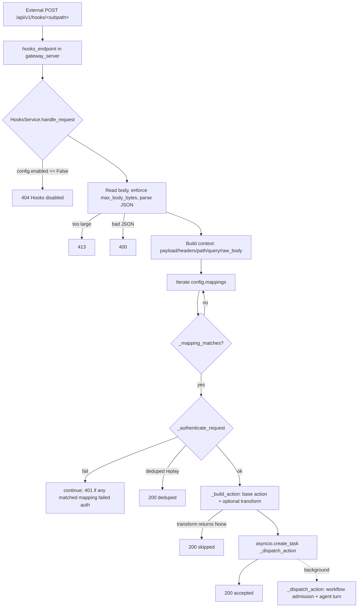

# Hook System Architecture

## What "hooks" means here

In this codebase, **"hooks" are inbound HTTP webhooks**, not Claude Code's
`PreToolUse`/`PostToolUse` lifecycle hooks. The hook system is an ingress layer
that accepts external POST requests (Composio webhooks, manual YouTube URL
submissions, CSI signal ingest, AgentMail inbound mail, etc.), authenticates and
transforms them, then either **wakes** the agent or **dispatches an agent run**
through the in-process gateway.

The entire subsystem lives in `hooks_service.py::HooksService`. It is constructed
once in `gateway_server.py` (a module-global `_hooks_service`) and exposed to the
outside world through the FastAPI route `POST /api/v1/hooks/{subpath:path}`
(`gateway_server.py::hooks_endpoint`).

> **Naming collision — read this first.** There are **two** unrelated subsystems
> in this repo that both use the word "hook":
>
> 1. **HTTP webhook ingress** — `hooks_service.py::HooksService`. This is what
>    this document covers.
> 2. **Claude Agent SDK lifecycle hooks** — `hooks.py::AgentHookSet`
>    (`build_hooks()` returning `PreToolUse`/`PostToolUse`/`AgentStop`/`PreCompact`
>    etc.). These are in-process guardrails/observability callbacks that fire
>    around tool calls during an agent turn (schema guardrail, workspace-write
>    guard, `DISALLOWED_TOOLS` enforcement, Bash env injection, TOOL_CALL/
>    TOOL_RESULT event emission). That subsystem lives in a different file
>    (`hooks.py`, not `hooks_service.py`) and is out of scope for this doc's
>    `code_paths`. If you came here looking for `PreToolUse`/`PostToolUse`
>    behavior, read `hooks.py::AgentHookSet` directly.

> The `src/universal_agent/sdk/` directory listed in this doc's scope is a small
> set of Claude Agent SDK helpers (version probing, session-history adapter,
> typed task-event extraction) — see [SDK helpers](#sdk-helpers) below. It is
> unrelated to the webhook ingress flow but is documented here because it shares
> the doc's `code_paths`.

## End-to-end request flow

`handle_request` is **fire-and-forget for the agent run**: it validates, matches,
authenticates, builds the action, then schedules `_dispatch_action` as a
background `asyncio` task and immediately returns `200 {"ok": true, "action":
...}`. The heavy work (running the agent turn) happens after the HTTP response is
sent.

### 1. Ingress and body guards (`handle_request`)

- Returns `404 "Hooks disabled"` immediately if `config.enabled` is false.
- Reads the raw body, rejects with `413` if it exceeds `config.max_body_bytes`
  (default `256 KiB`; bootstrap path raises this to `1 MiB`).
- Parses JSON; `400` on decode failure. Empty body is allowed (`payload = {}`).
- Builds a `context` dict consumed by matching, auth, transforms, and templating:
  `payload`, `headers` (lower-cased keys), `path` (the `{subpath}`), `query`,
  `raw_body` (bytes), `raw_body_text`.

### 2. Mapping match (`_mapping_matches`)

Mappings come from `HooksConfig.mappings`. A mapping matches when **all** of its
declared `match` constraints pass (a mapping with no `match` block matches
everything):

- `match.path` must equal the request subpath exactly.
- `match.source` must equal `payload["source"]`.
- `match.headers` — every expected header (case-insensitive key) must be present
  and stringwise-equal.

The first matching mapping wins; iteration stops at the first accepted dispatch.

### 3. Authentication (`_authenticate_request`)

Per-mapping `auth.strategy` (default `token`):

| Strategy | Behavior |
|---|---|
| `none` | Always allowed. |
| `token` | If `config.token` is unset, **open** (returns true). Otherwise the request token (`Authorization: Bearer …` or `X-UA-Hooks-Token` header) must equal `config.token`. |
| `composio_hmac` | Verifies Composio's `webhook-id` / `webhook-timestamp` / `webhook-signature` headers against `COMPOSIO_WEBHOOK_SECRET` using HMAC-SHA256 over `"{id}.{timestamp}.{body}"`, base64-compared with `hmac.compare_digest`. Enforces a timestamp tolerance (`auth.timestamp_tolerance_seconds`, default 300s) and an in-memory replay window (`auth.replay_window_seconds`, default 600s) keyed by `composio:{webhook_id}`. |

**Replay dedup gotcha:** when `composio_hmac` sees a `webhook_id` it has already
accepted inside the replay window, it sets `context["_hook_auth_outcome"] =
{"deduped": True, ...}` and `handle_request` short-circuits to `200 {"deduped":
true}` *without* dispatching. The seen-id map is purely in-process
(`self._seen_webhook_ids`), so a process restart resets replay protection.

If a mapping matched but auth failed, `handle_request` returns `401`. If no
mapping matched at all, it returns `404 "No matching hook found"`.

### 4. Action building (`_build_action` / `_create_base_action`)

A `HookAction` is built in two steps:

1. **Base action** from the mapping (`_create_base_action`):
   - `action == "wake"` → `HookAction(kind="wake", text=<rendered text_template>, mode=wake_mode)`.
   - else → `HookAction(kind="agent", message=<rendered message_template>, name, deliver, session_key, mode, allow_unsafe_external_content, to, model, thinking, timeout_seconds)`.
   - Templates use `_render_template`, a minimal `{{ payload.foo.bar }}` /
     `{{ headers.x }}` dot-path substituter (missing paths render empty string).
2. **Transform override** (optional, `mapping.transform`): a Python module loaded
   from `transforms_dir` by `_load_transform`. The exported function (default
   export name `transform`) is called with `context`. Sync or async both
   supported.
   - Returning `None` means **skip** → `handle_request` returns `200 {"skipped":
     true}`.
   - Returning a `dict` is merged over the base action's fields.

`_load_transform` resolves modules relative to the ops-config file's directory
(or `transforms_dir` if set), executes them via `importlib`, and **caches the
function by absolute path** in `self.transform_cache`. Because of the cache, a
changed transform file is not re-read until the process restarts.

### 5. Dispatch (`_dispatch_action`)

`wake` actions are **not implemented** — `_dispatch_action` logs and drops them
(`reason="wake_not_supported"`). Only `kind="agent"` actually runs.

For agent actions:

- A `session_key` is required (`missing_session_key` otherwise). The session id is
  derived deterministically by `_session_id_from_key`: sanitize to
  `[A-Za-z0-9_.-]`, prefix with `session_hook_`, and truncate-with-hash if it
  exceeds `MAX_SESSION_ID_LEN`.
- Concurrency is gated by `self._agent_dispatch_gate`, an `asyncio.Semaphore`
  sized by `UA_HOOKS_AGENT_DISPATCH_CONCURRENCY` (default 1, **hard-capped at 4**
  to avoid memory blowups under bursty traffic).
- Workflow admission (see [below](#workflow-admission)) decides whether to run,
  attach to an existing run, defer, skip a duplicate, or escalate for review.
- A video-level dedup guard (`_youtube_video_dispatch_inflight`, lock-protected,
  TTL `UA_HOOKS_YOUTUBE_DISPATCH_DEDUP_TTL_SECONDS`, default 3600s) prevents the
  same YouTube `video_id` from being dispatched concurrently by multiple sources.
- The run is executed through the gateway: a `GatewayRequest(user_input,
  metadata)` is admitted via `self._turn_admitter`, executed via
  `self.gateway.execute(session, request)` (streaming events), and finalized via
  `self._turn_finalizer`. Sessions are created/resumed with
  `self.gateway.create_session` / `resume_session`.

Run metadata always tags `source="webhook"` and carries `hook_name`,
`hook_session_key`, `hook_session_id`, plus route/model/thinking/timeout. The
special hook name `AgentMailInbound` flips `session_role`/`run_kind` to
`email_triage`.

## Routes (`action.to`)

`_build_agent_user_input` specializes the prompt by `action.to`:

- `youtube-expert` (canonical) / `youtube-explainer-expert` (legacy alias) —
  routes to the YouTube specialist with artifact-path directives.
- `email-handler` — builds a two-phase triage→execute prompt.

These aliases are defined as module constants (`YOUTUBE_AGENT_ROUTE_ALIASES`,
`EMAIL_HANDLER_ROUTE_ALIASES`).

## Workflow admission

When a dispatch maps to a known workflow profile (`_workflow_profile_for_action`,
covering YouTube tutorial and generic hook workflows), `HooksService` defers the
run/dedup/retry decision to `WorkflowAdmissionService` via
`_admit_workflow_with_retry`. The admission decision (`WorkflowDecision.action`)
is one of:

- `run` / new attempt → proceed to execute the agent turn.
- `attach_to_existing_run`, `defer`, `skip_duplicate` → return `skipped`.
- `escalate_review` → return `failed` and emit a tutorial-failure notification.

Admission writes go to the runtime DB and are wrapped in
`_run_with_runtime_db_retry` (4 attempts, 0.25s base backoff) to tolerate SQLite
`database is locked` errors. A locked DB surfaces as `decision="failed",
reason="runtime_db_locked", retryable=True`.

## Internal (trusted) dispatch paths

Beyond the external HTTP route, trusted in-process producers reuse the hook
machinery **without external auth**:

| Method | Purpose |
|---|---|
| `dispatch_internal_payload(subpath, payload, headers)` | Run a payload through mapping match + transform, but skip auth. Used by the CSI signal-ingest path. |
| `dispatch_internal_action(action_payload)` | Dispatch a pre-built `HookAction` dict, bypassing mapping resolution and auth. |
| `dispatch_internal_action_with_admission(...)` | Same, but runs admission synchronously and returns the full result dict. |
| `dispatch_internal_action_background_with_admission(...)` | Admit, then dispatch in the background; returns `accepted`/`skipped`/`failed`. |

`gateway_server.py` wires these into `/api/v1/signals/ingest` (CSI → YouTube
manual-ingest actions via `build_manual_youtube_action`) and other internal
endpoints.

## YouTube manual-ingest auto-bootstrap

`_load_config` calls `_maybe_bootstrap_youtube_hooks`. When `ops_config.json`
has no `hooks.mappings`, and unless `UA_HOOKS_AUTO_BOOTSTRAP` is falsey, it
auto-creates mappings so local stacks don't silently drop hook ingress:

- `composio-youtube-trigger` (path `composio`, `composio_hmac` auth) — only when
  the transform file exists **and** `COMPOSIO_WEBHOOK_SECRET` is set.
- `youtube-manual-url` (path `youtube/manual`, `token` auth) — only when the
  transform exists **and** a token is configured. **Manual ingestion is never
  exposed without token auth.**

Bootstrapped configs default `enabled=true` and raise `max_body_bytes` to 1 MiB.

`build_manual_youtube_action` (module-level) normalizes a `{video_url|video_id,
channel_id, title, mode}` payload into an `agent` action routed to
`youtube-expert`. It normalizes `mode` (`auto`/`explainer_only`/`explainer_plus_code`,
with `auto` resolved to `explainer_plus_code` or `explainer_only` by a
code-orientation heuristic), but `learning_mode` is **hardcoded to `concept_only`**
for every run — the Tutorial tier is teaching-doc only; the runnable demo is built
post-gate by the `tutorial_build` Task Hub lane (see
[Demo/Tutorial Pipeline ADR](../04_intelligence/15_demo_tutorial_pipeline_adr.md)). `mode`
is still recorded (it drives vision-analysis depth / study-material focus). The action
also carries a deterministic `session_key` of `yt_<channel>__<video>`.

## Startup recovery

On gateway startup (`recover_interrupted_youtube_sessions`, called from
`gateway_server.py` lifespan), `HooksService` scans for hook sessions that were
interrupted mid-run (e.g. a deploy SIGTERM) and replays them. This is bounded to
avoid restart storms:

- Run-based recovery (workflow-run markers) is authoritative; legacy
  workspace-directory scans are a recent-sessions-only fallback.
- Guards: `UA_HOOKS_STARTUP_RECOVERY_ENABLED` (default on),
  `…_MAX_SESSIONS` (3), `…_MIN_AGE_SECONDS` (120),
  `…_COOLDOWN_SECONDS` (1800), `…_MAX_SESSION_AGE_SECONDS` (21600), and a
  `…_WARMUP_DELAY_SECONDS` (15) before the first recovery pass.
- Legacy pending-recovery markers are GC'd past
  `UA_HOOKS_LEGACY_PENDING_MARKER_MAX_AGE_SECONDS` (21600) so stale videos don't
  requeue on every restart.

## Readiness

`readiness_status()` (exposed via a no-auth readiness endpoint in
`gateway_server.py`) reports `enabled`, `base_path`, `max_body_bytes`, mapping
ids, and the full YouTube-ingest / dispatch / startup-recovery tuning surface for
health probes.

## Environment variables

| Var | Default | Effect |
|---|---|---|
| `UA_HOOKS_ENABLED` | (config) | Force-enable/disable hooks, overriding `ops_config`. |
| `UA_HOOKS_TOKEN` | (config) | Sets the shared bearer token for `token` auth. |
| `UA_HOOKS_AUTO_BOOTSTRAP` | on | Auto-create YouTube mappings when none configured. |
| `COMPOSIO_WEBHOOK_SECRET` | — | HMAC secret for `composio_hmac` auth. |
| `UA_HOOKS_AGENT_DISPATCH_CONCURRENCY` | 1 | Concurrent agent dispatches (hard-capped at 4). |
| `UA_HOOKS_AGENT_DISPATCH_QUEUE_LIMIT` | 40 | Pending-dispatch queue ceiling. |
| `UA_HOOKS_DEFAULT_TIMEOUT_SECONDS` | 0 (none) | Default per-hook agent timeout. |
| `UA_HOOKS_YOUTUBE_TIMEOUT_SECONDS` | 1800 | YouTube tutorial run timeout (min 60). |
| `UA_HOOKS_YOUTUBE_IDLE_TIMEOUT_SECONDS` | 900 | Idle-progress timeout for YouTube runs. |
| `UA_HOOKS_YOUTUBE_DISPATCH_DEDUP_TTL_SECONDS` | 3600 | Video-level dedup window. |
| `UA_HOOKS_YOUTUBE_INGEST_*` | various | Transcript pre-fetch URL(s), token, retries, cooldowns, fail-open. |
| `UA_HOOKS_STARTUP_RECOVERY_*` | see above | Interrupted-session replay bounds. |
| `UA_HOOKS_WORKFLOW_ADMISSION_RETRY_*` | 5 / 30 / 300s | Workflow-admission retry backoff. |
| `UA_DEPLOYMENT_PROFILE` | `local_workstation` | One of `local_workstation`/`standalone_node`/`vps`. |

(Tuning vars are read through `_safe_int_env`/`_safe_float_env`/`_safe_bool_env`,
which fall back to the default on any parse error.)

## SDK helpers

`src/universal_agent/sdk/` is a thin compatibility layer over `claude_agent_sdk`,
independent of the webhook flow:

- `runtime_info.py` — `read_sdk_runtime_info()`, `sdk_version_is_at_least()`,
  `emit_sdk_runtime_banner()` (logs SDK + bundled-CLI versions, warns below the
  required minimum, default `0.1.48`).
- `session_history_adapter.py` — normalizes `claude_agent_sdk.list_sessions` /
  `get_session_messages` output; degrades gracefully (returns `[]`) when the SDK
  lacks those symbols (`sdk_history_available()`).
- `task_events.py` — `extract_typed_task_payload()` converts SDK
  `TaskStarted`/`TaskProgress`/`TaskNotification` message objects into
  JSON-compatible dicts with a normalized `task_lifecycle`.

## Gotchas

- **"Hooks" ≠ Claude Code lifecycle hooks.** This is webhook ingress. The
  `PreToolUse`/`PostToolUse` strings you may see in settings are a different
  mechanism entirely.
- **`wake` actions are dead.** Only `agent` actions execute; `wake` is logged and
  dropped.
- **Transform modules are cached by absolute path.** Editing a transform requires
  a process restart to take effect.
- **Replay/dedup state is in-memory only.** Both Composio replay protection and
  YouTube video-dedup reset on restart.
- **Token auth is open when no token is configured.** A `token`-strategy mapping
  with `config.token` unset accepts everything — set `UA_HOOKS_TOKEN` (or the ops
  config token) to actually gate it.
- **First-match-wins.** Order matters in `config.mappings`; the first matching,
  authenticating mapping handles the request.
- **HTTP 200 ≠ agent succeeded.** The 200 is returned the moment the action is
  scheduled; the agent run completes asynchronously afterward.
- **AgentMail webhook ingress exists but is not the production email path.** Hook
  names `AgentMailInbound` / `AgentMailWebhook` (and `agentmail_*` session keys)
  are special-cased into an `email_triage` run kind, but production email ingress
  uses the WebSocket path, not this webhook. If the AgentMail webhook is
  reactivated it needs reply-extraction parity with the WebSocket path.
  > [VERIFY: parity gap is a 2026-03-06 operational note from
  > `docs/03_Operations/83_Webhook_Architecture_And_Operations_Source_Of_Truth_2026-03-06.md`;
  > the `AgentMailInbound` special-casing in `hooks_service.py` is code-verified.]
