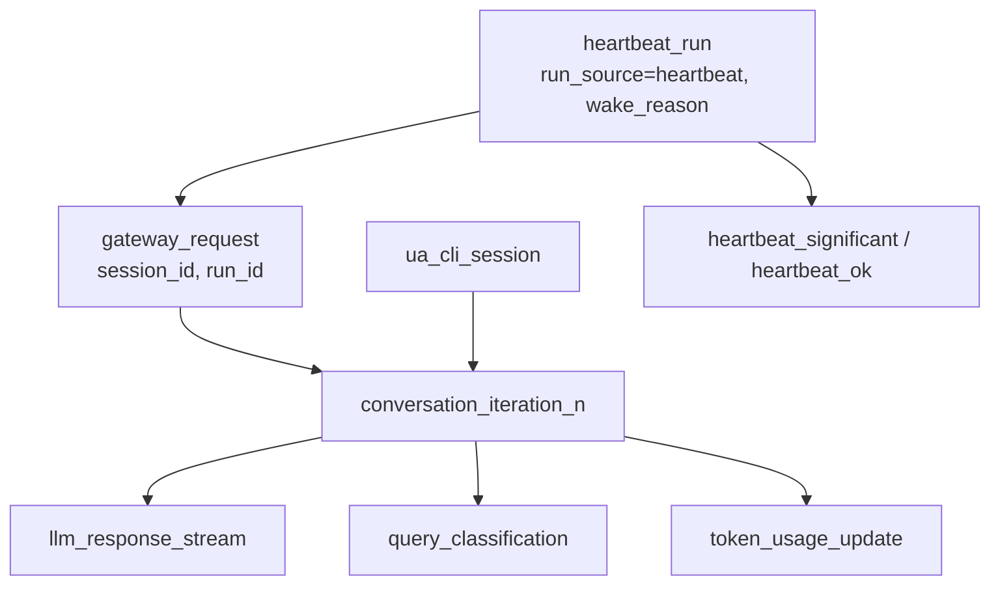
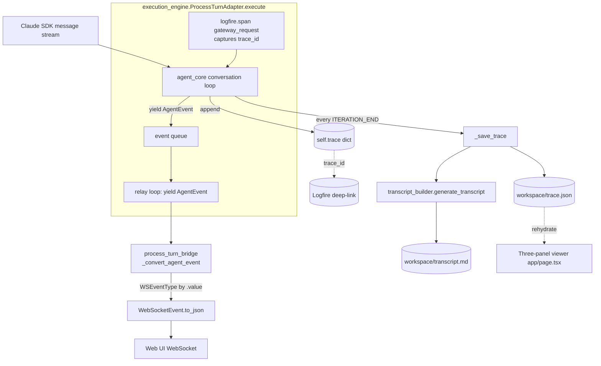

# Event Streaming & Tracing

Universal Agent has **one event vocabulary** that flows through the entire stack: the agent core emits in-process `AgentEvent` objects as it runs a turn; the gateway/engine relays those to clients as `WebSocketEvent`s over a WebSocket; and the same events are durably journaled into a per-workspace `trace.json` from which a human-readable `transcript.md` and the live "three-panel viewer" are rehydrated. Distributed tracing is layered on top via **Logfire** (Pydantic) so each turn carries a `trace_id` you can deep-link to.

This doc describes how those three concerns (live event stream, durable trace, Logfire deep-links) are wired together.

## The core type: `AgentEvent`

`agent_core.py::AgentEvent` is a dataclass with three fields — `type` (an `EventType` enum), `data` (a free-form dict), and `timestamp` (epoch float, defaulted to `time.time()`). Everything the agent surfaces to the outside world is one of these.

The producer-side enum lives at `agent_core.py::EventType`:

```python
class EventType(str, Enum):
    TEXT = "text"
    TOOL_CALL = "tool_call"
    TOOL_RESULT = "tool_result"
    THINKING = "thinking"
    STATUS = "status"
    HEARTBEAT = "heartbeat"
    AUTH_REQUIRED = "auth_required"
    ERROR = "error"
    SESSION_INFO = "session_info"
    ITERATION_END = "iteration_end"
    WORK_PRODUCT = "work_product"
    URW_PHASE_START / URW_PHASE_COMPLETE / URW_PHASE_FAILED / URW_EVALUATION
    INPUT_REQUIRED = "input_required"
    INPUT_RESPONSE = "input_response"
```

`EventType` subclasses `str`, so `event.type.value` and the bare enum both serialize cleanly to wire JSON.

### Two enums, kept string-compatible by hand

There is a **parallel** `EventType` enum on the transport side: `api/events.py::EventType`. The transport enum is a superset — it re-declares all the producer events plus client→server control events (`QUERY`, `APPROVAL`, `PING`, `CANCEL`), server control events (`CONNECTED`, `QUERY_COMPLETE`, `CANCELLED`, `PONG`), and two extra server pushes (`SYSTEM_EVENT`, `SYSTEM_PRESENCE`). The bridge converts by string value, not by identity:

```python
# api/process_turn_bridge.py::_convert_agent_event  (also api/agent_bridge.py)
return WebSocketEvent(
    type=WSEventType(agent_event.type.value),   # <-- value round-trip
    data=agent_event.data.copy(),
    timestamp=agent_event.timestamp,
)
```

> [VERIFY: gotcha] Because the two enums are independent declarations matched only by `.value`, adding a new `agent_core.EventType` member without adding the same string to `api/events.EventType` makes `WSEventType(agent_event.type.value)` raise `ValueError` and the event silently fails conversion. Keep the two enums in sync.

## Where events are produced

Events originate inside `agent_core.py` during the conversation loop (the body that iterates the Claude SDK message stream). For each SDK message block the core both **appends to the trace dict** and **yields an `AgentEvent`**:

| SDK block | Trace mutation | Event yielded |
|---|---|---|
| `ToolUseBlock` | append to `trace["tool_calls"]` (`run_id`, `step_id`, `iteration`, `name`, `id`, `time_offset_seconds`, `input`) | `TOOL_CALL` |
| `TextBlock` | append to `trace["messages"]` (role `assistant`) | `TEXT` (and `AUTH_REQUIRED` if a `connect.composio.dev/link` is detected) |
| `ThinkingBlock` | append full thinking to `trace["messages"]` (role `assistant_thinking`) | `THINKING` (truncated `[:1000]` on the wire; full text persisted) |
| `ToolResultBlock` | append to `trace["tool_results"]` (`tool_use_id`, `is_error`, `content_preview[:8000]`, `content_size_bytes`) | `TOOL_RESULT` (`content_preview[:2000]` on the wire) |
| end of iteration | append to `trace["iterations"]` (`iteration`, `query[:200]`, `duration_seconds`, `tool_calls` count, `stop_reason`) | `ITERATION_END` |

Note the **deliberate truncation asymmetry**: the live wire event truncates aggressively (thinking `[:1000]`, tool result `[:2000]`) for transport, while the persisted trace keeps a larger slice (tool result `[:8000]`) so the rehydrated viewer can show the same collapsible detail the live UI showed.

### Context-local callbacks and dedup

There is a second emission path through `hooks.py` (PreToolUse / PostToolUse hooks) that emits `TOOL_CALL`/`TOOL_RESULT`/`ITERATION_END` events and final text. It uses `ContextVar`s so concurrent agent sessions in the same process don't cross-talk:

- `hooks.py::set_event_callback` stores the per-task callback in `_TOOL_EVENT_CALLBACK_VAR`.
- Per-context dedup sets (`_EMITTED_TOOL_CALL_IDS_VAR`, `_EMITTED_TOOL_RESULT_IDS_VAR`, `_EMITTED_ITERATION_END_VAR`) ensure each distinct tool-use id / iteration is surfaced to the UI only once even when a complex loop revisits it.
- `hooks.py::emit_text_event` is the normal streaming path for assistant text; the engine's final-text emit (`ITERATION_END` fallback in `execute`) is a fallback the gateway filters out when streaming was already seen.

## The trace dict and `trace.json`

The trace dict is initialized once per session in `agent_core.py` (the `setup_session`/engine init path). Its shape:

```python
self.trace = {
    "run_id": ...,
    "session_info": {"url", "user_id", "run_id", "timestamp"},
    "query": None, "start_time": None, "end_time": None,
    "total_duration_seconds": None,
    "tool_calls": [], "tool_results": [],
    "messages": [],          # full chat-replay record (user/assistant/thinking)
    "iterations": [],
    "token_usage": {"input": 0, "output": 0, "total": 0},
    "compact_boundary_events": [],
    "sdk_result_messages": [],
    "typed_task_messages": [],
    "context_pressure": {...},
    "logfire_enabled": bool(LOGFIRE_TOKEN),
}
```

`trace["query"]` and `trace["start_time"]` are filled when the turn begins; `trace["trace_id"]` is set from the Logfire span (see below).

`agent_core.py::_save_trace` is the persistence point. It is called on **every `ITERATION_END`** (so the trace is always current mid-run) and once more at end-of-conversation:

```python
def _save_trace(self):
    self.trace["end_time"] = datetime.now().isoformat()
    self.trace["total_duration_seconds"] = round(time.time() - self.start_ts, 3)
    trace_path = os.path.join(self.workspace_dir, "trace.json")
    json.dump(self.trace, open(trace_path, "w"), indent=2, default=str)
    transcript_builder.generate_transcript(self.trace, transcript_path)  # transcript.md
```

`trace.json` always lands at `<workspace_dir>/trace.json` (and `transcript.md` next to it). `trace_utils.py::write_trace` is a thin standalone helper that does the same `json.dump(..., indent=2, default=str)`; the canonical save path is `_save_trace`, which also generates the transcript.

> Gotcha: `_save_trace` swallows all exceptions with a `print("DEBUG CORE: Failed to save trace/transcript: ...")` — a failed transcript build will not crash the turn but also won't surface loudly. Grep the run log for that string when a transcript is missing.

## Transcript builder (`transcript.md`)

`transcript_builder.py::generate_transcript(trace_data, output_path)` is a **pure trace→markdown renderer** (a "Replay Studio"). It takes the trace dict (not the live event stream) and produces a human-readable timeline:

- A session-info header table (User ID, Trace ID, Logfire link, duration, start/end, iteration count).
- A per-iteration timeline ("Turn N") that matches `tool_calls` to `tool_results` by `tool_use_id`, renders inputs as collapsible JSON, picks an emoji icon from the tool name (`🏭` workbench/code, `🔎` search, `📨` email/slack, `🤖` task/sub-agent, `🛠️` default), and pulls a `thought` field out of tool input when present.
- A footer with a second Logfire link.

It contains defensive "smasher" logic for tool-result content because results in `trace.json` can be a Python-repr string of a list of `TextBlock`s (`"[{'type': 'text', 'text': '...'}]"`) with a JSON string nested inside. It tries `ast.literal_eval`, falls back to a regex, then attempts a `json.loads` unwrap, and truncates anything over 2000 chars with `... (truncated for transcript)`.

> [VERIFY: gotcha] The Logfire deep-link in `transcript_builder.py` is **hardcoded** to `https://logfire.pydantic.dev/Kjdragan/composio-claudemultiagent?q=...`. Unlike `trace_catalog.py::_logfire_url` and `main.py`, it does **not** read `LOGFIRE_PROJECT_SLUG`. If the project slug ever changes, transcript links go stale while catalog links stay correct.

## Logfire tracing

Logfire is configured once at process start. `agent_core.py::configure_logfire` is called from `server.py`:

```python
logfire.configure(
    service_name="universal-agent",
    environment="development",
    console=False,
    token=LOGFIRE_TOKEN,
    send_to_logfire="if-token-present",
    scrubbing=logfire.ScrubbingOptions(callback=scrubbing_callback),
    inspect_arguments=False,
)
logfire.instrument_mcp()
logfire.instrument_httpx(capture_headers=True)
logfire.instrument_sqlite3()
```

### Enablement / kill-switch

- `UA_DISABLE_LOGFIRE` in `{1,true,yes}` → `LOGFIRE_DISABLED=True`, no token resolved, Logfire off.
- Otherwise the token is resolved from the first present of `LOGFIRE_TOKEN`, `LOGFIRE_WRITE_TOKEN`, `LOGFIRE_API_KEY`. `send_to_logfire="if-token-present"` means no token → spans are created but not shipped.
- `execution_engine.py` independently computes `_LOGFIRE_AVAILABLE = bool(os.getenv("LOGFIRE_TOKEN") or os.getenv("LOGFIRE_WRITE_TOKEN"))` — note this engine-side check does **not** consider `LOGFIRE_API_KEY` nor `UA_DISABLE_LOGFIRE`, so the engine's gateway-span path keys off a slightly narrower condition than the core's.

### Scrubbing

`scrubbing_callback` whitelists known "preview" fields (`content_preview`, `input_preview`, `result_preview`, `text_preview`, `query`, `input`, anything containing `preview`) so they survive Logfire's default secret-scrubbing redaction. Without this, agent payloads would be over-redacted in the trace UI.

### trace_id capture (gateway path)

When a turn runs through the engine, `execution_engine.py::ProcessTurnAdapter.execute` opens a root span so `process_turn` inherits span context and the `trace_id` is captured:

```python
_gateway_span = logfire.span("gateway_request", session_id=..., run_id=..., run_source=...)
raw_tid = _gateway_span.get_span_context().trace_id
_gateway_trace_id_hex = format(raw_tid, "032x")
self._trace["trace_id"] = _gateway_trace_id_hex
```

The final `ITERATION_END` event prefers this gateway span `trace_id` over the SDK result's `trace_id` (which is often `None` on the gateway path): `effective_trace_id = _gateway_trace_id_hex or getattr(result, 'trace_id', None)`. The core also calls `logfire.set_baggage(run_id=...)` so the `run_id` rides along on spans.

The deep-link is built (in `trace_catalog.py::_logfire_url`, `main.py`, `bot/normalization/formatting.py`) as:

```
https://logfire.pydantic.dev/<LOGFIRE_PROJECT_SLUG>?q=trace_id%3D%27<trace_id>%27
```

with `LOGFIRE_PROJECT_SLUG` defaulting to `Kjdragan/composio-claudemultiagent`.

### Span hierarchy

Three top-level span shapes exist depending on how the turn was initiated (span names verified in code):

- **CLI runs** — root `ua_cli_session` (`main.py`), children `conversation_iteration_{n}` (`main.py`), each wrapping `llm_response_stream` (`agent_core.py`) plus `query_classification`, `token_usage_update`, and auto-instrumented HTTPX/Anthropic spans.
- **Gateway runs** (Web UI / heartbeat) — root `gateway_request` (`execution_engine.py::ProcessTurnAdapter.execute`), which captures the `trace_id` (fixing the historical "trace ID N/A" on the gateway path), then the same `conversation_iteration_{n}` subtree.
- **Heartbeat runs** — `heartbeat_service.py` wraps the gateway run in a `heartbeat_run` parent span carrying `run_source=heartbeat` and `wake_reason`, then classifies the outcome with a `heartbeat_significant` (did real work) or `heartbeat_ok` (no-op check-in) marker.



`gateway_server.py` adds FastAPI auto-instrumentation via `logfire.instrument_fastapi(app)`.

### Trace catalog

After a run, `trace_catalog.py` emits a **Trace Catalog** to three places: the run.log/stdout (a structured block of trace IDs + query hints), the `trace_catalog` key inside `trace.json`, and a standalone `trace_catalog.md` in the workspace (plus `work_products/logfire-eval/trace_catalog.{md,json}` as the preferred input for the `logfire-eval` skill). It carries the main agent trace ID + Logfire URL, any local-toolkit (MCP server) trace IDs, run id/source, and an analysis guide. `trace_catalog.py::_logfire_url` honors `LOGFIRE_PROJECT_SLUG`.

### Querying / analysis

Query Logfire by `run_id` (preferred) or `trace_id`, never by time window alone:

```sql
SELECT * FROM records WHERE attributes->>'run_id' = '{RUN_ID}'
SELECT * FROM records WHERE trace_id = '{TRACE_ID}'
```

The `.claude/skills/logfire-eval/` skill teaches agents a structured analysis loop (discovery → health → exceptions → bottlenecks → tools → pipeline → token/cost → heartbeat → report), with parameterized queries in `references/sql_queries.md` and a `references/span_catalog.md`.

> Note: an earlier doc listed `logfire.instrument_anthropic()` in the configure block. That call is **not** in the code — `configure_logfire` only calls `instrument_mcp()`, `instrument_httpx(capture_headers=True)`, and `instrument_sqlite3()`. Anthropic SDK spans arrive via auto-instrumentation / the LangSmith bridge, not an explicit `instrument_anthropic`.

### Fail-open stub and observability health mode

Observability must never crash service startup. `src/universal_agent/__init__.py` enforces two things at import time:

- **Pydantic plugin disable.** It appends `logfire-plugin` to `PYDANTIC_DISABLE_PLUGINS` so Pydantic v2 doesn't implicitly load the Logfire plugin as a hard startup dependency. UA configures Logfire explicitly instead.
- **Fail-open stub.** If `import logfire` fails, the package installs a no-op `logfire` stub so gateway/API/Telegram/VP workers degrade observability rather than entering a restart loop.

A process-level `_LOGFIRE_RUNTIME_STATE` tracks the live mode, surfaced on health endpoints as an `observability` object:

| `mode` | Meaning |
|---|---|
| `real` | Real `logfire` imported and a token is present |
| `stub` | `import logfire` failed; fail-open no-op stub installed |
| `disabled` | Real `logfire` imported but no token configured |

Plus `token_present` (bool), and on stub fallback `error`/`reason` (exception class + detail). This is intentionally **separate from process health** — a service can be operationally healthy while reporting `mode=stub`.

### Deploy-time observability preflight

Deploys prove the target `.venv` can load real tracing before any restart, via `scripts/validate_runtime_bootstrap.py`, `scripts/verify_observability_runtime.py`, and `scripts/verify_service_imports.py`. The observability check verifies `import opentelemetry.context` and `import logfire` succeed, the `contextvars_context` OTel entry point is present, and the imported `logfire` is **not** the fail-open stub. On failure after the first `uv sync`, deploy deletes `.venv`, does one clean rebuild, reruns validation, and aborts before restart if real tracing still won't import.

### LangSmith → Logfire OTel bridge

If `LANGSMITH_API_KEY` is set, `configure_logfire` routes Claude-SDK LangSmith traces through OpenTelemetry into Logfire (sets `LANGSMITH_OTEL_ENABLED/OTEL_ONLY/TRACING=true`, `LANGSMITH_PROJECT` default `"Universal Agent"`). This is OTel-only — traces do not go directly to LangSmith.

## End-to-end flow



## The relay loop and wall-clock cap

`ProcessTurnAdapter.execute` runs `process_turn` inside an `asyncio` task (`run_engine`) that pushes events onto an `event_queue`; the outer generator drains that queue and `yield`s each `AgentEvent` to the client. Completion is signaled by a sentinel `STATUS` event with `data["status"] == "engine_complete"`.

A **wall-clock cap** bounds each turn (resolved in priority order):
1. Per-request `request_metadata["turn_timeout_seconds"]` (e.g. cron jobs with a generous `timeout_seconds`).
2. `UA_PROCESS_TURN_TIMEOUT_SECONDS` (legacy global override).
3. Tier-aware default keyed off the configured model (haiku ≈ 120s, sonnet ≈ 180s, opus ≈ 1800s).
4. No cap (`0`).

On timeout the engine cancels the task and emits an `ERROR` event (`"Execution timed out after Ns"`). The rationale (from inline comments): an unbounded turn parks a failing inference call on the wire for minutes, which blocks the dispatcher's stuck-assignment sweep from reopening the task. A clean cap lets the task abort, the stuck sweep catch it, and the next dispatch tick re-run it.

`event_callback` defensively `setdefault("source", run_source)` on `STATUS` events so background runs (e.g. `run_source="heartbeat"`) don't trigger "ABORT"/redirect UX in the Web UI.

## Run log vs. trace

Separately from `trace.json`, the engine optionally redirects subprocess stdio into `<workspace>/run.log` (`USE_PROCESS_STDIO_REDIRECT`) and writes plain-text breadcrumbs per event (`👤 USER`, `🤖 ASSISTANT`, `🛠️ TOOL CALL`, `📦 TOOL RESULT`, `ℹ️ STATUS`, `❌ ERROR`). On engine error, the last ~4KB of `run.log` is read and attached to the `ERROR` event's `log_tail` field so failures surface context without huge payloads.

## Rehydration / viewer

There is **no** server-side `hydrate()` step anymore. Per `viewer/__init__.py`, the production three-panel UI lives in `web-ui/app/page.tsx` and rehydrates **directly** from `trace.json` + `run.log`. The Python `viewer` package now only exposes `resolve_session_view_target()` to normalize `session_id` / `run_id` / `workspace_dir` identity hints into a `SessionViewTarget`; producers then navigate to `app/page.tsx?session_id=...&run_id=...`. The `messages` array in the trace is what drives the chat panel client-side (`extractHistoryFromTraceJson`), which is why assistant text and thinking blocks are persisted there in full.

## Related artifacts in the same workspace

`trace.json` is one of several canonical per-workspace files referenced by `workspace_catalog.py`, `cron_service.py`, and `run_workspace.py`. Companions include `transcript.md`, `run.log`, `heartbeat_state.json`, and `trace_catalog.md` (the latter produced by `trace_catalog.py::save_trace_catalog_work_product`, which catalogs Logfire span categories like skill routing, query classification, token accounting, and raw HTTPX LLM calls). The local-toolkit bridge surfaces these (`tools/local_toolkit_bridge.py`).

## Env vars / flags summary

| Var | Effect | Default |
|---|---|---|
| `UA_DISABLE_LOGFIRE` | Disables Logfire entirely (no token, no spans shipped) | unset (enabled if token present) |
| `LOGFIRE_TOKEN` / `LOGFIRE_WRITE_TOKEN` / `LOGFIRE_API_KEY` | Logfire write token (first present wins) | none |
| `LOGFIRE_PROJECT_SLUG` | Slug used to build trace deep-links (honored in `trace_catalog.py`/`main.py`, NOT `transcript_builder.py`) | `Kjdragan/composio-claudemultiagent` |
| `LANGSMITH_API_KEY` | Enables LangSmith→OTel→Logfire SDK trace bridge | none (bridge off) |
| `turn_timeout_seconds` (per-request metadata) | Per-turn wall-clock cap, highest priority | 0 (none) |
| `UA_PROCESS_TURN_TIMEOUT_SECONDS` | Legacy global per-turn wall-clock cap | 0 |
| `USE_PROCESS_STDIO_REDIRECT` | Redirect subprocess stdio into `run.log` | (engine constant) |

## Gotchas (code-verified)

- **Two `EventType` enums, matched by string value.** A new producer event must also be added to `api/events.py::EventType` or `WSEventType(...)` conversion raises.
- **Truncation asymmetry is intentional.** Wire events truncate (thinking 1000, tool result 2000); persisted trace keeps more (tool result 8000). Don't "fix" one to match the other without understanding the transport-vs-replay distinction.
- **`transcript_builder` hardcodes the Logfire slug** while `trace_catalog`/`main.py` honor `LOGFIRE_PROJECT_SLUG`. [VERIFY: a slug change would silently desync transcript links.]
- **`_save_trace` is swallow-on-error.** Missing `trace.json`/`transcript.md` shows up only as a `DEBUG CORE:` print, not an exception.
- **Engine `_LOGFIRE_AVAILABLE` is a narrower check** than the core's token resolution (ignores `LOGFIRE_API_KEY` and `UA_DISABLE_LOGFIRE`).
- **`ToolResultBlock` handling in the message loop is partially stubbed** (`pass` with a comment about omitted sub-agent speech extraction); the durable result record is appended in the dedicated result-block branch, not the message-block branch.
