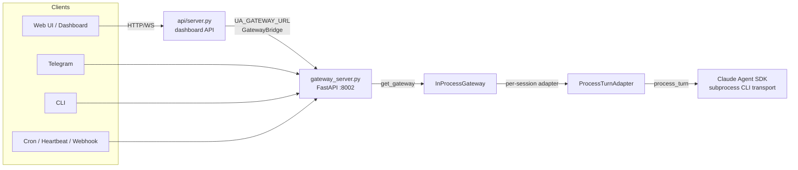
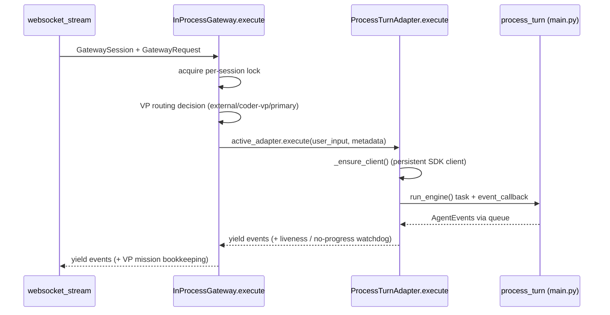

# Gateway, Sessions & Execution

This document describes the **execution core** of Universal Agent: how a user
turn (from the dashboard, Telegram, a cron job, a heartbeat, or a webhook) gets
turned into a Claude Agent SDK run, how sessions are created/locked/reaped, how
events stream back over WebSocket, and where the timeout knobs live.

Every client path — interactive Web UI, CLI, Telegram, autonomous loops —
funnels through the **same canonical engine** (`ProcessTurnAdapter`, which wraps
the CLI's `process_turn()`). That uniformity is the whole point of this layer:
"all clients use the same execution path."

## Component map

| Layer | File / symbol | Responsibility |
|---|---|---|
| Abstract protocol | `gateway.py::Gateway` | Interface: `create_session`, `resume_session`, `execute`, `run_query`, `list_sessions`, MCP controls |
| In-process impl | `gateway.py::InProcessGateway` | Owns adapters, sessions, per-session locks, VP routing, session reaper, durable DB conns |
| External client | `gateway.py::ExternalGateway` | Talks to a remote gateway over HTTP/WS (same protocol surface) |
| Engine adapter | `execution_engine.py::ProcessTurnAdapter` | Wraps `process_turn()`, owns the persistent Claude SDK client, emits `AgentEvent`s, enforces the per-turn liveness / no-progress watchdog |
| Engine config | `execution_engine.py::EngineConfig` | `workspace_dir`, `user_id`, `force_complex`, `max_iterations`, `run_id`, `extra_disallowed_tools` (no `model` field) |
| HTTP/WS service | `gateway_server.py` | FastAPI app exposing `/api/v1/sessions*` REST + the `/stream` WebSocket; `get_gateway()` singleton; `ConnectionManager`; lifespan |
| Dashboard API | `api/server.py` | The *Web-UI* FastAPI app. Proxies to the gateway via `UA_GATEWAY_URL` + `GatewayBridge` |
| Web-UI bridge | `api/gateway_bridge.py::GatewayBridge` | Thin REST+WS proxy from the dashboard API to the gateway service |
| Timeout policy | `timeout_policy.py` | Centralized env-driven timeout/WS-tuning knobs |

There are **two FastAPI apps**, do not conflate them:

- `gateway_server.py` is the **gateway service** (default port `8002`, env
  `UA_GATEWAY_PORT`). It holds the real `InProcessGateway` singleton and runs
  execution in-process. This is where turns actually run.
- `api/server.py` is the **dashboard / Web-UI API**. When `UA_GATEWAY_URL` is
  set it does *not* execute anything itself — it constructs a `GatewayBridge`
  and forwards REST session calls + the WebSocket stream to the gateway service.

## Core dataclasses (`gateway.py`)

- `GatewaySession` — `session_id`, `user_id`, `workspace_dir`, `metadata`,
  and `pending_inputs` (futures awaiting interactive input).
- `GatewayRequest` — `user_input`, `force_complex`, `metadata`. The `metadata`
  dict is the carrier for almost every per-turn knob: `source`, `run_kind`,
  `delegate_vp_id`, `turn_timeout_seconds`, `memory_policy`, `system_events`,
  `codebase_root`, `trace_id`, etc.
- `GatewayResult` — aggregated result of `run_query`: `response_text`,
  `tool_calls`, `execution_time`, `code_execution_used`, `trace_id`, and a
  `metadata` dict carrying `auth_required` / `auth_link` / `errors`.

## Session lifecycle

### Create (`InProcessGateway.create_session`)

Holds the **global execution lock** (`_timed_execution_lock("create_session")`)
because it mutates the shared `_adapters` / `_sessions` dicts. Steps:

1. Resolve `session_id`. If none given, generate `session_<timestamp>_<hex8>`.
2. Resolve workspace: explicit `workspace_dir` (resolved absolute) or
   `<workspace_base>/<session_id>`. `workspace_base` defaults to
   `AGENT_RUN_WORKSPACES` (see `EngineConfig` / `InProcessGateway.__init__`).
3. `mkdir` workspace + `work_products/`, then `seed_workspace_bootstrap()`.
4. Historical quirk preserved: if `workspace_dir` is given but no explicit
   `session_id`, the **workspace directory name becomes the session id**.
5. Build `EngineConfig`, construct `ProcessTurnAdapter`, `await adapter.initialize()`.
6. Stash adapter in `_adapters[session_id]`, session in `_sessions[session_id]`.

The REST entrypoint is `gateway_server.py::create_session` (`POST
/api/v1/sessions`). It enforces `_require_session_api_auth`, the allowlist
(`is_user_allowed`), sanitizes workspace/codebase/session-id inputs, attaches a
session policy, and registers the session with runtime services
(heartbeat/todo-dispatch). In the `vps` profile a non-empty `user_id` is
**required**.

### Resume (`InProcessGateway.resume_session` → `_resume_session_new`)

If the adapter already exists it's returned as-is. Otherwise it reconstructs the
session from disk using the "workspace dir == session_id" convention, builds a
fresh adapter, and backfills `active_run_id` from `RunCatalogService` when not
already known. WebSocket attach (`websocket_stream`) calls `resume_session`
lazily when a client connects to a session not currently in memory.

### Register externally provisioned sessions

`register_existing_session` exists for **daemon sessions** (Simone heartbeats,
etc.) that are created outside the normal create/resume flow but still need to
participate in execution, listing, and adapter lifecycle.

### Close

> [VERIFY: real code bug] `InProcessGateway` defines `close_session` **twice**.
> The first definition (the detailed one with lock-held warnings, timed lock,
> adapter `teardown()`) is **shadowed** by a second, simpler definition later in
> the class body that only pops the adapter and calls `adapter.close()`. In
> Python the later definition wins, so the detailed close path is dead code. The
> session reaper and ops endpoints therefore use the *simpler* `close_session`
> (pop adapter → `adapter.close()` → pop session). Worth consolidating.

`InProcessGateway.close()` (whole-gateway teardown) releases the CODER VP lease,
closes the VP adapter, closes all session adapters, closes the legacy bridge,
and closes the three durable DB connections.

### Session reaper — activity-based TTL

`InProcessGateway` runs a background reaper (`start_reaper()` /
`_session_reaper`) that closes **inactive** sessions. It never reaps sessions
that are currently executing (per-session lock held), and never reaps
`daemon_*` sessions. Interactive user sessions are reaped only after long
inactivity; workspace files on disk survive — only the in-memory session +
adapter are released. On close it fires `_generate_dossier_on_close` in the
background (writes `context_brief.md`).

TTL classes (`_reaper_ttl_seconds`), keyed off `metadata["source"]`:

| Source class | Default TTL | Env override |
|---|---|---|
| `cron` / `heartbeat` / `webhook` / `hooks` / `ops` / `system` | 600 s (10 min) | `UA_SESSION_ADMIN_TTL_SECONDS` |
| `vp_mission` / `vp.coder` / `vp.general` | 900 s (15 min) | `UA_SESSION_VP_INACTIVITY_TTL_SECONDS` |
| `user` (interactive) | 3600 s (1 h) | `UA_SESSION_USER_TTL_SECONDS` |

Reaper poll interval: `UA_SESSION_REAPER_INTERVAL_SECONDS` (default 60 s, min
30 s). Activity is stamped on each `run_query` start *and* completion via
`session.metadata["last_activity_at"]`, so the reaper measures from the end of
the most recent turn.

### Live sessions vs. durable runs

Do not conflate the two models:

- A **live execution session** (`GatewaySession`, in-memory + workspace dir) is
  the WebSocket-attachable, turn-executing object this document is mostly about.
- A **durable run** (run/attempt model, run catalog) is the persistent logical
  workflow record. A run may be linked to a live session via
  `provider_session_id` (set on each turn in `websocket_stream`).
  `_resume_session_new` backfills `active_run_id` from
  `RunCatalogService.find_latest_run_for_provider_session`, and the WS
  `connected`/`query_complete` payloads expose `run_id` via `_session_run_id`.

The gateway server also exposes durable-run endpoints (`/api/v1/ops/runs*`) and
hosts many other subsystems (webhooks/`HooksService`, cron, heartbeat,
AgentMail WS listener, factory fleet, delegation Redis bus, CSI ingest). Those
are out of scope here; this doc covers the session/execution core.

## Per-session vs. global locking

This is the most important concurrency invariant in the gateway:

- `_execution_lock` (one global `asyncio.Lock`) serializes **session
  create/resume/close** — the operations that mutate the shared `_adapters` /
  `_sessions` dicts. Wrapped by `_timed_execution_lock(operation)` which records
  rich lock telemetry (wait/hold totals, peak waiters, in-flight count) exposed
  via `execution_runtime_snapshot()`.
- `_session_exec_locks[session_id]` (one lock per session) serializes **turns
  within a single session** so two turns can't interleave, while allowing
  **different sessions to execute concurrently**.
- `_coder_vp_lock` (dedicated) guards the single-lane CODER VP shared adapter.

Inside `execute()`, the per-session lock is taken first. If the adapter is
missing it briefly grabs the global lock (`"resume_in_execute"`) only long
enough to resume/create the adapter, then releases it — so a slow resume of one
session doesn't block turns on other sessions.

A subtler constraint on true in-process parallelism: the underlying CLI engine
(`main.py`) still reads/writes **module-level globals** (`run_id`, `tool_ledger`,
`trace`, `budget_state`) — `gateway.py` does not serialize all `execute()` calls,
so per-session locks *do* let distinct sessions run concurrently, but those
shared CLI globals mean concurrent in-process turns can still cross-contaminate
run-scoped state. The durable answer is a per-session `SessionContext` refactor
(still a future milestone). Until then, real isolation comes from running heavy
work in separate VP worker *processes*, and pushing in-process concurrency too
high (e.g. raising VP worker concurrency) risks asyncio event-loop starvation.

## Execute / run_query flow

`run_query` is the high-level "run one turn and return a `GatewayResult`"
helper; it drives `execute()` and aggregates events. `execute()` is the
streaming generator that yields `AgentEvent`s.

### `run_query` extras

- **Sync-ready marker**: writes `sync_ready.json` into the workspace at
  `in_progress` / `completed` / `failed`. Toggle with
  `UA_RUNTIME_SYNC_READY_MARKER_ENABLED` (default on),
  `UA_RUNTIME_SYNC_READY_MARKER_FILENAME` (default `sync_ready.json`).
- **Source persistence for the reaper**: automation-owned sessions get their
  canonical `source` stamped onto `session.metadata` so the reaper applies the
  right TTL; interactive sessions keep their long-lived classification even if a
  later background heartbeat/system-event arrives.
- **Best-effort memory sync** after each query (if `memory_enabled()`), so
  session memories aren't lost if the browser closes / process is killed.
- Aggregates `auth_required` / `auth_link` from `AUTH_REQUIRED` events and
  `errors` from `ERROR` events into `GatewayResult.metadata`.

### VP routing (inside `execute`)

Before running on the primary (Simone) path, `execute()` may delegate:

1. **Explicit VP language** in the prompt (`coder vp`, `codie`, `general vp`,
   `vp.coder.primary`, …) is detected by `_infer_explicit_vp_target`, **but only
   for sources where prompt-inference is allowed**. `_allow_prompt_inferred_vp_routing`
   blocks inference for `cron` / `webhook` / `heartbeat` / `task_run` /
   `email_hook` / `todo_dispatcher` sources and `heartbeat*` run kinds.
2. **External VP dispatch** (`_dispatch_external_vp_mission` → DB mission ledger
   in the dedicated VP DB) is the default for explicit VP intent unless disabled
   via `UA_VP_EXTERNAL_DISPATCH_ENABLED=0`. Requires `vp_dispatch_mode == "db_pull"`.
   Before dispatch it checks worker health (`_ensure_external_vp_worker_ready_with_retry`)
   — status must be operational AND have a live lease or fresh heartbeat
   (`vp_worker_heartbeat_stale_seconds`, default 180 s).
   - `require_external_vp` strict mode: dispatch failure **blocks** the
     Simone-direct fallback and emits an ERROR. Non-strict falls back to primary.
3. **CODER VP local lane** (`_ensure_coder_vp_adapter`, single-lane, lease-owned
   by `simone-control-plane`) for code-writing intent when external dispatch is
   off. The lease is heartbeated every 60 s during execution; a failed heartbeat
   degrades to the primary path. Mission outcome is recorded
   (`mark_mission_completed` / `mark_mission_fallback` / `mark_mission_failed`).

The dispatch-gate `if` deliberately **excludes** `todo_dispatcher` from the
blocked-source set even though it's in `_PROMPT_INFERRED_VP_BLOCKED_SOURCES`,
because the todo dispatcher may legitimately carry an explicit `delegate_vp_id`
from LLM routing. Do not "simplify" by replacing the inline set with the
constant — there's a comment in the code warning exactly about this.

## ProcessTurnAdapter — the canonical engine

`ProcessTurnAdapter` (in `execution_engine.py`) is where the turn actually runs.

- `initialize()` calls the CLI's `main.setup_session(...)` with
  `attach_stdio=False`, so the gateway path uses **identical** initialization to
  the CLI. It captures SDK `options`, `session`, resolved `user_id` /
  `workspace_dir`, and the `trace` dict.
- `_ensure_client()` lazily constructs and enters a **persistent**
  `ClaudeSDKClient` over a `SubprocessCLITransport`. The client is reused across
  turns of the same session. If `extra_disallowed_tools` changed since last
  init, it resets+reinitializes first.
- `execute()` runs `process_turn()` inside an `asyncio.Task` (`run_engine`),
  pumping `AgentEvent`s through an `asyncio.Queue` to the caller. It emits an
  opening `SESSION_INFO` + `STATUS{processing}`, then streams text/tool/etc.
  events, and finishes with an `ITERATION_END` carrying `duration_seconds`,
  `tool_calls`, `trace_id`, and `stop_reason`.

### Liveness / no-progress timeout (NOT a hard wall-clock cap)

**The canonical convention for ALL agent-execution lanes.** A turn is killed
only when it is genuinely stuck — **never** at an arbitrary wall-clock cap. Long
coding/build turns legitimately exceed 30 min, so an arbitrary cap kills live,
productive work (it caused the ≈13 h Simone daemon stall on 2026-06-14, where a
session pinned to `glm-5.1` fell through to a 180 s sonnet cap and every long
work turn was killed). The policy lives in **`timeout_policy.py::LivenessWatchdog`**
and is shared by all three lanes so the convention can't drift:

- in-process `execution_engine.py::ProcessTurnAdapter.execute` (Simone heartbeat
  / daemon + in-process VP coder),
- the VP SDK consumer `vp/clients/base.py::consume_adapter_events_with_idle_timeout`,
- the `claude --print` subprocess `vp/clients/claude_cli_client.py::_monitor_cli_output`.

`LivenessWatchdog` kills a turn only when **one** of these holds:

1. **No sign of life** (no event/output) for `idle_kill_seconds`
   (`process_turn_idle_kill_seconds()`, env `UA_PROCESS_TURN_IDLE_KILL_SECONDS`,
   default 600 s) **AND no tool is in flight**. A long build/test emits a
   `tool_call` then nothing until its `tool_result` minutes later, so that gap
   is **exempt** — the watchdog tracks `tools_in_flight` (+1 on
   `EventType.TOOL_CALL`, −1 on `TOOL_RESULT`, floored at 0) and only the
   inference-wait counts as idle. Tools carry their own timeouts.
2. **Absolute backstop** exceeded (`process_turn_absolute_backstop_seconds()`,
   env `UA_PROCESS_TURN_ABSOLUTE_BACKSTOP_SECONDS`, default 7200 s = 2 h) — a
   last resort for a fully-wedged process where even tool timeouts fail.
3. An **explicit caller hard cap** is exceeded: per-request
   `metadata["turn_timeout_seconds"]` (a cron's per-job budget, plumbed by
   `cron_service`), else legacy `UA_PROCESS_TURN_TIMEOUT_SECONDS`
   (`process_turn_timeout_seconds()`, default `0` = none). This is opt-in and is
   an *additional* ceiling on top of idle — never the implicit tier default that
   used to kill Simone.

The poll loop calls `watchdog.note_activity(...)` on every event and checks
`watchdog.overdue()` (returns a kill reason or `None`); `seconds_until_due()`
sizes a poll/readline timeout so the loop never oversleeps a deadline. On kill
the engine task is cancelled and an `ERROR` event (`"Execution killed: <reason>"`)
is yielded; the dispatcher's stuck-assignment sweep catches the freed task and
the next tick re-runs in ~10 s. The token-capture `finally` in `run_engine`
still records the (partial) turn on cancellation.

`execution_engine.py::_tier_for_model` is retained (it maps any `glm-5.x`
flagship → opus, robust to opus version bumps; guard
`tests/unit/test_execution_engine_tier_resolution.py`) but is now only an
informational label in the liveness log line — it no longer drives a kill.

> **Rule for the next person who reaches for an agent-execution timeout:** use
> `LivenessWatchdog` (idle / no-progress + backstop), **never** a bare
> wall-clock cap. Guards: `tests/unit/test_liveness_watchdog.py` (DOES kill an
> idle turn; does NOT kill one emitting events past the old cap; tool-in-flight
> exemption) and `tests/unit/test_vp_sdk_idle_timeout.py`.

### Self-healing client resets

`run_engine` resets the persistent SDK client (so the next turn gets a clean
one) when it catches `BudgetExceeded` / `CircuitBreakerTriggered`, or a
**terminated-process error** (`_is_terminated_process_error` matches `sigterm`,
`exit code -15`, "cannot write to terminated process", etc.) — common during
service restarts.

### E2BIG / env sanitization

The SDK transport builds the child process env from the **process-global**
`os.environ`. Spawning the CLI subprocess with a huge env risks `E2BIG`
(Linux ARG_MAX ~2 MB). `_temporary_sanitized_process_env()` wraps only the
`transport.connect()` call: it snapshots `os.environ`, calls
`sanitize_env_for_subprocess()`, spawns, then **restores the parent env in a
`finally`** (so the gateway keeps its runtime secrets).

The snapshot/restore scoping is load-bearing, not incidental: sanitization must
touch only the child-spawn window and never mutate the long-running parent
gateway env. Leaking the sanitization into the parent process caused a
`proxy_not_configured` production incident (the gateway lost a runtime var it
needed *after* spawning the child). This is also why ARG_MAX is the limit on
*total* env+argv — see the per-string `MAX_ARG_STRLEN` note below.

There are actually **two** distinct kernel limits at play. ARG_MAX (~2 MB, the
combined argv+envp budget) is what the env sanitization above defends. Separately,
`MAX_ARG_STRLEN` caps any **single** argument string at 128 KB — a hardcoded
kernel `#define` that no `ulimit`/systemd setting can raise (raising
`LimitSTACK` only moves the total `ARG_MAX` ceiling, not the per-string cap). A
system prompt larger than 128 KB therefore triggers `E2BIG` on subprocess spawn
regardless of how much total headroom exists; this is the kernel-level reason
behind prompt-density rules + progressive disclosure. Full treatment lives in the
model-resolution / prompt-architecture doc.

`sanitize_env_for_subprocess()` is a **blocklist**, not an allowlist: it strips
known-huge/irrelevant vars (`LS_COLORS`, `UA_SYSTEM_EVENTS_*`,
`CLAUDE_AGENT_CONVERSATION_HISTORY`, `BASH_FUNC_*`, `LESS_TERMCAP_*`) and only
falls back to stripping any single var >4 KB if total env still exceeds 1.5 MB.
This was a deliberate switch from the old allowlist, which kept breaking every
time a new Infisical-injected service key (e.g. `AGENTMAIL_API_KEY`) appeared.
Infisical secrets now pass through automatically.

### System events (Clawdbot parity)

Ephemeral out-of-band signals passed as `metadata["system_events"]` are written
to a temp file in the workspace and the path passed via `UA_SYSTEM_EVENTS_FILE`
(not stuffed into env vars — again to avoid E2BIG). The legacy
`UA_SYSTEM_EVENTS_JSON` / `UA_SYSTEM_EVENTS_PROMPT` env vars are explicitly
cleared. `_format_system_events_for_prompt` renders them as a `System: …`
preamble.

### Memory policy

`metadata["memory_policy"]` is translated into env overrides by
`_build_memory_env_overrides` (`UA_MEMORY_*` family) for the duration of the
turn via `_temporary_env`. Scope defaults to `direct_only`; sources default to
`memory,sessions`. `close()` flushes memory (`flush_pre_compact_memory` +
session index sync) before tearing down the client.

### Dynamic MCP

`get_mcp_status` / `add_mcp_server` / `remove_mcp_server` mutate the adapter's
SDK options and (since the current SDK lacks runtime attach) reset the client to
pick up the change. The gateway exposes these only when `dynamic_mcp_enabled()`
is true (default off).

## WebSocket streaming (`gateway_server.py`)

### Endpoints

- `@app.websocket("/api/v1/sessions/{session_id}/stream")` →
  `websocket_stream`. The canonical bidirectional stream.
- `@app.websocket("/ws/agent")` → `websocket_agent_compat`, a compatibility
  shim for the Next.js web-ui. `/ws/agent?session_id=<id>` delegates straight to
  `websocket_stream`. With **no** `session_id` (fresh tab) it enters **lobby
  mode** (`_websocket_lobby`): accepts the socket, services only `ping` until the
  client sends a real `execute`/`query`, then auto-creates a session and **hands
  off** to `websocket_stream(skip_accept=True)` (socket already accepted). The
  lobby defers session creation to avoid phantom idle sessions on the dashboard.
- The special session id `global_agent_flow` is an **observer** stream: it
  receives an annotated copy of every other session's broadcasts (see
  `ConnectionManager.broadcast`).

### Connection handshake (`websocket_stream`)

1. If `FACTORY_ROLE` gateway mode is `health_only` (LOCAL_WORKER), close 4403.
2. `_require_session_ws_auth` (unless `skip_accept` lobby handoff).
3. Validate `session_id` format (close 4000 on bad format).
4. `manager.connect()` (accepts the socket) or register without accept on lobby
   handoff.
5. Resolve session: in-memory → else `gateway.resume_session` (close 4004 if not
   found, 1011 on internal error).
6. Allowlist check on `session.user_id` (close 4003 if denied).
7. Send the `connected` event with session payload (nested + legacy flat
   aliases). If a turn is already running for the session, send a
   `processing`/reattach status.
8. Enter the receive loop.

### Inbound message types (receive loop)

| `type` | Effect |
|---|---|
| `execute` | run turn from `data.user_input` |
| `query` | run turn from `data.text` (legacy alias) |
| `input_response` | resolve a pending interactive input future |
| `cancel` | cancel the active execution task |
| `ping` | reply `pong` |
| `broadcast_test` | test fan-out |
| (`/btw …` prefix) | open/route a sidebar session |

### Outbound events

The stream's **terminal event** is `query_complete` (emitted by
`websocket_stream` after `gateway.execute(...)` drains; clients break on it).
Errors surface as `error` events; cancellation as `cancelled`.

`ConnectionManager` fans events out to all connections of a session (and to
`global_agent_flow` observers). Every send is bounded by
`WS_SEND_TIMEOUT_SECONDS` (`_send_text_with_timeout`); on timeout/failure the
connection is **evicted as stale** and metrics (`ws_send_timeouts`,
`ws_send_failures`, `ws_stale_evictions`) are incremented. This prevents one
wedged client from blocking the broadcast loop.

### Execution-task tracking & cancellation

`_register_execution_task(session_id, task)` stores the running turn's task in
`_session_execution_tasks`. For daemon sessions it also starts a
`_daemon_execution_timeout_watchdog`. `_cancel_execution_task` cancels and waits
(bounded) for unwind. `_cancel_session_execution` is the ops-level cancel:
cancels the task, marks the durable run `cancel_requested`, broadcasts a
`cancelled` event, and conditionally notifies (routine `daemon_idle_timeout`
reaps are suppressed; `daemon_execution_timeout` is dashboard-only — self-healing
so it doesn't email).

## Auth & access control (`gateway_server.py`)

- **Session API auth** (`_require_session_api_auth` / `_require_session_ws_auth`):
  required when `_DEPLOYMENT_PROFILE == "vps"` OR `SESSION_API_TOKEN` is set.
  Token resolution: `UA_INTERNAL_API_TOKEN` (falls back to `UA_OPS_TOKEN`).
  Tokens are read from `Authorization: Bearer`, `x-ua-internal-token`, or
  `x-ua-ops-token`. WS auth closes with code **4401** on unauthorized, **1011**
  if the token isn't configured at all.
- **Ops auth** (`_require_ops_auth`): JWT (module symbol `OPS_JWT_SECRET`, read
  from env var `UA_OPS_JWT_SECRET`) or legacy `UA_OPS_TOKEN`; gates
  `/api/v1/ops/*`. Legacy token usage logs a deprecation warning once.
- **Allowlist** (`is_user_allowed` / `UA_ALLOWED_USERS`): empty = allow all.
  Always allows local system/service accounts (`webhook`, `user_ui`, `user_cli`,
  `cron_system`, `vp.*`, `worker_*`, `cron:*`, …). Supports numeric Telegram IDs.

> [VERIFY: operational fact, code-confirmed] The gateway server's `__main__`
> entrypoint calls `initialize_runtime_secrets()` **before** uvicorn starts, so
> `UA_OPS_TOKEN` / `UA_INTERNAL_API_TOKEN` populate `os.environ` before any auth
> gate evaluates. This was added because the module-level `SESSION_API_TOKEN`
> resolved to `""` while `UA_DEPLOYMENT_PROFILE=vps` required auth, so every
> session WS handshake got closed and the dashboard showed "Gateway unreachable"
> (these tokens only ever lived in Infisical, never in deploy.yml's `.env`
> bootstrap dict).

## Server startup / lifespan

`gateway_server.py::lifespan`:
- `bootstrap_runtime_environment(profile=...)` (loads `.env` + Infisical),
  then **re-reads** `UA_DEPLOYMENT_PROFILE` from `os.environ` (the module-level
  read at import time runs before `.env` is loaded).
- Refreshes feature flags + ops auth config, optionally instruments Logfire.
- Optionally connects the Redis delegation mission bus (factory fleet).
- Registers daemon sessions, starts the session reaper (`start_reaper()`),
  initializes `OpsService`, todo dispatch, heartbeat services.
- On shutdown: `stop_reaper()`.

### Socket binding (restart-race hardening)

The `__main__` block does **not** call `uvicorn.run(host, port)` directly. It
manually creates the listen socket with `SO_REUSEADDR` **and** `SO_REUSEPORT`,
binds, listens, and passes the fd via `uvicorn.Config(fd=sock.fileno())`, with up
to 5 retry attempts on `EADDRINUSE`. Rationale (2026-05-16 incident): uvicorn
0.46.0's lifespan-then-bind ordering could leave a kernel-level orphan LISTEN
socket on :8002 after an unclean shutdown, wedging every subsequent restart with
`EADDRINUSE` and requiring a reboot. `SO_REUSEPORT` lets the next start co-bind
alongside an orphan (the kernel routes SYNs to whichever socket is actively
accepting). `SO_REUSEADDR` alone is insufficient.

- Port: `UA_GATEWAY_PORT` (default `8002`). Host: `UA_GATEWAY_HOST` (default
  `0.0.0.0`).

## ExternalGateway & GatewayBridge

`ExternalGateway` implements the same `Gateway` protocol against a **remote**
gateway over HTTP (`httpx`) + WebSocket (`websockets`). Auth headers come from
`UA_INTERNAL_API_TOKEN` / `UA_OPS_TOKEN`. It detects the right `websockets`
kwarg name (`additional_headers` vs `extra_headers`) across library versions.
`list_sessions()` raises (it's sync-only by interface) — use
`list_sessions_async()`.

`GatewayBridge` (`api/gateway_bridge.py`) is the dashboard API's proxy: it POSTs
to `/api/v1/sessions`, opens the `/stream` WebSocket, sends `execute`, and
**converts gateway event types into Web-UI `WebSocketEvent` types** via a
`type_map`. It filters `final=True` text events once streaming text has been
seen (avoids double-rendering the final assistant message).

## Timeout & WS-tuning knobs (`timeout_policy.py`)

All centralized here so they're discoverable. Each is env-driven with a default:

| Function | Env var | Default | Notes |
|---|---|---|---|
| `process_turn_idle_kill_seconds` | `UA_PROCESS_TURN_IDLE_KILL_SECONDS` | `600` | **Primary control.** Idle / no-progress kill (suspended while a tool is in flight). 0 disables. See `LivenessWatchdog`. |
| `process_turn_absolute_backstop_seconds` | `UA_PROCESS_TURN_ABSOLUTE_BACKSTOP_SECONDS` | `7200` | Last-resort ceiling for a fully-wedged turn (2 h). 0 disables. |
| `process_turn_timeout_seconds` | `UA_PROCESS_TURN_TIMEOUT_SECONDS` | `0` | Legacy explicit hard-cap escape hatch; 0 = none. The idle watchdog above is the default control. |
| `gateway_http_timeout_seconds` | `UA_GATEWAY_HTTP_TIMEOUT_SECONDS` | `60` | httpx client timeout |
| `gateway_owner_lookup_timeout_seconds` | `UA_API_GATEWAY_OWNER_TIMEOUT_SECONDS` | `20` | |
| `gateway_ws_handshake_timeout_seconds` | `UA_GATEWAY_WS_HANDSHAKE_TIMEOUT_SECONDS` | `20` | wait for `connected` event |
| `gateway_ws_send_timeout_seconds` | `UA_WS_SEND_TIMEOUT_SECONDS` | `8` | per-frame send cap; drives stale eviction |
| `session_cancel_wait_seconds` | `UA_SESSION_CANCEL_WAIT_SECONDS` | `10` | wait for task unwind on cancel |
| `telegram_task_timeout_seconds` | `UA_TELEGRAM_TASK_TIMEOUT_SECONDS` | `1800` | |
| `websocket_transport_tuning` | `UA_GATEWAY_WS_OPEN/CLOSE_TIMEOUT_SECONDS`, `UA_GATEWAY_WS_PING_INTERVAL/TIMEOUT_SECONDS` | `20`/`10`/`20`/`20` | `0`/`off`/`none`/`disabled`/`false` ⇒ `None` (disabled) |

`websocket_connect_kwargs(connect_callable)` introspects the `websockets`
version and only passes the tuning kwargs that the installed `connect` accepts —
defensive against the recurring `additional_headers`/`extra_headers` API churn.

## Gotchas (verified)

- **Two `close_session` definitions** in `InProcessGateway` — the later, simpler
  one shadows the detailed one. See [VERIFY] above.
- **Two FastAPI apps.** `gateway_server.py` executes; `api/server.py` proxies.
  Pointing the dashboard at the wrong port (or forgetting `UA_GATEWAY_URL`) is a
  classic "nothing runs" footgun.
- **`AGENT_RUN_WORKSPACES` is the gateway's workspace base, not the artifacts
  dir.** Diagnostic `find`/`ls` should use the canonical resolver, not assume a
  path. `GatewayBridge.get_session_file` reads files from `AGENT_RUN_WORKSPACES/<id>`.
- **Tier-aware timeout depends on the configured model string.** If a model id
  doesn't match either a ZAI map entry or contain a tier keyword, it defaults to
  sonnet (180 s). Long opus workflows must either run on a recognizable opus
  model id or set `metadata["turn_timeout_seconds"]`.
- **Env-var blocklist, not allowlist.** New Infisical service keys pass through
  to subprocesses automatically; don't reintroduce an allowlist.
- **`.env` is rewritten on every deploy.** Durable env values belong in code
  defaults or the deploy.yml bootstrap dict, not hand-edited on the VPS.
- **VP routing is source-gated.** Cron/heartbeat/webhook/task_run sources do not
  get prompt-inferred VP routing; `todo_dispatcher` is blocked from *inference*
  but allowed to carry an explicit `delegate_vp_id`.
- **The browser does not connect directly to the gateway WS.** In production the
  dashboard connects to `/ws/agent` on the API server (`api/server.py`), which
  validates dashboard auth/ownership and bridges into the gateway session stream
  (via `GatewayBridge` when `UA_GATEWAY_URL` is set). Local dev `:3000` and
  staging rewrite `/ws/agent` to the API bridge. The token-gated gateway WS is
  the *upstream*, not the browser's first hop.
- **No per-workspace filesystem ACL.** Run-workspace ownership under
  `AGENT_RUN_WORKSPACES` is enforced by convention at the API layer, not by the
  filesystem. Any process with read access to that tree can read another
  workspace's files. [VERIFY: still true — operational note carried from the
  2026-03-06 review.]
- **Gateway process resource limits (systemd).** `MemoryMax 8G`,
  `MemoryHigh 6G`, `TasksMax 500`, `OOMPolicy continue` — a child SDK subprocess
  OOM-kill is acceptable; the gateway survives. Prevents runaway memory + fork
  bombs from wedging the service. [VERIFY: lives in the systemd unit template +
  VPS override, not in this code; carried from gotcha inventory.]
- **Telegram bypasses the gateway session model.** It uses a Telegram-specific
  `tg_<user_id>` session-id scheme with checkpoint-reinjection rather than the
  create/resume flow here. Don't assume Telegram sessions behave identically.
