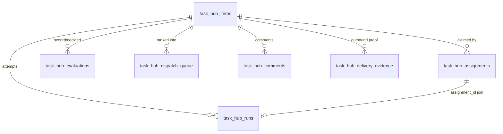
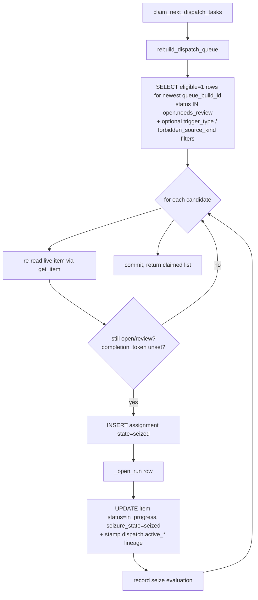

# Task Hub & Dispatch

The Task Hub is the durable work-queue substrate for the Universal Agent. It is
the single source of business identity for a unit of work ("a task"), the
ranking/eligibility engine that decides what an agent should pick up next, the
atomic claim ledger that prevents two workers from grabbing the same task, and
the retry/disposition state machine that decides whether a finished attempt
counts as "done", "needs human review", or "try again".

It is implemented almost entirely as plain SQLite tables and pure-Python
functions in `task_hub.py`. Around it sit four thin service modules that wire it
into the runtime:

| Module | Role |
|---|---|
| `task_hub.py` | Schema, scoring, queue rebuild, atomic claim, finalize/retry, action verbs, run helpers |
| `services/dispatch_service.py` | Four dispatch entry points (immediate / approval / scheduled / sweep) + Simone-first routing enrichment + top-of-sweep stale release |
| `services/todo_dispatch_service.py` | The in-process ToDo executor loop: claims via `dispatch_sweep`, allocates a per-task run workspace, runs the agent, then finalizes |
| `services/execution_run_service.py` | Allocates a run-scoped workspace + durable `runs` catalog entry per claimed task |
| `services/worker_exit_classifier.py` | Classifies owned-subprocess termination into clean-success / protocol-violation / failure buckets |
| `services/cron_task_hub_link.py` | Idempotently links a cron run to a perpetual Task Hub row + a fresh assignment per run |

## Where the data lives (gotcha)

The canonical Task Hub database is **`activity_state.db`**, resolved at runtime
via `durable/db.py::get_activity_db_path()`. It is **not**
`AGENT_RUN_WORKSPACES/task_hub.db` — that path is stale and prior handoff docs
named it incorrectly. Almost every caller opens it with
`connect_runtime_db(get_activity_db_path())`. `task_hub.ensure_schema(conn)` is
idempotent and is called at the top of nearly every public function, so any
connection to the activity DB is self-bootstrapping.

## Data model

`ensure_schema` (`task_hub.py::ensure_schema`) creates the tables below. It
also runs a long list of best-effort `ALTER TABLE ... ADD COLUMN` statements
wrapped in `try/except sqlite3.OperationalError: pass` — this is how the schema
migrates forward additively without a migration framework.



- **`task_hub_items`** — the durable task. Primary key `task_id`. Carries
  `source_kind`, `title`, `priority`, `due_at`, `status`, `must_complete`,
  `agent_ready`, `score`/`score_confidence` (cached from the last queue
  rebuild), `stale_state`, `seizure_state`, `trigger_type`,
  `completion_token`, per-task overrides `max_retries` / `cody_mode` /
  `max_runtime_seconds`, and a free-form `metadata_json` blob. The
  `metadata_json` is where most lifecycle bookkeeping lives — notably the
  `metadata.dispatch.*` sub-object.
- **`task_hub_assignments`** — the **claim ledger**. One row per claim attempt.
  Records `agent_id`, `workflow_run_id`, `workflow_attempt_id`,
  `provider_session_id`, `workspace_dir`, `state` (`seized` → `running` →
  terminal), `started_at`/`ended_at`, `result_summary`, `worker_pid`.
- **`task_hub_runs`** — per-attempt **outcome history** (Hermes Phase D).
  Parallel to the assignment ledger: the assignment row says "an attempt
  happened"; the run row says "here is what actually happened" (`outcome`,
  `summary`, `error`, `metadata_json`). Joined back via `assignment_id`.
  Additive — code paths work even if these rows are never written.
- **`task_hub_dispatch_queue`** — a **snapshot** of one ranking pass, keyed by
  `(queue_build_id, task_id)`. Holds `rank`, `eligible`, `skip_reason`. Fully
  rebuilt (`DELETE` + reinsert) on each `rebuild_dispatch_queue`.
- **`task_hub_evaluations`** — append-only audit of every scoring/claim/action
  decision (`decision` ∈ defer/seize/reject/complete/...).
- **`task_hub_comments`, `task_hub_question_queue`, `task_hub_workstreams`,
  `task_hub_settings`, `task_hub_notifications`, `task_hub_delivery_evidence`,
  `cody_token_usage`** — supporting tables (comments, operator Q&A, multi-task
  workstreams/missions, key-value settings, dedup notifications, outbound
  delivery proof, and per-mission Cody token telemetry).

### Statuses

```
open, in_progress, blocked, needs_review, completed, parked, cancelled,
delegated (VP is working it), pending_review (VP done, Simone sign-off),
scheduled (cron will fire at due_at)
```

`TERMINAL_STATUSES = {completed, parked, cancelled}`. Only `open` and
`needs_review` are claimable.

### Action verbs

`VALID_ACTIONS` (handled by `perform_task_action`):
`seize, reject, block, unblock, review, complete, park, snooze, delegate,
approve` plus the Hermes Phase B.1 "unstick" verbs `rehydrate, re_evaluate,
redirect_to, request_revision`.

The `complete` branch carries two evidence gates:

- **Email-delivery gate** (`_task_requires_verified_final_delivery`): tasks whose
  final channel is email route to `needs_review` when no verified outbound
  delivery exists.
- **Demo-lane completion-evidence gate** (`DEMO_LANE_COMPLETION_GATED_SOURCE_KINDS`
  = `tutorial_build`/`cody_demo_task`): a non-operator `complete` is honored only
  when `metadata.vp_terminal_status == "completed"` AND `metadata.demo_finalize.ok`
  is truthy — i.e. the VP worker's terminal sync (attestation guard +
  `tutorial_demo_finalize`) actually ran. Otherwise the task routes to
  `needs_review` with `completion_blocked_reason=completion_requires_demo_finalize`.
  Operator surfaces (`dashboard_operator`, `operator*` agent ids) bypass the gate.
  Added after the 2026-06-11 incident where Simone's rescue-evaluator completed a
  `tutorial_build` source task whose linked mission had failed
  (`missing_completion_attestation`), bypassing the entire P6 finalize. Guard
  tests: `tests/unit/test_demo_lane_completion_gate.py`.

## Scoring

`score_task` produces a `(score, confidence, judge_payload)` triple. The score
is a heuristic hybrid clamped to `1.0–10.0`, starting from a base of `4.2` and
adjusted by:

- `+2.8` must_complete, `+1.2` safety-critical label
- priority weight (`_priority_weight`) and due-urgency (`_due_urgency_score`)
- project-key bonus (`mission`/`immediate` `+0.6`; `memory`/`proactive`/`approval` `+0.3`)
- `+1.0` if it is a "system schedule" task (`_is_system_schedule_task`)
- historical-completion bonus, memory-relevance bonus (**memory-relevance is OFF
  by default** — see the performance gotcha below; gate
  `UA_DISPATCH_MEMORY_RELEVANCE_ENABLED`)
- staleness bonus by age (`+0.5`/`+1.0`/`+2.0` at 2h/6h/24h) — this is the
  anti-languish mechanism so old tasks naturally float up. The age basis is
  `created_at` (`score_task` reads `task.get("created_at")`), **not** last-touched
  `updated_at`, so a task that keeps getting re-evaluated still ages from its
  original creation.
- penalties: `-3.0` blocked, `-0.8` needs-review, `-2.0` if **not** agent_ready

Confidence starts at `0.58` and is nudged up by history/must_complete/blocked/
memory signals, clamped to `0.35–0.95`.

## Dispatch queue rebuild + ranking

`rebuild_dispatch_queue` is the heart of "what should run next". It:

1. Selects all non-terminal items.
2. Scores each, applies the stale policy (`_apply_stale_policy`), and may
   immediately park a task that has exceeded `stale_min_cycles` **and**
   `stale_min_age_minutes` (only when `UA_TASK_STALE_ENABLED` is on — **off by
   default**).
3. Computes `eligible` per item. Base rule:
   `eligible = agent_ready AND score >= agent_threshold`. Then overrides:
   - `blocked / in_progress / delegated / pending_review / scheduled` → always
     ineligible.
   - `needs_review` → ineligible **unless** it's a system-schedule task (operator
     directives shouldn't get trapped behind manual review).
   - `must_complete` open/review tasks → eligible if `agent_ready` (the score
     gate is bypassed).
   - **Anti-starvation gate:** a `needs_review` task whose
     `metadata.dispatch.last_disposition_reason` starts with `heartbeat_` or
     `todo_retry` is forced ineligible, so a task that landed in review via
     auto-retry-exhaustion can't loop forever.
   - **Retry-exhaustion guard:** if `dispatch.todo_retry_count >=
     todo_retry_limit`, force ineligible (covers a race where finalize reopens
     before the agent's block commits).
   - CSI tasks are only eligible when their inferred routing state is
     `agent_actionable`.
4. Records a `defer` evaluation per scored task (skipping the always-deferred
   statuses to avoid evaluation-row spam).
5. Sorts with `_sort_key` — a lexicographic tuple. Priority lanes, highest
   first:
   `immediate trigger → system_schedule → must_complete → approval-project →
   (user tasks before proactive) → score → priority → due_at → updated_at`.
   Note `proactive_signal`/`reflection` sources are deliberately ranked **below**
   user-originated work.
6. `DELETE`s the entire `task_hub_dispatch_queue` table and bulk-inserts the
   freshly ranked snapshot under a new `queue_build_id`.

Re-scoring on a rebuild deliberately does **not** bump `updated_at` (only true
lifecycle transitions do), so a task doesn't look "freshly touched" just because
the queue rebuilt.

`rebuild_dispatch_queue` is a **write path** (it `DELETE`s and bulk-inserts the
queue table). Dashboard/read endpoints must never call it: GET handlers and their
helpers (`overview`, `list_agent_queue`, `get_agent_activity`) should return the
latest stored snapshot rather than rebuilding inline. Driving a queue rebuild
from a read path was a documented dashboard read-path performance regression —
the fix is to read the snapshot, not to raise the proxy timeout.

### Rebuild cost is O(N tasks) — keep it off hot/boolean paths (2026-06-01 incident)

`rebuild_dispatch_queue` calls `score_task` for **every** non-terminal task, and
`score_task`'s memory-relevance bonus used to run a per-task
`memory.orchestrator.search()` unconditionally. On a ~320-task board that made a
single rebuild a **~14s synchronous block** on the asyncio event loop (measured:
14.4s with the per-task memory search, 2.6s without). Two things made this fatal:

1. `_memory_relevance_bonus` ran the memory search on every scored task. It is now
   **OFF by default**, gated behind `UA_DISPATCH_MEMORY_RELEVANCE_ENABLED`. The
   `+0.4` is an advisory ordering nudge; doing O(N) memory IO inside the synchronous
   rebuild is not worth it until relevance is precomputed off the hot path.
2. `gateway_server._task_hub_has_dispatch_eligible_items` ran a **full rebuild just
   to return a boolean**, and it fires on every autonomous-cron success
   (`_maybe_wake_heartbeat_after_autonomous_cron`). With `*/1` autonomous crons
   (at the time `atlas_direct_dispatch` and `simone_chat_auto_complete`; after M3
   retired the `atlas_direct_dispatch` cron, `simone_chat_auto_complete` is the
   remaining `*/1` autonomous coupling-wake cron) that was a 14s event-loop
   block per minute, which wedged the `daemon_simone_todo` dispatch loop and halted
   intel-brief authoring for ~20h. It now does a cheap indexed existence check over
   the persisted `score` column instead of rebuilding.

General rule: **never call `rebuild_dispatch_queue` from a boolean check, a
read/GET handler, or any per-event hot path.** Rebuild only from the actual claim
path (`claim_next_dispatch_tasks`) and the scheduled rebuild cadence.

## Atomic claiming

`claim_next_dispatch_tasks` is the workhorse claim path:



Key behaviors verified in code:

- **It always rebuilds the queue first**, then claims from that fresh snapshot.
- **Re-validation under the claim:** even though the candidate came from the
  eligible snapshot, each one is re-read with `get_item` and re-checked for
  `status IN {open, needs_review}` and a missing `completion_token` before the
  assignment is inserted. A set `completion_token` hard-blocks re-claim and logs
  a warning — this is the idempotency lock that stops a completed task being
  worked twice.
- **`forbidden_source_kinds`** plumbs into the SQL `NOT IN` filter. The ToDo
  dispatcher passes `["vp_mission"]` so it never claims VP visibility-mirror
  rows (defense-in-depth against the 2026-05-07 rogue-branch incident; the
  producer-side fix is `agent_ready=False` on the mirror).
- **`trigger_types`** filters by `task_hub_items.trigger_type`. `dispatch_immediate`
  uses this to claim only the task it just promoted to `immediate`.
- **`_session_id_from_agent_id`** derives `provider_session_id` from agent IDs
  like `heartbeat:<sid>` / `todo:<sid>` / `daemon_*` when not supplied.

`claim_task_for_agent` is the targeted companion for interactive/explicit intake
paths — same assignment + lineage write, but for one named task, then it
rebuilds the queue.

## Dispatch service entry points

`dispatch_service.py` provides four ways to trigger a claim, and enriches every
claimed task with Simone-first routing (`_enrich_with_routing` →
`agent_router.route_all_to_simone`, attaching a `_routing` dict with
`agent_id="simone"`). Simone is the primary orchestrator and decides delegation
herself.

- `dispatch_immediate(task_id)` — dashboard "Start Now". Promotes
  `trigger_type="immediate"` then claims it.
- `dispatch_on_approval(task_id)` — dashboard "Approve". Sets
  `open + human_approved + agent_ready=True`, then claims.
- `dispatch_scheduled_due()` — timer loop. Finds due scheduled tasks
  (`list_due_scheduled_tasks`) and claims each.
- `dispatch_sweep()` — the heartbeat / ToDo drop-in. Runs the **top-of-sweep
  stale release** first, then `claim_next_dispatch_tasks(limit=N)`.

### Top-of-sweep stale release (Phase A.2)

Before each sweep claims anything, `_release_stale_for_sweep` calls
`release_stale_assignments`. It excludes the calling `provider_session_id` (and
any `additional_running_sessions` the caller knows are live) so a long heartbeat
tick doesn't accidentally release its own peers.

- Gate: `should_run_loop("dispatch_stale_sweep", prod_default=True)` — i.e.
  controlled by `UA_DISPATCH_STALE_SWEEP_ENABLED`, defaulting **ON in prod, OFF
  in dev**.
- Cutoff: `UA_DISPATCH_STALE_AFTER_SECONDS` (default `1800` = 30 min, floored at
  60s).
- `release_stale_assignments` finds `seized`/`running` assignments older than
  the cutoff whose `agent_id` matches the prefix set (default `heartbeat:` /
  `todo:`), then calls `finalize_assignments(state="abandoned",
  reopen_in_progress=True)` to put them back into rotation.

### VP-mission lease-liveness reconciliation (PR #771)

`reconcile_task_lifecycle` judges an `in_progress` row "live" only from a running
provider session or a live assignment row. A **VP mission**'s Task Hub mirror row
has neither: the worker marks it `in_progress` with status only
(`vp/worker_loop.py::VpWorkerLoop`), and the daemon path that writes dispatch
handles excludes `vp_mission` source kinds (`task_hub.py::claim_next_dispatch_tasks`;
`dispatch_sweep(..., forbidden_source_kinds=["vp_mission"])`). So at gateway-startup
recovery the reconciler used to false-orphan a healthy, heartbeating VP mission —
reopening its source task and causing a **duplicate run**.

`task_hub.py::_vp_mission_lease_live` closes this: a VP mission counts as live when
its `vp_missions` row is `status='running'` with a future `claim_expires_at` lease
(heartbeated via `durable/state.py::heartbeat_vp_mission_claim`). Reaping now keys
off a real expired lease, never absent handles. It is **agent-agnostic** (Atlas and
Cody share the lease), is guarded behind a `sqlite_master` existence check, and
returns `False` for non-VP rows so cron/non-VP behavior is unchanged. The worker
also persists a `metadata.dispatch` handle block at mission start, and
`services/proactive_convergence.py::write_convergence_candidate` skips re-queuing a
candidate that already has an in-flight `vp_mission` (durable double-author backstop).
See the [Task Type Registry](../01_architecture/07_task_type_registry.md) §1.

## Execution runs (run-scoped workspaces)

A **session** is a transport container, a **task** is durable identity, a **run**
is artifact isolation, and an **attempt** is a retry within a run.
`execution_run_service.allocate_execution_run` (called by the ToDo dispatcher
right after a claim) creates a fresh `run_<hex>` workspace under
`AGENT_RUN_WORKSPACES/`, scaffolds it (`run_manifest.json`, `attempts/`), and
registers it in the durable `runs` catalog with an initial attempt row. The
returned `ExecutionRunContext.run_id` / `workspace_dir` are then stamped back
onto the assignment via `update_assignment_lineage`.

`resolve_active_execution_workspace` / `resolve_active_run_id` /
`resolve_active_codebase_root` are the canonical resolvers downstream code must
use instead of reading `session.workspace_dir` directly — priority is
assignment → request metadata → session.

`finalize_execution_run` closes the run lifecycle (idempotent status update) so
the stuck-run reaper doesn't false-flag completed runs.

## ToDo dispatcher loop

`todo_dispatch_service.py` runs an asyncio scheduler (`_scheduler_loop`, ~2s
cadence) that processes "woken" sessions. Per session (`_process_session`):

1. A `CapacityGovernor` gate decides if dispatch is allowed; if not it re-queues
   the wake and emits `todo_dispatch_deferred`.
2. It loops up to `TODO_DISPATCH_MAX_PER_SWEEP` times, each iteration calling
   `dispatch_sweep(limit=1, forbidden_source_kinds=["vp_mission"])`, allocating a
   run workspace, and stamping run lineage onto the assignment.
3. It runs the agent on each claimed task, then calls
   `task_hub.finalize_assignments(...)` with the appropriate policy.

## Finalize + retry state machine

`finalize_assignments` is the disposition engine. It transitions assignment
rows to a terminal `state`, closes the parallel run row, and — when
`reopen_in_progress=True` — decides the task's next status based on the `policy`
argument (`legacy` | `heartbeat` | `todo`) and the run outcome.

Retry budgets:

- `UA_TASK_HUB_HEARTBEAT_MAX_RETRIES` (default 3)
- `UA_TASK_HUB_TODO_MAX_RETRIES` (default 3)
- Per-task `max_retries` overrides these via `_resolve_effective_max_retries`,
  which records a `*_retry_limit_source` (`task` vs `dispatcher`) into
  `metadata.dispatch` so dashboards can show *why* a budget applied.

Disposition rules (verified):

- **Heartbeat/ToDo "completed without explicit disposition"** → routed to
  `needs_review` with `completion_unverified=True`. A worker that exits clean but
  never told Task Hub what it did is **not trusted**.
- **Failure with retries remaining** → reopened to `open`
  (`*_retryable` reason), retry counter incremented.
- **Failure, retries exhausted** → `needs_review` (`*_retry_exhausted`),
  `retry_exhausted` counted.
- **Failure but outbound side-effects already detected**
  (`_email_side_effects_detected`) → forced to `needs_review` instead of a blind
  retry, so we don't re-send email.
- **ToDo + task can self-verify after delivery**
  (`_task_can_self_verify_after_delivery`) → auto-completed with a synthetic
  `completion_token` and a clean result summary.
- After processing, completed/reviewed/`waiting-on-reply` tasks are purged from
  `task_hub_dispatch_queue` so a stale snapshot can't re-serve them.

## Startup / orphan reconciliation

`reconcile_task_lifecycle` is the startup (and on-demand) repair pass for
obviously orphaned lifecycle rows — distinct from the timed stale-assignment
sweep. It:

- Reopens or reviews tasks stuck in `in_progress` that have **no live
  assignment** (their `active_provider_session_id` is not in the supplied
  `running_session_ids` set, and the assignment row is gone/terminal).
- Flags auto-completed rows that lack an explicit disposition as `needs_review`.
- Backfills delegated-state bookkeeping.

It takes `running_session_ids` precisely so it does not reap tasks belonging to
sessions that are still alive, and rebuilds the queue afterward by default. This
is the documented recovery for tasks orphaned by a gateway restart — **not**
hand-rolled SQL.

## Worker-exit classification (Phase F)

`worker_exit_classifier.classify_worker_exit` is a **pure** function (no DB) that
each owned-subprocess spawn site (cron `!script`, VP CLI client, demo workspace)
and the in-process LLM-cron path calls after the worker finishes. It maps to one
of six outcomes:

| Outcome | Meaning | failure? | protocol violation? |
|---|---|---|---|
| `clean_exit_zero` | rc=0 AND task was closed normally | no | no |
| `clean_exit_zero_no_disposition` | rc=0 but task still in_progress | no | **yes** |
| `nonzero_exit` | rc≠0 / None | yes | no |
| `signaled` | killed by OS signal (OOM, external SIGKILL) | yes | no |
| `timeout_killed` | UA's own timeout machinery killed it | yes | no |
| `cancelled_mid_run` | coroutine cancelled (session reaper / operator) | yes | no |

Precedence in the function is: `was_cancelled` → `was_timeout_killed` →
`was_signaled` → `rc != 0` → (`task_closed_normally` ? clean : protocol
violation). `cancelled_mid_run` exists because `asyncio.CancelledError` derives
from `BaseException`, bypasses generic `except Exception`, and was previously
mis-painted as clean success (gateway-freeze incident, added 2026-05-13).

When `is_protocol_violation` is true, the site calls
`park_task_for_protocol_violation(site=...)` which routes the task to
`needs_review` via `perform_task_action(action="review")` with a canonical
reason string from `PROTOCOL_VIOLATION_REASONS` (sites: `cron` / `vp_cli` /
`demo`). `task_was_closed_normally` (status ∈ {completed, cancelled}) feeds the
`task_closed_normally` flag and is conservative — unknown task / DB error returns
`False`.

`find_active_assignment_for_task` correlates a just-spawned subprocess back to
its `seized`/`running` assignment so `record_worker_pid` knows which row to
stamp. `worker_pid` is NULL for in-process assignments (SDK/ToDo/heartbeat) since
they share the gateway daemon PID.

## Wall-clock timeout (Phase F.2)

`resolve_max_runtime_seconds(task)` resolves a per-task timeout:
`task.max_runtime_seconds` → `UA_TASK_DEFAULT_MAX_RUNTIME_SECONDS` env → `7200`
(2h) hardcoded. F.2 does **not** add new kill primitives — each spawn site feeds
this into its existing timeout machinery.

## "Unstick" verbs (Phase B.1)

For tasks wedged in `needs_review`/`blocked` by a tripped retry budget, four
verbs share the `_rehydrate_task` core (resets `heartbeat_retry_count` /
`todo_retry_count` to 0, clears `last_disposition_reason` so the anti-starvation
gate no longer trips, rolls active lineage into `last_*`, writes rehydrate audit
fields, refuses terminal-status tasks):

- `rehydrate` — clean restart, no extra context.
- `re_evaluate` — rehydrate **plus** a `re_evaluation_context` block (last error,
  retry count, `prior_assignments_summary`, and `prior_runs` from
  `task_hub_runs`) so Simone's prompt assembler can surface "what went wrong last
  time".
- `redirect_to` — rehydrate plus set top-level `metadata.preferred_vp` (requires a
  target agent in `reason=`/`note=`).
- `request_revision` — rehydrate plus append operator feedback as a comment, bump
  `revision_round`, and bump `max_retries` (NULL → 4, set → +1) so the absorbed
  revision attempt doesn't immediately re-trip the budget.

## Observability protocol (the six-rule contract)

Any new cron / scheduled task / webhook handler / async unit of work must wire
into Task Hub rather than running invisibly. The canonical helpers:

1. **Identity / claim ledger** — `ensure_cron_task_link` (cron) or
   `claim_*_dispatch_tasks` upsert a stable task row and a fresh assignment per
   run. For cron, `agent_ready=False` is the load-bearing flag: it tells the
   dispatch sweep "don't claim this — the scheduler owns it" so the job isn't
   processed twice. `skip_task_hub_link=True` opts a pure no-state housekeeping
   cron out. Cron lifecycle: `ensure_cron_task_link` upserts the row as
   `in_progress` → the spawn site flips it to `completed` before the F.3
   classifier → `close_cron_task_link(success=True)` flips it back to `open` so
   the next tick can re-claim. On failure, or if F.3 already routed it to
   `needs_review`, `close_cron_task_link` leaves the row alone (intentional
   operator-surfacing signal). On that same clean reset,
   `close_cron_task_link` also calls `task_hub.py::clear_dispatch_reconcile_state`
   to wipe any **transient** orphan-reconcile stamp
   (`dispatch.last_disposition_reason="reconciled_orphaned_in_progress"` +
   `dispatch.reconciled_at`) the orphan sweep may have snapshotted during the
   brief `ended_at IS NULL` window of a run that actually completed. Without
   this, a one-time mid-run reconcile race painted a healthy cron as
   "last dispatch failed / orphaned" forever in Mission Control, because no
   success path ever reset those fields. The clear is a no-op for *genuine*
   dispositions (e.g. `heartbeat_retry_exhausted`) — only the orphan-reconcile
   reasons in `task_hub.py::_TRANSIENT_RECONCILE_DISPOSITION_REASONS` are wiped.
2. **Run history** — `_open_run` at claim/link, `_close_run` at finalize.
3. **Subprocess identity** — `record_worker_pid` / `record_provider_session_id`.
4. **Worker-exit classification** — `classify_worker_exit`.
5. **Protocol-violation routing** — `park_task_for_protocol_violation`.
6. **Standard recovery** — the B.1 unstick verbs, not hand-rolled SQL reapers.

## Gotchas

- **DB path:** canonical store is `activity_state.db` via
  `get_activity_db_path()`, **not** `task_hub.db`. (Multiple prior handoffs got
  this wrong.)
- **Stale-task parking is OFF by default.** `UA_TASK_STALE_ENABLED` defaults to
  `0`; only the *assignment* stale-release sweep
  (`UA_DISPATCH_STALE_SWEEP_ENABLED`) defaults ON in prod. Don't conflate the
  two: one parks idle *tasks* by age/cycles, the other reclaims abandoned
  *assignments* by wall-clock.
- **Orphaned in_progress recovery** is the rehydrate/re_evaluate verbs' job — do
  not write a per-task reaper or "manual SQL" cancel. Note: a plain `cancel`
  can be resurrected; careful parking is the documented recovery for wedged
  tasks.
- **Park survives the orphan-reconciler; cancel does not.** The lifecycle guards
  are asymmetric. `reconcile_task_lifecycle` only scans `WHERE status =
  in_progress`, so a `parked`/`completed`/`cancelled` row is never reaped by it.
  Separately, `upsert_item` has a re-upsert guard that preserves an
  `existing_status` of only `{in_progress, blocked, needs_review}` when a source
  refresh blindly re-upserts the row as `open` — terminal statuses
  (`completed`/`cancelled`/`parked`) are **not** in that protected set, so a
  producer that blindly re-upserts can still clobber a terminal row back to
  `open`. To **durably** halt a live mission, use the `park` action verb (it sets
  `status="parked", stale_state="parked_manual"` via `perform_task_action`); a
  bare `cancel` is the weaker choice because nothing re-protects it from a
  subsequent producer re-upsert. For the strongest halt, park with the gateway
  down so no producer races the write.
- **`completion_token`** is a one-way idempotency lock. Once set, a task cannot
  be re-claimed without an explicit reset. Auto-completion and manual `complete`
  both set it.
- **"Completed without disposition" is treated as suspicious, not success.** A
  worker that exits rc=0 but leaves its task `in_progress` is routed to
  `needs_review`, not completed. This is intentional — see the F.3 protocol-
  violation path and the heartbeat/todo finalize branches.
- **VP mission mirror rows** (`source_kind="vp_mission"`) are visibility-only.
  They are suppressed from board projections when a parent row references them
  (`_VP_MISSION_MIRROR_HAS_PARENT_CLAUSE`), and ToDo dispatch is forbidden from
  claiming them. Orphan mirrors (no parent) still render.
- **Heartbeat does not own trusted-email mission execution.** That work routes
  through Task Hub + the dedicated ToDo dispatcher; the heartbeat is for health
  supervision and proactive checks.
- **Simone heartbeat runs autonomously in the production checkout** — a syntax
  error or bad branch in `task_hub.py`/`durable/state.py` can crash live crons
  mid-flight. Treat changes here as production-affecting even before deploy.

## Default env-var reference

| Env var | Default | Effect |
|---|---|---|
| `UA_TASK_AGENT_THRESHOLD` | 3 (clamped 1–10) | Min score to be dispatch-eligible |
| `UA_DISPATCH_MEMORY_RELEVANCE_ENABLED` | `0` (off) | Per-task memory-orchestrator search in `score_task`. OFF since the 2026-06-01 rebuild-starvation incident — enabling it makes a queue rebuild O(N tasks × memory search) (~14s on a large board). |
| `UA_TASK_STALE_ENABLED` | `0` (off) | Park idle tasks by cycles+age |
| `UA_TASK_STALE_MIN_CYCLES` | 4 | Min missed cycles before stale-park |
| `UA_TASK_STALE_MIN_AGE_MINUTES` | 180 | Min wall-clock age before stale-park |
| `UA_DISPATCH_STALE_SWEEP_ENABLED` | ON in prod, OFF in dev | Top-of-sweep assignment release |
| `UA_DISPATCH_STALE_AFTER_SECONDS` | 1800 (floor 60) | Assignment-staleness cutoff |
| `UA_TASK_HUB_HEARTBEAT_MAX_RETRIES` | 3 | Heartbeat retry budget |
| `UA_TASK_HUB_TODO_MAX_RETRIES` | 3 | ToDo retry budget |
| `UA_TASK_DEFAULT_MAX_RUNTIME_SECONDS` | 7200 | Per-task wall-clock timeout fallback |
| `UA_CODY_DEFAULT_MODE` | (see Cody docs) | Default Cody execution mode when `cody_mode` is NULL |
