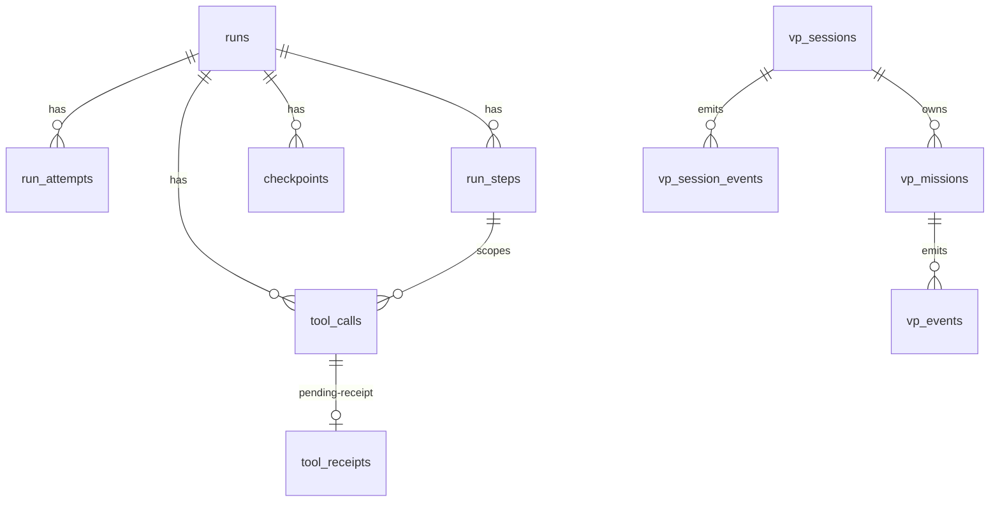
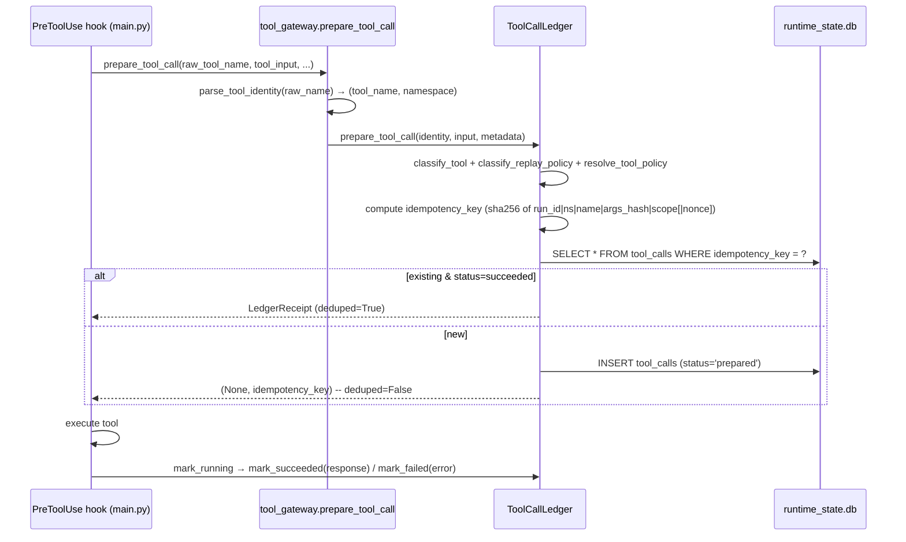

# Durable Execution

The `universal_agent.durable` package is the persistence and idempotency layer that lets agent
runs survive process restarts, crashes, and deploy-driven `SIGTERM`s. It stores the operational
execution state — the run queue, leases, attempts, steps, a tool-call ledger, and checkpoints —
in a SQLite database (`runtime_state.db` by default). It also classifies every tool call into a
**side-effect class** and a **replay policy** so that resuming a run does not re-fire irreversible
external actions (sending email, uploading files) while still replaying read-only work cheaply.

This package is *infrastructure* — it does not itself drive the agent loop. The orchestration that
*uses* it lives in `main.py` (the PreToolUse/PostToolUse ledger hooks), `agent_core.py`
(checkpoint write/restore), and `worker.py` (lease-based claim of queued runs).

## What's in the package

| File | Responsibility |
|---|---|
| `db.py` | SQLite connection factory + canonical DB-path resolution (env-overridable). |
| `migrations.py` | Idempotent schema creation (`ensure_schema`) + additive `ALTER TABLE` backfills. |
| `state.py` | The run/attempt/step lifecycle, leases, and the VP session/mission tables. The largest module. |
| `ledger.py` | `ToolCallLedger` — the idempotent tool-call record (prepare → mark_running → mark_succeeded/failed). |
| `classification.py` | Side-effect classification + replay-policy resolution from `tool_policies.yaml` + heuristics. |
| `tool_gateway.py` | Tool-name parsing/sanitization (`parse_tool_identity`) + the `prepare_tool_call` convenience wrapper. |
| `normalize.py` | Deterministic JSON normalization + SHA-256 hashing used for idempotency keys. |
| `checkpointing.py` | Save/load run checkpoints, including a research-corpus cache for sub-agent context restoration. |
| `tool_policies.yaml` | Declarative per-tool classification rules (regex patterns → side_effect_class + replay_policy). |
| `worker_pool.py` | Stage-6 distributed worker-pool scaffolding. **Not wired to any production caller** (see Gotchas). |

## Data model (SQLite)

All tables are created by `migrations.py::ensure_schema`, which runs `executescript(SCHEMA_SQL)`
then a long list of additive `_add_column_if_missing` calls so old databases self-upgrade in place.
`ensure_schema` is memoized per-DB-path via `_SCHEMA_READY_PATHS` (guarded by a thread lock), so the
full DDL only runs once per connection target per process.

Core execution tables:

- **`runs`** — one row per logical run. Carries status, entrypoint, the JSON `run_spec`, workspace
  dir, lease fields (`lease_owner`, `lease_expires_at`, `last_heartbeat_at`), cancel signaling
  (`cancel_requested_at`, `cancel_reason`), iteration accounting (`iteration_count`, `max_iterations`,
  `completion_promise`), provider-session linkage, and pointers to the latest/last-success/canonical
  attempt.
- **`run_attempts`** — retry history. `create_run_attempt` computes `attempt_number` as
  `MAX(attempt_number)+1` and updates the parent run's `latest_attempt_id`; success or
  `promote_to_canonical=True` also advances `last_success_attempt_id` / `canonical_attempt_id`.
- **`run_steps`** — ordered phases within a run (`start_step` / `complete_step` / `update_step_phase`).
- **`tool_calls`** — the ledger (see below). `idempotency_key` is `UNIQUE`.
- **`tool_receipts`** — a side table for *pending* receipts during forced-replay (a result captured
  before the ledger row is marked succeeded; later "promoted").
- **`checkpoints`** — state snapshots + optional `corpus_data` blob for sub-agent context restore.

VP orchestration tables (also live in this schema because they share `runtime_state.db`):
`vp_sessions`, `vp_missions`, `vp_session_events`, `vp_events`, `vp_mission_backlog_history`,
`vp_bridge_cursors`. These back the VP/mission queue (see the VP subsystem doc); the durable-state
functions for them (`claim_next_vp_mission`, `finalize_vp_mission`, leases) live in `state.py`.

## Database paths and connection settings (`db.py`)

`get_runtime_db_path()` returns `$UA_RUNTIME_DB_PATH` if set, else
`<repo-root>/AGENT_RUN_WORKSPACES/runtime_state.db`. Sibling DBs follow the same pattern:

| Function | Env override | Default filename |
|---|---|---|
| `get_runtime_db_path` | `UA_RUNTIME_DB_PATH` | `runtime_state.db` |
| `get_coder_vp_db_path` | `UA_CODER_VP_DB_PATH` | `coder_vp_state.db` |
| `get_vp_db_path` | `UA_VP_DB_PATH` | `vp_state.db` |
| `get_activity_db_path` | `UA_ACTIVITY_DB_PATH` | `activity_state.db` |

`activity_state.db` is intentionally split from `runtime_state.db` so low-priority CSI background
writes never lock-contend with high-priority agent-session writes.

> **Operational gotcha — the canonical Task Hub DB is `activity_state.db`, not `task_hub.db`.**
> Prior handoff docs named `AGENT_RUN_WORKSPACES/task_hub.db`, which is stale. The live Task Hub /
> CSI state resolves at runtime through `db.py::get_activity_db_path()`. When diagnosing Task Hub
> state, read the path the resolver returns, not a hardcoded guess.

`connect_runtime_db` opens the DB with deliberate concurrency settings, all chosen to survive
multiple UA processes (gateway, CLI, worker) hitting the same file:

- `check_same_thread=False` — the gateway dispatches across async tasks / background threads.
- `isolation_level=None` — true autocommit; each DML holds the WAL write lock only for one statement,
  not until the next `conn.commit()`. This eliminated multi-minute lock contention between long
  sessions (Simone heartbeat) and short writes. Explicit `BEGIN IMMEDIATE` transactions still work.
- `PRAGMA journal_mode=WAL`, `PRAGMA auto_vacuum=INCREMENTAL`, `PRAGMA foreign_keys=ON`.
- `busy_timeout` = `$UA_SQLITE_BUSY_TIMEOUT_MS` (default `15000`, floor `250`).

> Deleting `runtime_state.db` is only safe when there are no queued/running/resume-needed runs you
> care about. It holds live operational state, not long-term memory.

## The tool-call ledger (`ledger.py` + `tool_gateway.py`)

The ledger is the heart of "don't double-fire side effects on resume." Every tool invocation passes
through `prepare_tool_call` *before* it executes.

### Idempotency key construction

`_idempotency_key` hashes `run_id | tool_namespace | tool_name | normalized_args_hash |
side_effect_scope [| nonce]`. The args hash comes from `normalize.hash_normalized_json` after
`_sanitize_for_idempotency` strips volatile fields (`idempotency_key`, `client_request_id`, and for
`COMPOSIO_MULTI_EXECUTE_TOOL`: `session_id`, `current_step`, `thought`, etc.).

`_compute_scope` adds semantic narrowing for high-risk tools so two genuinely-different sends don't
collide and two genuinely-identical sends *do*:
- Gmail send/draft → `email:{to}:{subject}:{attachment_s3key}`
- `*UPLOAD*` → `upload:{path}:{destination}`
- `*MEMORY*` → `memory:{hash(content)}`
- everything else → `hash_normalized_json(tool_input)`

A `nonce` (the `tool_call_id`) is appended when `allow_duplicate=True` **or** when the replay policy
is `RELAUNCH`, which makes the key unique-per-attempt (sub-agent `Task` calls must re-run, never
dedup).

### Dedup decision (in `main.py`, not the ledger)

The ledger only *reports* whether a prior succeeded row exists. The PreToolUse hook decides what to
do with it:

- If `replay_policy == "REPLAY_EXACT"` (or, absent a policy, the side-effect class is
  `external`/`memory`/`local`) → **dedupe**: block re-execution and return the cached `response_ref`.
- **Enhanced idempotency:** the cache is only honored if it looks valid — non-empty, not `"none"`,
  and not containing `"error"` in its first 50 chars. A prior empty/error result lets the agent retry
  the exact same call (handles silent search timeouts).
- If the policy is `REPLAY_IDEMPOTENT` (read-only) → re-execution is allowed; a fresh
  `allow_duplicate=True` ledger row is prepared with the tool_call_id as nonce.

### Ledger lifecycle methods

`prepare_tool_call` → `mark_running` → terminal `mark_succeeded(response, external_correlation_id)`
or `mark_failed(error_detail)`. Additional verbs: `mark_abandoned_on_resume` (in-flight calls
orphaned by a crash), `mark_replay_status`, and the pending-receipt set used by forced replay:
`record_receipt_pending` → `get_pending_receipt` → `promote_pending_receipt` / `clear_pending_receipt`.

### Race + FK handling (load-bearing gotcha)

`prepare_tool_call`'s `INSERT` is wrapped in a `try/except sqlite3.IntegrityError`:
- **UNIQUE violation** (two workers prepared the same key concurrently) → fetch the existing row and
  return it as a valid receipt.
- **FOREIGN KEY violation** (the `step_id` doesn't exist yet — common during MCP schema prefetch
  before a step is created, and during crash/shutdown) → log a debug line and return a **phantom
  receipt** with `status="phantom"` and `deduped=True` so the process continues. This deliberately
  sacrifices auditability for stability; the call executes but isn't durably tracked.

### Unknown-tool policy audit

If a `composio`-namespace tool matches no policy and has never been seen, the ledger emits a
`UA_POLICY_UNKNOWN_TOOL` warning and appends a record to
`<workspace_parent>/policy_audit/unknown_tools.jsonl` (best-effort). This surfaces tools that need a
classification rule added to `tool_policies.yaml`.

## Tool classification (`classification.py` + `tool_policies.yaml`)

Two orthogonal classifications, both resolved per tool:

1. **`side_effect_class`** ∈ `{external, memory, local, read_only}` — how dangerous a replay is.
2. **`replay_policy`** ∈ `{REPLAY_EXACT, REPLAY_IDEMPOTENT, RELAUNCH}` — how resume should treat it.

Resolution order in `classify_tool`:
1. Matching `ToolPolicy` from `tool_policies.yaml` (overlay policies first, then base) with an
   explicit `side_effect_class`.
2. For `mcp` namespace: `KNOWN_MCP_SIDE_EFFECTS` / `KNOWN_MCP_READ_ONLY` lookup tables, else default
   `local`.
3. Keyword regex: `SIDE_EFFECT_KEYWORDS` (SEND/CREATE/UPDATE/DELETE/POST/UPLOAD/…) → `external`;
   `READ_ONLY_KEYWORDS` (GET/LIST/SEARCH/READ/FETCH/RETRIEVE) → `read_only`.
4. **Default `external`** — conservative; an unclassified tool is assumed to have side effects.

`classify_replay_policy`:
- `claude_code::task`, or a `raw_tool_name`/name of `taskoutput`/`taskresult` → `RELAUNCH`
  (sub-agent work is re-launched, never replayed from a cached result).
- Explicit policy `replay_policy` if present.
- Else: `read_only` → `REPLAY_IDEMPOTENT`, everything else → `REPLAY_EXACT`.

### Policy file (`tool_policies.yaml`)

Declarative `policies:` list — each entry has `name`, optional `tool_namespace`, `side_effect_class`,
`replay_policy`, and `patterns` (regex, case-insensitive). Shipped rules cover Composio read-only vs.
side-effecting verbs, the Composio filetool (`Read`/`Glob` read-only, `Write` local), `TodoWrite`
(memory/idempotent), `Bash` (local/exact), and the internal wiki tools.

Policy loading is cached and **mtime-aware** (`_get_tool_policies` reloads when the file changes), so
editing the YAML takes effect without a restart. Env overrides:
- `UA_TOOL_POLICIES_PATH` — replace the base policy file (default `tool_policies.yaml`).
- `UA_TOOL_POLICIES_OVERLAY_PATHS` (or `…_OVERLAY_PATH`) — comma-separated overlays prepended ahead
  of the base list (overlays win on match order).

`validate_tool_policies()` eagerly parses everything (used as a startup sanity check); invalid
regex / unknown `side_effect_class` / unknown `replay_policy` raise `ValueError`.

### Tool-name parsing (`tool_gateway.parse_tool_identity`)

Turns a raw provider tool name into `(tool_name, tool_namespace)`:
- `mcp__server__tool` → namespace `mcp`, name = last segment.
- `BASH`/`TASK` → namespace `claude_code`.
- anything else → namespace `composio`.

It also defends against model hallucination: it strips malformed XML suffixes
(`<arg_key>…</arg_key>` markers via `parse_malformed_tool_name`) and a trailing bare `tools`
hallucination (e.g. `COMPOSIO_MULTI_EXECUTE_TOOLtools`).

## Run lifecycle & leases (`state.py`)

`upsert_run` is an insert-or-update (`INSERT OR IGNORE` then `UPDATE … COALESCE(...)`), so it's safe
to call repeatedly to mutate a run without clobbering already-set fields. Status transitions:
`update_run_status`, `request_run_cancel` (sets `cancel_requested`), `is_cancel_requested`,
`mark_run_cancelled`.

**Leases** provide single-owner execution across processes. `acquire_run_lease` is an atomic
conditional `UPDATE` — it only succeeds (`rowcount == 1`) if the run is `queued`/`running` and the
existing lease is null or expired; it also flips `queued`→`running` in the same statement.
`heartbeat_run_lease` extends the lease only for the current owner; `release_run_lease` clears it.
This is what lets `worker.py` claim a queued run, hold it for `lease_ttl`, and lets another worker
take over after the TTL lapses if the holder dies.

`_RUN_SUCCESS_STATUSES = {succeeded, completed, success}` and
`_RUN_TERMINAL_STATUSES = success ∪ {failed, cancelled, needs_review}` gate when attempt pointers
(`last_success_attempt_id`, `canonical_attempt_id`, `latest_attempt_id`) advance in
`create_run_attempt` / `update_run_attempt`.

VP sessions/missions have a parallel lease + claim API in the same module
(`acquire_vp_session_lease`, `claim_next_vp_mission`, `finalize_vp_mission`, …). `claim_next_vp_mission`
uses `BEGIN IMMEDIATE` + a priority-tier-ordered `SELECT … LIMIT 1` then a conditional `UPDATE` to
atomically claim the highest-priority queued (or lease-expired running) mission; tier order is
`operator_daily(0) < operator_signal(1) < maintenance(2) < background(3)`, then numeric `priority`
ASC, then `created_at` ASC. `finalize_vp_mission` best-effort surfaces failures to Simone via
`services.vp_failure_rescue.surface_failure_to_simone`.

## Checkpointing (`checkpointing.py`)

`save_checkpoint(conn, run_id, step_id, checkpoint_type, state_snapshot, cursor=, corpus_data=)`
inserts a `checkpoints` row and points `runs.last_checkpoint_id` at it. `load_last_checkpoint`
returns the newest by `created_at`. The distinctive feature is **`corpus_data`** — a pre-loaded
research-corpus blob stored on the checkpoint so a restarted sub-agent can restore its context
(`load_corpus_cache`) without re-reading all research files. Callers: `agent_core.py`,
`urw/context_summarizer.py`, `main.py`.

A `checkpoints` row stores exactly three payloads: `state_snapshot_json`, `cursor_json`
(pagination markers), and the optional `corpus_data` blob.

> **Conversation history is NOT stored in the `checkpoints` table.** A `[CRITICAL]` comment in
> `agent_core.py` states that `history.json` persistence in `save_checkpoint` is *unimplemented* —
> full chat replay is reconstructed from the run-workspace session JSON (`messages`), not from a
> checkpoint column. (Legacy docs claimed checkpoints save the full transcript; that is wrong as of
> code on the verify date.)

## Normalization (`normalize.py`)

`normalize_json` recursively sorts dict keys and canonicalizes lists/tuples/sets, then serializes
with `sort_keys=True, separators=(",",":")`. `hash_normalized_json` SHA-256s that. This guarantees
the idempotency key is stable regardless of key ordering or whitespace in the tool input.
`deterministic_task_key` builds a `task:<hash>` key excluding a caller-supplied `task_key` field.

## Environment flags

| Variable | Effect | Default |
|---|---|---|
| `UA_RUNTIME_DB_PATH` | Override the runtime DB location | `AGENT_RUN_WORKSPACES/runtime_state.db` |
| `UA_CODER_VP_DB_PATH` / `UA_VP_DB_PATH` / `UA_ACTIVITY_DB_PATH` | Override sibling DB paths | per-filename defaults |
| `UA_SQLITE_BUSY_TIMEOUT_MS` | SQLite busy timeout (floor 250) | `15000` |
| `UA_TOOL_POLICIES_PATH` | Replace the base tool-policy YAML | bundled `tool_policies.yaml` |
| `UA_TOOL_POLICIES_OVERLAY_PATHS` / `…_OVERLAY_PATH` | Comma-separated overlay policy files | unset |

## Gotchas

- **`worker_pool.py` is scaffolding, not the production execution path.** A repo-wide grep finds no
  external caller of `run_worker_pool` / `WorkerPoolManager` / `queue_run` outside the package and
  its tests. Its `PoolConfig.db_path` defaults to the relative `"runtime.db"` (not the canonical
  `runtime_state.db`). The live worker that claims runs is `src/universal_agent/worker.py`, which uses
  `acquire_run_lease` / `heartbeat_run_lease` directly. Treat `worker_pool.py` as a Stage-6
  distributed-execution prototype.
  > [VERIFY: if a separate process launches `run_worker_pool` via CLI/entrypoint outside `src/`, it
  > would not show in the `src/` grep. No such entrypoint was found, but confirm before deleting.]
- **Phantom receipts hide tool calls.** The FK-violation branch in `prepare_tool_call` returns a
  `status="phantom"` receipt and lets the tool run *without a durable ledger row*. This is by design
  (stability over auditability during shutdown/prefetch), but it means a small fraction of executed
  tools won't appear in `tool_calls`.
- **Default classification is `external`.** Any tool that matches no policy and no read-only keyword
  is treated as side-effecting and `REPLAY_EXACT` — i.e. deduped on resume. If a genuinely read-only
  tool isn't being replayed, it's probably missing a `tool_policies.yaml` rule; check
  `policy_audit/unknown_tools.jsonl`.
- **The tier-aware vp_missions indexes can't live in `SCHEMA_SQL`.** They're created in
  `ensure_schema` *after* the `priority_tier` `ALTER TABLE` backfill, because `executescript` runs the
  base DDL before the ALTER and pre-PR-499 DBs lack the column — putting the index in `SCHEMA_SQL`
  aborted the whole script (2026-05-27 incident). Keep that ordering.
- **`claim_next_vp_mission` clears stale `last_error`.** A successful claim wipes any old
  `vp_sessions.last_error` so operators triaging the `vp_sessions` table don't chase days-old
  transient errors (2026-05-27 morning-briefing incident).
- **`isolation_level=None` is intentional.** Don't "fix" it back to default isolation — it's the cure
  for the multi-minute WAL lock contention between long agent sessions and short admission writes.
- **Schema setup is memoized per process.** `ensure_schema` skips the DDL after the first call for a
  given DB path (`_SCHEMA_READY_PATHS`). If you add a column, the additive `_add_column_if_missing`
  list — not `SCHEMA_SQL` alone — is what upgrades existing prod databases.
- **A syntax error in `state.py` takes down the CSI cron.** `state.py` is imported very early in boot
  and on the autonomous CSI/heartbeat path. An unreviewed branch once introduced a `SyntaxError`
  mid-flight that crashed the 08:00 CDT CSI cron. Recovery required stopping the gateway and parking
  the stuck task with careful SQL (a plain `cancel` gets resurrected by the orphan-reconciler).
  Treat edits to this module as high-blast-radius.
