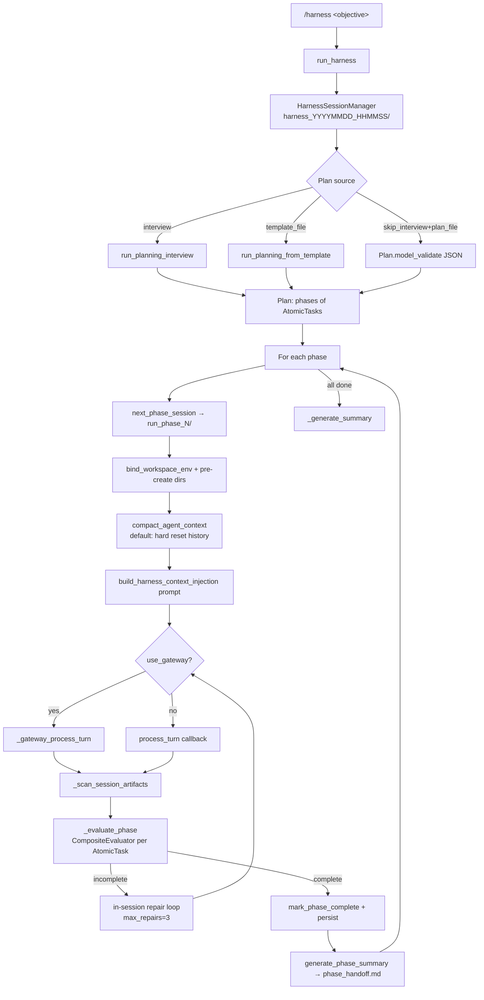
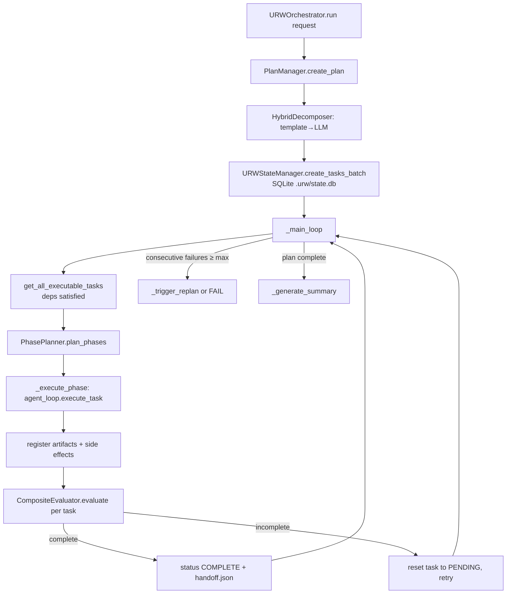

# URW Orchestration

URW ("Universal Ralph Wrapper") is the multi-phase, long-running task orchestration
subsystem. It decomposes a large request into a graph of atomic tasks, groups those
tasks into execution phases, drives each phase through the agent, and gates phase
completion behind a multi-strategy evaluator with retry/repair loops.

The package lives entirely under `src/universal_agent/urw/`. There are **two distinct
orchestrators** in this package, and conflating them is the single biggest source of
confusion:

| Orchestrator | File | How it runs the agent | Live entrypoint | State backing |
|---|---|---|---|---|
| **`HarnessOrchestrator`** (the live one) | `harness_orchestrator.py` | `process_turn` callback or in-process/external **Gateway** | `/harness` CLI command in `main.py` → `run_harness(...)` | Pydantic `Plan` + JSON/SQLite via `plan_persistence.py`; phase work products on disk |
| **`URWOrchestrator`** (classic engine) | `orchestrator.py` | an `AgentLoopInterface` adapter (`integration.py`) | CLI-only `--urw-request` → `_run_urw_from_cli(...)` | `URWStateManager` SQLite DB at `<workspace>/.urw/state.db` |

Both share the same **evaluator** (`evaluator.CompositeEvaluator`) and the same
`Task`/`Artifact` dataclasses from `state.py`. The classic engine additionally owns the
`decomposer.py` + `phase_planner.py` + `state.py` machinery. The live harness path
builds its plan from an **interview** (`interview.py`) instead of the decomposer, and
converts its pydantic `AtomicTask`s into `state.Task`s for evaluation via
`adapter.HarnessAdapter`.

## Where it is invoked

Only `urw` symbols imported from outside the package are in `main.py`:

- `/harness`, `/harness-test`, `/harness-template` CLI commands → `harness_orchestrator.run_harness`
- `--interview-auto` arg → `interview.set_auto_answers`
- `_run_urw_from_cli` (the `--urw-request` path) → `URWConfig`, `URWOrchestrator`, `integration.{MockAgentAdapter,UniversalAgentAdapter}`

There is **no** heartbeat/cron/daemon caller. URW is operator-invoked from the CLI.
That makes the classic `URWOrchestrator` path effectively a dev/CLI engine; the
production-facing surface is the `/harness` flow.

---

## Live flow: `HarnessOrchestrator`

### Plan acquisition

`run()` first creates a `HarnessSessionManager` rooted at `workspaces_root` (the parent
of the session workspace dir, i.e. `AGENT_RUN_WORKSPACES`). The harness directory is
`harness_<id>` where `<id>` defaults to a `%Y%m%d_%H%M%S` timestamp. It then obtains a
`Plan` from one of three sources (priority order in `HarnessOrchestrator.run`):

1. `skip_interview=True` + `plan_file` → load a JSON plan directly (`Plan.model_validate`).
2. `template_file` → `interview.run_planning_from_template` (deterministic, from a saved transcript).
3. Default → `interview.run_planning_interview` (interactive Q&A that synthesizes the plan).

`set_auto_answers()` (used by `--interview-auto`) pre-fills interview answers so the
interactive interview runs unattended.

### Phase execution

For each `Phase` in `plan.phases` (`HarnessOrchestrator._execute_phase`):

- `session_manager.next_phase_session()` creates `run_phase_N/` and the orchestrator
  pre-creates `work_products/`, `tasks/`, `search_results/`, `downloads/` to avoid
  agent 404s.
- `bind_workspace_env(session_path)` (from `execution_context`) repoints MCP tool I/O at
  the phase dir. The path is also written to `.current_run_workspace` /
  `.current_session_workspace` marker files (`_persist_current_workspace`) for tools that
  can't see env updates.
- On a retry, `_bootstrap_retry_workspace` copies `work_products/`, `tasks/`,
  `search_results/` from the prior attempt so completed work isn't redone.
- `compact_agent_context` decides client carry-over. **Gotcha:** as of the 2026-01-26
  change, the default is a *hard reset* (`keep_client=False`) — every phase boundary
  clears agent history for a clean context window. Continuity is provided instead by the
  injected prompt and `phase_handoff.md` summaries, not by retained conversation. The
  docstring still describes the old "keep client" strategy; the code body wins.
- The prompt is built by `harness_helpers.build_harness_context_injection`, which injects
  the overall goal, prior session paths, prior-phase `phase_handoff.md` summaries, the
  atomic-task list, expected artifacts, the **current workspace absolute path**, and the
  current date/time (timezone from `USER_TIMEZONE`, default `America/Chicago`).
- The turn runs via the Gateway (`_gateway_process_turn`) when `config.use_gateway` is on,
  otherwise via the `process_turn` callback handed in by `main.py`.

### Two nested verification loops

There are **two** retry mechanisms, easy to miss:

1. **In-session repair loop** (inside `_execute_phase`, `max_repairs = 3`, hardcoded):
   after a turn, `_scan_session_artifacts` collects outputs and `_evaluate_phase` runs.
   On failure it re-prompts the *same* session/client with the missing elements and
   suggested actions, up to 3 repairs, before returning a failed `PhaseResult`.
2. **Outer Ralph loop** (inside `run`, `config.max_retry_per_phase = 3`): if the phase
   still fails, the outer loop retries the whole phase with a fresh session, feeding the
   prior failure as `feedback` and bootstrapping from the prior session path.

If a phase still fails after the outer retries, `_handle_phase_failure` currently just
logs and returns `False`, which **stops the whole harness** (`status = FAILED`). There is
no skip-and-continue.

### Phase evaluation (`_evaluate_phase`)

- Builds a fresh `CompositeEvaluator` via `create_default_evaluator(client)`.
- Converts each scanned artifact path into a `state.Artifact` (`ArtifactType.FILE`).
- For each `AtomicTask` in the phase, `HarnessAdapter.atomic_task_to_state_task` maps it to
  a `state.Task`. Success-criteria strings starting with `file:`/`file_exists:`/`exists:`/
  `check:` become `binary_checks`; everything else becomes the `evaluation_rubric`. This
  determines `verification_type` (`binary` / `qualitative` / `composite`).
- The "agent output" passed to the evaluator is actually a **rich artifact context blob**
  (`_build_eval_context`): an artifact summary, extracted HTML headings, section snippets
  for known targets (Executive Summary / Environmental / Economic / Social / References),
  and per-file previews (capped, `.md`/`.txt`/`.html`/`.json`; HTML stripped of tags),
  truncated to ~35k chars. This is why the evaluator can judge content it was never handed
  as conversation text.
- Phase passes only if **every** atomic task passes (`is_complete = len(failures) == 0`);
  `overall_score` is the average. Note the returned `confidence` here is the literal
  string `"high"` (a placeholder), not a `CompletionConfidence` enum — `_evaluate_phase`
  bypasses the enum path. `[VERIFY: EvaluationResult.confidence is typed as
  CompletionConfidence but _evaluate_phase passes the str "high"; works only because
  callers read .is_complete/.overall_score, not .confidence.value.]`

### Persistence & summary

`_persist_plan` writes the plan as JSON (`PlanPersistence`, `plan_<id>.json`) and, when
`config.persist_to_sqlite` (default True), to `harness.db` (`SQLitePlanStore`). On phase
success, `generate_phase_summary` asks the client (text-only, `tool_choice: none`) to
write a ≤200-word `phase_handoff.md` into the session dir for the next phase to read.

`HarnessOrchestrator.resume(harness_dir)` rehydrates a session manager + plan from disk
to continue an interrupted run; completed phases are skipped and `IN_PROGRESS` phases get
a "resuming" prompt instructing the agent not to redo finished work.

### Harness config & flags

`HarnessConfig`: `max_retry_per_phase=3`, `max_iterations=20`, `persist_to_sqlite=True`,
`force_new_client_between_phases=False`, `use_gateway=False`, `gateway_url=None`.

`run_harness` overrides `use_gateway` from env: **`UA_HARNESS_USE_GATEWAY`** (default `"1"`,
i.e. gateway ON by default; accepts `1/true/yes`). `gateway_url` (when set) selects
`ExternalGateway`; otherwise `InProcessGateway`. The httpx clients are cleaned up in
`run_harness`'s `finally` via `orchestrator.close()` to avoid event-loop-closure errors.

---

## Classic engine: `URWOrchestrator` (CLI `--urw-request`)

This is the original "outer loop" engine. It is self-contained and does not use the
interview/Plan machinery.

`URWConfig` defaults: `max_iterations_per_task=15`, `max_total_iterations=200`,
`max_consecutive_failures=3`, `min_completion_confidence=MEDIUM`,
`enable_dynamic_replanning=True`, `iteration_timeout=600s`, `task_timeout=3600s`,
`heartbeat_interval_seconds=30`, `auto_decompose_failed_tasks=True`,
`llm_model=resolve_opus()`.

Key behaviors:

- **Decomposition** (`PlanManager.create_plan`): the request is run through the
  `decomposer`. The default `HybridDecomposer` tries `TemplateDecomposer` first (keyword
  match against `DECOMPOSITION_TEMPLATES`), falling back to `LLMDecomposer` (one LLM call
  returning a JSON task array). `create_plan` first calls `mark_active_tasks_failed`,
  which supersedes any prior incomplete plan, and `_ensure_unique_ids` rewrites colliding
  task IDs and their dependency references.
- **Phase planning** (`PhasePlanner.plan_phases`): groups tasks for the iteration. Simple
  cases (≤4 tasks or a linear chain under the token budget) collapse to a single phase;
  complex cases (≥6 tasks, or moderate with side effects) try an LLM grouping pass
  (`_plan_phases_with_llm`) and fall back to heuristic `_plan_multi_phase` which breaks at
  natural boundaries (`PHASE_BOUNDARY_PATTERNS`: send/email/publish/deploy/upload,
  report/output/final/deliver, analyze/synthesize). Soft cap
  `DEFAULT_MAX_TASKS_PER_PHASE=24`, budget `CONTEXT_BUDGET_TOKENS=160000`.
- **Phase execution** (`_execute_phase`): builds a combined phase context, executes via the
  adapter once, records side effects and artifacts, then evaluates **each** task in the
  phase. Tasks that don't pass are reset to `PENDING` (not left `IN_PROGRESS`) so the next
  loop iteration can retry them — this is the explicit fix for the
  "stuck-in-IN_PROGRESS" deadlock.
- **Single-task path** (`_execute_iteration`): an alternate per-task execution method with
  a heartbeat task, `iteration_timeout` enforcement, a `handoff.json` binary-check special
  case, and richer outcome classification (`success`/`partial`/`failed`/`incomplete`).
  It writes a verification finding per iteration.
- **Replanning**: `max_consecutive_failures` (default 3) consecutive failures trigger
  `_trigger_replan` (when `enable_dynamic_replanning`), which branches the (no-op) git
  checkpointer, supersedes active tasks, and re-decomposes from the failure reason +
  accumulated learnings. Failed individual tasks may also be auto-decomposed into
  sub-tasks (`auto_decompose_failed_tasks`).

---

## Decomposition templates

`decomposer.DECOMPOSITION_TEMPLATES` ships five keyword-matched templates, each a fixed
DAG of tasks with binary checks, constraints, rubrics and a per-template evaluation
policy: `research_report`, `email_outreach`, `document_analysis`, `data_processing`,
`content_creation`. Every template task carries `file_exists:handoff.json` as a binary
check. `TemplateDecomposer._match_template` scores templates by total matched-keyword
length and picks the best.

`SubAgentDecomposer` (defined but **not** the default decomposer) delegates decomposition
to the `task-decomposer` sub-agent, expecting a `macro_tasks.json` with phases; its prompt
encodes the Composio-anchored decomposition policy, browser-lane policy, available
sub-agents/toolkits, and the task-capture boundary rules. It is not wired into
`HybridDecomposer`; you'd have to construct it explicitly.

---

## Evaluation

`evaluator.py` defines four strategies behind the `Evaluator` ABC:

- **`BinaryCheckEvaluator`** — `file_exists:`, `artifact_exists:`, `side_effect:`,
  `contains:`. File checks look in `.urw/artifacts/`, the workspace root,
  `workspace_artifacts/`, `work_products/`, and registered artifact paths. `side_effect:`
  queries the `side_effects` table (requires a `state_manager`). No checks ⇒ pass with
  `DEFINITIVE`.
- **`ConstraintEvaluator`** — `min_length`, `max_length`, `contains`, `regex` over the
  primary artifact's content (or the agent output).
- **`LLMJudgeEvaluator`** — LLM-as-judge with a "smell test" prompt that explicitly
  instructs the model to be lenient (pass > ~0.65 on holistic quality, no pedantry, trust
  citations, accept reasonable effort). Scores map to `CompletionConfidence` via
  `_score_to_confidence` (≥0.85 HIGH, ≥0.6 MEDIUM, ≥0.4 LOW, else UNCERTAIN). The sync
  `evaluate()` runs the async path in a thread-pool when an event loop is already running.
  **Gotcha:** there is a fallback that constructs a fresh `AsyncAnthropic` client from
  `ANTHROPIC_AUTH_TOKEN`/`ZAI_API_KEY` + `ANTHROPIC_BASE_URL` when it can't unwrap a raw
  `.messages.create` off the passed client (e.g. a `ClaudeSDKClient`).
- **`SubAgentEvaluator`** — delegates to the `evaluation-judge` sub-agent (which has
  Read/Grep/list_directory tool access to inspect artifacts). Defined but not the default.
- **`CompositeEvaluator`** (the default, via `create_default_evaluator`) — resolves a
  policy per task, runs binary + constraint always, runs qualitative only when required,
  averages the component scores, and gates `is_complete` on each *required* component
  passing (plus optional `overall_min_score`).

### Evaluation policy resolution

`evaluation_policy.resolve_evaluation_policy` merges six layers, later overriding earlier:

1. `DEFAULT_EVALUATION_POLICY` (`qualitative_min_score=0.65`, requirements auto-detect,
   `overall_min_score=None`)
2. `VERIFICATION_TYPE_DEFAULTS[task.verification_type]` (binary / constraint / qualitative /
   composite)
3. `TEMPLATE_EVALUATION_POLICIES[template_name]` (only if a template name is passed)
4. `TASK_POLICY_OVERRIDES[task_suffix]` — keyed on the suffix after the last `_` in the
   task id (e.g. `scope`, `gather`, `report`, `send`)
5. `global_policy` (from `URWConfig.evaluation_policy`)
6. `task.evaluation_policy` (highest priority)

Then any still-`None` requirement is auto-detected from the task's
`binary_checks`/`constraints`/`evaluation_rubric`, and `qualitative_min_score` falls back
to `task.minimum_acceptable_score or 0.65`.

**Gotcha:** `CompositeEvaluator._resolve_policy` always passes `template_name=None`, so the
template-level policies (layer 3) are dead in the composite path today — template defaults
only take effect because `TemplateDecomposer` bakes them into each task's
`evaluation_policy` at decomposition time. The code comment ("Could be passed from
orchestrator in future") confirms this is intentional-for-now.

---

## State & artifacts (classic engine)

`state.URWStateManager` is the deterministic backbone for the classic `URWOrchestrator`.
It owns a SQLite DB at `<workspace>/.urw/state.db` plus human-readable mirror files:

- Tables: `tasks`, `task_dependencies`, `artifacts`, `side_effects`, `iterations`,
  `failed_approaches`, `plan_metadata`, `verification_findings`. `_ensure_schema_migrations`
  performs additive column migrations (e.g. adding `evaluation_policy` to `tasks`, extra
  columns to `verification_findings`).
- Mirror files under `.urw/`: `task_plan.json`, `progress.md` (status summary + recent
  iterations + learnings), `guardrails.md` (failed approaches — "DO NOT REPEAT THESE"),
  per-iteration `iterations/NNN_*.json`, `verification/*.json` finding + receipt records.
- **Side-effect idempotency**: `record_side_effect` enforces a UNIQUE `idempotency_key`
  and writes a `receipt_<id>.json` evidence file; replays are no-ops returning `False`.
- **Context generation**: `generate_agent_context` assembles plan status, the current task,
  dependency artifact inputs, the latest `handoff.json`, recent learnings, failed
  approaches, and the iteration budget into the prompt the adapter receives.
- **Handoff checkpoints**: `write_handoff_checkpoint` writes both `handoff_<task_id>.json`
  and a rolling `handoff.json`; the orchestrator's `handoff.json` binary check verifies it
  exists.

**`GitCheckpointer` is a DEPRECATED no-op stub.** Despite the module docstring describing
git-based checkpointing/rollback/branching, every method returns a fake success/SHA
(`no-op-*`) — git init was removed to avoid nested-repo conflicts. State durability is
entirely the SQLite DB + JSON/MD files. Don't trust the "git checkpoint" prose — read the
class body.

`context_summarizer.py` provides `ContextSummarizer` / `ContextCheckpoint` /
`pre_compact_checkpoint_hook` for PreCompact-style summarization, exported from the package
but not on the hot harness path.

---

## Model resolution gotcha

Both orchestrators default `llm_model` to `utils.model_resolution.resolve_opus()`.
`resolve_opus()` calls `resolve_model("opus")`, which in this codebase maps through the
**ZAI model map** (the historical "force real Opus" override was removed — see the docstring
in `model_resolution.py`). So "opus" here is a tier label resolving to a ZAI/GLM model, not
necessarily Anthropic Opus, depending on the configured map. Don't assume `resolve_opus()`
means Anthropic Opus.

---

## Key files

| File | Role |
|---|---|
| `harness_orchestrator.py` | Live `/harness` orchestrator: interview→plan→phase sessions→evaluate→retry |
| `orchestrator.py` | Classic `URWOrchestrator` outer loop (CLI `--urw-request`) |
| `decomposer.py` | Templates + `TemplateDecomposer`/`LLMDecomposer`/`HybridDecomposer`/`SubAgentDecomposer`, `PlanManager` |
| `phase_planner.py` | Groups atomic tasks into phases (heuristic + optional LLM) |
| `evaluator.py` | Binary/constraint/LLM-judge/sub-agent + `CompositeEvaluator` |
| `evaluation_policy.py` | 6-layer policy schema, defaults, resolver |
| `state.py` | `URWStateManager` SQLite+files, `Task`/`Artifact`/`IterationResult`, no-op `GitCheckpointer` |
| `interview.py` | Planning interview → `Plan` (entrypoints `run_planning_interview`, `run_planning_from_template`, `set_auto_answers`) |
| `plan_schema.py` | Pydantic `Plan`/`Phase`/`AtomicTask`; `plan_to_mission_json` |
| `plan_persistence.py` | `PlanPersistence` (JSON) + `SQLitePlanStore` (`harness.db`) |
| `harness_session.py` | `HarnessSessionManager`: `harness_<id>/run_phase_N/` dirs + state |
| `harness_helpers.py` | Context injection, compaction policy, `generate_phase_summary` |
| `adapter.py` | `HarnessAdapter`: pydantic `AtomicTask` → `state.Task` for evaluation |
| `integration.py` | `AgentLoopInterface` adapters: `UniversalAgentAdapter`, `MockAgentAdapter` |
| `context_summarizer.py` | PreCompact-style context summarization helpers |
