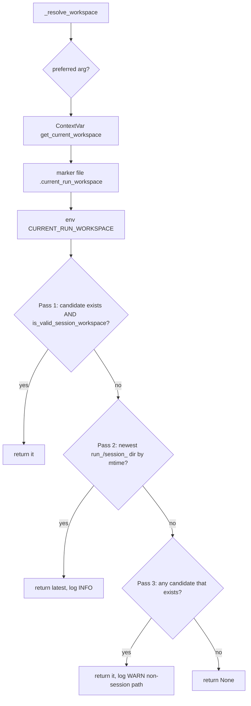

# Workspaces & Artifacts

Two distinct on-disk roots back every agent execution, and they must not be
confused:

| Concept | Root | Purpose | Lifetime |
|---|---|---|---|
| **Run workspace** | `<repo>/AGENT_RUN_WORKSPACES/<run_…>` (override: `UA_WORKSPACES_DIR`) | Ephemeral scratch for one execution — downloads, search results, intermediate work | Per-run |
| **Artifacts root** | `<repo>/artifacts` (override: `UA_ARTIFACTS_DIR`) | Durable, cross-run outputs that survive the run | Long-lived |

A file write is allowed if it lands inside **either** root. Everything in this
doc — the 4-tier workspace resolver, the path guardrail, the artifacts
resolver — exists to keep writes scoped to one of these two trees while still
letting agents use natural relative paths like `work_products/report.html`.

A third, optional surface is the **approved codebase root** — a real repository
a coding mission is authorized to edit. It is governed separately by
`codebase_policy.py` / `UA_APPROVED_CODEBASE_ROOTS` and is *not* a substitute for
the run workspace: scratch files, logs, checkpoints, and generated outputs still
belong in the workspace or artifacts root, even during repo-backed coding work.

### Run-workspace contents

`agent_setup.py` pre-creates `downloads/`, `work_products/media/`, and
`search_results/`. A populated run workspace also commonly holds `run.log`,
`trace.json`, `run_checkpoint.json`, `session_policy.json`, and (for
research/report flows) a task-scoped subtree:

```text
<run workspace>/
  tasks/<task_name>/
    search_results/  filtered_corpus/  research_overview.md  refined_corpus.md
  work_products/
    report.html  *.pdf
```

The run-root `search_results/` is a staging inbox; finalized crawl archives
belong under `tasks/<task_name>/search_results/`. Task identity is resolved
separately from workspace identity — do not synthesize task names from path
strings. Workspace-name prefixes (`run_`, `run_session_hook_`, `tg_`, `api_`,
`cron_`, `vp_`) are used for UI labeling and source inference, not access
control.

## Artifacts root resolution

There are **two** copies of the artifacts resolver and they agree by design:

- `artifacts.py::resolve_artifacts_dir` — the canonical one. Used by the
  PreToolUse guard and by skills.
- `mcp_server.py::_resolve_artifacts_root` — a string-returning twin used inside
  the MCP toolkit (`write_text_file`, `append_to_file`, media tools).

Both follow the same rule (`artifacts.py::resolve_artifacts_dir`):

1. If `UA_ARTIFACTS_DIR` is set (non-empty after strip), expand `~`, resolve,
   and use it.
2. Otherwise default to `<repo-root>/artifacts`.
3. (Canonical resolver only) a backward-compat fallback: if the default
   `artifacts/` dir does **not** exist but a literal `UA_ARTIFACTS_DIR/`
   directory does, use that. This catches the historical bug where the env-var
   *name* got written to disk as a directory.

> Diagnostic gotcha (from `CLAUDE.md` and confirmed in code): the default is
> `<repo-root>/artifacts`, **not** `AGENT_RUN_WORKSPACES`. Always read
> `resolve_artifacts_dir` before scripting a `find`/`ls` to locate artifacts —
> do not invent fallback paths.

`repo_root()` walks up three parents from `artifacts.py`
(`src/universal_agent/artifacts.py` → repo root); `mcp_server.py::_repo_root`
walks up two parents from `src/mcp_server.py`. Both land on the same checkout
root.

### Run-directory builder

`artifacts.py::build_artifact_run_dir` produces durable per-skill run dirs under
the artifacts root:

```
<artifacts_root>/<skill_name>/<YYYY-MM-DD>/<slug>__<HHMMSS>/
```

Both `skill_name` and `slug` are passed through `_safe_slug_component`
(lowercased, non-alphanumerics collapsed to `-`, empty → `"artifact"`).

## Run-workspace resolution — the 4-tier fallback

`mcp_server.py::_resolve_workspace` is the heart of the toolkit's path logic. It
builds an ordered candidate list, then validates in passes. The roots dir comes
from `_resolve_workspaces_root` (env `UA_WORKSPACES_DIR`, else
`<repo>/AGENT_RUN_WORKSPACES`).

Candidate priority order:

1. **Explicit `preferred=` argument** (when a pipeline already resolved the
   workspace and passes it through).
2. **ContextVar** — `execution_context.get_current_workspace()`. This is
   per-asyncio-task and is the concurrency-safe source of truth (see below).
3. **Marker file** — `CURRENT_RUN_WORKSPACE_FILE` /
   `CURRENT_SESSION_WORKSPACE_FILE` env, else
   `<workspaces_root>/.current_run_workspace`, plus the legacy
   `.current_session_workspace`. The harness rewrites this file as the active
   run changes.
4. **Env var** — `CURRENT_RUN_WORKSPACE` then legacy `CURRENT_SESSION_WORKSPACE`.
   Noted in-code as "often stale in long-running processes."

Resolution passes over those candidates:

- **Pass 1 (preferred):** first candidate that exists **and** passes
  `_is_valid_session_workspace`. Valid = directory name starts with `session_`
  or `run_`, **or** contains one of `session_policy.json`, `run_manifest.json`,
  `session_checkpoint.json`, `run_checkpoint.json`.
- **Pass 2 (mtime fallback):** newest `run_*`/`session_*` directory under the
  workspaces root by `st_mtime`. Logged at INFO.
- **Pass 3 (last resort):** any candidate that merely exists, even if it doesn't
  look like a session dir. Logged at WARN ("using non-session path").
- Returns `None` if nothing resolves.



### Why ContextVar, not os.environ

`execution_context.py::bind_workspace_env` deliberately sets **only** a
`ContextVar`, never `os.environ["CURRENT_SESSION_WORKSPACE"]`. The in-code
comment is explicit: writing to `os.environ` caused **workspace leakage** —
concurrent executions in the shared gateway process overwrote each other's path,
and subagents wrote to the wrong run workspace. `get_current_workspace()` reads
the ContextVar first, falling back to the env vars only when the ContextVar is
unset. `workspace_context()` is a context manager that sets/resets the var
around a block.

### Workspace creation

`agent_setup.py::create_workspace_path` mints `run_<YYYYMMDD_HHMMSS>` under a
base dir resolved as: explicit `base_dir` → `AGENT_WORKSPACE_ROOT` env →
auto-discovery across `["/app", <src_dir>, "/tmp"]` (first writable wins). The
agent setup also pre-creates the standard subtree: `downloads/`,
`work_products/media/`, `search_results/`.

## Path typo auto-correction

LLMs reliably mangle these long magic path segments, so the toolkit repairs them
transparently rather than bouncing the agent through deny-retry loops:

- `mcp_server.py::fix_path_typos` — fixes `AGENT_RUNSPACES → AGENT_RUN_WORKSPACES`
  and rewrites literal `UA_ARTIFACTS_DIR` / `$UA_ARTIFACTS_DIR` /
  `${UA_ARTIFACTS_DIR}` / `/opt/universal_agent/UA_ARTIFACTS_DIR` prefixes to the
  real resolved artifacts root.
- `workspace_guard.py::normalize_workspace_path` — fixes
  `AGENT_RUNWORKSPACES → AGENT_RUN_WORKSPACES` (a different missing-underscore
  typo).
- `hooks.py::_rewrite_mismatched_workspace_paths` (invoked inside the guard) —
  corrects hallucinated hex suffixes on the run-dir component so a near-miss
  workspace path snaps to the real active one.

## The workspace guardrail

Two layers enforce the "writes must stay in workspace or artifacts" invariant.

### Layer 1 — `write_text_file` self-enforcement (MCP tool)

`mcp_server.py::write_text_file` (and `append_to_file`) resolve relative paths
against the run workspace first, **falling back to the artifacts root** when no
workspace is bound — because the API server's cwd is `/opt/universal_agent`, and
without this anchoring every natural relative path would be rejected. A write is
`allowed` only if the resolved absolute path is `_is_within_root` of the
workspace **or** the artifacts root; otherwise it returns
`"Error: write denied…"`. Because of this self-enforcement, the PreToolUse hook
deliberately does **not** rewrite `write_text_file` paths.

### Layer 2 — PreToolUse hook (`hooks.py::on_pre_tool_use_workspace_guard`)

Registered as `HookMatcher(matcher="*")`, so it sees every tool call. Behavior:

- **No workspace bound** → returns `{}` (no-op). The guard only acts once a
  workspace exists.
- **Read-only tools pass through.** Explicit allowlist
  (`Read`, `View`, `ListDir`, `list_directory`, `read_file`, `list_dir`) plus a
  substring heuristic on the tool name (`list`/`read`/`view`/`cat`/`head`/`tail`).
  Reads from anywhere are allowed.
- **Cross-workspace pipeline tools pass through:** `html_to_pdf`,
  `run_research_phase`, `run_report_generation`, `run_research_pipeline` — these
  legitimately read from one workspace and write to another.
- **`/memory`, `task-skills/`, `work_products/` whitelist.** Writes under
  `<repo>/memory` (heartbeat updates to `HEARTBEAT.md`, briefing markers) and the
  Task Forge output dirs `task-skills/` and `work_products/` are allowed even
  though they sit outside the run workspace.
- **`write_text_file` / native `Write`** get a lighter check: absolute paths are
  allowed if under the workspace, the artifacts root, or any authorized codebase
  root; otherwise blocked with `permissionDecision: "deny"`.
- **Everything else** goes through `workspace_guard.py::validate_tool_paths`,
  which rewrites known path keys (`path`, `file_path`, `output_path`, `target`,
  …) to workspace-scoped absolutes or raises `WorkspaceGuardError` → returns a
  `decision: "block"` with a deny reason. Blocks are logged to logfire as
  `workspace_guard_blocked`; rewrites as `workspace_guard_path_rewrite`.

### `workspace_guard.py` core API

- `enforce_workspace_path(...)` — resolves a path (relative → joined to
  `workspace_root`), returns it if inside the workspace; else checks
  `allowed_write_roots`; else honors `allow_reads_outside`; else raises
  `WorkspaceGuardError`.
- `workspace_scoped_path(...)` — same, with optional `create_parents`.
- `validate_tool_paths(...)` — batch path-key rewrite over a tool-input dict.
- `is_inside_workspace` / `get_workspace_relative_path` — non-throwing helpers.
- `enforce_external_target_path(...)` — for **external** mission paths (VP/Cody
  work outside `AGENT_RUN_WORKSPACES`): allowlisted roots win, blocked roots
  raise, otherwise the path is returned.

### Codebase-access escape hatch

VP/Cody missions that need to mutate a real repository carry a
`codebase_access` policy. `hooks.py::_resolve_active_codebase_access` merges the
workspace's `session_policy.json` `codebase_access` block with request-runtime
metadata (`codebase_root`, `repo_mutation_allowed`, `workflow_kind`). If
`codebase_policy.py::agent_can_mutate_codebase(actor, access)` is true, the
policy's `roots` are passed to the guard as `allowed_write_roots`, letting that
actor write into the authorized repo. The mutation actor is derived from the
hook's agent identity (`_resolve_code_mutation_actor`, defaults to `simone`).

## Resource guardrails (tool circuit breaker)

`mcp_server.py::_tool_circuit_breaker_precheck` reads per-session limits from
`session_policy.json` (`limits.max_tool_calls` and
`limits.max_tool_calls_by_tool`). It increments in-process per-workspace
counters before each tool runs and returns a JSON error
(`"Tool circuit breaker: max_tool_calls exceeded…"`) once a positive limit is
crossed. Limits are opt-in: if `session_policy.json` is absent or a limit is
unset/zero, **no limit is enforced** (so ad-hoc usage isn't broken). Per-session
policy is also read by `_load_session_policy_limits`.

## Remote sync (SSHFS bridge + readiness marker + VPS mirror)

There is **no rsync/scp sync job** in this subsystem. Cross-machine file access
is OS-level: the desktop's `/home/kjdragan/...` tree is SSHFS-mounted onto the
VPS at the identical path over Tailscale (see project `CLAUDE.md` §
"Cross-Machine File Resolution"). Agents refer to absolute `/home/kjdragan/...`
paths directly; standard `open()`/`cat` resolve transparently. Do not build a
"file fetcher" — that's the explicit anti-pattern.

### VPS mirror roots (inspection surface)

`api/server.py` exposes **mirrored** copies of remote VPS storage for debugging
and inspection — these are *not* the source of truth for active runtime:

- `UA_VPS_WORKSPACES_MIRROR_DIR` (default `<workspaces>/remote_vps_workspaces`)
- `UA_VPS_ARTIFACTS_MIRROR_DIR` (default `<artifacts>/remote_vps_artifacts`)

The server special-cases `remote_vps_workspaces` / `remote_vps_sync_state` so
mirror trees aren't confused with canonical local run workspaces.

The code-side "sync readiness" signal is a marker file, not a transfer:
`hooks_service.py::_write_sync_ready_marker` drops `sync_ready.json` (filename
override: `UA_HOOKS_SYNC_READY_MARKER_FILENAME`; toggle:
`UA_HOOKS_SYNC_READY_MARKER_ENABLED`, default on) into the run workspace at hook
lifecycle boundaries. Payload: `version`, `session_id`, `state`, `ready`,
`hook_name`, `run_source`, timestamps, optional `error` and `execution_summary`.
Downstream consumers poll this marker to know a workspace's outputs are complete
and safe to read.

## Environment variables

| Var | Used by | Default | Effect |
|---|---|---|---|
| `UA_ARTIFACTS_DIR` | `resolve_artifacts_dir`, `_resolve_artifacts_root` | `<repo>/artifacts` | Durable artifacts root |
| `UA_WORKSPACES_DIR` | `_resolve_workspaces_root` | `<repo>/AGENT_RUN_WORKSPACES` | Run-workspace root |
| `AGENT_WORKSPACE_ROOT` | `create_workspace_path` | auto-discover `/app`,`src`,`/tmp` | Where new run dirs are minted |
| `CURRENT_RUN_WORKSPACE` (legacy alias `CURRENT_SESSION_WORKSPACE`) | resolver tier 4 | unset | Static workspace pointer (often stale) |
| `CURRENT_RUN_WORKSPACE_FILE` (legacy `CURRENT_SESSION_WORKSPACE_FILE`) | resolver tier 3 | `<root>/.current_run_workspace` | Marker file path |
| `UA_HOOKS_SYNC_READY_MARKER_ENABLED` | `_write_sync_ready_marker` | `True` | Emit `sync_ready.json` |
| `UA_HOOKS_SYNC_READY_MARKER_FILENAME` | `_sync_ready_marker_path` | `sync_ready.json` | Marker filename |
| `UA_BATCH_MAX_WORDS` | corpus batch reader | `50000` | Batch-read word cap |

## Gotchas

- **Two artifacts resolvers, two repo-root walks** — keep them in sync if you
  change the default. `artifacts.py` walks 3 parents; `mcp_server.py` walks 2.
- **`CURRENT_SESSION_WORKSPACE` is legacy.** New code uses `CURRENT_RUN_WORKSPACE`
  and the ContextVar. Error strings still mention the alias for operators.
- **Never set `os.environ` for the active workspace in a shared process** —
  it leaks across concurrent tasks. Use `bind_workspace_env` / the ContextVar.
- **`write_text_file` is exempt from guard path-rewriting** because it enforces
  its own (workspace OR artifacts) allowlist. Don't add it to `validate_tool_paths`.
- **The guard is a no-op until a workspace is bound** — early-lifecycle writes
  before binding are not scoped.
- **Limits are opt-in** — absent `session_policy.json` means unlimited tool calls
  by design.
- **Workspace ownership is convention-only, not filesystem-enforced.** Any
  process with access to `AGENT_RUN_WORKSPACES` can read another workspace's
  files; the guard scopes *writes* by the current bound workspace but there is no
  per-workspace OS-level access control.
- **`/opt/universal_agent` on the VPS is both the deploy target and an agent
  scratch dir.** Autonomous missions run in-place, so untracked `.py.bak`, test
  stubs, and half-outputs accumulate. Run `/ship` from a clean checkout, not from
  `/opt/universal_agent`, to avoid committing gigabytes of scratch.
