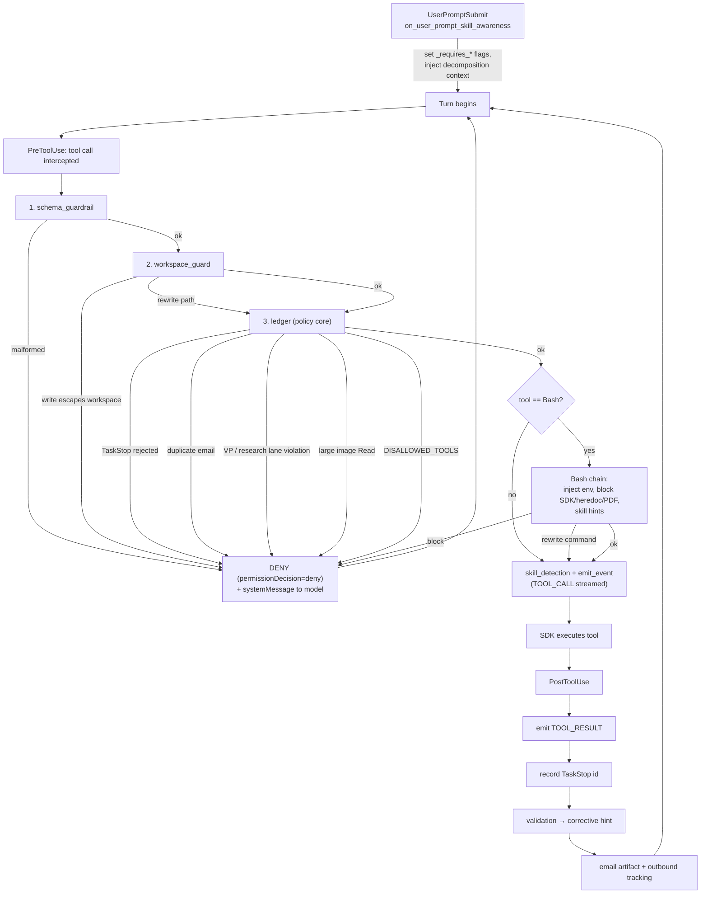

# SDK Lifecycle Hooks & Guardrails

> **Disambiguation.** This document covers the **Claude-Agent-SDK lifecycle hooks**
> (`PreToolUse` / `PostToolUse` / `UserPromptSubmit` / `PreCompact` /
> `AgentStop` / `SubagentStop`) that gate and instrument every tool call *inside*
> an agent turn. This is a different subsystem from
> [Hook System Architecture](../01_architecture/05_hook_system.md), which documents
> the **inbound HTTP webhook ingress** layer (`hooks_service.py`). When this codebase
> says "hooks" in a runtime/tool-gating context, it means *this* file
> (`hooks.py`); when it means HTTP ingress, it means `hooks_service.py`.

## What this is

`hooks.py` defines `hooks.py::AgentHookSet` — a per-run object that bundles all the
SDK lifecycle callbacks the Universal Agent registers with the Claude Agent SDK.
The SDK invokes these callbacks at fixed points in the agent loop, and each callback
returns a dict that can **allow**, **rewrite**, or **block** (deny) the pending
action, optionally injecting a `systemMessage` the model sees on its next step.

The hook set serves three intertwined jobs:

1. **Guardrails** — deny or rewrite tool calls that would escape the workspace,
   read large images into context, bypass the MCP architecture, send duplicate
   emails, prematurely complete a Task Forge task, or violate routing doctrine.
2. **Routing enforcement** — inspect the user prompt at turn start, infer intent
   (VP delegation / research-report pipeline / YouTube transcript / NotebookLM),
   and force the first tool calls of the turn down the correct lane.
3. **Instrumentation** — emit `TOOL_CALL` / `TOOL_RESULT` / `THINKING` / `STATUS`
   events to the UI/gateway event stream, and capture email/validation artifacts.

A single `AgentHookSet` instance is constructed per run and its `hooks.py::AgentHookSet.build_hooks`
method returns the matcher dict handed to the SDK.

## Where it is wired in

Every UA entrypoint that spins up a `UniversalAgent` constructs an `AgentHookSet`
and passes `build_hooks()` as the `hooks=` argument:

- CLI / harness — `main.py` (`AgentHookSet(...)` → `build_hooks()`).
- Web/API bridge — `api/agent_bridge.py` (`AgentHookSet(...)` → `build_hooks()`).
- URW orchestration workers — `urw/integration.py` (same shared set, "matching
  main.py CLI behavior").

The event-stream side is wired separately: the caller registers a callback via
`hooks.py::set_event_callback` (a `ContextVar`-backed slot, so concurrent/nested
runs each get their own callback), and the hooks call `hooks.py::emit_tool_call_event`,
`hooks.py::emit_tool_result_event`, `hooks.py::emit_thinking_event`, and
`hooks.py::emit_status_event` to push `AgentEvent`s through it. `hooks.py::set_event_start_ts`
seeds the wall-clock baseline used for the `time_offset` on every event, and
`hooks.py::reset_tool_event_tracking` clears the per-turn dedup sets.

## Hook registration map

`hooks.py::AgentHookSet.build_hooks` returns this structure (matchers run in order):

| SDK event | Hooks (in registration order) | Matcher |
|---|---|---|
| `AgentStop` | `on_agent_stop` | all |
| `SubagentStop` | `on_subagent_stop` | all |
| `PreToolUse` | `on_pre_tool_use_schema_guardrail`, `on_pre_tool_use_workspace_guard`, `on_pre_tool_use_ledger`, *(Bash-only chain)*, `on_pre_task_skill_awareness`, `on_pre_tool_use_skill_detection`, `on_pre_tool_use_emit_event` | `*` (+ `Bash`/`Task`) |
| `PreCompact` | `on_pre_compact_capture` | `*` |
| `PostToolUse` | `on_post_tool_use_emit_event`, `on_post_tool_use_ledger`, `on_post_tool_use_validation`, `on_post_research_finalized_cache`, `on_post_email_send_artifact`, `on_post_task_guidance` | all (+ `Task`) |
| `UserPromptSubmit` | `on_user_prompt_skill_awareness` | all |

The `Bash`-matched `PreToolUse` chain (between the ledger and the Task hook) is:
`on_pre_bash_inject_workspace_env`, `on_pre_bash_warn_dependency_installs`,
`on_pre_bash_block_large_heredocs`, `on_pre_bash_block_composio_sdk`,
`on_pre_bash_block_playwright_non_html`, `on_pre_bash_redirect_pdf_conversion`,
`on_pre_bash_skill_hint`.

**Ordering matters.** Schema validation runs first, then the workspace guard
(which can *rewrite* paths), then the heavyweight ledger/guardrail hook (which can
*deny*). The `emit_event` hook is registered **last** so a `TOOL_CALL` event is only
streamed after every earlier hook has allowed the call. Several hooks listed in the
class are not in `build_hooks` at all — notably
`hooks.py::AgentHookSet.on_pre_tool_use_task_forge_completion_gate` (see Gotchas).

## The PreToolUse path

### 1. Schema guardrail — `on_pre_tool_use_schema_guardrail`

Thin wrapper that delegates to the shared `pre_tool_use_schema_guardrail` in
`guardrails/tool_schema.py`. Blocks malformed or missing inputs and workspace
prerequisite violations before any other logic runs.

### 2. Workspace guard — `on_pre_tool_use_workspace_guard`

Enforces that **write** operations land inside the run workspace. Read-only tools
(`Read`, `View`, `list_*`, anything whose name contains `read`/`view`/`cat`/`head`/`tail`)
are allowed to touch paths anywhere. A small `CROSS_WORKSPACE_TOOLS` set
(`html_to_pdf`, `run_research_phase`, `run_report_generation`, `run_research_pipeline`)
is exempt because those pipeline tools legitimately read one workspace and write another.

For write-like tools it:

- Resolves the active **codebase-mutation policy** via `hooks.py::_resolve_active_codebase_access`
  and the actor via `hooks.py::_resolve_code_mutation_actor`. If the actor (e.g.
  `code-writer`) is permitted to mutate the repo, the authorized codebase roots are
  added to the allowed write roots.
- Auto-corrects hallucinated run-workspace hex suffixes via
  `hooks.py::_rewrite_mismatched_workspace_paths` (LLMs frequently invent a wrong
  `AGENT_RUN_WORKSPACES/<hex>` directory; silently rewriting prevents infinite
  deny→retry loops).
- Allowlists writes under `<repo>/memory`, `<repo>/task-skills`, and
  `<repo>/work_products` (Task Forge / heartbeat output dirs).
- Special-cases `write_text_file` / native `Write`: those tools own their allowlist
  (run workspace **or** `UA_ARTIFACTS_DIR` **or** authorized codebase roots), so the
  guard only blocks obvious escapes rather than rewriting the path.
- Otherwise delegates to `workspace_guard.py::validate_tool_paths`, which rewrites
  relative path fields to be workspace-scoped or raises
  `workspace_guard.py::WorkspaceGuardError` (turned into a `deny`).

The underlying boundary check is `workspace_guard.py::enforce_workspace_path`.

### 3. The main guardrail/ledger hook — `on_pre_tool_use_ledger`

This is the largest hook and the policy core. Tool names are normalized with
`parse_tool_identity` (stripping `mcp__*__` prefixes). In rough order it handles:

- **Research pipeline workspace hint** — injects a `workspace_dir` into
  `run_research_phase` / `run_report_generation` / `run_research_pipeline` calls
  when one is missing, derived from the transcript path
  (`hooks.py::_workspace_from_transcript_path`) or the current workspace.
- **TaskStop rejection** — for `TaskStop`/`task_stop`, delegates to the shared
  `task_stop_guardrails.py` policy. A blocked decision increments
  `_taskstop_consecutive_failures` and denies; a successful TaskStop is later
  recorded in `_stopped_task_ids` by the post-hook so a repeat is caught.
- **Subagent-context detection** — `hooks.py::_is_subagent_context_for_tool` decides
  whether this call originates from a sub-agent (non-primary `agent_type`, a
  `parent_tool_use_id`, or a transcript path differing from the first-seen primary
  transcript). Many routing guards are skipped for sub-agents.
- **AgentMail duplicate-send blocking** — for delivery tools
  (`is_agentmail_delivery_tool`), uses the email-tracking bridge to deny receipt
  acks when a single-final-response is required, deny duplicate final/ack outbound
  per thread, and (in `todo_execution`) deny receipt-style acks and duplicate final
  delivery per claimed task.
- **`ask_user_questions` block in `todo_execution`** — claimed Task-Hub work cannot
  ask a human to resolve internal conflicts; it must disposition via
  `task_hub_task_action`.
- **YouTube-first guard** — if the turn was flagged `_requires_youtube_skill_first`
  and the skill hasn't run, direct `mcp__youtube__*` calls and inline Bash YouTube
  extraction (matched against `_YOUTUBE_INLINE_FETCH_MARKERS`) are denied in favor
  of the `youtube-transcript-metadata` skill.
- **VP routing lock** — if `_requires_vp_tool_path` is set and no
  `vp_dispatch_mission` has happened yet, the first tool call must be one of the
  `vp_*` control-plane tools; otherwise denied. A `Task(...)` call carrying explicit
  VP intent (`hooks.py::_looks_like_explicit_vp_intent`) is also denied and *locks*
  the rest of the turn into the VP lane.
- **Research-delegate-first guard** — if `_requires_research_delegate_first` is set,
  the turn must first delegate to a recognized specialist
  (`research-specialist` / `arxiv-specialist`, or `notebooklm-operator` /
  `youtube-expert` for mixed turns). Read-only/context tools and `Skill`/`todowrite`
  are allowed before the delegation so the agent doesn't deadlock on
  "look at this image and research it".
- **Investigation-only mode** — when `hooks.py::_is_request_investigation_mode` is
  true (red-team eval, or heartbeat with `UA_HEARTBEAT_INVESTIGATION_ONLY`),
  mutating Bash / generic Composio execute calls are blocked, and writes are
  restricted to draft-safe paths via `hooks.py::_is_allowed_heartbeat_write_path`
  (`work_products/`, `UA_ARTIFACTS_DIR`, `memory/`, or `HEARTBEAT.md`).
- **Large-image-read block** — for `Read`, `hooks.py::_should_block_large_image_read`
  blocks reading image files (extensions in `_READ_BLOCK_IMAGE_EXTS`) above
  `UA_READ_IMAGE_MAX_BYTES` so base64 bytes never blow up the context window; the
  deny message steers the model to vision MCP / `describe_image` / `preview_image`.
- **Global tool ban** — tool names in `constants.py::DISALLOWED_TOOLS` are denied for
  everyone (hallucinated/deprecated aliases, `WebSearch`, banned Composio
  crawl/fetch/workbench tools).
- **Primary-only ban** — tool names in `constants.py::PRIMARY_ONLY_BLOCKED_TOOLS` are
  denied for the primary agent but allowed for sub-agents. This list is
  **intentionally empty** (see Gotchas).

### 4. Bash-only chain

Each Bash hook first extracts the command with `hooks.py::_extract_bash_command`
(handles both `tool_input.command` and top-level `command` payloads) and, for
content matching, strips data payloads with `hooks.py::_strip_heredoc_bodies` so
that words like "playwright" or "pdf" inside a heredoc body don't trigger false
positives.

- `on_pre_bash_inject_workspace_env` — rewrites bare `python` → `python3`, rewrites
  literal `UA_ARTIFACTS_DIR` path mistakes (`hooks.py::_rewrite_literal_artifacts_dir_paths`),
  and prefixes exports for `CURRENT_RUN_WORKSPACE`, `CURRENT_SESSION_WORKSPACE`,
  `UA_ARTIFACTS_DIR`, `CURRENT_CODEBASE_ROOT`, `CURRENT_ALLOWED_CODEBASE_ROOTS`,
  `UV_CACHE_DIR`, plus an auto-`cd` into the workspace (toggle `UA_BASH_AUTO_CD_WORKSPACE`).
- `on_pre_bash_warn_dependency_installs` — soft `systemMessage` discouraging
  `pip install` / `uv add` in favor of PEP 723 + `uv run` (does **not** block).
- `on_pre_bash_block_large_heredocs` — denies very long (>2000 char) commands that
  use heredocs / `cat >` / `echo` / `tee` / redirects, steering large file writes to
  the `Write` tool.
- `on_pre_bash_block_composio_sdk` — denies direct Composio SDK/CLI use in Bash;
  must use `mcp__composio__*`.
- `on_pre_bash_block_playwright_non_html` / `on_pre_bash_redirect_pdf_conversion` —
  block/redirect ad-hoc PDF conversion (chrome headless, wkhtmltopdf, weasyprint) to
  the `html_to_pdf` tool.
- `on_pre_bash_skill_hint` — non-blocking `systemMessage` suggesting a relevant skill
  (pdf/docx/pptx/wiki) based on command content.

### 5. Skill detection + event emit

`on_pre_tool_use_skill_detection` counts tools per turn and, at the
`UA_SKILL_CANDIDATE_THRESHOLD` (default 5), logs the tool sequence to
`logs/skill_candidates/` as a candidate for skill extraction. Finally
`on_pre_tool_use_emit_event` extracts any `thought` field (emitting a `THINKING`
event with a resolved author) and emits the `TOOL_CALL` event via
`hooks.py::emit_tool_call_event`.

## Turn setup — `on_user_prompt_skill_awareness` (UserPromptSubmit)

This hook runs once at the start of each turn and is what *arms* the routing guards
above. It stores the prompt (`_current_turn_prompt`), resolves the run kind, and
sets the per-turn flags:

- `_requires_vp_tool_path` ← explicit VP intent, unless the source/run-kind is in
  the blocked sets, the prompt is the TODO-dispatch template, or this is a VP worker
  lane.
- `_requires_research_delegate_first` ← research/report pipeline intent
  (`hooks.py::_looks_like_research_report_pipeline_intent`), unless VP routing or a
  cron/VP lane already owns the turn.
- `_notebooklm_intent_this_turn`, `_requires_youtube_skill_first` ← keyword/regex
  intent detection over the (boilerplate-stripped) prompt.

It also resets the per-turn dedup counters and, for substantial prompts, injects an
`additionalContext` block (the "Initial Task Assessment & Decomposition" / golden-path
guidance, plus a NotebookLM routing hint when relevant).

> Lane awareness is computed once in the constructor: `_is_vp_worker_lane` and
> `_is_cron_lane` are derived from the workspace path / `UA_RUN_SOURCE` and suppress
> prompt-inferred routing in those lanes.

## The PostToolUse path

- `on_post_tool_use_emit_event` — emits the `TOOL_RESULT` event
  (`hooks.py::emit_tool_result_event`); the result text is extracted/normalized by
  `hooks.py::_extract_tool_result_text` and previewed to 2500 chars.
- `on_post_tool_use_ledger` — records successful `TaskStop` task ids into
  `_stopped_task_ids` (feeds the PreToolUse repeat-block).
- `on_post_tool_use_validation` — on tool errors, pattern-matches the error text and
  injects "Corrective Schema Advice" as a `systemMessage` so the model can self-heal.
- `on_post_email_send_artifact` — for AgentMail delivery results, writes a
  verification JSON under `work_products/email_verification/` and records ack/final
  outbound (and per-task delivery) via the email-tracking bridge / `task_hub`.
- `on_post_research_finalized_cache`, `on_post_task_guidance`, `on_agent_stop`,
  `on_subagent_stop` are currently no-ops / placeholders.

## Event callback mechanism

Events flow through `ContextVar`s, not globals, so concurrent runs are isolated:

- `_TOOL_EVENT_CALLBACK_VAR` — the sink set by `set_event_callback`.
- `_EMITTED_TOOL_CALL_IDS_VAR` / `_EMITTED_TOOL_RESULT_IDS_VAR` — per-turn dedup
  sets keyed by normalized tool-use id (`hooks.py::_normalize_tool_use_id`), so a
  `TOOL_CALL`/`TOOL_RESULT` is emitted at most once per id.
- `_TOOL_EVENT_START_TS` — baseline for `hooks.py::_tool_time_offset`.

Each emit helper builds an `AgentEvent` (`agent_core.py`) and calls the callback;
`hooks.py::_emit_event` swallows callback exceptions so instrumentation can never
break the agent loop.

## Permissions / subagent architecture (as implemented)

The deny contract is the SDK's `hookSpecificOutput.permissionDecision: "deny"`
(plus a top-level `decision: "block"` and a `systemMessage`). Path rewrites are
returned as `{"tool_input": <new>}` or, for Bash, via
`hooks.py::_build_bash_command_update`.

Subagent vs primary distinction is **best-effort**, not authoritative.
`constants.py::PRIMARY_ONLY_BLOCKED_TOOLS` is deliberately empty because, per the
comment in `constants.py`, PreToolUse subagent detection for foreground `Task` calls
is unreliable (`transcript_path` may not differ and `parent_tool_use_id` is not always
present in the PreToolUse payload). Primary-vs-subagent steering is therefore done at
the **prompt** layer (`prompt_builder.py`), and `hooks.py::_is_subagent_context_for_tool`
is used only as a soft signal to relax routing guards.

## Decision flow

## Gotchas observed in code

- **Two hooks are defined but never registered.**
  `hooks.py::AgentHookSet.on_pre_tool_use_task_forge_completion_gate` (the Task Forge
  artifact-completion block) is **not** present in `build_hooks`, so as wired it does
  not run. `on_pre_task_skill_awareness` and `on_post_task_guidance` are registered
  but are no-op `return {}`.
  > [VERIFY: is the Task Forge completion gate intended to be live? It contains real
  > blocking logic but is absent from `build_hooks`, so Task Forge completion is
  > currently unguarded by this hook.]

- **`UA_READ_IMAGE_MAX_BYTES` defaults to 0 = block *all* images.** In
  `hooks.py::_should_block_large_image_read` the default max is `0`, and the check is
  `size > max_bytes`, so any non-empty image file is blocked by default. The docstring
  explicitly intends this ("block all image reads"), but the deny message says
  "size … bytes > 0 bytes", which can read as a bug to an operator.

- **Subagent detection is unreliable by design.** Do not add tools to
  `constants.py::PRIMARY_ONLY_BLOCKED_TOOLS` expecting them to be enforced only on the
  primary — the detection caveat in `constants.py` is the reason that list is empty.
  Use prompt-level steering instead.

- **Routing guards can deadlock without their escape hatches.** Mixed
  YouTube+research turns are explicitly special-cased so the YouTube guard and the
  research-delegate guard don't block each other; if you add a new "first call must
  be X" guard, mind the interaction with the existing ones.

- **`_get_cached_run_kind` is cached for the run's lifetime.** Run kind is resolved
  once (`_resolved_run_kind`) and reused; it will not reflect a mid-run change.

- **Hook exceptions are swallowed in several places** (workspace guard's outer
  `except Exception: pass`, `_emit_event`, the Bash env injector). This is intentional
  fail-open behavior so a guard bug never hard-stops the agent — but it also means a
  silently broken guard degrades to "allow" rather than erroring loudly.

- **`emit_tool_call_event` / `emit_tool_result_event` dedup per turn.** They early-return
  if the tool-use id was already emitted. If `reset_tool_event_tracking` isn't called
  between turns, later identical ids could be suppressed.
