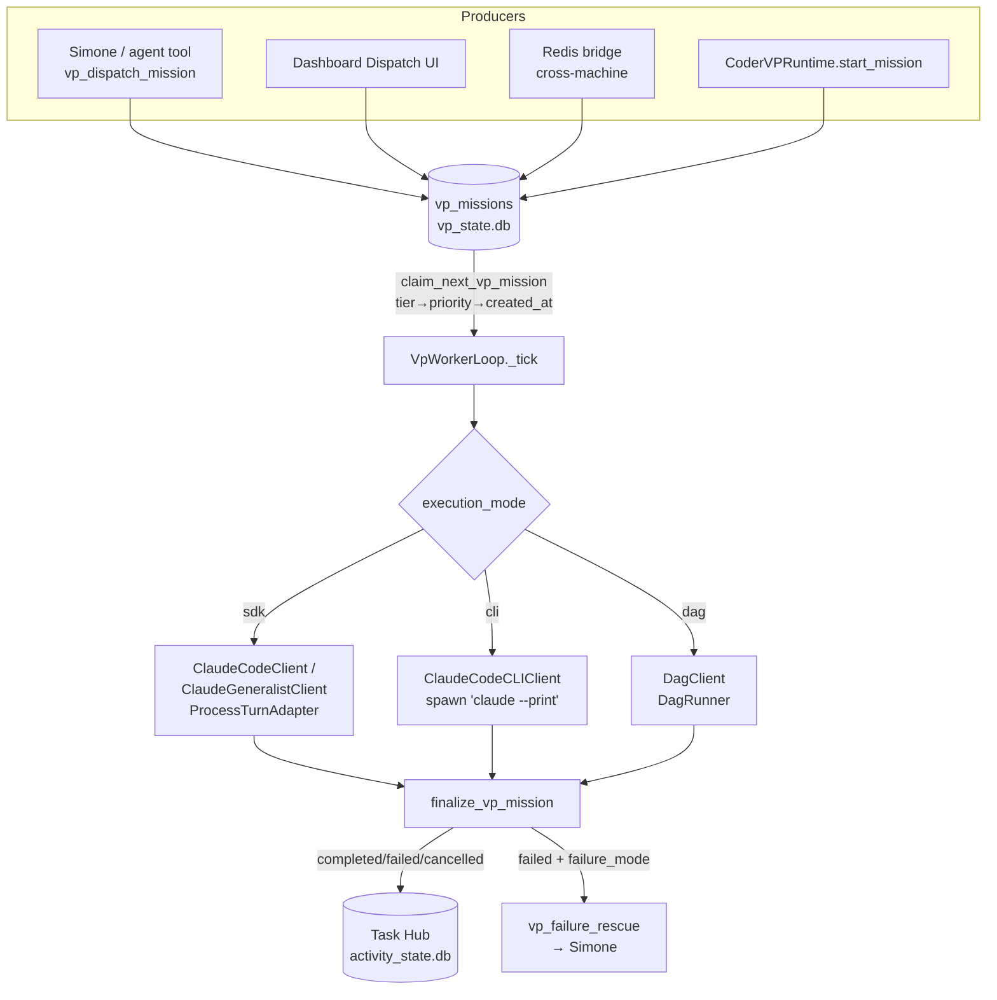

# VP Workers & Delegation

## What this subsystem is

A "VP" (Vice President) is an autonomous worker agent that executes a discrete
**mission** in its own isolated workspace, separate from the Simone orchestrator
that dispatched it. Two VPs are enabled by default:

| Registry ID | Display name | `client_kind` | Soul file | Workspace |
|---|---|---|---|---|
| `vp.coder.primary` | **CODIE** (a.k.a. "Cody") | `claude_code` | `CODIE_SOUL.md` | per-mission, often a git worktree |
| `vp.general.primary` | **ATLAS** | `claude_generalist` | `ATLAS_SOUL.md` | per-mission directory |

These are defined in `vp/profiles.py::resolve_vp_profiles`. The enabled set is
controlled by `UA_VP_ENABLED_IDS` (default both); disabling one removes it from
the dict so dispatch and the worker loop refuse it.

The lifecycle is a durable, SQLite-backed work queue (`vp_missions` table in
`vp_state.db`). A producer (Simone via an agent tool, the dashboard, the Redis
bridge, or `CoderVPRuntime`) **queues** a mission row; a long-running
**`VpWorkerLoop`** process polls, atomically **claims**, executes via a
**client** (SDK / CLI / DAG), and **finalizes** the row. Terminal status is
mirrored to Task Hub for the Kanban board, and failures are surfaced back to
Simone for rescue.

## Mission dispatch & queueing

### The agent-facing tool surface

`tools/vp_orchestration.py` registers SDK tools that Simone (and other
principals) call:

- `vp_dispatch_mission` — queue a mission. Always pass `idempotency_key`
  (e.g. `task-<task_id>`); the mission_id is derived from
  `sha1(vp_id:idempotency_key)` in `dispatcher.py::_resolve_mission_id`, so a
  re-dispatch with the same key returns the existing row instead of duplicating.
- `vp_get_mission` / `vp_list_missions` / `vp_wait_mission` — inspect/poll.
  `vp_wait_mission` defaults to 1200s timeout, max 3600s.
- `vp_cancel_mission` — sets `cancel_requested=1` (honored at claim time and
  during execution).
- `vp_read_result_artifacts` — reads files from the mission's
  `result_ref` (`workspace://<path>`).
- **Failure-rescue verbs** (Simone's toolset): `vp_dispatch_mission_retry`,
  `vp_dispatch_mission_redispatch_fresh`, `escalate_vp_failure_to_operator`
  (see Failure rescue below).

`dispatch_vp_mission(...)` is a Python convenience wrapper around the same
`_vp_dispatch_mission_impl` for in-process callers.

### Dispatch internals

`dispatcher.py::dispatch_mission` (wrapped by `dispatch_mission_with_retry`,
which retries on SQLite `database is locked` with backoff):

1. Resolves the `VpProfile` (raises `ValueError` if the VP is not enabled).
2. Validates target paths via `_validate_dispatch_constraints` (CODIE + any CLI
   mission). See **Workspace guardrails** below.
3. Idempotency short-circuit: if `get_vp_mission(mission_id)` already exists,
   returns it unchanged.
4. Upserts a `vp_sessions` row (`status=idle`) and emits `vp.session.available`.
5. `queue_vp_mission(...)` inserts the `vp_missions` row, then emits
   `vp.mission.dispatched`.

`_build_payload` lifts `metadata.linked_task_id` to a **top-level `task_id`**
field on the payload — this is the contract the worker and CLI client read to
thread Task Hub linkage (closing the "delegated zombie" pattern; see below).

### Preference context injection

`_with_preference_context` appends "KEVIN'S PREFERENCE CONTEXT" to the objective
for `vp.coder.primary`/`vp.general.primary` missions, pulled from
`services/proactive_preferences.get_delegation_context`. Suppress with
`constraints.skip_preference_context=True`.

## Priority tiers

Missions are scheduled by **semantic tier**, not raw numeric priority. Defined in
`vp/mission_priority.py`:

| Tier | Rank | Meaning |
|---|---|---|
| `operator_daily` | 0 | Kevin reads with morning coffee — briefings, YouTube daily digest, evening recap. >2h delay = SLA breach. |
| `operator_signal` | 1 | Proactive intelligence (insight/convergence briefs, research reports, ideation/convergence evaluations). |
| `maintenance` | 2 | Housekeeping — curation, proactive wiki, doc-maintenance. |
| `background` | 3 | Default for anything unmapped — runs when the queue is otherwise clear. |

`resolve_tier(mission_type)` maps the `mission_type` string to a tier via
`MISSION_TYPE_TIER`, defaulting to `background`. There is a **defensive substring
guard**: any mission_type containing `ideation`, `convergence`, `intel_brief`,
or `insight_brief` resolves to `operator_signal` even if not explicitly listed —
because those families are dispatched under LLM-chosen names that can't be fully
enumerated.

**Why tiers, not numbers:** a numeric-only scheme (default 100 = lowest urgency)
bit the forgetful caller — the 2026-05-27 morning briefing sat at priority=100
behind ~110 insight_briefs at priority=3. `background` is the *safe* default:
forgotten work runs last, never blocks the queue.

The claim SQL in `durable/state.py::claim_next_vp_mission` orders by a hardcoded
`CASE priority_tier` rank, then `priority ASC`, then `created_at ASC`. The
hardcoded CASE must stay in lockstep with `TIER_RANK`. `queue_vp_mission`
auto-resolves the tier from `mission_type` when the caller omits `priority_tier`
(the normal case); pass an explicit tier only to override the mapping.

## Profiles & workspaces

`VpProfile` (frozen dataclass) carries `vp_id`, `display_name`, `runtime_id`,
`client_kind`, `workspace_root`, `soul_file`, `cli_capable`. Workspace roots
default to `AGENT_RUN_WORKSPACES/vp_coder_primary_external` /
`vp_general_primary_external`, overridable via `UA_VP_CODER_WORKSPACE_ROOT` /
`UA_VP_GENERAL_WORKSPACE_ROOT`.

At mission start the worker seeds the VP's **soul** into the per-mission
workspace (`worker_loop.py::_seed_vp_soul`, reading from
`prompt_assets/<soul_file>`) so the agent loads its own identity (CODIE/ATLAS)
rather than Simone's. If the payload carries `system_prompt_injection`, it is
written to `MISSION_BRIEFING.md` in the workspace
(`_write_mission_briefing`).

## Execution clients

The worker selects a client per-mission from `payload.execution_mode`
(`worker_loop.py::_select_client_for_mission`). All implement
`vp/clients/base.py::VpClient.run_mission(...) -> MissionOutcome`.

### `sdk` (default) — `ClaudeCodeClient` / `ClaudeGeneralistClient`

Runs the mission in-process via `execution_engine.ProcessTurnAdapter` (the
Claude Agent SDK runtime). The objective is the prompt for CODIE; the generalist
builds a structured prompt (`_build_prompt`) that includes an NLM-first artifact
directive. On error it consults `services/sdk_timeout_park` to park
poison-pill missions that keep hitting the wall-clock cap. A zero-output mission
(empty `final_text`) is treated as a startup-crash **failure**. CODIE scans its
final text for a PR URL and records the mission→PR linkage for the reconciler.

### `cli` — `ClaudeCodeCLIClient`

Spawns `claude --print --output-format stream-json --verbose` as an external
subprocess. This is the **only** mode where Claude Code features like Agent
Teams, the full toolchain, skills, and `/goal` actually work — the SDK runtime
doesn't expose them. Key behaviors (`clients/claude_cli_client.py`):

- **Timeouts:** default 1800s (`timeout_seconds` payload override), max 14400s
  (4h). Stall detection at 300s of no output. Retries up to `MAX_RETRIES=2`
  with a retry prompt that injects the prior error — except **auth failures
  short-circuit immediately** (`_is_auth_failure`), since the same env will
  re-401.
- **Stream buffer:** `limit=10 MiB` (`CLI_STREAM_BUFFER_LIMIT`) because
  stream-json lines (large tool_result blocks) legitimately exceed asyncio's
  64 KiB default and would otherwise crash the monitor.
- **Session budget:** acquires `SessionBudget` slots (2 if Agent Teams, else 1)
  and enters "heavy mode"; fails the mission if the budget is exhausted.
- **run.log:** writes an incremental `run.log` in the workspace in the
  gateway-chat format (`👤 USER`, `🤖 ASSISTANT`, `🔧 TOOL CALL`,
  `📦 TOOL RESULT`) — the canonical rehydration source for the three-panel
  viewer — plus a raw `cli_stream.log`.
- Captures the CLI subprocess's `session_id` from stream events and writes it
  back to the **parent** Task Hub row's `metadata.dispatch.cody_*` (via
  `record_cody_dispatch_metadata`) so the dashboard Workspace button deep-links
  to the Cody CLI session — NOT the orchestrator's session.

### `dag` — `DagClient`

Replaces the autonomous loop with a deterministic state machine
(`services/dag_runner.DagRunner`). Workflow comes from `payload.dag_definition`
(inline dict) or `payload.dag_definition_path` (YAML). Supports a
`waiting_for_human` gate (mapped to a `completed` outcome with paused metadata).

## Cody-mode routing (ZAI vs Anthropic)

`services/cody_mode.py` picks Cody's execution endpoint. Resolution order
(`resolve_cody_mode`):

1. `task.cody_mode` (per-task override on `task_hub_items`)
2. DB setting `cody_default_mode` (dashboard tile, `task_hub_settings`)
3. `UA_CODY_DEFAULT_MODE` env var
4. Hardcoded fallback `"anthropic"` — **flipped from `"zai"` on 2026-05-11 PM**
   per operator decision.

`vp_dispatch_mission` resolves the mode at dispatch and plumbs it into
`metadata.cody_mode`. Critically, **when `cody_mode == "anthropic"` it FORCES
`execution_mode="cli"`** and ignores any conflicting explicit `execution_mode`
(logging a warning). Rationale: `/goal` and Agent Teams are Anthropic Claude
Code features that only function through the CLI subprocess with workspace-local
OAuth — an SDK in-process route would run on ZAI/GLM. To use the SDK path
deliberately, pass `cody_mode="zai"`.

In the CLI client, `_build_cli_env` honors the mode:

- `anthropic`: **strips every `ANTHROPIC_*` env var** from the subprocess,
  forces `CLAUDE_CODE_EXPERIMENTAL_AGENT_TEAMS=1`, and forwards
  `CLAUDE_CODE_OAUTH_TOKEN` (from `claude setup-token`, stored in Infisical;
  legacy `ANTHROPIC_MAX_OAUTH_TOKEN` accepted as fallback). It also pops any
  stale `ANTHROPIC_API_KEY`. The token form is `sk-ant-oat01-...` and MUST be
  set as `CLAUDE_CODE_OAUTH_TOKEN`, not `ANTHROPIC_API_KEY` (Claude Code rejects
  an OAuth token in the API-key slot).
- `zai` (or anything else): inherits the parent ZAI-routed env; adds Agent
  Teams only if `enable_agent_teams`.

Model selection (anthropic mode only): defaults to `--model claude-opus-4-8`,
overridable via `UA_CODY_CLI_MODEL` (set to `default`/empty to use the CLI's
own default, currently Sonnet).

Token usage from the CLI `result` event is recorded for the dashboard tile via
`cody_token_tracking.record_token_usage` (`_record_mission_token_usage`).

## The worker loop

`vp/worker_loop.py::VpWorkerLoop` is the long-running poller; `worker_main.py`
is the process entrypoint (`python -m universal_agent.vp.worker_main --vp-id
vp.coder.primary`). `worker_main` bootstraps Infisical secrets and configures
git credentials (so VP subprocesses can push) before starting.

In production each VP runs as its own **systemd templated unit** —
`universal-agent-vp-worker@vp.coder.primary` and
`universal-agent-vp-worker@vp.general.primary` (restarted by `deploy.yml` on
every deploy). The two VPs also share a single **AgentMail inbox**
(`vp.agents@agentmail.to`, display name `Codie/Atlas`), with inbound mail routed
to the right VP by name detection (scanning subject/body for Cody/Codie vs
Atlas). See the Email Architecture source-of-truth doc for that protocol.

Each tick (`_tick`):

1. Heartbeat the session lease; reset `degraded → idle` on a healthy beat.
2. `claim_next_vp_mission` (atomic `BEGIN IMMEDIATE` + tier-ordered SELECT +
   conditional UPDATE). Also clears stale `vp_sessions.last_error` on a
   successful claim.
3. If `cancel_requested`, finalize `cancelled` and return.
4. Otherwise `_execute_mission_logic`: seed soul, write briefing, provision
   workspace, select client, run a background mission-claim heartbeat task,
   and execute under `DagConcurrencyGovernor.acquire_slot()` (global concurrency
   limiter).

Concurrency/lease env flags (defaults): `UA_VP_POLL_INTERVAL_SECONDS=5`,
`UA_VP_LEASE_TTL_SECONDS=120`, `UA_VP_MAX_CONCURRENT_MISSIONS=1`. On a
rate-limit error (`429`/overloaded), the loop reports to `CapacityGovernor`.

### Workspace provisioning (CODIE git worktrees)

For `vp.coder.primary` whose target path is a git repo, `_provision_workspace`
creates an **ephemeral git worktree** at `<workspace_root>/<mission_id>` on
branch `vp-task-<mission_id[:8]>`. After finalization, `_teardown_workspace`
removes the worktree with `git worktree remove --force` — **unless** the
mission's `result_ref` points at the worktree itself (the agent wrote output
there), in which case teardown is skipped to preserve artifacts. Reusable
worktree helpers live in `vp/worktree_utils.py` (`provision_worktree`,
`syntax_check_changed_py`, `revert_changed_files`, etc.).

### Finalization

`_execute_mission_logic` derives `failure_mode` and `transcript_tail` from the
outcome (`_classify_outcome_failure_mode`) and calls `finalize_vp_mission`. Then:

- **Task Hub sync** — closes two rows: (1) the mirror row keyed by
  `task_id == mission_id`, and (2) the **original source task** identified via
  the payload's `task_id`/`metadata.linked_task_id`/`metadata.task_id`
  (`_resolve_source_task_id_from_payload`). Closing the source task is what
  prevents the **"delegated zombie"** pattern (rows stuck in `status=delegated`
  forever; ~188 accumulated over ~3 weeks pre-fix). Failed→`open`,
  completed→`completed`, cancelled→`cancelled`.
- **Terminal disposition** — completed missions get
  `completed_with_pr`/`completed_without_pr` (PR URL detected by reusing
  `proactive_codie._GITHUB_PR_RE`) so Simone's digest can distinguish a shipped
  PR from a legitimate no-op.
- **doc-maintenance hook** — for `mission_type` starting `doc-maintenance`,
  `_post_mission_push_pr_merge` runs OUTSIDE the sandbox (full network), pushes
  the agent's `docs/*` branch, opens a PR against `UA_GH_PR_BASE_BRANCH`
  (default `main`) on `UA_GH_REPO`, squash-merges it, records the linkage, and
  switches back to base.
- **Finalize artifacts** — writes `mission_receipt.json` and `sync_ready.json`
  (toggles `UA_VP_MISSION_RECEIPT_ENABLED`, `UA_VP_SYNC_READY_MARKER_ENABLED`,
  marker filename `UA_VP_SYNC_READY_MARKER_FILENAME`).

## Self-briefing & completion attestation (`/goal` flow)

> **Correction vs legacy docs:** the VP Goal / Failure-Rescue feature is
> implemented in code (not "DRAFT / NOT YET IMPLEMENTED" as older inventories
> stated). It is gated OFF by default behind `UA_VP_GOAL_ENABLED` (per
> `services/self_briefing.vp_goal_enabled`), with a per-task override.

`services/self_briefing.is_goal_eligible_mission` decides whether a mission gets
the full `/goal` artifact set. Eligibility is **CODIE-only** (`vp.coder.primary`;
Atlas never gets `/goal`) AND either:

1. `metadata.use_goal_loop=True` (per-task opt-in — the dashboard Dispatch UI
   sets this for Cody targets, and it wins even when the global flag is OFF), or
2. `UA_VP_GOAL_ENABLED` ON AND `source_kind`/`mission_type` in
   `GOAL_ELIGIBLE_SOURCE_KINDS` (`cody_demo_task`, `cody_scaffold_request`,
   `tutorial_build`, `tutorial_build_task`).

`vp_dispatch_mission` inherits `use_goal_loop` from the linked task's metadata
when the mission doesn't set it explicitly. When goal-enabled, the CLI prompt
(`_build_cli_prompt`, gated on `UA_VP_GOAL_ENABLED`) instructs the VP to invoke
the `self-brief-and-attest` skill first (write `BRIEF.md`, plus
`ACCEPTANCE.md`/`goal_condition.txt` when eligible) and to write `COMPLETION.md`
before declaring done.

After a `completed` outcome, the worker enforces the attestation
(`check_completion_attestation`) for goal-eligible missions only — checking both
the canonical mission workspace and the CLI's actual cwd
(`payload.cli_workspace_dir`). A missing `COMPLETION.md` **demotes the mission to
`failed`** with `failure_mode="missing_completion_attestation"`, which Simone
recognizes as a protocol violation (not a work failure). The per-mission
eligibility gate (vs the old global flag) is deliberate — gating on the global
flag spuriously demoted successful non-goal Cody missions.

## CLI exit classification (protocol violations)

For CLI missions with a linked `task_id`, `_classify_and_route_cli_exit` feeds
`exit_code` + `was_timeout_killed` + `assignment_id` into
`services/worker_exit_classifier.classify_worker_exit`. It logs the bucket,
writes the classification onto the run row via `task_hub._close_run`, and — if
the exit is a protocol violation (rc=0 but the task is still `in_progress`,
i.e. `clean_exit_zero_no_disposition`) — parks the task in `needs_review` via
`park_task_for_protocol_violation`. All best-effort; never blocks dispatch.

## Failure rescue

`finalize_vp_mission` surfaces failed/cancelled missions (except
`failure_mode="operator_cancel"`) as an informational `vp_mission_failure` task
hub item routed to Simone (`services/vp_failure_rescue`). The `failure_mode`
string tells Simone which rescue verb to pick. Simone's three tools in
`vp_orchestration.py`:

- `vp_dispatch_mission_retry` — re-dispatch SAME VP with additional guidance,
  extending the `rescue_chain_id` (so failure_count keeps growing). For
  self-reported / goal-cap failures where guidance addresses the gap.
- `vp_dispatch_mission_redispatch_fresh` — re-dispatch in a FRESH workspace (no
  inherited partial state). For subprocess crashes / env corruption.
- `escalate_vp_failure_to_operator` — open a `chat_panel` task for Kevin. For
  auth / workspace-guard / config failures Simone can't fix, or after rescue
  attempts exhaust.

Each verb closes the corresponding `vp_failure:<mission_id>` task hub item with a
`rescue_log` audit entry. `failure_mode` values produced by the classifier:
`missing_completion_attestation`, `auth_failure`, `workspace_guard`,
`subprocess_crash`, `timeout`, `goal_cap_hit`, `operator_cancel`,
`vp_self_reported`.

## Workspace guardrails

CODIE and any CLI mission cannot write into the UA repo/runtime tree. Enforced by
`guardrails/workspace_guard.enforce_external_target_path` at three sites:
`dispatcher._validate_dispatch_constraints`, `claude_code_client`, and
`claude_cli_client`. Blocked roots: repo root, `AGENT_RUN_WORKSPACES`,
`artifacts`, `Memory_System`. Allowlisted: `UA_VP_HANDOFF_ROOT` (default
`/opt/universal_agent/vp_handoff`). Toggle with `UA_VP_HARD_BLOCK_UA_REPO`
(default on). An explicit repo-mutation request to an approved codebase path
(`codebase_policy.is_approved_codebase_path`) is allowed. Path keys are extracted
from a fixed alias list (`target_path`, `path`, `repo_path`, `workspace_dir`,
`project_path`, `output_path`, `working_directory`, `dest_path`, `destination`,
`targets`) — **these three lists must stay in sync** across dispatcher, CLI
client, and worker_loop; an unknown key is logged as a warning and silently
ignored.

## CODIE routing (CoderVPRuntime)

`vp/coder_runtime.py::CoderVPRuntime` is the Phase A registry + session
lifecycle service that decides whether a user request goes to CODIE at all
(`route_decision`). CODIE is **explicit-intent only**: the input must match a
`\bcodie\b` / `coder vp` / `vp coder` pattern (`is_coding_intent`). It also
refuses **internal-system** requests (mentions of Simone, this system,
heartbeat, `src/universal_agent`, etc.) — those stay on Simone. The decision
reasons: `forced_fallback`, `feature_disabled`, `intent_not_coding`,
`internal_system_request`, `below_codie_threshold`, `shadow_mode`, `eligible`.
Toggles: `UA_DISABLE_CODER_VP`, `UA_ENABLE_CODER_VP`, `UA_CODER_VP_SHADOW_MODE`,
`UA_CODER_VP_FORCE_FALLBACK`. CODIE is default-on (`coder_vp_enabled(default=True)`
at the route site).

`CoderVPRuntime` also exposes a direct mission lifecycle (`start_mission`,
`append_progress`, `mark_mission_completed/failed/fallback`) used by the
in-process path, with its own finalize-artifact writing.

> **Note on principals vs sub-agents:** CODIE/Cody and ATLAS are top-level VP
> worker agents, distinct from the `.claude/agents/*.md` helper sub-agents
> (e.g. `csi-supervisor`). Simone is a heartbeat-driven principal, not a VP.

## Factory delegation: Redis bridge & heartbeat

For **cross-machine** mission delegation, `delegation/` provides a Redis Streams
transport bridged to the local VP SQLite queue. Architecture decision D-006:
**Redis is the transport, SQLite is the execution state machine** — Redis is NOT
the state machine.

`delegation/bridge_main.py` (`python -m universal_agent.delegation.bridge_main`)
runs three concurrent tasks:

- **Inbound** (`RedisVpBridge`) — consumes `MissionEnvelope` messages, maps
  `mission_kind → vp_id` (`coding_task→vp.coder.primary`,
  `general_task`/`research_task→vp.general.primary`, default
  `vp.general.primary`), and `queue_vp_mission(...)` into `vp_missions` with
  `source="redis_bridge"`. Idempotent on `mission_id=bridge-<job_id>`. The
  existing `VpWorkerLoop` then executes it — no separate execution engine.
  Handles retry/DLQ on failure. `tutorial_bootstrap_repo` is skipped (handled by
  another consumer). System missions (`system:*`) are handled inline.
- **Outbound** (`RedisVpResultBridge`) — polls finalized
  `source='redis_bridge'` missions with `result_published=0`, publishes a
  `MissionResultEnvelope` (SUCCESS/FAILED) back to the Redis results stream, and
  marks them published.
- **Heartbeat** (`FactoryHeartbeat`) — POSTs to
  `{UA_HQ_BASE_URL}/api/v1/factory/registrations` every
  `UA_HEARTBEAT_INTERVAL_SECONDS` (default 60, min 10) with capabilities and a
  policy snapshot. HQ uses `last_seen_at` for stale detection. Exponential
  backoff on failure (cap 5 min); `is_healthy` after <3 consecutive failures.

**System missions** (`delegation/system_handlers.py`) are handled inline by the
bridge rather than queued: `system:update_factory` (runs
`scripts/update_factory.sh`, returns `restart_requested=True` so systemd
restarts with new code), `system:pause_factory`, `system:resume_factory`.

`delegation/factory_registry.py::FactoryRegistry` is the SQLite-backed,
thread-safe store of factory registrations on the HQ side (replacing an
in-memory dict). `enforce_staleness` marks rows `stale` after 300s and `offline`
after 900s of no heartbeat.

Redis connection is built from `UA_REDIS_URL` or
`UA_REDIS_HOST`/`UA_REDIS_PORT`/`REDIS_PASSWORD`/`UA_REDIS_DB`. The bridge is
gated by `UA_DELEGATION_REDIS_ENABLED=1` (advertised as the `delegation_redis`
capability).

## Key env-var flags

| Flag | Default | Effect |
|---|---|---|
| `UA_VP_ENABLED_IDS` | both VPs | CSV of enabled VP ids |
| `UA_VP_POLL_INTERVAL_SECONDS` | 5 | worker poll interval |
| `UA_VP_LEASE_TTL_SECONDS` | 120 | mission claim lease TTL |
| `UA_VP_MAX_CONCURRENT_MISSIONS` | 1 | per-worker concurrency |
| `UA_VP_HARD_BLOCK_UA_REPO` | on | block writes into repo/runtime roots |
| `UA_VP_HANDOFF_ROOT` | `/opt/universal_agent/vp_handoff` | allowlisted external write root |
| `UA_VP_CODER_WORKSPACE_ROOT` / `UA_VP_GENERAL_WORKSPACE_ROOT` | unset | workspace root overrides |
| `UA_CODY_DEFAULT_MODE` | (unset → `anthropic`) | default Cody endpoint |
| `UA_CODY_CLI_MODEL` | `claude-opus-4-8` | CLI model in anthropic mode |
| `UA_VP_GOAL_ENABLED` | off | global `/goal` self-brief + attestation |
| `UA_DISABLE_CODER_VP` / `UA_ENABLE_CODER_VP` | — | CODIE routing toggles |
| `UA_CODER_VP_SHADOW_MODE` / `UA_CODER_VP_FORCE_FALLBACK` | off | CODIE routing modes |
| `UA_DELEGATION_REDIS_ENABLED` | off | cross-machine Redis bridge |
| `UA_HQ_BASE_URL` / `UA_HEARTBEAT_INTERVAL_SECONDS` | — / 60 | factory heartbeat |
| `UA_GH_REPO` / `UA_GH_PR_BASE_BRANCH` | `Kjdragan/universal_agent` / `main` | doc-maintenance PR target |
| `UA_VP_MISSION_RECEIPT_ENABLED` / `UA_VP_SYNC_READY_MARKER_ENABLED` | on | finalize artifacts |

## Gotchas

- **`cody_mode="anthropic"` overrides `execution_mode`.** Passing
  `execution_mode="autonomous"` (or anything but `cli`) is ignored with a
  warning when the resolved mode is anthropic. To deliberately use the SDK
  in-process path, set `cody_mode="zai"`. (This footgun ran a `/goal` smoke test
  on glm-5 and then spuriously demoted the success.)
- **Canonical Task Hub DB is `activity_state.db`**, resolved via
  `durable/db.get_activity_db_path()` — NOT `task_hub.db`. VP mission state lives
  in a separate `vp_state.db` (`get_vp_db_path()`).
- **Three path-key lists must stay in sync** (dispatcher, CLI client,
  worker_loop). An unknown constraint key is silently dropped (logged as a
  warning).
- **vp_mission mirror rows are visibility-only.** `vp_dispatch_mission` sets
  `agent_ready=False` on the Task Hub mirror so the dispatch sweep can't re-claim
  it (VP workers claim by `mission_id` directly). This closes the 2026-05-07
  rogue-branch resurrection path.
- **`CLAUDE_CODE_OAUTH_TOKEN` is the canonical Cody-on-Anthropic credential**
  (from `claude setup-token`, in Infisical). Do NOT map it to
  `ANTHROPIC_API_KEY` — Claude Code rejects an OAuth token in the API-key slot.
- **Goal attestation is per-mission, not global.** `is_goal_eligible_mission`
  gates the `COMPLETION.md` demotion; gating on the global flag spuriously failed
  successful non-goal Cody missions.
- **CLI session_id is written to the PARENT task row, not the assignment row.**
  PR #488 mistakenly wrote `provider_session_id` (the orchestrator's, e.g.
  Simone's) — overwriting it lost Simone's session identity.
