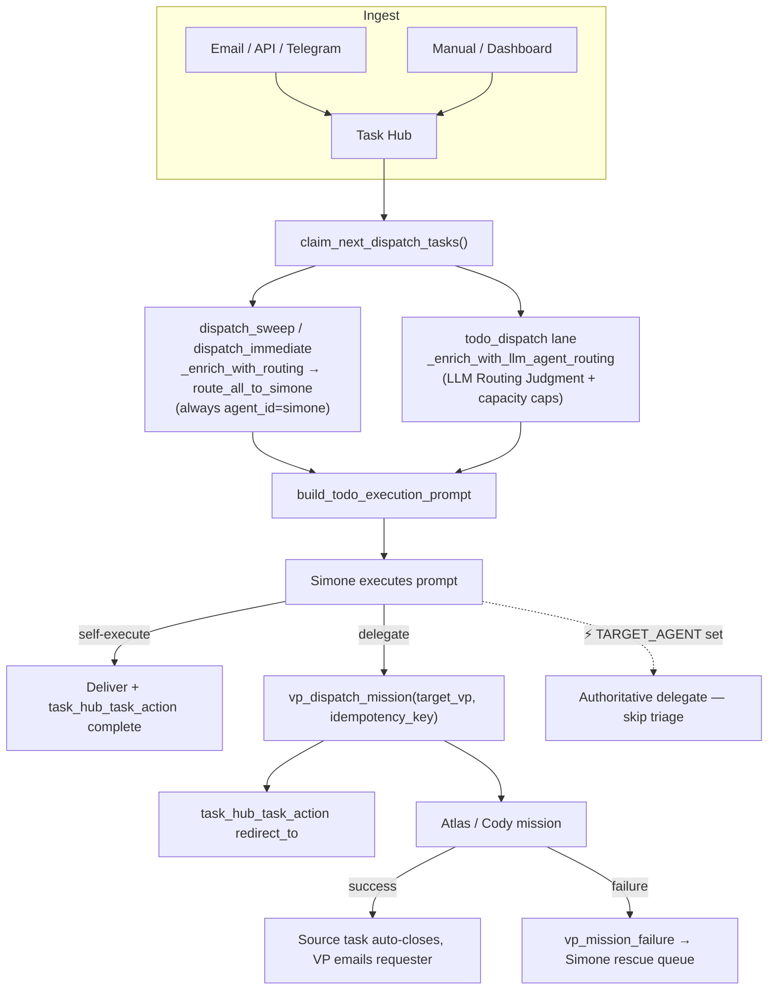

# Simone-First Orchestration

## What this is

Simone-first orchestration is the routing model where **every claimed Task Hub work
item is routed to Simone**, the primary Claude Code principal. Simone is the executor,
the triage decision-maker, and the lifecycle owner. She decides — per task — whether to
**execute the work herself** or **delegate it to a VP** (Atlas / Cody) via the
`vp_dispatch_mission` tool. The system never decides delegation; it only attaches an
advisory routing hint that Simone may honor or override.

This model replaced an older keyword-based `qualify_agent()` deterministic router.
**`qualify_agent*` is fully decommissioned** — `grep qualify_agent src/` returns nothing.

## D3 — the Pythonic priority dispatcher supersedes this when enabled

> **Status (2026-06-16): the priority dispatcher is now DEFAULT-ON (Stage A live).**
> `priority_dispatcher.py::priority_dispatcher_enabled` defaults to **ON** when
> `UA_PRIORITY_DISPATCHER_ENABLED` is unset (tri-state: explicit `0`/`false`/`no`/`off`
> is the kill switch → falls back to legacy Simone-First; explicit truthy → on). The flag
> is also set to `1` in Infisical prod (belt-and-suspenders / survives any reset). So
> **routing is owned by `services/priority_dispatcher.py`** and the Simone-First stamp is
> skipped — the Simone-First behavior described below this section is now the **legacy /
> kill-switch fallback path**. The flip followed a clean 30-min live health probe + a
> controlled end-to-end smoke dispatch (task → Cody, Simone turn skipped, clean
> `delegated`→`completed`). **prefer-ATLAS is still OFF** (Stage A, not Stage B).
>
> **M3 (2026-06-15) — redundant cron retired; staged enable prepared (flags NOT flipped).**
> The standalone `atlas_direct_dispatch` cron is **retired**: its registration function
> `gateway_server.py::_ensure_atlas_direct_dispatch_cron_job` no longer registers a `*/1`
> cron — it now **DELETEs** the persisted cron row via `_cron_service.delete_job` (a plain
> `enabled=False` disable-on-flip did not durably stop the live prod row). The
> `metadata.preferred_vp = "vp.general.primary"` (prefer-ATLAS) lane it used to own now
> lives in `priority_dispatcher.py::classify_task` + `::dispatch_claimed`. M3 only retires
> the redundant cron and **prepared** a staged, operator-gated enable. The stages:
> - **Stage A (LIVE as of 2026-06-16)** — dispatcher ON, prefer-ATLAS still OFF: the
>   dispatcher owns routing, but `metadata.preferred_vp=vp.general.primary` general/research
>   tasks **fall back to Simone** (no degradation; decision `preferred_vp_general_simone_fallback`).
> - **Stage B (not yet flipped)** — additionally `UA_DISPATCHER_PREFER_ATLAS=1`:
>   `preferred_vp=vp.general.primary` now routes to **ATLAS** (decision `preferred_vp_general`).
>
> The service module `services/atlas_direct_dispatch.py` is **kept importable** — `heartbeat_service.py`
> still reads `atlas_direct_dispatch.py::list_recent_atlas_direct_dispatches` for Simone's briefing.

The Simone-First model funnels **every** claimed task through Simone's heavy ~1.25M-token
heartbeat turn *just to decide who does it*. That is the dominant token cost. Decision D3
replaces routing with a **deterministic, no-LLM-in-the-hot-path priority dispatcher**:

- `priority_dispatcher.py::classify_task` makes a deterministic `DispatchDecision` per task
  (pure, no LLM, no I/O): explicit `target_agent` → that VP (P0); `chat_panel`/`simone_chat`
  → Simone (P0); coding source_kind (the canonical `vp_orchestration.py::_CODER_LANE_SOURCE_KINDS`
  = `tutorial_build`/`cody_demo_task`/`cody_scaffold_request`) or `workflow_kind=="code_change"`
  → Cody (P0); pre-tagged `metadata.preferred_vp` → that VP (P2); genuinely ambiguous untagged
  tail → the cheap sonnet/haiku classifier `llm_classifier.py::classify_agent_route` (the ONLY
  LLM touch, and only for the untagged tail).
- `priority_dispatcher.py::dispatch_claimed` composes the two capacity gates — the global
  `capacity_governor.py::CapacityGovernor.can_dispatch` (api_down / 429-backoff) and the
  per-agent caps (`vp_capacity.py::_vp_active_counts` vs `UA_MAX_CONCURRENT_VP_*`) — then
  **dispatches VP-bound tasks directly from Python** via `tools/vp_orchestration.py::dispatch_vp_mission`
  and marks the source task `delegated` via `task_hub.py::perform_task_action` (`action="delegate"`).
- **Simone is removed from the dispatch decision.** Only the Simone-bound residue — chat,
  explicit-Simone targets, the M1-gated general/research fallback, and any VP task with no free
  slot this tick — flows into her prompt. When every claimed task is dispatched to a VP, Simone's
  heavy turn is **skipped entirely** for that tick (the D3 win).
- **prefer-ATLAS** (`UA_DISPATCHER_PREFER_ATLAS`, default OFF) is a second, independent toggle:
  off → general/research falls back to Simone (no degradation); on → it prefers ATLAS.
- **Coupling-wake reduction (M3 side-effect).** Each `atlas_direct_dispatch` cron fire used to emit a
  `request_heartbeat_next` coupling-wake (`gateway_server.py::_maybe_wake_heartbeat_after_autonomous_cron`),
  ~60/hr. Retiring the cron removed that wake source; after M3 the remaining per-minute autonomous cron
  still feeding the coupling was `simone_chat_auto_complete` (`*/1`), ~62/hr.
- **Selective coupling (M4).** `_maybe_wake_heartbeat_after_autonomous_cron` is no longer non-selective. It
  now consults a **default-deny allowlist** (`cron_service.py::coupling_wake_allowed_jobs`, **empty** by
  default): a cron success couples to the heartbeat only if its `system_job` is explicitly allowlisted, so
  the remaining `*/1` `simone_chat_auto_complete` (and every other autonomous cron) no longer wakes Simone.
  Allowlisted wakes are **debounced** (~300s). The dispatch that the coupling used to chase is covered by
  this priority dispatcher (Python, no Simone turn) + `idle_dispatch_loop`; urgent work still wakes
  immediately via `request_heartbeat_now`. Net: the ~62/hr coupling-wake stream drops toward zero. The same
  allowlist closes the session-bound back door (`cron_service.py::_maybe_wake_heartbeat`).

Awareness is preserved: completion is recorded passively (`services/proactive_work_recap.py`) and
VP failures escalate via `services/vp_failure_rescue.py::surface_failure_to_simone`. Simone is
removed only from *dispatch*, not from *awareness* or *failure rescue*.

The slot-counting helpers (`_vp_active_counts`, `_available_agents_for_llm_routing`,
`_env_positive_int`) live in `services/vp_capacity.py` as a shared seam imported by the legacy todo
path and the priority dispatcher (they are re-exported from `todo_dispatch_service.py` for backward
compatibility). The dependency direction is one-way: `atlas_direct_dispatch.py` imports `_vp_active_counts`
from `vp_capacity.py`, **not** the reverse — `vp_capacity.py` does not import `atlas_direct_dispatch.py`.
With the `atlas_direct_dispatch` cron retired (M3, above), `atlas_direct_dispatch.py` is no longer a live
dispatcher; it remains importable only for `list_recent_atlas_direct_dispatches` (Simone's briefing).

### Slot decision — per-sweep cap kept; the real bound is the VP worker

The dispatcher's per-agent cap (`vp_capacity.py::_vp_active_counts` vs `UA_MAX_CONCURRENT_VP_GENERAL`,
default 2) is **per-sweep only**: a delegated task holds no active VP assignment across ticks, so this
cap does **not** bound the number of ATLAS missions actually running. The real execution-concurrency
bound on running ATLAS missions is the **VP worker** — `vp/worker_loop.py::VpWorkerLoop.__init__` sets
`max_concurrent_missions` from `feature_flags.py::vp_max_concurrent_missions` (env
`UA_VP_MAX_CONCURRENT_MISSIONS`, default 1, minimum 1). M3 **deliberately did NOT add a cross-tick
dispatcher cap**: routing the per-sweep overflow back to Simone would re-add her heavy-turn token cost
for no concurrency benefit (the worker is already the gate). Do **not** cite
`vp_capacity.py::_available_agents_for_llm_routing` as THE concurrency bound — it reads the per-sweep
caps, not the worker bound.

> **Deferred-task policy (when a VP is at cap):** the decision is marked `deferred` and **left in
> the Simone residue this tick** (handled now, exactly as today) — there is intentionally **no
> release-on-defer**, because the only release verbs (`task_hub.py::finalize_assignments` /
> `release_stale_assignments`) consume the ToDo retry budget and would churn a capacity-deferred
> backlog into `needs_review`.

## The router itself is trivial

The "router" (`agent_router.py`) is intentionally tiny. Its job is not to make routing
decisions — it is to *stamp every task as Simone's* and carry a few agent-id constants:

```python
AGENT_SIMONE = "simone"
AGENT_CODER = "vp.coder.primary"
AGENT_GENERAL = "vp.general.primary"
```

`agent_router.py::route_all_to_simone` walks the claimed tasks and writes a `_routing`
dict onto each one, then returns `{ "simone": [...all tasks...] }`:

```python
task["_routing"] = {
    "agent_id": AGENT_SIMONE,            # always "simone"
    "confidence": "orchestrator",
    "reason": "Simone-first: all tasks route through primary orchestrator",
    "should_delegate": False,            # Simone decides delegation herself
}
```

There is no scoring, no keyword matching, no capability lookup here. The intelligence
lives in Simone's reasoning at execution time, not in the router.

## Two routing-enrichment paths

There are **two distinct code paths** that attach `_routing` to claimed tasks. Do not
conflate them — they run in different lanes and produce different metadata.

### 1. Generic sweep enrichment (`dispatch_service.py`)

The heartbeat dispatch sweep (`dispatch_service.py::dispatch_sweep`) and the dashboard
"Start Now" / "Approve" dispatch entry points all funnel claimed tasks through
`dispatch_service.py::_enrich_with_routing`, which simply calls `route_all_to_simone`.
This is the **unconditional, always-Simone** stamp. It is best-effort and never blocks
the sweep:

```python
def _enrich_with_routing(claimed):
    if not claimed:
        return claimed
    # D3: when the priority dispatcher owns routing, skip the advisory stamp.
    try:
        from universal_agent.services.priority_dispatcher import priority_dispatcher_enabled
        if priority_dispatcher_enabled():
            return claimed
    except Exception as exc:
        log.debug("priority_dispatcher gate check failed (using legacy routing): %s", exc)
    try:
        from universal_agent.services.agent_router import route_all_to_simone
        route_all_to_simone(claimed)
    except Exception as exc:
        log.debug("Agent routing enrichment unavailable: %s", exc)
    return claimed
```

`dispatch_sweep` defaults to `limit=1` and rebuilds the queue + claims the top N tasks
regardless of trigger type. Callers that should never claim VP-mirror rows pass
`forbidden_source_kinds=["vp_mission"]`.

### 2. LLM routing-judgment enrichment (`todo_dispatch_service.py`)

The Simone todo-dispatch lane (`todo_dispatch_service.py`) does something richer. Before
building Simone's execution prompt, it calls
`todo_dispatch_service.py::_enrich_with_llm_agent_routing`, which asks an LLM
(`llm_classifier.py::classify_agent_route`) to *recommend* an agent for each task. The
result is written into the same `_routing` key but with `method="llm"` and a real
`should_delegate` boolean.

Crucially, the LLM is only offered agents that currently have capacity. Concurrency caps
are read from env (`vp_capacity.py::_available_agents_for_llm_routing`, re-exported from
`todo_dispatch_service.py` for backward compatibility):

| Env var | Default | Meaning |
|---|---|---|
| `UA_MAX_CONCURRENT_VP_CODER` | `1` | Max simultaneous Cody (`vp.coder.primary`) missions |
| `UA_MAX_CONCURRENT_VP_GENERAL` | `2` | Max simultaneous Atlas (`vp.general.primary`) missions |

`simone` is always in the available set. A VP is only added if its active assignment
count is below its cap. If the LLM picks an unavailable VP, `classify_agent_route` falls
back to `simone` with `confidence="fallback"`. If the LLM call throws entirely, it falls
back to `simone` with `method="fallback"`, `should_delegate=False`.

`classify_agent_route` validates the returned `agent_id` against
`{"simone", "vp.coder.primary", "vp.general.primary"}` and coerces anything else to
`simone`.

## How Simone receives the routing signal

The `_routing` dict is **advisory input to Simone's prompt**, not a binding instruction.
`todo_dispatch_service.py::build_todo_execution_prompt` renders it as a line in the task
block:

- If `_routing.method == "llm"` → labeled **`LLM Routing Judgment`**
- Otherwise → labeled **`Routing Hint`**

Per the dispatch prompt (`TODO_DISPATCH_PROMPT`), an `LLM Routing Judgment` with
`should_delegate=true` is treated as **authoritative** (honor it unless the task clearly
fits an "execute yourself" case). The current default posture is **delegate by default** —
most `source_kind`s are owned by a VP, and Simone only self-executes small / interactive /
judgment tasks (e.g. `chat_panel`, `simone_chat`, one-tool-call invariant fixes).

> Note: legacy doc 05 framed the default as "Simone is the first choice; VPs are
> overflow." The current prompt inverts that emphasis to "delegate by default" with a
> per-`source_kind` ownership table baked into both the prompt and `HEARTBEAT.md`. The
> underlying mechanism (Simone decides) is unchanged; the *bias* shifted toward delegation.

### Explicit target_agent overrides everything

When a task carries an explicit `target_agent` (set by a user, the dashboard "Dispatch
Mission" box, or an upstream pipeline), the prompt renders a `⚡ TARGET_AGENT=<vp_id>`
line. This is **authoritative and non-negotiable**: Simone must delegate to that exact VP
via `vp_dispatch_mission` without re-evaluating, and must **not** consult any LLM Routing
Judgment for that item. Current builds suppress the LLM judgment line entirely when
`target_agent` is set; if both appear (legacy artifact), `target_agent` wins.

## Delegation mechanics

When Simone delegates, she:

1. Calls `vp_dispatch_mission(objective=..., target_vp="vp.general.primary"|"vp.coder.primary", task_id=..., idempotency_key="task-<task_id>")`.
   The `idempotency_key` is **mandatory** to prevent duplicate dispatches on interruption.
2. **Releases her claim with `task_hub_task_action(action="redirect_to", note="<vp_id>")`** —
   NOT `action="complete"`. The work is not done; the VP is just starting. `redirect_to`
   clears retry counters and stamps `metadata.preferred_vp`. The guardrail is satisfied not
   by `redirect_to` itself but by the preceding `vp_dispatch_mission` call (the
   `auto_delegate` branch — see [Lifecycle guardrail](#lifecycle-guardrail)). The VP closes
   the source task itself on completion.
3. Moves on. On VP success the source task auto-closes and the VP emails the requester
   directly (Simone CC'd). On VP failure, a `vp_mission_failure` informational task
   appears in Simone's queue for rescue handling.

> **Gotcha (corrects legacy doc 05):** the old "no task completes without Simone's
> sign-off / `pending_review`" model **was removed from the architecture**. There is no
> per-task `needs_review` pause for routine VP successes. See the in-code reference to
> `docs/01_Architecture/12_VP_Goal_Integration_And_Failure_Rescue_PRD.md` § 2. Simone
> still owns *failure* rescue, but routine success no longer round-trips through her.

> **Board optics (M3 §4.4).** A delegated task whose VP mission is actively **running** now renders in
> the dashboard `in_progress` lane (`gateway_server.py::_task_hub_board_projection` via the new
> `mission_running` arg, set from `_serialize_task_hub_queue_item` + `_live_vp_mission_ids`). This is
> **display-only** — the source task's status stays `delegated`, so the completion bridge
> `task_hub.py::transition_to_pending_review` still fires.

When manifests reconcile (`todo_dispatch_service.py::_reconcile_manifest_with_llm_route`):
if the LLM route picks `AGENT_CODER`, the workflow manifest is rewritten to
`workflow_kind="code_change"`, `codebase_root` is resolved from
`approved_codebase_roots_from_env()`, and `repo_mutation_allowed` is set accordingly.

## Lifecycle guardrail

Every claimed work item must end with a durable Task Hub lifecycle mutation, or the
todo-execution guardrail (`mission_guardrails.py::MissionGuardrailTracker`, the `todo_execution`
branch) flags `lifecycle_mutation` as missing and blocks Simone's completion.

The guardrail passes a turn when **any** of these hold:

- a lifecycle action in the enumerated set is observed:
  `{"review", "complete", "block", "park", "approve"}` (this exact tuple is what the
  code tests — see the `not any(action in lifecycle_actions for action in (...))` check);
- a `"delegate"` action is in `lifecycle_actions` → `stage_status="delegated"`;
- a VP dispatch was attempted/succeeded (`self.successful_vp_dispatches or
  self._vp_dispatch_attempted`) → `stage_status="auto_delegate"`.

Note: `redirect_to` is **not** in the enumerated lifecycle-action tuple. A delegation that
ends with `redirect_to` clears the guardrail via the `auto_delegate` branch — because
Simone called `vp_dispatch_mission` first, `_vp_dispatch_attempted` is set, which is what
actually satisfies the check. (The `TODO_DISPATCH_PROMPT` text lists `redirect_to` among
accepted actions; that prompt copy and the literal guardrail enumeration diverge — the
behavior is consistent only because the dispatch attempt accompanies the `redirect_to`.)

`TaskStop` is **not** a lifecycle primitive in this lane and must not be used.

## Gateway VP routing (external-VP fast path)

`gateway.py` contains a separate, lower-level VP routing layer for requests that carry an
explicit `delegate_vp_id` in their metadata (or where an explicit VP intent is inferred).
This is the synchronous request path, distinct from the heartbeat todo lane.

Key behaviors (`gateway.py`, around the request-handling generator):

- `requested_vp_id = request_metadata.get("delegate_vp_id")`.
- VP inference is **disallowed** for certain non-interactive sources:
  `{"cron", "webhook", "heartbeat", "heartbeat_synthetic", "task_run", "email_hook"}`.
- `strict_external_vp` (from `require_external_vp` metadata /
  `vp_explicit_intent_require_external(default=True)`) controls fallback:
  - **strict** → if external-VP dispatch fails, the request errors out; **no** fallback to
    Simone direct execution (`routing="external_vp_dispatch_failed_strict"`).
  - **non-strict** → on dispatch failure, continues on the Simone primary path
    (`routing="external_vp_dispatch_fallback"`).
- The gateway also maintains a coder-VP lease (`_coder_vp_lease_owner =
  "simone-control-plane"`) with periodic heartbeats and a worker-liveness check that
  combines lease liveness with fresh worker heartbeats
  (`vp_worker_heartbeat_stale_seconds(default=180)`).



## Why centralize through Simone

- **One execution context to configure.** A single tool-permission set, one session
  context to debug, one heartbeat loop. Eliminates the bug class where different routing
  paths carried different permissions.
- **Batch / cross-task awareness.** Because Simone sees the queue (rather than a blind
  per-ticket worker), she can recognize dependent tasks and avoid redundant work — the
  core advantage over a pure pull-based worker model. (See legacy doc 06 for the full
  comparison against the `agent-worker` pull pattern; that doc is a design essay, not a
  description of shipped behavior.)
- **LLM-native delegation.** The "who should do this" decision is an LLM judgment
  (`classify_agent_route`) plus Simone's own reasoning, not a brittle keyword router.

## Gotchas

- **`qualify_agent*` is gone.** Any doc or comment referencing it describes the retired
  router. The replacement is `route_all_to_simone` (deterministic stamp) + LLM judgment +
  Simone's reasoning.
- **`should_delegate` differs by path.** From `route_all_to_simone` it is always `False`
  (stamp only). From `_enrich_with_llm_agent_routing` it is a real LLM decision and is
  treated as authoritative in the prompt.
- **Delegation closes the source task with `redirect_to`, never `complete`.** Using
  `complete` at dispatch time creates an audit-trail lie and breaks failure rescue. This
  was a real bug fixed per PRD § 5.6.
- **Capacity caps gate the *menu*, not the *decision*.** If a VP is at capacity it is not
  offered to the LLM at all, so the LLM cannot pick it — it falls back to Simone.
- **Simone's heartbeat runs unconstrained in production checkouts.** A bad branch deployed
  without review once introduced a mid-flight `SyntaxError` that crashed a cron; recovery
  required parking the task with careful SQL (plain `cancel` gets resurrected by the
  orphan-reconciler), resetting to `origin/main`, and manual verification. Treat
  Simone-executed code changes in prod with the same caution as any direct-to-main push.
- **Heartbeat auto-triage feeds Simone.** Non-OK heartbeat findings are dispatched to
  Simone (structured findings contract `heartbeat_findings_latest.json`); she owns the
  remediation decision and may fix bounded coding issues autonomously, escalating only
  destructive / security / approval-bound fixes to the operator.

> **Note — `/btw` is UA's own minor sidebar-session command, not Claude Code's native `/btw`.**
> A `/btw` handler in `gateway_server.py` (matches `user_input.startswith("/btw ")`) routes the
> message into an ephemeral side gateway session via `session_hub.py::set_active_sidebar` /
> `get_active_sidebar` (in-memory only); `/return` exits. It is unrelated to the `/btw` slash
> command Claude Code ships. Tangential to Simone-first routing — documented where it lives, in
> `05_channels/05_web_ui_communication.md`.
