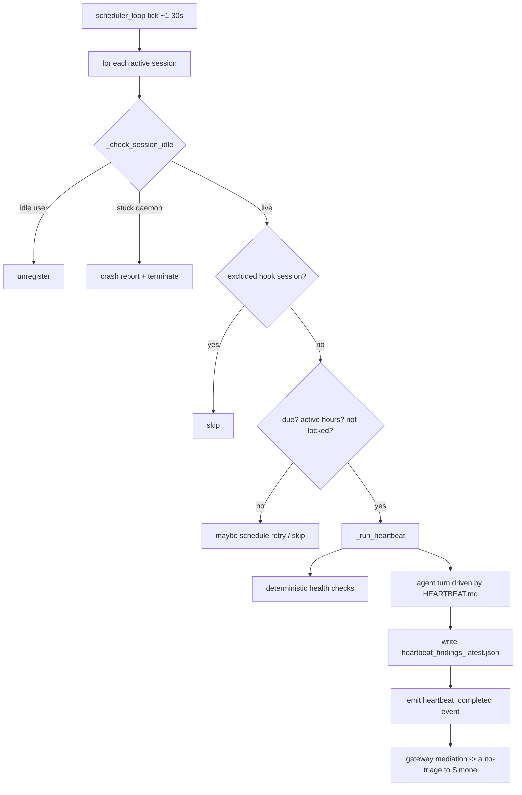
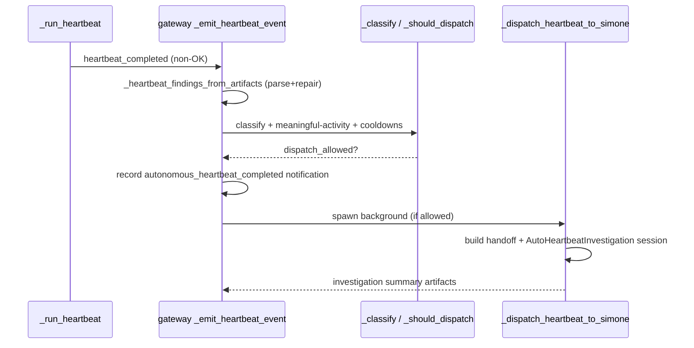

# Heartbeat Service

The Heartbeat Service is the application-level proactive scheduler for Universal Agent. It is what makes the agent act without a user prompt: on a fixed interval it wakes registered gateway sessions, runs an LLM turn driven by `memory/HEARTBEAT.md`, performs deterministic system-health and proactive-health checks, writes a machine-readable findings artifact, and lets the gateway auto-route any non-OK findings to Simone for investigation.

Implementation: `heartbeat_service.py::HeartbeatService`. The findings JSON contract: `utils/heartbeat_findings_schema.py`. The operator-authored directive the LLM follows each cycle: `memory/HEARTBEAT.md`.

## What the heartbeat does and does NOT own

The heartbeat is a **health / proactive supervisor**. It does:

- Periodic wakefulness for registered sessions (default every 30 min).
- Deterministic per-tick health checks (DB health, VP backlog sampling, proactive-health pre-flight).
- An LLM turn that reads `HEARTBEAT.md`, advances proactive mission work, and writes a findings artifact.
- Synthetic / deterministic findings when the agent does not write one.
- Idle-session cleanup and stuck-daemon termination.

It does **NOT** own trusted-email mission execution. Trusted inbound email is triaged by the hook layer and executed by the dedicated ToDo runtime (`services/todo_dispatch_service.py`). The heartbeat code that used to inline-claim Task Hub dispatch work has been **decoupled**: in `_run_heartbeat`, `task_hub_claimed` is now hardcoded to `[]` (the comment reads `# Dispatch logic moved to todo_dispatch_service`). Task claiming and routing are orchestrated by `services/dispatch_service.py::dispatch_sweep` (which the ToDo dispatcher drives — not the heartbeat loop), but the functions themselves live elsewhere: `route_all_to_simone` is defined in `services/agent_router.py::route_all_to_simone` and the claim primitive is `task_hub.py::claim_next_dispatch_tasks`. `dispatch_sweep` only calls them. As a result the "task-focused mode" branches inside `_run_heartbeat` (and the `finally`-block finalization of `task_hub_claimed`) are effectively dormant in the current call path; they remain in the file but are not reached because `task_hub_claimed` is always empty: it is initialized to `[]` and the only later assignment also sets it to `[]` (the dispatch path now records `task_hub_claimed_count` only, never repopulating the list).

## Process Heartbeat vs UA Heartbeat Service (do not confuse)

Two unrelated modules share the word "heartbeat":

| Dimension | Process Heartbeat (`process_heartbeat.py`) | UA Heartbeat Service (`heartbeat_service.py`) |
|---|---|---|
| Purpose | OS-level liveness timestamp | Application-level proactive agent scheduler |
| Mechanism | Daemon thread writes a timestamp file | Async task on the asyncio event loop runs an agent turn |
| Env prefix | `UA_PROCESS_HEARTBEAT_*` | `UA_HEARTBEAT_*` / `UA_HB_*` |

This document covers only the UA Heartbeat Service.

## Lifecycle and scheduling

`HeartbeatService.start()` launches `_scheduler_loop`, an `async` loop that ticks roughly every 1–30s (`tick_interval = max(1.0, min(30.0, every_seconds))`). Each tick it:

1. Emits a rate-limited `heartbeat_tick` activity event (`_emit_heartbeat_tick_activity_event`, throttled by `UA_HEARTBEAT_TICK_EMIT_INTERVAL_S`, default 60s) so the Mission Control Heartbeat tile sees liveness even when nothing fires.
2. Iterates a snapshot of `active_sessions` and calls `_process_session` on each.

`_process_session` is the gate that decides whether a given session is actually due. It:

- Runs `_check_session_idle` first — unregisters idle user sessions (default 600s, `UA_HEARTBEAT_IDLE_TIMEOUT`) and **terminates stuck daemon sessions** (default 1800s, `UA_DAEMON_IDLE_TIMEOUT`) with a crash report (`_write_daemon_timeout_crash_report` + `_notify_session_timeout`).
- Skips ephemeral hook sessions via `_session_is_heartbeat_excluded` (prefixes `session_hook_yt_`, `session_hook_agentmail_`, and any `session_hook_simone_*` that is NOT `session_hook_simone_heartbeat_`).
- Loads per-session `heartbeat_state.json` and per-session JSON overrides (`_load_json_overrides`), resolves schedule/delivery/visibility.
- On a fresh state (`last_run == 0`) it **aligns to the previous slot** (`last_run = now - (now % every_seconds)`) so there is no immediate run on startup.
- Computes `scheduled_due`, `within_active_hours`, wake requests, retry state, and a lock reason (`_session_heartbeat_lock_reason`). A busy/foreground-locked session schedules a retry instead of running.
- Seeds/refreshes `HEARTBEAT.md` into the session workspace from `memory/HEARTBEAT.md` (`_sync_heartbeat_file`) for managed heartbeat sessions, and applies factory-scope filtering (`heartbeat_scope_filter.filter_heartbeat_by_scope`).
- If everything checks out, calls `_run_heartbeat`.

Heartbeats do **not backfill**: a missed window is consumed (`last_run = now`) rather than catching up when a client later attaches.

## Inside `_run_heartbeat`

Every cycle (whether or not the agent turn runs) performs deterministic, best-effort work that cannot be silenced by an empty queue:

- **Stale-assignment release + periodic prune** of Task Hub (`task_hub.release_stale_assignments`, `prune_settled_tasks`).
- **Capacity governor gate** (`services/capacity_governor.CapacityGovernor.can_dispatch`) — informational here; blocks/annotates when the provider is under 429 backoff. Emits a `system_alert` wire event on `api_down`.
- **Utilization + VP backlog sampling** (`record_utilization_sample`, `vp_mission_backlog.record_backlog_sample`) for the 3x-daily intelligence reports and the backlog trend probe.
- **Proactive-health pre-flight** (`services/proactive_health_notifier.run_pre_flight_check`) — runs on every tick regardless of skip-mode. For **every critical finding** it surfaces the finding through two stateless channels: a first-occurrence **critical email** to the operator (`_notify_critical` → `agentmail_service.send_email`, 6h per-finding-id cooldown) and the live **System Health** panel on the dashboard Mission Control tab, which renders `GET /api/v1/ops/proactive_health`. The pre-flight **no longer parks a Task Hub `needs_review` row** for findings — that durable channel was removed because it was redundant with the email + live endpoint and produced zombie rows, severity mislabels, board-lane pollution, and resurrection-on-trash (see `08_operations/01_agent_operating_playbook.md` §1.1). The Task Hub "Needs Review" lane now means only genuinely-stalled real work sessions.

The prompt is built by `_compose_heartbeat_prompt`. For a normal (non-task-focused) run it stacks: the base prompt (`UA_HEARTBEAT_PROMPT` or `DEFAULT_HEARTBEAT_PROMPT`), the environment context (`_build_heartbeat_environment_context` — factory identity, mandatory file-write rules, mandatory findings-output rule), VP completion-review and stale-delegation-recovery sections, brainstorm/morning-report/recent-topics context, and a **Database Health Alerts** block from `utils/db_health_monitor.check_all_databases`. If `has_exec_completion` is detected in the drained system events, the base prompt is swapped for `EXEC_EVENT_PROMPT` (relay an async command's result).

The agent turn runs via `self.gateway.execute(session, request)` with `force_complex=True` (heartbeat always needs tools, so classification is skipped). `UA_HEARTBEAT_MOCK_RESPONSE=1` short-circuits to a deterministic mock for tests/CI.

### The guard policy

`_heartbeat_guard_policy` decides whether the expensive agent turn is skipped. It returns a `skip_reason`:

- `actionable_over_capacity` — actionable count exceeds `UA_HEARTBEAT_MAX_ACTIONABLE`.
- `autonomous_disabled` — `UA_HEARTBEAT_AUTONOMOUS_ENABLED` is off and there is actionable/brainstorm work but no exec completion / system events / pending questions.
- `no_actionable_work` — nothing to do AND the reflection engine is not enabled.
- If the queue is empty but `services/reflection_engine.is_reflection_enabled()` returns true, the run enters **Autonomous Ideation Mode** (24/7, no active-hours restriction) and `skip_reason` is cleared so the agent generates Task Hub items, gated by a daily budget (`services/proactive_budget.has_daily_budget`).

When `should_skip_agent_run` is true the heartbeat emits an OK token and skips the LLM turn — but the deterministic health checks above still ran.

## The findings contract

`utils/heartbeat_findings_schema.py` defines two Pydantic models with **permissive defaults** so partial/malformed agent output still validates rather than raising:

- `HeartbeatFindings`: `version` (default 1), `overall_status` (default `warn`), `generated_at_utc`, `source` (default `heartbeat`), `summary`, `findings: list`.
- `HeartbeatFinding`: `finding_id`, `category`, `severity` (default `warn`), `metric_key`, `observed_value`, `threshold_text`, `known_rule_match` (default False), `confidence` (default `low`), `title`, `recommendation`, `runbook_command`, `metadata`.

Both models normalize severity/status via `field_validator`s: `"warning" -> "warn"`, `"error" -> "critical"`; confidence is coerced to one of `low|medium|high` (default `low`).

The artifact is always written to `<workspace>/work_products/heartbeat_findings_latest.json`. The heartbeat enforces an **always-write contract** at the end of `_run_heartbeat`:

1. If the agent wrote the file, it is re-parsed and repaired with `extract_json_payload(..., model=HeartbeatFindings)` and re-serialized (post-write validation).
2. If the agent did NOT write it and the run was a real agent run (not skipped, not task-focused), a **synthetic** record is written: `overall_status="ok" / "200 OK"` on success, or `overall_status="critical"` with a `synthetic_missing_findings_artifact` finding on failure.
3. The (dormant) task-focused branch would write a deterministic `source="task_run"` record.

This guarantees the gateway can always parse structured findings, and absence of the file reliably signals a genuine failure.

`HEARTBEAT.md` instructs the agent to also `GET /api/v1/ops/proactive_health` and append every `invariants[]` entry verbatim into `findings[]` (they already use the `HeartbeatFinding` schema with `category="proactive_health"`), bumping `overall_status` to worst-of.

## Auto-triage to Simone (gateway mediation)

When `_run_heartbeat` finishes it emits a `heartbeat_completed` event (via the `event_sink`, wired to `gateway_server._emit_heartbeat_event`). For a non-OK completion the gateway runs the mediation pipeline:

1. `_heartbeat_findings_from_artifacts` loads + repairs the findings JSON (read-side use of `HeartbeatFindings`).
2. `_classify_heartbeat_mediation` computes status (`ok`/`warn`/`critical`), severity, known/unknown rule counts, a primary runbook command, and a `signature` (`_heartbeat_findings_signature`).
3. Two suppression guards: `_heartbeat_has_meaningful_activity` drops no-op heartbeats; `_heartbeat_session_already_investigated` drops duplicates for a session already under investigation.
4. `_should_dispatch_heartbeat_mediation` applies **two cooldowns** against the config (`_heartbeat_mediation_config`, mergeable from ops config under `heartbeat_mediation`):
   - classification-level cooldown (default 120 min) — catches the same root cause across sessions.
   - exact-signature cooldown (default 60 min) — catches identical finding sets.
5. If status is not `ok`/`info`, an `autonomous_heartbeat_completed` notification is recorded (`requires_action=True`).
6. If dispatch is allowed, `_dispatch_heartbeat_to_simone` runs in the background: it builds a `simone_heartbeat_<suffix>` session and a structured handoff message (findings JSON sliced to the first 24000 characters — `json.dumps(...)[:24000]`, so ~24 KB for ASCII but more for multibyte content) and calls `_hooks_service.dispatch_internal_action_background_with_admission` with `name="AutoHeartbeatInvestigation"`.

The handoff message encodes the **remediation policy**: Simone searches memory for the finding signature/classification/error text, then makes an active decision — autonomous remediation (preferred when the fix is bounded, reversible, testable, locally verifiable) or refer to Kevin (extreme safety net: destructive changes, data-boundary exposure, secrets/security policy, unusually complex design, weak-evidence unique failures, production deploy approval). Simone does **not** edit code in the investigation session; she writes `work_products/heartbeat_investigation_summary.md` (+ optional `.json` with `autonomous_remediation_approved`, confidence, rationale, memory evidence, proposed changes) so Task Hub/Cody can apply and verify.

## Heartbeat-silence detection (the heartbeat that never wakes)

The mediation pipeline above only fires when a heartbeat *completes*. The harder failure is a heartbeat that goes **silent** — the service never starts, or its background loop dies — so no `heartbeat_completed` event ever arrives and nothing is there to alert on. Two gateway-side mechanisms close that hole:

- `gateway_server.py::_spawn_background_task` installs an `add_done_callback` (`_on_done`) that, if the task dies with an unexpected exception, emits a `background_task_failed` notification.
- `gateway_server.py::_run_after_deployment_window` wraps service init (it is what launches `_start_heartbeat_service`) and emits a `service_startup_failed` notification if startup raises — and is deliberately structured so the generic `background_task_failed` callback does not double-fire for the same condition.

Both `background_task_failed` and `service_startup_failed` are members of `gateway_server.py::_HEALTH_ALERT_NOTIFICATION_KINDS`, so a flapping condition collapses to a single alert row rather than spamming.

The active diagnostic is `scripts/check_heartbeat_liveness.py` (`run_check`), which reads the gateway liveness API and exits **2** when the heartbeat has never ticked (`latest_last_run_epoch=None` — the "silent" shape) and **3** when the last tick is stale (older than `staleness_multiplier`× the effective interval, default 2.0×). This machinery closed the ~26h-silent-heartbeat hole from the 2026-05-01/05-03 incidents.

## Key env vars and defaults (code-verified)

| Var | Default (code) | Effect |
|---|---|---|
| `UA_HEARTBEAT_INTERVAL` (legacy `UA_HEARTBEAT_EVERY`) | 1800s (30 min) | Base interval; parsed by `_parse_duration_seconds` (accepts `s/m/h/d`). |
| `UA_HEARTBEAT_MIN_INTERVAL_SECONDS` | 1800 | Floor for the resolved interval. |
| `UA_HEARTBEAT_EXEC_TIMEOUT` | 1600 (floor `MIN_HEARTBEAT_EXEC_TIMEOUT` = 600) | Per-turn execution timeout. |
| `UA_HEARTBEAT_AUTONOMOUS_ENABLED` | prod default True (`should_run_loop("heartbeat_autonomous")`) | Master switch for autonomous action. |
| `UA_HEARTBEAT_MAX_PROACTIVE_PER_CYCLE` | **5** | Cap on proactive items per cycle. (Legacy doc said 1; code default is 5 — comment: "Simone-first: claim up to 5 for batch triage".) |
| `UA_HEARTBEAT_MAX_ACTIONABLE` | 50 | Over this → `actionable_over_capacity` skip. |
| `UA_HEARTBEAT_MAX_SYSTEM_EVENTS` | 25 | Trim system events to last N. |
| `UA_HEARTBEAT_RETRY_BASE_SECONDS` | 10 | Exponential-backoff base for busy/failure retries. |
| `UA_HEARTBEAT_MAX_RETRY_BACKOFF_SECONDS` | 3600 | Backoff ceiling. |
| `UA_HEARTBEAT_CONTINUATION_DELAY_SECONDS` | 1 | Short re-check after actionable success. |
| `UA_HEARTBEAT_FOREGROUND_COOLDOWN_SECONDS` | 1800 | Cooldown after user activity. |
| `UA_HEARTBEAT_IDLE_TIMEOUT` | 600 | Idle-unregister threshold for user sessions. |
| `UA_DAEMON_IDLE_TIMEOUT` | 1800 | Stuck-daemon termination threshold. |
| `UA_HEARTBEAT_UNREGISTER_IDLE` | True | Toggle idle cleanup entirely. |
| `UA_HEARTBEAT_TICK_EMIT_INTERVAL_S` | 60 | Liveness `heartbeat_tick` emit cadence. |
| `UA_HEARTBEAT_ACTIVE_START` / `_END` / `_ACTIVE_HOURS` | None | Active-hours window (TZ via `UA_HEARTBEAT_TIMEZONE` / `USER_TIMEZONE`, default `America/Chicago`). |
| `UA_HEARTBEAT_INVESTIGATION_ONLY` | False | Appends `INVESTIGATION_ONLY_PROMPT_INSTRUCTIONS` (no source-file/shell mutations). |
| `UA_HEARTBEAT_REQUIRE_FILE` | False | If true, skip when no HEARTBEAT.md content. |
| `UA_HEARTBEAT_OK_TOKENS` / `UA_HEARTBEAT_OK_TOKEN` / `UA_HEARTBEAT_OK` | `UA_HEARTBEAT_OK`, `HEARTBEAT_OK` | OK-token set; legacy single token is prepended. |
| `UA_HEARTBEAT_MOCK_RESPONSE` | 0 | Deterministic mock turn for tests. |
| `UA_HB_DELIVERY_MODE` / `UA_HB_EXPLICIT_SESSION_IDS` | `last` / [] | Where output is delivered. |
| `UA_HB_SHOW_OK` / `UA_HB_SHOW_ALERTS` / `UA_HB_DEDUPE_WINDOW` / `UA_HB_USE_INDICATOR` | false / true / 86400 / false | Visibility (stealth) config. |

## Retry, continuation, and wake

State persists in `heartbeat_state.json` (`HeartbeatState`): `last_run`, `last_message_hash`, retry fields, `recent_topics`, `last_summary`. Three retry kinds:

- **busy** — session locked (busy/foreground run/cooldown); exponential backoff `min(base * 2^(attempt-1), max_backoff)`.
- **failure** — agent turn raised or timed out (`heartbeat_failed` / `heartbeat_timeout`); same backoff.
- **continuation** — successful actionable run schedules a short re-check (`UA_HEARTBEAT_CONTINUATION_DELAY_SECONDS`).

Explicit wakes: `request_heartbeat_now` (run ASAP, can bypass a foreground lock) and `request_heartbeat_next` (run at next due slot). An autonomous cron success can wake the heartbeat when `UA_CRON_WAKE_HEARTBEAT_ON_AUTONOMOUS_RUN` is enabled and the dispatch queue has eligible items (`_maybe_wake_heartbeat_after_autonomous_cron`), gated through the workflow-admission service.

## OK tokens and empty content

`_strip_heartbeat_tokens` strips trailing OK tokens and detects "no-op checklist" language so an OK signal isn't accidentally treated as content. An empty/effectively-empty `HEARTBEAT.md` (`_is_effectively_empty`) short-circuits the run with `suppressed_reason="empty_content"` and consumes the window.

## HEARTBEAT.md — the operator directive

`memory/HEARTBEAT.md` is the canonical checklist the LLM reads each cycle; it is synced into managed heartbeat session workspaces. Important behaviors it encodes (the heartbeat code injects context, but routing/triage judgment lives here):

- **Simone is the orchestrator, not the solo IC.** Default posture is delegate → supervise → sign off, with a `source_kind` routing matrix (Atlas `vp.general.primary` for research/synthesis; Cody `vp.coder.primary` for code). Delegation uses `vp_dispatch_mission` followed by `task_redirect_to` to release the claim — never `complete` at delegation time. VP successes auto-close (no per-task sign-off pause was ever built); VP failures surface as `vp_mission_failure` items where Simone is the rescue-evaluator.
- **Sections are factory-scoped** via HTML comments (`<!-- scope:hq -->`, `<!-- scope:local -->`, `<!-- scope:all -->`) and filtered by `heartbeat_scope_filter.filter_heartbeat_by_scope` against the service's `heartbeat_scope`.
- It mandates writing both `work_products/system_health_latest.md` (human) and `work_products/heartbeat_findings_latest.json` (machine). `proactive_health:*` findings are **not** Task Hub rows — there is nothing to triage in the board; criticals surface via the System Health panel (live `/api/v1/ops/proactive_health`) + critical email (see `08_operations/01_agent_operating_playbook.md` §1.1).
- Checkbox semantics: `- [ ]` = active/pending, `- [x]` = completed/disabled.
- **Health-check false-positive discipline** (keep terse — this file is injected into Simone's context every cycle, so verbosity costs tokens): brainstorms awaiting a human reply are a DEFER, not an alert; a `[System/Sync]` task in `in_progress` is normal; `vp_db_locked` is transient SQLite contention — retry, don't abandon; a VP mission that finished >4h ago but whose task is still `in_progress` means Simone should read the `workspace://` artifacts via `vp_read_result_artifacts` and synthesize the completion herself. Escalate only on a hard cloud outage (3+ retries) or runaway deletions.

## Gotchas

- **The legacy `UA_HEARTBEAT_MAX_PROACTIVE_PER_CYCLE` default of 1 is stale.** The code default is 5 (`heartbeat_service.py` constant + `_heartbeat_guard_policy`).
- **Task claiming is no longer in the heartbeat.** `task_hub_claimed` is hardcoded `[]`; dispatch is orchestrated by `dispatch_service.dispatch_sweep` (driven by `todo_dispatch_service`), which calls `agent_router.py::route_all_to_simone` and `task_hub.py::claim_next_dispatch_tasks` — those functions are defined in those modules, not in `dispatch_service`. Do not reason about heartbeat "claiming" tasks from this file's task-focused branches — they are not reached.
- **Heartbeat does not own trusted-email execution.** That routes through the hook layer + ToDo runtime. (Confirmed in `02_GOTCHA_INVENTORY.md` and code path.)
- **Simone's heartbeat runs in a real checkout and can act autonomously.** A bad branch deployed without review once introduced a mid-flight SyntaxError that crashed the CSI cron; recovery required stopping the gateway, parking the task with careful SQL (plain `cancel` gets resurrected by the orphan-reconciler), and resetting to `origin/main`. Autonomous remediation is bounded by the referral policy in the handoff message.
- **Findings parse failures only alert when the artifact exists but is corrupt.** A *missing* artifact is normal for many run types and is intentionally silent (avoids notification noise).
- **Synthetic findings always say "ok"/"200 OK" for a successful run that didn't write the file** — so a clean bill of health is the fallback, not a false alarm.
- **Two stacked cooldowns** (classification 120 min, signature 60 min) govern auto-triage dispatch; a flood of identical findings will not repeatedly wake Simone.
- **Stuck daemon sessions are killed, not just unregistered** — `_check_session_idle` writes a crash report and notifies, bypassing the `active_runs > 0` guard for daemons specifically to clear zombie retry loops.
