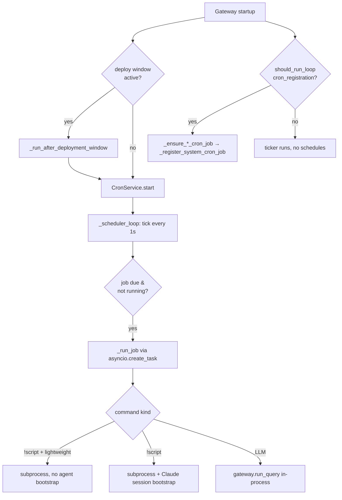

# Cron & Scheduling

The cron subsystem is an in-process scheduler that runs inside the gateway
process. It owns three kinds of work: **LLM crons** (a Claude session runs a
natural-language prompt), **`!script` crons** (a Python module runs as a
subprocess), and **one-shot reminders** (`run_at`). It is implemented in a
single module, `cron_service.py`, plus a set of idempotent
`_ensure_<job>_cron_job()` registration helpers in `gateway_server.py`.

There is no OS-level crontab and no separate scheduler process — everything
ticks off an asyncio loop in the gateway. That is the single most important
fact about this subsystem: a cron tick that does heavyweight synchronous work
can stall the gateway event loop, which is why the deploy-window, lightweight,
and `to_thread` mitigations described below exist.

## Components

| Symbol | Role |
|---|---|
| `cron_service.py::CronService` | The scheduler. Holds the job registry, the tick loop, dispatch, retry, and finalization. |
| `cron_service.py::CronJob` | Dataclass for a single job (schedule, command, metadata). |
| `cron_service.py::CronRunRecord` | One run's outcome, appended to `cron_runs.jsonl`. |
| `cron_service.py::CronStore` | JSON persistence: `cron_jobs.json` (registry) + `cron_runs.jsonl` (run log). |
| `gateway_server.py::_register_system_cron_job` | Idempotent boot-time registration of system crons. |
| `gateway_server.py::_ensure_*_cron_job` | One helper per system cron; calls the registrar with that job's schedule/command. |
| `services/cron_task_hub_link.py::ensure_cron_task_link` | Hermes Phase F: auto-links each cron to a `cron:<name>` Task Hub row for observability. |
| `workflow_admission.py::WorkflowAdmissionService` | De-dup, admission, retry queuing, and lifecycle marking for each cron attempt. |

## Process model & startup

`CronService` is constructed once during gateway startup (see the
`CronService(...)` construction in `gateway_server.py`) with four callbacks:
`event_sink` (UI/event bus), `wake_callback` (heartbeat wake), a
`system_event_callback`, and an `agent_event_sink`. Then:

1. If a deploy window is active (`gateway_server.py::_deployment_window_active`),
   startup is deferred via `_run_after_deployment_window` so the scheduler
   doesn't begin ticking mid-restart. Otherwise `CronService.start` runs
   immediately.
2. If `should_run_loop("cron_registration", prod_default=True)` is true, the
   long list of `_ensure_*_cron_job()` helpers run to register/refresh all
   system crons. In **development** this gate is off — the ticker may run but
   no schedules are registered (trigger jobs manually via the admin API).

`CronService.__init__` also has a **dev belt-and-suspenders guard**: if
`loop_control.is_development_runtime()` is true it refuses to load the
persisted `cron_jobs.json`, so the ~50+ production cron jobs never tick on a
developer's desktop even if the service is somehow constructed.

## Scheduling models

`CronJob` supports three mutually-evaluated schedule types, resolved by
`cron_service.py::CronJob.schedule_next`:

1. **`run_at`** (one-shot absolute timestamp). Runs once; `next_run_at` becomes
   `None` after the first run. Pair with `delete_after_run=True` to self-delete
   on success.
2. **`cron_expr`** (5-field cron string + `timezone`, via `croniter`). Takes
   precedence over the interval. If the expression is invalid at tick time it
   falls back to `every_seconds`.
3. **`every_seconds`** (simple interval). Minimum enforced interval is
   `MIN_CRON_INTERVAL_SECONDS = 60`; sub-minute intervals raise `ValueError`
   and are told to use `cron_expr`.

`add_job` validates that at least one of the three is provided, validates the
cron expression and timezone, then calls `schedule_next`.

### `run_at` natural-language parsing

`cron_service.py::parse_run_at` accepts a float (absolute), a relative
duration (`"20m"`, `"2h"`, `"1d"`), an ISO timestamp, a bare unix timestamp,
or natural phrases — `"now"`, `"in 90 minutes"`, `"tomorrow 9:15am"`,
`"tonight"` (defaults to 8:00pm). The timezone for natural phrases is supplied
by the caller; absent that it is UTC.

## The tick loop

`cron_service.py::_scheduler_loop` wakes every 1 second, scans
`self.jobs.values()`, and for each enabled job that is not already in
`self.running_jobs` and whose `next_run_at <= now`:

- It captures `scheduled_at`, reschedules (`schedule_next`) or, for one-shot
  `run_at` jobs, pushes `next_run_at` 5s out so it isn't re-fired.
- It **marks the job running BEFORE dispatching** (`self.running_jobs.add`) to
  prevent a duplicate task on the next tick while `_run_job` is still
  acquiring the concurrency semaphore.
- It launches `_run_job` as a detached `asyncio.create_task`.

Concurrency is bounded by an `asyncio.Semaphore(self.max_concurrency)` where
`max_concurrency` comes from `UA_CRON_MAX_CONCURRENCY` (default **2**).

## `_run_job`: the execution body

`cron_service.py::_run_job` is the heart of the subsystem. Order of operations:

1. **Deleted-job guard.** If `job.job_id` is no longer in `self.jobs`, short-
   circuit with a `skipped` record. This breaks the orphan-retry storm that
   otherwise happens when a job is deleted while a retry chain holds the
   `CronJob` in its closure (observed live 2026-05-11, cron `2df80b6f95`,
   90+ minutes of retry-storm emails).
2. **Workflow admission.** Acquire the semaphore, build a `WorkflowTrigger`
   (`_build_workflow_trigger`, `run_kind="cron_job_dispatch"`,
   `run_policy="automation_ephemeral"`,
   `interrupt_policy="attach_if_same_dedup_key"`), and call
   `WorkflowAdmissionService.admit`. Decisions of
   `attach_to_existing_run` / `defer` / `skip_duplicate` produce a `skipped`
   record; `escalate_review` produces `needs_review`. The `dedup_key` is
   `scheduled:<job_id>:<int(scheduled_at)>` for scheduled runs — so two ticks
   for the same scheduled instant de-dup.
3. **Pre-flight required-secrets check** (`_find_missing_required_secrets`).
   If `metadata.required_secrets` lists env vars that resolve to empty, the run
   fails fast with a structured `missing_required_secrets` error rather than
   the script dying obscurely.
4. **Dispatch by command kind** (below).
5. **Finalize** via `_finalize_workflow_attempt` and the `finally` block.

### Command kinds

- **Mock** (`UA_CRON_MOCK_RESPONSE` truthy): records `success`/`CRON_OK`
  without doing work. Test seam.
- **Lightweight `!script`** (`metadata.lightweight == True`): spawns
  `python -m <module>` directly with `asyncio.create_subprocess_exec`,
  **skipping the heavyweight Claude-session bootstrap** (Composio session
  creation, ~54 KB capability-snapshot injection, SOUL load, dossier
  registration). Only `!script` commands are valid here. Rationale: the
  bootstrap synchronously stalls the gateway event loop for several seconds per
  tick, blowing past the dashboard's 4s `/api/v1/version` timeout and surfacing
  the red "Gateway unreachable" banner.
- **Standard `!script`**: same subprocess execution but inside the full agent
  session bootstrap path, with Hermes Phase F Task-Hub linking + worker-PID
  stamping (below).
- **LLM cron**: builds a `GatewayRequest` (prepending a
  `[SYSTEM CONTEXT: UA_ARTIFACTS_DIR=...]` header to the command) and runs it
  in-process via `gateway.run_query`. `force_complex` is resolved per-job by
  `_force_complex_for_job` (below).

### Per-job model tier (`force_complex`)

`cron_service.py::_force_complex_for_job` reads `metadata.model_tier`. Default
(unset) and `"high"`/`"opus"` → `force_complex=True` (Opus-tier reasoning, on
ZAI that is `glm-5.1`). `"low"`/`"sonnet"`/`"haiku"` → `False`. Unknown values
fall back to `True` so a typo never silently downgrades a critical cron. This
exists so low-complexity content crons (cleanup, demo-triage-rank, artifact
digest) stop wastefully driving Opus-tier inference and exacerbating ZAI
Fair-Usage 429s.

> Note: this helper only affects the **LLM cron** path. When a cron enqueues a
> Cody mission, Cody's model selection lives in
> `vp/clients/claude_cli_client.py`, not here.

### Timeouts

`_resolve_job_timeout_seconds` resolves the per-job wall-clock budget from
`job.timeout_seconds` (or `metadata.timeout_seconds`), clamped to
`[MIN_CRON_TIMEOUT_SECONDS=1, MAX_CRON_TIMEOUT_SECONDS=7200]`. The budget is
applied two ways: the outer `asyncio.wait_for` around the subprocess/coroutine,
**and** plumbed into the LLM request as `turn_timeout_seconds` so the execution
engine's own deadline matches (without this, a long cron is killed at the tier
default even though `asyncio.wait_for` allows more). A timeout writes a
`daemon_timeout_crash.json` report (`_write_timeout_crash_report`) and is
finalized as `execution_timeout`, `retryable=True`.

## Failure classification & retry

`_finalize_workflow_attempt` is the single finalizer for every terminal path.
Default `max_attempts` is **3** (`_max_attempts_for_job`, overridable via
`metadata.max_attempts`). The status → action mapping:

| Run status | Action |
|---|---|
| `success` | `mark_completed`; emits a success intelligence event (unless `mission_control_silent`). |
| `auth_required` | `mark_needs_review` (no retry) — surfaces a Composio connect link. |
| `error`, retryable | `queue_retry`; if a new attempt is granted, status becomes `retry_queued` and `_schedule_retry_run` fires a fresh `_run_job` with `skip_workflow_admission=True`. `_schedule_retry_run` is **loop-agnostic** (see below) — it must be, because the lightweight finalize path reaches it from a worker thread. |
| `cancelled` | `failure_class="cancelled"`, **never retried** (see deploy-window below). |
| rate-limited error | `_is_rate_limit_exception` matches Vercel/429/"too many requests" bodies → `retryable=False`; the cron's natural schedule is the backoff. |

The rate-limit carve-out exists because the 3-attempt retry tripled the call
rate into Composio's edge during a 429 window on 2026-05-23 — exactly the wrong
behavior. Matching is on the error **body text**, because the upstream SDK
discards the HTTP 429 status code.

## Deploy-window detection (suppress restart noise)

This is the most operationally important gotcha. A cron subprocess that is
SIGTERM'd because the gateway is being restarted by a deploy is **not a
failure** — but without special handling it generated an
`[ERROR] Autonomous Task Failed` + `[WARNING] Retrying` email pair every time.

`cron_service.py::_is_deploy_window_active` returns true on either of two
OR'd signals:

1. The deploy-marker file `/tmp/ua-deployment-window` exists. `deploy.yml`
   creates it before `systemctl restart` and removes it on EXIT (or after a
   25-minute safety timer).
2. This gateway process started within the last 60 seconds
   (`_DEPLOY_WINDOW_FALLBACK_UPTIME_SEC`), computed from `/proc/self/stat`
   (`_process_start_time`). Covers the rare race where the flag's cleanup ran
   before the cron's failure handler, and operator-initiated restarts.

When a subprocess exits with a **negative** return code (signal-killed) inside
this window, the run is marked `cancelled`, `next_run_at` is advanced by
`_DEPLOY_CANCEL_BACKFILL_OFFSET_SEC = 5s`, and the retry chain is skipped. On
next gateway boot the startup pass re-fires it (and, for
`catch_up_on_restart` jobs, optionally backfills). Both `!script` paths and the
lightweight path implement this; the LLM path is covered by the
`asyncio.CancelledError` handler.

> Both signals only ever **widen** the "treat as deploy cancellation" window —
> they never narrow it. A real crash (OOM, code error) outside the window still
> surfaces loudly.

## Catch-up / backfill on restart

A job with `catch_up_on_restart=True` whose `next_run_at` was in the past at
construction time gets queued for backfill (if the miss is within the last 24h,
`_backfill_max_age`). **But backfill firing is OFF by default**: in
`CronService.start`, the queued backfills only dispatch when
`UA_CRON_BACKFILL_ON_RESTART` is truthy. Otherwise they are skipped with a log
line and resume on the next normal tick.

This default-off was a deliberate fix (2026-05-16 incident): firing every
missed heavyweight cron simultaneously at gateway boot starved the asyncio loop
(each does HTTP + in-process LLM work), the gateway couldn't answer
`/api/v1/health`, and `deploy.yml`'s 8-minute health check timed out → restart
loop. `_register_system_cron_job` still sets `catch_up_on_restart=True` on all
system crons; the *queue* is built but not *fired* unless the env var is set.

## System cron registration

`gateway_server.py::_register_system_cron_job` is the idempotent registrar
every `_ensure_*_cron_job` helper calls. Do not hand-roll cron creation — this
helper handles: lookup-by-`metadata.system_job`, update-vs-create, catch-up,
required-secrets plumbing, and the disable-propagation case. Key parameters:

- `default_cron` + `cron_env_var` / `default_timezone` + `timezone_env_var`:
  schedule defaults overridable by env.
- `required_secrets`: feeds the pre-flight check.
- `skip_task_hub_link=True`: opt out of Hermes Phase F auto-linking. Use for
  housekeeping sweeps (dispatcher sweeps, GC, re-rank) that produce no tracked
  work-product. Artifact-producing crons (briefings, digests, snapshots) leave
  it `False` to get F.1/F.3 observability.
- `lightweight=True`: see the lightweight `!script` path above. Validated to
  require a `!script` command — a misconfiguration raises at startup.
- `enabled=False` **with an existing enabled DB row**: the helper actively
  flips the persisted row to disabled via `update_job` (rather than silently
  no-op'ing), so turning a cron's env gate off in code actually disables the
  persisted job on next boot. Fixes the PR #534 hourly-insight regression where
  a disabled-by-default cron kept firing because its row stayed enabled.

The full system-cron roster is the block of `_ensure_*_cron_job()` calls in the
gateway startup (briefings, CSI convergence, ClaudeDevs intel, YouTube digests,
nightly wiki, proactive reports, Atlas direct dispatch, vault lint, etc.).

## Hermes Phase F: Task Hub linking

Unless `metadata.skip_task_hub_link` is set, every `!script` and LLM cron tick
auto-ensures a stable `cron:<system_job>` (or `cron:<job_id>`) Task Hub row via
`services/cron_task_hub_link.py::ensure_cron_task_link`, then opens an
assignment, stamps the subprocess PID (`record_worker_pid`, NULL for in-process
LLM crons), and on exit runs `classify_worker_exit` →
`_close_run`/`park_task_for_protocol_violation`. Auto-linked tasks are pre-
closed to `completed` on a clean rc=0 exit so the exit classifier sees
`clean_exit_zero` rather than a false protocol violation, then flipped back to
`open` so the next tick can reuse the perpetual task. The email-scheduler path
(which supplies its own `metadata.task_id`) keeps its own lifecycle.

Phase F SQL runs synchronously inside async coroutines; `_phase_f_start` /
`_phase_f_done` instrument each step (WARNING >5s, INFO >500ms) so a future
event-loop freeze can be pinpointed to the hanging step. The `mark_completed`
evidence-sync (`shutil.copytree`) on the lightweight path is wrapped in
`asyncio.to_thread` for the same reason (hot-patch 2026-05-26, confirmed by
py-spy) — `_run_job` calls `await asyncio.to_thread(self._finalize_workflow_attempt, …)`.

> **Loop-affinity gotcha (fixed 2026-05-31).** Moving the *whole*
> `_finalize_workflow_attempt` onto a worker thread silently broke the retry
> path: on a non-zero-exit lightweight run that helper calls
> `_schedule_retry_run`, which originally used a bare
> `asyncio.create_task(...)`. `create_task` is loop-affine and the worker
> thread has no running loop, so it raised `RuntimeError: no running event
> loop` and orphaned the `_run_job` coroutine — the intermittent "no running
> event loop" cron failures on hackernews_snapshot / atlas_direct_dispatch
> (only firing when a lightweight script exited non-zero *and* a retry was
> queued). The fix makes `_schedule_retry_run` loop-agnostic: `CronService.start`
> captures the scheduler loop in `self._loop`; the helper uses
> `asyncio.get_running_loop().create_task(...)` when already on a loop and
> `asyncio.run_coroutine_threadsafe(coro, self._loop)` when called from a worker
> thread. The other seven `_finalize_workflow_attempt` call sites run on-loop
> and were unaffected. Regression test:
> `tests/unit/test_cron_retry_offloop_scheduling.py`.

> **Phantom-reap gotcha (fixed 2026-06-03).** In-process LLM crons run inside the
> daemon and their Task Hub assignment carries **no `provider_session_id`** (the
> PID/session-stamping in `ensure_cron_task_link` only applies to `!script`
> subprocess crons), so `task_hub.py::reconcile_task_lifecycle` — which protects a
> running assignment only when its session id is in the live-session set — cannot
> recognise an in-process cron as alive. That reconcile is invoked on **every
> dashboard read** of the agent queue
> (`gateway_server.py::dashboard_todolist_agent_queue`), so simply *opening Task
> Hub* while `paper_to_podcast_daily` was mid-run (these poll NotebookLM for
> 10–20 min) false-orphaned the live run: assignment → `failed`
> (`reconciled_orphaned_assignment`), the task bounced back to the unassigned
> column, while the in-process worker kept running underneath. Fix: the on-demand
> caller passes `cron_live_grace_seconds`
> (`gateway_server.py::_cron_reconcile_grace_seconds`,
> `UA_CRON_RECONCILE_GRACE_SECONDS`, default 3600s) and `reconcile_task_lifecycle`
> skips reaping a cron-owned assignment younger than that window. **Startup
> recovery deliberately keeps `cron_live_grace_seconds=0`** so a genuinely
> crash-orphaned cron is still reaped immediately. Regression test:
> `tests/unit/test_cron_reconcile_grace.py`.

## Outputs, persistence & wake

- Run records append to `cron_runs.jsonl`; jobs persist to `cron_jobs.json`
  (`CronStore`).
- `_persist_cron_run_output` writes full subprocess stdout+stderr to
  `<workspace>/run.log` (the `output_preview` field is capped at 400 chars and
  would otherwise truncate tracebacks).
- `_persist_run_output` writes `cron_result.md` into the workspace's
  `work_products/` and mirrors it to `<artifacts>/cron/<job_id>/`.
- `_organize_workspace_outputs` moves root-level deliverables into
  `work_products/` (and `work_products/media/`), keeping `run.log`,
  `transcript.md`, `trace.json`, `trace_catalog.md`, `MEMORY.md` at the root.
- On success, a session rollover is captured to shared memory (if memory is
  enabled).
- `_maybe_wake_heartbeat` wakes a target session's heartbeat (`now`/`next`)
  when `metadata.wake_heartbeat` and a session id are present.
- `_emit_cron_success_intelligence` surfaces successful runs as Mission Control
  cards unless `metadata.mission_control_silent` is true.
- Email-scheduler crons (`metadata.source == "email_task_scheduler"`) mark
  their originating Task Hub item `complete` on success.

Sessions are deliberately **not** closed at run end — they keep their admin TTL
(default ~10 min) so the operator can click "Open" in the UI to rehydrate and
view the transcript; the gateway's session reaper cleans them up later.

## Environment flags

| Var | Default | Effect |
|---|---|---|
| `UA_CRON_MAX_CONCURRENCY` | `2` | Max concurrent cron runs (semaphore). |
| `UA_CRON_BACKFILL_ON_RESTART` | off | If truthy, fire queued backfills at startup (see incident note — leave off). |
| `UA_CRON_REGISTRATION_ENABLED` / `should_run_loop("cron_registration")` | prod on, dev off | Master gate for registering system crons. |
| `UA_CRON_DB_LOCK_RETRIES` | `2` | Retries on "database is locked" inside an LLM-cron attempt (clamped 0–5). |
| `UA_CRON_MOCK_RESPONSE` | off | Test seam: record `success`/`CRON_OK` without executing. |
| `UA_ARTIFACTS_DIR` | repo `artifacts/` | Where `cron_result.md` is mirrored; also injected as system context into LLM crons. |
| `metadata.model_tier` | `high` | Per-job Opus-vs-Sonnet reasoning tier (LLM path). |
| `metadata.max_attempts` | `3` | Per-job retry ceiling. |
| `metadata.lightweight` | `False` | Skip agent bootstrap for `!script` housekeeping crons. |
| `metadata.skip_task_hub_link` | `False` | Opt out of Phase F Task Hub linking. |
| `metadata.required_secrets` | — | Env vars verified pre-flight. |

## Dormancy & timezone gotchas

Cron *scheduling policy* (which crons may fire when) is governed by the
operating-hours/dormancy rules, not by `cron_service.py` mechanics. Content-
generation crons should fire only inside the 6 AM–10 PM Houston (America/Chicago)
active window; infrastructure-event handlers are exempt. The guard test
`tests/unit/test_cron_dormancy_defaults.py` pins this: every registered system
cron's hour must fall in the active window or appear in `DOCUMENTED_EXCEPTIONS`.
See `08_operations/03_dormancy_and_operating_hours.md` for the full policy.

> [VERIFY: operational, code-external] Z.AI (the LLM proxy for all UA
> autonomous loops, including LLM crons) is capacity-limited during Greater-
> China peak hours (Beijing business hours, roughly 05:00–15:00 UTC =
> 00:00–10:00 US Central). This is the *inverse* of "run heavy batch overnight"
> intuition: heavy LLM crons scheduled for US night hit ZAI Fair-Usage 429s.
> Pick cron windows with this in mind. (Source: legacy
> `docs/operations/2026-05-08_zai_peak_time_scheduling.md`.)

## Code-observed gotchas

- **In-process scheduler = event-loop sensitivity.** Synchronous work in a tick
  (agent bootstrap, Phase F SQL, `copytree`) blocks the whole gateway. The
  lightweight path, `to_thread` wrap, and Phase-F timing instrumentation all
  exist because of this.
- **`to_thread` cuts both ways — audit the callee for loop-affine calls.**
  Wrapping a callable in `asyncio.to_thread` to unblock the loop runs it on a
  worker thread with **no running loop**, so any transitive
  `asyncio.create_task` / `get_running_loop` / `ensure_future` inside it raises
  `RuntimeError: no running event loop`. This is exactly how
  `_finalize_workflow_attempt → _schedule_retry_run` broke (see Phase F above).
  The standard fix is the loop-agnostic pattern: fast-path `create_task` when a
  loop is running, else `run_coroutine_threadsafe` onto a loop captured up front.
- **Backfill is off by default** — do not assume missed crons replay at boot.
- **`cancelled` is terminal, not retryable.** Deploy-window kills and session-
  reaper cancellations both land here; the explicit `asyncio.CancelledError`
  handler exists because `CancelledError` is a `BaseException` and would
  otherwise skip the generic `except Exception` finalizer, leaving a run un-
  finalized and producing a phantom failure on next boot.
- **Deleted job + in-flight retry** can storm without the top-of-`_run_job`
  guard; both the guard and `delete_job`'s `running_jobs.discard` are needed.
- **Disable must propagate to the DB.** Setting `enabled=False` in code only
  disables a previously-enabled persisted row because `_register_system_cron_job`
  explicitly calls `update_job`; a registrar that just returned `None` would
  leave the row firing.
