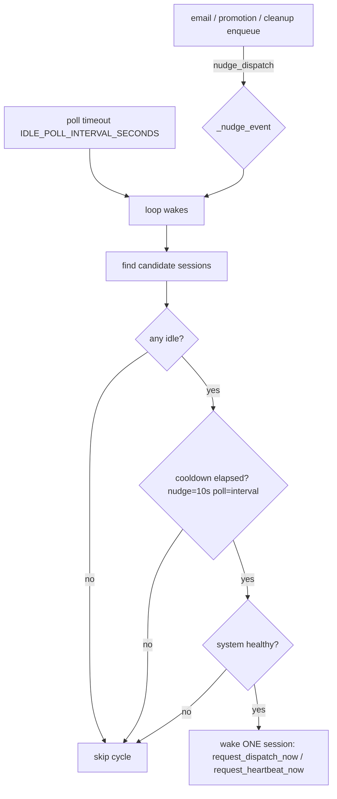
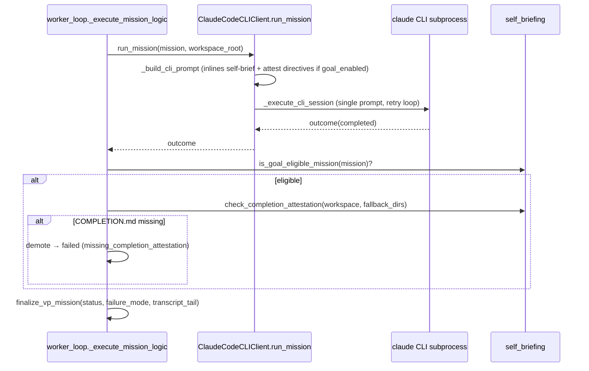

# Idle Dispatch & Goal Loop

This doc covers three related-but-distinct mechanisms that govern how
autonomous work gets *started*, how a VP mission's *completion* is verified,
and what happens when a mission *fails*:

1. **Idle dispatch loop** — a background nudge mechanism that wakes idle
   agents the instant work appears, instead of waiting for the next
   ~30-min heartbeat (`services/idle_dispatch_loop.py`).
2. **Goal loop & completion attestation** — the self-briefing /
   `COMPLETION.md` protocol that gates whether a VP mission is allowed to
   finalize as `completed` (`services/self_briefing.py`, enforced in
   `vp/worker_loop.py`).
3. **Failure-mode classification & rescue verbs** — when a mission
   finalizes `failed`/`cancelled`, a stable `failure_mode` string is
   derived and the failure is surfaced to Simone as a `vp_mission_failure`
   task with a rescue decision tree (`services/vp_failure_rescue.py`,
   `durable/state.finalize_vp_mission`).

These are separate code paths. The idle loop decides *when* an agent runs;
the goal/attestation logic decides *whether a finished mission counts*; the
rescue logic decides *what to do with a failure*.

---

## 1. Idle Dispatch Loop

### What it is

A lightweight asyncio background task started at gateway boot. It continuously
checks: *are there idle agents AND is there work waiting?* If yes, it wakes one
idle session to dispatch. This decouples task pickup from the fixed heartbeat
cadence so agents grab work as soon as they're free.

`services/idle_dispatch_loop.py::idle_dispatch_loop` is the loop coroutine.
It is spawned in `gateway_server` startup (`idle_dispatch_loop_startup`
background task), wrapped in `_run_after_deployment_window` so it doesn't
fight the deploy-restart window.

### The nudge mechanism (Phase 3)

The loop does **not** busy-poll on a fixed timer alone. It waits on an
`asyncio.Event` (`_nudge_event`) with a timeout equal to the poll interval:

```python
await asyncio.wait_for(_nudge_event.wait(), timeout=IDLE_POLL_INTERVAL_SECONDS)
```

Whichever fires first wins. External callers signal new work with
`nudge_dispatch(reason=...)`, which is **thread-safe**: if called from a
different thread than the loop's event loop, it uses
`loop.call_soon_threadsafe(_nudge_event.set)`. If the loop hasn't started yet
(`_nudge_event is None`), the nudge is silently dropped — the next poll picks
up the work anyway.

Known `nudge_dispatch` callers (verified):

| Caller | Reason prefix |
|---|---|
| `gateway_server` (inbound trigger path) | varies |
| `services/email_task_bridge.py` | `email_inbound:<thread>` |
| `services/agentmail_service.py` | `email_promoted:<thread>` |
| `src/universal_agent/scripts/codie_cleanup_enqueue.py` | `codie_cleanup_enqueued:<task_id>` |

### Loop body, step by step

Each wake (poll-timeout OR nudge) runs:

1. **Find candidate sessions.** If a `todo_dispatch_service` is wired, use its
   `active_sessions` only. Otherwise fall back to live WebSocket sessions
   (`get_sessions_fn`), then to heartbeat-registered sessions
   (`get_heartbeat_sessions_fn`) — the fallback is what lets *daemon* sessions
   be discoverable when no browser is connected.
2. **Find idle agents.** Busy set = the executor's `busy_sessions`; when the
   ToDo dispatcher is present, `executing_sessions` is also unioned in (the
   ToDo dispatcher returns immediately after queueing, so its work runs
   asynchronously and must be treated as busy). `idle = sessions − busy`.
3. **Rate-limit (cooldown).** Nudges get an aggressive **10 s** cooldown;
   normal polls use the full `IDLE_POLL_INTERVAL_SECONDS` cooldown. If the
   last dispatch was inside the cooldown, skip.
4. **System-load guard.** Calls `services/system_load_guard.is_system_healthy()`.
   If unhealthy (process explosion / high swap), dispatch is **blocked** this
   cycle and logged — this prevents the cascade where dispatching more work
   onto a saturated VPS makes things worse. A guard-check exception is
   non-fatal (treated as healthy).
5. **Wake ONE session.** `sorted(idle_sessions)[0]` — deliberately not
   round-robin (the heartbeat itself handles multi-session). It calls
   `todo_dispatch_service.request_dispatch_now(sid)` when available, else
   `heartbeat_service.request_heartbeat_now(sid, reason="idle_dispatch_<poll|nudge>")`.

The loop never scans Task Hub itself — it delegates "is there work?" to the
heartbeat/dispatcher it wakes (intentionally simple, no duplicated scanning).

### Config / flags

| Env var | Default | Effect |
|---|---|---|
| `UA_IDLE_POLL_INTERVAL_SECONDS` | `60` | Poll timeout (max wait between checks) |
| `UA_IDLE_POLL_ENABLED` | on in prod (`should_run_loop("idle_poll", prod_default=True)`) | Master switch; loop returns immediately when off |

Error handling: up to 3 consecutive errors are logged with traceback; backoff
is `min(300, interval × consecutive_errors)`. `CancelledError` breaks cleanly.



---

## 2. Goal Loop & Completion Attestation

### The protocol (self-brief-and-attest)

`services/self_briefing.py` is the Python side of the `self-brief-and-attest`
skill. A VP mission can be *goal-eligible*, in which case it is expected to
produce a defined artifact set in its **canonical mission workspace**:

| Artifact | When required |
|---|---|
| `BRIEF.md` | Every mission (universal) — VP's interpretation of the task |
| `ACCEPTANCE.md` | Goal-eligible missions only — verifiable success criteria |
| `goal_condition.txt` | Goal-eligible missions only — ≤ 4000 chars (`GOAL_CONDITION_MAX_CHARS`) |
| `COMPLETION.md` | Every goal-eligible mission, before finalize(completed) |

### Goal eligibility — `is_goal_eligible_mission(mission)`

Eligibility is **Cody-only**. Atlas missions (`vp_id != "vp.coder.primary"`)
are never goal-eligible. For Cody:

1. **Explicit per-task override wins first.** `metadata.use_goal_loop=True`
   activates the protocol *regardless* of the global feature flag. The
   dashboard's Dispatch Mission UI sets this, so an operator opt-in works even
   when the global flag is OFF (the prod default). This check is deliberately
   *before* the flag check so the UI toggle isn't dead code in prod.
2. **Global default-on path.** `UA_VP_GOAL_ENABLED` is ON **and** the
   mission's `source_kind` (or `mission_type`) is in
   `GOAL_ELIGIBLE_SOURCE_KINDS = {cody_demo_task, cody_scaffold_request,
   tutorial_build, tutorial_build_task}`.

`vp_goal_enabled()` reads `UA_VP_GOAL_ENABLED` and **defaults OFF** (per PRD
Risk #1 — empirical /goal verification gates flipping it on globally).

### Completion-attestation guard (LIVE — the enforcement point)

In `vp/worker_loop.py::_execute_mission_logic`, after `client.run_mission`
returns `completed`, the worker checks:

```python
if outcome.status == "completed":
    if is_goal_eligible_mission(mission):
        ok, reason = check_completion_attestation(workspace_path, fallback_dirs=...)
        if not ok:
            outcome = MissionOutcome(status="failed",
                message=f"missing_completion_attestation: {reason}", ...)
```

A goal-eligible mission that reports success **but did not write
`COMPLETION.md`** is **demoted to `failed`** with
`failure_mode="missing_completion_attestation"`. This is a *protocol
violation*, not a work failure — it routes to Simone like any other failure.

`check_completion_attestation` checks the canonical workspace first, then
walks `fallback_dirs` (PR #492 dual-path). The worker passes
`outcome.payload["cli_workspace_dir"]` (captured by the CLI client) as a
fallback, because Cody may have written `COMPLETION.md` to his actual cwd when
the BRIEF scoped his work to a `/tmp` dir rather than the canonical workspace.
Returns `(True, None)` if a non-empty `COMPLETION.md` exists in any candidate.

> **Gotcha (2026-05-26 fix):** This guard previously gated on the *global*
> `vp_goal_enabled()` flag instead of per-mission eligibility. That spuriously
> demoted successful Cody missions that never opted into `/goal` (they were
> never told to write `COMPLETION.md`). The fix switched the gate to
> `is_goal_eligible_mission(mission)`. If you see a smoke-test mission
> demoted for a missing file it was never asked to write, this is the
> regression to check.

### ⚠️ The two-phase `/goal` subprocess is NOT wired up

The PRD design (and several docstrings) describe a **two-phase** flow: a
briefing turn produced by `build_self_briefing_prompt`, then the parent worker
reads `goal_condition.txt` and invokes a *second* subprocess
`claude -p "/goal <condition>"` to drive completion.

**As of 2026-05-29, that two-phase wiring does not exist in code.**

Verified facts:

- `build_self_briefing_prompt` and `read_goal_condition` are **defined in
  `self_briefing.py` but never called** anywhere outside that module (only
  referenced in a docstring comment in `claude_cli_client.py`).
- `ClaudeCodeCLIClient.run_mission` builds **one** prompt via `_build_cli_prompt`
  and runs `_execute_cli_session` in a retry loop. When `UA_VP_GOAL_ENABLED`
  is on, `_build_cli_prompt` *inlines* the self-briefing directive
  (invoke the skill, write `BRIEF.md`/`ACCEPTANCE.md`/`goal_condition.txt`,
  write `COMPLETION.md` before finishing) into that single prompt. There is no
  separate `/goal` subprocess invocation.

So the **live** behavior is: briefing + work + attestation happen in one (or
retried) subprocess driven by inlined prompt directives, and the worker-level
`COMPLETION.md` guard is the only hard enforcement. `goal_condition.txt` is
written by the VP if it follows the prompt, but the parent never reads it to
launch a `/goal` loop. Treat the "two-phase" language in `worker_loop.py` /
`self_briefing.py` docstrings as aspirational design, not current reality.

> [VERIFY: if a future PR wires `build_self_briefing_prompt` /
> `read_goal_condition` into `worker_loop._execute_mission_logic` (a real
> two-subprocess flow), update this section — the functions exist precisely
> so that wiring is a small change.]



---

## 3. Failure-Mode Classification & Rescue

### Failure-mode derivation — `worker_loop._classify_outcome_failure_mode`

After a mission ends, the worker derives a stable `failure_mode` string from
the outcome's `status`, `message`, and `payload.final_text`. Order matters —
checked first-match-wins:

| Check (substring in message+final_text, lowercased) | `failure_mode` |
|---|---|
| `missing_completion_attestation` | `missing_completion_attestation` |
| auth markers (`invalid authentication credentials`, `invalid x-api-key`, …) | `auth_failure` |
| workspace-guard markers (`workspaceguarderror`, `outside approved`, …) | `workspace_guard` |
| `sigterm` / `sigill` / `killed by signal` | `subprocess_crash` |
| `timeout` / `timed out` | `timeout` |
| goal-cap markers (`stop after`, `goal evaluator`, `max turns`, `turn limit`) | `goal_cap_hit` |
| `status == "cancelled"` | `operator_cancel` |
| `status == "failed"` (fallback) | `vp_self_reported` |

> **Gotcha (2026-05-26 fix):** protocol markers
> (`missing_completion_attestation`) are checked **before** the generic
> `status == failed → vp_self_reported` fallback. Previously the attestation
> demotion was mislabeled `vp_self_reported`, making the failure card claim
> the VP self-reported when in fact our own guard fired.

When `_classify_outcome_failure_mode` returns `None`, the finalize call
substitutes a default (`operator_cancel` for cancelled, `vp_self_reported`
for failed).

### Surfacing to Simone — `durable/state.finalize_vp_mission`

`finalize_vp_mission(conn, mission_id, status, *, failure_mode, transcript_tail)`
performs the DB `UPDATE`, then — for `status in {failed, cancelled}` with
`failure_mode != "operator_cancel"` — best-effort calls
`vp_failure_rescue.surface_failure_to_simone`. The hook never propagates
exceptions; a rescue-plumbing failure must not block the status update.
`transcript_tail` is truncated to **2 KB** before persistence.

`surface_failure_to_simone` creates a Task Hub item:

- `task_id = f"vp_failure:{mission_id}"` (one row per failed mission;
  a retry creates a new `mission_id` → new failure row)
- `source_kind = "vp_mission_failure"`, `status = open`, `agent_ready = True`,
  `trigger_type = "immediate"`
- metadata carries: `failure_mode`, `failure_count` (count of prior failures
  in the same `rescue_chain_id`), `rescue_chain_id` (reused across retries, or
  the mission_id for the first failure), `brief_path` (VP's `BRIEF.md`, may be
  `None`), `transcript_tail` (last 2 KB), `workspace_path`, `original_objective`,
  and `original_task_id` / `cody_mode` when present.

`operator_cancel` is intentionally **not** surfaced (deliberate human action).

### Simone's rescue-evaluator posture

Per `memory/HEARTBEAT.md`, when Simone claims a `vp_mission_failure` item she
operates as a **rescue-evaluator** (not a fallback executor). She reads the
metadata and picks exactly one verb (`tools/vp_orchestration.py`):

| Verb | When |
|---|---|
| `vp_dispatch_mission_retry(mission_id, additional_guidance, max_additional_turns=None)` | Self-reported or `goal_cap_hit` AND her guidance addresses the gap. Same chain, same brief. |
| `vp_dispatch_mission_redispatch_fresh(mission_id, additional_context)` | Crash / env corruption / workspace contamination — fresh workspace, same chain. |
| `escalate_vp_failure_to_operator(mission_id, summary, why_escalating, recommended_action=None)` | `auth_failure` / `workspace_guard` / config-shaped, OR `failure_count >= 3`. Creates a `chat_panel` task to Kevin. |
| `task_hub_task_action(task_id="vp_failure:<id>", action="complete", note=...)` | Choosing not to act this cycle; failure stays as context for next-occurrence escalation. |

The rescue tools preserve `rescue_chain_id` across attempts so `failure_count`
accumulates — high counts tell future-Simone that prior rescues didn't stick.

---

## Source-task closure (the "delegated zombie" fix)

Not strictly idle/goal, but it lives in the same worker terminal path and is a
frequent confusion point. On a VP terminal, **two** Task Hub rows may close:

1. The **mirror row** keyed by `task_id == mission_id` (created at start).
   Always closed to the mapped status (`completed` / reopened to `open` on
   fail / `cancelled`).
2. The **original source task** that triggered dispatch (the row Simone
   `task_redirect_to`'d, now `status=delegated`). Resolved via
   `_resolve_source_task_id_from_payload`, which checks three locations in
   priority order: top-level `payload.task_id` → `payload.metadata.linked_task_id`
   → `payload.metadata.task_id` (legacy).

> **Gotcha (PR #493):** pre-fix, the worker only checked the third (legacy)
> path, which nobody writes — so source-task closure silently no-op'd for
> every operator-dispatched Cody mission, leaving `qa-*` rows stuck in
> `status=delegated` indefinitely (~188 "delegated zombie" rows accumulated
> over ~3 weeks). The three-path resolver fixes this.

---

## VP worker loop config (context)

The idle loop wakes agents; the `VpWorkerLoop` (`vp/worker_loop.py`) is what
actually claims and runs VP missions. Relevant flags:

| Flag (function) | Env | Default |
|---|---|---|
| `vp_poll_interval_seconds` | `UA_VP_POLL_INTERVAL_SECONDS` | `5` |
| `vp_lease_ttl_seconds` | `UA_VP_LEASE_TTL_SECONDS` | `120` |
| `vp_max_concurrent_missions` | `UA_VP_MAX_CONCURRENT_MISSIONS` | `1` |

> **Gotcha — the worker loop is structurally serial.**
> `VpWorkerLoop._tick` claims exactly ONE mission
> (`durable/state.claim_next_vp_mission`) and `await`s
> `_execute_mission_logic` to completion before the next tick. The
> `max_concurrent_missions` value is read from `UA_VP_MAX_CONCURRENT_MISSIONS`
> into `self.max_concurrent_missions` but is **never consulted** in `_tick` or
> the claim path — it is stored-but-unused. So "concurrency = 2" is **not a knob
> flip**: real intra-process parallelism requires a loop rewrite (or a second
> worker process). And it directly risks the documented event-loop-starvation
> incident, because a single in-process gateway serializes all
> `gateway.execute()` calls — see the concurrency discussion in
> `02_execution_core/01_gateway_sessions_execution.md`.
>
> The `asyncio.create_task` inside `_execute_mission_logic` is the lease-renewal
> `_heartbeat_mission_claim` background task, not concurrent mission execution.

Each tick heartbeats the session lease, recovers `degraded → idle` after a
successful heartbeat, then `claim_next_vp_mission`. A background
`_heartbeat_mission_claim` task renews the claim every `lease_ttl // 3`
seconds while the mission runs. Mission execution is wrapped in
`DagConcurrencyGovernor.acquire_slot()` (global ZAI concurrency limiter), and
rate-limit errors (`429` / `overloaded`) report to the `CapacityGovernor`.

Finalize-time artifacts written into the mission workspace (gated by env,
both default on):

- `mission_receipt.json` — `UA_VP_MISSION_RECEIPT_ENABLED`
- `sync_ready.json` (filename overridable via `UA_VP_SYNC_READY_MARKER_FILENAME`)
  — `UA_VP_SYNC_READY_MARKER_ENABLED`

`mission_type` starting with `doc-maintenance` triggers `_post_mission_push_pr_merge`
(push the `docs/*` branch, open PR against `UA_GH_PR_BASE_BRANCH` default `main`,
squash-merge) — runs in the worker process, outside the CLI sandbox, because the
sandbox blocks outbound HTTPS auth.

---

## Quick reference

- Idle loop disabled? Check `UA_IDLE_POLL_ENABLED` and the
  `idle_dispatch_loop_startup` background task log line at boot.
- Mission demoted to failed for a "missing" file? Confirm it was actually
  goal-eligible (`is_goal_eligible_mission`) — Atlas and non-opted-in Cody
  missions should never hit the attestation guard.
- `/goal` not actually looping? Correct — the two-phase subprocess is not
  wired; only inlined prompt directives + the `COMPLETION.md` guard are live.
- Failure not reaching Simone? `operator_cancel` is suppressed by design; all
  other failed/cancelled finalize calls surface a `vp_failure:<mission_id>`
  task.
