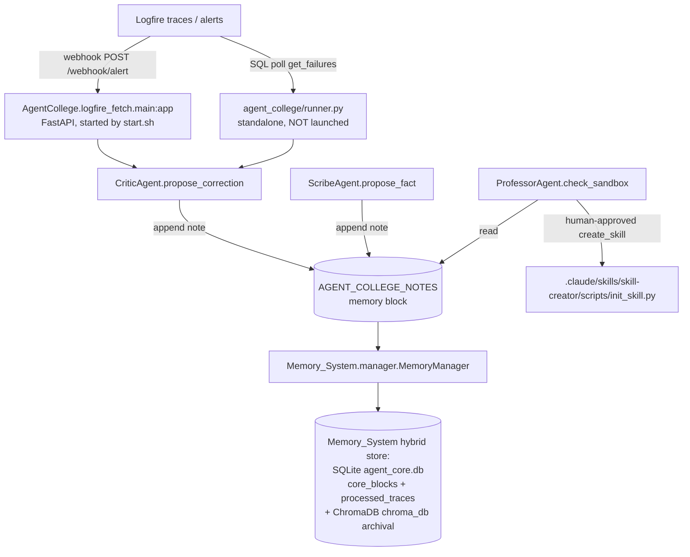

# Agent College

## TL;DR / Status

**Agent College is an experimental, mostly-dormant self-improvement loop. It is NOT wired into the live VPS production runtime** (the gateway / systemd / heartbeat stack described in the rest of these docs). It belongs to an older / alternate **Railway + Telegram-bot deployment** of `universal_agent` that boots from `start.sh` and persists state in the local `Memory_System` package (a hybrid SQLite + ChromaDB store; the College-relevant tables are SQLite). Treat it as **legacy / vestigial** unless you are specifically reviving the Railway deployment.

Evidence it is not in the production path:
- The VPS production deploy workflow (`.github/workflows/`) contains **zero** references to `agent_college`, `AgentCollege`, `start.sh`, `railway`, `Memory_System`, or `logfire_fetch`.
- The only process launcher that starts a College component is `start.sh` (a Railway/Docker entrypoint), which runs `AgentCollege.logfire_fetch.main:app` and the Telegram bot — a different runtime from the production gateway.
- The standalone polling worker `agent_college/runner.py` has an `if __name__ == "__main__"` guard but is **never launched** by any service unit, Procfile, or workflow.
- The last commit to touch these files (`ae82c81c`) was a generic lint cleanup, not feature work.

Write a short, honest doc — which this is — rather than presenting College as a live capability.

## What it is (intended design)

Agent College is a "self-improvement school" metaphor: a set of background sub-agents that watch the main agent's execution traces (via Logfire), propose corrections and facts to a **safe scratchpad** memory block, and — only on human approval — "graduate" a lesson into a real reusable `.claude/skills/` skill.

The three roles (`AgentCollege/ARCHITECTURE.md`):

| Role | Class | Trigger (designed) | Action | Safety |
|---|---|---|---|---|
| **Critic** | `critic.py::CriticAgent` | Logfire failure trace / webhook alert | Appends a `[CRITIC …]` correction hypothesis to the scratchpad | Never touches production system rules |
| **Scribe** | `scribe.py::ScribeAgent` | End of session | Appends a `[SCRIBE …]` fact candidate to the scratchpad | Proposals only, no auto-commit |
| **Professor** | `professor.py::ProfessorAgent` | Review of scratchpad | "Graduation": scaffold a new skill via `init_skill.py` | **MUST be human-approved** before `create_skill()` |

All three write to a single shared memory block named **`AGENT_COLLEGE_NOTES`** (`common.py::AGENT_COLLEGE_NOTES_BLOCK`). The design intent is that this scratchpad is *sandboxed* — proposals accumulate there and never mutate `SYSTEM_RULES` directly.

## Architecture (as built)

There are **two parallel ingest paths**, and they are not the same code, despite near-identical logic:

1. **Deployed (push-based):** `AgentCollege/logfire_fetch/main.py` — a FastAPI app started by `start.sh`. It exposes `/health`, `/traces/recent`, `/failures`, and `POST /webhook/alert`. On a webhook alert it imports `src.universal_agent.agent_college.critic.CriticAgent` and calls `propose_correction(trace_id, suggestion)`. This is the only College code path that any launcher actually starts. Note the import: the deployed FastAPI service in `AgentCollege/` reuses the `CriticAgent` from `src/universal_agent/agent_college/` — so the spec's code path is the shared library, the `AgentCollege/` tree is the deployment wrapper.
2. **Designed but unwired (pull-based):** `src/universal_agent/agent_college/runner.py` — an asyncio loop that polls `LogfireReader.get_failures(limit=5)` every 60 s, dedups via `MemoryManager.has_trace_been_processed`, and calls `CriticAgent.propose_correction`. Nothing launches it.

## Component reference

### `agent_college/critic.py::CriticAgent.propose_correction(trace_id, suggestion)`
Reads the current `AGENT_COLLEGE_NOTES` block, appends a timestamped `\n[CRITIC <iso> ] Trace <id>: <suggestion>` line, and writes it back via `MemoryManager.update_memory_block`. Returns `"Correction proposed."` or an error string. Pure append; never overwrites.

### `agent_college/scribe.py::ScribeAgent.propose_fact(content)`
Same append pattern, prefix `[SCRIBE <iso>] Fact: …`. **No caller invokes Scribe anywhere in the tree** — it is referenced only in the architecture doc as the "end of session" role. It is not imported by `runner.py` or `main.py`.

### `agent_college/professor.py::ProfessorAgent`
- `check_sandbox()` — returns the raw `AGENT_COLLEGE_NOTES` value (or `"No notes."`).
- `create_skill(skill_name, description)` — computes repo root by climbing five `os.path.dirname` levels from `professor.py`, then shells out to `.claude/skills/skill-creator/scripts/init_skill.py` to scaffold a skill. The docstring states it **MUST be human-approved before calling** (the HITL "Graduation" gate). The `description` argument is currently **unused** — the function scaffolds the skill but the SKILL.md description-update block is a `pass` (a `[VERIFY]`-worthy stub; see Gotchas). Returns a success/failure string.

### `agent_college/logfire_reader.py::LogfireReader.get_failures(limit=10)`
Wraps `logfire.query_client.LogfireQueryClient` (read token from settings). Runs Logfire SQL against the `records` table selecting rows where `level >= 13 OR exception_type IS NOT NULL`, newest first. Defensively normalizes the `query_json_rows` return (dict-with-`rows`, list, or `None`) to a list; on any exception logs and returns `[]`. (A near-identical reader also exists at `AgentCollege/logfire_fetch/logfire_reader.py` for the deployed service.)

### `agent_college/config.py::Settings`
Pydantic-settings model. Single required field: `logfire_read_token` (env `LOGFIRE_READ_TOKEN`), loaded from `.env`, `extra="ignore"`. `get_settings()` is `lru_cache`d. **`logfire_read_token` is required** — instantiating `LogfireReader` with no token set raises at construction, which is why `runner.py`/`main.py` wrap init in try/except.

### `agent_college/integration.py::setup_agent_college(memory_manager)`
Idempotent bootstrap: ensures the `AGENT_COLLEGE_NOTES` block exists, seeding it with `"Scratchpad for Agent College (Professor, Critic, Scribe).\n"` if absent. **No production caller invokes this** — grep finds no callers outside the module.

### `agent_college/runner.py`
Standalone worker (see "Designed but unwired" above). Configures Logfire with `service_name="agent-college-worker"` only if `LOGFIRE_TOKEN` is set, installs SIGINT/SIGTERM handlers, and runs the 60 s poll loop. Dedup is via persistent `processed_traces`, replacing an earlier in-memory `set` (per the inline comment).

## Persistence — `Memory_System`

College state lives in the top-level `Memory_System/` package, **not** in any UA production DB (`runtime_state.db` / `activity_state.db`). It is a **hybrid store** (`storage.py::StorageManager` docstring: "SQLite for Core Memory ... ChromaDB for Archival Memory"): the SQLite file is `agent_core.db`, and a `chromadb.PersistentClient` is opened against a sibling `chroma_db/` dir for archival/semantic search. Only the SQLite side (`core_blocks`, `processed_traces`) is College-relevant.

- `Memory_System/storage.py::StorageManager._init_sqlite` creates a `processed_traces(trace_id PRIMARY KEY, timestamp)` table explicitly labeled "(Agent College)", plus a `core_blocks` table (label/value/description/is_editable/last_updated — this is the block store, **not** named `memory_blocks`) and an `archival_fts` FTS5 virtual table.
- `Memory_System/manager.py::MemoryManager`:
  - `get_memory_block(label)` / `update_memory_block(label, value)` — the block accessors Critic/Scribe/Professor use. `update_memory_block` **auto-creates** a block if the label is missing (comment explicitly cites the `AGENT_COLLEGE_NOTES` "initialized late" case).
  - `mark_trace_processed(trace_id)` / `has_trace_been_processed(trace_id)` — the dedup pair `runner.py` relies on.
- The deployed FastAPI service points `MemoryManager(storage_dir=…/Memory_System_Data)` to share the DB with the Telegram bot's `main.py`. That `Memory_System_Data/` directory does not exist in this checkout.

## Environment / flags

| Var | Used by | Notes |
|---|---|---|
| `LOGFIRE_READ_TOKEN` | `config.py::Settings.logfire_read_token` | **Required**; absence makes `LogfireReader()` construction fail. |
| `LOGFIRE_TOKEN` | `runner.py` | Optional; only gates `logfire.configure(service_name="agent-college-worker")` for the standalone worker. |

There is no on/off feature flag — the subsystem is "off" simply because nothing in the production deploy starts it.

## Gotchas (code-verified)

- **Not in production.** The single live launcher is the Railway `start.sh` → `AgentCollege.logfire_fetch.main:app`. The VPS GitHub-Actions deploy never touches any College file. Do not claim "the self-improvement loop runs in production."
- **`runner.py` is dead code in practice** — guarded by `__main__`, never invoked. The webhook FastAPI app is the only path that ever reaches `CriticAgent`.
- **Scribe and `setup_agent_college` have no callers.** Scribe's "end of session" trigger and the integration bootstrap are designed but unwired; they exist only as library functions.
- **`ProfessorAgent.create_skill` ignores its `description` arg.** [VERIFY] The block that would write the description into the scaffolded `SKILL.md` is a literal `pass` with a "for now" comment. Graduation scaffolds an empty-description skill.
- **Two `LogfireReader` / two settings copies** exist (`src/universal_agent/agent_college/` vs `AgentCollege/logfire_fetch/`). They are separate files with the same intent; edits to one do not propagate.
- **`get_failures` swallows all query errors** and returns `[]`, so a malformed Logfire SQL dialect or auth failure is silent — you would see an empty failure stream, not an exception.
- **`prompt_assets._discover_agent_profiles` scans `src/universal_agent/agent_college/`** as an agent-profile directory (alongside `.claude/agents/`). The `.py` files there are therefore surfaced as "Internal specialized agent." entries in the capabilities manual even though the subsystem is inactive. `common.py` is explicitly skipped. (Same scan in `scripts/generate_capabilities_manual.py` and `scripts/verify_skills.py`.) This is the one way College leaks into the live system — as catalog noise, not behavior.

## If you are reviving this

The intended end-to-end loop is: Logfire alert → Critic hypothesis in `AGENT_COLLEGE_NOTES` → Professor reviews scratchpad → human approves → `init_skill.py` graduation. To make it real you would need to (1) wire a launcher into the production deploy, (2) point `MemoryManager` at a durable shared store, (3) actually invoke Scribe/`setup_agent_college`, (4) implement the HITL approval gateway the architecture doc describes (currently only a docstring contract), and (5) finish `create_skill`'s SKILL.md population. None of that exists today.
