# CSI Architecture

CSI ("Claude/Continuous Signal Intelligence") is the proactive intelligence
subsystem that turns social/web signal into durable, operator-facing knowledge.
This document covers the **LLM-native pipeline** that lives in the
`csi_intelligence_*` and `proactive_convergence` services: how a fetched packet
of tweets becomes vault entity pages, how cross-channel video signal becomes
convergence/ideation candidates, how lanes are configured, and the two
operational gotchas that bite hardest (the CSI DB split-brain and the ZAI
content-safety fail-closed drop).

> Scope note: a broader, *external* CSI source-management service (SQLite
> source registry, tiered collection cadence, Telegram digests, signed HTTP
> delivery) also exists and is described in the legacy
> `docs/04_CSI/CSI_Master_Architecture.md`. The code paths owned by *this* doc
> are the in-repo LLM intelligence pass, persistence bridge, convergence
> detection, and lane config. Where the two meet, the seam is the `csi.db`
> SQLite file (the `events` / `rss_event_analysis` tables this pipeline reads).

---

## 1. Two distinct pipelines under one banner

CSI is not one pipeline. There are two, with different inputs and outputs:

| Pipeline | Input | Per-item LLM work | Output |
|---|---|---|---|
| **Vault intelligence pass** | A CSI packet's `actions.json` (tweets from official handles + fetched linked sources) | One `analyze_action` call per tier-2+ action → `VaultDelta` | Memex vault pages (`entities/*.md`, `concepts/*.md`), `relations.jsonl`, `posts.jsonl` |
| **Convergence / ideation** | YouTube channel RSS transcript analyses synced into `topic_signatures` | LLM cluster-refine + ideation sweep over the recent corpus | `convergence_candidate` rows → Atlas `/evaluate-and-author-intel-brief` |

They share the `csi.db` SQLite file as a data substrate and share the
LLM-native design philosophy ("code collects evidence and gates execution;
the LLM decides what is meaningful"), but they are otherwise independent.

```mermaid
flowchart TB
    subgraph Vault["Vault intelligence pass (per-packet)"]
        A1["packet actions.json<br/>(ClaudeDevs/bcherny tweets)"] --> A2["apply_memex_pass<br/>(claude_code_intel_replay.py)"]
        A2 -->|"per tier≥2 action"| A3["analyze_action<br/>(csi_intelligence_pass.py)<br/>opus-tier (glm-5.2) tool_use → VaultDelta"]
        A3 --> A4["apply_vault_delta_to_vault<br/>(csi_intelligence_persistence.py)"]
        A4 --> A5["memex_apply_action<br/>entities/*.md, concepts/*.md"]
        A4 --> A6["relations.jsonl + posts.jsonl"]
    end

    subgraph Conv["Convergence / ideation (cron, hourly)"]
        B0["csi.db: events + rss_event_analysis<br/>(YouTube RSS transcripts)"] --> B1["sync_topic_signatures_from_csi"]
        B1 --> B2["topic_signatures (activity_state.db)"]
        B2 --> B3["_detect_clusters_sql<br/>(recall: SQL window scan +<br/>Python bucket by topic × channels)"]
        B3 --> B4["_refine_cluster_with_llm<br/>(precision: ZAI/GLM judge)"]
        B2 --> B5["_run_ideation_sweep<br/>track_b_ideation_synthesis"]
        B4 --> B6["write_convergence_candidate"]
        B5 --> B6
        B6 --> B7["convergence_candidate<br/>→ Atlas evaluate-and-author-intel-brief"]
    end
```



---

## 2. Vault intelligence pass

### 2.1 Why it exists

The pass replaces an older regex-based extractor that produced ~50% junk
entities (English stopwords, `t.co` URL slugs, joke words from meme tweets).
The header comment in `claude_code_intel_replay.py` is explicit: *"The LLM does
the meaning judgment; code does no stopword filtering / pattern matching /
ranking."* This is the core architectural tenet — **code never decides what is
meaningful**.

### 2.2 The LLM call (`csi_intelligence_pass.py`)

`analyze_action(action, linked_sources, existing_vault_entities)` makes a single
structured LLM call and returns a validated `VaultDelta`. Key facts verified in
code:

- **Model:** `resolve_opus()`, which maps to the **opus-tier ZAI model** —
  `glm-5.2` via the ZAI proxy as of the 2026-06-13 5.1→5.2 migration
  (`utils/model_resolution.py::resolve_opus`, `ZAI_MODEL_MAP["opus"]`;
  overridable by Infisical `ANTHROPIC_DEFAULT_OPUS_MODEL`). The
  `csi_intelligence_pass.py` module docstring still narrates the older GLM-5.1
  "no thinking mode" guidance — that text is stale relative to the resolver and
  should not be trusted for the model id. Quality comes from the prompt +
  context + structured `tool_use` output, not a reasoning knob.
- **Structured output via tool_use:** `_build_vault_delta_tool()` wraps
  `VaultDelta.model_json_schema()` in an Anthropic tool envelope; the call sets
  `tool_choice={"type": "tool", "name": "emit_vault_delta"}` and reads the
  `tool_use` block's `.input` back. There is no prose parsing.
- **API key resolution** (`_call_llm_structured`): tries `ANTHROPIC_API_KEY`,
  then `ANTHROPIC_AUTH_TOKEN`, then `ZAI_API_KEY`. Honors `ANTHROPIC_BASE_URL`
  if set. Raises `RuntimeError` if none are present. Retries up to
  `max_retries=2`; `max_output_tokens=4096` (larger than the URL judge's budget
  because vault deltas can be substantial).

### 2.3 The `VaultDelta` schema

A `VaultDelta` (Pydantic) carries:

- `vault_actions: list[VaultAction]` — each a CREATE / EXTEND / REVISE op on one
  entity. **Empty list is valid and expected** for posts with no entity-worthy
  content (greetings, "live now at <t.co link>", jokes). The schema description
  literally instructs the model never to emit a VaultAction just to have one.
- `relations: list[VaultRelation]` — typed edges (`uses`, `feature-of`,
  `alternative-to`, `successor-to`, `operates-on`) between entities.
- `post_summary` / `post_tags` — post-level metadata for logging/filtering.

Each `VaultAction` has:

- `op` ∈ {create, extend, revise}
- `kind` ∈ {product, feature, concept, person, event} — the **rich taxonomy**
- `name` (canonical multi-word), `aliases`, `summary`, `key_facts`
- `source_post_ids`, `source_doc_urls` (canonical resolved URLs, not t.co)
- `confidence` ∈ {high, medium, low}
- `existing_slug` — required for extend/revise; the slug of the existing page

The system prompt encodes the domain glossary (Claude Code, Agent SDK, MCP,
model tiers), the taxonomy, an explicit deny-list (t.co slugs, English
stopwords, joke words, generic verbs, day-of-week names), and CREATE-vs-EXTEND
guidance. The user message (`_build_user_message`) feeds the post text, the
classifier's tier + reasoning, each fetched linked source (truncated to
`max_chars_per_source=8000`), and an alphabetically-sorted list of up to
`max_existing_entities_listed=200` existing vault slugs so the model can choose
EXTEND over a duplicate CREATE.

### 2.4 The persistence bridge (`csi_intelligence_persistence.py`)

`apply_vault_delta_to_vault(delta, vault_path, packet_id, handle, min_confidence)`
is **pure plumbing — zero LLM calls**. It decides *where the file goes* and *how
markdown is laid out*; it makes no meaning judgments.

Key behaviors verified in code:

- **Kind translation.** The LLM's 5-way taxonomy collapses to the Memex vault's
  two directories via `_LLM_KIND_TO_MEMEX_KIND`: `concept` → `concepts/`,
  everything else (product/feature/person/event) → `entities/`. The rich kind
  is preserved as a `kind:<llm_kind>` frontmatter tag so downstream filtering
  keeps full taxonomy.
- **Light canonicalization** (`_canonicalize_name`) is the *only* structural
  normalization allowed. The single rule: `"<X> (<Y>)"` collapses to `"<Y> <X>"`
  when X is one short word (≤16 chars, no spaces) — e.g.
  `"Memory (Claude Managed Agents)"` → `"Claude Managed Agents Memory"`. It
  deliberately leaves longer parentheticals (`"Mistral (the company)"`) alone.
  Heavy fuzzy-matching is explicitly out of scope.
- **Op reconciliation** (`_resolve_effective_op`) handles the realistic mismatch
  between the LLM's intent and live vault state:
  - `create` + page already exists → **downgrade to EXTEND** (preserve prior
    content, append a dated section).
  - `extend`/`revise` + target page missing → try the LLM's `existing_slug`,
    then fall back to the canonical name's page if it exists (redirect), then
    **upgrade to CREATE** if nothing matches. Every downgrade/upgrade/redirect
    is logged with a human-readable `log_note`.
- **Body composition** differs by op: CREATE writes a full lede + Aliases +
  Key facts + Source posts + Source documents + Provenance; EXTEND writes a
  short dated update; REVISE writes a full replacement (the prior version is
  snapshotted into `_history/` by `memex_revise_page`).
- **Side logs.** Relations append to `relations.jsonl`; per-post metadata
  (`post_summary`, `post_tags`) appends to `posts.jsonl` at the vault root —
  this exists specifically so posts whose delta has no relations still preserve
  their summary.
- **`min_confidence` filter** (optional, default `None` = keep all). Ranking is
  `low=1 < medium=2 < high=3`; actions below the threshold are skipped and
  counted in `skipped_low_confidence`. An unknown value is warned-and-ignored.
- **Never raises per-action.** Each VaultAction failure is collected into
  `errors`; the batch keeps going and returns a summary dict
  (`applied`, `errors`, `counts`, `relations_written`, `post_log_written`,
  `skipped_empty`, `skipped_low_confidence`).

### 2.5 The orchestrator (`claude_code_intel_replay.py::apply_memex_pass`)

This is the only in-repo caller of the pass. It:

1. Pre-indexes fetched linked-source text by `post_id` (dedup by `source_path`,
   only entries with `fetch_status == "fetched"`).
2. Reads existing slugs once via `_existing_vault_slugs` (globs `entities/*.md`
   and `concepts/*.md` stems).
3. Iterates actions; **skips any action with `tier < min_tier` (default 2)** —
   tier-0/1 noise never reaches the LLM.
4. Calls `analyze_action` → `apply_vault_delta_to_vault`.
5. **Refreshes the slug set with newly-created page stems after each persist**,
   so the next action's LLM context reflects in-batch additions (prevents
   intra-packet duplicate CREATEs).
6. Flattens to a legacy per-entity result shape; surfaces failures as
   `action="ERROR"` records rather than raising.

---

## 3. Convergence & ideation pipeline (`proactive_convergence.py`)

This pipeline answers a different question: *across independent channels, what
story is everyone telling, and what non-obvious pattern is emerging?* Its input
is YouTube channel RSS transcript analyses, not tweets.

> **Convergence reads YouTube transcripts only.**
> `sync_topic_signatures_from_csi` reads exactly one source —
> `csi.db events WHERE source='youtube_channel_rss'` joined to
> `rss_event_analysis` (the transcript analyses). It is the **only live
> intel-production path out of CSI**. **Discord is NOT a CSI/convergence feed:**
> the `discord_intelligence.daemon` (and the CRUD watchlist at
> `api/routers/csi_discord_watchlist.py`) is a standalone monitor — there are no
> Discord references in `proactive_convergence.py`. The Simone **ideation
> report** (`morning_ideation_report` in-process cron → reflection engine) is a
> separate pipeline and is distinct from convergence. Live per-source status:
> [Platform Status Registry §5](../00_PLATFORM_STATUS_REGISTRY.md).

### 3.1 Signature sync

`sync_topic_signatures_from_csi(conn, csi_db_path, ...)` reads
`events` ⨝ `rss_event_analysis` from **`csi.db`** (source `youtube_channel_rss`,
non-empty `summary_text`), and upserts one `topic_signature` per new video into
the activity DB (`conn`). Signatures carry `primary_topics` (≤3),
`secondary_topics`, `key_claims`, `content_type`, and provenance metadata.
If `csi_db_path` is None or missing, it returns zero-counts and does nothing.

**Relevance gate (default ON).** The read excludes non-domain categories in SQL
(`AND (a.category IS NULL OR LOWER(TRIM(a.category)) NOT IN (...))`) so
politics / geopolitics / war / economics / cooking / health / noise videos never
become signatures — and therefore never become ideation/convergence candidates
or Atlas `evaluate-and-author-intel-brief` missions. It gates an
*already-LLM-produced* judgment (`rss_event_analysis.category`), not new
reasoning. Toggle `UA_RELEVANCE_GATE_ENABLED`; override the set with
`UA_IDEATION_RELEVANCE_DENYLIST`. The excluded set is
`proactive_convergence.py::_DEFAULT_RELEVANCE_DENYLIST`; full detail
(history, the `technology` mixed-bucket decision) is in
`04_intelligence/10_proactive_pipeline.md` § "Relevance gate".

> **Category vocabulary (source of truth).** The live classifier emits
> **single-token** categories, NOT the compound taxonomy
> (`geopolitics_and_conflict`, `ai_coding_and_agents`) that older handoffs/prompts
> assumed. As observed in live `csi.db` (2026-05-30):
> - **Kept (domain):** `ai_coding`, `ai_models`, `ai_news_and_business`,
>   `ai_business`, `ai_applications`, `software_engineering`, `technology`.
> - **Excluded (non-domain):** `geopolitics`, `conflict`, `economics`, `cooking`,
>   `personal_health`, `noise`, `other_signal`, `longform_interviews`, `from`
>   (a junk label).
>
> The values are **classifier-defined** (set by the CSI Ingester's RSS semantic
> enrichment, a separate deploy unit), not constrained by an enum in UA code — so
> they can drift. Before trusting or editing any category-based gate, verify with
> `SELECT category, COUNT(*) FROM rss_event_analysis GROUP BY category` against the
> live `csi.db`. The 2026-05-30 gate-vocabulary incident (compound tokens matched
> nothing; ~290 non-domain rows leaked) traces directly to skipping this check.

### 3.2 Detection: recall → precision

After syncing, convergence detection runs **every call** (the cron is the
cadence governor; candidate-id stability keeps it idempotent):

- **Recall (`_detect_clusters_sql`):** a plain SQL window scan
  (`SELECT * FROM proactive_topic_signatures WHERE ingested_at >= ? ORDER BY
  ingested_at DESC LIMIT 500`) followed by **Python-side grouping** — it loops
  the rows into a `buckets` dict keyed by trimmed/lowercased primary topic, then
  keeps only buckets spanning *distinct channels* ≥ `min_channels` (floored at
  2) within `source_window_hours` (default 72). There is no SQL `GROUP BY`; the
  grouping and channel-count thresholding happen in code. Net effect is coarse
  topic × channel buckets. A signature can land in multiple buckets via its
  multiple `primary_topics`, and buckets with the exact same video set are
  de-duplicated.
- **Precision (`_refine_cluster_with_llm`, default ON):** each bucket goes to a
  bounded ZAI/GLM judge (`llm_classifier._call_llm`). It must confirm a genuine
  shared thesis, emit `signal_strength` ≥ `_min_signal_strength()` (default 7),
  and keep a real multi-channel subset (≥ `min_channels`, floored at 2). The
  precision layer is disabled with `UA_CONVERGENCE_LLM_CLUSTERING=0`, which
  falls back to raw SQL buckets.

### 3.3 Ideation sweep (Track B)

`_run_ideation_sweep` → `track_b_ideation_synthesis` is the **higher-value
engine**: it synthesizes non-obvious cross-cutting patterns from the recent
corpus rather than detecting news saturation. Output routes through the *same*
`convergence_candidate` → Atlas path with `candidate_kind="ideation"`. Enabled
by default; disable with `UA_IDEATION_SWEEP_ENABLED=0`. Each insight carries a
required self-rated `confidence` (0.0–1.0); candidates below
`UA_IDEATION_MIN_CONFIDENCE` (default 0.7) are dropped.

### 3.4 Candidate emission

Both tracks call `write_convergence_candidate`, which writes a
`convergence_candidate` row and queues a proactive task directing **Atlas** to
invoke the `/evaluate-and-author-intel-brief` skill with the `candidate_id`.
The legacy per-signature firehose (`detect_and_queue_convergence` /
`track_a_concrete_convergence` / `create_insight_brief_task`) was removed in
2026-05; only `track_b_ideation_synthesis` + the LLM-refined Track A survive.

> [VERIFY: the gotcha inventory notes the legacy
> `detect_and_queue_convergence → insight_detection` path is deprecated with
> ~0.14% completion and "still reachable from two hand-trigger endpoints until
> PR E lands." Treat any remaining hand-trigger endpoints as deprecated.]

### 3.5 Cron registration

> **Migrated to a systemd timer.** `csi_convergence_sync` is in
> `systemd_migrated_jobs.py::SYSTEMD_MIGRATED_SYSTEM_JOBS`, so on the VPS it is
> **fired by a systemd timer (`csi-convergence-sync.timer`, hourly), not by the
> in-process cron scheduler.** The in-process registration below still runs (it
> seeds the job row), but it shows `enabled:false` in `cron_jobs.json` as a
> migration artifact — the timer is the sole firer. See
> `05_youtube_csi_flow.md` § "Systemd-timer migration" and the
> [Platform Status Registry §4](../00_PLATFORM_STATUS_REGISTRY.md).

The gateway registers a fixed system cron `csi_convergence_sync`
(`gateway_server.py::_ensure_csi_convergence_cron_job`) when
`UA_CSI_CONVERGENCE_CRON_ENABLED=1` (default). It runs the lightweight
`!script universal_agent.scripts.csi_convergence_sync` (pure SQL — no Composio
tool router, no agent session, to avoid the 2026-05-23 Vercel-edge 429 storm).

- Schedule: `UA_CSI_CONVERGENCE_CRON_EXPR`, default `0 6-21 * * *` (top of every
  active-window hour, 06:00–21:00 America/Chicago — respects content-generation
  dormancy, no overnight runs). The deployed `csi-convergence-sync.timer` fires
  hourly; the timer cadence is what governs in production.
- Timeout: `UA_CSI_CONVERGENCE_CRON_TIMEOUT_SECONDS`, default 900.

There is also a separate background "proactive signal sync" in the gateway
(`_run_proactive_signal_sync_background`) that calls `sync_proactive_signal_cards`
with `csi_db_path=_csi_default_db_path()` to feed dashboard cards; cooldown
`UA_PROACTIVE_SIGNALS_SYNC_COOLDOWN_SECONDS` (default 300, clamped 30–3600).

### 3.6 The `csi_analytics` source — **RETIRED (PR #990)**

> **Status: RETIRED.** `csi_analytics` is **no longer a live intelligence
> path**. The three trend-report timers that produced it were retired in
> **PR #990** — its aggregation summarized the same YouTube RSS stream the
> **convergence pipeline (§3)** already mines, so it was superseded by
> convergence and turned off as a tidiness decision (it ran as designed; this
> was not a defect). It is removed outright from the
> `csi_source_liveness.py::SOURCE_THRESHOLDS_HOURS` monitored set (retired
> adapters are deleted from the table, not given an unreachable threshold —
> see `effective_source_thresholds`), so it neither runs nor alerts. Existing
> `trend_reports` / `global_trend_briefs` rows still render on the dashboard;
> no new ones are produced. Reversible only by re-adding the units. The live
> per-source status is the code table in §3.7 / the
> [Platform Status Registry §5](../00_PLATFORM_STATUS_REGISTRY.md). The
> remainder of this section is preserved as a **historical** description of how
> `csi_analytics` worked while it was live.

`csi_analytics` was not a raw data adapter (no HTTP collector, no external API poller).
It was a **synthetic source** — a pipeline that transformed raw CSI signal into
structured cross-source intelligence briefings, then emitted those briefings as events
back into the `csi.db` event stream. While live it acted as a UA-facing digest
production path for trend intelligence — a role now wholly owned by the convergence
pipeline (§3).

**What emitted it (historical):**

Three **CSI Ingester oneshot scripts** (each ran on a systemd timer, not a daemon loop):

- `CSI_Ingester/development/scripts/csi_rss_trend_report.py::main()` —
  `rss_trend_report` event (3×/day at digest windows: 7 AM, 1 PM, 7 PM CT). Aggregates
  YouTube RSS `rss_event_analysis` rows into top themes, channels, narratives.
- `CSI_Ingester/development/scripts/csi_threads_trend_report.py::main()` —
  `threads_trend_report` event (scheduled 3×/day, currently emitting 0 events because
  Threads adapters are parked as of 2026-06-03). Aggregates `threads_event_analysis`
  rows when Threads collection resumes.
- `CSI_Ingester/development/scripts/csi_global_trend_brief.py::main()` —
  `global_trend_brief_ready` event (3×/day at digest windows). Synthesized cross-source
  narrative by POSTing `model=claude-3-5-haiku-latest` to the Anthropic-compatible
  endpoint, which in UA prod resolves to **GLM via the ZAI proxy** (the model string is
  cosmetic), combining RSS trends + insights + prior briefs.

**Event types emitted:**

| event_type | Emission script | Cadence | Payload |
|---|---|---|---|
| `rss_trend_report` | `csi_rss_trend_report.py` | 3×/day (7 AM, 1 PM, 7 PM CT) | Top channels, themes, narratives from YouTube RSS; report_markdown summary |
| `threads_trend_report` | `csi_threads_trend_report.py` | 3×/day (parked: 0 events while threads adapters disabled) | Top buckets, sources, categories, themes from Threads; currently STALE |
| `global_trend_brief_ready` | `csi_global_trend_brief.py` | 3×/day (7 AM, 1 PM, 7 PM CT) | LLM-synthesized cross-source brief; full_report_markdown includes narratives + contradictions + why-it-matters |

**Operational status (as of 2026-06-13 — three trend timers intentionally retired):**

- RSS trend reports (`csi-rss-trend-report.timer`) — **retired 2026-06-13** (paused via
  `systemctl disable --now`, and removed from the deploy install set so it stays retired). Its
  aggregation summarized the same YouTube RSS stream the convergence pipeline already mines, so the
  timer was turned off as a tidiness decision — it ran as designed; this was not a defect. Existing
  `trend_reports` rows still render on the dashboard; no new ones are produced. Reversible by
  re-adding the unit.
- Threads trend reports (`csi-threads-trend-report.timer`) — **retired 2026-06-13**. Already
  dormant (Threads adapters parked since 2026-06-03), so it had nothing to summarize.
- Global brief (`csi-global-trend-brief.timer`) — **retired 2026-06-13**, turned off together
  with the RSS timer because it consumed RSS trend output as its YouTube input. Existing
  `global_trend_briefs` rows still render; no new ones are produced.
- Source quality assessment (`csi-quality-assessment.timer`) — **retired 2026-06-19**, replaced by
  an in-process task in the ingester (`CSIService._run_source_quality`, #1092). The external daily
  job could never write the canonical `csi.db`: the live ingester holds the WAL write lock
  continuously, so every run failed with `SQLITE_BUSY`. The in-process task scores via the
  ingester's own connection (no contention) and writes `source_quality_history` + tier
  promote/demote on the same daily cadence (`CSI_SOURCE_QUALITY_INTERVAL_SECONDS`). Removed from
  `CANONICAL_UNITS` and `deployment/systemd/` so the orphan sweep disables+removes it on deploy.

> **Boundary (do not conflate):** the `csi_ingester` `delivered`-flagging conveyor
> (`batch_brief.py::mark_events_delivered`) is a **separate, load-bearing step that was left
> untouched** — it feeds enrichment → convergence and is unrelated to these reporting timers. The
> recurring "CSI Batch Brief" dashboard entry is an **intended informational byproduct** of that
> step, not a dead-end. These timers were *reporting conveniences that overlapped the main
> pipeline* — describe them as **retired**, not broken or unused.
>
> Durability: the three units were also removed from `CANONICAL_UNITS` in
> `CSI_Ingester/development/scripts/csi_install_systemd_extras.sh` and deleted from
> `deployment/systemd/`, so the install script's orphan sweep disables+removes them on deploy
> (a `systemctl disable` alone would be re-enabled by the next deploy). Rollback (all three):
> `sudo systemctl enable --now csi-rss-trend-report.timer csi-global-trend-brief.timer csi-threads-trend-report.timer`

The three scripts use `emit_and_track()` from
`CSI_Ingester/development/csi_ingester/analytics/emission.py` to write events
atomically to `csi.db` and deliver to UA via `UAEmitter`. Delivery target is the
gateway's `ua_signals_ingest` endpoint (`CSI_UA_ENDPOINT` env var).

**Notes:**

- **Not a source in the adapter registry** — `csi_analytics` has no entry in
  `sources` dict in `CSI_Ingester/development/config/config.yaml`. It is a
  **post-processing synthetic sink**, not a collection source. It reads raw analyses
  (RSS, threads, insights) from the database and writes digests back as signal events.
- **No LLM unavailability graceful degradation** — when ZAI/GLM is unavailable
  (observed 2026-06-06/07 in batch briefs), the global brief script falls back to a
  plain-markdown summary but still emits the event. The `csi.db` `events` row carries
  `brief_json` and `full_report_md` in all cases.
- **Timezone is Central.** Schedule windows (7 AM CT, etc.) are hardcoded in the
  three scripts' `_window()` functions; no config override exists.

---

### 3.7 Registered CSI sources — code-authoritative status

> **Source of truth.** The authoritative live / parked / retired status of each
> CSI source is the code, **not** this table: the per-source max-silence map
> `csi_source_liveness.py::SOURCE_THRESHOLDS_HOURS` plus
> `csi_source_liveness.py::effective_source_thresholds`, which drops parked
> sources whose flag is off and from which retired adapters are removed
> outright. Read those (and the
> [Platform Status Registry §5](../00_PLATFORM_STATUS_REGISTRY.md), which is
> generated from the same code) before trusting any hand-maintained list. The
> table below is a 2026-06-22 snapshot of what those functions yield — keep it in
> sync with the code, do not let it drift into a parallel registry.

| source | status | gate (default) | code anchor | notes |
|---|---|---|---|---|
| **youtube_channel_rss** | **LIVE** ✅ | none | `csi_source_liveness.py::SOURCE_THRESHOLDS_HOURS` | Sole convergence feed; ~444-channel watchlist; 12h liveness threshold. |
| **threads_owned** / **threads_trends_seeded** / **threads_trends_broad** | **PARKED** ⏸️ | `UA_CSI_THREADS_LANES_ENABLED`=0 | `csi_source_liveness.py::_threads_lanes_enabled` | Experimental; adapters `enabled: false` in the ingester config and no-op without Threads creds. Excluded from `effective_source_thresholds` while parked. Removal in flight on a separate branch (not on `origin/main`). |
| **hackernews** | **PARKED** ⏸️ | `UA_HACKERNEWS_SNAPSHOT_ENABLED`=0 | `csi_source_liveness.py::_hackernews_snapshot_enabled` | No automatic CSI-event producer — the `hackernews_snapshot` cron is its only producer (`POST /api/v1/hackernews/refresh` has zero internal callers). Re-parked 2026-06-21 (#1116); excluded from `effective_source_thresholds` while off. |
| **csi_analytics** | **RETIRED** 🌑 | n/a | `csi_source_liveness.py::effective_source_thresholds` docstring | PR #990; superseded by the convergence pipeline (§3). Removed from `SOURCE_THRESHOLDS_HOURS` outright — neither runs nor alerts. See §3.6. |
| **youtube_playlist** | **RETIRED** 🌑 | n/a | `csi_source_liveness.py::effective_source_thresholds` docstring | PR #438; daily digest is the canonical YouTube trigger. Removed from the table outright. |
| **reddit** | **removed** | n/a | — | Legacy `reddit_discovery` adapter deleted 2026-06-06 (PR #707). Listed for historical context only. |

**Status definitions:**

- **LIVE** — present in `effective_source_thresholds()` with no parking flag suppressing it; actively monitored for staleness.
- **PARKED** — kept in `SOURCE_THRESHOLDS_HOURS` (a one-flag flip re-enables it) but **dropped from `effective_source_thresholds()`** while its gate is off, so it neither runs nor alerts. Restore by setting the gate flag (+ provisioning creds for Threads: THREADS_USER_ID / THREADS_ACCESS_TOKEN).
- **RETIRED** — removed from `SOURCE_THRESHOLDS_HOURS` outright (retired adapters are deleted from the table, not given an unreachable threshold). No producer remains.
- **removed** — deleted from code and config entirely. Historical context only.

**How to verify this table (code-first):**

1. **Authoritative monitored set:** `python -c "from universal_agent.services.invariants.csi_source_liveness import effective_source_thresholds; print(effective_source_thresholds())"` — the live LIVE/PARKED set after flags.
2. **Parking flags:** `_threads_lanes_enabled` / `_hackernews_snapshot_enabled` in `csi_source_liveness.py`.
3. **Adapter presence (ingester side):** grep `CSI_Ingester/development/csi_ingester/adapters/*.py` for the adapter class; config flag in `CSI_Ingester/development/config/config.yaml`.
4. **Live event stream:** query the `/api/v1/dashboard/csi/health` endpoint (see §5.1 for the canonical DB path).

---

## 4. Intelligence lanes (`intel_lanes.py` + `intel_lanes.yaml`)

Lanes are a "what to watch and where to put it" config so adding a new topic
(OpenAI Codex, Gemini) is configuration, not code. `intel_lanes.py` is a
**strict Pydantic loader only**:

- `LaneConfig` has `model_config = ConfigDict(extra="forbid", frozen=True)` —
  **unknown YAML keys fail loudly** (typo protection). A `field_validator`
  strips leading `@` from handles.
- Fields: `enabled`, `title`, `description`, `handles`, `research_allowlist`,
  `vault_slug`, `capability_library_slug`, `cron_expr`,
  `cron_timezone` (default `America/Chicago`),
  `demo_endpoint_profile` (default `anthropic_native`), `tracked_packages`.
- The bundled YAML is loaded via `importlib.resources` (works installed,
  editable, or zipped). `get_lane`, `enabled_lanes`, `all_lanes` read a
  `@lru_cache`d default document; `reset_cache()` clears it (tests).

Only one lane is `enabled: true` today — `claude-code-intelligence`
(handles `ClaudeDevs`, `bcherny`; vault slug `claude-code-intelligence`;
capability lib `claude_code_intel`; cron `0 8,16,22 * * *`). `openai-codex-intelligence`
and `gemini-intelligence` are scaffolded templates (`enabled: false`).

> **Important wiring caveat (verified in code):** `intel_lanes.py`'s own
> docstring states *"Existing `claude_code_intel.py` paths are NOT yet wired to
> read from here."* The lane loader exists and validates, but the live replay
> path does not yet consume lane config — treat lanes as a forward-looking
> generalization surface, not the current source of truth for the running pass.

### `research_allowlist` vs tweet-link fetching — do not conflate

The YAML comment and the project's pre-flight rules both stress this:
`research_allowlist` gates **Phase-1 research grounding** (going *out* to search
for related context) via `research_grounding.is_allowed`. It does **not** gate
URLs that appear *inside* official-handle tweets — those flow through
`csi_url_judge.enrich_urls(trust_source=True)`, which fetches every URL that
survives the social/product pre-filter, bypassing the LLM judge. Two separate
code paths, two separate purposes.

---

## 5. Gotchas (operationally load-bearing)

### 5.1 CSI DB split-brain — always resolve via `_csi_default_db_path()`

The canonical CSI database path is computed by
`gateway_server.py::_csi_default_db_path()`:

```python
def _csi_default_db_path() -> Path:
    return Path(os.getenv("CSI_DB_PATH", "/var/lib/universal-agent/csi/csi.db"))
```

Default is `/var/lib/universal-agent/csi/csi.db`, overridable via `CSI_DB_PATH`.
**Never assume a dev relic `csi.db` location.** A stale `csi.db` elsewhere on
disk will silently produce zero signatures / zero convergence. Heartbeats reach
this defensively: `heartbeat_service.py` guards with
`if hasattr(_gs, "_csi_default_db_path"):` and only then calls
`_gs._csi_default_db_path()` (wrapped in its own try/except), because the
freshly-imported gateway module in a daemon subprocess may not expose it.
Related split-brain hazards from the gotcha inventory:

- The canonical Task Hub / activity DB is `activity_state.db` (resolved via
  `durable/db.py:get_activity_db_path()`), **not** the stale
  `AGENT_RUN_WORKSPACES/task_hub.db`. Convergence signatures live in the
  activity DB while raw RSS analyses live in `csi.db`.
- Two YouTube-watching systems with separate state exist: the UA-native
  playlist watcher (`youtube_playlist_watcher_state.json`) and the CSI RSS
  channel feed (`csi.db`). Resetting one does **not** reset the other.

### 5.2 ZAI content-safety is fail-closed

**Code-verified shape:** `_refine_cluster_with_llm` is fail-closed and returns
`None` when the LLM call or parse fails ("fail closed, no candidate"). The
**failure path is logged, not silent** (verified 2026-06-01): its `except` block
does `logger.warning("convergence LLM refine failed (bucket size=%d): %s",
len(bucket), exc)`, so a content-safety rejection or transport error surfaces at
WARNING with the exception text (which carries the ZAI error code). The other
`return None` paths — not-a-convergence, `signal_strength` below floor, no
multi-channel subset — are legitimate negative results and intentionally
unlogged. The ideation sweep and `triage_candidate` log the same generic shape.

> **Resolved 2026-06-01:** the ZAI/GLM content-safety **error code 1301** is an
> external-service detail, NOT a code constant — the string "1301" does not appear
> under `src/universal_agent/`; the code branches on no such constant. It rides in
> the exception text of the WARNING above. Grep prod logs for `1301` (or
> "convergence LLM refine failed") to spot a content-safety drop.

> **Resolved 2026-06-01:** the "logged, not silent" resilience goal is **met** — the
> 29-video-bucket-style drop is logged at WARNING (see above). The accepted tradeoff
> stands: keep fail-closed, no retry/reroute; political/conflict convergences that
> trip the guardrail will not surface.

Practical consequence: political / conflict convergences that trip the
guardrail will not surface — an accepted tradeoff, not a bug. If convergence
candidates mysteriously vanish for a sensitive topic, check logs for a
content-safety drop (the reported `1301` code) before assuming a pipeline fault.

### 5.3 Empty `vault_actions` is correct, not a failure

A large fraction of posts legitimately yield zero entities. Do not "fix" a run
that produced few vault pages by loosening the deny-list or forcing CREATEs —
the empty-output path is by design (`skipped_empty` and empty `vault_actions`
are normal). Junk suppression is the whole point of the LLM rewrite.

### 5.4 Lightweight cron must stay lightweight

`csi_convergence_sync` is registered with `lightweight: True` precisely because
the heavyweight Composio bootstrap per tick caused a Vercel-edge 429 storm.
`scripts/csi_convergence_sync.py` must remain pure SQL (it only calls
`sync_topic_signatures_from_csi`). Do not add Composio tools or an agent session
to it.

---

## 6. Environment flags reference

| Flag | Default | Effect |
|---|---|---|
| `CSI_DB_PATH` | `/var/lib/universal-agent/csi/csi.db` | Canonical CSI SQLite path; resolve via `_csi_default_db_path()` |
| `ANTHROPIC_API_KEY` / `ANTHROPIC_AUTH_TOKEN` / `ZAI_API_KEY` | — | Key resolution order for the vault pass LLM call |
| `ANTHROPIC_BASE_URL` | — | Override base URL for the Anthropic-compatible client |
| `UA_CSI_CONVERGENCE_CRON_ENABLED` | `1` | Register the `csi_convergence_sync` system cron |
| `UA_CSI_CONVERGENCE_CRON_EXPR` | `0 6-21 * * *` | Convergence cron schedule (active-window hourly) |
| `UA_CSI_CONVERGENCE_CRON_TIMEZONE` | `America/Chicago` | Cron timezone |
| `UA_CSI_CONVERGENCE_CRON_TIMEOUT_SECONDS` | `900` | Cron timeout |
| `UA_CONVERGENCE_LLM_CLUSTERING` | `1` | LLM precision layer on Track A clusters; `0` = raw SQL buckets |
| `UA_CONVERGENCE_MIN_STRENGTH` | `7` | Min `signal_strength` for a confirmed cluster |
| `UA_IDEATION_SWEEP_ENABLED` | `1` | Track B ideation synthesis |
| `UA_IDEATION_MIN_CONFIDENCE` | `0.7` | Drop ideation insights below this confidence |
| `UA_PROACTIVE_SIGNALS_SYNC_COOLDOWN_SECONDS` | `300` | Dashboard proactive-signal sync cooldown (clamped 30–3600) |

---

## 7. Where to look first

- Junk entities in the vault → the deny-list/glossary in
  `csi_intelligence_pass.py::_CSI_SYSTEM_PROMPT` (do not add Python filters).
- Duplicate pages across packets → op reconciliation in
  `csi_intelligence_persistence.py::_resolve_effective_op` and the in-batch slug
  refresh in `apply_memex_pass`.
- No convergence candidates → check `csi.db` path (`_csi_default_db_path`),
  whether signatures synced, the `min_channels`/`signal_strength` thresholds,
  and logs for a **content-safety drop** (the reported ZAI `1301` code; see §5.2).
- Adding a new topic lane → edit `config/intel_lanes.yaml` (remember the loader
  is `extra="forbid"`); but note lanes are not yet consumed by the live replay
  path.
