# CSI Architecture

CSI ("Claude/Continuous Signal Intelligence") is the proactive intelligence
subsystem that turns social/web signal into durable, operator-facing knowledge.
This document covers the **LLM-native pipeline** that lives in the
`csi_intelligence_*` and `proactive_convergence` services: how a fetched packet
of tweets becomes vault entity pages, how cross-channel video signal becomes
convergence/ideation candidates, how lanes are configured, and the two
operational gotchas that bite hardest (the CSI DB split-brain and the ZAI
content-safety fail-closed drop).

> Scope note: a broader, *external* CSI source-management service (SQLite
> source registry, tiered collection cadence, Telegram digests, signed HTTP
> delivery) also exists and is described in the legacy
> `docs/04_CSI/CSI_Master_Architecture.md`. The code paths owned by *this* doc
> are the in-repo LLM intelligence pass, persistence bridge, convergence
> detection, and lane config. Where the two meet, the seam is the `csi.db`
> SQLite file (the `events` / `rss_event_analysis` tables this pipeline reads).

---

## 1. Two distinct pipelines under one banner

CSI is not one pipeline. There are two, with different inputs and outputs:

| Pipeline | Input | Per-item LLM work | Output |
|---|---|---|---|
| **Vault intelligence pass** | A CSI packet's `actions.json` (tweets from official handles + fetched linked sources) | One `analyze_action` call per tier-2+ action → `VaultDelta` | Memex vault pages (`entities/*.md`, `concepts/*.md`), `relations.jsonl`, `posts.jsonl` |
| **Convergence / ideation** | YouTube channel RSS transcript analyses synced into `topic_signatures` | LLM cluster-refine + ideation sweep over the recent corpus | `convergence_candidate` rows → Atlas `/evaluate-and-author-intel-brief` |

They share the `csi.db` SQLite file as a data substrate and share the
LLM-native design philosophy ("code collects evidence and gates execution;
the LLM decides what is meaningful"), but they are otherwise independent.

```mermaid
flowchart TB
    subgraph Vault["Vault intelligence pass (per-packet)"]
        A1["packet actions.json<br/>(ClaudeDevs/bcherny tweets)"] --> A2["apply_memex_pass<br/>(claude_code_intel_replay.py)"]
        A2 -->|"per tier≥2 action"| A3["analyze_action<br/>(csi_intelligence_pass.py)<br/>GLM-5.1 tool_use → VaultDelta"]
        A3 --> A4["apply_vault_delta_to_vault<br/>(csi_intelligence_persistence.py)"]
        A4 --> A5["memex_apply_action<br/>entities/*.md, concepts/*.md"]
        A4 --> A6["relations.jsonl + posts.jsonl"]
    end

    subgraph Conv["Convergence / ideation (cron, hourly)"]
        B0["csi.db: events + rss_event_analysis<br/>(YouTube RSS transcripts)"] --> B1["sync_topic_signatures_from_csi"]
        B1 --> B2["topic_signatures (activity_state.db)"]
        B2 --> B3["_detect_clusters_sql<br/>(recall: GROUP BY topic × channels)"]
        B3 --> B4["_refine_cluster_with_llm<br/>(precision: ZAI/GLM judge)"]
        B2 --> B5["_run_ideation_sweep<br/>track_b_ideation_synthesis"]
        B4 --> B6["write_convergence_candidate"]
        B5 --> B6
        B6 --> B7["convergence_candidate<br/>→ Atlas evaluate-and-author-intel-brief"]
    end
```



---

## 2. Vault intelligence pass

### 2.1 Why it exists

The pass replaces an older regex-based extractor that produced ~50% junk
entities (English stopwords, `t.co` URL slugs, joke words from meme tweets).
The header comment in `claude_code_intel_replay.py` is explicit: *"The LLM does
the meaning judgment; code does no stopword filtering / pattern matching /
ranking."* This is the core architectural tenet — **code never decides what is
meaningful**.

### 2.2 The LLM call (`csi_intelligence_pass.py`)

`analyze_action(action, linked_sources, existing_vault_entities)` makes a single
structured LLM call and returns a validated `VaultDelta`. Key facts verified in
code:

- **Model:** `resolve_opus()`, which maps to **GLM-5.1 via the ZAI proxy**. The
  module docstring is emphatic: GLM-5.1 has no thinking mode — do **not** pass
  `thinking={...}` or `reasoning_effort`. Quality comes from the prompt +
  context + structured `tool_use` output, not a reasoning knob.
- **Structured output via tool_use:** `_build_vault_delta_tool()` wraps
  `VaultDelta.model_json_schema()` in an Anthropic tool envelope; the call sets
  `tool_choice={"type": "tool", "name": "emit_vault_delta"}` and reads the
  `tool_use` block's `.input` back. There is no prose parsing.
- **API key resolution** (`_call_llm_structured`): tries `ANTHROPIC_API_KEY`,
  then `ANTHROPIC_AUTH_TOKEN`, then `ZAI_API_KEY`. Honors `ANTHROPIC_BASE_URL`
  if set. Raises `RuntimeError` if none are present. Retries up to
  `max_retries=2`; `max_output_tokens=4096` (larger than the URL judge's budget
  because vault deltas can be substantial).

### 2.3 The `VaultDelta` schema

A `VaultDelta` (Pydantic) carries:

- `vault_actions: list[VaultAction]` — each a CREATE / EXTEND / REVISE op on one
  entity. **Empty list is valid and expected** for posts with no entity-worthy
  content (greetings, "live now at <t.co link>", jokes). The schema description
  literally instructs the model never to emit a VaultAction just to have one.
- `relations: list[VaultRelation]` — typed edges (`uses`, `feature-of`,
  `alternative-to`, `successor-to`, `operates-on`) between entities.
- `post_summary` / `post_tags` — post-level metadata for logging/filtering.

Each `VaultAction` has:

- `op` ∈ {create, extend, revise}
- `kind` ∈ {product, feature, concept, person, event} — the **rich taxonomy**
- `name` (canonical multi-word), `aliases`, `summary`, `key_facts`
- `source_post_ids`, `source_doc_urls` (canonical resolved URLs, not t.co)
- `confidence` ∈ {high, medium, low}
- `existing_slug` — required for extend/revise; the slug of the existing page

The system prompt encodes the domain glossary (Claude Code, Agent SDK, MCP,
model tiers), the taxonomy, an explicit deny-list (t.co slugs, English
stopwords, joke words, generic verbs, day-of-week names), and CREATE-vs-EXTEND
guidance. The user message (`_build_user_message`) feeds the post text, the
classifier's tier + reasoning, each fetched linked source (truncated to
`max_chars_per_source=8000`), and an alphabetically-sorted list of up to
`max_existing_entities_listed=200` existing vault slugs so the model can choose
EXTEND over a duplicate CREATE.

### 2.4 The persistence bridge (`csi_intelligence_persistence.py`)

`apply_vault_delta_to_vault(delta, vault_path, packet_id, handle, min_confidence)`
is **pure plumbing — zero LLM calls**. It decides *where the file goes* and *how
markdown is laid out*; it makes no meaning judgments.

Key behaviors verified in code:

- **Kind translation.** The LLM's 5-way taxonomy collapses to the Memex vault's
  two directories via `_LLM_KIND_TO_MEMEX_KIND`: `concept` → `concepts/`,
  everything else (product/feature/person/event) → `entities/`. The rich kind
  is preserved as a `kind:<llm_kind>` frontmatter tag so downstream filtering
  keeps full taxonomy.
- **Light canonicalization** (`_canonicalize_name`) is the *only* structural
  normalization allowed. The single rule: `"<X> (<Y>)"` collapses to `"<Y> <X>"`
  when X is one short word (≤16 chars, no spaces) — e.g.
  `"Memory (Claude Managed Agents)"` → `"Claude Managed Agents Memory"`. It
  deliberately leaves longer parentheticals (`"Mistral (the company)"`) alone.
  Heavy fuzzy-matching is explicitly out of scope.
- **Op reconciliation** (`_resolve_effective_op`) handles the realistic mismatch
  between the LLM's intent and live vault state:
  - `create` + page already exists → **downgrade to EXTEND** (preserve prior
    content, append a dated section).
  - `extend`/`revise` + target page missing → try the LLM's `existing_slug`,
    then fall back to the canonical name's page if it exists (redirect), then
    **upgrade to CREATE** if nothing matches. Every downgrade/upgrade/redirect
    is logged with a human-readable `log_note`.
- **Body composition** differs by op: CREATE writes a full lede + Aliases +
  Key facts + Source posts + Source documents + Provenance; EXTEND writes a
  short dated update; REVISE writes a full replacement (the prior version is
  snapshotted into `_history/` by `memex_revise_page`).
- **Side logs.** Relations append to `relations.jsonl`; per-post metadata
  (`post_summary`, `post_tags`) appends to `posts.jsonl` at the vault root —
  this exists specifically so posts whose delta has no relations still preserve
  their summary.
- **`min_confidence` filter** (optional, default `None` = keep all). Ranking is
  `low=1 < medium=2 < high=3`; actions below the threshold are skipped and
  counted in `skipped_low_confidence`. An unknown value is warned-and-ignored.
- **Never raises per-action.** Each VaultAction failure is collected into
  `errors`; the batch keeps going and returns a summary dict
  (`applied`, `errors`, `counts`, `relations_written`, `post_log_written`,
  `skipped_empty`, `skipped_low_confidence`).

### 2.5 The orchestrator (`claude_code_intel_replay.py::apply_memex_pass`)

This is the only in-repo caller of the pass. It:

1. Pre-indexes fetched linked-source text by `post_id` (dedup by `source_path`,
   only entries with `fetch_status == "fetched"`).
2. Reads existing slugs once via `_existing_vault_slugs` (globs `entities/*.md`
   and `concepts/*.md` stems).
3. Iterates actions; **skips any action with `tier < min_tier` (default 2)** —
   tier-0/1 noise never reaches the LLM.
4. Calls `analyze_action` → `apply_vault_delta_to_vault`.
5. **Refreshes the slug set with newly-created page stems after each persist**,
   so the next action's LLM context reflects in-batch additions (prevents
   intra-packet duplicate CREATEs).
6. Flattens to a legacy per-entity result shape; surfaces failures as
   `action="ERROR"` records rather than raising.

---

## 3. Convergence & ideation pipeline (`proactive_convergence.py`)

This pipeline answers a different question: *across independent channels, what
story is everyone telling, and what non-obvious pattern is emerging?* Its input
is YouTube channel RSS transcript analyses, not tweets.

### 3.1 Signature sync

`sync_topic_signatures_from_csi(conn, csi_db_path, ...)` reads
`events` ⨝ `rss_event_analysis` from **`csi.db`** (source `youtube_channel_rss`,
non-empty `summary_text`), and upserts one `topic_signature` per new video into
the activity DB (`conn`). Signatures carry `primary_topics` (≤3),
`secondary_topics`, `key_claims`, `content_type`, and provenance metadata.
If `csi_db_path` is None or missing, it returns zero-counts and does nothing.

### 3.2 Detection: recall → precision

After syncing, convergence detection runs **every call** (the cron is the
cadence governor; candidate-id stability keeps it idempotent):

- **Recall (`_detect_clusters_sql`):** SQL `GROUP BY` topic across *distinct
  channels* within `source_window_hours` (default 72). Coarse buckets.
- **Precision (`_refine_cluster_with_llm`, default ON):** each bucket goes to a
  bounded ZAI/GLM judge (`llm_classifier._call_llm`). It must confirm a genuine
  shared thesis, emit `signal_strength` ≥ `_min_signal_strength()` (default 7),
  and keep a real multi-channel subset (≥ `min_channels`, floored at 2). The
  precision layer is disabled with `UA_CONVERGENCE_LLM_CLUSTERING=0`, which
  falls back to raw SQL buckets.

### 3.3 Ideation sweep (Track B)

`_run_ideation_sweep` → `track_b_ideation_synthesis` is the **higher-value
engine**: it synthesizes non-obvious cross-cutting patterns from the recent
corpus rather than detecting news saturation. Output routes through the *same*
`convergence_candidate` → Atlas path with `candidate_kind="ideation"`. Enabled
by default; disable with `UA_IDEATION_SWEEP_ENABLED=0`. Each insight carries a
required self-rated `confidence` (0.0–1.0); candidates below
`UA_IDEATION_MIN_CONFIDENCE` (default 0.7) are dropped.

### 3.4 Candidate emission

Both tracks call `write_convergence_candidate`, which writes a
`convergence_candidate` row and queues a proactive task directing **Atlas** to
invoke the `/evaluate-and-author-intel-brief` skill with the `candidate_id`.
The legacy per-signature firehose (`detect_and_queue_convergence` /
`track_a_concrete_convergence` / `create_insight_brief_task`) was removed in
2026-05; only `track_b_ideation_synthesis` + the LLM-refined Track A survive.

> [VERIFY: the gotcha inventory notes the legacy
> `detect_and_queue_convergence → insight_detection` path is deprecated with
> ~0.14% completion and "still reachable from two hand-trigger endpoints until
> PR E lands." Treat any remaining hand-trigger endpoints as deprecated.]

### 3.5 Cron registration

The gateway registers a fixed system cron `csi_convergence_sync`
(`gateway_server.py::_ensure_csi_convergence_cron_job`) when
`UA_CSI_CONVERGENCE_CRON_ENABLED=1` (default). It runs the lightweight
`!script universal_agent.scripts.csi_convergence_sync` (pure SQL — no Composio
tool router, no agent session, to avoid the 2026-05-23 Vercel-edge 429 storm).

- Schedule: `UA_CSI_CONVERGENCE_CRON_EXPR`, default `0 6-21 * * *` (top of every
  active-window hour, 06:00–21:00 America/Chicago — respects content-generation
  dormancy, no overnight runs).
- Timeout: `UA_CSI_CONVERGENCE_CRON_TIMEOUT_SECONDS`, default 900.

There is also a separate background "proactive signal sync" in the gateway
(`_run_proactive_signal_sync_background`) that calls `sync_proactive_signal_cards`
with `csi_db_path=_csi_default_db_path()` to feed dashboard cards; cooldown
`UA_PROACTIVE_SIGNALS_SYNC_COOLDOWN_SECONDS` (default 300, clamped 30–3600).

---

## 4. Intelligence lanes (`intel_lanes.py` + `intel_lanes.yaml`)

Lanes are a "what to watch and where to put it" config so adding a new topic
(OpenAI Codex, Gemini) is configuration, not code. `intel_lanes.py` is a
**strict Pydantic loader only**:

- `LaneConfig` has `model_config = ConfigDict(extra="forbid", frozen=True)` —
  **unknown YAML keys fail loudly** (typo protection). A `field_validator`
  strips leading `@` from handles.
- Fields: `enabled`, `title`, `description`, `handles`, `research_allowlist`,
  `vault_slug`, `capability_library_slug`, `cron_expr`,
  `cron_timezone` (default `America/Chicago`),
  `demo_endpoint_profile` (default `anthropic_native`), `tracked_packages`.
- The bundled YAML is loaded via `importlib.resources` (works installed,
  editable, or zipped). `get_lane`, `enabled_lanes`, `all_lanes` read a
  `@lru_cache`d default document; `reset_cache()` clears it (tests).

Only one lane is `enabled: true` today — `claude-code-intelligence`
(handles `ClaudeDevs`, `bcherny`; vault slug `claude-code-intelligence`;
capability lib `claude_code_intel`; cron `0 8,16,22 * * *`). `openai-codex-intelligence`
and `gemini-intelligence` are scaffolded templates (`enabled: false`).

> **Important wiring caveat (verified in code):** `intel_lanes.py`'s own
> docstring states *"Existing `claude_code_intel.py` paths are NOT yet wired to
> read from here."* The lane loader exists and validates, but the live replay
> path does not yet consume lane config — treat lanes as a forward-looking
> generalization surface, not the current source of truth for the running pass.

### `research_allowlist` vs tweet-link fetching — do not conflate

The YAML comment and the project's pre-flight rules both stress this:
`research_allowlist` gates **Phase-1 research grounding** (going *out* to search
for related context) via `research_grounding.is_allowed`. It does **not** gate
URLs that appear *inside* official-handle tweets — those flow through
`csi_url_judge.enrich_urls(trust_source=True)`, which fetches every URL that
survives the social/product pre-filter, bypassing the LLM judge. Two separate
code paths, two separate purposes.

---

## 5. Gotchas (operationally load-bearing)

### 5.1 CSI DB split-brain — always resolve via `_csi_default_db_path()`

The canonical CSI database path is computed by
`gateway_server.py::_csi_default_db_path()`:

```python
def _csi_default_db_path() -> Path:
    return Path(os.getenv("CSI_DB_PATH", "/var/lib/universal-agent/csi/csi.db"))
```

Default is `/var/lib/universal-agent/csi/csi.db`, overridable via `CSI_DB_PATH`.
**Never assume a dev relic `csi.db` location.** A stale `csi.db` elsewhere on
disk will silently produce zero signatures / zero convergence. Heartbeats reach
this via `getattr(_gs, "_csi_default_db_path")` (defensively, because the
freshly-imported gateway module in a daemon subprocess may lack a
`_cron_service`). Related split-brain hazards from the gotcha inventory:

- The canonical Task Hub / activity DB is `activity_state.db` (resolved via
  `durable/db.py:get_activity_db_path()`), **not** the stale
  `AGENT_RUN_WORKSPACES/task_hub.db`. Convergence signatures live in the
  activity DB while raw RSS analyses live in `csi.db`.
- Two YouTube-watching systems with separate state exist: the UA-native
  playlist watcher (`youtube_playlist_watcher_state.json`) and the CSI RSS
  channel feed (`csi.db`). Resetting one does **not** reset the other.

### 5.2 ZAI content-safety (error 1301) is fail-closed and silent-ish

When ZAI/GLM returns content-safety error **1301**, the LLM call raises.
`_refine_cluster_with_llm` catches the exception and **returns `None` (fail
closed → no candidate)**; the docstring says so explicitly. The same fail-closed
shape applies anywhere `_call_llm` is wrapped in a try/except that returns
None/empty on failure.

Consequence (observed 2026-05-29 Phase 0 verification): a 29-video bucket was
dropped on a YouTube convergence run because the content tripped the guardrail.
The **accepted design decision** (Phase 2 resilience) is: keep fail-closed, do
not retry or reroute, but ensure the drop is **logged, not silent**. Political /
conflict convergences that trip the guardrail will not surface — this is an
accepted tradeoff, not a bug. If convergence candidates mysteriously vanish for
a sensitive topic, check logs for a 1301 drop before assuming a pipeline fault.

### 5.3 Empty `vault_actions` is correct, not a failure

A large fraction of posts legitimately yield zero entities. Do not "fix" a run
that produced few vault pages by loosening the deny-list or forcing CREATEs —
the empty-output path is by design (`skipped_empty` and empty `vault_actions`
are normal). Junk suppression is the whole point of the LLM rewrite.

### 5.4 Lightweight cron must stay lightweight

`csi_convergence_sync` is registered with `lightweight: True` precisely because
the heavyweight Composio bootstrap per tick caused a Vercel-edge 429 storm.
`scripts/csi_convergence_sync.py` must remain pure SQL (it only calls
`sync_topic_signatures_from_csi`). Do not add Composio tools or an agent session
to it.

---

## 6. Environment flags reference

| Flag | Default | Effect |
|---|---|---|
| `CSI_DB_PATH` | `/var/lib/universal-agent/csi/csi.db` | Canonical CSI SQLite path; resolve via `_csi_default_db_path()` |
| `ANTHROPIC_API_KEY` / `ANTHROPIC_AUTH_TOKEN` / `ZAI_API_KEY` | — | Key resolution order for the vault pass LLM call |
| `ANTHROPIC_BASE_URL` | — | Override base URL for the Anthropic-compatible client |
| `UA_CSI_CONVERGENCE_CRON_ENABLED` | `1` | Register the `csi_convergence_sync` system cron |
| `UA_CSI_CONVERGENCE_CRON_EXPR` | `0 6-21 * * *` | Convergence cron schedule (active-window hourly) |
| `UA_CSI_CONVERGENCE_CRON_TIMEZONE` | `America/Chicago` | Cron timezone |
| `UA_CSI_CONVERGENCE_CRON_TIMEOUT_SECONDS` | `900` | Cron timeout |
| `UA_CONVERGENCE_LLM_CLUSTERING` | `1` | LLM precision layer on Track A clusters; `0` = raw SQL buckets |
| `UA_CONVERGENCE_MIN_STRENGTH` | `7` | Min `signal_strength` for a confirmed cluster |
| `UA_IDEATION_SWEEP_ENABLED` | `1` | Track B ideation synthesis |
| `UA_IDEATION_MIN_CONFIDENCE` | `0.7` | Drop ideation insights below this confidence |
| `UA_PROACTIVE_SIGNALS_SYNC_COOLDOWN_SECONDS` | `300` | Dashboard proactive-signal sync cooldown (clamped 30–3600) |

---

## 7. Where to look first

- Junk entities in the vault → the deny-list/glossary in
  `csi_intelligence_pass.py::_CSI_SYSTEM_PROMPT` (do not add Python filters).
- Duplicate pages across packets → op reconciliation in
  `csi_intelligence_persistence.py::_resolve_effective_op` and the in-batch slug
  refresh in `apply_memex_pass`.
- No convergence candidates → check `csi.db` path (`_csi_default_db_path`),
  whether signatures synced, the `min_channels`/`signal_strength` thresholds,
  and logs for a **1301 content-safety drop**.
- Adding a new topic lane → edit `config/intel_lanes.yaml` (remember the loader
  is `extra="forbid"`); but note lanes are not yet consumed by the live replay
  path.
