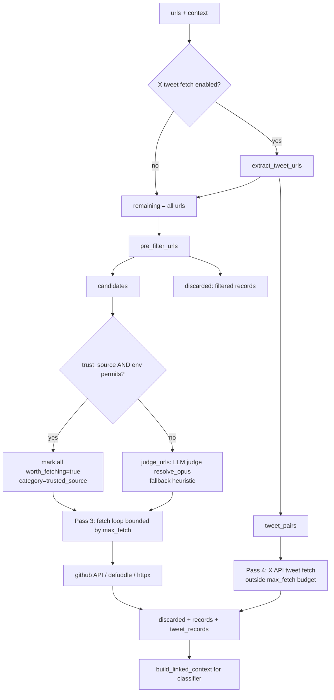

# URL Judging & Research Grounding

Two distinct subsystems that both feed enriched, fetched content into the CSI
(ClaudeDevs-style X intelligence) classifier. They are **separate code paths**
and must not be conflated:

| Subsystem | Module | What it does | When it runs |
|---|---|---|---|
| **URL enrichment / judge** | `csi_url_judge.py` | Takes URLs that *already appear inside a tweet* and decides which to fetch, then fetches them. | Always, for every post that has links. |
| **Research grounding** | `research_grounding.py` | When a post is *thin on links* but high-tier, reaches out to a **curated allowlist of official docs domains** to ground the analysis. | Only for tier ≥ 2 posts, gated. |

The first follows whatever an official handle linked. The second restricts where
the system is allowed to go looking on its own. Do not assume "the allowlist
gates tweet links" — it does not. The allowlist (`research_allowlist` in
`intel_lanes.yaml`) gates **only** the research-grounding path.

---

## 1. URL Enrichment (`csi_url_judge.py`)

A three-pass (effectively five-stage) pipeline that turns a raw list of URLs
into `EnrichmentRecord`s with on-disk fetched content. Entry point:
`enrich_urls()`.

```
Pass 0  extract_tweet_urls   — pull x.com/twitter.com /status/<id> URLs aside
Pass 1  pre_filter_urls      — fast regex filter (social / product / shortlinks)
Pass 2  judge_urls           — LLM judge (resolve_opus) OR trust_source bypass
Pass 3  fetch_url_content    — selective fetch (github API / defuddle / httpx)
Pass 4  _fetch_tweet_via_x_api — fetch the set-aside tweets via X API /2/tweets
```



### Pass 0 — Tweet-status short-circuit

`extract_tweet_urls()` splits the input into `(tweet_pairs, remaining)`.
`x.com`/`twitter.com` URLs matching `/<user>/status/<digits>` are pulled out
(`_TWEET_STATUS_URL_PATTERN`) so they can be fetched via the **X API
`/2/tweets/{id}`** endpoint in Pass 4 — they carry real signal (the tweet body,
metrics, referenced tweets) that the pre-filter would otherwise discard as
`social_noise`. Non-tweet `x.com` URLs (profiles, search) stay in `remaining`
and flow through the normal filter.

- Gate: `UA_CSI_X_API_TWEET_FETCH_ENABLED` (default **on**; `0/false/no/off`
  disables → all URLs flow through legacy filtering).

### Pass 1 — `pre_filter_urls()` (deterministic regex)

Discards, with a structured `skip_reason`, any URL whose host or path matches:

- **`SOCIAL_DOMAINS`** → `skip_reason=social_domain` (twitter, x, youtube,
  bsky, t.co, bit.ly, discord, etc.)
- **`PRODUCT_APP_DOMAINS`** → `skip_reason=product_app_not_content`
  (`claude.ai`, `chatgpt.com`, `chat.openai.com`, `gemini.google.com`) — these
  are apps, not content.
- **`SOCIAL_PATH_KEYWORDS`** on the last path segment → `social_path_keyword`
  (catches redirects like `marimo.io/discord`, `/newsletter`, `/sponsor`).
- Unparseable URLs → `unparseable_url`.

Survivors become `candidates`. Matching is host-exact or suffix
(`host.endswith(".<domain>")`).

> Gotcha: `host = parsed.netloc.lower().lstrip("www.")`. `lstrip` strips a
> *character set*, not a prefix — so it also chews leading `w`/`.` characters
> off any host (e.g. `wwww`→``, and theoretically a host beginning with those
> chars). Same pattern in `research_grounding._domain_of`. It works in practice
> for `www.` but is technically a `str.lstrip` misuse. [VERIFY: harmless in
> practice but worth noting if hostnames ever start with w/period.]

### Pass 2 — `judge_urls()` (LLM judge) or trust_source bypass

**LLM judge.** Calls `_call_llm_structured()` which uses the Anthropic SDK with
`tool_use` (forced `tool_choice`) for structured output, validated by the
`UrlJudgmentResult` / `UrlVerdict` Pydantic models. The model is
**`resolve_opus()`** — i.e. the flagship tier. `model_resolution.resolve_model`
checks `ANTHROPIC_DEFAULT_OPUS_MODEL` first and only falls back to
`ZAI_MODEL_MAP["opus"]` (`glm-5.1` on the ZAI proxy) when that env var is empty,
so the env var takes precedence.

> **Correction vs. legacy docs:** older documentation claimed this judge uses
> `resolve_sonnet`. The code uses **`resolve_opus()`**
> (`csi_url_judge._call_llm_structured` → `model=resolve_opus()`).

Each verdict yields an `EnrichmentRecord` with `fetch_status="pending"` (if
`worth_fetching`) or `"skipped"` with `skip_reason="llm_judge_not_worth_fetching"`.
Any input URL the LLM failed to return a verdict for is re-added defensively as
`worth_fetching=True` ("missed by LLM judge, defaulting to fetch").

Resilience:
- No API key (`_has_llm_key()` checks `ANTHROPIC_API_KEY` /
  `ANTHROPIC_AUTH_TOKEN` / `ZAI_API_KEY`) → `_heuristic_judge_fallback()`.
- Up to 2 attempts; on exhausted retries → heuristic fallback (never raises).
- `_heuristic_judge_fallback()` is a pure-domain classifier: github/gitlab repos,
  `docs.`/`/docs/` paths, readthedocs, AI-vendor domains, huggingface → all
  `worth_fetching=True`; everything else defaults to `True` ("unknown domain,
  fetching for evaluation").

**`trust_source=True` bypass.** When the caller passes `trust_source=True`
**and** `UA_CSI_TRUST_SOURCE_BYPASS_JUDGE` is truthy (default `"1"`), the entire
LLM judge is skipped — every pre-filter survivor is marked
`worth_fetching=True`, `category="trusted_source"`, and queued for fetch. This is
the production path for CSI lanes that only poll hand-picked official handles
(`@ClaudeDevs`, `@bcherny`): any URL those handles post is intentional and *is*
the substance to capture; the tweet is just the trigger. The judge was added to
filter open-web crawl noise, and for official-handle links it was silently
dropping documentation as "promotional". Set
`UA_CSI_TRUST_SOURCE_BYPASS_JUDGE=0` to re-enable the judge even under
`trust_source`.

The actual CSI caller (`claude_code_intel.py`) passes `trust_source=True` for
exactly this reason — see the `enrich_post()` closure.

### Pass 3 — `fetch_url_content()` (selective fetch)

Bounded by `max_fetch` (default `DEFAULT_MAX_FETCH` = `UA_CSI_MAX_FETCH_PER_POST`,
default **10**). Each fetched URL gets its own subdir keyed by a 12-char
SHA-256 of the URL. Beyond the limit, records are set
`skip_reason=max_fetch_limit_reached`.

Fetch strategy by category:
- **`github_repo`** → `_fetch_github_repo()`: pulls README via
  `raw.githubusercontent.com/.../HEAD/README.md` (then `.rst`), prepends
  repo metadata (stars/language/license) from the GitHub API. Faster than a clone.
- **Everything else** → `_fetch_with_defuddle()` first, then
  `_fetch_with_httpx()` fallback.

`_fetch_with_defuddle()` invokes the **defuddle CLI**:
`npx -y defuddle-cli@latest parse --markdown <url>`. The `parse` subcommand and
`--markdown` flag are mandatory — `_DEFUDDLE_CLI_ARGV` documents that the legacy
invocation omitted the subcommand and silently failed (`unknown command`) for
*every* URL, so every fetch fell through to raw-HTML httpx. Fixed in PR #332.

`_fetch_with_httpx()` is the last resort: it writes the **raw HTML response
body** to a `.md` file (with a browser User-Agent, `follow_redirects=True`). When
defuddle is **not installed on the host** (notably the VPS, which lacks the
defuddle CLI), *every* URL falls through here and the saved file is markup, not
prose. It emits an operator-visible warning when it detects `<!doctype html>` in
the head. Downstream consumers must validate the body (see
`research_grounding._looks_like_raw_html`).

All fetch paths truncate content at `DOC_STORAGE_MAX_CHARS`
(`UA_CSI_DOC_STORAGE_MAX_CHARS`, default **200,000**). This cap was raised from a
legacy 20K so long official docs reach the classifier intact.

### Pass 4 — `_fetch_tweet_via_x_api()`

For each set-aside tweet, fetches via `fetch_tweet_by_id_with_fallbacks()` /
`get_x_bearer_token()` (from `claude_code_intel.py`), renders the body +
author + metrics + referenced-tweets as a markdown source page
(`_render_tweet_markdown`), and persists both `tweet_<id>.md` and the raw
`tweet_<id>.json`. Result is an `EnrichmentRecord` shaped identically to a
fetched URL so downstream code treats it the same.

- These fetches are **outside the `max_fetch` budget** (X API quota is
  independently rate-limited; they are not web crawls).
- Auth: a bearer token, OR all four `X_OAUTH_*` consumer/access creds, OR
  `X_OAUTH2_ACCESS_TOKEN`. If none present, the record returns
  `skip_reason="x_api_no_auth"` and the orchestrator **downgrades that URL to the
  legacy `social_noise` filter** (added to `discarded`), matching pre-Tier-B1
  behavior. Never raises.

### Output assembly & `build_linked_context()`

`enrich_urls` returns `discarded + records + tweet_records`.
`build_linked_context()` reads each fetched file and assembles a single
`source_type=… | url=… | content=…` string for the tier classifier. Even
unfetched (but non-`social_noise`) records contribute a metadata line.
`max_content_chars=None` (default) means **no truncation** — the classifier reads
the full fetched doc (v1 hard-coded 3,000 chars here, collapsing docs into
excerpts).

### Env flags (csi_url_judge)

| Var | Default | Effect |
|---|---|---|
| `UA_CSI_DOC_STORAGE_MAX_CHARS` | 200000 | Per-source content cap (storage). |
| `UA_CSI_MAX_FETCH_PER_POST` | 10 | Default `max_fetch` per `enrich_urls` call. |
| `UA_CSI_X_API_TWEET_FETCH_ENABLED` | on | Pass-0 tweet-status short-circuit. |
| `UA_CSI_TRUST_SOURCE_BYPASS_JUDGE` | "1" | Whether `trust_source=True` actually bypasses the LLM judge. |
| `ANTHROPIC_BASE_URL` | – | Optional base URL for the Anthropic client (ZAI proxy). |
| `UA_CSI_URL_ENRICHMENT_ENABLED` | "1" | **Master switch** for the whole enrichment path. Read in the *caller* (`claude_code_intel.py`), not in `csi_url_judge`; when off, the live-sync path skips `enrich_urls` entirely. |

`_env_int` ignores non-positive / non-integer values and returns the default.

The model-routing env vars (`ANTHROPIC_BASE_URL`, `ANTHROPIC_AUTH_TOKEN`,
`ANTHROPIC_DEFAULT_OPUS_MODEL`, etc.) are loaded from Infisical at process start
by `initialize_runtime_secrets()` and are **never** written to `.env` on disk.
On the ZAI proxy, `resolve_opus()` returns `glm-5.1` unless
`ANTHROPIC_DEFAULT_OPUS_MODEL` overrides it.

---

## 2. Research Grounding (`research_grounding.py`)

Separate path. When a post is about a real feature but its linked sources are
thin/missing, this module reaches into a **curated allowlist of official docs
domains** to fetch grounding context. Three invariants (from the v2 design §6.3):

1. **Allowlist priority** — official sources searched first; general web is
   last-resort and marked in provenance.
2. **Tier gate** — research only fires for tier ≥ `tier_gate()`
   (`UA_CSI_RESEARCH_TIER_GATE`, default **2**). Noise tweets never spend.
3. **No invention** — when nothing is found, return empty/skipped rather than
   fabricate.

### Trigger decision — `should_trigger_research()`

Returns `(triggered, reasons)`. Logic:
- `operator_force=True` → triggers immediately, **bypassing the tier gate**
  (`TriggerReason.OPERATOR_FORCE`).
- Otherwise, if `tier < tier_gate()` → `(False, [])`.
- Then collects `TriggerReason`s:
  - `NO_LINKS` — post has no links.
  - `THIN_LINKED_SOURCES` — `classifier_result["linked_sources_thin"]` is set.
  - `UNKNOWN_TERM` — any extracted candidate term not already a vault entity.
- Triggers if at least one reason fired.

`extract_candidate_terms()` strips `@mentions`, `#tags`, and URL tokens *before*
regex matching (so handles like `@OniricSunset` never get slugified into
hallucinated docs URLs), then matches CamelCase / snake_case identifiers, drops
`_TERM_STOPWORDS` (claude, anthropic, agent, github, …) and any
`excluded_handles`.

`build_research_request()` wraps the gate and produces a `ResearchRequest`
(post_id, tier, terms, reasons, lane_slug) or `None`.

### Allowlist matching — `allowlist_rank()` / `is_allowed()`

`allowlist_rank()` returns the index of the first matching allowlist pattern
(lower = higher trust); **-1** = no match (general-web fallback bucket).
Patterns may be bare domains (`docs.anthropic.com`, matched as domain or
`.endswith`) or domain+path (`github.com/anthropics`, matched as host equality +
path prefix). `is_allowed()` is just `allowlist_rank(...) >= 0`.

The allowlist comes from `lane.research_allowlist` in `intel_lanes.yaml`. For
the `claude-code-intelligence` lane it currently includes
`docs.anthropic.com`, the rebranded `*.claude.com` domains
(`docs.claude.com`, `code.claude.com`, `platform.claude.com`,
`support.claude.com`), `github.com/anthropics`, and several `anthropic.com/*`
paths.

### Candidate URL generation — `candidate_urls_for_term()`

**Deterministic** guesses only (no LLM/search yet — flagged as the upgrade path
in the source). For each term it synthesizes slug-dash / slug-under variants of
known docs URL shapes (`docs.anthropic.com/en/docs/<slug>`, anthropics GitHub
repos, `anthropic.com/news`), each guarded by whether the relevant prefix is in
the allowlist, and finally filtered through `is_allowed()`.

### Fetch & unusable-source rejection — `execute_research()`

Resolves the lane (`get_lane`), reads `research_allowlist` (empty →
`skipped_reason="empty_allowlist"`), builds candidates (capped at
`max_sources`, default 6), then **reuses `csi_url_judge.fetch_url_content()`** —
so research grounding inherits the same defuddle→httpx→github behavior and
`DOC_STORAGE_MAX_CHARS` cap.

Critically, each fetched body is screened by **`_is_spa_404_shell()`**, which
rejects two poison failure modes and **deletes the artifact off disk** (so vault
ingest can never pick it up), recording `skip_reason="spa_404_shell"`:

1. **SPA 404 shell.** `docs.anthropic.com` is a Next.js SPA — every path returns
   HTTP 200 with the same shell and renders the 404 only after JS. Detected via
   `_SPA_SHELL_MARKERS` (`data-theme="claude"`, `<noscript>page not found`,
   `anthropic.com/_next/static`) when body is short
   (< `_SPA_SHELL_MIN_BODY_CHARS * 4` = 2400 chars), or any body shorter than
   `_SPA_SHELL_MIN_BODY_CHARS` = 600 chars.
2. **Raw HTML dump.** `_looks_like_raw_html()` — independent of size — flags
   bodies whose first ~2KB contains `<!doctype html>` / `<html…>` or ≥ 8
   HTML-tag fragments (`<link `, `<script`, `<meta `). This is the dominant case
   on the **VPS where the defuddle CLI is not installed**, so every grounded
   source lands as a 200KB raw-HTML dump regardless of the URL.

The function name `_is_spa_404_shell` is kept stable for the cleanup script
(`src/universal_agent/scripts/csi_vault_cleanup_grounding_hallucinations.py`,
which imports `research_grounding._is_spa_404_shell`) even though it now catches
both modes.

`ResearchSource.to_enrichment_record()` adapts each source into the same
`EnrichmentRecord` shape the classifier consumes (category `documentation` for
allowlisted rank ≥ 0, else `other`).

### Env flags (research_grounding)

| Var | Default | Effect |
|---|---|---|
| `UA_CSI_RESEARCH_TIER_GATE` | 2 | Minimum post tier that may trigger research. |

---

## Callers & integration

- **`claude_code_intel.py`** (`enrich_post` closure, ~`ThreadPoolExecutor`
  max_workers=5) calls `enrich_urls(..., trust_source=True)` per post, then
  `build_linked_context()`, feeding `classify_post(linked_context=…)`.
- **`claude_code_intel_replay.py`** drives research grounding:
  `build_research_request()` → `execute_research()`, persisting under
  `<packet>/research_grounding/<post_id>/` and `research_grounding.json`.
- **`src/universal_agent/scripts/csi_vault_cleanup_grounding_hallucinations.py`**
  uses `_is_spa_404_shell` to quarantine already-ingested poison.

## Tier vocabulary (for the research gate)

Per the module docstring: Tier 1 = noise, Tier 2 = kb_update, Tier 3 =
strategic_follow_up, Tier 4 = demo_task. The gate default of 2 means only
`kb_update`-and-above posts can spend on grounding.

## Gotchas summary

- **`resolve_opus`, not `resolve_sonnet`** — the URL judge runs on the flagship
  tier. Legacy docs were wrong.
- **Two allowlists are not the same.** `research_allowlist` gates *only*
  research grounding. Tweet links are governed by `enrich_urls(trust_source=…)`
  and the pre-filter, never the allowlist.
- **VPS has no defuddle CLI** → every web fetch falls to raw-HTML httpx; research
  grounding then rejects them as raw-HTML dumps. Installing defuddle on the host
  is the real fix; the rejection predicate is the backstop.
- **defuddle requires `parse --markdown`** — missing the subcommand silently
  fails for every URL (PR #332).
- **Tweet fetches bypass `max_fetch`** and can downgrade to `social_noise` on
  missing X auth.
- **`trust_source` bypass is env-overridable** via
  `UA_CSI_TRUST_SOURCE_BYPASS_JUDGE`.
