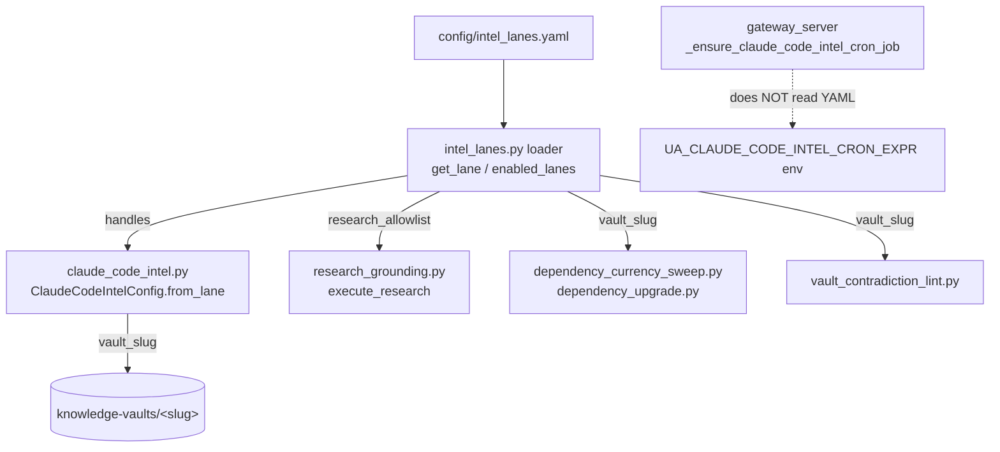

# Intel Lanes Configuration

An **intel lane** is a "what to watch and where to put it" recipe for the proactive
intelligence pipeline. One YAML file (`config/intel_lanes.yaml`) declares each lane's X
handles, research-grounding allowlist, vault/library slugs, cron schedule, demo execution
profile, and tracked packages. The goal is that adding a new topic (OpenAI Codex, Gemini)
is a config edit, not new code.

The loader is `services/intel_lanes.py`. It is deliberately small: a strict Pydantic schema
plus a cached YAML reader. It holds **no behavior** — consumers read the typed config and act.

> The module docstring still says "Existing `claude_code_intel.py` paths are NOT yet wired
> to read from here." That is **stale**. As of this writing the loader is wired into
> `claude_code_intel.py` (handles + vault slug), `research_grounding.py` (allowlist),
> `dependency_currency_sweep.py`, `dependency_upgrade.py`, and `vault_contradiction_lint.py`.
> See the consumer table below.

## Schema

`intel_lanes.py::LaneConfig` is `extra="forbid"` and `frozen=True` — an unknown key fails
loudly at load time (typos surface immediately) and configs are immutable once parsed.

| Field | Type | Default | Live-consumed? |
|---|---|---|---|
| `enabled` | bool | `True` | yes — `enabled_lanes()` filters on it |
| `title` | str | (required) | display only |
| `description` | str | `""` | display only |
| `handles` | list[str] | `[]` | **yes** — X handles to poll (see below) |
| `research_allowlist` | list[str] | `[]` | **yes** — research grounding gate |
| `vault_slug` | str | (required) | **yes** — knowledge-vault directory |
| `capability_library_slug` | str | (required) | declarative only — no live reader found |
| `cron_expr` | str | (required) | **mirror only** — see Cron gotcha |
| `cron_timezone` | str | `America/Chicago` | **mirror only** — see Cron gotcha |
| `demo_endpoint_profile` | str | `anthropic_native` | declarative only — no live reader found |
| `tracked_packages` | list[str] | `[]` | mirrored (hardcoded copy in code) |

`LanesDocument` wraps the file: `version: int = 1` and `lanes: dict[str, LaneConfig]`, also
`extra="forbid"`/`frozen`.

### `handles` normalization gotcha

`LaneConfig._strip_handle_at_signs` is a `mode="before"` validator that strips leading `@`
and whitespace and drops empties. So `"@ClaudeDevs"` and `"ClaudeDevs"` both store as
`"ClaudeDevs"`. Downstream code can compare bare handles without worrying about the `@`.

## Loader API

All functions live in `intel_lanes.py`:

- `load_lanes_document(path=None)` — parse + validate. `path=None` reads the package-bundled
  `intel_lanes.yaml` via `importlib.resources` (works installed, editable, or zipped).
- `get_lane(slug, *, path=None)` — one lane by slug; raises `KeyError` if missing.
- `enabled_lanes(*, path=None)` — only lanes with `enabled: true`.
- `all_lanes(*, path=None)` — every lane regardless of state.
- `reset_cache()` — clears the cached default document (tests use this when monkey-patching).

The default (bundled, `path=None`) document is memoized via `_cached_default_document`
(`@lru_cache(maxsize=1)`). Passing an explicit `path` bypasses the cache and re-parses.

`CLAUDE_CODE_LANE_KEY = "claude-code-intelligence"` is the exported constant for the one
active lane; consumers default to it.

## Lanes shipped today

| Slug | enabled | handles | vault_slug |
|---|---|---|---|
| `claude-code-intelligence` | **true** | `ClaudeDevs`, `bcherny` | `claude-code-intelligence` |
| `openai-codex-intelligence` | false | `OpenAIDevs`, `OpenAI`, `sama` | `openai-codex-intelligence` |
| `gemini-intelligence` | false | `GoogleDeepMind`, `GoogleAI` | `gemini-intelligence` |

The two disabled lanes are **templates** — kept so adding a real lane is a ~5-line edit. No
live consumer iterates the disabled lanes for work; they exist for structure.

## Consumer map



### handles → `claude_code_intel.py`
`ClaudeCodeIntelConfig.from_env` / `from_lane` / `all_handles_from_env` resolve the X handles
to poll. Resolution order (env wins, lane fallback, hardcoded default last):

1. `UA_CLAUDE_CODE_INTEL_X_HANDLE(S)` env var
2. `intel_lanes.yaml` handles for the active lane (via `_first_handle_from_lane` /
   `_all_handles_from_lane`, both swallow exceptions and never raise)
3. `DEFAULT_HANDLE(S)` constant

The active lane slug itself comes from `UA_CLAUDE_CODE_INTEL_LANE_SLUG` (default
`claude-code-intelligence`).

### research_allowlist → `research_grounding.py`
`execute_research(request, ..., lane=None)` calls `get_lane(request.lane_slug)` and reads
`lane.research_allowlist`. An empty allowlist short-circuits with
`skipped_reason="empty_allowlist"`; an unknown slug gives `skipped_reason="lane_unknown:<slug>"`.

`research_allowlist` semantics (`research_grounding.py::allowlist_rank`):
- **Priority-ordered**: lower index = higher trust. The function returns the matching index,
  or `-1` for "not on the allowlist" (general-web fallback bucket). `is_allowed` is just
  `allowlist_rank(url, allowlist) >= 0`.
- **Two entry forms**: bare domain (`docs.anthropic.com`) matches the host exactly or any
  subdomain (`domain.endswith("." + pattern)`); domain+path (`github.com/anthropics`) matches
  host exactly AND path prefix.
- The grounding subagent fetches official sources first and only falls back to general web
  when the official lookup yields nothing.

**Critical scope distinction** (also documented inline in the YAML): `research_allowlist`
gates **Phase-1 research grounding only** — where the pipeline is *allowed to go searching*
for related context. It is NOT the gate on URLs that appear inside the polled tweets. Those
are handled by `csi_url_judge.enrich_urls(trust_source=True)`, which follows every URL that
survives the pre-filter. We restrict where we go searching, but follow whatever
official-handle posts link to. The two paths are intentionally separate. (See the URL-judging
doc, `04_intelligence/02_url_judging_and_research_grounding.md`.)

The Claude-Code allowlist carries both `anthropic.com` and `claude.com` product-doc domains
(`docs.claude.com`, `code.claude.com`, `platform.claude.com`, `support.claude.com`) because
Anthropic rebranded several doc domains — keeping both lets historical and current links both
ground.

### vault_slug → multiple
`claude_code_intel.py::_vault_slug_for_lane` reads `lane.vault_slug` (falling back to
`KB_SLUG` if lookup fails) and uses it for the knowledge-base / vault path passed into queued
tasks. The dependency scripts and the contradiction lint resolve
`resolve_artifacts_dir() / "knowledge-vaults" / lane.vault_slug`.

### tracked_packages → `dependency_currency.py` (mirrored, not read)
The YAML comment claims `tracked_packages` is the source of truth, but
`dependency_currency.py::ANTHROPIC_ADJACENT_PACKAGES` is a **hardcoded frozenset** lifted from
that list, described in-code as "the operational fallback when the lane config is
unavailable." So the two can drift — if you change `tracked_packages` in the YAML, also update
the frozenset.

## Cron schedule gotcha (important)

The YAML lane declares `cron_expr: "0 8,16,22 * * *"` and `cron_timezone: "America/Chicago"`
(three times daily — 08:00, 16:00, 22:00 CT; the 22:00 poll was added 2026-05-06 for
end-of-day signal). **But the actual cron job that runs the lane does NOT read these YAML
fields.**

`gateway_server.py::_ensure_claude_code_intel_cron_job` registers the `claude_code_intel_sync`
job and sources its schedule from environment variables:

```python
cron_expr = os.getenv("UA_CLAUDE_CODE_INTEL_CRON_EXPR", "0 8,16,22 * * *").strip() or "0 8,16,22 * * *"
timezone_name = os.getenv("UA_CLAUDE_CODE_INTEL_CRON_TIMEZONE", "America/Chicago").strip() or "America/Chicago"
```

The env defaults happen to match the YAML, so behavior is the same today — but the YAML
`cron_expr`/`cron_timezone` are effectively **documentation that mirrors the env defaults**,
not the live source. Editing the YAML schedule alone changes nothing; you must set the env
vars (or change the code defaults). The job also has `catch_up_on_restart: True` so a deploy
or service blip within the 24h grace doesn't silently drop a poll, runs the command
`!script universal_agent.scripts.claude_code_intel_run_report`, and uses a 30-minute timeout
(`UA_CLAUDE_CODE_INTEL_CRON_TIMEOUT_SECONDS`, default `1800`).

> [VERIFY: `capability_library_slug` and `demo_endpoint_profile` are declared and validated by
> the schema but no live code reader was found for either as of 2026-05-29. They appear to be
> declarative/aspirational fields (the `anthropic_native` demo profile is enforced elsewhere via
> Cody mode / claude_cli_client, not via this lane field). Treat them as documentation until a
> consumer is wired.]

## Adding a lane

1. Add a `lanes.<slug>:` block to `intel_lanes.yaml` with the required fields. Unknown keys
   fail loudly, so copy an existing block.
2. Set `enabled: true` only once the consuming code paths exist for it — today only the
   `claude-code-intelligence` lane has a wired cron producer.
3. If the lane needs its own schedule, remember the cron gotcha: the schedule lives in env/code
   for the Claude-Code lane, not the YAML. A generalized per-lane cron registration that reads
   `lane.cron_expr` does not exist yet.
4. Keep `tracked_packages` in sync with `dependency_currency.py::ANTHROPIC_ADJACENT_PACKAGES`
   if the lane gates demo execution on package currency.
