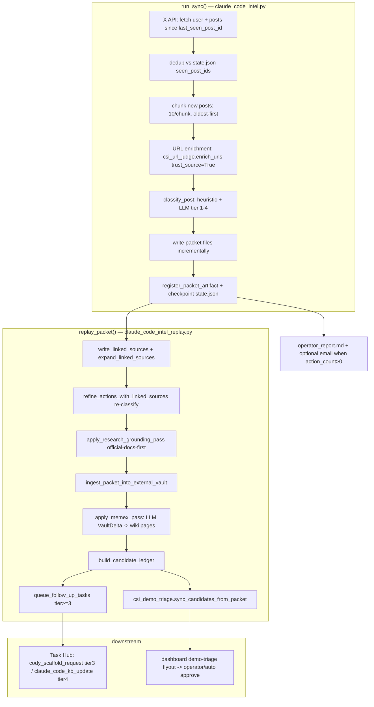

# ClaudeDevs X Intelligence

## What it is

A read-only intelligence lane that polls curated X (Twitter) handles for
Claude Code / Claude Agent SDK / Anthropic developer signal, classifies each
new post into an action tier, fetches and grounds the URLs those posts link
to, persists a durable **packet** per run, materialises a long-lived
**knowledge vault**, and queues implementation-worthy posts into Task Hub for
downstream agents (Simone → Cody).

The lane is named **CSI** ("Claude (Code) Source Intelligence") in code. The
internal slug is `claude_code_intel` / `claude-code-intelligence`. The X
handles it watches are `@ClaudeDevs` and `@bcherny` by default
(`claude_code_intel.py::DEFAULT_HANDLES`).

> Scope note: many `UA_CSI_*` env vars exist (convergence cron, specialist
> alerts, delivery adapters, RSS insight). Those belong to *adjacent* proactive
> intelligence surfaces, not this lane. This doc covers the @ClaudeDevs X
> polling lane, its packet outputs, and the vault. The shared three-pass URL
> enricher (`csi_url_judge.py`) is documented here because the lane is its
> primary caller.

The lane is **intentionally read-only against X** — it only reads posts. It
never tweets, likes, or follows. (`claude_code_intel.py` module docstring.)

## Two entry points

| Entry point | Module | Used by |
|---|---|---|
| `claude_code_intel_sync` | `scripts/claude_code_intel_sync.py` | manual / dev runs, direct CLI |
| `claude_code_intel_run_report` | `scripts/claude_code_intel_run_report.py` | the production system cron + the `claudedevs-x-intel` skill |

Both call `run_sync()` then `replay_packet()`. `run_report` additionally
writes an operator summary and optionally emails it. The **canonical
autonomous scheduler is the `claude_code_intel_sync` system cron job**, which
runs `claude_code_intel_run_report` as its command (see Cron below — the job
id and the script name differ on purpose).

## End-to-end flow



### Phase 1 — `run_sync()` (poll + classify)

`run_sync()` (`claude_code_intel.py::run_sync`) is the poll loop:

1. **Quota cooldown short-circuit.** If a prior run hit X API `HTTP 402`
   (CreditsDepleted), a per-handle `quota_cooldown__<handle>.json` file is
   written. While the window is active, `run_sync` returns `ok=True` with
   `quota_cooldown_until_iso` set and does *not* touch the X API. This
   suppresses the per-fire failure-email storm (one alarm per cooldown window,
   not one per scheduled fire). Default 24h, `UA_CSI_QUOTA_COOLDOWN_HOURS`.
2. **Fetch** the user (`/2/users/by/username/{handle}`) and recent posts
   (`/2/users/{id}/tweets`) with `since_id = state.last_seen_post_id`. Auth is
   a bearer token (`X_BEARER_TOKEN` / `BEARER_TOKEN`) with an OAuth1
   user-context fallback (`fetch_*_with_fallbacks`).
3. **Dedup** against `state.json::seen_post_ids`; sort new posts oldest-first
   for forward progress.
4. **Chunk** into batches of 10. There is a **25-minute wall-clock budget**
   (`max_run_time_seconds = 25*60`) to stay under the 30-min cron timeout;
   state is checkpointed per chunk so a timeout loses no progress.
5. Per chunk, two concurrent (`ThreadPoolExecutor(max_workers=5)`) passes:
   - **URL enrichment** via `csi_url_judge.enrich_urls(..., trust_source=True)`
     → a `linked_context` string per post.
   - **Classification** via `classify_post(post, linked_context=...)`.
6. Write packet files incrementally, register the artifact, queue tasks (if
   enabled), and checkpoint `state.json`.
7. **No-new-posts short-circuit:** if nothing new, state is still advanced,
   the empty packet dir is `rmtree`'d, and the run returns
   `new_post_count=0, action_count=0`. A "0 new posts" run is **not** a failure
   (a frequent false-alarm — see Gotchas).

### Tier classification

`classify_post()` blends a deterministic heuristic with an LLM call:

- `_heuristic_classification()` keyword-matches the post text against term sets
  (`_TIER4_TERMS` breaking/migration/security…, `_TIER3_TERMS` api/sdk/mcp…,
  `_TIER2_TERMS` docs/changelog…) plus `_COMMUNITY_EVENT_TERMS`
  (downshifts hackathon/event posts to keep them out of demo_task).
- `_llm_assisted_classification()` (gated by
  `UA_CLAUDE_CODE_INTEL_LLM_CLASSIFIER_ENABLED`, default on; needs an LLM key)
  asks the model for `tier`, `action_type`, `content_kind`, `confidence`. The
  LLM verdict wins when valid; otherwise the heuristic stands.
- **Deterministic release-announcement override:** if
  `dependency_currency.detect_release_announcement` finds a tracked
  Anthropic-adjacent package + version, `action_type` is forced to
  `release_announcement` and tier floored at 2 — the LLM is *allowed* to miss
  this; deterministic detection wins (Phase 0 dependency currency keys off it).

| Tier | action_type | meaning | downstream |
|---|---|---|---|
| 1 | `digest` | chatter / low value | vault page only (gated, see tier-1 gate) |
| 2 | `kb_update` | docs, release notes, reference | vault page |
| 3 | `demo_task` | concrete build opportunity | Task Hub `cody_scaffold_request` |
| 4 | `strategic_follow_up` | migration/breaking/security risk | Task Hub `claude_code_kb_update` |

### Phase 2 — `replay_packet()` (enrich + persist + route)

`replay_packet()` (`claude_code_intel_replay.py::replay_packet`) runs the
heavy post-processing against the packet on disk, so it can be re-run
(backfill) without re-polling X or duplicating Task Hub work:

1. `write_linked_sources` + `expand_linked_sources` — fetch every linked URL
   (defuddle → httpx; X `/status/` self-refs fetched via X API). Capped by
   `UA_CLAUDE_CODE_INTEL_LINK_MAX_FETCH` (default 10, max 50).
2. `refine_actions_with_linked_sources` — re-classify each action now that the
   linked content is on disk; the original `actions.json` is backed up to
   `actions_original.json`.
3. `apply_research_grounding_pass` — for tier-2+ actions with no/thin links or
   unknown terms, fetch *additional* official-docs-first sources via
   `research_grounding` (gated `UA_CSI_RESEARCH_GROUNDING_WIRING_ENABLED`).
   The polled X handles are excluded so they can't be slugified into
   hallucinated docs URLs.
4. `ingest_packet_into_external_vault` — write source pages into the vault,
   then `apply_memex_pass` (gated `UA_CSI_MEMEX_WIRING_ENABLED`) which makes
   **one LLM call per tier-2+ action** (`csi_intelligence_pass.analyze_action`)
   producing a structured `VaultDelta`, persisted via
   `csi_intelligence_persistence.apply_vault_delta_to_vault`. **Code never
   decides what is meaningful; the LLM does** (LLM-native intelligence design).
5. `build_candidate_ledger` — per-packet + per-lane `candidate_ledger.json`
   tying each action to its Task Hub row, assignments, vault pages, and email
   evidence.
6. `queue_follow_up_tasks` — enqueue tier-3+ actions (see Routing).
7. `csi_demo_triage.sync_candidates_from_packet` — surface tier-3+ candidates
   in the dashboard demo-triage flyout (best-effort).

## URL enrichment — the three-pass judge (`csi_url_judge.py`)

`enrich_urls()` is shared by this lane and the YouTube tutorial pipeline:

- **Pass 0 — tweet extraction.** `x.com`/`twitter.com` `/status/{id}` URLs are
  pulled aside and fetched via the X API `/2/tweets/{id}` endpoint (Tier B1),
  persisting the tweet body as a synthesized markdown source page. Without
  this, every linked tweet would be dropped as `social_noise`. Gated
  `UA_CSI_X_API_TWEET_FETCH_ENABLED` (default on). Tweet fetches are outside
  the `max_fetch` budget (separate API quota).
- **Pass 1 — regex pre-filter.** Strip social domains (`SOCIAL_DOMAINS`),
  product apps (`claude.ai`, `chatgpt.com`, …), self-referential and `t.co`
  links.
- **Pass 2 — LLM judge.** `judge_urls()` evaluates the surviving URL *strings*
  (no fetch yet) for fetch-worthiness via Anthropic `tool_use` structured
  output, with a heuristic domain fallback if no LLM key.
- **Pass 3 — selective fetch.** `fetch_url_content()` — GitHub repos via the
  GitHub README API, everything else defuddle CLI → httpx fallback.

### `trust_source=True` — the lane bypasses the judge on purpose

When `run_sync` enriches @ClaudeDevs/@bcherny links it passes
`trust_source=True`. With `UA_CSI_TRUST_SOURCE_BYPASS_JUDGE` on (default), this
**skips Pass 2 entirely** — every URL surviving the pre-filter is fetched
unconditionally. Rationale (in the `enrich_urls` docstring): these are curated
official handles; the URL they post *is* the substance we exist to capture (the
tweet is just the trigger). The judge was built to filter noise from open-web
crawls; for official-handle links it was silently dropping the actual
documentation as "promotional" (root cause of the "linked sources: 1 (0
fetched)" failure on the keyless-auth announcement).

> Do not confuse the three URL "allowlists." `research_allowlist` in
> `intel_lanes.yaml` gates only the **research grounding** out-bound search
> (`research_grounding.is_allowed`). The `csi_url_judge` pre-filter and LLM
> judge are separate code paths. Tweet-link fetching is gated by neither — it
> is `trust_source=True`. Follow the call site, not the term.

## Packet outputs

Each run that finds new posts writes a packet under:

```
<UA_ARTIFACTS_DIR>/proactive/claude_code_intel/packets/YYYY-MM-DD/HHMMSS__<handle>/
```

| File | Written by | Contents |
|---|---|---|
| `manifest.json` | `_write_packet_files` | lane, handle, generated_at, counts, file list |
| `raw_user.json` / `raw_posts.json` / `new_posts.json` | `_write_packet_files` | raw X API payloads + new posts |
| `actions.json` | `_write_packet_files` / replay | classified actions (replay refines in place; `actions_original.json` backs up the pre-refine copy) |
| `digest.md` | `_digest_markdown` | human digest; the artifact's `artifact_path` |
| `source_links.md`, `triage.md` | `_write_packet_files` | links + per-tier triage |
| `linked_sources.json` + `linked_sources/<hash>/` | replay | fetched linked-URL bodies + metadata |
| `research_grounding.json` + `research_grounding/<post>/` | replay | grounded official sources |
| `candidate_ledger.json` | `build_candidate_ledger` | per-action → task/vault/email reconciliation |
| `implementation_opportunities.md` | replay | tier-3+ summary |
| `replay_summary.json` | `write_replay_summary` | replay result payload |
| `operator_report.md` / `operator_report.json` | `run_report` | operator summary with durable links |

Checkpoint state (NOT inside a packet, lives at the lane root):

```
<UA_ARTIFACTS_DIR>/proactive/claude_code_intel/state.json   # per handle, tracks last_seen_post_id + seen_post_ids
```

## The vault — canonical product

The lane's durable product is the **external knowledge vault**, not the
packets (packets are forensic snapshots). Default location:

```
<UA_ARTIFACTS_DIR>/knowledge-vaults/claude-code-intelligence/
```

Override with `UA_CSI_VAULT_PATH_OVERRIDE` (used by the v2 backfill for staged
migration). The vault is an `external` wiki (`wiki/core.py::ensure_vault`)
with `entities/` and `concepts/` pages plus `raw/packets/<name>/` immutable
snapshots. The Memex pass appends to it (CREATE / EXTEND / REVISE per
`VaultDelta`), refreshing slug context within a batch so later actions see
earlier additions.

The **tier-1 min-signal gate** (`_tier1_has_signal`, gated
`UA_CSI_TIER1_MIN_SIGNAL_ENABLED`, default on) skips writing a vault page for
conversational tier-1 chatter ("Working on it!") that has no link, matched
term, version string, or signal `content_kind`. Higher tiers always pass.

## Task Hub routing

`queue_follow_up_tasks` enqueues only tier-3+ actions. The payload is built by
the single shared helper `_build_followup_task_payload` (also used by the
operator-approve flow `csi_demo_triage.approve_candidate` — both must produce
identical payloads):

- **tier 3 →** `cody_scaffold_request`. Simone scaffolds a workspace and then
  *she* enqueues a `cody_demo_task` for Cody downstream. This is the canonical
  path as of 2026-05-09.
- **tier 4 →** `claude_code_kb_update` (Atlas / general analysis).
- The legacy direct `claude_code_demo_task` is gated behind
  `UA_CSI_DIRECT_DEMO_FALLBACK` (default off) as an emergency lever only.

Task id is deterministic: `<source_kind>:<sha256(post_id)[:16]>`, so re-runs /
replays of the same post upsert the same row rather than duplicating work.
`replay.intended_task_identity` mirrors this routing for the ledger — **if you
change one, change both in lockstep**.

## Cron registration

Registered by `gateway_server.py::_ensure_claude_code_intel_cron_job`:

- Job id `claude_code_intel_sync`; command
  `!script universal_agent.scripts.claude_code_intel_run_report` (job id and
  script name differ — the cron runs the *report* entry point).
- Default schedule `0 8,16,22 * * *` America/Chicago — three polls daily
  (08:00, 16:00, 22:00 Houston). All inside the 06:00–22:00 content-generation
  active window (dormancy policy). Overridable with
  `UA_CLAUDE_CODE_INTEL_CRON_EXPR` / `_CRON_TIMEZONE`.
- `catch_up_on_restart: True` — a missed window (deploy / blip) is backfilled
  within the 24h grace.
- Disable the whole job with `UA_CLAUDE_CODE_INTEL_CRON_ENABLED=0`.
- Timeout `UA_CLAUDE_CODE_INTEL_CRON_TIMEOUT_SECONDS` default 1800s (30 min);
  `run_sync`'s internal 25-min budget keeps it under this.

Adjacent crons (separate surfaces): `csi_demo_triage_rank` (ranks pending
candidates twice daily) and `intel_auto_promoter` (auto-approves top-scored
candidates 30 min after the ranker).

## Rolling brief + capability library

After a successful run with new signal (or with `--rebuild-brief`), `run_report`
calls `claude_code_intel_rollup.build_rolling_assets`, producing two
corpus-level products:

- **Rolling brief** — a synthesized brief over the last
  `UA_CLAUDE_CODE_INTEL_BRIEF_WINDOW_DAYS` days (default **28**; v1 hard-coded a
  14-day / 18-item window that silently truncated). Output under
  `<UA_ARTIFACTS_DIR>/proactive/claude_code_intel/rolling/current/` (with a
  `history/` archive).
- **Capability library** — a full-corpus (not windowed) synthesis written to
  the repo at `agent_capability_library/claude_code_intel/`
  (`capability_library_root()`), the lane's runnable-reference catalogue. Gated
  default-on; window from `_load_action_contexts` reads the full corpus.

`run_report` rebuilds the brief when `total_new > 0`, on `--rebuild-brief`, or
when the always-rebuild policy is set — so backfills and operator overrides
reflect immediately, unlike v1 which only rebuilt on fresh posts.

## Operator report + email

`run_report` → `replay_packet` → `build_operator_report` +
`build_operator_email` (`claude_code_intel_operator_report.py`). The production
cron **emails Kevin automatically only when `action_count > 0`** (default email
policy; `_should_send_email`). Recipient resolves from `--email-to`, else
`UA_CLAUDE_CODE_INTEL_REPORT_EMAIL_TO`. The `claudedevs-x-intel` skill is the
manual operator surface and rides this same `run_sync` + `replay` flow — it
must not create a second intelligence or scheduler path
(`.claude/skills/claudedevs-x-intel/SKILL.md`).

## Lane config (`intel_lanes.yaml`)

The lane is config-driven so a new topic (Codex, Gemini) is a YAML edit, not
new code. Schema enforced by `services.intel_lanes:LaneConfig` (Pydantic;
unknown keys rejected). The live lane `claude-code-intelligence` defines:
handles, `research_allowlist`, `vault_slug`, `capability_library_slug`,
`cron_expr`, `demo_endpoint_profile: anthropic_native`, and `tracked_packages`
(for Phase 0 dependency currency). The `openai-codex-intelligence` and
`gemini-intelligence` lanes exist as `enabled: false` templates.

## Key environment flags

| Var | Default | Effect |
|---|---|---|
| `UA_CLAUDE_CODE_INTEL_CRON_ENABLED` | 1 | register the system cron |
| `UA_CLAUDE_CODE_INTEL_CRON_EXPR` | `0 8,16,22 * * *` | poll schedule |
| `UA_CLAUDE_CODE_INTEL_X_HANDLE(S)` | lane yaml → `ClaudeDevs,bcherny` | handles to poll |
| `UA_CLAUDE_CODE_INTEL_MAX_RESULTS` | 25 (5–100) | posts per poll |
| `UA_CLAUDE_CODE_INTEL_QUEUE_TASKS` | 1 | enqueue tier-3+ to Task Hub |
| `UA_CLAUDE_CODE_INTEL_LLM_CLASSIFIER_ENABLED` | 1 | LLM tier classifier (vs heuristic only) |
| `UA_CLAUDE_CODE_INTEL_LINK_MAX_FETCH` | 10 (max 50) | replay linked-source fetch cap |
| `UA_CSI_URL_ENRICHMENT_ENABLED` | 1 | per-post URL enrichment in `run_sync` |
| `UA_CSI_X_API_TWEET_FETCH_ENABLED` | 1 | fetch linked tweets via X API |
| `UA_CSI_TRUST_SOURCE_BYPASS_JUDGE` | 1 | official handles bypass the LLM URL judge |
| `UA_CSI_MEMEX_WIRING_ENABLED` | 1 | LLM VaultDelta vault population |
| `UA_CSI_RESEARCH_GROUNDING_WIRING_ENABLED` | 1 | official-docs-first grounding pass |
| `UA_CSI_TIER1_MIN_SIGNAL_ENABLED` | 1 | skip vault pages for tier-1 chatter |
| `UA_CSI_DIRECT_DEMO_FALLBACK` | 0 | also enqueue legacy `claude_code_demo_task` |
| `UA_CSI_QUOTA_COOLDOWN_HOURS` | 24 | X API 402 backoff window |
| `UA_CSI_MAX_FETCH_PER_POST` | 10 | `enrich_urls` fetch cap per post |
| `UA_CSI_DOC_STORAGE_MAX_CHARS` | 200000 | fetched-doc storage cap |
| `UA_CSI_VAULT_PATH_OVERRIDE` | (unset) | reroute vault writes (backfill) |

## Gotchas (code-verified)

- **"0 new posts" is success, not breakage.** `run_sync` returns `ok=True`,
  deletes the empty packet dir, and writes no report rows. Do not declare the
  lane broken on a 0-count run (`claudedevs-x-intel` SKILL anti-pattern).
- **Job id ≠ script name.** The cron job id is `claude_code_intel_sync` but its
  command runs `claude_code_intel_run_report`. Grepping for the sync script as
  the cron command will mislead you.
- **HTTP 402 cooldown returns `ok=True`.** A quota-exhausted skip looks like a
  success to the cron; the distinguishing field is
  `quota_cooldown_until_iso`. Only the *first* 402 of a window emails the
  operator.
- **defuddle missing → raw HTML on disk.** If `npx`/`defuddle-cli` isn't on the
  host, `_fetch_with_httpx` saves raw HTML markup (logged as a warning).
  Downstream consumers must validate it isn't markup-only
  (`research_grounding._looks_like_raw_html`).
- **defuddle needs the `parse --markdown` subcommand.** The canonical argv is
  `npx -y defuddle-cli@latest parse --markdown <url>`. Without `parse`, the CLI
  errors `unknown command` and every fetch silently falls through to httpx
  (PR #332).
- **`is_file()` not `exists()` for source/metadata paths.** An empty
  `source_path`/`metadata_path` resolves to `Path(".")` (the cwd, a directory)
  which `exists()` returns True for; reading it raises `IsADirectoryError` and
  killed replay for a packet on 2026-05-07. Replay now uses `is_file()`.
- **Routing has two synced call sites.** `queue_follow_up_tasks` (producer) and
  `intended_task_identity` (ledger) must agree on tier→source_kind. The
  operator-approve path shares `_build_followup_task_payload` so an
  auto-queued candidate and an operator-approved one land identically.
- **Vault slugifier collapses 50-char title prefixes.** Two grounded sources
  from the same domain can collide on one page; grounded titles embed an
  8-char URL hash and ingest dedups defensively so `wiki_pages` counts don't
  lie.
- **The Memex pass uses GLM-5.1 via `resolve_opus()` and must not pass
  `thinking`/`reasoning_effort`** — GLM-5.1 has no thinking mode
  (`csi_intelligence_pass.py` hard rules).
- **Operational: a broken deploy can crash the 08:00 CDT poll.** The Simone
  heartbeat runs autonomously in the production checkout; an unreviewed branch
  introducing a `SyntaxError` mid-flight has crashed the `claude_code_intel`
  cron. Recovery required stopping the gateway, parking the task with careful
  SQL (a plain `cancel` gets resurrected by the orphan reconciler), resetting
  to `origin/main`, and a manual verification fire — not a code bug in this
  lane, but the failure surfaces here first.

## Related / adjacent (not this lane)

The `claude_code_intel_rollup`, `csi_demo_triage`, and `intel_auto_promoter`
modules are part of this lane's funnel. Other `UA_CSI_*`-flagged surfaces —
the convergence pipeline, RSS channel intel, specialist alerts, delivery
adapters, and the CSI YouTube flow — are **separate intelligence systems** that
share the `csi.db` / `csi_*` naming but not this lane's X-polling code path.
Do not conflate them; in particular `csi.db` (convergence/RSS/YouTube state) is
distinct from this lane's `state.json` + `proactive_artifacts` storage.
