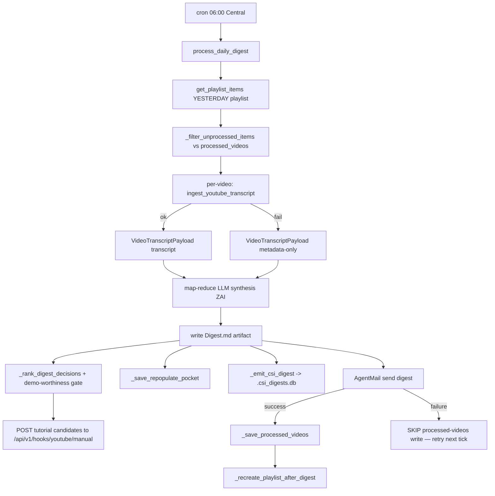

# YouTube CSI Flow

YouTube intelligence in Universal Agent is **two independent pipelines** that
both ingest YouTube but serve different purposes, store to **different
databases**, and share only a small amount of code (the transcript fetcher and
the learning-mode classifier). They are easy to conflate; the rest of this doc
keeps them strictly separate.

| | Pipeline A — Daily Digest (UA-native playlist watcher) | Pipeline B — CSI channel-RSS feed |
|---|---|---|
| Trigger | UA system cron `youtube_daily_digest` (06:00 Central) | External CSI ingester adapter writing `source='youtube_channel_rss'` |
| Source of videos | The operator's 7 day-of-week YouTube **playlists** (`<DAY>_YT_PLAYLIST`) | YouTube **channel Atom/RSS feeds** subscribed in CSI |
| Storage | `youtube_ingestion_state.db` (dedup) + `.csi_digests.db` (a digest record) | `csi.db` `events` + `rss_event_analysis` tables |
| Output | Map-reduce LLM digest emailed to operator + tutorial dispatch | Proactive-signal "cards" (cluster + diamond) on the dashboard |
| Code entry | `scripts/youtube_daily_digest.py::process_daily_digest` | `proactive_signals.py::generate_youtube_cards` |

Code-verified caveat: the manifest scope calls Pipeline A a "playlist watcher."
It is not a continuous watcher — it is a daily cron that *reads* a playlist
once each morning. The continuous discovery layer is the **gold-channel
poller** (below), which adds videos to those playlists from channel RSS the
night before, and is itself distinct from Pipeline B's CSI RSS feed.

---

## Pipeline A — Daily YouTube Digest

The flagship flow. The operator queues videos throughout the day into a
day-of-week playlist; the next morning the cron reads it, fetches transcripts,
synthesizes a digest, emails it, dispatches build-worthy videos to the tutorial
pipeline, and recreates the playlist empty for the next cycle.

### A.1 Day-shift convention (read this first)

`process_daily_digest` reads **yesterday's** playlist, not today's
(`youtube_daily_digest.py::process_daily_digest`):

```python
day_name = DAYS[(datetime.now() - timedelta(days=1)).weekday()]
playlist_id_var = f"{day_name}_YT_PLAYLIST"
```

Content queued Monday lives in `MONDAY_YT_PLAYLIST` and is summarized by the
Tuesday 06:00 run. A `--day MONDAY` override uses the literal value with no
shift, so manual reruns target an exact day.

### A.2 Cron registration

Registered idempotently at gateway boot
(`gateway_server.py::_ensure_youtube_daily_digest_cron_job`):

- Job key `youtube_daily_digest`, default cron `0 6 * * *`, timezone
  `America/Chicago` (`UA_YOUTUBE_DAILY_DIGEST_TIMEZONE`).
- Master kill switch `UA_YOUTUBE_DAILY_DIGEST_ENABLED` (default ON).
- Runs `!script universal_agent.scripts.youtube_daily_digest`.
- `required_secrets` includes all 7 `<DAY>_YT_PLAYLIST` IDs and the OAuth trio.

### A.3 Flow



### A.4 Transcript ingestion (`youtube_ingest.py`)

`ingest_youtube_transcript` is the shared fetcher used by both the digest loop
and the gateway `/api/v1/youtube/ingest` endpoint. Sequence:

1. **Metadata, API-first.** `_run_youtube_data_api_metadata` calls YouTube Data
   API v3 (`YOUTUBE_API_KEY`, ~2 KB JSON, no proxy). Fallback
   `_run_youtube_metadata_extract` runs yt-dlp **without** proxy (deliberately —
   never spend residential bandwidth on metadata).
2. **Pre-ingest triage gate** (`_should_skip_video_by_metadata`) — screens on
   free metadata *before* spending proxy bandwidth on the transcript:
   - duration `< 60s` (short/promo) or `>` cap (default 5400s = 90 min);
   - `category_id == "10"` (Music);
   - `live_broadcast_content in {live, upcoming}`.
   A `max_duration_seconds_override` raises the cap per-channel (e.g. Lex
   Fridman 3-hour interviews) — see gold overrides in A.6.
3. **Transcript fetch** via `youtube-transcript-api` through a **residential
   proxy** (`_run_youtube_transcript_api_extract`).
4. **Quality gate** (`_evaluate_transcript_quality`) — min-chars, low-info
   boilerplate detection, and repeated-line ratio.

Return dict carries `status` (`succeeded`/`failed`/`skipped`), `failure_class`,
`metadata`, and an `attempts` list.

### A.5 Residential proxy (the anti-bot core)

YouTube blocks transcript fetches from datacenter IPs (the VPS), so a
residential proxy is **required** in production. Provider routing in
`youtube_ingest.py::_build_proxy_config`:

- `PROXY_PROVIDER` (default `dataimpulse`) selects the builder.
- **DataImpulse** (`_build_dataimpulse_proxy_config`): `DATAIMPULSE_PROXY_USER`
  / `DATAIMPULSE_PROXY_PASS`, host `gw.dataimpulse.com`, rotating HTTP port
  `823`. Auto-appends `__cr.us` zone suffix for US targeting if the username
  has no `__` zone. `get_dataimpulse_usage_stats` hits the management API on
  port `777` for bandwidth/balance (not a proxy request).
- **Webshare** (`_build_webshare_proxy_config`): `PROXY_USERNAME`/`PROXY_PASSWORD`
  (or `WEBSHARE_*`), `WebshareProxyConfig`, host `p.webshare.io`, optional
  `PROXY_FILTER_IP_LOCATIONS`.

**IP-rotation retry (load-bearing).** Residential pools rotate egress IP per
connection; ~15-25% of pool IPs are pre-flagged by YouTube and fail
deterministically. The fetcher retries `UA_YOUTUBE_TRANSCRIPT_PROXY_RETRIES`
times (default **6**, raised from 3 after the 2026-05-21 incident where flagged
IPs caused 15/29 metadata-only fallbacks). Each retry opens a fresh
`YouTubeTranscriptApi` → new egress IP. At ~25% flag rate, 6 attempts ≈ 0.02%
all-fail probability.

No-proxy fallback is **disabled by default** (a VPS no-proxy attempt is a
guaranteed waste); enable with `UA_YOUTUBE_TRANSCRIPT_NOPROXY_FALLBACK=1` only on
a residential machine.

Failure-class reclassification: when proxy attempts return a mix of
`TranscriptsDisabled` and `RequestBlocked` for the same video, the real cause is
IP-block masquerading, so the final class is reclassified to `request_blocked`.

Gateway endpoint `/api/v1/youtube/ingest` defaults `require_proxy=True`
(`UA_YOUTUBE_INGEST_REQUIRE_PROXY`, set `0` only for local dev).

### A.6 Map-reduce synthesis (`UA_YOUTUBE_DIGEST_PIPELINE`)

Default pipeline is `map_reduce` (`single_call` kept for fallback/A-B). All LLM
calls route through the **ZAI proxy** (`_build_anthropic_client_for_zai` →
`https://api.z.ai/api/anthropic`) under the global `ZAIRateLimiter` with a
429/Fair-Usage-Policy (error 1313) retry loop.

- **Map step** (`_map_retell_videos` / `_retell_one_video`): one call per video
  produces a ~50%-length "Compressed Retelling" + a `per_video_classification`
  JSON block (`value_score` 0-100, `value_tier`, `code_implementation_prospect`,
  `concept_only`, `evidence_quality`). Model defaults to `glm-4.5-air`
  (`UA_YOUTUBE_DIGEST_MAP_MODEL`); concurrency 3
  (`UA_YOUTUBE_DIGEST_MAP_CONCURRENCY`) but effective parallelism is
  `min(semaphore, ZAI_MAX_CONCURRENT)`. The map LLM never sees other videos.
- **Reduce step** (`_reduce_meta_synthesize`): sees only titles + thesis lines +
  classifications (not full retellings), so context stays small on 30+ video
  days. Emits meta-synthesis prose ONLY (Cross-Video Themes / Learning Insights
  / Neglected Opportunities). Model tier `opus` → `glm-5.1`
  (`UA_YOUTUBE_DIGEST_REDUCE_MODEL`).
- **Assembly** (`_assemble_map_reduce_digest` / `_build_decisions_json_block`):
  the final `youtube_digest_decisions` ranked JSON is built **deterministically
  in Python** from the map classifications, not re-emitted by the reducer LLM
  (the LLM used to drop/malform it — see 2026-05-20 incident). H1 title is added
  by `process_daily_digest`.

Scoring rubric is inline in `RETELL_PROMPT` with anchored buckets + disqualifier
caps (sales-pitch/affiliate framing caps at 50; metadata-only caps at 30). This
was a response to score saturation (12/29 videos hitting 95). Tiers B-D
(rubric-to-file, labeled-outcomes store, rubric-tuner agent) are documented
inline but deferred.

### A.7 Tutorial dispatch (the demo-worthiness gate)

After ranking, `_select_tutorial_dispatch_candidates` applies a **deterministic
gate** (`_is_demo_worthy`) on top of the LLM's nomination — the LLM proposes,
code disposes:

- must have `code_implementation_prospect == True`;
- `evidence_quality != metadata_only`;
- `value_score >= UA_YOUTUBE_DIGEST_DEMO_GATE_MIN_SCORE` (default **70**);
- `value_tier not in {low, unknown}`.

Top-`UA_YOUTUBE_DIGEST_AUTO_TUTORIAL_TOP_N` (default 4) survivors are POSTed via
`_dispatch_tutorial_candidate` to `<gateway>/api/v1/hooks/youtube/manual`
(`UA_YOUTUBE_DIGEST_TUTORIAL_HOOK_URL` / `UA_GATEWAY_URL`, default
`http://127.0.0.1:8002`) with a `UA_HOOKS_TOKEN` bearer, `mode=explainer_plus_code`.
`--no-auto-tutorial-dispatch` sets top-n to 0.

### A.8 State, delivery-gated persistence, and playlist recreate

- **Dedup DB** `youtube_ingestion_state.db` table `processed_videos`
  (`PRIMARY KEY (video_id, day)`). `_filter_unprocessed_items` reads it before
  processing; `_save_processed_videos` writes after.
- **Delivery gate (critical):** if `email_to` is set and the email send fails,
  `process_daily_digest` **skips** the processed-videos write so the next cron
  tick retries the same videos. `email_to is None` is the intentional no-email
  mode (persistence proceeds). Dry-run skips all persistence.
- **Repopulate pocket** (`_save_repopulate_pocket`) snapshots playlist contents
  to `daily_digests/repopulate_pockets/<DAY>/` before cleanup;
  `repopulate_digest_playlist` (`--repopulate`) restores them.
- **Playlist recreate** (`_recreate_playlist_after_digest`,
  `UA_YOUTUBE_PLAYLIST_RECREATE_ENABLED` default ON): create-new-then-delete-old
  with the same title/description; persists the new ID to Infisical via
  `upsert_infisical_secret` **before** deleting the old playlist. Quota: ~101
  units flat vs `N*50` per-video delete. All failures non-fatal — the digest
  already succeeded.
- **CSI digest record** (`_emit_csi_digest`): writes one row to
  `.csi_digests.db` table `csi_digests` (`source='youtube_daily_digest'`) so the
  digest appears in the dashboard CSI Feed. This is **not** the `csi.db` of
  Pipeline B.
- Delivery reminder fan-out (`send_digest_delivery_reminder`) pings Telegram +
  dashboard after a successful send; failure there is non-fatal.

---

## Pipeline B — CSI channel-RSS feed (proactive-signal cards + convergence)

A separate flow that consumes YouTube **channel RSS** ingested into the CSI
database by an external CSI ingester adapter (the `csi-ingester` systemd
service; its adapter code lives outside `src/universal_agent/services/` and is
out of scope here). UA's role is to read those rows and synthesize dashboard
cards and convergence/ideation candidates.

### B.0 Shared config — `channels_watchlist.json`

Both pipelines read **one** config file, sliced by `tier`. This is the single
biggest conflation hazard.

- Production path `/var/lib/universal-agent/csi/channels_watchlist.json`
  (`api/routers/csi_watchlist.py::_DEFAULT_WATCHLIST_FILE`, override
  `CSI_YOUTUBE_WATCHLIST_FILE`). The gold poller reads its own copy via
  `UA_YOUTUBE_CHANNELS_WATCHLIST_PATH` (default `/opt/universal_agent/...`).
- Per-channel fields include `channel_id`, `channel_name`, `rss_feed_url`,
  `tier`, `duration_max_seconds_override`, and promotion-metric fields
  (`manual_add_count_30d`, `sidecar_approval_count_30d`,
  `last_promoted_to_gold_at`).
- RSS URL pattern (code-verified, `csi_watchlist.py`):
  `https://www.youtube.com/feeds/videos.xml?channel_id={channel_id}`.
- **Tiers:** `gold` = curated, feeds Pipeline A (gold poller → day playlists);
  `sidecar` = wide net, feeds Pipeline B convergence only; `blocked` = excluded.
  Promotion sidecar→gold is driven by the metric fields.

> [VERIFY: tier distribution (~gold=22 · sidecar=417 · blocked=4, ~443
> channels) and the `csi_source_liveness.py` "444-channel" comment are
> data/operational facts from the 2026-05-29 handoff; counts drift as the
> watchlist is edited. The `youtube_channel_rss` cadence is comment-documented
> at 12h liveness floor / "hourly-ish per channel" in
> `csi_source_liveness.py`.]

### B.1 Cards + convergence consumers

`proactive_signals.py::generate_youtube_cards` queries `csi.db`
(`CSI_DB_PATH`, default `/var/lib/universal-agent/csi/csi.db`):

```sql
SELECT e.event_id, e.occurred_at, e.subject_json,
       a.transcript_status, a.transcript_chars, a.category, ...
FROM events e
LEFT JOIN rss_event_analysis a ON a.event_id = e.event_id
WHERE e.source = 'youtube_channel_rss'
ORDER BY e.id DESC LIMIT ?
```

Shorts are filtered (`_is_short_subject`), then two card types are produced:
`_youtube_cluster_cards` (topics across multiple channels, scored against
`YOUTUBE_INTEREST_TERMS`) and `_youtube_diamond_cards` (high-score individual
videos). Alongside cards, `sync_generated_cards` (the same caller) invokes
`sync_topic_signatures_from_csi` and `sync_build_oriented_csi_videos`.
Playlist-source CSI events (`source='youtube_playlist'`) instead map to the
manual YouTube hook via `signals_ingest.py::to_manual_youtube_payload`.

The deeper Pipeline B consumer is **convergence/ideation**
(`services/proactive_convergence.py::sync_topic_signatures_from_csi`): it reads
the same `events WHERE source='youtube_channel_rss'` JOIN `rss_event_analysis`
and upserts one row per video into the `proactive_topic_signatures` corpus
(deduped by video_id). Two detection paths then run over that corpus —
concrete convergence (same story across ≥2 channels = salience reinforcement),
which writes candidates via `proactive_convergence.py::write_convergence_candidate`,
and `proactive_convergence.py::track_b_ideation_synthesis` (non-obvious
cross-cutting patterns) — producing `convergence_candidate` rows that route to
Atlas and the hourly Insight Digest. (Note: there is no single
`track_a_concrete_convergence` function — concrete convergence is the candidate-writer
path, not a named detector.) That convergence/ideation machinery is documented in the
proactive-pipeline and ClaudeDevs-intel docs; it is a downstream consumer of
this YouTube feed, not part of the YouTube ingestion code itself.

### B.1 Health invariants

The original incident: 100% of YouTube cards showed `transcript_status='missing'`
because the dashboard LEFT JOIN coalesced NULLs to "missing" when enrichment
hadn't written. Two heartbeat invariants now guard it
(`services/invariants/youtube_invariants.py`):

- `youtube_enrichment_coverage` — events exist but few have matching
  `rss_event_analysis` rows (enrichment not running / wrong table). Floor 50%,
  min 5 events.
- `youtube_transcript_coverage` — rows exist in `rss_event_analysis` but most
  carry `transcript_status != 'ok'`. Floor 50% per populated day (≥3 rows),
  7-day window.

`csi_source_liveness` separately checks `max(occurred_at)` freshness per source
in `csi.db`.

---

## Gold-channel poller (feeds Pipeline A's playlists)

`services/youtube_gold_channel_poller.py::poll_gold_channels` runs ~30 min
before the digest (cron `youtube_gold_channel_poller`, default `30 5 * * *`,
`UA_YOUTUBE_GOLD_POLLER_ENABLED` default ON). It bridges channel RSS into the
operator's manual-curation playlists:

1. Loads `channels_watchlist.json` (`UA_YOUTUBE_CHANNELS_WATCHLIST_PATH`, default
   `/opt/universal_agent/channels_watchlist.json`); processes only
   `tier == "gold"` channels.
2. Fetches each channel's Atom feed (`_fetch_rss_entries`, no auth/proxy needed).
3. Routes each new video to a playlist by the video's **published-at weekday in
   America/Chicago** (not today's weekday) — a Wednesday-11PM publish lands in
   `WEDNESDAY_YT_PLAYLIST`.
4. Dedup: drops if already in the target playlist OR already in
   `processed_videos` (reads the same `youtube_ingestion_state.db`,
   `UA_YOUTUBE_INGESTION_STATE_DB`).
5. Duration cap via YouTube Data API (free, no proxy): per-channel
   `duration_max_seconds_override` (`null`=global 5400s,
   `UA_YOUTUBE_GOLD_GLOBAL_DURATION_CAP`; `86400`=effectively unlimited). Unknown
   duration → skip conservatively.
6. Daily cap `UA_YOUTUBE_GOLD_DAILY_CAP` (default 10); candidates sorted
   newest-first across all channels so one channel's burst can't starve others.
   Lookback `UA_YOUTUBE_GOLD_LOOKBACK_HOURS` (default 30h).

Idempotent: re-running adds nothing (membership + processed checks
short-circuit). The same per-channel overrides are loaded by the digest itself
via `_load_gold_duration_overrides` so the digest's pre-ingest triage honors
them.

The watchlist `tier` field is the only consumer-visible tiering here:
`tier="gold"` = auto-poll into playlists. Other tiers are inert for the poller.

---

## YouTube playlist API (`services/youtube_playlist_manager.py`)

All playlist mutation goes through YouTube Data API v3 with **OAuth2** (user
data scope, not just an API key). `_get_access_token` exchanges
`YOUTUBE_OAUTH_REFRESH_TOKEN` (+ client id/secret) for a short-lived access
token on every call. Functions: `get_playlist_items` (paginated, returns
`video_owner_channel_id` for per-channel override lookup), `add_playlist_item`,
`remove_playlist_item`, `get_playlist_metadata`, `create_playlist` (50 units),
`delete_playlist` (50 units; 404 treated as success for idempotency).

---

## OAuth lifecycle (the recurring break)

The Google OAuth app is in **"Testing" mode**, so the refresh token expires
**~7 days** after minting. When it dies, both the digest and the gold poller
fail silently. Three components manage this (`services/youtube_oauth_health.py`):

- **Watchdog** (`scripts/youtube_oauth_watchdog.py`, cron
  `youtube_oauth_watchdog`, `0 7 * * *`): actively tests the refresh token
  (`test_refresh_token`) and computes age from the
  `YOUTUBE_OAUTH_REFRESH_TOKEN_MINTED_AT` stamp. State is `dead` (invalid_grant),
  `expiring` (age ≥ `UA_YOUTUBE_OAUTH_WARN_AGE_DAYS`, default 5d), or `healthy`.
  On `dead`/`expiring` it emails a one-tap re-auth button. A healthy token sends
  nothing. Exit code is always 0 (a noisy watchdog is worse than a quiet one).
- **Gateway endpoints** `/api/v1/youtube-oauth/start` (HMAC-signed link with TTL)
  and `/api/v1/youtube-oauth/callback` (signed `state` for CSRF) drive the
  email-button re-mint; `callback` writes the fresh token + minted-at back to
  production Infisical. HMAC secret precedence: `UA_ARTIFACT_ACK_SECRET` →
  `UA_OPS_TOKEN` → `UA_INTERNAL_API_TOKEN`.
- **CLI mint** `scripts/youtube_oauth2_setup.py` (localhost) for terminal re-auth.

Operator note (preserved from runbook + memory): Kevin defers publishing the
OAuth app to "In production" by choice; the watchdog + one-tap email button is
the accepted interim fix. The durable fix is publishing the app to remove the
7-day expiry. Re-auth account is `kevinjdragan@gmail.com`.

---

## Learning-mode classifier (shared)

`youtube_mode_utils.py::infer_youtube_mode` is the single source of truth for
whether a video is `explainer_plus_code` (code keywords present, non-code not
dominant) or `explainer_only`. Used by both the CSI signals ingest path and the
native playlist learning dispatch. Keyword sets: `YOUTUBE_CODE_HINT_KEYWORDS`
(python, mcp, api, docker, agent, …) vs `YOUTUBE_NON_CODE_HINT_KEYWORDS`
(recipe, travel, music, fitness, …).

---

## Environment variables (code-verified)

| Var | Default | Purpose |
|---|---|---|
| `UA_YOUTUBE_DAILY_DIGEST_ENABLED` | `1` | Digest cron kill switch |
| `UA_YOUTUBE_DAILY_DIGEST_CRON` | `0 6 * * *` | Digest schedule |
| `UA_YOUTUBE_DAILY_DIGEST_TIMEZONE` | `America/Chicago` | Digest TZ |
| `UA_YOUTUBE_DIGEST_PIPELINE` | `map_reduce` | `map_reduce` or `single_call` |
| `UA_YOUTUBE_DIGEST_MAP_MODEL` | `glm-4.5-air` | Map-step model |
| `UA_YOUTUBE_DIGEST_MAP_CONCURRENCY` | `3` | Map parallelism (capped by `ZAI_MAX_CONCURRENT`) |
| `UA_YOUTUBE_DIGEST_REDUCE_MODEL` | `opus`→`glm-5.1` | Reduce-step model |
| `UA_YOUTUBE_DIGEST_AUTO_TUTORIAL_TOP_N` | `4` | Tutorial dispatch count |
| `UA_YOUTUBE_DIGEST_DEMO_GATE_MIN_SCORE` | `70` | Demo-worthiness score floor |
| `UA_YOUTUBE_DIGEST_TUTORIAL_HOOK_URL` / `UA_GATEWAY_URL` | `http://127.0.0.1:8002` | Tutorial dispatch target |
| `UA_HOOKS_TOKEN` | — | Bearer for tutorial dispatch |
| `UA_YOUTUBE_PLAYLIST_RECREATE_ENABLED` | `1` | Recreate empty playlist after digest |
| `UA_YOUTUBE_INGEST_REQUIRE_PROXY` | `1` | Require proxy on gateway ingest endpoint |
| `UA_YOUTUBE_TRANSCRIPT_PROXY_RETRIES` | `6` | Fresh-IP transcript retries |
| `UA_YOUTUBE_TRANSCRIPT_NOPROXY_FALLBACK` | `0` | Last-resort no-proxy attempt |
| `PROXY_PROVIDER` | `dataimpulse` | `dataimpulse` or `webshare` |
| `DATAIMPULSE_PROXY_USER` / `_PASS` / `_HOST` / `_PORT` | host `gw.dataimpulse.com`, port `823` | DataImpulse creds |
| `PROXY_USERNAME` / `PROXY_PASSWORD` (`WEBSHARE_*`) | host `p.webshare.io` | Webshare creds |
| `YOUTUBE_API_KEY` | — | Data API v3 metadata (free quota) |
| `YOUTUBE_OAUTH_CLIENT_ID` / `_CLIENT_SECRET` / `_REFRESH_TOKEN` | — | Playlist OAuth |
| `YOUTUBE_OAUTH_REFRESH_TOKEN_MINTED_AT` | — | Token age stamp |
| `UA_YOUTUBE_OAUTH_WARN_AGE_DAYS` | `5` | Watchdog warn threshold |
| `UA_YOUTUBE_GOLD_POLLER_ENABLED` | `1` | Gold poller kill switch |
| `UA_YOUTUBE_GOLD_POLLER_CRON` | `30 5 * * *` | Gold poller schedule |
| `UA_YOUTUBE_GOLD_DAILY_CAP` | `10` | Max videos auto-added/day |
| `UA_YOUTUBE_GOLD_LOOKBACK_HOURS` | `30` | RSS lookback window |
| `UA_YOUTUBE_GOLD_GLOBAL_DURATION_CAP` | `5400` | Global duration cap (s) |
| `UA_YOUTUBE_CHANNELS_WATCHLIST_PATH` | `/opt/universal_agent/channels_watchlist.json` | Gold watchlist |
| `UA_YOUTUBE_INGESTION_STATE_DB` | `.../youtube_ingestion_state.db` | Dedup DB |
| `CSI_DB_PATH` | `/var/lib/universal-agent/csi/csi.db` | Pipeline B CSI DB |
| `<DAY>_YT_PLAYLIST` | — | 7 day-of-week playlist IDs (Infisical) |

---

## Gotchas (code-verified + operational)

- **State files do not cross pipelines.** Pipeline A's dedup is
  `youtube_ingestion_state.db` (`processed_videos`); Pipeline B's state is in
  `csi.db`. Resetting one does NOT reset the other.
  > [VERIFY: the gotcha inventory names a Pipeline-A state file
  > `youtube_playlist_watcher_state.json`. No such file is referenced anywhere
  > in `src/universal_agent/` today — the actual UA-native state is the
  > `processed_videos` SQLite table. Treat the JSON-file claim as stale.]
- **Transcript worker is VPS-only.** The desktop transcript worker was
  decommissioned (April 2026 per the gotcha inventory); all transcript fetching
  runs on the VPS via `youtube_ingest.py` with a residential proxy (DataImpulse
  default, Webshare failover).
- **ZAI content-safety (error 1301) silently drops buckets, fail-closed.** A
  large/sensitive bucket sent to the ZAI proxy can be dropped wholesale
  (observed 2026-05-29: a 29-video YouTube convergence bucket dropped).
  Accepted tradeoff — fail-closed, no retry/reroute; political/conflict
  convergences that trip the guardrail will not surface. This is a ZAI-proxy
  behavior upstream of the digest/convergence code, not handled in
  `youtube_daily_digest.py` itself.
- **Map-step model is hardcoded `glm-4.5-air`, not `resolve_model("haiku")`** —
  `resolve_model` points haiku at `glm-5-turbo` to dodge a historical preflight
  wedge; the digest deliberately bypasses that for the faster air model.
- **Decisions JSON is built in Python, not by the reducer LLM** — earlier the
  reducer was asked to re-emit it and would drop/malform it, silently producing
  all-zero classifications that rejected every video at the demo gate.
- **Email-failure gates the dedup write** — a failed digest email skips
  `_save_processed_videos` so videos retry next tick; never assume "digest ran"
  means "videos marked processed."

## Three databases — do not conflate

1. `csi.db` (`/var/lib/universal-agent/csi/csi.db`) — Pipeline B. Channel-RSS
   `events` + `rss_event_analysis`. Read by `generate_youtube_cards`.
2. `.csi_digests.db` (under workspaces dir) — Pipeline A's *digest record*
   table `csi_digests`, for dashboard CSI Feed visibility. Written by
   `_emit_csi_digest`. Distinct from #1.
3. `youtube_ingestion_state.db` (under workspaces dir) — Pipeline A's dedup
   ledger `processed_videos`. Shared by the digest and the gold poller.
