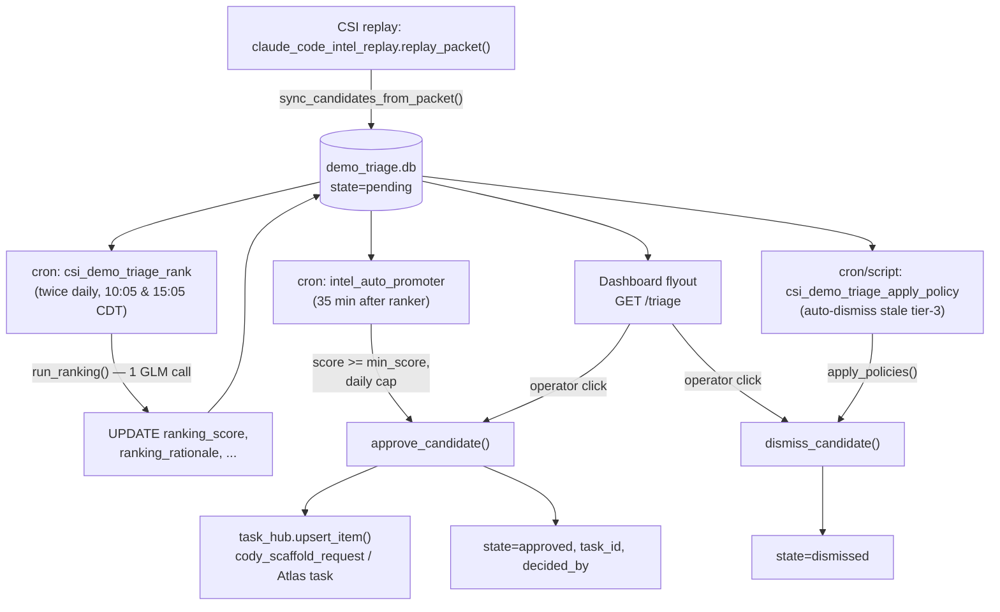

# Demo Triage

## What it is

Demo triage is the **single source of truth for every Claude Code intel (CSI) action awaiting a decision** before it becomes Task Hub work. It is a SQLite-backed candidate store plus a ranking layer plus an auto-dismiss policy engine. It replaces an older auto-queue path (`queue_follow_up_tasks` invoked from cron / backfill) that would have flooded Task Hub with ~120 historical candidates.

The core invariant, stated in `csi_demo_triage.py`'s module docstring: after this subsystem landed, the **only** sanctioned path from "a tweet was identified as tier ≥ 3" to "a Cody/Atlas task was created" is either the operator's Approve click in the dashboard flyout, or the auto-promoter cron (a controlled, capped, opt-out automation of that same click).

Candidates have three states: `pending`, `approved`, `dismissed` (`csi_demo_triage.py::STATE_PENDING` / `STATE_APPROVED` / `STATE_DISMISSED`).

## Storage

- **DB path:** `<artifacts>/proactive/claude_code_intel/demo_triage.db`, resolved by `csi_demo_triage.py::resolve_db_path` (uses `artifacts.resolve_artifacts_dir()` as the root). The directory is `mkdir(parents=True, exist_ok=True)`'d on resolve.
- **Table:** `demo_triage_candidates`, created idempotently by `csi_demo_triage.py::ensure_schema`. Primary key is `post_id`. Indexes: `idx_state_score (state, ranking_score DESC)`, `idx_first_seen (first_seen_at DESC)`, `idx_tier_state (tier, state)`.
- Every public function accepts an optional `conn` (caller-owned) or opens its own via `open_db` and closes it in a `finally`. `open_db` sets `row_factory = sqlite3.Row` and ensures schema.

Column set (see schema in `ensure_schema`): `post_id, handle, tier, action_type, post_url, post_text, summary, linked_sources_json, packet_dir, first_seen_at, state, task_id, decided_at, decided_by, ranking_score, ranking_rationale, ranking_evaluated_at, ranking_run_id`.

## End-to-end flow



### 1. Discovery (write into the store)

Wired in `claude_code_intel_replay.py::replay_packet` (near the end). Every replay calls `csi_demo_triage.py::sync_candidates_from_packet(packet_dir=...)`. This is **best-effort** — it is wrapped in a try/except so a triage-DB problem never breaks replay; on failure it records `triage_error` and sets `triage_inserted = 0`.

`sync_candidates_from_packet`:
- Loads actions via `_load_packet_actions` — prefers `actions_refined.json`, falls back to `actions.json`; reads `handle` from `manifest.json`.
- For each action, computes `tier = int(action["tier"])`. **Only tier ≥ 3 actions are inserted** (tier < 3 is skipped); actions with no `post_id` are skipped.
- `summary` comes from `_summarize_action`: prefers `classifier.reasoning` (truncated to 480 chars), else the raw `text` (240 chars).
- Inserts with `INSERT OR IGNORE` keyed on `post_id` and `state = 'pending'`, so re-syncing the same packet is idempotent. Returns `{"inserted": N, "skipped": M}` (skipped = rows already present).

### 2. Ranking (score the pending rows)

`csi_demo_triage_ranker.py::run_ranking` scores pending candidates with a **single LLM call**.

- **Selection** (`_select_candidates`): pending rows where `ranking_score IS NULL` OR `ranking_evaluated_at IS NULL` OR `ranking_evaluated_at < cutoff`, where cutoff = now − `rescore_after_hours` (default 24h). Ordered newest-first, capped at `max_candidates` (default 60). One LLM call covers all selected rows.
- **LLM call** (`_call_llm`): POSTs to `{ANTHROPIC_BASE_URL or https://api.z.ai/api/anthropic}/v1/messages` using `x-api-key` = `ANTHROPIC_AUTH_TOKEN` (falls back to `ANTHROPIC_API_KEY`). Model = `UA_CSI_DEMO_TRIAGE_MODEL`, default `glm-4.6`. `max_tokens=4096`, 90s timeout. Raises if no auth token. This is a ZAI/GLM call by default, not Anthropic-native.
- **Prompt** (`_RANK_SYSTEM_PROMPT`): scores 0–10 (one decimal) on CONCRETENESS, AUTHORITY, BUILDABILITY, NOVELTY. Tier-4 candidates (intel/analysis for Atlas, not demos) are weighted toward AUTHORITY/NOVELTY. The prompt instructs the model to be skeptical — default 3–6, reserve 8+ for clearly buildable/official/novel. Output is one JSON line per candidate: `{"post_id", "score", "rationale"}`.
- **Parsing** (`_parse_lines`): line-by-line; tolerates blank lines, ` ``` ` fences, and malformed JSON (logged + skipped). Requires both `post_id` and `score` keys.
- **Write-back**: score is clamped to `[0.0, 10.0]` and rounded to 1 decimal; rationale truncated to 1000 chars. Updates `ranking_score, ranking_rationale, ranking_evaluated_at, ranking_run_id` (run_id = `uuid4().hex[:16]`). Candidates the LLM did not return are counted as `skipped`.
- **Pacing** (`_pacing_ctx`): wraps the LLM call in `csi_llm_pacing.paced_llm_call(stage="demo_triage_rank")` if that module imports; falls back to a no-op `nullcontext` otherwise (the pacing module ships on a different branch).

Returns a `RankingResult` dataclass (`run_id, started_at, finished_at, candidates_scored, candidates_skipped, error`).

### 3. Decision (approve / dismiss / restore)

`csi_demo_triage.py` exposes three operator/automation decision verbs:

- **`approve_candidate(post_id, decided_by="kevin", ...)`** — the one bridge into Task Hub. It lazily imports `claude_code_intel._build_followup_task_payload` (lazy to avoid a heavy circular import on the simple read/dismiss paths), reconstructs an `action` dict from the stored row, builds the **canonical** Task Hub payload (byte-identical to the legacy auto-queue path), opens the activity DB (`durable.db.connect_runtime_db(get_activity_db_path())`) if no `task_hub_conn` was passed, calls `task_hub.upsert_item`, and stamps the row `state='approved', task_id, decided_at, decided_by`. Refuses (no mutation) if already approved/dismissed; returns `{"ok": False, "reason": "already_..."}`.
- **`dismiss_candidate(post_id, decided_by="kevin", ...)`** — stamps `state='dismissed', decided_at, decided_by`. No-op if already dismissed (`ok=True, noop=True`); **refuses if already approved**.
- **`restore_candidate(post_id, ...)`** — reverses a dismissal back to `pending` (clears `decided_at`/`decided_by`). Refuses if not currently dismissed (e.g. approved or already pending).

### Read API

- `list_candidates(state=?, tier=?, limit=?)` — newest-first by `first_seen_at`.
- `get_top_recommendations(n=5)` — top-scoring **pending** rows with non-null score, deduped by an extracted "feature key" (see Gotchas). Used for the dashboard Top-5 panel.
- `get_counts()` — dashboard chips: `pending, approved, dismissed, tier3_pending, tier4_pending, unranked_pending`.

## Auto-dismiss policy

`csi_demo_triage_policy.py` keeps the operator's queue short by conservatively dismissing stale, low-signal candidates. Background: a 2026-05-17 trace found 96 pending candidates burying the genuinely actionable ones.

- **`StaleTierPolicy`** dataclass: `name, tier, max_age_days, max_ranking_score (optional), decided_by`.
- **`DEFAULT_POLICIES`** ships exactly one: `stale-tier-3` — tier 3, older than 14 days, with `ranking_score <= 5.0 OR ranking_score IS NULL`. A NULL score is treated as "low signal" (the ranker never validated it).
- **Tier-4 candidates are NEVER auto-dismissed** by default — they always require operator eyes.
- **Auto-approve is intentionally NOT implemented in the policy engine.** Approving creates Task Hub work and burns ZAI quota; the failure mode (approving the wrong thing) is not worth automating here. (Auto-promotion *does* exist, but as a separate, capped, score-gated service — see below.)
- **Full audit trail:** every auto-dismiss stamps `decided_by = "auto-policy:<name>"`, so the dashboard, ledger, and `restore_candidate` can identify and reverse it.
- **`apply_policies(dry_run=True, ...)`** defaults to dry-run (reports what *would* change, mutates nothing). Pass `dry_run=False` to act. Returns a structured report (`actions_total`, `actions_applied`, `by_policy`, per-candidate `actions`).
- **Operator switch:** `policy_auto_apply_enabled()` reads `UA_CSI_TRIAGE_AUTO_POLICY_ENABLED` (default **False**). It only governs the would-be cron sweep when invoked with `--require-env-opt-in`; the script's `--apply` flag overrides it.

**Script:** `scripts/csi_demo_triage_apply_policy.py`. Dry-run by default; `--apply` to act; `--json` for machine output; `--require-env-opt-in` to defer to the env switch; `--age-days/--max-score/--tier/--policy-name` build a one-off override policy (`--tier 4` is for explicit operator-driven purges only). VPS usage:

```
cd /opt/universal_agent && PYTHONPATH=src uv run python \
    -m universal_agent.scripts.csi_demo_triage_apply_policy [--apply]
```

> [VERIFY: there is no `gateway_server` cron registration for `csi_demo_triage_apply_policy`. The policy engine is currently invoked only via the manual/operator script, not a registered system cron — the docstring describes a "would-be cron sweep" gated by the env var, but no `_ensure_*` helper registers it.]

## Auto-promotion (the automated Approve)

`intel_auto_promoter.py` automates the dashboard Approve click for high-confidence candidates so the pipeline doesn't stall overnight (7–9 high-confidence signals/day with no operator clicks).

`promote_top_candidates`:
- Selects pending rows with non-null `ranking_score`, highest score first, keeps those `>= min_score`.
- For each, calls the **canonical `csi_demo_triage.approve_candidate`** (same path as the dashboard) so the Task Hub row is identical to an operator approval.
- **Daily cap** is enforced by counting `state='approved'` rows whose `decided_by LIKE 'auto_promoter:%'` with `decided_at >= start-of-current-UTC-day`. The bound rolls forward at midnight UTC.
- `decided_by` is stamped `auto_promoter:score=<S>:run=<YYYY-MM-DD>` for end-to-end traceability.

Env gating:

| Env var | Default | Effect |
|---|---|---|
| `UA_INTEL_AUTO_PROMOTE_ENABLED` | `1` | Kill switch (checked in the cron script before running). |
| `UA_INTEL_AUTO_PROMOTE_MIN_SCORE` | `7.5` | Score threshold (0–10). |
| `UA_INTEL_AUTO_PROMOTE_DAILY_CAP` | `2` | Max promotions per UTC day. |
| `UA_INTEL_AUTO_PROMOTE_DRY_RUN` | `0` | Report-only mode. |

Safety rationale (from the module docstring): Cody's 1-concurrent VP cap and the persistent Task Hub queue mean a backlog of high-scored candidates drains at Cody's pace, not the promoter's.

## Cron registration

Both crons are registered at gateway startup via `gateway_server.py::_ensure_csi_demo_triage_rank_cron_job` and `_ensure_intel_auto_promoter_cron_job` (called together near `gateway_server.py`), using the canonical `_register_system_cron_job` helper.

| Cron | Default schedule (CDT via `America/Chicago`) | Command | Enable flag (default ON) | Schedule override |
|---|---|---|---|---|
| `csi_demo_triage_rank` | `5 10,15 * * *` (10:05 & 15:05) | `!script universal_agent.scripts.csi_demo_triage_rank` | `UA_CSI_DEMO_TRIAGE_RANK_CRON_ENABLED` | `UA_CSI_DEMO_TRIAGE_RANK_CRON_EXPR` / `..._TIMEZONE` |
| `intel_auto_promoter` | `35 10,15 * * *` (fires 30 min after ranker) | `!script universal_agent.scripts.intel_auto_promoter_cron` | `UA_INTEL_AUTO_PROMOTE_CRON_ENABLED` | `UA_INTEL_AUTO_PROMOTE_CRON_EXPR` / `..._TIMEZONE` |

Both are registered `lightweight=True` — pure SQL + (for the ranker) one direct `ANTHROPIC_BASE_URL/AUTH_TOKEN` LLM call. They bypass the heavyweight Composio tool-router bootstrap (this avoids per-tick noise when `COMPOSIO_API_KEY` is in flux). The ranker is opted INTO the Task Hub Observability Protocol (Ship 4) so its tick lifecycle is observable separately from the candidate rows it mutates. The ranker declares `required_secrets=["ANTHROPIC_BASE_URL", "ANTHROPIC_AUTH_TOKEN"]`. Schedules are inside the US off-peak / content-generation active window per the operating-hours policy.

> [VERIFY: the ranker docstring comment says "Twice-daily by default (13:15 and 19:15 UTC == 8:15 and 14:15 CDT)" but the actual `default_cron` is `"5 10,15 * * *"` with `default_timezone="America/Chicago"` — i.e. 10:05 and 15:05 *Chicago* time. The docstring's UTC/CDT example appears stale relative to the live cron expression. Trust the code.]

## Dashboard endpoints

All under `/api/v1/dashboard/claude-code-intel/triage` in `gateway_server.py`, gated by `_require_ops_auth`:

- `GET /triage` — returns `_triage_refreshed_payload()`: `get_counts()`, top-5 (`get_top_recommendations(n=5)`), and all rows (`list_candidates()`).
- `POST /triage/{post_id}/approve` — `approve_candidate(post_id, decided_by=...)`, returns the result plus a refreshed payload.
- `POST /triage/{post_id}/dismiss` — `dismiss_candidate(...)`.
- `POST /triage/{post_id}/restore` — `restore_candidate(...)`.
- `POST /triage/rerank` — calls `run_ranking()` synchronously (on-demand rerank button).

## Env-var / flag reference

| Flag | Default | Scope |
|---|---|---|
| `UA_CSI_DEMO_TRIAGE_MODEL` | `glm-4.6` | Ranker LLM model. |
| `ANTHROPIC_BASE_URL` | `https://api.z.ai/api/anthropic` | Ranker LLM endpoint base. |
| `ANTHROPIC_AUTH_TOKEN` (or `ANTHROPIC_API_KEY`) | — (required) | Ranker LLM `x-api-key`. |
| `UA_CSI_DEMO_TRIAGE_RANK_CRON_ENABLED` | `1` | Register the ranker cron. |
| `UA_CSI_DEMO_TRIAGE_RANK_CRON_EXPR` / `..._TIMEZONE` | `5 10,15 * * *` / `America/Chicago` | Override ranker schedule. |
| `UA_CSI_TRIAGE_AUTO_POLICY_ENABLED` | `false` | Gate the auto-dismiss policy sweep (with `--require-env-opt-in`). |
| `UA_INTEL_AUTO_PROMOTE_CRON_ENABLED` | `1` | Register the auto-promoter cron. |
| `UA_INTEL_AUTO_PROMOTE_ENABLED` | `1` | Auto-promoter runtime kill switch. |
| `UA_INTEL_AUTO_PROMOTE_MIN_SCORE` | `7.5` | Auto-promote score threshold. |
| `UA_INTEL_AUTO_PROMOTE_DAILY_CAP` | `2` | Auto-promote per-UTC-day cap. |
| `UA_INTEL_AUTO_PROMOTE_DRY_RUN` | `0` | Auto-promote report-only. |
| `UA_INTEL_AUTO_PROMOTE_CRON_EXPR` / `..._TIMEZONE` | `35 10,15 * * *` / `America/Chicago` | Override promoter schedule. |

## Code-observed gotchas

- **Tier gate is at discovery, not ranking.** Only tier ≥ 3 actions ever enter the store (`sync_candidates_from_packet`). Tier 1/2 actions are invisible to triage by design.
- **Ranker runs on GLM/ZAI by default**, not Anthropic-native — `ANTHROPIC_BASE_URL` defaults to `https://api.z.ai/api/anthropic`. The `x-api-key` header is the ZAI token despite the Anthropic-shaped variable name.
- **NULL ranking_score is "low signal" for dismissal** but **excludes the row from Top-5 and from auto-promotion** (both filter `ranking_score IS NOT NULL`). So an unranked candidate can be auto-dismissed by the stale-tier-3 policy but can never be auto-promoted until the ranker scores it.
- **Top-N dedup collapses by feature key, not by post.** `get_top_recommendations` uses `_extract_feature_key`: first a slash-command (`/ultrareview`), else a long flag (`--agent`), else `post:<post_id>`. Posts referencing the same command/flag collapse to the highest-scored representative; posts with no recognisable anchor each get their own slot (no silent drop). The regexes strip URLs first so URL path segments don't masquerade as slash-commands; min token length 3 avoids `/a` false positives.
- **Approve is one-way for the operator path.** `dismiss_candidate` refuses an approved row; `restore_candidate` only un-dismisses. There is no built-in "un-approve" — once a Task Hub row exists, reversal is a Task Hub concern, not a triage one.
- **`approve_candidate` opens the *activity* DB** (`get_activity_db_path()`), consistent with the project note that Task Hub assignments live in `activity_state.db`, not `runtime_state.db`.
- **Auto-dismiss daily cap is UTC-day based** (`_utc_today_start_iso`), not Houston-time — it rolls at UTC midnight, slightly out of phase with the Chicago-time crons.
- **The replay→triage sync is best-effort and swallows errors.** If the triage DB is wedged, replay still succeeds; watch `result["triage_error"]` rather than assuming candidates landed.
