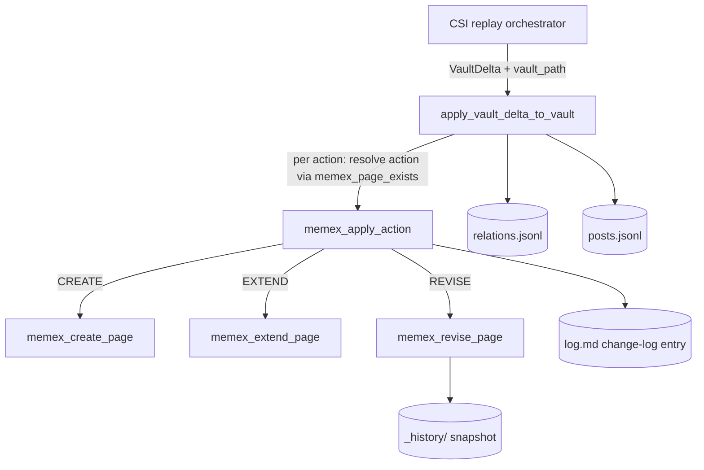

# LLM Wiki System

The LLM Wiki is a file-backed, Obsidian-style knowledge vault subsystem. It stores
durable knowledge as Markdown pages with YAML frontmatter, maintains derived index/
overview/log pages, and supports LLM-enriched ingestion, append-dominant "memex"
updates, index-first querying, and integrity linting. Two distinct vault families
exist: **external** knowledge vaults (research/ingest) and an **internal memory
projection** vault (derived from canonical UA memory, sessions, and checkpoints).

A separate, small **Knowledge Base (KB) registry** maps human-friendly slugs to
NotebookLM notebook IDs — it is unrelated to the Markdown vault except that both are
surfaced to agents as bridge tools.

All code lives under `src/universal_agent/wiki/`. Agent-facing tool wrappers live in
`src/universal_agent/tools/wiki_bridge.py` (vault) and `tools/kb_bridge.py` (KB
registry).

## Component map

| Module | Responsibility |
|---|---|
| `wiki/core.py` | Everything: vault creation, page IO, index/overview/log generation, query, lint, external ingest, memex CREATE/EXTEND/REVISE primitives, internal memory sync. (~1280 lines, the heart of the subsystem.) |
| `wiki/llm.py` | Semantic extraction layer — `extract_entities`, `extract_concepts`, `generate_summary` via a synchronous Anthropic/ZAI client, each with a heuristic fallback. |
| `wiki/projection.py` | One function, `maybe_auto_sync_internal_memory_vault` — env-gated auto-trigger of the internal sync. |
| `wiki/kb_registry.py` | JSON-backed slug→NotebookLM-notebook-ID registry. |
| `tools/wiki_bridge.py` | SDK `@tool` wrappers: `wiki_init_vault`, `wiki_sync_internal_memory`, `wiki_query`, `wiki_lint`. |
| `tools/kb_bridge.py` | SDK `@tool` wrappers: `kb_list`, `kb_get`, `kb_register`, `kb_update`. |
| `services/csi_intelligence_persistence.py` | The real production consumer of the memex primitives — translates CSI `VaultDelta` actions into `memex_apply_action` calls. |

## Vault layout on disk

`ensure_vault(kind, slug)` creates a directory tree and a set of "common" files. The
subdirectories differ by kind (`wiki/core.py::ensure_vault`):

```python
EXTERNAL_DIRS = ("raw", "sources", "entities", "concepts", "analyses", "assets", "lint", "_history")
INTERNAL_DIRS = ("evidence/memory", "evidence/sessions", "evidence/checkpoints",
                 "decisions", "preferences", "incidents", "projects", "threads", "analyses", "lint")
```

Common files written on init: `vault_manifest.json`, `AGENTS.md` (schema rules),
`log.md`, `index.md`, and a managed `overview.md` page. After init it always runs
`update_index` + `refresh_overview`.

Every managed page carries this required frontmatter (`REQUIRED_FRONTMATTER_FIELDS`):
`title, kind, updated_at, tags, source_ids, provenance_kind, provenance_refs,
confidence, status`. `_write_page` fills missing fields with empty defaults and always
stamps `updated_at` to "now". List-typed fields default to `[]`.

### Where the vault actually lives — and the `resolve_vault_path` collapse

`resolve_vault_path(vault_kind, vault_slug, root_override=None)` (`wiki/core.py`)
validates `vault_kind` ∈ {`internal`, `external`} and slugifies `vault_slug`, but then:

```python
if root_override:
    return Path(root_override).expanduser().resolve()
return Path(resolve_shared_memory_workspace()) / "memory" / "wiki"
```

Confirmed in current code (`wiki/core.py::resolve_vault_path`): **the
returned path ignores both `vault_kind` and `vault_slug` unless `root_override` is
supplied.** Every `ensure_vault`/`query_vault`/`lint_vault`/`sync_internal_memory_vault`
call without an explicit `root_override` resolves to the **single shared path**
`<shared-memory-workspace>/memory/wiki`. An "internal" and an "external" vault, and
any two different slugs, all collide onto the same directory. The slug/kind are still
used to *select which subdirectories get created* and to validate input, but they do
NOT partition storage. Callers that need isolation MUST pass `root_override`.

The shared memory workspace root is `resolve_shared_memory_workspace()`
(`memory/paths.py`): default `<repo-root>/Memory_System/ua_shared_workspace`,
overridable via `UA_SHARED_MEMORY_DIR`.

Consequence in practice: the CSI persistence path (the real production writer) does
NOT route through `resolve_vault_path` at all — it passes an explicit `vault_path: Path`
straight into the memex primitives (`csi_intelligence_persistence.apply_vault_delta_to_vault`).
So the collapse primarily affects the SDK-tool surface (`wiki_init_vault`, `wiki_query`,
`wiki_lint`, `wiki_sync_internal_memory`), where omitting `root_override` silently
funnels every vault to the same directory.

### External vaults live under `knowledge-vaults/` — but only via `root_override`

The real per-slug external-vault layout that the rest of the system relies on is
`<artifacts-dir>/knowledge-vaults/<vault_slug>/` (e.g.
`artifacts/knowledge-vaults/claude-code-intelligence/`). This path is **not** produced by
`resolve_vault_path` — it is computed by the CSI/intel consumers themselves
(`resolve_artifacts_dir() / "knowledge-vaults" / slug`, see
`claude_code_intel_replay.py`, `backfill_v2.py`, `vault_contradiction_lint.py`,
`dependency_currency_sweep.py`, etc.) and threaded into the wiki engine as
`root_override` (for `wiki_ingest_external_source`) or as an explicit `vault_path` (for
the memex primitives). For example, CSI ingest calls
`wiki_ingest_external_source(..., root_override=str(vault_root))` where
`vault_root = resolve_artifacts_dir() / "knowledge-vaults" / KB_SLUG`.

> **Legacy-doc correction:** older docs stated external vaults resolve to
> `UA_LLM_WIKI_ROOT/<slug>/` or `UA_ARTIFACTS_DIR/knowledge-vaults/<slug>/` automatically.
> `UA_LLM_WIKI_ROOT` is **not referenced anywhere in the current code**, and the
> `knowledge-vaults/<slug>/` convention is enforced by the *callers*, not by
> `resolve_vault_path`. The wiki engine itself has no default external-vault location
> other than the collapsed `<shared-memory>/memory/wiki`.

## External ingest flow

`wiki_ingest_external_source(vault_slug, source_title, source_content, source_id=None,
root_override=None, facets=None, defer_index=False)` (`wiki/core.py`):

1. `ensure_vault("external", vault_slug, ...)`.
2. Resolve facets: when `facets is None`, run per-source LLM extraction
   (`extract_entities`, `extract_concepts`, `generate_summary` — 3 calls); when a
   caller supplies precomputed `facets` (`{entities, concepts, summary}`), use them
   and skip the per-source LLM fan-out entirely.
3. Build a `source` page (frontmatter `provenance_kind="external_ingest"`, tags =
   `["external", *entities, *concepts]`, `source_ids=[source_id]`, `summary=...`).
4. Write to `sources/<slug>.md`. Then `update_index` + `refresh_overview` **unless**
   `defer_index=True` (a batch driver does one final rebuild instead of one per
   source; `ensure_vault` still refreshes on each call).

`source_id` defaults to `ext_<timestamp>`. The slug is derived from the first 50 chars
of the title.

### Batched packet ingest (`claude_code_intel_replay.py::ingest_packet_into_external_vault`)

The CSI report ingest is the high-volume caller — a packet fans out over posts +
work-products + linked sources, each previously firing **3** LLM calls
(`extract_entities` + `extract_concepts` + `generate_summary`), i.e. `3·N` calls per
packet. `ingest_packet_into_external_vault` now **collects** all source specs first
(preserving the tier-1 min-signal gate and the linked-source canonical-target dedup),
calls `wiki/llm.py::extract_facets_batched` once to batch the extraction, then writes
each page with the precomputed `facets` and `defer_index=True`, and rebuilds the index
once. This collapses `3·N → 2·⌈N/B⌉` LLM calls (`B` = `UA_WIKI_EXTRACT_BATCH_SIZE`,
default 20 → ~30× fewer calls at N=20). Kill-switch `UA_WIKI_INGEST_BATCHED=0` reverts
to per-source extraction (the collect→write→index-once restructure is behavior-
equivalent either way; only the LLM-call shape changes). On any batch failure the
write phase falls back to per-source extraction, so a bad batch never drops a source.

Production callers: `services/claude_code_intel_replay.py` (CSI report ingest) and the
`src/universal_agent/scripts/nightly_wiki_agent.py` script. The proactive-signals "Create Wiki" action also
instructs the `notebooklm-operator` sub-agent to finish by calling
`wiki_ingest_external_source`.

## Memex update primitives (append-dominant maintenance)

This is the maintenance contract for entity/concept pages (`wiki/core.py`, the
"Memex update primitives" block). Three actions:

| Action | Function | Behavior |
|---|---|---|
| `CREATE` | `memex_create_page` | Write a new page. **Raises `FileExistsError`** if the page already exists. |
| `EXTEND` | `memex_extend_page` | Append a dated `## [YYYY-MM-DD] <label>` section. Old content untouched; `source_ids`/`provenance_refs` accumulate. **Raises `FileNotFoundError`** if the page is missing. |
| `REVISE` | `memex_revise_page` | The ONLY action that overwrites prior content. Snapshots the current page into `_history/` first, then rewrites. **Requires a non-empty `reason`** (else `ValueError`); stores it as `last_revision_reason`. Returns `(page_path, snapshot_path)`. |

`memex_apply_action(...)` is the dispatcher. It routes to the right primitive AND always
appends a structured audit entry to `log.md` via `memex_append_change_log`:

```
## [<iso>] <page_rel_path> <ACTION>
reason: <reason>
confidence: <confidence>
sources: [<id1>, <id2>, ...]
```

Page paths are resolved by `_memex_page_path(vault_path, kind, name)` →
`<vault>/<entities|concepts>/<slugified-name>.md`. Only `kind ∈ {entity, concept}` is
supported (`MEMEX_KIND_TO_DIR`); anything else raises `ValueError`.

The expected per-ingest distribution (documented in the code comment, sourced from
`docs/proactive_signals/claudedevs_intel_v2_design.md §4`) is roughly **80% CREATE /
15% EXTEND / 5% REVISE** — REVISE is rare because new announcements usually introduce
new features rather than overturn prior claims.

History snapshots are timestamped Markdown files under
`_history/<entities|concepts>/<slug>/<ISO>.md` (`memex_snapshot_to_history`), making any
REVISE auditable and one `cp` away from rollback.

### CSI persistence bridge

`services/csi_intelligence_persistence.py` is the production wiring: it takes a
`VaultDelta` of `VaultAction`s, resolves CREATE-vs-EXTEND-vs-REVISE per action (using
`memex_page_exists` to auto-downgrade/upgrade/redirect), then calls `memex_apply_action`
for each. It also writes side-channel logs into the vault root: `relations.jsonl` and
`posts.jsonl`. It receives the vault root as an explicit `vault_path: Path` argument
(set by the CSI replay orchestrator), bypassing `resolve_vault_path`.



## Internal memory projection

`sync_internal_memory_vault(vault_slug="internal-memory", trigger="manual",
root_override=None)` (`wiki/core.py`) builds a derived, read-only projection of UA's
canonical memory. It is explicitly NOT a source of truth for resumability/runtime state
(`AGENTS.md` schema text says so).

Sources discovered and copied into `evidence/`:

- **Memory** — `MEMORY.md` plus the most-recently-modified `memory/*.md` files
  (excluding `index.md`/`MEMORY.md`), capped at `MAX_INTERNAL_MEMORY_FILES = 12`.
- **Sessions** — newest `memory/sessions/*.md`, capped at `MAX_INTERNAL_SESSION_FILES = 12`.
- **Checkpoints** — `run_checkpoint.json`/`session_checkpoint.json` from the newest
  `AGENT_RUN_WORKSPACES/` workspaces (via `list_workspace_summaries`), capped at
  `MAX_INTERNAL_CHECKPOINTS = 12`.

Copying is **fingerprint-gated**: each source's SHA-256 is compared against
`sync_state.json::source_fingerprints`; unchanged files are skipped (counted in
`skipped_counts`). Text files are read with a `MAX_EVIDENCE_TEXT_CHARS = 20000`
truncation cap (`_read_text_limited`); JSON is round-tripped.

After copying, it compiles four+ derived "ledger" pages by keyword-scanning the evidence
(NOT via LLM — this layer is pure Python keyword extraction):

- `decisions/decision-ledger.md` (keywords: decided, chose, selected, using, switched to)
- `preferences/preferences-ledger.md` (prefer, want, avoid, like, need)
- `incidents/incidents-ledger.md` (incident, error, failed, failure, broken, regression, crash)
- `threads/recent-threads.md` (from checkpoint `original_request`)
- `projects/project-memory.md` (counts summary)

Checkpoint JSON also contributes `key_decisions` → decisions and `failed_approaches` →
incidents. Each ledger is capped at 30 entries.

Progress is streamed to `sync_progress.json` + `sync_progress.md` per phase
(`discover_sources_ms`, `copy_memory_ms`, `copy_sessions_ms`, `copy_checkpoints_ms`,
`compile_ledgers_ms`, `finalize_ms`), and final state is persisted to `sync_state.json`.

### Auto-sync triggers

`maybe_auto_sync_internal_memory_vault(trigger)` (`wiki/projection.py`) is the env-gated
entry point. It returns `None` (no-op) unless **both**:

- `UA_LLM_WIKI_AUTO_SYNC_INTERNAL` is truthy (default **False**), AND
- `UA_LLM_WIKI_ENABLE_INTERNAL_PROJECTION` is truthy (default **True**).

It swallows all exceptions (logs `internal_memory_wiki_auto_sync_failed`) so it can never
break the calling memory-write path. Known callers:

- `session_checkpoint.py` → trigger `session_checkpoint_save`
- `memory/orchestrator.py` → triggers `sync_session`, `capture_session_rollover:<trigger>`
- `memory/memory_store.py` → trigger `append_memory_entry`

> Note: the projection module reads its env vars directly (`_env_truthy`), whereas
> `feature_flags.py` exposes parallel helpers (`llm_wiki_auto_sync_internal`,
> `llm_wiki_internal_projection_enabled`, `llm_wiki_external_vault_enabled`) that ALSO
> honor `UA_DISABLE_*` kill switches. The projection auto-sync path does NOT consult the
> `feature_flags` helpers, so the `UA_DISABLE_LLM_WIKI_AUTO_SYNC_INTERNAL` /
> `UA_DISABLE_LLM_WIKI_INTERNAL_PROJECTION` kill switches do not affect the
> auto-sync trigger — they only affect callers that go through `feature_flags`.

## Query

`query_vault(...)` (`wiki/core.py`) is **index-first, keyword-scored** — no LLM at query
time. It tokenizes the query, scores each `index.md` entry by term frequency, opens the
top-scoring pages, and extracts the best matching line as a snippet (`_best_snippet`,
falling back to `generate_summary`). With `save_answer=True` it persists an `analysis`
page under `analyses/`, adds backlinks into matched pages under a "Related Analyses"
section, and refreshes index/overview/log.

## Lint

`lint_vault(...)` scans all managed pages (excluding `raw/`, `evidence/`, and common
files) and emits findings of these kinds:

`malformed_frontmatter`, `missing_index_entry`, `missing_source_ids` (non-source pages
with no `source_ids`), `stale_provenance_ref` (a non-URL ref that doesn't exist on disk),
`broken_wikilink`, `missing_asset_reference`, `contradiction_candidate` (body contains
markers like "contradict", "however", "in contrast"), and `orphan_page` (no inbound
`[[wikilinks]]`, excluding `source`/`overview` pages).

Reports are timestamped under `lint/lint_<timestamp>.md`; the result also returns the
structured findings list and count.

## Semantic extraction layer (`wiki/llm.py`)

`extract_entities`, `extract_concepts`, `generate_summary` each call a synchronous
Anthropic client built by `_get_anthropic_client()`:

- API key resolution order: `ANTHROPIC_API_KEY` → `ANTHROPIC_AUTH_TOKEN` → `ZAI_API_KEY`.
- `ANTHROPIC_BASE_URL` is honored if set (this is the ZAI emulation hook — autonomous UA
  context routes these to ZAI/GLM by design).
- Model (2026-06-13): the bounded **extraction** stages `extract_entities` /
  `extract_concepts` pass `model=_extract_model()` → **sonnet** (`glm-5-turbo`,
  env-overridable via `UA_WIKI_EXTRACT_MODEL`); they previously fell through to
  `_call_llm`'s `resolve_opus()` default (`glm-5.1`, the flagship / most
  Fair-Usage-throttled tier) unnecessarily for a structured bounded-output task.
  `generate_summary` keeps the `resolve_opus()` default (`glm-5.1`) — it is generative
  and quality-sensitive.
- `max_tokens=2048`. Input text is truncated to the first 4000 chars.

**Every function fails gracefully to a heuristic.** If the LLM call raises (no key,
import error, network), `extract_entities` falls back to title-case regex word
extraction (limit 5, `wiki/llm.py::_heuristic_entities`), `extract_concepts` returns
`[]`, and `generate_summary` returns the first sentence (truncated to ~200 chars,
`wiki/llm.py::_heuristic_summary`). This means ingest never hard-fails on LLM
unavailability — it just produces lower-quality metadata.

### Batched extraction (`wiki/llm.py::extract_facets_batched`)

For the high-volume packet path, `extract_facets_batched(sources)` (where each source
is `{source_id, text}`) collapses the per-source 3-call fan-out into **two** batched
structured calls per chunk of `UA_WIKI_EXTRACT_BATCH_SIZE` (default 20): one
**sonnet** call (`model=_extract_model()`) returning `{entities, concepts}` per source,
and one **opus** call (`model=resolve_opus()`) returning `{summary}` per source —
`3·N → 2·⌈N/20⌉`. The tiers are split deliberately so summary generation keeps its
opus tier (it is generative/quality-sensitive) instead of being silently downgraded;
batching also collapses those throttle-fragile opus *calls*. It runs over the shared
`services/batched_judge.py::batched_judge` helper (chunking, verdict-array-by-index,
one-shot FUP breaker, fail-closed). Any per-source/per-facet failure falls back to the
**same** `_heuristic_entities` / `[]` / `_heuristic_summary` fallbacks as the
per-source path, so a bad batch never drops a source. It is a synchronous wrapper
(`asyncio.run`) that degrades to per-source extraction if called inside a running event
loop (the CSI replay chain is synchronous today, so this is a defensive fallback).

## Knowledge Base registry (`wiki/kb_registry.py`)

A small JSON store at `<artifacts-dir>/knowledge-bases/kb_registry.json`
(`resolve_artifacts_dir()` → default `<repo-root>/artifacts`). It is **completely
separate** from the Markdown vault. Each entry: `{notebook_id, title, created_at,
source_count, last_queried, tags}`, keyed by slug. `register_kb` preserves `created_at`/
`source_count`/`last_queried` on overwrite. Exposed as `kb_list`/`kb_get`/`kb_register`/
`kb_update` SDK tools (`tools/kb_bridge.py`). `remove_kb` exists in the registry module
but is NOT exposed as a tool.

The KB registry is the NotebookLM half of the "Create Wiki" proactive-signal action:
the `notebooklm-operator` sub-agent creates an NLM notebook, generates artifacts,
registers the KB via `kb_register`, then ingests the report into the Markdown vault via
`wiki_ingest_external_source`.

### Source grounding (anti-drift)

The wiki must be about the topic that was actually requested, not an unrelated entity
that merely shares a keyword/proper noun. The NLM research step (`research_start` →
`research_import`) is the drift surface: a bare ambiguous query (e.g. `"Olympus Protocol"`)
can match unrelated same-name entities, and a blanket "import all discovered sources" then
pollutes the studio synthesis. The grounding contract — enforced in the prompts of all three
callers: the canonical executor `.claude/agents/notebooklm-operator.md` ("Source Grounding &
Disambiguation"), the nightly objective in `nightly_wiki_agent.py`, and the `create_wiki`
action descriptions in `proactive_signals.py::_youtube_actions` / `::_discord_actions` — is:
(1) add the provided primary source as the **anchor** (ground truth); (2) **disambiguate**
the research query with the anchor's distinguishing context; (3) **import selectively** —
`nlm research import --cited-only` (or `--indices` / MCP `source_indices=[...]`), dropping
sources about a different entity sharing the name; import-all is reserved for an unanchored,
unambiguous topic.

## Agent tool surface

Registered in `tools/internal_registry.py`:

- Vault: `wiki_init_vault`, `wiki_sync_internal_memory`, `wiki_query`, `wiki_lint`.
  (`wiki_ingest_external_source` and the memex primitives are NOT exposed as SDK tools —
  they are called from Python service code only.)
- KB: `kb_list`, `kb_get`, `kb_register`, `kb_update`.

In `durable/classification.py`, `wiki_init_vault` and `wiki_ingest_external_source` are
classified `"local"`, and `wiki_query` appears in the local-tool set — meaning these run
in-process rather than as durable/remote operations.

## Runtime surfaces beyond the SDK tools

- **Skill `llm-wiki-orchestration`** (`.claude/skills/llm-wiki-orchestration/SKILL.md`)
  is the operator/agent entry point: triggers on "wiki", "knowledge base/vault",
  "build a wiki about", "what does our wiki say about", etc. It orchestrates the
  NotebookLM-backed flow (notebook → research → register KB → ingest into vault).
- **Nightly Wiki cron** — `src/universal_agent/scripts/schedule_nightly_wiki.py`
  registers job `nightly_wiki` (`WIKI_JOB_ID`) with cron expr `15 3 * * *` (3:15 AM
  Houston) whose command is `!script universal_agent.scripts.nightly_wiki_agent`
  (`src/universal_agent/scripts/nightly_wiki_agent.py`), which selects proactive-signal
  cards, builds NLM-backed KBs, and writes `nightly_wiki_<date>.md` under
  `<artifacts>/nightly_wikis/` for the morning briefing. (The same script also registers
  the morning-briefing job at `30 6 * * *`.)
- The legacy-referenced `wiki-maintainer` sub-agent **no longer exists** in
  `.claude/agents/` — do not expect it.

## Gotchas

- **`resolve_vault_path` ignores kind+slug without `root_override`.** See the dedicated
  section above. The single most important behavior to internalize: SDK-tool vault calls
  without `root_override` all collide onto `<shared-memory>/memory/wiki`.
- **`memex_create_page` raises on an existing page**; `memex_extend_page` raises on a
  missing one. Callers must check `memex_page_exists` first (the CSI bridge does).
- **REVISE requires a non-empty `reason`** or it raises `ValueError`. `memex_apply_action`
  papers over an empty reason with a placeholder `"(no reason supplied …)"` so it won't
  crash, but the audit log will show the placeholder.
- **Auto-sync is OFF by default** (`UA_LLM_WIKI_AUTO_SYNC_INTERNAL` default False) and is
  best-effort (swallows all exceptions).
- **Internal-sync ledgers are pure keyword extraction, not LLM synthesis.** Only ingest
  (entities/concepts/summary) uses the LLM. Do not assume the internal projection
  "understands" memory — it greps for trigger words.
- **LLM extraction silently degrades to heuristics** with no error surfaced to the
  caller — entity/concept quality drops when the model is unavailable, but ingest
  "succeeds".
- **Caps everywhere**: 12 each for memory/session/checkpoint sources, 30 per ledger,
  20000 chars per evidence file, 4000 chars per LLM extraction input. Large corpora are
  truncated, not chunked.
- **`feature_flags` kill switches don't gate the projection auto-sync path** — that path
  reads env vars directly. See the auto-sync note above.
- **The nightly_wiki cron may not be in the live runtime store.** A 2026-04-18 audit
  found the runtime cron store (`AGENT_RUN_WORKSPACES/cron_jobs.json`) differs from
  `schedule_nightly_wiki.py`'s default workspaces dir, so the nightly wiki / proactive
  reports were not registered in the live runtime store.
  > [VERIFY: confirm against the live VPS cron store; this is a historical operational
  > finding, not a code-verified guarantee.]
