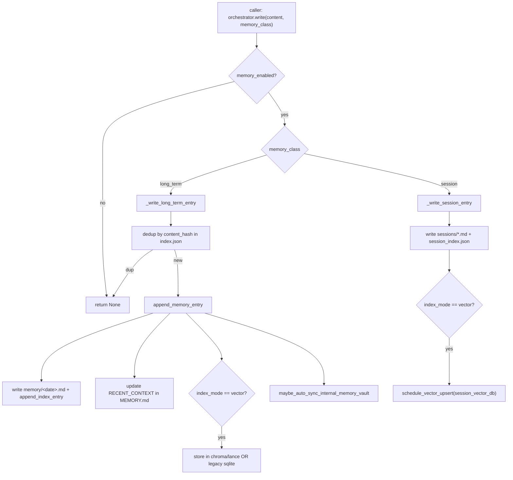

# Memory System

The memory subsystem gives Universal Agent durable, cross-session recall. It
persists agent context to plain Markdown files plus JSON indexes on disk, and
optionally mirrors those entries into a vector store for semantic retrieval.
Everything is workspace-rooted: a `MEMORY.md` file and a `memory/` directory
hold the canonical artifacts, and a thin orchestrator (`MemoryOrchestrator`)
fronts all reads/writes.

The whole package lives under `src/universal_agent/memory/`. The public entry
point for callers is `get_memory_orchestrator(workspace_dir)`.

## Two memory classes

The system distinguishes two kinds of memory, selected by the `memory_class`
argument on `MemoryOrchestrator.write`:

| Class | Where it lands | Index | Vector DB | Purpose |
|---|---|---|---|---|
| `long_term` (default) | `memory/<YYYY-MM-DD>.md` (daily append) | `memory/index.json` | `memory/vector_index.sqlite` (legacy) or `memory/chromadb` / `memory/lancedb` | Durable facts, decisions, pre-compaction flushes |
| `session` | `memory/sessions/<session>_<date>.md` | `memory/session_index.json` | `memory/session_vector_index.sqlite` | Indexed transcript slices for cross-session search |

There is no automatic eviction or aging between the two — `session` and
`long_term` are parallel stores searched independently and merged at query time.

## On-disk layout

`memory_store.ensure_memory_scaffold(workspace_dir)` creates and returns a
`MemoryPaths` describing the canonical layout (it is idempotent and called on
every orchestrator init):

```
<workspace_dir>/
  MEMORY.md                         # human-readable; holds a RECENT_CONTEXT section
  memory/
    index.json                      # long-term entry index (lexical search source)
    <YYYY-MM-DD>.md                 # daily long-term entries (markdown)
    vector_index.sqlite             # legacy hash-embedding vector store (long-term)
    session_index.json              # session entry index
    session_vector_index.sqlite     # session vector store
    .session_sync_state.json        # per-transcript size/line watermark for delta sync
    sessions/                       # per-session markdown slices
    research/index.json             # empty index pre-seeded for research artifacts
    chromadb/  | lancedb/           # real semantic backend (when provider != sqlite)
```

`MEMORY.md` is more than a log: `update_recent_context_section` keeps a
`## [RECENT_CONTEXT]` section at the bottom in sync with the 10 most-recent index
entries (`memory_store._upsert_section`). This is what gets injected into agent
prompts.

## The workspace root is the *shared* workspace, not the run dir

This is the single most important operational fact. Callers do **not** pass the
per-run workspace to the orchestrator — they first resolve a shared workspace so
memory accumulates across sessions:

```python
shared_memory_dir = resolve_shared_memory_workspace(workspace_dir)
broker = get_memory_orchestrator(workspace_dir=shared_memory_dir)
```

`paths.resolve_shared_memory_workspace` returns `<repo>/Memory_System/ua_shared_workspace`
by default, overridable via the `UA_SHARED_MEMORY_DIR` env var (relative values
are anchored to the repo root). So in production all the durable Markdown/index
files live under `Memory_System/ua_shared_workspace/memory/`, **not** inside a
transient run workspace. If you `find` for memory artifacts, look there.

`MemoryOrchestrator._resolve_workspace_dir` independently falls back through
`AGENT_WORKSPACE_DIR` → `CURRENT_RUN_WORKSPACE` → `CURRENT_SESSION_WORKSPACE` →
`UA_WORKSPACE_DIR` → `os.getcwd()` when no explicit dir is given. The
`memory_get`/`memory_search` tools use `AGENT_WORKSPACE_DIR` (not the shared
dir), so the tool's view of memory depends on that env var being set to the
shared workspace.

`get_memory_orchestrator` caches one orchestrator per resolved path in the
module-level `_BROKERS` dict.

## Write flow



Key points verified in code:

- **Dedup is content-hash based.** `memory_index._content_hash` is a SHA-256 of
  the entry content. Long-term writes reject any entry whose hash already exists
  in `index.json`; session/index writes additionally key on `(content_hash,
  file_path)`.
- **Long-term entries are truncated to the last 4000 chars** by
  `append_memory_entry(max_chars=4000)` before being written.
- **Summaries are auto-generated** if absent (`_summarize_content`, ~240-char
  whitespace-collapsed truncation). A coarse `_detect_category` heuristic
  (preference/decision/entity/fact/other) tags entries going into the real
  vector backends.
- Every successful write best-effort calls
  `wiki.projection.maybe_auto_sync_internal_memory_vault` (failures swallowed) so
  the Obsidian/wiki projection stays current.

## Search / retrieval flow

`MemoryOrchestrator.search(query, limit, sources, direct_context)`:

1. Gated by `memory_enabled`. If `memory_scope == "direct_only"` (the default)
   and the caller passes `direct_context=False`, search returns nothing.
2. Sources default to `("memory", "sessions")`; filtered to that allowed set and
   `sessions` dropped if `memory_session_enabled` is false.
3. Long-term and session sub-searches run independently, then `_merge_hits`
   dedupes and sorts by `(score, timestamp)` descending, capping at `limit`.

Each sub-search follows the `memory_retrieval_strategy`. Note: that flag is a
**compatibility stub that always returns `"semantic_first"`** regardless of the
`UA_*` env var — the `lexical_only` branch in the code is currently unreachable
through normal config.

`semantic_first` behavior (`_search_long_term` / `_search_session`):

- Run `_semantic_search` first. If it returns hits, those win and lexical is
  skipped entirely.
- Otherwise fall back to `memory_index.search_entries` (lexical token-count
  scoring over summary/preview/tags in the JSON index).
- Hits carry `provider`/`model`/`fallback` markers; lexical hits are flagged
  `fallback=True, provider="lexical", model="fts"`.

`_semantic_search` itself has two layers:

1. The **legacy SQLite hash-embedding store** (`memory_vector_index.search_vectors`
   over `vector_index.sqlite` / `session_vector_index.sqlite`). This is a
   128-dim deterministic hashing embedding (`_hash_embed`), NOT a real semantic
   model — it is essentially a bag-of-tokens cosine. If it returns rows, they're
   returned.
2. If the SQLite layer is empty, it falls through to the **real backend**
   (`ChromaDBMemory` or `LanceDBMemory`) for the configured `memory_backend`.

`MemoryOrchestrator.format_search_results` renders hits as a Markdown list with
`path#Lstart-Lend score=… provider=… model=… fallback=…` lines plus snippets,
which is what the `memory_search` tool returns to the agent.

Snippets are resolved live from the source `.md` file via `_resolve_snippet`
(best line-window match by query-term count, ±2/+3 lines, capped 700 chars).

## Vector backends

There are effectively three vector tiers, selected via flags:

- **Legacy SQLite (`vector_index.sqlite`)** — `memory_vector_index.py`. Pure-Python,
  no deps, deterministic 128-dim hash embedding. Always used for session vector
  scheduling and as the long-term fallback path. `schedule_vector_upsert` runs
  the upsert on a thread when an event loop is live, else synchronously.
- **ChromaDB (`memory/chromadb`)** — `chromadb_backend.ChromaDBMemory`. Default
  real backend. Cosine HNSW collection `agent_memories`, lazy-initialized,
  duplicate-suppressed at `min_score=0.95`. Distance→score via `1/(1+distance)`.
- **LanceDB (`memory/lancedb`)** — `lancedb_backend.LanceDBMemory`. Selected only
  when `memory_provider == "local"`. **Requires AVX2 CPU instructions** (noted in
  `memory_store._get_vector_memory`) and may not load on all hosts.

Both real backends use `embeddings.get_embedding_provider()`:

- Default provider is `sentence-transformers` (`all-MiniLM-L6-v2`, 384-dim, CPU),
  loaded `local_files_only=True` first to dodge HF 429 rate limits, falling back
  to a network load.
- `UA_EMBEDDING_PROVIDER=openai` switches to `text-embedding-3-small` (1536-dim).
  The OpenAI path deliberately defaults its base URL to `https://api.openai.com/v1`
  and prefers `UA_EMBEDDING_API_KEY` over `OPENAI_API_KEY`, because the main
  `OPENAI_API_KEY`/`OPENAI_BASE_URL` may point at a Z.ai chat-only proxy that has
  no `/embeddings` endpoint.

> [VERIFY: `memory_provider` advertises `gemini`/`voyage` as allowed choices, but
> `memory_backend` only maps `local→lancedb` and everything else→`chromadb`, and
> `get_embedding_provider` only implements `openai` and `sentence-transformers`.
> So `gemini`/`voyage` providers are accepted by config but have no implementation
> — they silently behave as the sentence-transformers default.]

## Session sync (transcript indexing)

`MemoryOrchestrator.sync_session(session_id, transcript_path, force)` is how raw
session transcripts get folded into searchable memory. It is delta-driven:

- It tracks each transcript's last-indexed `{size, lines}` in
  `.session_sync_state.json`.
- It only indexes when the new delta exceeds thresholds —
  `UA_MEMORY_SESSION_DELTA_BYTES` (default 100 000) or
  `UA_MEMORY_SESSION_DELTA_MESSAGES` (default 50) — **or** when `force=True`.
- On a forced sync it grabs the last 300 lines; on a delta sync it grabs the
  unindexed tail, capped at 20 000 chars.
- The indexed slice becomes a `session`-class entry. On success it triggers the
  wiki projection auto-sync.

Callers (verified):

- `execution_engine` close path and `main._sync_session_memory_if_enabled` call
  `sync_session(force=True)` on session close (ignoring delta thresholds), gated
  by `memory_session_index_on_end`.
- `gateway.py` also drives `sync_session` on its close path.

## Session rollover capture

`capture_session_rollover` is a distinct, heavier capture used at session
*transition* boundaries (called from `cron_service`, `ops_service`,
`gateway_server`). It writes a structured `# Session Capture` Markdown file under
`memory/sessions/` with a Summary + Recent Context block, dedupes on content
hash against the session index, and indexes it (vector if enabled).

`UA_MEMORY_ROLLOVER_MODE` controls its source:

- `transcript` (default): include a transcript tail, falling back to the run-log.
- `summary_only`: write only the explicit summary, never the transcript tail.

## Pre-compaction flush

Before the SDK compacts a conversation, `memory_flush.flush_pre_compact_memory`
saves the transcript tail (last ~4000 chars / 120 lines) as a `long_term` entry
tagged `pre_compact` + `trigger:<trigger>`. It prefers the orchestrator path and
keeps a best-effort direct-`append_memory_entry` fallback if the orchestrator
import/call fails. Gated by `memory_flush_enabled`; called from
`execution_engine`, `agent_core`, and `main` close/compaction paths.

## Prompt-context injection

`memory_context.build_file_memory_context(workspace_dir, max_tokens, index_mode,
recent_limit)` builds the block injected into agent prompts. `agent_setup.py`
calls it with `index_mode="vector"` against the shared memory dir, capping at
`memory_max_tokens` (default 800, `UA_MEMORY_MAX_TOKENS`) and `recent_limit`
(`UA_MEMORY_RECENT_ENTRIES`, default 8).

- Normal mode lists the most-recent index entries (`# 🧠 FILE MEMORY (Recent)`),
  trimmed to the token budget.
- `index_mode="off"` falls back to the tail of `MEMORY.md`.
- Token estimation everywhere here is the crude `len(text)//4` heuristic.

## ContextManager (micro-pruning) — separate concern

`context_manager.ContextManager` is **not** part of the persistent memory store.
It is an in-flight conversation-history pruner (`agent_core.py` instantiates it)
that estimates tokens (4 chars/token heuristic, default 200k target) and
truncates large closed tool-use/tool-result loops to keep the live context under
limits. It keeps `KEEP_HEAD=1` and `KEEP_TAIL=5` messages intact and truncates
oversized (`>500` char) tool-result blocks in the middle to a 200-char preview.
It mutates results in place rather than removing messages (to preserve the
User↔Assistant turn structure the SDK requires). Treat it as a sibling utility,
not as tiered storage.

## Adapter layer (vestigial)

`memory/adapters/base.py` defines a `MemoryAdapter` ABC and
`adapters/ua_file.py` implements `UAFileMemoryAdapter`. This duplicates the
orchestrator's write/search/sync logic. The orchestrator docstring explicitly
calls itself the "canonical memory service (single pipeline, no adapter
multiplex)", and no in-tree caller constructs `UAFileMemoryAdapter` — the live
path is the orchestrator. Treat the adapter as legacy/parallel code that is not
on the production path.

> Note: `UAFileMemoryAdapter._semantic_search_long_term` keys on
> `memory_backend() == "sqlite"`, but `memory_backend` never returns `"sqlite"`
> (only `lancedb`/`chromadb`) — further evidence this path is stale.

## Wiki / internal-memory-vault projection

Memory writes best-effort trigger `wiki.projection.maybe_auto_sync_internal_memory_vault`
at four points: `append_memory_entry` (long-term), `sync_session`,
`capture_session_rollover`, and `session_checkpoint_save` (in
`session_checkpoint.py`). It re-derives the internal Obsidian/wiki memory vault
from canonical memory + session + checkpoint evidence. It is double-gated and
fault-tolerant (failures logged, never block the memory write):

- `UA_LLM_WIKI_AUTO_SYNC_INTERNAL` — default **off**.
- `UA_LLM_WIKI_ENABLE_INTERNAL_PROJECTION` — default **on**.

Both must be truthy for the sync to run.

## Relationship to the legacy `Memory_System/` tier

An older "tiered" design (`Memory_System/manager.py::MemoryManager`,
`agent_core.db` core_blocks: persona / human / system_rules, archival FTS, a
separate chroma store) still exists in the tree. **It is no longer on the main
agent memory-context path.** `agent_setup._load_memory_context` now injects
*only* `build_file_memory_context(...)` from the shared workspace; it does not
read `MemoryManager.get_system_prompt_addition()` core_blocks. The remaining live
consumer of `MemoryManager` is the `agent_college/` subsystem, not the general
agent prompt.

This resolves several findings from the 2026-02-13 health audit that are now
**stale/corrected by current code**:

- "No memory flush on the ProcessTurnAdapter/gateway close path" — corrected.
  `execution_engine`'s close path and `gateway.py` now run
  `flush_pre_compact_memory` + `sync_session(force=True)`.
- "Orchestrator runs in `legacy` mode (`UA_MEMORY_ORCHESTRATOR_MODE`)" — obsolete.
  There is no orchestrator-mode flag anymore; `MemoryOrchestrator` is the single
  canonical pipeline (its own docstring: "single pipeline, no adapter multiplex").
- Several env names cited in legacy docs no longer exist: `UA_MEMORY_INDEX`
  (now `UA_MEMORY_INDEX_MODE`), `UA_MEMORY_BACKEND` (now derived from
  `UA_MEMORY_PROVIDER`), `UA_MEMORY_FLUSH_ON_EXIT` (now `UA_MEMORY_FLUSH_ENABLED`),
  `UA_MEMORY_ORCHESTRATOR_MODE`, `UA_DISABLE_LOCAL_MEMORY` (now `UA_DISABLE_MEMORY`).
  `UA_LETTA_SUBAGENT_MEMORY` still exists but is a separate Letta-subagent toggle
  in `main.py`, unrelated to this file-memory pipeline.

The audit's structural observations that **remain true**: per-workspace
isolation means memory only accumulates if callers write to a *shared* workspace
(which they now do via `resolve_shared_memory_workspace`), and the session-sync
delta thresholds (100KB / 50 lines) are high enough that short cron runs never
delta-sync — they rely on the `force=True` on-close sync instead.

## Public API surface

`memory/__init__.py` re-exports the low-level primitives (`search_vectors`,
`upsert_vector`, `append_memory_entry`, `ensure_memory_scaffold`, `MemoryEntry`,
`get_chroma_memory`). `get_chroma_memory` degrades to a `RuntimeError`-raising
stub if `chromadb` isn't importable. The agent-facing tools are
`tools/memory.py::memory_get` and `memory_search` (registered SDK `@tool`s).

`paths.resolve_persist_directory` / `resolve_agent_core_db_path` resolve a
separate `Memory_System/data/` location (env `PERSIST_DIRECTORY`) for
`agent_core.db` + a chroma store used by the older `Memory_System` component —
distinct from the per-workspace `memory/` artifacts above.

## Feature flags

All defined in `feature_flags.py`. Truthy precedence: an explicit `UA_DISABLE_*`
wins, then `UA_*_ENABLED`, then the coded default.

| Flag | Default | Effect |
|---|---|---|
| `UA_MEMORY_ENABLED` / `UA_DISABLE_MEMORY` | on | Master gate (`memory_enabled`). |
| `UA_MEMORY_INDEX_MODE` | see note | `json` \| `vector` \| `off`. Forced to `off` when memory disabled. |
| `UA_MEMORY_PROVIDER` | `auto` | `auto`/`local`/`openai`/`gemini`/`voyage`. Only `local`→lancedb is distinct; rest→chromadb. |
| `UA_MEMORY_MAX_TOKENS` | 800 | Cap on injected memory context. |
| `UA_MEMORY_FLUSH_ENABLED` / `UA_DISABLE_MEMORY_FLUSH_ENABLED` | on | Pre-compaction flush gate. |
| `UA_MEMORY_FLUSH_MAX_CHARS` | 4000 | Flush transcript-tail cap. |
| `UA_MEMORY_SESSION_ENABLED` / `UA_MEMORY_SESSION_DISABLED` | on | Session memory indexing/search. |
| `UA_MEMORY_SOURCES` | `memory,sessions` | Search sources (filtered to that set). |
| `UA_MEMORY_SESSION_DELTA_BYTES` | 100000 | Min appended bytes before delta reindex. |
| `UA_MEMORY_SESSION_DELTA_MESSAGES` | 50 | Min appended lines before delta reindex. |
| `UA_MEMORY_ROLLOVER_MODE` | `transcript` | `transcript` \| `summary_only`. |
| `UA_MEMORY_SCOPE` | `direct_only` | `direct_only` (suppress non-direct search) \| `all`. |
| `UA_MEMORY_RECENT_ENTRIES` | 8 | Recent-entry count for context injection. |
| `UA_SHARED_MEMORY_DIR` | `Memory_System/ua_shared_workspace` | Shared workspace root for durable memory. |
| `UA_EMBEDDING_PROVIDER` | `sentence-transformers` | `openai` \| `sentence-transformers`. |
| `UA_EMBEDDING_MODEL` | provider default | Embedding model name. |
| `UA_EMBEDDING_API_KEY` / `UA_EMBEDDING_BASE_URL` | — | OpenAI-embeddings creds, isolated from `OPENAI_*`. |
| `UA_EMBEDDING_DEVICE` | `cpu` | sentence-transformers device. |
| `PERSIST_DIRECTORY` | `Memory_System/data` | Legacy `agent_core.db`/chroma location. |

### Index-mode default gotcha (read this)

`feature_flags.memory_index_mode` is declared `default="json"`, **but the actual
write/search code overrides it**: `memory_store.append_memory_entry` calls
`memory_index_mode()` (so falls back to `json` → uses the legacy SQLite vector
path on writes from that module), whereas the orchestrator and `agent_setup`
call `memory_index_mode(default="vector")` / pass `index_mode="vector"`. In
practice the orchestrator's writes and context injection run in **vector** mode
unless `UA_MEMORY_INDEX_MODE` is explicitly set, while
`memory_store.append_memory_entry`'s own vector branch defaults to the legacy
SQLite store. The effective behavior therefore depends on which entry point
performs the write — don't assume a single global "mode".

## Gotchas summary

- Memory lives in the **shared** workspace (`Memory_System/ua_shared_workspace/`),
  not per-run workspaces. Diagnostics that look in run dirs will find nothing.
- The default semantic layer in `memory_vector_index.py` is a deterministic
  **hash** embedding, not a learned model — its "semantic" ranking is weak. Real
  semantics require chromadb/lancedb to be populated and reachable.
- `memory_retrieval_strategy` always returns `semantic_first`; env overrides for
  it are inert.
- `UAFileMemoryAdapter` and the `MemoryAdapter` ABC are off the live path.
- Real vector writes only happen when an entry is genuinely new (content-hash
  dedup at the index layer) and, for chroma/lance, also pass the 0.95-similarity
  duplicate check.
- The `direct_only` scope default means `memory_search` works for the agent (the
  tool passes `direct_context=True` implicitly via the default) but programmatic
  callers passing `direct_context=False` get empty results.
