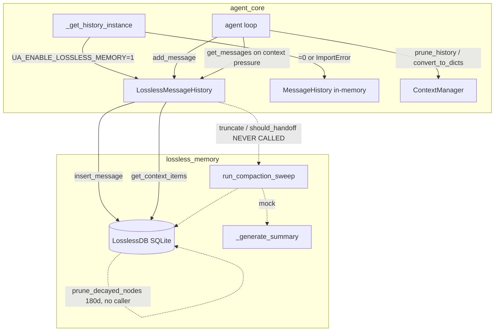

# Lossless Memory

## What it is

`lossless_memory/` is a SQLite-backed, **non-destructive** message-history store that
can drop in for the agent's native in-memory `MessageHistory`
(`utils/message_history.py`). Instead of holding the conversation as an in-process
Python list that gets truncated when it grows too large, it persists every message —
including raw tool-call/tool-result blocks — to a SQLite database, and on read
reassembles the active context from that store.

It is **on by default**: `agent_core._get_history_instance` selects the lossless
adapter when `UA_ENABLE_LOSSLESS_MEMORY` is `"1"` (the default), falling back to the
in-memory `MessageHistory` only when the flag is `"0"` or the import fails.

```python
# agent_core._get_history_instance
def _get_history_instance(system_prompt_tokens=2000, session_id=None):
    if os.getenv("UA_ENABLE_LOSSLESS_MEMORY", "1") == "1":
        try:
            from universal_agent.lossless_memory.history_adapter import (
                LosslessMessageHistory,
            )
            return LosslessMessageHistory(...)
        except ImportError:
            pass
    return MessageHistory(system_prompt_tokens=system_prompt_tokens)
```

The module ships with a DAG (Directed Acyclic Graph) condensation design — a
hierarchy of summary nodes meant to compress evicted messages instead of dropping
them — but **that condensation path is currently inert in production** (see
[Reality check](#reality-check-dag-condensation-is-not-wired-in)). What actually runs
today is the durable-store half: persist on `add_message`, replay on `get_messages`.

## Components

The package is four files, fully isolated under `src/universal_agent/lossless_memory/`:

| File | Symbol | Role |
| --- | --- | --- |
| `db.py` | `LosslessDB` | SQLite engine. Owns the schema, all writes (behind a `threading.Lock`), and context hydration. |
| `history_adapter.py` | `LosslessMessageHistory` | Duck-typed drop-in for `MessageHistory`. Serializes messages to `LosslessDB`, reassembles them for the API. |
| `dag_condenser.py` | `run_compaction_sweep`, `_generate_summary` | DAG compaction sweep. **Summarizer is a mock; sweep is never triggered by the agent loop.** |
| `__init__.py` | re-exports `LosslessDB` | Package entrypoint. |

There is **no `tools.py`** and no `lcm_grep` / `lcm_expand` drill-down tools in the
codebase — those were described in the legacy design doc but never implemented.

## Schema (`LosslessDB._init_schema`)

Five tables model the conversation and its (designed) summary DAG:

| Table | Purpose |
| --- | --- |
| `lcm_conversations` | One row per `session_id` (unique). Maps `session_id` → internal `conv_*` id. |
| `lcm_messages` | Raw messages: `role`, short `content` (≤1000 chars for indexing), full `raw_blocks` JSON, `token_count`, `seq`, `created_at`. |
| `lcm_summaries` | Summary nodes: `depth`, `descendant_count`, `earliest_at`/`latest_at`, `content`, `token_count`. |
| `lcm_summary_messages` | Join: which raw messages a summary covers. |
| `lcm_summary_parents` | Join: summary→parent-summary edges (the DAG hierarchy). Defined but unused — no Depth-1+ rollup runs today. |
| `lcm_context_items` | The **ordered active view**. Each row is `('message'|'summary', reference_id)` at an `ordinal`. This is what gets hydrated into the live context. |

Key behaviors observed in code:

- **Seq and ordinal are computed with `IFNULL(MAX(...),0)+1`** per conversation, so
  ordering is per-conversation and monotonic.
- **All writes hold a single process-wide `threading.Lock`** (`self._lock`). Reads
  (`get_context_items`) do **not** take the lock — they open their own connection.
- **`row_factory = sqlite3.Row`** everywhere, and `connect(timeout=10.0)`.
- The DB directory is `os.makedirs(..., exist_ok=True)`'d on construction.

## Write path: `add_message`

`LosslessMessageHistory.add_message(role, content, usage=None)`:

1. Estimates tokens. For a `str` it uses `len(content)//4`. For a `list` of blocks it
   serializes each block (`dict`, `__dict__`, or `str(...)`) into `raw_blocks` and
   keeps a ≤1000-char `text_content` for indexing.
2. If a `usage` object is passed, token count is overridden with
   `input_tokens + output_tokens` (the rough `//4` estimate is discarded).
3. Calls `LosslessDB.insert_message`, which writes the `lcm_messages` row **and**
   appends a `('message', msg_id)` row to `lcm_context_items` in the same transaction.
4. Increments `self.total_tokens`.

`total_tokens` is seeded with `system_prompt_tokens` (default 2000) and only ever
grows in this adapter — `reset()` returns it to the seed but nothing else clears it.

## Read path: `format_for_api` / `get_messages`

`get_messages()` delegates to `format_for_api()`, which calls
`LosslessDB.get_context_items` (ordered by `ordinal`) and rebuilds API messages:

- A `summary` item is injected as a **user-role** message whose content is an XML
  string: `<summary id="..." depth="...">{content}</summary>`.
- A `message` item with non-empty `raw_blocks` is replayed as
  `{"role": role, "content": <parsed blocks list>}`; otherwise it falls back to the
  flat `content` string.

In `agent_core`, the reassembled history is consumed at the context-pressure branch:
`full_history = self.history.get_messages()` is then handed to
`ContextManager.prune_history` / `convert_to_dicts` — i.e. the **actual** compaction
is done by `memory/context_manager.py`, not by the lossless DAG condenser.

## Flow



Dotted edges are designed-but-dormant paths.

## Reality check: DAG condensation is NOT wired in

This is the load-bearing gotcha for anyone touching this subsystem.

- **`truncate()` and `should_handoff()` on `LosslessMessageHistory` are never called
  by `agent_core` (or anywhere in `src/`).** The agent loop calls only
  `add_message` and `get_messages`. `grep -rn "\.truncate()\|\.should_handoff()"
  src/` returns nothing outside the adapter's own docstring. So the only entrypoint
  to `run_compaction_sweep` (`truncate()` → `loop.create_task(run_compaction_sweep)`)
  never fires in production.
- **`_generate_summary` is a mock.** Its docstring says "Mock summarizer for MVP
  testing without burning Anthropic credits loop" and it returns a hardcoded
  `[Depth {depth} Summary of {count} previous interactions...]` string. There is no
  `ClaudeSDKClient` call. Even if the sweep ran, summaries would be placeholders.
- **`run_compaction_sweep` only ever creates Depth-0 summaries** from a hardcoded
  chunk of the oldest 5 evictable messages. There is no rollup into Depth-1+;
  `lcm_summary_parents` is never written. So the "DAG" is, in practice, a flat
  one-level summary table — and it stays empty in prod because the sweep isn't
  triggered.
- **`prune_decayed_nodes(days=180)` has no callers** anywhere in `src/`. The 180-day
  decay/GC is dead code — the SQLite store grows unbounded with no eviction.

Net effect today: lossless memory is a **durable append-only message log + replay
buffer**. Compaction is handled entirely by `ContextManager` operating on the
replayed history; the DAG condenser is scaffolding from an MVP that was never
completed.

## Configuration

| Env var | Default | Read by | Effect |
| --- | --- | --- | --- |
| `UA_ENABLE_LOSSLESS_MEMORY` | `"1"` | `agent_core._get_history_instance` | `"1"` → use `LosslessMessageHistory`; `"0"` → native in-memory `MessageHistory`. |
| `UA_LOSSLESS_DB_PATH` | `~/.universal_agent/lcm.db` | `history_adapter.get_global_db` | SQLite file path. A single process-global `LosslessDB` instance is lazily created. |
| `UA_LCM_FRESH_TAIL` | `10` | `dag_condenser.run_compaction_sweep` | Messages immune to summarization. **Only matters if the sweep ran (it doesn't).** |
| `UA_TRUNCATION_THRESHOLD` | `150000` | adapter `truncate()` | Threshold to trigger the sweep. **Inert** — `truncate()` is never called. Also read by native `MessageHistory` for its own (real) truncation. |
| `UA_CONTEXT_WINDOW` | `200000` | adapter `should_handoff()` | Hard wall. **Inert** — `should_handoff()` is never called. |

Note the session identity: when no `session_id` is passed, the adapter uses
`anonymous_{os.getpid()}`, so anonymous conversations are keyed per-process. In
`agent_core` the `session_id` is always `self.run_id` / `setup.run_id`.

## Rollback

Because the design is a non-destructive parallel store, disabling is safe and
immediate: set `UA_ENABLE_LOSSLESS_MEMORY=0` and restart. The runtime reverts to
in-memory `MessageHistory` with zero DB dependency. No data migration is needed —
the SQLite file is simply ignored.

## Tests

`tests/test_lossless_memory_dag.py` covers `LosslessDB` inserts, the adapter
round-trip (`add_message` → `get_messages` preserving block structure), and the
compaction sweep **in isolation** (calling `run_compaction_sweep` directly with
`UA_LCM_FRESH_TAIL=2`). The tests exercise the condenser mechanically; they do **not**
prove the sweep is invoked by any production code path — it is not.

## Gotchas

- The DAG condenser is dead code in prod — do not assume messages get summarized into
  the store. They accumulate raw.
- `_generate_summary` returns placeholder text; wiring a real `ClaudeSDKClient` call
  is the missing MVP step if this is ever revived.
- No GC: `prune_decayed_nodes` is never called, so `lcm.db` grows without bound.
- Reads bypass the write lock; concurrent writers across processes sharing one
  `UA_LOSSLESS_DB_PATH` rely on SQLite's own locking + the 10s `timeout`, not the
  in-process `Lock` (which only serializes one process).
- The legacy doc claimed a `tools.py` with `lcm_grep`/`lcm_expand` — these do not
  exist.
