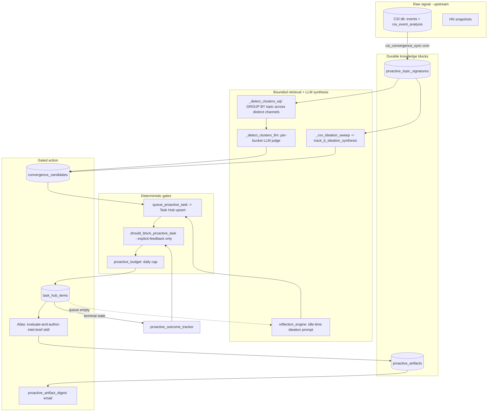

# Proactive Pipeline

The proactive pipeline is how Universal Agent (UA) does work nobody explicitly
asked for: it ingests raw external signal (YouTube transcripts, HN snapshots,
ClaudeDevs X intel), distills it into durable knowledge blocks, lets an LLM
synthesize non-obvious meaning over a *bounded* corpus, and routes any warranted
action through hard deterministic gates into the Task Hub — never executing
uncontrolled work directly.

This is the concrete embodiment of the project's LLM-Native Intelligence design
rule:

```
raw records → durable knowledge blocks → bounded retrieval context → LLM synthesis → gated action candidates
```

> **Scope.** This doc covers the *proactive* surface: convergence/ideation
> detection, the reflection (autonomous ideation) engine,
> proactive artifacts + preference gating, outcome tracking, and the auto-promoter.
> (The autonomous *signal-curation* lane was decommissioned 2026-06 — see
> "Signal curator (Track 1)" below.)
> CSI/ClaudeDevs ingestion and Task Hub mechanics are separate subsystems; this
> doc references where they feed in.

---

## Where each pipeline stage lives in code

| Stage | Module(s) | Role |
|---|---|---|
| Raw records | CSI / HN / YouTube ingestion (upstream); `proactive_signals.py` (signal cards) | External signal lands in `events`/`rss_event_analysis` (CSI db) and `proactive_signal_cards`. |
| Knowledge blocks | `proactive_convergence.py::upsert_topic_signature`, `proactive_artifacts.py::upsert_artifact` | Durable, deduped distillations (topic signatures, artifacts). |
| Bounded retrieval | `proactive_convergence.py::_detect_clusters_sql` / `_load_recent_signatures`; `reflection_engine.py::build_reflection_context` | SQL recall + windowed corpus assembly that fits an LLM prompt. |
| LLM synthesis | `_detect_clusters_llm`, `_run_ideation_sweep` → `track_b_ideation_synthesis`; `proactive_intelligence_report.compose_intelligence_report` | LLM infers themes/convergence/insight. |
| Gated action | `proactive_task_builder.queue_proactive_task` (preference gate) → Task Hub; `intel_auto_promoter`; `proactive_budget` (daily cap) | Deterministic gates create Task Hub work; no inline execution. |
| Feedback loop | `proactive_outcome_tracker.py`, `proactive_preferences.py` | Outcomes + explicit feedback shape future surfacing/gating. |

---

## End-to-end flow



---

## Producer lanes and wiring status

There are several distinct producers feeding the pipeline. Their end-to-end
wiring differs — some run continuously, some ship scaffolding only.

> **Correction to legacy docs.** The 2026-04-18 audit warned that "reflection
> mode and signal curation don't call promotion helpers to create Task Hub work."
> The signal-curation half of that lane was **decommissioned 2026-06** (see
> "Signal curator (Track 1)" below). For reflection the correction still holds:
> `reflection_engine` produces an ideation prompt instructing the agent to create
> `source_kind="reflection"` Task Hub items, so reflection does reach Task Hub.

### 1. Convergence + ideation (the centerpiece) — WIRED

`csi_convergence_sync` cron (default `0 6-21 * * *` — hourly 06:00–21:00
America/Chicago, overridable via `UA_CSI_CONVERGENCE_CRON_EXPR`) runs
`scripts/csi_convergence_sync.py` which calls
`proactive_convergence.sync_topic_signatures_from_csi`. The cron command is
`!script universal_agent.scripts.csi_convergence_sync`; registration is in
`gateway_server.py` (`job_id = "csi_convergence_sync"`) and is gated by
`UA_CSI_CONVERGENCE_CRON_ENABLED` (default `1`). The cron runs as a
`lightweight=True` `!script` subprocess (no heavyweight Claude-agent bootstrap,
no Composio tool-router), but it is **not** pure-SQL: it does SQL sync **plus**
bounded LLM clustering, an ideation sweep, and per-candidate triage via the SDK
directly. Those LLM phases are parallelised and time-boxed (see step 3) so the
run finishes under the cron's `timeout_seconds`
(`UA_CSI_CONVERGENCE_CRON_TIMEOUT_SECONDS`, default 900s).

`sync_topic_signatures_from_csi`:

1. Reads transcript-backed YouTube RSS analysis rows from the CSI DB
   (`events` LEFT JOIN `rss_event_analysis WHERE source='youtube_channel_rss'`).
2. For each new video, upserts a **topic signature** (the durable knowledge
   block) into `proactive_topic_signatures`, skipping videos already signed
   (`get_topic_signature`).
3. **Convergence detection (Track A).** `_detect_clusters_sql` does SQL recall —
   GROUP BY primary topic across *distinct* channels within
   `source_window_hours` (default 72h, `min_channels=2`). When
   `UA_CONVERGENCE_LLM_CLUSTERING=1` (default), each SQL bucket is refined by a
   per-bucket LLM judge (`_detect_clusters_llm`) that confirms a genuine shared
   thesis and emits only high-strength clusters (floor `UA_CONVERGENCE_MIN_STRENGTH`,
   default 7). Set the flag to 0 to fall back to raw SQL buckets.
   - **Bounded cost (2026-06-02 fix).** `include_secondary` recall yields *dozens*
     of buckets; refining them one-at-a-time at ~5–15s each (opus-tier) overran
     the 900s cron timeout *every* run (consistent `[ERROR] Autonomous Task
     Failed` flood). The per-bucket refines now run **concurrently**, bounded by
     `UA_CONVERGENCE_LLM_CONCURRENCY` (default 6), and the whole LLM section
     (clustering + triage + ideation) is time-boxed by a shared deadline
     `UA_CSI_CONVERGENCE_BUDGET_SECONDS` (default 600s): work not reached this run
     is idempotently re-detected next tick. Every LLM call is also bounded by
     `UA_LLM_CALL_TIMEOUT_SECONDS` (default 180s — raised from 60s on 2026-06-03;
     the 60s cap was shorter than the ZAI/glm latency tail for the large triage
     prompt and stalled the promoter — see the pre-Task-Hub triage note below) /
     `UA_LLM_CALL_MAX_RETRIES` (`llm_classifier.py::_get_anthropic_client`) so a
     stalled ZAI proxy can't hang a call for the SDK-default ~10 min.
   - **FUP circuit breaker (2026-06-11).** When a per-bucket refine fails with a
     ZAI Fair-Usage signal (matched by `rate_limiter._is_fup_error` —
     `[1313]`/Fair-Usage/concurrency-limit bodies), `_refine_cluster_with_llm`
     re-raises it and `_detect_clusters_llm_async` trips a one-shot breaker:
     every remaining bucket returns `None` immediately (checked right after the
     local semaphore is acquired, alongside the deadline check) instead of
     grinding through ~60 more doomed LLM calls. One `logger.warning` summarizes
     how many buckets were skipped; the next hourly run re-detects them
     (candidate writes are idempotent). The breaker is **not** applied to the
     ideation sweep. Non-FUP refine errors still fail closed (no candidate) and
     do **not** trip the breaker.
4. **Ideation sweep (Track B).** When `UA_IDEATION_SWEEP_ENABLED=1` (default),
   `_run_ideation_sweep` → `track_b_ideation_synthesis` runs an LLM over the
   recent signature corpus looking for *non-obvious* abstract patterns
   (convergence = "same story / news saturation"; ideation = "interesting
   cross-cutting relationships"). Insights below `UA_IDEATION_MIN_CONFIDENCE`
   (default 0.7) are dropped downstream.
5. Each cluster/insight is written via `write_convergence_candidate` (below).

**Relevance gate (step 1, default ON).** Before a row becomes a signature,
`sync_topic_signatures_from_csi` excludes non-domain categories so politics /
geopolitics / war / economics / cooking / health / noise videos never become
topic signatures — and therefore never become ideation/convergence candidates
or Atlas `evaluate-and-author-intel-brief` missions. The gate is a deterministic
filter over an *already-LLM-produced* judgment (the per-video
`rss_event_analysis.category` from the first CSI inference) — the "code gates,
LLM synthesizes" rule, not new pseudo-reasoning. It is applied **in SQL** (an
`AND (a.category IS NULL OR LOWER(TRIM(a.category)) NOT IN (...))` clause built
from `_relevance_denylist`) so denied rows don't consume the query `LIMIT`
budget. Helpers: `proactive_convergence.py::_relevance_gate_enabled`,
`proactive_convergence.py::_relevance_denylist`, constant
`proactive_convergence.py::_DEFAULT_RELEVANCE_DENYLIST`.

- **Denied** (the *empirical* single-token vocabulary the live classifier emits,
  verified against `rss_event_analysis.category` in `/var/lib/universal-agent/csi/csi.db`):
  `geopolitics`, `conflict`, `economics`, `cooking`, `personal_health`, `noise`,
  `other_signal`, `longform_interviews`, `from` (a junk label), plus
  `geopolitics_and_conflict` as a defensive compound-taxonomy alias.
- **Kept** (domain): `ai_coding`, `ai_models`, `ai_news_and_business`,
  `ai_business`, `ai_applications`, `software_engineering`, and `technology`.
  `technology` is a *mixed* bucket (genuine vibe-coding/dev content alongside the
  occasional politics clip); coarse category gating keeps it rather than discard
  real dev content — per-video disambiguation is deferred future work.
- **Unknown / NULL / empty category** is **kept** (only *known* non-domain
  categories are excluded), so a brand-new domain category isn't silently
  dropped. Trade-off: a brand-new *non-domain* category leaks until added to the
  denylist — observable, and fixable via the env override below with no deploy.
- Env: `UA_RELEVANCE_GATE_ENABLED` (default `1`; `0` = legacy ingest-everything),
  `UA_IDEATION_RELEVANCE_DENYLIST` (comma-separated, case-insensitive override).
- **History:** the gate shipped 2026-05-30 (#592) with the *compound* taxonomy
  (`geopolitics_and_conflict`, …) an earlier handoff assumed; that matched almost
  nothing the live classifier emits, so `geopolitics` (~210 rows), `conflict`
  (~63), and `economics` leaked. The denylist was corrected the same day to the
  empirical vocabulary above. Because the gate filters ingest only, pre-existing
  non-domain signatures already in `proactive_topic_signatures` keep feeding
  convergence until they age out of the 72h `source_window_hours` (self-healing;
  no backfill/purge).

> The legacy per-signature LLM pipeline (`detect_and_queue_convergence` →
> `insight_detection`, `track_a_concrete_convergence`, `create_insight_brief_task`)
> was removed/deprecated in 2026-05 (it had a 0.14% completion rate — ~698
> cancelled / 30 parked / 1 completed). Track A is now SQL-recall + LLM-precision;
> Track B is the ideation sweep. Both converge on the same `convergence_candidate`
> → Atlas → digest path.
>
> **ZAI content-safety (error 1301) drops large/sensitive buckets, fail-closed
> — but the drop IS logged, not silent.** During the 2026-05-29 verification a
> 29-video bucket was dropped on a YouTube convergence run. The accepted tradeoff
> (resilience phase) is fail-closed with no retry/reroute. Verified 2026-06-01:
> the drop surfaces as `logger.warning("convergence LLM refine failed (bucket
> size=%d): %s", ...)` in `proactive_convergence.py::_refine_cluster_with_llm`'s
> `except` block — the exception text carries the ZAI error code (grep logs for
> `1301`). It is a *generic* refine-failed warning, NOT a content-safety-specific
> marker; the ideation sweep (`_run_ideation_sweep`) and `triage_candidate` log
> the same generic shape. The other `_refine_cluster_with_llm` `return None`
> paths (not-convergence / below `signal_strength` floor / not multi-channel) are
> legitimate negative results and are intentionally unlogged. Political/conflict
> convergences that trip the guardrail will not surface — an accepted tradeoff.

### 2. Signal curator (Track 1) — DECOMMISSIONED 2026-06

**Removed.** The autonomous signal-curation lane — heartbeat →
`signal_curator.should_run_curation` → async `curation` mission
(`mission_type="curation"`, `run_kind="proactive_curation"`) → the
`task_hub_promote_signals` tool → `promote_cards_to_tasks` → `task_hub_items`
rows with `source_kind="proactive_signal"` routed to Atlas — was deleted in
2026-06. `services/signal_curator.py`, the `task_hub_promote_signals` tool, and
the heartbeat dispatch block no longer exist.

**Why.** The lane had been dormant since ~2026-05-27 and was duplicative of the
**hourly intel digest** (see "Convergence + ideation" above and
`services/hourly_intel_digest.py`), which reads the *same* CSI feedstock via
convergence briefs — the richer path (convergence detection + ship/skip/defer
triage + scoring + dedup). Signal cards never fed the digest's read query:
`proactive_artifacts.upsert_from_proactive_signal_card` writes
`artifact_type="signal_card"` / `verdict=""`, while the digest selects
`artifact_type="intel_brief" AND verdict="ship"` — so removing the lane does not
affect the digest.

**What stayed.** The `proactive_signal_cards` store, its dashboard endpoints, the
card→artifact sync, and `nightly_wiki_agent` (which reads pending cards) are
untouched — they have independent consumers. The `"curation": "maintenance"`
entry in `vp/mission_priority.py` is retained as the maintenance-tier exemplar
referenced by the priority regression tests and is inert. No new
`source_kind="proactive_signal"` Task Hub items are produced.

**Card-lane cleanup (2026-06).** With the curation drainer gone, the card lane
was slimmed to a pure dashboard "recent signals" glance:
`generate_youtube_cards` now emits only **diamond / transcript_insight** cards
(standout single videos). The old **cluster** cards (keyword co-occurrence
within YouTube, no LLM) were retired — they duplicated, more weakly, what the
convergence pipeline already does cross-channel with an LLM judge. An empirical
dry-run also showed feeding diamond cards into the convergence/brief pipeline
yields almost nothing net-new (≈1 of 20 diamonds isn't already in a cluster),
so no card→brief feeder was added.

**Card hygiene — every sweep runs two cleaners** (`generate_signal_cards`, shared
by the tick and the dashboard load):
- `expire_stale_pending_cards` **soft-deletes** `pending` cards not refreshed
  within `UA_PROACTIVE_CARD_TTL_DAYS` (default **3**) → `status='deleted'`: the
  row stays in the DB but drops off the live/pending tab. Keyed on `updated_at`
  (last surfaced), NOT `created_at` — a card's `created_at` is the *video's*
  publish time, so a `created_at` TTL would instantly expire cards for any video
  ingested late (RSS backfill). Net shelf life ≈ time-in-feed (≤~2 days) + 3.
  Operator-triaged cards are never touched.
- `purge_aged_terminal_cards` **hard-deletes** terminal/non-live rows
  (`actioned`/`rejected`/`promoted`/`deleted`, never `pending`/`tracking`) whose
  `updated_at` is older than `UA_PROACTIVE_CARD_PURGE_DAYS` (default **7**), so
  the rejected/deleted ledger doesn't accumulate forever. Resurface-safe: keyed
  on `updated_at`, which is always > the ~2-day CSI regeneration window before a
  row becomes purgeable, so a purged card can't be re-INSERTed as `pending`.

**Default tab view = `live`** (= `pending` + `tracking`; `list_cards(status="live")`).
The dashboard defaults here so the tab shows the active triage set, not the
rejected/promoted/deleted history. `all` (excludes only `deleted`) and the
per-status filters remain available.

**How `proactive_signal_cards` are generated — two triggers (autonomous tick + pull-on-open).**
There are two callers that produce cards from the CSI/Discord feedstock, sharing
one card-only core, `proactive_signals.py::generate_signal_cards` (YouTube diamond
cards + Discord cards + the TTL sweep — pure SQLite, **no** LLM/convergence):

1. **Autonomous tick (the primary path).** The systemd timer
   `universal-agent-proactive-signal-card-sync.timer` fires
   `proactive_signals.py::generate_signal_cards` **hourly** via
   `scripts/proactive_signal_card_sync.py`, so the card list stays fresh without
   anyone opening the dashboard. It runs 24/7 at the timer level but **gates to
   the Houston active window in the script** (`dormancy_aware`;
   `UA_PROACTIVE_CARD_SYNC_24_7=true` runs around the clock). Deliberately NOT the
   full `sync_generated_cards` — the convergence/topic-signature and tutorial
   syncs are LLM-bearing and have their own `csi-convergence-sync` timer, so the
   tick would double-run them and burn quota.
2. **Pull-on-open (the dashboard path).** `proactive_signals.py::sync_generated_cards`
   runs when the proactive-signals dashboard is loaded with a sync request — its
   single caller is `gateway_server.py::dashboard_proactive_signals`, gated on
   `?sync` / `force_sync` and a cooldown (`UA_PROACTIVE_SIGNALS_SYNC_COOLDOWN_SECONDS`,
   default 300s). As of **2026-06-11** this is the **card-only core** too:
   `sync_generated_cards` now just calls `generate_signal_cards` and no longer
   invokes the LLM-bearing `sync_topic_signatures_from_csi`. It still returns the
   historical 6-key counts shape for back-compat, but `topic_signatures`,
   `convergence_events`, and `tutorial_build_tasks` are **always 0** here — the
   convergence/topic-signature lane is produced **solely** by the hourly
   `universal-agent-csi-convergence-sync` timer (single-producer pattern, same as
   the tutorial-build lane). The dashboard-tick invoker was removed because the
   300s cooldown re-fired the full LLM convergence fan-out every ~5 minutes
   whenever the dashboard was open (verified bursts of ~200 ZAI calls/min),
   feeding ZAI Fair-Usage 429 pressure for no benefit (the hourly timer already
   produces the same candidates).

Before the autonomous tick existed (added 2026-06), generation was pull-on-open
only — so if no one opened the dashboard, no new cards appeared even though the
CSI `events` table kept filling, and the 03:15 `nightly_wiki` consumer found
nothing to build. The hourly tick closes that gap.

**Card status lifecycle — nothing auto-rejects.** The complete writer set for
`proactive_signal_cards.status` is documented in the `proactive_signals.py` module
docstring; the load-bearing facts: new cards are `pending`; `'rejected'` is written
**only** by the operator "Reject" button (the dashboard feedback endpoint via
`record_feedback`) — there is **no batch/automatic rejecter anywhere**. The only
*automatic* mutations are the two hygiene sweeps above: `expire_stale_pending_cards`
(`pending` → `'deleted'`, soft) and `purge_aged_terminal_cards` (aged terminal rows
hard-deleted). A pile of `rejected` rows means operators clicked Reject; a pile of
`deleted` rows means the TTL sweep ran. Do not attribute rejections to a preference
model or a sweeper (a 2026-06 investigation made that wrong call).

**The `nightly_wiki` consumer runs via a systemd timer, not the in-process cron.**
`nightly_wiki_agent` reads `pending` cards at 03:15 America/Chicago and is **not**
disabled — it was migrated to `universal-agent-nightly-wiki.timer` (S5 Phase A), so
its in-process `cron_jobs.json` row is a `"enabled": false` tombstone. Before
concluding it is off, see
[`03_agents/04_cron_and_scheduling.md`](../03_agents/04_cron_and_scheduling.md)
§ "Is this scheduled job actually running?".

### 3. Reflection engine (autonomous ideation) — WIRED (idle-only)

`reflection_engine.py` activates only when the Task Hub dispatch queue is empty
and the agent would otherwise idle (gated in `heartbeat_service.py` via
`is_reflection_enabled()`). It is **ideation-only**: it produces a prompt that
asks the agent to create Task Hub items (`source_kind="reflection"`); it never
executes them, and it never calls an LLM itself — it only formats context.

`build_reflection_context` assembles a bounded context: recent completions,
stalled brainstorms (>24h, non-`actionable` refinement stage), open task count,
memory hits (goals/missions), and remaining daily budget. The formatted prompt
explicitly forbids deploy/delete/external-email/breaking changes.

Enablement: `UA_REFLECTION_ENABLED` (1/0); if unset it follows
`UA_HEARTBEAT_AUTONOMOUS_ENABLED`.

### 4. Intel auto-promoter (CSI demo triage) — WIRED

`intel_auto_promoter.py` closes the overnight gap where tier-3 ClaudeDevs intel
signals pile up in `demo_triage_candidates` (state `pending`, LLM-ranked 0–10 by
the `csi_demo_triage_ranker` cron) with no operator clicking "Approve". It runs
as a cron *after* the ranker and calls the **same** `csi_demo_triage.approve_candidate`
helper the dashboard button uses, so auto-promotions are byte-identical to
operator approvals. Gates:

| Env var | Default | Meaning |
|---|---|---|
| `UA_INTEL_AUTO_PROMOTE_ENABLED` | `1` | kill switch |
| `UA_INTEL_AUTO_PROMOTE_MIN_SCORE` | `7.5` | score threshold (0–10) |
| `UA_INTEL_AUTO_PROMOTE_DAILY_CAP` | `2` | max promotions per UTC day |
| `UA_INTEL_AUTO_PROMOTE_DRY_RUN` | `0` | report-only mode |

`decided_by` is stamped `auto_promoter:score=8.4:run=2026-05-22` for end-to-end
traceability; the daily cap counts `state='approved'` rows whose `decided_by`
starts with `auto_promoter:` in the current UTC day.

### 5. Proactive advisor (morning report) — WIRED (prompt context only)

`proactive_advisor.py` is **pure Python, no LLM**. `build_morning_report`
assembles a deterministic Task Hub snapshot (active counts, brainstorm stages +
pending questions, stale in-progress, overdue scheduled, expiring questions) and
a pre-formatted `report_text`. The heartbeat injects this text as additional
prompt context — the LLM only ever sees the formatted report, never re-derives it.

### 6. Intel lanes config — SCAFFOLDING ONLY

`intel_lanes.py` loads `config/intel_lanes.yaml` into typed `LaneConfig`
objects (strict, `extra="forbid"`). Per its own docstring, existing
`claude_code_intel.py` paths are **not yet wired** to read from here — it's the
schema + loader for a planned generalization. Treat lane config as
forward-looking, not load-bearing today.

---

## Knowledge blocks: topic signatures and artifacts

**Topic signatures** (`proactive_topic_signatures`) are the deduped distillation
of one source video: `primary_topics`, `secondary_topics`, `key_claims`,
`content_type`. Keyed by `video_id` so re-syncs are idempotent.

**Proactive artifacts** (`proactive_artifacts`, in `proactive_artifacts.py`) are
the durable inventory of work products created without a direct user request —
reviewable, with feedback and a delivery lifecycle. IDs are deterministic:
`make_artifact_id` = `pa_` + first 16 hex of `sha256(source_kind|source_ref|artifact_type|title)`.

Status lifecycle: `produced` / `candidate` / `surfaced` / `accepted` /
`rejected` / `archived`. Delivery states: `not_surfaced` / `digest_queued` /
`emailed` / `email_failed` / `reviewed`. Artifacts are *not* the execution queue —
Task Hub is. Artifacts are the inventory.

---

## Gated action: how candidates become Task Hub work

`write_convergence_candidate` is the single chokepoint where a synthesized
cluster/insight becomes queued work:

- Computes a **deterministic** `candidate_id` = `cand_` + `sha256(sorted video_ids)[:16]`,
  stable across CSI runs for the exact same source cluster.
- **Write-once verdict semantics:** if the candidate already carries a final
  verdict (`ship`/`skip`/`defer`/`error`), the call is a no-op returning the
  existing row.
- **Pre-Task-Hub triage (2026-05-30, `proactive_convergence.py::triage_candidate`).**
  New/mid-processing candidates are NOT queued unconditionally. A cheap Haiku-tier
  LLM triage runs at candidate-write time — loading the 48h recent-briefs index
  (hard-bounded to `UA_INTEL_TRIAGE_INDEX_MAX_CHARS` chars, default 12000) plus the
  candidate's source claims — and returns `ship` / `skip` / `defer` /
  `retry`. **Only `ship` queues a Task Hub item (and a Kanban card);** `skip`/`defer`
  record the verdict on the `convergence_candidates` row for audit but create **no
  task**; `retry` (LLM unavailable) leaves the row non-final for the next sweep.
  Flags: `UA_INTEL_TRIAGE_ENABLED` (default `1`; `0` = legacy "always queue, mission
  decides"), `UA_INTEL_TRIAGE_MODEL`, `UA_INTEL_TRIAGE_INDEX_MAX_CHARS` (default
  12000). The triage verdict is carried in
  `metadata.triage = {kind, reasoning, demo_amenable, model}` on both the task and
  the candidate row.
  > **Stall incident (2026-06-03).** `recent_briefs_index` grew unbounded to ~100K
  > tokens (~400KB); the whole index was embedded in every triage prompt, pushing the
  > glm/ZAI call past the (then 60s) `UA_LLM_CALL_TIMEOUT_SECONDS` cap on essentially
  > every cluster → all candidates fell to `retry` → **promotion stalled ~45h** (no new
  > `convergence_candidate` task since 2026-06-02 02:13 UTC; a 330+ `verdict=''` backlog).
  > Fixed by the char budget above + raising the timeout default to 180s. The index
  > only needs a recency sample for novelty/dedup, not the full corpus.
  > **Growth fix (2026-06-04 follow-up).** That char budget only bounded what *triage*
  > consumed; the file itself still grew unbounded because `recent_briefs_index.py::append_verdict_to_index`
  > appended every verdict with no prune and the only bounded rebuilder
  > (`write_recent_briefs_index`) had no prod caller. The appender now self-prunes to the
  > most-recent `UA_RECENT_BRIEFS_INDEX_MAX_ENTRIES` blocks (default 60; `0` disables) on
  > every over-budget append via an atomic rewrite, so the on-disk file and the authoring
  > read (`evaluate-and-author-intel-brief`, also via `read_index_or_fallback`) stay bounded.
  > Separately, `llm_classifier.py::_parse_json_response` now recovers the first JSON object
  > via `raw_decode` when the glm/ZAI refine call emits a duplicate object or trailing prose
  > (the `convergence LLM refine failed: Extra data ...` log), instead of dropping the bucket.
- Queues a task via `queue_proactive_task` with `source_kind='convergence_candidate'`,
  `metadata.preferred_vp='vp.general.primary'`, `metadata.candidate_id`,
  `metadata.invoke_skill='evaluate-and-author-intel-brief'`, priority 3, and
  `candidate_kind` `convergence` or `ideation`. Task title:
  `ATLAS evaluate convergence candidate: <headline>` (or `... ideation insight: ...`).
- The downstream consumer is **Atlas**, invoking the
  `evaluate-and-author-intel-brief` skill. Since triage already decided, the skill
  is **triage-aware (Phase 0.5 short-circuit, 2026-05-31):** when
  `metadata.triage.kind == "ship"` it **skips re-deciding** and only authors the
  intel-brief artifact (verdict + reasoning come from triage). When `metadata.triage`
  is **absent** (triage off via `UA_INTEL_TRIAGE_ENABLED=0`, or a legacy pre-triage
  task) the skill falls back to its own `ship`/`skip`/`defer` rubric — so the kill
  switch still has a gate. `metadata.triage.demo_amenable` is propagated into the
  `proactive_artifacts` metadata.
  - **Deferred (not built):** an intel-ship → Cody demo-build bridge. `demo_amenable`
    is captured/preserved but nothing dispatches a demo — `cody_dispatch.py::dispatch_cody_demo_task`
    requires a scaffolded `/opt/ua_demos/<id>/` workspace from the separate (currently
    dormant) ClaudeDevs-Intel-v2 entity-demo pipeline, with no producer linking the two.
    Wiring it is a cross-pipeline feature, not cleanup; intentionally left as a scoped
    follow-up.

`queue_proactive_task` (`proactive_task_builder.py`) is the standardized creation
path for *all* proactive services. It applies two gates before the Task Hub upsert:

### Gate 1 — preference gate (hard block, fail-open)

Calls `proactive_preferences.should_block_proactive_task(task_type=source_kind, topic_tags=...)`.
A task is blocked only when **every** matching preference dimension carries an
explicit weight ≤ `block_threshold` (default −0.5). If no matching explicit
signal exists, the task passes (benefit of the doubt). On any error the gate
**fails open** (allows the task) — instrumentation must never block real work.

> **Critical:** the hard gate counts ONLY `signal_type='explicit_feedback'` rows.
> Implicit outcome signals (auto-fired on park/skip/block) are deliberately
> excluded from both the hard gate and `rebuild_preference_snapshot`. See the
> implicit-poison incident below.

### Gate 2 — daily budget

`reflection_engine` draws on a daily counter (`proactive_budget.py`):
`has_daily_budget` checks against `UA_PROACTIVE_DAILY_BUDGET` (default 10),
counting only `source_kind in ('proactive_signal','reflection')`.
Cron/`system_command` tasks are never counted. Counter resets at the UTC date
boundary. (Note: the convergence path's `queue_proactive_task` does not itself
decrement this budget; the budget is enforced explicitly by the reflection
caller. The `proactive_signal` source_kind stays in the count for any legacy
rows, but the curation lane that produced them is decommissioned — see
"Signal curator (Track 1)".)

---

## Feedback loop: outcomes and preferences

`proactive_outcome_tracker.py` records terminal task outcomes
(`record_proactive_outcome`), emits intelligence events, stores work recaps, can
trigger auto-investigation of failures (`UA_PROACTIVE_AUTO_INVESTIGATE`, default
`true`), and writes outcomes to memory (`UA_PROACTIVE_OUTCOME_MEMORY`, default
`true`). Work-recap LLM model is `UA_PROACTIVE_RECAP_LLM_MODEL` (default: resolved
Opus).

`proactive_preferences.py` maintains a tiny SQLite-backed preference model
(`proactive_preference_signals`, `proactive_preference_model`):
- Explicit feedback (1–5 score) maps to a weight via `signal_weight_for_score`.
- `rebuild_preference_snapshot` time-decays signals (14-day half-life) into a
  per-key model. **It now processes EXPLICIT FEEDBACK ONLY.**
- `score_artifact_for_review` adds a preference bonus for *ranking* surfacing
  candidates — implicit signals still contribute here, just never to the hard gate.
- `get_delegation_context` produces the human-readable preference string fed into
  Atlas's mission reasoning (`convergence` candidate task descriptions call
  `_preference_context`).

### Generation rules — a live, system-maintained constraints file

`docs/proactive_signals/generation_rules.md` is **not a dated report — it is a
runtime input.** When an operator gives feedback on a proactive signal card
(icon tags or free text), `proactive_signals.py` runs an LLM feedback-distiller
that **reads the current rules file and rewrites it** to fold the new preference
in without destroying existing rules (`rules_path = docs_dir / "generation_rules.md"`;
"Successfully distilled feedback into generation_rules.md"). The file is both
system-maintained and hand-editable, accumulating per-source / per-topic
generation constraints distilled from operator feedback. It may be empty at any
given moment; its *role* (a live constraints input read at generation time), not
its current contents, is what matters.

### The implicit-park poison incident (load-bearing context)

`_fire_implicit_preference_signal` is **disabled by default** as of 2026-05-29
(`UA_PROACTIVE_IMPLICIT_SIGNALS_ENABLED=0`). Previously, when proactive tasks hit
terminal states like park/skip/block, an implicit negative signal fired. A burst
of *system* parks (stale cleanup, no consumer claimed the task) saturated
`project:proactive` at weight −1.0. That weight fed `get_delegation_context` →
Atlas's preference context → Atlas skipped every convergence candidate → which
parked it → which fired another negative signal: a self-reinforcing doom loop
that silently suppressed the entire insight pipeline for ~5 weeks. The fix scoped
both the snapshot and the hard gate to explicit feedback only. Do not re-enable
implicit signals without understanding this loop.

---

## Reporting and delivery surfaces

- **Proactive intelligence reports** (`proactive_intelligence_report.py`): the
  three-times-a-day intel rhythm — `proactive_report_morning` (7:05 AM),
  `_midday` (12:05 PM), `_afternoon` (4:05 PM) Houston. The cron entrypoint
  `proactive_report_agent.py::_run_report` composes the report and delivers it
  through `proactive_intelligence_report.py::deliver_intelligence_report`, which
  inserts a row into `proactive_intelligence_reports` — read back from the
  canonical `activity_state.db` (`get_activity_db_path()`), **not** the orphan
  `workspaces/runtime_state.db` the agent defaulted to before — and emails it
  via the real `AgentMailService` (AgentMail-primary, gws/Gmail 429 fallback),
  tagged `FYI/DIGEST`. `email_sent` now tracks an actual on-the-wire
  `message_id`: `deliver_intelligence_report` sets
  `email_sent = bool(email_message_id)`, so a no-op / draft / failed send leaves
  it `False` instead of falsely claiming delivery. (Before the 2026-06-04 fix
  the agent imported a non-existent `services.mail_service.MailService`, fell
  back to a log-only `_DummyMail`, and `deliver_intelligence_report` recorded
  `email_sent=True` unconditionally — so 0 sent reports looked "(emailed)".) The
  report's narrative comes from `compose_intelligence_report` → `_call_reasoning_llm`,
  which runs on the ZAI haiku-equivalent `glm-4.5-air` via `llm_classifier._call_llm`
  (explicitly pinned, like `youtube_daily_digest.py`'s `DIGEST_MAP_MODEL_DEFAULT`);
  it replaced a direct google-genai `gemini-2.0-flash` call whose key was blocked
  (`403 API_KEY_SERVICE_BLOCKED`), and degrades to a deterministic templated
  summary (`_fallback_analysis`) on any failure so the report always ships.
- **Proactive artifact digest** (`proactive_artifact_digest`, 8:35 AM Houston):
  `proactive_digest_agent.py::_run_digest` emails Kevin a digest of new CODIE
  PRs, tutorial builds, convergence insights via the real `AgentMailService`
  (`intelligence_reporter.py::send_daily_digest`, tagged `FYI/DIGEST`); delivery
  recorded in `proactive_artifact_emails`. Both cron entrypoints construct
  `AgentMailService()` + `await startup()` directly — the one-shot subprocess
  mailer pattern of `insight_scoring_health.py` — so they inherit the
  AgentMail→gws 429 fallback for free (gated `UA_AGENTMAIL_GMAIL_FALLBACK`,
  pinned `1` in the deploy bootstrap).
- **Hourly intel digest** — the convergence-brief digest (one collated email of
  `intel_brief` ships per active hour). The composition/render/throttle contract
  lives in `hourly_intel_digest.py::compose_send_payload` (per-brief 👍/👎 links
  minted at send time by `::_attach_feedback_urls`). Two delivery paths invoke it,
  guarded against double-send by the per-clock-hour throttle (`is_throttled`) +
  `delivered_at IS NULL`: (1) **primary** — the deterministic
  `hourly_intel_digest` cron (`0 6-21 * * *` Houston,
  `hourly_intel_digest_cron.py::run_once`, kill-switch
  `UA_INTEL_DIGEST_CRON_ENABLED`), which sends via `AgentMailService` and stamps
  `mark_all_delivered` without needing an LLM; (2) **backup** — Simone's
  `/hourly-intel-digest` heartbeat directive, which proved unreliable (the
  heartbeat LLM silently stopped invoking it after 2026-05-30), motivating the
  cron. Distinct from the legacy `hourly_insight_email` cron (disabled;
  Phase-6 deletion target).
- **Intel Output dashboard tab** (`/dashboard/intel-output`, Intelligence sidebar
  group) — the on-dashboard home for the net output of the lanes, so email is no
  longer the only surface. It reads `intel_brief` artifacts from
  `GET /api/v1/dashboard/proactive-artifacts` (client-side filtered by type — the
  endpoint has no `artifact_type` param; `sync_signals=false` for read-only
  polling) and shows their `delivery_state`, each brief linking to the standalone
  `/briefs/{artifact_id}` viewer. The same tab surfaces verified Cody demos from
  `GET /api/v1/dashboard/claude-code-intel/demos`, which already screens demos by
  `manifest.json` presence under `/opt/ua_demos` (the existing demo-screening
  rule); the fuller demo surface stays on `/dashboard/claude-code-intel` and the
  tab links out rather than duplicating it. No `verdict`/`verdict_reasoning` is
  surfaced.
- **Intelligence emitter** (`intelligence_emitter.py`): the canonical, dependency-
  free, **never-raises** hook for background workers to write `activity_events`
  rows that Mission Control's tier-1 LLM card discovery reads. `emit_intelligence_event`
  is best-effort by contract — instrumentation must never break the caller.
- **Notification dispatcher** (`notification_dispatcher.py`): turns recent
  activity rows into operator alerts across configured channels. Today only the
  **dashboard** channel has a live consumer; email/telegram are configured but
  largely unconsumed for most kinds. Two de-dup layers protect the operator:
  - A per-`(kind, scope, channel)` cooldown (`_DEFAULT_COOLDOWN_SECONDS`, 5 min)
    so a single flapping task can't spam, while two genuinely-different scopes of
    the same kind still each surface (`_scope_key_for_record`).
  - A per-`kind` **email rollup window** (`_DEFAULT_ROLLUP_WINDOW_SECONDS`, 3 min,
    up to `_ROLLUP_SAMPLE_CAP=20` collapsed samples via `_format_rollup_email`).
    This sits *above* the cooldown specifically to handle an incident that fails
    many *different* scopes of one kind at once — the cooldown alone (being
    scope-specific) doesn't coalesce those, so one bad window could otherwise fan
    out a dozen-plus separate emails.
  - `proactive_task_failed` (emitted by `proactive_outcome_tracker` on terminal
    failure actions) is surfaced as an activity event the dashboard reads; it is
    **not** wired to ride the email channel.

---

## Health / invariants

`services/invariants/proactive_pipeline_invariants.py` is the Layer-2 watchdog
for proactive crons whose silent failure is operator-visible. Each probe is fast,
read-only, and **fails open** (returns `None` on a fresh/undeployed box rather
than screaming). Probes (all consume `activity_conn` and/or `artifacts_dir`):

| Probe | What it checks | Severity |
|---|---|---|
| `morning_briefing_freshness` | today's `DAILY_BRIEFING.md` exists after 6:30 AM | warn |
| `proactive_artifact_digest_delivery` | digest emailed in last ~30h | warn |
| `hackernews_snapshot_cadence` | HN snapshot < 45 min old in active hours | warn |
| `csi_convergence_sync_freshness` | `convergence_candidates` max(created_at) < 3h **during active hours (8–21 CT)** | warn |
| `nightly_wiki_persistent_silence` | a wiki appeared in last 7 days | warn |
| `proactive_reports_daily_trio` | ≥2 of 3 daily reports by 5 PM | warn |
| `claude_code_intel_packet_freshness` | packet in last 9h (active hours) | warn |
| `csi_demo_triage_rank_artifact` | ranked artifact in last 6h | critical |
| `paper_to_podcast_email_delivery` | podcast bundle emailed in last 30h | critical |
| `vault_lint_contradictions_monthly` | contradiction report for current month | warn |
| `proactive_brief_task_funnel` | artifacts produce matching `task_hub_items` | warn |

The `proactive_brief_task_funnel` probe is the direct guard against the
implicit-poison failure mode: if a proactive `source_kind` produces ≥5
artifacts in 48h but **zero** `task_hub_items`, the preference gate / dedup /
queue-insert path is silently dropping work. It tracks only `tutorial_build`
today — the legacy `convergence_detection` / `insight_detection` source_kinds
were decommissioned (#568), and the live convergence/ideation path uses
`convergence_candidate` with inline triage (#628), whose silent-drop guard is
the triage verdict + dispatch path (candidate→task), not this artifact→task funnel.

> **Probe correction (2026-06-01).** `csi_convergence_sync_freshness` previously
> read the decommissioned `proactive_convergence_events` table (frozen 2026-05-28),
> firing a permanent false-RED while the pipeline was healthy. It now reads the live
> `convergence_candidates` table with an active-hours gate matching the real
> `0 6-21` cron. The `proactive_brief_task_funnel` source_kinds were likewise
> repointed off the dead `convergence_detection`/`insight_detection` kinds.

---

## Gotchas

- **Preference gate fails open.** Any exception in the gate *allows* the task.
  Don't add behavior that depends on the gate reliably blocking — it's a soft
  suppressor of disliked topics, not a hard safety boundary.
- **The hard gate ignores implicit signals; ranking still uses them.** Two
  different code paths (`should_block_proactive_task` vs `score_artifact_for_review`)
  read the same table with different `signal_type` filters. Don't conflate them.
- **`csi_convergence_sync` runs detection every call**, even when no new
  signatures landed — the cron is the cadence governor, and candidate_id
  stability + write-once verdicts keep it idempotent.
- **Convergence ≠ ideation.** Convergence = multiple independent channels on the
  same topic (news saturation). Ideation = abstract cross-cutting patterns. They
  share the candidate → Atlas → digest path but are different synthesizers with
  different confidence floors.
- **Two DBs.** Proactive state (`proactive_*`, `task_hub_items`,
  `activity_events`) lives in the activity DB (`activity_state.db`). Source CSI
  signal lives in a separate CSI DB. Invariant probes and writers must use
  `activity_conn`; an earlier bug wrote digest-email rows to `runtime_state.db`
  and the probe never saw them.
- **`intel_lanes.yaml` is not wired yet** — schema/loader only.
- **`emit_intelligence_event` never raises.** It returns `None` on failure;
  callers must not depend on the return value.
- **Daily budget is shared and UTC-reset**, counting only `proactive_signal` +
  `reflection` source kinds — not cron/system work.
- **Dormancy is a cost/quota policy, not a work freeze** — but note the detection
  cron itself is currently bounded. The 6 AM–10 PM Houston active window gates
  *content-generation quota burn and digest delivery*. The `csi_convergence_sync`
  cron default is `0 6-21 * * *` (hourly 06:00–21:00 CT), so detection does **not**
  run overnight in the current configuration; digest *delivery* additionally
  respects operator reading hours.
  > **Resolved 2026-06-01:** the `0 6-21` active-hours default is **deliberate**, not
  > a regression. Convergence detection is content-generation (it burns LLM/ZAI quota),
  > so it is correctly bounded by the 6 AM–10 PM Houston content-generation dormancy
  > policy (root `CLAUDE.md` § Operating Hours). The "24/7" legacy docs predate that
  > policy. Overnight detection should stay off by default; `UA_CSI_CONVERGENCE_CRON_EXPR`
  > is the override lever if an operator ever wants 24/7, accepting the quota burn for
  > intelligence nobody reads until morning.
- **`UA_REFLECTION_START_HOUR` / `UA_REFLECTION_END_HOUR` and
  `UA_MORNING_REPORT_ENABLED` appear in legacy docs but are NOT read by current
  code** — treat them as stale. Reflection enablement is `UA_REFLECTION_ENABLED`
  (falling back to `UA_HEARTBEAT_AUTONOMOUS_ENABLED`); the morning report has no
  separate enable flag (it's always built when the heartbeat runs the advisor).
