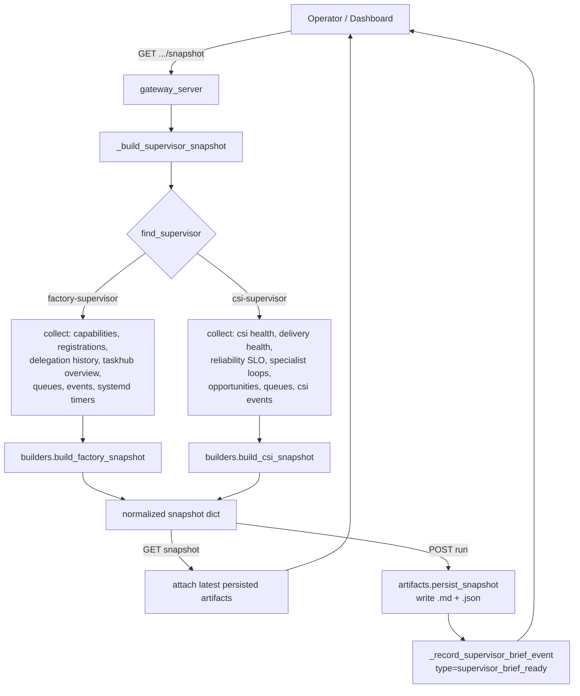

# Mission Control Intelligence

The operator-facing intelligence surface for Mission Control is built on **supervisor
snapshots** — bounded, on-demand health briefs assembled from live runtime state. The
package `src/universal_agent/supervisors/` is a small, pure-Python synthesis layer: it
takes already-collected runtime facts (queue health, fleet registrations, CSI delivery
metrics, SLO rollups) and produces a normalized snapshot dict with KPIs, diagnostics,
severity, and recommended operator actions. The gateway wires these builders to dashboard
HTTP endpoints and persists snapshots as durable Markdown + JSON artifacts.

> **History note.** The older "Operator Brief" panel and its `/api/v1/dashboard/situations`
> endpoint were removed in Phase 8 (2026-05-04). That endpoint no longer exists in the
> codebase (grep returns nothing). The supervisor-snapshot system described here is the
> on-demand operator brief surface that replaced it.

## Scope boundary (read this first)

This doc covers the **supervisor-snapshot** layer in `src/universal_agent/supervisors/` —
the on-demand, operator-triggered health briefs for `factory-supervisor` and
`csi-supervisor`. That is the code path named in this doc's spec (`code_paths:
src/universal_agent/supervisors/`).

There is a **separate, larger** subsystem also called "Mission Control" — the always-on,
three-tier intelligence stack (mechanical tiles → LLM narrative cards → Chief-of-Staff
synthesis) backed by `services/mission_control_intelligence_sweeper.py`,
`mission_control_tiles.py`, `mission_control_cards.py`, `mission_control_tier1.py`,
`mission_control_chief_of_staff.py`, etc., served by ~15 `dashboard_mission_control_*`
gateway endpoints and the `/dashboard/mission-control` frontend. That stack is alive in
production (verified: 8 `mission_control_*` service modules present), runs a 60s sweeper
loop, and is bound to a dedicated `glm-4.7` model lane via `UA_MISSION_CONTROL_MODEL`. It is
**not** the same code as the `supervisors/` package and is **not** documented here. If you
came looking for the tier-0/1/2 tile-and-card system, that is a different doc/subsystem; this
doc is strictly the supervisor-snapshot briefs.

The two are complementary: the tier-stack is the always-on operator dashboard; the
supervisor snapshots are point-in-time, headquarters-only health briefs you pull (and
optionally persist as artifacts) on demand.

## What the supervisors package is

`supervisors/` has four modules and no internal state of its own:

| Module | Role |
|---|---|
| `registry.py` | Static list of known supervisors (`SUPERVISOR_REGISTRY`) + lookup helpers. |
| `builders.py` | Pure functions that turn runtime facts into a normalized snapshot dict. |
| `artifacts.py` | Render snapshot → Markdown, persist Markdown + JSON to disk, list prior runs. |
| `__init__.py` | Re-exports the public surface. |

There are exactly **two supervisors** registered (`registry.py::SUPERVISOR_REGISTRY`):

- `factory-supervisor` — `scope: "fleet"`, `default: True`. Fleet/queue/heartbeat health.
- `csi-supervisor` — `scope: "intelligence"`. CSI source/delivery/SLO health.

Both are `enabled: True`. `supervisor_registry()` returns shallow copies of the rows;
`find_supervisor(id)` does a case-insensitive, whitespace-trimmed lookup and returns a copy
or `None`.

> **Don't confuse these with the `.claude/agents/` sub-agents of the same name.** There are
> sub-agent definitions at `.claude/agents/csi-supervisor.md` and
> `.claude/agents/factory-supervisor.md`. Those are Claude Code helper sub-agents. The
> supervisors described in *this* doc are the snapshot **builders** in
> `src/universal_agent/supervisors/` — a different thing. The snapshot builders are invoked
> synchronously by gateway endpoints, not by a heartbeat-driven principal.

## Snapshot shape

Both builders return the same envelope (`builders.py::build_factory_snapshot`,
`build_csi_snapshot`):

```json
{
  "status": "ok",
  "supervisor_id": "factory-supervisor",
  "generated_at": "<iso8601 utc>",
  "summary": "Factory snapshot | dispatch eligible 12 | ...",
  "severity": "info | warning | critical",
  "kpis": { ... },
  "diagnostics": { ... },
  "recommendations": [ { "action", "rationale", "endpoint_or_command", "requires_confirmation" } ],
  "artifacts": { "markdown_path": "", "json_path": "" }
}
```

The builders set `artifacts` to empty strings; the gateway fills them in afterward (either
the latest persisted run, or freshly persisted paths on a `run`).

### Severity is rule-based, not LLM-judged

Severity is computed by deterministic thresholds in the builders — there is no LLM call in
this package. Worth knowing the exact gates because they drive operator alerting:

**Factory** (`build_factory_snapshot`):
- `critical` if any of: `offline_fleet_count > 0`, `dispatch_eligible >= 40`, `backlog_open >= 80`.
- `warning` if any of: `stale_count > 0`, `offline_local_count > 0`, `open_csi_incidents >= 8`, `dispatch_eligible >= 15`, `backlog_open >= 30`.
- else `info`.
- Note the LOCAL_WORKER vs fleet distinction: an offline `factory_role == "LOCAL_WORKER"`
  is only a *warning*, while any other offline factory is *critical*.

**CSI** (`build_csi_snapshot`):
- `critical` if any of: delivery `status == "degraded"`, SLO status in `{breached, failing, critical}`, `dead_letter_last_24h > 0`.
- `warning` if any of: `degraded_sources > 0`, `undelivered_last_24h > 0`, `loops_open >= 8`, `csi_task_count >= 20`.
- else `info`.

### Recommendations are templated operator actions

Each builder appends recommendation dicts when its thresholds trip — every recommendation
carries an `endpoint_or_command` (a concrete dashboard API path or env var) and a
`requires_confirmation` flag. These are static templates, not generated text. Examples:

- Factory, when `dispatch_eligible >= 15`: "Triage dispatch queue pressure…" pointing at
  `GET /api/v1/dashboard/todolist/dispatch-queue?limit=200`.
- Factory, when `effective_default_every_seconds > 900`: suggests shortening the heartbeat
  interval via `UA_HEARTBEAT_INTERVAL / UA_HEARTBEAT_MIN_INTERVAL_SECONDS`,
  `requires_confirmation: True`.
- CSI, when `csi_task_count >= 20`: "Reduce CSI-to-TaskHub conversion…",
  `requires_confirmation: True`.

## How the gateway assembles a snapshot

The builders are pure — they take facts as kwargs and do no I/O. All collection happens in
`gateway_server.py::_build_supervisor_snapshot`, which gathers live state and dispatches on
`supervisor_id`:

**Factory** gathers: factory capabilities (`_factory_capabilities_payload`), registrations
(`_factory_registrations_snapshot(limit=500)`), recent delegation history
(`_recent_delegation_history(limit=50)` — last 50 `vp_missions` rows from the runtime DB),
Task Hub overview + agent/dispatch queues (`_task_hub_supervisor_snapshot`), activity events,
and systemd timers (`_system_timers_snapshot` — shells out to `systemctl list-timers
--all --output=json`, 10s timeout, returns `[]` on any failure).

**CSI** gathers (by `await`-ing other dashboard endpoint handlers directly):
`dashboard_csi_health()`, `dashboard_csi_delivery_health()`, `dashboard_csi_reliability_slo()`,
`dashboard_csi_specialist_loops(limit=50)`, `dashboard_csi_opportunities(limit=8)`, the agent
queue, Task Hub overview, and CSI-domain activity events
(`_query_activity_events(source_domain="csi")`).



## HTTP endpoints

All four endpoints require `_require_ops_auth(request)` **and**
`_require_headquarters_role_for_fleet()` — the latter raises `403` unless
`FACTORY_ROLE` resolves to headquarters (`_FACTORY_POLICY.is_headquarters`). So supervisor
intelligence is a headquarters-only surface; satellite/worker factories get `403`.

| Method + path | Handler | Behavior |
|---|---|---|
| `GET /api/v1/dashboard/supervisors/registry` | `dashboard_supervisors_registry` | Returns `supervisor_registry()`. |
| `GET /api/v1/dashboard/supervisors/{id}/snapshot` | `dashboard_supervisor_snapshot` | Builds a fresh snapshot, attaches the **latest already-persisted** artifacts (does not persist). |
| `POST /api/v1/dashboard/supervisors/{id}/run` | `dashboard_supervisor_run` | Builds a snapshot, **persists** it to disk, attaches the new artifact paths, emits a `supervisor_brief_ready` activity event. Optional body `{ "reason": "..." }`. |
| `GET /api/v1/dashboard/supervisors/{id}/runs?limit=25` | `dashboard_supervisor_runs` | Lists prior persisted runs (most recent first). |

Unknown `supervisor_id` → `404`. The difference between `snapshot` (read-only, cheap) and
`run` (persists + emits event) matters: only `run` produces a durable artifact and a
dashboard event.

## Artifact persistence

`artifacts.py::persist_snapshot` writes two files per run under the artifacts root:

```
<artifacts_root>/supervisor-briefs/<supervisor_id>/<YYYY-MM-DD>/<ts>_<nonce>.md
<artifacts_root>/supervisor-briefs/<supervisor_id>/<YYYY-MM-DD>/<ts>_<nonce>.json
```

where `<ts>` is `%Y%m%dT%H%M%SZ` (UTC) and `<nonce>` is an 8-char uuid4 hex. The Markdown is
rendered by `render_markdown_snapshot` (Supervisor Brief heading, KPI list, diagnostics JSON
block, numbered recommendations, and a full machine-readable JSON block). The JSON is the raw
snapshot.

The artifacts root comes from `ARTIFACTS_DIR = resolve_artifacts_dir()` in the gateway — the
canonical resolver (`artifacts.py:resolve_artifacts_dir`, default `<repo-root>/artifacts`),
**not** `AGENT_RUN_WORKSPACES`. The gateway converts on-disk paths into dashboard storage hrefs
via `_supervisor_artifacts_payload`, which adds `*_rel_path` and `*_storage_href` fields
pointing into the storage-explorer UI.

`list_snapshot_runs` globs `*.json` under the supervisor's brief dir, sorts by mtime
descending, clamps the limit to `[1, 200]`, and reads each JSON for `generated_at`/`severity`/
`summary` (falling back to file mtime if the JSON is missing those keys or fails to parse).

## Activity event

A successful `run` calls `_record_supervisor_brief_event`, which persists a system activity
event:

```
type: "supervisor_brief_ready"
payload: { supervisor_id, severity, summary, generated_at, artifacts, reason }
```

This is how the dashboard / downstream consumers learn a fresh brief is available. Note that
`GET .../snapshot` does **not** emit this event — only `POST .../run` does.

## Gotchas

- **Headquarters-only.** Every supervisor endpoint is gated by
  `_require_headquarters_role_for_fleet()`. On a non-HQ factory role these return `403`, not
  empty data.
- **`snapshot` vs `run`.** `GET .../snapshot` is read-only and attaches the *previously*
  persisted artifacts; it never writes. Only `POST .../run` persists a new artifact and emits
  the `supervisor_brief_ready` event. If you expected a snapshot view to leave a durable trace,
  it won't.
- **Builders never persist.** The builders set `artifacts.markdown_path`/`json_path` to empty
  strings; persistence and href-mapping are entirely the gateway's job. Calling a builder in
  isolation produces no files.
- **Severity thresholds are hardcoded.** They live in `builders.py`, not in any env var or
  config. Changing alert sensitivity is a code change. There is no LLM in this path.
- **systemd timers can be silently empty.** `_system_timers_snapshot` shells out to
  `systemctl` and returns `[]` on any error or timeout (10s). Off the VPS (e.g. local dev),
  `timers_reported` in the factory diagnostics will commonly be `0` — that is not a fault.
- **CSI builder depends on other dashboard handlers.** It `await`s `dashboard_csi_health()`
  et al. directly. If those CSI endpoints change shape, the CSI snapshot's KPIs degrade
  gracefully (defensive `_as_dict`/`_as_list`/`_safe_int` coercion) rather than erroring, so a
  malformed upstream can produce a quietly-empty snapshot rather than a `500`.
- **Operator Brief / `/situations` is gone.** Removed Phase 8 (2026-05-04). Don't reintroduce
  references to `/api/v1/dashboard/situations` — it no longer exists.
