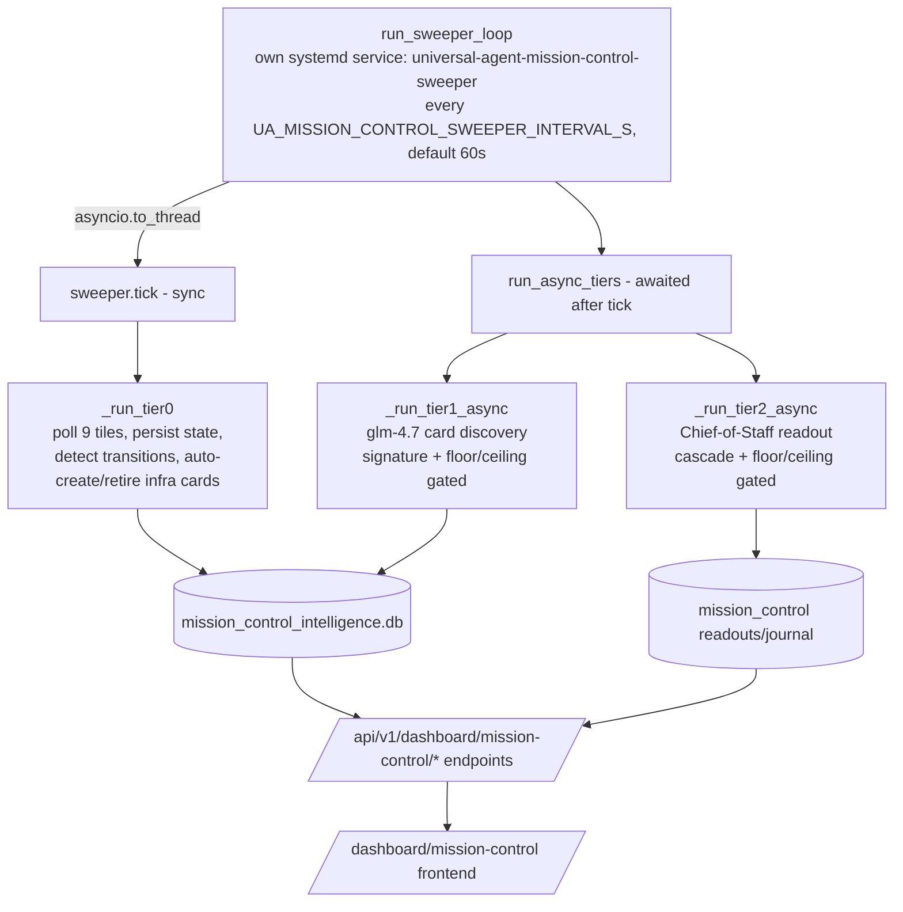
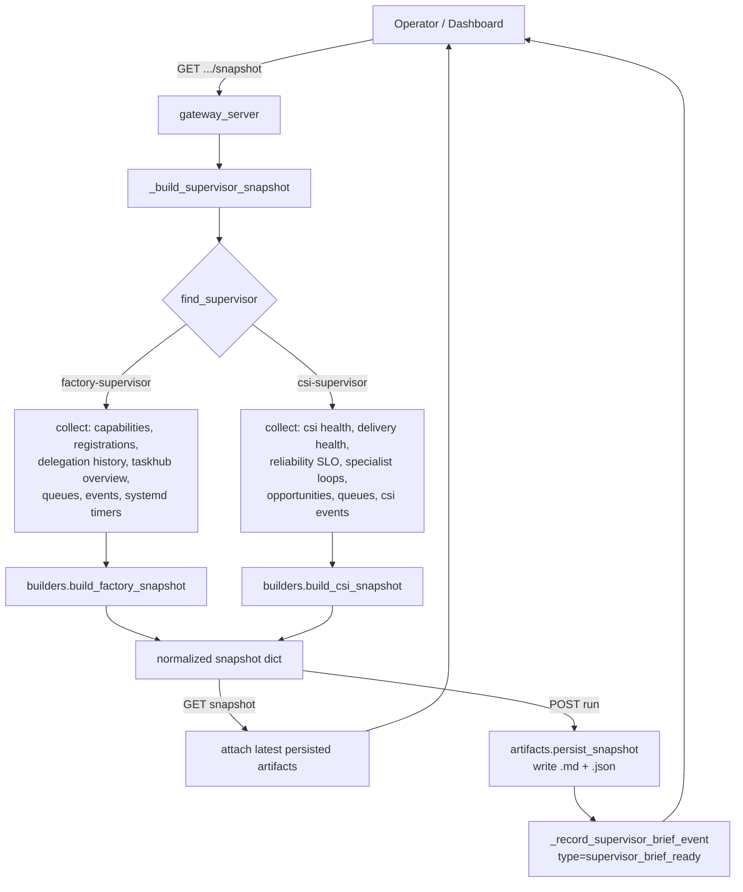

# Mission Control Intelligence

"Mission Control" is **two distinct, complementary surfaces** that both produce
operator-facing intelligence about the autonomous fleet. Both live in this doc:

1. **The always-on tiered intelligence stack** — a 60-second backend sweeper that drives a
   three-tier model (mechanical traffic-light *tiles* → LLM narrative *cards* →
   Chief-of-Staff *readout*), persisted in a dedicated `mission_control_intelligence.db`
   and served by the `/api/v1/dashboard/mission-control/*` endpoints under the
   `/dashboard/mission-control` frontend. This is the live "operator dashboard" surface.
2. **The supervisor-snapshot briefs** — bounded, on-demand, headquarters-only health briefs
   for `factory-supervisor` and `csi-supervisor`, built by the pure-Python
   `src/universal_agent/supervisors/` package and persisted as Markdown + JSON artifacts.
   These are point-in-time pulls, not a continuous loop.

They share a name and a goal (operator situational awareness) but **do not share code or a
database.** The tiered stack is `services/mission_control_*.py`; the supervisor briefs are
`supervisors/*.py`. Part 1 below covers the tiered stack; Part 2 covers the supervisor
snapshots.

> **History note.** The older "Operator Brief" panel and its `/api/v1/dashboard/situations`
> endpoint were removed in Phase 8 (2026-05-04). That endpoint no longer exists in the
> codebase (grep returns nothing). Both surfaces below replaced it.

---

# Part 1 — The tiered intelligence stack (always-on)

## Mental model: three tiers + a sweeper

The tiered stack is a rollout-phased system gated by `UA_MC_PHASE_<N>_ENABLED` flags
(`mission_control_db.py::is_phase_enabled` — phase 0 is always on; phases 1–8 require the
matching env flag). A single backend loop, the **sweeper**, drives all three tiers:

| Tier | What it is | Cost | Module |
|---|---|---|---|
| **Tier 0** | 9 mechanical traffic-light **tiles** (green/yellow/red/unknown). Polled every tick, near-zero compute. | none (pure SQL) | `mission_control_tiles.py` |
| **Tier 1** | LLM-discovered narrative **cards** — "what the system is doing/producing", surfaced from bundled evidence. | one `glm-4.7` call, signature-gated | `mission_control_tier1.py` |
| **Tier 2** | The Chief-of-Staff **readout** — a single synthesized operator brief over all evidence + cards. | one LLM call, cascade-gated | `mission_control_chief_of_staff.py` |

A separate Phase-7 concern, **smart event titles**, sits alongside the tiers and rewrites
the noisy `/dashboard/events` feed (`mission_control_event_titles.py`).



## The sweeper

`mission_control_intelligence_sweeper.py::MissionControlSweeper` is the orchestration core.
A process-wide singleton (`get_sweeper`) runs `run_sweeper_loop(stop_event)` as its own
**long-lived systemd service**, `universal-agent-mission-control-sweeper.service`
(`Type=simple`; entrypoint `mission_control_sweeper_main.py::main` → `_run`) — **not** as a
gateway `lifespan` task. It was relocated out of the gateway in S5 Phase B (see
`06_platform/08_scheduling_substrate_adr.md`, Decision 2) so its multi-GB `tick()` can never
block the gateway/heartbeat event loop and a gateway deploy no longer kills the
Chief-of-Staff readout. The launcher calls `infisical_loader.py::initialize_runtime_secrets`
**first** so the tier-1/tier-2 LLM lane has its keys, then drives the unchanged loop until
SIGTERM. The service restarts on each deploy to pick up new code, but the durable
`__tier1_meta__` / `__tier2_meta__` cadence sentinels (written by
`MissionControlSweeper._write_tier1_meta` / `_write_tier2_meta`) survive the restart, so the
floor/ceiling clock is **not** reset — the win is process isolation, not deploy-immunity.
When `UA_MC_PHASE_1_ENABLED` is unset the launcher logs and idles (awaiting SIGTERM) without
starting the loop at all — mirroring the gateway's old start-guard. The sweeper
remains strictly **observational** — its only writes are tile colors
(`mission_control_tile_states`), tier-1 cards, and the tier-2 readout — and it reads durable
DB state (`durable/db.py::get_activity_db_path`), never gateway in-process memory.

Cadence and gating come from `SweeperConfig` (`SweeperConfig.from_env`), all env-overridable:

| Field | Env var | Default |
|---|---|---|
| `interval_seconds` | `UA_MISSION_CONTROL_SWEEPER_INTERVAL_S` | `60.0` |
| `tier1_floor_seconds` | `UA_MISSION_CONTROL_TIER1_FLOOR_S` | `600.0` |
| `tier1_ceiling_seconds` | `UA_MISSION_CONTROL_TIER1_CEILING_S` | `3600.0` |
| `tier2_floor_seconds` | `UA_MISSION_CONTROL_TIER2_FLOOR_S` | `600.0` |
| `tier2_ceiling_seconds` | `UA_MISSION_CONTROL_TIER2_CEILING_S` | `3600.0` |
| `lane_concurrency` | `UA_MISSION_CONTROL_LANE_CONCURRENCY` | `1` |
| `auto_remediation_enabled` | `UA_MISSION_CONTROL_AUTO_REMEDIATION` | `False` |

> **Cadence widened 2026-06-12 (LLM-efficiency pass).** Floors `180/120 → 600` and ceilings
> `1800 → 3600`. A live audit found Mission Control was the **single largest ZAI consumer on the
> box** (~22 calls/hr, ~47% of box ZAI call volume; ~125K-token tier-1 + ~88K-token tier-2 prompts,
> 24/7) and a structural source of Fair-Usage `1313`/429 pressure. The wider cadence roughly halves
> the steady-state call rate with no operator-visible loss (force-refresh still bypasses cadence).
> Code defaults in `SweeperConfig`, NOT `.env` (deploys wipe the VPS `.env`).

> **Dormancy gate (2026-06-12).** The LLM passes (`run_async_tiers` → tier-1 + tier-2) now observe
> the 6am–10pm Houston active window via `mission_control_intelligence_sweeper.py::mission_control_llm_should_run`
> (→ `dormancy.py::should_run`). Outside the window `run_async_tiers` returns early with a `dormant:`
> `skipped_reason` and burns **zero** ZAI calls — Mission Control is operator-facing content nobody
> reads overnight. The cheap sync `tick()` (tier-0 tiles) is **not** gated, so tile state stays fresh;
> only new tier-1 cards / tier-2 readouts pause. The operator Refresh button (`force_refresh_async`)
> **bypasses** the gate. Opt out / run 24/7 with `UA_MISSION_CONTROL_24_7=true`.

Each loop iteration:
1. Runs the **sync** `tick()` on a worker thread via `asyncio.to_thread`. This is
   load-bearing: `tick()` queries `activity_state.db` (multi-GB in prod) across nine tiles
   inside `_run_tier0`; running that sync SQLite work directly on the asyncio loop blocked
   the gateway for 15–30s and produced the "Gateway unreachable" banner. The
   `to_thread` offload is the fix (a `CRITICAL` comment in `run_sweeper_loop` documents the
   2026-05-26 regression). `tick()` short-circuits with `skipped_reason="phase_1_not_enabled"`
   if Phase 1 is off, and **never raises** — all tier handlers catch their own exceptions.
2. If `tick()` wasn't skipped, awaits `run_async_tiers(result)` for the LLM-driven passes.

### Tier 0 inside `tick()`

`_run_tier0` opens the MC store (`open_store`) plus an activity-DB connection
(`_open_activity_db`), then for each tile from `all_tiles()`:
- `tile.compute_state(conn)` → a `TileState` (color + one-line status + evidence +
  deterministic signature). A buggy tile is caught and recorded in `result.errors` so it
  can't take out the whole cycle. Most tiles read the shared activity-DB `conn`; a tile
  whose data lives elsewhere ignores `conn` and opens its own short-lived connection —
  `CsiIngesterTile` reads `csi.db` (see Tier 0 tiles below).
- `_persist_tile_state` writes the new state into `mission_control_tile_states`, returning
  an outcome with `transitioned` / `first_appearance` / `signature_unchanged` flags. If the
  signature is unchanged it only bumps `last_checked_at` and skips transition logic.
- **Invariant maintenance:** a yellow/red tile must have a live `infrastructure` card; a
  green tile must NOT have a stale one. `_auto_create_infrastructure_card` creates/refreshes
  the card on transition/first-appearance/missing-card-backfill; `retire_card` retires the
  paired card when the tile returns to green. This green-retirement step exists because a
  2026-05-04 production bug left a "CSI Ingester Silent 48h" card immortal after the tile
  recovered, poisoning the Chief-of-Staff brief. Tier-1 explicitly refuses to retire
  infrastructure cards (they're "owned by tier-0"), so tier-0 must do it.

### Async tiers (`run_async_tiers`)

`run_async_tiers` runs tier-1 (gated on `UA_MC_PHASE_2_ENABLED`) then tier-2
(unconditional — the Chief-of-Staff service predates the sweeper, so the sweeper only adds
cadence on top). The **cascade contract** (Phase 3.5): on a given tick tier-1 fires first;
if it produces cards, tier-2 sees them on the *same* tick (no 30-min lag).

**Tier-1** (`_run_tier1_async`): collects evidence (`collect_tier1_evidence` — see below),
hashes it (`evidence_signature`), and decides whether to call the LLM via
`_tier1_skip_reason`:
- skip if signature unchanged AND last call within `tier1_ceiling_seconds`;
- skip if signature changed BUT last call within `tier1_floor_seconds` (rate-limit, defer);
- otherwise call `discover_tier1_cards`, then `apply_tier1_discovery`.

It **always** writes a `__tier1_meta__` sentinel row (`_write_tier1_meta`) on every path —
success, skip, or exception — so the diagnostics endpoint can show exactly what happened on
the last attempt instead of a bare `null`. The sentinel is stored as a row in
`mission_control_tile_states` with `tile_id='__tier1_meta__'`. Its `state_since` column means
**last actual FIRE**, not last attempt: `_run_tier1_async` reads it back as `prior_synth_iso`
for `_tier1_skip_reason`'s floor/ceiling clock, so only the real-fire path passes
`advance_fire_ts=True` to `_write_tier1_meta`; skip/error writes pass `advance_fire_ts=False`
and preserve the prior `state_since` while still refreshing the diagnostic columns.
`last_signature` is still updated on every write — signature tracking is independent of
fire-time.

**Tier-2** (`_run_tier2_async`): decides via `_tier2_cascade_reason` (tier-0 transitions, or
tier-1 produced new cards) and `_tier2_skip_reason` (first-run always; floor protection;
ceiling-driven idle refresh; else only on a cascade signal), then calls the Chief-of-Staff
`generate_and_store_readout`. Also writes a `__tier2_meta__` sentinel row via
`_write_tier2_meta`, with the **same fire-time-vs-attempt-time discipline** as tier-1:
`state_since` advances only on a real synthesis (`advance_fire_ts=True`) and is preserved on
skip/error.

When the Chief-of-Staff ZAI call fails, `synthesize_readout` records the throttle signal
against the shared `ZAIRateLimiter` via `_record_throttle` (added 2026-06-11), **429-shape
first**. Empirically (verified on the VPS 2026-06-11) ZAI returns its account-level
Fair-Usage throttle *as a 429* whose body **also** carries the `[1313] ... Fair Usage Policy`
text — 1058/1058 logged 429s matched `rate_limiter._is_fup_error`. So a naive "FUP-text wins"
rule would record **every** ordinary throttle as a FUP signal and the watchdog's no-grace
CRITICAL FUP tier would page continuously. Therefore the 429-shape check comes first: any
429/rate-shaped error records via `record_429` (the retryable tier) **even if** its text also
matches `_is_fup_error`; `record_fup_signal` (the STOP / account-cliff tier) is reserved for a
genuine **non-429** Fair-Usage signal (e.g. a 403 suspension/flag with no 429 marker).

This is what makes the **idle-refresh ceiling actually reachable** — a skip no
longer resets the age clock to ~0 on every 60 s sweep, so on an otherwise-idle system (no
tier-0 flip, no new tier-1 cards) `age_s` climbs until it crosses `tier2_ceiling_seconds`
(default **3600 s** — widened on 2026-06-12, see the cost callout below) and
`_tier2_skip_reason` returns `None`, forcing a refresh.

> **Cost ⇄ freshness tradeoff (`tier2_ceiling_seconds`) + model lane.** Each tier-2 fire is a full
> Chief-of-Staff LLM synthesis: `synthesize_readout` runs at
> `os.getenv("UA_MISSION_CONTROL_COS_MODEL") or resolve_mission_control_model()` over the whole
> evidence+cards bundle (`max_tokens=18000`, ~88K input tokens/call). Tier-2 has **no**
> evidence-signature gate (unlike tier-1), so a fully idle system re-synthesizes every
> `tier2_ceiling_seconds` even when nothing has changed.
>
> **Model consolidation (2026-06-12).** Tier-2 was moved **off** the opus/flagship tier
> (`resolve_model("opus")` → glm-5.1/glm-5-turbo) **onto the dedicated Mission Control lane**
> (`resolve_mission_control_model` → `glm-4.7`) — the same high-concurrency direct-model lane tier-1
> already uses, which **bypasses the haiku/sonnet/opus ZAI tier map**. Rationale: the opus-tier
> readout shared the sonnet/opus lane and contended with the main agent calls (Simone / Cody /
> convergence); consolidating all of Mission Control onto glm-4.7 isolates it off that flagship lane.
> The trade is a modest synthesis-quality step down (glm-4.7 is older/weaker than glm-5-turbo) and
> higher latency (~45 s/readout) — both irrelevant for a background panel nobody watches in real time.
> The `UA_MISSION_CONTROL_COS_MODEL` override still wins if pinned, but should be **unset** in
> Infisical so the code default (glm-4.7) takes effect (a prior `UA_MISSION_CONTROL_COS_MODEL=glm-5-turbo`
> Infisical override was the reason live readouts recorded glm-5-turbo while the opus map said glm-5.1).
>
> The ceiling was **raised 300 s → 1800 s (2026-06-11) → 3600 s (2026-06-12)** plus the cadence floor
> widened to 600 s as a ZAI Fair-Usage `1313`/429 pressure cut (Mission Control was the box's single
> largest ZAI consumer; see the cadence note above). A force-refresh still bypasses the cadence on
> demand. One further calibration lever remains (operator's call, tracked as a proposed phase below):
> add a tier-2 evidence-signature gate so idle re-synthesis fires only when the bundle actually changed
> OR the ceiling is hit.

> **History note (2026-06-05, S3).** The Chief-of-Staff readout had been **frozen** —
> ~1 readout/24 h — because `_write_tier2_meta`/`_write_tier1_meta` stamped
> `state_since = now` on *every* write, including skips. That reset the idle-age clock each
> sweep so the `age_s >= tier2_ceiling_seconds` branch of `_tier2_skip_reason` was dead and
> only a genuine cascade (rare on an idle system) ever refreshed the brief. The fix decoupled
> last-FIRE from last-ATTEMPT via `advance_fire_ts` (above); it did **not** change the
> ceiling/floor values.

### Operator force-refresh

`force_refresh_async(progress=...)` bypasses all cadence gating: runs tier-0, then tier-1
(`force=True`), then tier-2 (`force=True`), emitting `cards_running` → `readout_running` →
`completed`/`failed` progress callbacks. **Tier-1 failure short-circuits** — tier-2 is not
run, because synthesizing from stale cards would re-stale the operator brief (the exact bug
this guards). Never raises; returns a summary dict the gateway's in-memory job tracker
renders. This backs the async `POST /refresh` endpoint.

## The dedicated database (`mission_control_db.py`)

The tiered stack has its **own** SQLite DB, separate from the runtime/activity DBs:
`mission_control_intelligence.db` under `AGENT_RUN_WORKSPACES` (overridable via
`UA_MISSION_CONTROL_INTEL_DB_PATH` / `UA_WORKSPACES_DIR`). `open_store` opens it
WAL-journaled, autocommit, and calls `ensure_schema` on every connect (idempotent). Four
tables:

| Table | Purpose |
|---|---|
| `mission_control_tile_states` | Tier-0 tile state per `tile_id`, plus the `__tier1_meta__` / `__tier2_meta__` sentinel rows. Color CHECK-constrained to green/yellow/red/unknown. |
| `mission_control_cards` | Tier-1 narrative cards. `UNIQUE(subject_kind, subject_id)` gives identity continuity; `current_state ∈ live/retired/archived`; stores `synthesis_history_json`, `operator_feedback_json`, `dispatch_history_json`, `recurrence_count`. |
| `mission_control_dispatch_history` | Long-form audit trail of card action-button dispatches. |
| `event_title_templates` | Phase-7 LLM-generated title template cache, keyed `UNIQUE(event_kind, metadata_shape_signature)`. |

The Chief-of-Staff readout itself lives in a **fifth/sixth** table pair
(`mission_control_readouts` + `mission_control_journal`) in a *different* store —
`mission_control_chief_of_staff.py::ensure_schema` — not in `mission_control_db.py`.

The schema enforces a **no-truncation contract**: all operator-facing free-form text is
unbounded TEXT. Storage management is a retention-boundary concern, not a collection-time
one.

## Tier 0 — the tiles (`mission_control_tiles.py`)

`all_tiles()` returns fresh instances of the nine tile classes in `_ALL_TILE_CLASSES`, in
stable display order: `GatewayTile`, `DatabaseTile`, `CsiIngesterTile`, `CronPipelinesTile`,
`HeartbeatDaemonTile`, `TaskHubPressureTile`, `ModelUsageTodayTile`, `ProactivePipelineTile`,
`VPAgentHealthTile`. Each subclasses `Tile` and implements `compute_state(conn) -> TileState`.

Design contract for every tile: stable `name` (the tile_states PK), cheap (runs every 60s),
and **defensive** — a missing data source returns `unknown`, never raises. A tile may also
expose `auto_action_class()` (surfaced to the frontend for the tile's action button).
`TileState.__post_init__` validates the color and auto-derives the deterministic `signature`
(SHA-256 of color+status+evidence) used for change detection.

`CsiIngesterTile` is the one tile that does **not** read the sweeper-supplied
activity_state.db connection. It opens its own short-lived **read-only** connection to
`csi.db` (path via `CSI_DB_PATH`, mirroring `gateway_server.py::_csi_default_db_path`) and
computes per-source freshness from `MAX(occurred_at)` in the `events` table — reusing the
invariant's `csi_source_liveness.py::effective_source_thresholds` so the tile and
`proactive_health`'s `csi_source_liveness` finding agree by construction (green ⇔ no source
stale; red ⇔ all sources stale; yellow ⇔ some stale). Before 2026-06-04 it queried
`activity_events WHERE source_domain='csi'` from the activity DB — a table fed only by the
now-disabled ClaudeDevs intel-sync (`claude_code_intel.py`) — so it false-RED for days while
`csi.db` was healthy, driving the recurring `infra:csi_ingester` card and the Chief-of-Staff
"CSI ingester blind for 62h" narrative. Because tier-0 auto-retires the `infra:csi_ingester`
card the moment the tile reads green, repointing the tile to `csi.db` also clears that stale
card on the next sweep.

`GatewayTile` derives liveness from `MAX(created_at)` in `activity_events` (within a 15-min
window): green ≤120s, yellow ≤300s, red >300s. A deploy (or operator `systemctl restart`)
SIGTERMs the gateway and pauses activity-event emission for the 300–515s it takes the new
process to boot and emit its first heartbeat, so the freshest event is briefly >300s old —
which would flag RED → a critical `infra:gateway` card whose `recurrence_count` then climbs
once per deploy (~19/day). That mechanism produced the "Gateway silence — 264 recurrences
since May 3" Chief-of-Staff readout: a **cumulative tally of deploy restarts mislabeled
critical**, not an outage (each restart self-recovers the moment the heartbeat loop starts).
As of 2026-06-04, `mission_control_tiles.py::_gateway_silence_is_restart_artifact` suppresses
a would-be-RED gap to **green** ("recovering from restart"; raw verdict preserved in evidence
as `restart_recovery`/`suppressed_color`) when the silence brackets a recent restart. Two
OR'd signals, reusing the canonical deploy-window primitives: (1)
`cron_service.py::_is_deploy_window_active` (the `/tmp/ua-deployment-window` flag held across
the restart by `remote_deploy.sh`, OR'd with a ≤60s process-uptime fallback), and (2) the
freshest event predates **this** gateway process's start (`cron_service.py::_process_start_time`)
— meaning the current process has emitted nothing yet, so the silence is entirely the restart
gap. Signal (2) is load-bearing: the sweeper loop's first `tick()` only runs after its
`interval` wait (default 60s) once its own service has (re)started, so the first sweep that
catches the gap usually runs once the deploy-window flag has already cleared and signal (1)
is False. A genuine
running-but-silent gateway — last event *after* the process start with no active deploy
window (e.g. a hung event loop) — falls through to RED and still alarms. Fail-loud: any probe
error is treated as "not a restart artifact" so a real outage is never masked. Because tier-0
auto-retires the `infra:gateway` card the moment the tile reads green, the suppression also
clears any card a deploy-restart already minted on the next sweep.

## Tier 1 — narrative cards (`mission_control_tier1.py` + `mission_control_cards.py`)

**Evidence collection** (`collect_tier1_evidence`) builds a bounded-but-untruncated bundle:
active/attention Task Hub items, recently-completed tasks (7 days), mission summaries (when
`task_hub_missions_enabled()`), operator-relevant `activity_events`, the tier-0 tile
snapshot, and the prior pass's live cards (fed back so the LLM can re-emit them with the same
`subject_id` for continuity). The tile snapshot query excludes the `__tierN_meta__` sentinel
rows (`WHERE substr(tile_id,1,2) != '__'`) — those are sweeper cadence bookkeeping, not real
tiles, and must not leak into the LLM prompt or the evidence signature. Counts are bounded;
individual text fields are never shortened.
`evidence_signature` hashes only the *identity* of bundle items (task_id/status, event id,
tile_id+state, subject_id+severity) — excluding volatile timestamps — so two bundles with the
same identifying set hash equal and the sweeper skips the LLM.

**LLM discovery** (`discover_tier1_cards`): calls the `glm-4.7` lane
(`resolve_mission_control_model`, default `glm-4.7`; timeout from
`mission_control_call_timeout_seconds()`) with `_llm_prompt`. The prompt prioritizes
*intelligence wins* (work produced) over status noise, enforces an identity contract
(every card has a stable `subject_id` of a known kind), and accepts an empty list when the
system is calm. API key resolves from `ANTHROPIC_API_KEY` / `ANTHROPIC_AUTH_TOKEN` /
`ZAI_API_KEY`; with a ZAI key it points `base_url` at `https://api.z.ai/api/anthropic`. Any
failure (no key, rate-limit, parse error) returns `([], model)` — treated as "skip", never a
crash. `_card_upsert_from_llm` validates `subject_kind`/`severity` against the schema
vocabularies before building a `CardUpsert`.

**Persistence** (`mission_control_cards.py`): `upsert_card` keys on `make_card_id` (SHA-256
of `subject_kind|subject_id`). New subject → INSERT live with `recurrence_count=1`; existing
live → UPDATE and push the prior narrative into `synthesis_history_json` (capped at 10);
retired/archived → revive to live and increment `recurrence_count`. `apply_tier1_discovery`
upserts the LLM's cards and **auto-retires** any prior live card the LLM didn't re-emit —
except `infrastructure` cards (owned by tier-0). Card reads: `list_live_cards` (severity-then-
recurrence ordered) for the live grid; `list_ledger_cards` + `ledger_summary` for the
retired/archived **Knowledge Ledger** (Phase 6).

**Operator feedback** lives on the card as `operator_feedback_json`:
`set_card_thumbs`, `snooze_card` (`1h/4h/1d/1w`, auto-revives on expiry), `add_card_comment`
(never truncated; feeds future synthesis), `mark_card_viewed` (per-user JSON). **Dispatch**:
`append_dispatch_history` writes both the long-form audit table and a capped in-card mirror,
with two actions — `prompt_generated_for_external` (no Task Hub side effect) and
`dispatched_to_codie` (creates a Task Hub item). Prompts are built by
`mission_control_prompts.py::build_prompt` (`delivery_mode ∈ {external_ai_coder, codie}`).

## Tier 2 — Chief-of-Staff readout (`mission_control_chief_of_staff.py`)

The Chief-of-Staff predates the sweeper; the sweeper just drives it on cadence.
`collect_evidence_bundle` gathers Task Hub, activity, tutorial, CSI, workspace-artifact, and
(Phase-3, card-aware) mission-control-card evidence. `synthesize_readout` calls the COS model
and `persist_readout` writes a row into `mission_control_readouts` plus a journal entry into
`mission_control_journal`. `generate_and_store_readout` is the one-shot the sweeper calls;
`get_latest_readout` / `get_recent_journal` are the read side. On LLM failure
`fallback_readout` produces a code-only readout so the surface never goes blank.

## Event titles + smart filter (Phase 7 — `mission_control_event_titles.py`)

Independent of the tier loop, this module de-noises the activity-events feed:
- `metadata_shape_signature` hashes an event's metadata **key+type structure** (not values),
  so all events of one shape share a template cache key.
- `generate_template_via_llm` (the `glm-4.7` lane) designs a one-line `{key}`-placeholder
  title template per `(event_kind, shape)`; `store_template` / `get_cached_template` cache it
  in `event_title_templates`. Subsequent same-shape events render deterministically at zero
  LLM cost via `apply_template` (a deliberately Jinja-*lite* `{key}` substituter — no
  templating dependency, no injection surface from LLM output).
- `hide_by_default` is pure-Python rules deciding whether an event is routine noise
  (info heartbeat ticks with no findings, no-change cron syncs, artifact-less
  `autonomous_run_completed`, `cron_run_cancelled` restart casualties). Hidden ≠ deleted —
  the operator can toggle "Show All".
- `annotate_event` is the read-path glue: adds `smart_title` + `hide_by_default` +
  `title_template_source` to an event. It is **cache-only** — it never triggers LLM
  generation inline (that would block the events endpoint); a separate pre-warm pass fills
  the cache lazily.

## Tiered-stack HTTP endpoints

Served from `gateway_server.py`, prefix `/api/v1/dashboard/mission-control`:

| Method + path | Handler | Behavior |
|---|---|---|
| `GET /tiles` | `dashboard_mission_control_tiles` | All tier-0 tile states in `all_tiles()` order; missing rows render as `unknown`. |
| `GET /cards?limit=50` | `dashboard_mission_control_cards` | Live tier-1 cards. |
| `GET /ledger` | `dashboard_mission_control_ledger` | Retired/archived Knowledge Ledger. |
| `GET /diagnostics` | `dashboard_mission_control_diagnostics` | Phase flags, raw env echo, `tier1_meta` / `tier2_meta` sentinel rows, card counts by kind, tile-row count. The "did my env reach the process" surface. |
| `POST /diagnostics/tier1-now` | `dashboard_mission_control_tier1_now` | Synchronously force a tier-1 pass for debugging. |
| `POST /cards/{id}/thumbs` `/snooze` `/comment` `/view` `/dismiss` `/complete` | feedback handlers | Operator feedback + card lifecycle. |
| `POST /cards/{id}/generate-prompt` | `dashboard_mission_control_generate_prompt` | Build a copyable external-coder prompt; audit-logs only, no Task Hub side effect. |
| `POST /cards/{id}/dispatch-to-codie` | `dashboard_mission_control_dispatch_to_codie` | Create a Task Hub item (`target_agent=vp.coder.primary`, `source_kind=mission_control_card_dispatch`); requires `confirm:true`. |
| `POST /refresh` → `202 {job_id}` | `dashboard_mission_control_refresh` | Kicks off async `force_refresh_async`; poll the status endpoint. Replaced the old synchronous COS refresh that 502'd through the 30s Next.js proxy. |
| `GET /refresh/{job_id}` | `dashboard_mission_control_refresh_status` | Job status `queued → cards_running → readout_running → completed/failed`; `404` once FIFO-evicted. |

> [VERIFY: the tiered-stack `mission-control/*` endpoints do **not** call `_require_ops_auth`
> or the headquarters-role gate that the supervisor-snapshot endpoints (Part 2) enforce. If
> the operator dashboard is reachable without ops auth on a satellite factory, these tier
> endpoints would be readable there too. Confirm whether app-level auth middleware covers
> them before relying on them being HQ-only.]

## Relationship to `claude_code_intel`

Not part of the tiered stack. `claude_code_intel` is a separate proactive producer (a cron
job `claude_code_intel_sync` registered in the gateway, with its own
`/api/v1/dashboard/claude-code-intel*` endpoints reading packets/vault pages under
`ARTIFACTS_DIR/proactive/claude_code_intel/`). It is named here only because it surfaces on
the same dashboard; its intelligence pipeline is documented elsewhere (CSI / ClaudeDevs intel
docs), not in this Mission Control doc.

---

# Part 2 — Supervisor-snapshot briefs (on-demand)

The second surface is **supervisor snapshots** — bounded, on-demand health briefs assembled
from live runtime state. The package `src/universal_agent/supervisors/` is a small, pure-Python
synthesis layer: it takes already-collected runtime facts (queue health, fleet registrations,
CSI delivery metrics, SLO rollups) and produces a normalized snapshot dict with KPIs,
diagnostics, severity, and recommended operator actions. The gateway wires these builders to
dashboard HTTP endpoints and persists snapshots as durable Markdown + JSON artifacts.

Unlike the Part 1 tiered stack, this surface has **no continuous loop and no LLM** — severity
is rule-based, and a brief is produced only when the operator pulls one.

## What the supervisors package is

`supervisors/` has four modules and no internal state of its own:

| Module | Role |
|---|---|
| `registry.py` | Static list of known supervisors (`SUPERVISOR_REGISTRY`) + lookup helpers. |
| `builders.py` | Pure functions that turn runtime facts into a normalized snapshot dict. |
| `artifacts.py` | Render snapshot → Markdown, persist Markdown + JSON to disk, list prior runs. |
| `__init__.py` | Re-exports the public surface. |

There are exactly **two supervisors** registered (`registry.py::SUPERVISOR_REGISTRY`):

- `factory-supervisor` — `scope: "fleet"`, `default: True`. Fleet/queue/heartbeat health.
- `csi-supervisor` — `scope: "intelligence"`. CSI source/delivery/SLO health.

Both are `enabled: True`. `supervisor_registry()` returns shallow copies of the rows;
`find_supervisor(id)` does a case-insensitive, whitespace-trimmed lookup and returns a copy
or `None`.

> **Don't confuse these with the `.claude/agents/` sub-agents of the same name.** There are
> sub-agent definitions at `.claude/agents/csi-supervisor.md` and
> `.claude/agents/factory-supervisor.md`. Those are Claude Code helper sub-agents. The
> supervisors described in *this* doc are the snapshot **builders** in
> `src/universal_agent/supervisors/` — a different thing. The snapshot builders are invoked
> synchronously by gateway endpoints, not by a heartbeat-driven principal.

## Snapshot shape

Both builders return the same envelope (`builders.py::build_factory_snapshot`,
`build_csi_snapshot`):

```json
{
  "status": "ok",
  "supervisor_id": "factory-supervisor",
  "generated_at": "<iso8601 utc>",
  "summary": "Factory snapshot | dispatch eligible 12 | ...",
  "severity": "info | warning | critical",
  "kpis": { ... },
  "diagnostics": { ... },
  "recommendations": [ { "action", "rationale", "endpoint_or_command", "requires_confirmation" } ],
  "artifacts": { "markdown_path": "", "json_path": "" }
}
```

The builders set `artifacts` to empty strings; the gateway fills them in afterward (either
the latest persisted run, or freshly persisted paths on a `run`).

### Severity is rule-based, not LLM-judged

Severity is computed by deterministic thresholds in the builders — there is no LLM call in
this package. Worth knowing the exact gates because they drive operator alerting:

**Factory** (`build_factory_snapshot`):
- `critical` if any of: `offline_fleet_count > 0`, `dispatch_eligible >= 40`, `backlog_open >= 80`.
- `warning` if any of: `stale_count > 0`, `offline_local_count > 0`, `open_csi_incidents >= 8`, `dispatch_eligible >= 15`, `backlog_open >= 30`.
- else `info`.
- Note the LOCAL_WORKER vs fleet distinction: an offline `factory_role == "LOCAL_WORKER"`
  is only a *warning*, while any other offline factory is *critical*.

**CSI** (`build_csi_snapshot`):
- `critical` if any of: delivery `status == "degraded"`, SLO status in `{breached, failing, critical}`, `dead_letter_last_24h > 0`.
- `warning` if any of: `degraded_sources > 0`, `undelivered_last_24h > 0`, `loops_open >= 8`, `csi_task_count >= 20`.
- else `info`.

### Recommendations are templated operator actions

Each builder appends recommendation dicts when its thresholds trip — every recommendation
carries an `endpoint_or_command` (a concrete dashboard API path or env var) and a
`requires_confirmation` flag. These are static templates, not generated text. Examples:

- Factory, when `dispatch_eligible >= 15`: "Triage dispatch queue pressure…" pointing at
  `GET /api/v1/dashboard/todolist/dispatch-queue?limit=200`.
- Factory, when `effective_default_every_seconds > 900`: suggests shortening the heartbeat
  interval via `UA_HEARTBEAT_INTERVAL / UA_HEARTBEAT_MIN_INTERVAL_SECONDS`,
  `requires_confirmation: True`.
- CSI, when `csi_task_count >= 20`: "Reduce CSI-to-TaskHub conversion…",
  `requires_confirmation: True`.

## How the gateway assembles a snapshot

The builders are pure — they take facts as kwargs and do no I/O. All collection happens in
`gateway_server.py::_build_supervisor_snapshot`, which gathers live state and dispatches on
`supervisor_id`:

**Factory** gathers: factory capabilities (`_factory_capabilities_payload`), registrations
(`_factory_registrations_snapshot(limit=500)`), recent delegation history
(`_recent_delegation_history(limit=50)` — last 50 `vp_missions` rows from the runtime DB),
Task Hub overview + agent/dispatch queues (`_task_hub_supervisor_snapshot`), activity events,
and systemd timers (`_system_timers_snapshot` — shells out to `systemctl list-timers
--all --output=json`, 10s timeout, returns `[]` on any failure).

**CSI** gathers (by `await`-ing other dashboard endpoint handlers directly):
`dashboard_csi_health()`, `dashboard_csi_delivery_health()`, `dashboard_csi_reliability_slo()`,
`dashboard_csi_specialist_loops(limit=50)`, `dashboard_csi_opportunities(limit=8)`, the agent
queue, Task Hub overview, and CSI-domain activity events
(`_query_activity_events(source_domain="csi")`).



## HTTP endpoints

All four endpoints require `_require_ops_auth(request)` **and**
`_require_headquarters_role_for_fleet()` — the latter raises `403` unless
`FACTORY_ROLE` resolves to headquarters (`_FACTORY_POLICY.is_headquarters`). So supervisor
intelligence is a headquarters-only surface; satellite/worker factories get `403`.

| Method + path | Handler | Behavior |
|---|---|---|
| `GET /api/v1/dashboard/supervisors/registry` | `dashboard_supervisors_registry` | Returns `supervisor_registry()`. |
| `GET /api/v1/dashboard/supervisors/{id}/snapshot` | `dashboard_supervisor_snapshot` | Builds a fresh snapshot, attaches the **latest already-persisted** artifacts (does not persist). |
| `POST /api/v1/dashboard/supervisors/{id}/run` | `dashboard_supervisor_run` | Builds a snapshot, **persists** it to disk, attaches the new artifact paths, emits a `supervisor_brief_ready` activity event. Optional body `{ "reason": "..." }`. |
| `GET /api/v1/dashboard/supervisors/{id}/runs?limit=25` | `dashboard_supervisor_runs` | Lists prior persisted runs (most recent first). |

Unknown `supervisor_id` → `404`. The difference between `snapshot` (read-only, cheap) and
`run` (persists + emits event) matters: only `run` produces a durable artifact and a
dashboard event.

## Artifact persistence

`artifacts.py::persist_snapshot` writes two files per run under the artifacts root:

```
<artifacts_root>/supervisor-briefs/<supervisor_id>/<YYYY-MM-DD>/<ts>_<nonce>.md
<artifacts_root>/supervisor-briefs/<supervisor_id>/<YYYY-MM-DD>/<ts>_<nonce>.json
```

where `<ts>` is `%Y%m%dT%H%M%SZ` (UTC) and `<nonce>` is an 8-char uuid4 hex. The Markdown is
rendered by `render_markdown_snapshot` (Supervisor Brief heading, KPI list, diagnostics JSON
block, numbered recommendations, and a full machine-readable JSON block). The JSON is the raw
snapshot.

The artifacts root comes from `ARTIFACTS_DIR = resolve_artifacts_dir()` in the gateway — the
canonical resolver (`artifacts.py:resolve_artifacts_dir`, default `<repo-root>/artifacts`),
**not** `AGENT_RUN_WORKSPACES`. The gateway converts on-disk paths into dashboard storage hrefs
via `_supervisor_artifacts_payload`, which adds `*_rel_path` and `*_storage_href` fields
pointing into the storage-explorer UI.

`list_snapshot_runs` globs `*.json` under the supervisor's brief dir, sorts by mtime
descending, clamps the limit to `[1, 200]`, and reads each JSON for `generated_at`/`severity`/
`summary` (falling back to file mtime if the JSON is missing those keys or fails to parse).

## Activity event

A successful `run` calls `_record_supervisor_brief_event`, which persists a system activity
event:

```
type: "supervisor_brief_ready"
payload: { supervisor_id, severity, summary, generated_at, artifacts, reason }
```

This is how the dashboard / downstream consumers learn a fresh brief is available. Note that
`GET .../snapshot` does **not** emit this event — only `POST .../run` does.

## Gotchas

- **Headquarters-only.** Every supervisor endpoint is gated by
  `_require_headquarters_role_for_fleet()`. On a non-HQ factory role these return `403`, not
  empty data.
- **`snapshot` vs `run`.** `GET .../snapshot` is read-only and attaches the *previously*
  persisted artifacts; it never writes. Only `POST .../run` persists a new artifact and emits
  the `supervisor_brief_ready` event. If you expected a snapshot view to leave a durable trace,
  it won't.
- **Builders never persist.** The builders set `artifacts.markdown_path`/`json_path` to empty
  strings; persistence and href-mapping are entirely the gateway's job. Calling a builder in
  isolation produces no files.
- **Severity thresholds are hardcoded.** They live in `builders.py`, not in any env var or
  config. Changing alert sensitivity is a code change. There is no LLM in this path.
- **systemd timers can be silently empty.** `_system_timers_snapshot` shells out to
  `systemctl` and returns `[]` on any error or timeout (10s). Off the VPS (e.g. local dev),
  `timers_reported` in the factory diagnostics will commonly be `0` — that is not a fault.
- **CSI builder depends on other dashboard handlers.** It `await`s `dashboard_csi_health()`
  et al. directly. If those CSI endpoints change shape, the CSI snapshot's KPIs degrade
  gracefully (defensive `_as_dict`/`_as_list`/`_safe_int` coercion) rather than erroring, so a
  malformed upstream can produce a quietly-empty snapshot rather than a `500`.
- **Operator Brief / `/situations` is gone.** Removed Phase 8 (2026-05-04). Don't reintroduce
  references to `/api/v1/dashboard/situations` — it no longer exists.

## LLM-efficiency program (2026-06-12)

A live read-only audit (verified against prod `/opt/universal_agent`, the journals, and both MC
SQLite stores) found Mission Control is the **single largest ZAI consumer on the box**: ~22 calls/hr
(6 h sample: 133 calls / 123 OK / 10× 429), **~47 %** of box ZAI call volume (sweeper 69 vs gateway
60 vs discord 17 over 3 h), and — because each prompt is large — the **biggest token consumer by a
wide margin**. Per-collector byte measurements of the live bundles:

- **Tier-1 evidence ≈ 474 KB ≈ ~125K input tokens/call** ("bounded but UNTRUNCATED": ~30 active
  tasks 208 KB + 60 events 136 KB + 15 completed 102 KB), ~13/hr — the **larger** of the two sinks.
- **Tier-2 evidence ≈ 333 KB ≈ ~88K input tokens/call** (mission_control_cards 46 % / activity 21 %
  / task_hub 19 % / artifacts 6 % / rest 5 %), ~9/hr. The biggest chunk is the **already-synthesized
  cards** (~110: 30 live + 30 retired-48h + 50 recurring) re-shipped in full each pass.
- Token figures are byte→token estimates (~3.8 chars/token); no per-call `token_usage` table exists
  in the MC DBs.

### Shipped this pass (live)

1. **Slow cadence** — floors `180/120 → 600`, ceilings `1800 → 3600` (see the cadence table above).
2. **Dormancy gate** — `mission_control_llm_should_run` skips the LLM passes 10pm–6am Houston
   (`UA_MISSION_CONTROL_24_7` opt-out; tier-0 tiles + Refresh button unaffected).
3. **Model consolidation** — tier-2 moved off the opus tier onto the glm-4.7 MC lane
   (`resolve_mission_control_model`); see the cost callout above. Pair with **unsetting the Infisical
   `UA_MISSION_CONTROL_COS_MODEL` override** so the code default takes effect.

### Proposed — NOT YET IMPLEMENTED (operator decision pending)

These are designed but deliberately **not built/deployed**; they need an operator go-ahead and a
before/after readout-quality check.

- **Phase 3 — Shrink the context (the token lever).** The single biggest remaining win. Tier-1's
  "bounded but UNTRUNCATED" contract is the root of the 125K-token bundle: truncate individual task
  descriptions / event payloads (e.g. ≤ 800 chars) and drop full completed-task bodies → tier-1
  ~125K → ~45K tokens (~60 % cut). For tier-2, ship full narrative only for **live** cards and reduce
  retired/recurring cards to title + recurrence_count + one line, plus cap the raw collectors →
  tier-2 ~88K → ~40K tokens (~50 % cut). Requires a before/after readout diff to confirm no quality
  loss; likely none (retired cards are resolved, recurring need only the pattern flag).

- **Phase 4 — Make tier-2 sparse / generate-on-open.** Keep the cheap tier-0 tiles + tier-1 cards on
  the continuous loop; generate the expensive Chief-of-Staff readout only on the operator Refresh
  button or a slow hourly tick, serving the cached readout instantly otherwise.

  **Latency finding (measured live):** a successful tier-2 readout on **glm-4.7 takes ~45 s** (88K in
  / ~11K out) — glm-4.7 is the cheap, high-concurrency lane but it is **slow per call** (it is an
  older model; that is the trade we accepted in the model consolidation above). ~45 s is far too slow
  to **block** the page on open — a synchronous "generate on open" would leave the operator staring at
  a ~45 s spinner. So generate-on-open must mean *serve the cached readout instantly + kick a
  **background** regen if the cached one is stale*, with the page live-updating ~45 s later (a
  "refreshing…" indicator, never a blocking wait). The read endpoint already serves cached and
  `force_refresh_async` already exists, so this is a small change. Removes the continuous-loop token
  sink entirely.

  **Model-by-trigger-path tension (introduced by the glm-4.7 consolidation).** Now that tier-2 lives
  on the slow glm-4.7 lane, the latency only matters on a path where a **human is actively waiting**.
  Two paths, two right answers:
    - *Background / idle-hourly regen* — nobody is waiting; **keep glm-4.7** (cheap, off the flagship
      lane). Slowness is free here.
    - *Operator-triggered Refresh / on-open regen* — the operator is waiting; ~45 s is poor UX. If we
      want a snappy synchronous refresh, route **only that path** to a faster model (e.g. glm-5-turbo
      via the existing `UA_MISSION_CONTROL_COS_MODEL` knob, scoped to the force-refresh call) and
      accept that one operator-initiated call lands briefly on the sonnet/opus lane. This keeps the
      continuous background work cheap and lane-isolated while giving the on-demand path acceptable
      latency. Defer the decision until Phase 4 is greenlit — for the **background-regen** design
      above, glm-4.7's slowness is a non-issue and no model split is needed.

- **Architectural lever (cross-cutting).** There is no cross-process global ZAI concurrency/rate cap
  — gateway, sweeper, discord daemon, and vp-workers each run their own `ZAIRateLimiter`, so the
  account sees the *sum*. A shared cross-process cap is the real fix for aggregate Fair-Usage `1313`
  pressure; Mission Control is only the largest of several contributors.

> The `1313`/429 penalty is an **account-wide request-frequency** throttle (model-agnostic) — so
> model choice does **not** relieve it; only fewer/smaller/less-frequent calls do (cadence, dormancy,
> Phases 3–4). The glm-4.7 consolidation is a **concurrency-lane isolation** cleanup (keeps MC off
> the main agents' flagship lane), a separate concern from the frequency penalty.
