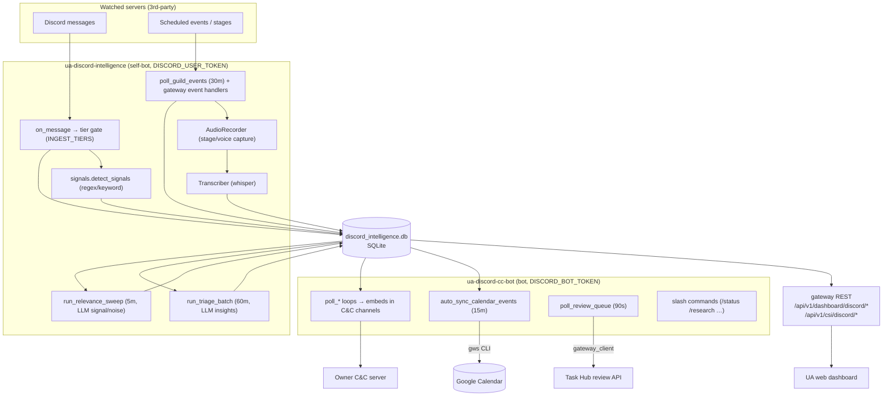

# Discord Intelligence

The Discord Intelligence subsystem passively monitors Discord servers, classifies
and triages their traffic with cheap LLMs, captures audio from live stage/voice
events, and surfaces the results to the operator through a Command & Control (C&C)
Discord server, the UA web dashboard, and the Task Hub / AgentMail pipelines.

It lives in a **top-level `discord_intelligence/` package** (NOT under
`src/universal_agent/`), but it imports freely from `universal_agent.*`
(`task_hub`, `durable.db`, `rate_limiter`, `services.agentmail_service`,
`services.llm_classifier`, `infisical_loader`). It runs as **two independent
systemd services** plus a set of **gateway REST endpoints**.

## Two processes, two Discord tokens

This is the single most important thing to internalize, and the #1 source of
confusion:

| Process | systemd unit | Entry point | Discord token | Library role |
|---|---|---|---|---|
| **Intelligence Daemon** (passive monitor) | `ua-discord-intelligence` | `python -m discord_intelligence.daemon` (`daemon.py::main`) | `DISCORD_USER_TOKEN` | self-bot — logs in as the **owner's user account** to read other servers |
| **C&C Bot** (control surface) | `ua-discord-cc-bot` | `discord_intelligence.cc_bot::main` | `DISCORD_BOT_TOKEN` | normal Discord bot in the **owner's own C&C server** |

The dependency is **`discord-py-self`** (`pyproject.toml`), a fork of discord.py
that lets you drive a *user* account. The daemon uses a user token because bots
cannot freely join arbitrary third-party servers; the owner's account is already
a member of the communities being watched. The C&C bot uses a normal bot token
because it only operates inside the owner's private control server and needs slash
commands / webhooks / message-content intent.

`config.py::init_secrets` lazily calls `initialize_runtime_secrets()` (Infisical)
if `DISCORD_USER_TOKEN` is not already in the environment. `get_discord_token`
raises if the user token is still missing; `cc_bot.main` raises if
`DISCORD_BOT_TOKEN` is missing.

> [VERIFY: the shipped `discord_intelligence/ua-discord-intelligence.service`
> in-repo runs `User=root`, but production runs all services as `ua`
> (HOME=/home/ua) per CLAUDE.md. The install script copies a `.template`
> variant, so the in-repo file may be stale.]

## Architecture



## Ingestion: tier gate + dedupe (`daemon.py::on_message`)

Every message in a guild the owner's account can see fires `on_message`. The daemon
looks up `channels.tier` for that channel (defaults to `'C'` if the channel row is
unknown) and **silently drops** anything whose tier is not in `INGEST_TIERS`
(default `A,B`). Surviving messages are persisted via `database.store_message`
(`INSERT OR IGNORE`, so re-delivery is idempotent).

Channel tiers are A/B/C/D/MUTED (validated in `database.update_channel_config`).
They are set per channel in the SQLite `channels` table — the daemon does **not**
auto-assign tiers; that is operator-driven (dashboard PATCH endpoint or `set_channel_tier`).

After storing, `signals.detect_signals` runs a **deterministic** pass (see below)
and any matches are written to the `signals` table.

### Deterministic signal rules (`signals.py::detect_signals`)

Pure regex/keyword, no LLM. Returns a list of `{rule_matched, severity, layer}`:

1. `tier_a_activity` (**high**) — emitted for *any* message in a Tier-A channel.
2. `release_detected` (**high**) — a semver-like token (`v1.2.3`) AND a release verb
   (`released`, `launched`, `changelog`, `new version`, …), suppressed when the
   message is mostly a code block or looks like install/stack-trace noise.
3. `keywords_matched:<csv>` (**medium**) — any of `config.yaml` `keywords`
   (`claude code`, `mcp`, `agent sdk`, `bug`, `crash`, …) appears.
4. `text_event_detected` (**medium**) — message ≥30 chars containing both an
   event word (`AMA`, `webinar`, `office hours`, …) and a time indicator
   (`3pm`, `tomorrow at`, `UTC`, weekday names). This is a **fallback** signal;
   the primary event source is the structured Discord events API.

#### High-severity actions are OFF by default

When a `high` signal fires, the daemon's downstream action is **gated** and defaults
to "store and log only":

- Release signals → `create_task_hub_mission(...)` only if
  `UA_DISCORD_AUTO_CREATE_RELEASE_TASKS=1` (default off).
- Other high signals → `send_simone_alert(...)` (AgentMail to
  `oddcity216@agentmail.to`) only if `UA_DISCORD_SEND_SIMONE_ALERTS=1` (default off).

Without those flags the signal is just recorded; the C&C bot still surfaces it as an
embed via its feed loops. This is intentional spam control.

## Relevance filter — store-but-hide (`relevance_filter.py`)

A periodic sweep (`daemon.py::run_relevance_sweep_loop`, a `tasks.loop` method that
calls `relevance_filter.py::run_relevance_sweep`, default every 5 min) pulls messages
where `messages.is_meaningful IS NULL` and asks a cheap LLM to label each one
**meaningful** vs **noise** in cross-channel batches (server/channel context inlined).
Results are written back to `messages.is_meaningful` (1/0). Noise is **never deleted** —
it stays in the DB but is de-emphasized in the dashboard's "meaningful" view. Note that
the two gateway message endpoints filter **differently**:

- The **per-server** endpoint (`dashboard_discord_server_messages`, the one with the
  `?show_all` toggle and `total`/`total_all` badge) uses
  `relevance_clause = "AND (m.is_meaningful IS NULL OR m.is_meaningful = 1)"` —
  unclassified (NULL) messages are **included**, only `is_meaningful = 0` noise is hidden.
- The **recent-messages** endpoint (`dashboard_discord_recent_messages`) uses strict
  `WHERE m.is_meaningful = 1` — NULL/unclassified messages are excluded until the sweep
  labels them.

Design notes that matter operationally:
- **Fail-open everywhere.** Parse failure, LLM exception, or messages the model
  forgot to classify all default to `meaningful=True` so nothing is silently lost.
- Empty-content messages are marked noise directly without an LLM call.
- 2 concurrent workers, batch size 50 (`run_relevance_sweep(max_batch_size=50, max_workers=2)`).
- Model: `config.yaml` → `models.relevance` (default `glm-4.5-air` via ZAI).
  Note the in-code default if config is missing is `glm-4.5-air` in
  `classify_batch`. Rate-limited through `ZAIRateLimiter`.

## Triage — LLM insight extraction (`triage.py`)

`daemon.py::run_triage_jobs` (a `tasks.loop` method, default every 60 min) iterates
channels in `TRIAGE_TIERS` (default `A`; the `TRIAGE_TIERS`/`TRIAGE_BATCH_LIMIT`
constants also live in `daemon.py`, not `triage.py`), and for each calls
`triage.py::run_triage_batch`. That pulls up to
`TRIAGE_BATCH_LIMIT` (default 50) unprocessed messages
(`processed_by_triage = 0`), formats them into a prompt, and asks the LLM
(`models.triage`, default `claude-haiku-4-5` per code, `glm-4.5-air` per config.yaml)
to emit **high-level educational/trend insights** (NOT individual complaints) as JSON
`insights[]` with topic/summary/sentiment/urgency/confidence/source_message_ids.

Insights land in the `insights` table linked to a `triage_batches` row. Messages are
marked `processed_by_triage = 1` even on a parse failure, so a poison batch is not
retried forever. `_parse_llm_json` is a hardened extractor (strips code fences,
regex-extracts the first `{...}`, repairs bad backslash escapes).

> Note: triage and the relevance filter are independent passes over the same
> messages with different gates (`processed_by_triage` vs `is_meaningful`).

## Structured events + audio capture (`daemon.py`, `audio_recorder.py`, `transcriber.py`)

Event discovery is **structured-API-first**, not regex:

- `poll_guild_events` (default every 30 min) calls `guild.fetch_scheduled_events()`
  and upserts each into `scheduled_events`. It also recovers any `active` event missed
  while offline and starts recording it.
- Gateway handlers give real-time coverage: `on_scheduled_event_create/update/delete`
  (status transitions `scheduled → active → completed`) and
  `on_stage_instance_create/delete` (catches **impromptu** stages with no scheduled
  event, keyed `stage_<id>`).

When a `stage_instance`/`voice` event goes **active**, `_handle_event_started` joins
the channel via `AudioRecorder.start_recording`. The recorder connects
`self_deaf=True, self_mute=True` (never transmits) and, on Stage channels,
`edit(suppress=True)` to sit as audience. On event end, audio is stopped and
`_transcribe_and_notify` runs the `Transcriber` in the background.

`run_audio_maintenance` (every 6h) transcribes any orphaned audio and runs
`AudioCleanup` — a **30-day retention auto-delete** that skips events with
`persist_audio = 1` (operator can pin a recording via the `🎙️` reaction in
`#event-calendar`).

`event_digest.py::run_pipeline` (driven by the C&C bot's `poll_event_digest`, every
15 min) turns an event's messages + transcript into a Markdown digest and optional
action-item Task Hub missions (gated by `UA_DISCORD_DIGEST_CREATE_TASKS=1`, default off).

## Calendar sync (gws materialization) (`calendar_sync.py`)

Structured events are mirrored into Google Calendar by the **C&C bot's**
`auto_sync_calendar_events` loop (every 15 min, enabled by
`UA_DISCORD_AUTO_SYNC_CALENDAR_EVENTS=1`, default **on**). It also runs on the `✅`
reaction in `#event-calendar`.

Flow per event:
1. `database.get_calendar_sync_candidates` returns `scheduled`-status events of
   type `stage_instance`/`voice`/`external` starting in the future (≥ now − 1h),
   that are `pending` or a `failed` retry past the cooldown
   (`UA_DISCORD_CALENDAR_SYNC_RETRY_FAILED_AFTER_HOURS`, default 6h). Capped by a
   per-day limit (`UA_DISCORD_CALENDAR_SYNC_DAILY_LIMIT`, default 10) minus
   `count_calendar_synced_today`.
2. `calendar_event_payload` builds a deterministic Calendar event. `calendar_event_id`
   derives a stable id from the Discord event id (`discord<id>`, sanitized to the
   base32 alphabet Calendar accepts) so re-inserts dedupe.
3. `sync_event_to_calendar` shells out to the **gws CLI**
   (`calendar events insert`) via `asyncio.create_subprocess_exec`, then marks the
   event `synced`/`failed` in the DB. A "already exists"/409 from the CLI is treated
   as success (idempotent dedupe).

### gws subprocess credential materialization (`gws_subprocess_env`)

This is the headless-VPS auth dance and a known time-sink (see CLAUDE.md "gws
RUNBOOK"). At call time it decodes four base64 Infisical secrets into
`~/.config/gws/` and forces the file keyring backend:

| Infisical key | Materialized file |
|---|---|
| `GWS_CREDENTIALS_ENC_B64` | `~/.config/gws/credentials.enc` |
| `GWS_TOKEN_CACHE_B64` | `~/.config/gws/token_cache.json` |
| `GWS_ENCRYPTION_KEY_B64` | `~/.config/gws/.encryption_key` |
| `GWS_CLIENT_SECRET_JSON_B64` | `~/.config/gws/client_secret.json` |

It sets `GOOGLE_WORKSPACE_CLI_KEYRING_BACKEND=file`, **pops the raw blobs from the
child env** (never leaked to the subprocess), and defensively unsets empty
`GOOGLE_WORKSPACE_CLI_*` vars (an empty value is treated by gws as a literal path and
crashes — a real footgun documented in CLAUDE.md).

`gws_command_prefix` resolves the binary: `UA_GWS_COMMAND` (full override) →
`UA_GWS_BINARY_PATH` (default `gws`) on PATH → `npx -y @googleworkspace/cli` fallback
(`UA_GWS_ALLOW_NPX_FALLBACK`, default on). Target calendar from
`UA_DISCORD_CALENDAR_ID` (default `primary`).

> Operational reality: the gws OAuth app is in Google "Testing" mode, so refresh
> tokens die ~weekly with `invalid_grant`. When calendar sync starts failing, that's
> almost always the cause — refresh creds per the CLAUDE.md gws runbook.

> Design rationale (do not resurrect): calendar sync deliberately shells out to the
> vendor's `gws` CLI rather than a custom Google direct-API integration. An earlier
> "Strategy-C" `src/universal_agent/services/google_workspace/` scaffold was
> prototype-only and **never wired** (it no longer exists in the tree). The rationale
> was "don't build what the vendor ships"; Composio is retained only for cross-SaaS
> reach, not for Google Calendar. Treat the gws CLI path as the intended design — do
> not reintroduce a custom Google direct-API scaffold.

## C&C bot surfaces (`cc_bot.py`)

The bot polls the SQLite DB and posts embeds into named channels of the owner's C&C
server. Channels are resolved by name within categories `🔬 INTELLIGENCE` and
`📋 OPERATIONS` (`_get_intel_channel`, `_get_ops_channel`):

| Loop | Interval | Posts to | Source |
|---|---|---|---|
| `poll_database` | 60s | `#event-calendar` | unnotified `scheduled_events` (with ✅/🎙️/📋/❌ reactions) |
| `poll_signals_feed` | 90s | `#signals-feed` / `#release-tracker` (+ `#alerts` for high) | unnotified `signals` |
| `poll_insights_feed` | 120s | `#announcements-feed` | unnotified `insights` |
| `poll_knowledge_updates` | 120s | `#knowledge-updates` | `knowledge_updates` |
| `poll_briefings` | 30m | `#briefings` | new `.md` in `UA_DISCORD_BRIEFINGS_DIR` (default `kb/briefings`) |
| `poll_event_digest` | 15m | — | runs `event_digest.run_pipeline` |
| `poll_review_queue` | 90s | `#review-queue` (OPERATIONS) | Task Hub review tasks via gateway, with approve/reject buttons |
| `auto_sync_calendar_events` | 15m | — | calendar sync (above) |

Reactions in `#event-calendar`: `✅` syncs to Calendar, `🎙️` flags audio persistence
+ creates a Task Hub mission, `📋` acknowledges, `❌` declines.

Messages in `#simone-chat` from the **owner (hardcoded ID `351727866549108737`)**
are funneled into Task Hub as a `simone-chat` / `direct-prompt` mission for Simone's
loop to pick up.

Slash commands (`setup_commands`) include `/status`, `/queue`, `/task_add`,
`/task_list`, `/mission_list`, `/mission_status`, `/research` (commission ATLAS),
`/briefing`, `/wiki_query`, `/wiki_add`, `/discord_search`, `/discord_signals`,
`/discord_insights`, `/monitor_list`, `/setup_webhooks`, `/config_triage_frequency`
(the last is a stub — it does not actually persist config).

## Task Hub & gateway integration

- `integration/task_hub.py::create_task_hub_mission` writes directly to the
  **activity DB** (`connect_runtime_db(get_activity_db_path())`,
  `task_hub.upsert_item`) with `source_kind="discord_intelligence"`,
  `project_key="immediate"`. Approve/reject actions instead go through the gateway
  REST API for concurrency safety.
- `integration/gateway_client.py` is an `httpx` client hitting
  `/api/v1/dashboard/...` endpoints, authed with `UA_INTERNAL_API_TOKEN`
  (or `UA_OPS_TOKEN`) via the `x-ua-internal-token` header. Used for review-queue
  fetch, approve, park/reject, dispatch-queue, and approvals highlight.

## Dashboard + watchlist REST surface

- **Read endpoints** (`gateway_server.py`, `dashboard_discord_*`): overview, events,
  channels (+ PATCH tier/active), per-channel/server messages, delete events. These
  read `discord_intelligence/discord_intelligence.db` directly. Relevance filtering
  differs by endpoint (see the relevance-filter section): the **per-server** endpoint
  hides only `is_meaningful = 0` noise while **including** NULL/unclassified messages
  (`AND (m.is_meaningful IS NULL OR m.is_meaningful = 1)`), whereas the
  **recent-messages** endpoint uses strict `WHERE m.is_meaningful = 1`. Auth:
  `_require_ops_auth`. The per-server messages endpoint accepts `?show_all=true` to
  bypass the relevance filter and returns both `total` (filtered) and `total_all`
  (unfiltered) counts so the dashboard can render its "N signals of M total"
  effectiveness badge.
- **Watchlist CRUD** (`api/routers/csi_discord_watchlist.py`, prefix
  `/api/v1/csi/discord`): manage a JSON watchlist of categories + servers + watched
  sub-channels. On `add_server` it resolves the guild name/icon/text-channels live
  via the Discord HTTP API using `DISCORD_BOT_TOKEN` (falls back to stub channels if
  no token).

> [VERIFY / code gotcha] **Two different watchlist file paths.** The watchlist router
> writes to `${CSI_DATA_DIR:-/var/lib/universal-agent/csi}/discord_watchlist.json`,
> but the gateway's category-filtered message endpoint reads
> `${DISCORD_WATCHLIST_PATH:-/var/lib/universal-agent/discord/discord_watchlist.json}`.
> Unless both env vars are set to agree, category filtering on the dashboard will not
> see servers added through the watchlist UI. The watchlist is **not** wired into the
> daemon's ingest tier gate at all — ingestion is driven solely by the SQLite
> `channels.tier` column, so adding a server to the watchlist does not by itself cause
> the daemon to ingest it.

## MCP bridge (`mcp_bridge.py`) — defined, not wired

`mcp_bridge.py` defines a `FastMCP("Discord Intelligence Bridge")` server exposing
read-only tools over the SQLite DB: `search_messages`, `get_signals`, `get_insights`,
`get_events`. This was the Phase-3 design for letting UA principals query Discord
intelligence directly via MCP instead of through the gateway.

> [VERIFY] The bridge **is** registered in `.mcp.json` as `discord-intelligence-bridge`,
> but `grep -rn mcp_bridge` finds no in-repo launcher/consumer invoking it beyond that
> registration. Treat it as registered-but-effectively-unwired; principals currently reach
> Discord data through the gateway `dashboard_discord_*` endpoints, not this MCP server.

## SQLite schema (`database.py::_init_db`)

DB file: `discord_intelligence/discord_intelligence.db` (path from `config.yaml`
`database.path`, resolved relative to the package by `config.get_db_path`).

Core tables: `servers`, `channels` (with `tier`), `messages` (with
`processed_by_triage` and the migration-added `is_meaningful`), `signals`,
`triage_batches`, `insights`, `scheduled_events` (heavily migrated: audio/transcript,
structured-event, digest, and calendar-sync columns), `knowledge_updates`.

Schema evolves via additive `_migrate_add_column` calls guarded against errors — there
are no destructive migrations. `is_meaningful` is intentionally nullable
(NULL = not yet classified).

## Environment flags

| Var | Default | Effect |
|---|---|---|
| `DISCORD_USER_TOKEN` | — | self-bot login for the monitoring daemon (required) |
| `DISCORD_BOT_TOKEN` | — | C&C bot + watchlist guild lookups (required for C&C) |
| `UA_DISCORD_INGEST_TIERS` | `A,B` | channel tiers whose messages are stored at all |
| `UA_DISCORD_TRIAGE_TIERS` | `A` | tiers swept by LLM triage |
| `UA_DISCORD_TRIAGE_BATCH_LIMIT` | `50` | messages per triage batch |
| `UA_DISCORD_AUTO_CREATE_RELEASE_TASKS` | `0` | release signal → Task Hub mission |
| `UA_DISCORD_SEND_SIMONE_ALERTS` | `0` | other high signal → AgentMail to Simone |
| `UA_DISCORD_TEXT_EVENT_FALLBACK_ENABLED` | `0` | store text-derived events as fallback |
| `UA_DISCORD_AUTO_SYNC_CALENDAR_EVENTS` | `1` | C&C bot auto-syncs events to Calendar |
| `UA_DISCORD_CALENDAR_SYNC_DAILY_LIMIT` | `10` | max calendar inserts/day |
| `UA_DISCORD_CALENDAR_SYNC_RETRY_FAILED_AFTER_HOURS` | `6` | failed-sync retry cooldown |
| `UA_DISCORD_CALENDAR_ID` | `primary` | target Google Calendar |
| `UA_DISCORD_DIGEST_CREATE_TASKS` | `0` | event digest → action-item tasks |
| `UA_DISCORD_BRIEFINGS_DIR` | `kb/briefings` | source dir for `#briefings` |
| `UA_GWS_COMMAND` / `UA_GWS_BINARY_PATH` / `UA_GWS_ALLOW_NPX_FALLBACK` | — / `gws` / `1` | gws CLI resolution |
| `CSI_DATA_DIR` / `DISCORD_WATCHLIST_PATH` | `/var/lib/universal-agent/csi` / `/var/lib/universal-agent/discord/...` | watchlist file (see path-mismatch gotcha) |
| `UA_INTERNAL_API_TOKEN` / `UA_OPS_TOKEN` | — | gateway auth for C&C → Task Hub |
| `UA_GATEWAY_URL` | `http://127.0.0.1:8080` | gateway base URL for `gateway_client` |

Scheduling intervals (triage 60m, event poll 30m, relevance 5m, briefing time)
come from `config.yaml` `scheduling.*`.

## Models (ZAI proxy)

The daemon's LLM passes run on the ZAI proxy / GLM models (cheap inference), the
autonomous-principal profile (see CLAUDE.md). `config.yaml`:
`triage: glm-4.5-air`, `insight: glm-5-turbo`, `relevance: glm-4.5-air`. API key is
read from `ANTHROPIC_API_KEY` / `ANTHROPIC_AUTH_TOKEN` / `ZAI_API_KEY` with
`ANTHROPIC_BASE_URL` pointing at the proxy, and calls are throttled by
`ZAIRateLimiter`.

## Operations

Both services run on the VPS under systemd with `Restart=always`:

```bash
sudo systemctl status ua-discord-intelligence   # passive monitor
sudo systemctl status ua-discord-cc-bot          # control surface
journalctl -u ua-discord-intelligence --since "1 hour ago" | grep -i relevance
```

**Token rotation** goes through Infisical, never VPS env files. Upsert the new token
(bot token from the Developer Portal, user token from the web client) to staging +
production via `scripts/infisical_upsert_secret.py`, then restart the relevant unit so
`infisical_loader` re-fetches at process start. (Recall from CLAUDE.md: deploy wipes
`/opt/universal_agent/.env`, so durable config belongs in Infisical / code defaults.)

> Historical note: an earlier design decision recorded "decided AGAINST capturing
> audio recordings from stage channels (TOS / ban risk)". That decision was
> **reversed** — the code now ships a full audience-mode audio capture + Whisper
> transcription pipeline (`audio_recorder.py`, `transcriber.py`) that joins
> self-muted/self-deafened and suppresses itself on Stage channels. Treat the
> code as authoritative.

## Deploy / restart

`deploy.yml` restarts both `ua-discord-cc-bot` and `ua-discord-intelligence` on every
production deploy (alongside the gateway/api/webui/telegram units) and runs a
post-deploy regression check (`check_discord_regression`) comparing pre/post service
state. Both units `Restart=always`.

## Known gotchas

- **Token mix-up.** Daemon = user token, C&C bot = bot token. Using the wrong one
  fails login. The `discord-py-self` lib is what enables the user-token path.
- **High-severity actions ship OFF.** Release-task creation and Simone alerts require
  explicit env flags; by default high signals only get stored + surfaced as embeds.
- **Watchlist path mismatch** between the writer (`CSI_DATA_DIR`) and the dashboard
  reader (`DISCORD_WATCHLIST_PATH`) — see the dashboard section above.
- **Watchlist ≠ ingestion control.** Daemon ingestion is purely `channels.tier`-driven;
  the watchlist JSON only affects dashboard categorization/filtering.
- **gws weekly token expiry.** Calendar sync breaks ~weekly with `invalid_grant`
  because the OAuth app is in Testing mode; refresh per CLAUDE.md gws runbook.
- **In-repo service file says `User=root`** while prod runs as `ua`; trust the
  install-script `.template`, not the checked-in `.service`.
- **Fail-open relevance filter** never hides on error — a broken classifier shows
  everything rather than nothing.
