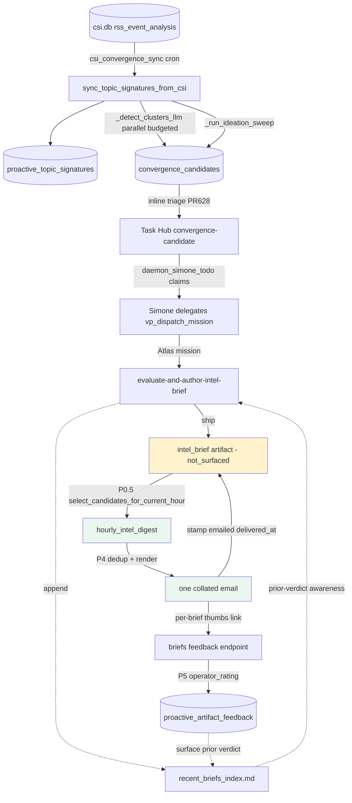
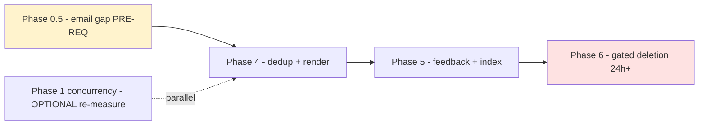

# Build Plan — Insight Pipeline Phases 0.5 / 4 / 5 / 6

**Status:** PLAN for operator sign-off (not yet implemented).
**Author:** Claude (Opus 4.8), 2026-06-02 (Houston: 2026-06-01 late evening).
**Grounding:** live prod recon `ua@uaonvps` 2026-06-02 ~02:55 UTC + canonical
`project_docs/04_intelligence/10_proactive_pipeline.md` (last_verified 2026-06-02)
+ phase catalog `docs/proactive_signals/insight_pipeline_completion_spec_2026-05-29.md`
§§9–12. Trust order: origin/main code → live prod → canonical docs.

> **Scope discipline.** This plan COMPLETES and HARDENS the settled architecture
> (Atlas evaluates+authors in background → Simone batches one hourly digest). It
> does not redesign. Every lever is env-flagged with a safe default; every phase
> ends with a real prod-artifact check, not just unit tests (Doc 130). Ask the
> operator before: raising email volume, raising worker concurrency >2, or the
> Phase-6 deletion.

---

## 1. Current verified state (live, 2026-06-02 — supersedes the spec's 2026-05-29 snapshot)

| Component | State | Evidence (live) |
|---|---|---|
| Convergence/ideation candidate generation | ✅ Working | `convergence_candidates`: 279 awaiting-author, 54 defer, **5 ship**, 285 skip |
| Atlas claims + authors `intel_brief` | ✅ Working | 5+ `intel_brief` artifacts; newest pa_7d3a3f50 (06-01 18:00), pa_a68d4fbc (06-01 16:23) |
| `daemon_simone_todo` dispatch | ✅ Healthy | 1103 completed, 94 failed, 20 abandoned; last completed 06-01 18:12 |
| `recent_briefs_index.md` (Atlas prior-verdict memory) | ✅ Written | 384 KB, updated 06-01 18:51 |
| **Brief → digest EMAIL leg** | ❌ **GAP** | 2 newest briefs `delivery_state='not_surfaced'`; late-May briefs were `emailed`/`hourly_digest` |
| Digest dedup | ❌ Missing in digest | `hourly_intel_digest.py` has no Jaccard/overlap suppression (index-side only) |
| Operator feedback loop | 🟡 Built, ~unexercised | `proactive_artifact_feedback`: **1 row** total |
| `csi_convergence_sync` cron health | ✅ **Fixed 2026-06-02 (PR #665)** | was 900s-timeout flood; now parallelized + time-boxed (separate work) |
| Legacy Track A/B + hand-trigger endpoints | ⚠️ Dead but present | Phase 6 deletion target |

**The dominant remaining gap is delivery, not detection.** Detection, authoring,
dispatch, and the recent-briefs index all work. Two freshly-authored briefs are
sitting `not_surfaced` — the hourly digest is not picking them up. **Phase 0.5
(close the email leg) is the prerequisite for everything else** and the single
highest-value fix for the operator's actual experience ("I get a good digest").

### What's already DONE/DECIDED (do not re-plan — reconciled from spec §12)
- **Phase 2 (ZAI 1301 resilience):** DONE — decision C = accept the drop; the
  drop is logged-not-silent (`logger.warning("convergence LLM refine failed …")`
  in `proactive_convergence.py::_refine_cluster_with_llm`). No code.
- **Phase 3 (cadence/dormancy):** DECIDED — active-window `0 6-21 * * *` is
  intentional (decision A). No code.
- **Phase 1 (worker concurrency=2):** RECLASSIFIED-deferred (spec §1.1). The VP
  worker loop is structurally serial; "concurrency=2" is a loop rewrite that
  risks the event-loop-starvation incident. Candidate volume is low, so the
  serial worker is likely adequate. **Re-measure claim latency before taking the
  risk** — included here only as an optional parallel verification (§6).

---

## 2. End-to-end flow (where each phase intervenes)



- **Phase 0.5** = the `BRIEF → DIGEST` edge (briefs stuck `not_surfaced`).
- **Phase 4** = the `DIGEST → EMAIL` edge (dedup + render).
- **Phase 5** = the `EMAIL → FB → IDX` loop (feedback closes).
- **Phase 6** = delete the dead legacy producers (not on this happy path).

---

## 3. Phase 0.5 (PRE-REQ) — Close the brief→digest email gap

**Problem (live):** `pa_7d3a3f50` and `pa_a68d4fbc` are `produced` but
`not_surfaced`; the digest emailed fine in late May. Something in
`hourly_intel_digest.py::select_candidates_for_current_hour` (or the heartbeat
cadence that invokes it) is no longer selecting them.

**Investigate first (read bodies, don't assume):**
1. Read `hourly_intel_digest.py::select_candidates_for_current_hour` — the exact
   WHERE clause: which `status`/`verdict`/`delivery_state`/recency predicates
   gate a brief into the hour's batch. (Recon showed it filters on
   `delivery_state='emailed'` for the *already-sent* exclusion at the symbol near
   `WHERE delivery_state = 'emailed' AND delivery_channel = ?` — confirm the
   *inclusion* predicate.)
2. Check the heartbeat invoker: is `/hourly-intel-digest` running each active
   hour, and does it see these briefs? (The two stuck briefs are 16:23 and 18:00
   on 06-01; confirm the digest ran those hours and returned `no_candidates` vs
   never ran.)
3. Confirm the briefs' `verdict` — are pa_7d3a3f50 / pa_a68d4fbc `verdict='ship'`?
   If they're `skip`/`defer`, `not_surfaced` is **correct** (only ship briefs
   email) and there is NO gap — the "gap" is just a low ship rate. **This check
   decides whether 0.5 is a bug or a no-op.**

**Likely outcomes & fix:**
- **(a) Briefs are `ship` but the selector's recency/window predicate drops them**
  → widen/correct the predicate so a ship brief authored this active-window hour
  is surfaced once. Acceptance: the two stuck ship briefs (or the next ship brief)
  reach `delivery_state='emailed'` within the hour.
- **(b) Briefs are `skip`/`defer`** → not a bug. Document that `not_surfaced` is
  the correct terminal state for non-ship briefs; close 0.5 as verified-correct;
  the real lever is ship-rate/source-mix (a separate follow-on, see §7).

| Field | Value |
|---|---|
| Files | `services/hourly_intel_digest.py::select_candidates_for_current_hour` (+ heartbeat invoker in `memory/HEARTBEAT.md` if cadence) |
| Acceptance | A `ship` brief authored in an active hour is emailed exactly once and stamped `emailed`/`hourly_digest`/`delivered_at`; non-ship briefs correctly stay `not_surfaced` |
| Tests | unit: seed a ship brief + a skip brief → selector returns only the ship one; seed an already-`emailed` brief → excluded |
| Verify (prod) | Gmail MCP shows one digest containing the brief; `proactive_artifacts` delivery columns set |
| Env flag / rollback | none new (behavior fix); revert = one commit |
| Risk | LOW — read-mostly; main risk is widening the predicate and double-emailing → guarded by the existing `delivery_state='emailed'` exclusion |

---

## 4. Phase 4 — Digest dedup + template (decision D: both)

**4.1 Near-duplicate suppression (index primary + digest backstop).**
- **Index side (primary):** confirm `recent_briefs_index` makes Atlas skip a
  near-identical second cluster at authoring time (it caught the two Google I/O
  clusters on 2026-05-29). Mostly verification; gap-fill only if it regressed.
- **Digest side (deterministic backstop):** add topic/thesis-overlap suppression
  to `select_candidates_for_current_hour` so two near-identical briefs in one
  hour collapse to one. Method: Jaccard over a normalized token set of
  `{primary_topics ∪ thesis n-grams}`; threshold env-flagged
  `UA_DIGEST_DEDUP_JACCARD` (default e.g. 0.6); keep the higher-`signal_strength`
  brief, mark the other `delivery_state='superseded'` (new terminal, not emailed).

```python
# services/hourly_intel_digest.py — sketch (fail-open: never drop below 1)
def _dedup_near_duplicates(briefs: list[dict], threshold: float) -> list[dict]:
    kept: list[dict] = []
    for b in sorted(briefs, key=lambda x: -float(x.get("signal_strength") or 0)):
        toks = _topic_thesis_tokens(b)
        if any(_jaccard(toks, _topic_thesis_tokens(k)) >= threshold for k in kept):
            continue  # near-duplicate of an already-kept, higher-strength brief
        kept.append(b)
    return kept
```

| Field | Value |
|---|---|
| Files | `services/hourly_intel_digest.py` (+ verify `services/recent_briefs_index.py`), 1 test |
| Acceptance | two near-identical briefs in one hour → one in the email; the dropped one recorded (not silently lost) |
| Tests | unit: two overlapping briefs (Jaccard > threshold) → one rendered; two distinct → both |
| Env flag / rollback | `UA_DIGEST_DEDUP_JACCARD` (set very high ⇒ effectively off) |
| Risk | MED — over-aggressive dedup hides distinct briefs → conservative default + fail-open (always keep ≥1) |

**4.2 Render review.** Eyeball `render_digest_html` output (subject, ribbons,
per-brief links, thumbs feedback links). Verify by sending a real digest (Phase
0.5 / manual) and viewing via Gmail MCP. Fix any broken links/anchors (operator
is terminal-only; links must resolve). Acceptance: operator confirms it "looks
good." No env flag (presentation).

---

## 5. Phase 5 — Feedback loop + recent-briefs index verification

**State:** `proactive_artifact_feedback` has **1 row** — the loop is built but
essentially unexercised. This phase is mostly verification + small gap-fill.

- **5.1** Trace `/api/v1/briefs/{id}/feedback` (`gateway_server.py` — grep the
  symbol, line numbers in the spec are stale): confirm a thumbs-down writes
  `operator_rating` to `proactive_artifact_feedback`, and that the rating flows
  into `recent_briefs_index` (and/or the explicit-feedback preference snapshot
  that feeds Atlas's `get_delegation_context`).
- **5.2** Confirm Atlas READS the index for prior-verdict awareness (skips a
  convergence it already shipped). Provide a real per-brief feedback link in the
  digest (depends on Phase 4.2 render).

| Field | Value |
|---|---|
| Files | verification; gap-fill in `recent_briefs_index.py` / the feedback endpoint; ≤1 test |
| Acceptance | a simulated thumbs-down is recorded AND surfaced to a subsequent Atlas mission's context/index; Atlas skips an already-shipped convergence |
| Tests | unit: POST feedback → row written + index reflects it |
| Verify (prod) | simulate via endpoint; inspect `proactive_artifact_feedback` + `recent_briefs_index.md` + next mission context |
| Risk | LOW — additive; **must stay scoped to `explicit_feedback`** (the 2026-05-24 poison-gate lesson — never let implicit park/skip bursts move preference) |

---

## 6. Phase 6 — Legacy deletion (GATED: ≥24h stable new path)

**Gate:** new path stable ≥24h. Clock the stability window from the most recent
pipeline-affecting deploy (the convergence-timeout fix PR #665 deploying
2026-06-02). Verify before deleting: sustained `daemon_simone_todo` claims,
briefs authoring, digest emailing (Phase 0.5 closed), no event-loop regressions.

**⚠️ VERIFY-EACH-SYMBOL-STILL-DEAD on origin/main before planning deletion** —
`#568` already removed some legacy; grep live call sites (incl. the web UI) for
each before deleting. Candidate targets (confirm dead first):

| Symbol / surface | File | Pre-delete check |
|---|---|---|
| `track_a_concrete_convergence` | `proactive_convergence.py` | grep callers (spec notes it may already be gone — "no single function") |
| `track_b_ideation_synthesis` | `proactive_convergence.py` | ⚠️ **STILL LIVE** — driven by `_run_ideation_sweep`. **Do NOT delete** unless ideation is being retired. Reconcile with spec §10 6.1 (which lists it) — the spec is stale here. |
| `_detect_and_queue_convergence_async`, `create_convergence_brief_task`, `create_insight_brief_task` | `proactive_convergence.py` | grep callers |
| two gateway hand-trigger endpoints | `gateway_server.py` | grep web-ui + curl callers |
| dead tables `proactive_convergence_events`, `insight_brief_task`, `convergence_brief_task`, `proactive_brief_scoring_log` | DB | confirm no writers/readers |
| dead surfaces: `hourly_insight_email` cron, `insight_scoring_health` weekly email, `briefings_agent` "ATLAS insight briefs" block | various | confirm unscheduled/unreferenced |

| Field | Value |
|---|---|
| Files | `services/proactive_convergence.py`, `gateway_server.py`, test updates, dead-table migration |
| Acceptance | dead code/tables removed; `grep` shows no live callers; `uv run pytest tests/unit -q` green |
| Verify | grep call sites incl. web-ui before delete; prod smoke after |
| Risk | MED — deleting a hand-trigger the dashboard still calls → grep web-ui first; **`track_b_ideation_synthesis` is NOT dead** |

---

## 7. Sequencing, risks, and the real lever



**Order: 0.5 → 4 → 5 → 6** (6 gated on ≥24h stable). Phase 1 only if a claim-
latency re-measurement shows the serial worker is inadequate.

| Risk | Mitigation |
|---|---|
| 0.5 turns out a no-op (briefs are `skip`/`defer`, `not_surfaced` is correct) | Treat 0.5 as a discovery gate; if so, pivot to the source/lane-mix follow-on (§ below) — that's the real lever |
| Dedup hides distinct briefs | conservative Jaccard default + fail-open (always ≥1) |
| Phase-6 deletes a live symbol (`track_b_…`) | grep-each-symbol-live gate; the spec's deletion list is stale |
| Feedback re-poisons preference | keep everything `explicit_feedback`-scoped (2026-05-24 lesson) |
| event-loop starvation if concurrency raised | leave Phase 1 deferred; re-measure first; keep `UA_DAEMON_SESSIONS_ENABLED` kill-switch |

**The real lever (follow-on, not in 4/5/6):** even with delivery fixed, ship
rate is ~1.5% (5 ship / 344 evaluated) because the CSI source/topic mix yields
mostly low-value convergences (Atlas's skips are *sound*). Surfacing genuinely
novel, operator-relevant convergences needs **source/lane tuning**, tracked
separately — it's the difference between "a digest arrives" and "a *great*
digest arrives."

---

## 8. Definition of done (per the spec §8, reconciled)
1. One collated digest email per active-window hour containing ≥1 brief, links
   resolve, briefs stamped `emailed`/`hourly_digest`/`delivered_at`. (Phase 0.5/4)
2. Near-identical convergences collapse to one in a digest. (Phase 4)
3. Thumbs feedback recorded + surfaced to Atlas (explicit-scoped). (Phase 5)
4. Dead legacy code/tables removed, tests green, `track_b` preserved. (Phase 6)
5. No Atlas per-insight direct emails; no empty digests; every lever env-flagged;
   docs updated in the same PR; deploy-verified (SHA + restart). (Boundaries)
