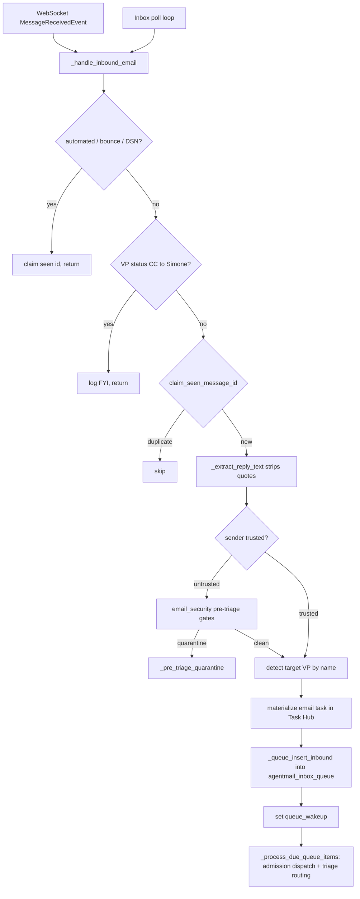

# Email / AgentMail

Email is one of Universal Agent's inbound/outbound channels. Simone owns an
[AgentMail](https://agentmail.to) inbox; inbound mail flows in over a WebSocket
(or a polling fallback), is screened for security threats, materialized as Task
Hub items, and dispatched into the same canonical Simone → Task Hub execution
lane that chat uses. Outbound mail is sent through AgentMail's SDK, with an
optional Google Workspace (gws) CLI fallback when AgentMail's daily send quota
is exhausted.

The whole subsystem is implemented in `services/agentmail_service.py`
(`AgentMailService`), backed by three pure-Python helper modules:
`email_security.py` (deterministic pre-triage screening),
`email_task_bridge.py` (email → Task Hub materialization), `email_tags.py`
(outbound subject/banner tagging), and `vp_email_directive.py` (canonical
prompt text for VP outbound mail).

## Two email identities

UA uses two distinct email identities (legacy doc, still the operating model):

- **AgentMail** — Simone's own identity (`oddcity216@agentmail.to`). Default for
  *all* Simone-authored work: digests, reports, research, status updates.
  Replies route back into Simone's inbound pipeline.
- **Gmail via gws** — Kevin's identity. Used only when Simone explicitly acts
  *as Kevin* (he says "send from my email" / "check my email"), or as the 429
  fallback transport (see below). Note: the 429 fallback sends from the
  gws-authenticated Google account, so it is a transport choice, not an identity
  choice for the message content.

The VP shared inbox `vp.agents@agentmail.to` lets Kevin engage Cody/Atlas
directly; `system.alerts@agentmail.to` is a system inbox. In production
`UA_AGENTMAIL_INBOX_ADDRESSES` lists all monitored inboxes and the WS subscribes
to all of them.

## Wiring & lifecycle

`AgentMailService` is constructed once in `gateway_server.py` and started after
the deploy window. Its callbacks are injected at construction:

```python
_agentmail_service = AgentMailService(
    dispatch_fn=_agentmail_dispatch_fn,
    dispatch_with_admission_fn=_agentmail_dispatch_with_admission_fn,
    notification_sink=_hook_notification_sink,
    trusted_ingress_fn=_maybe_trigger_heartbeat_from_agentmail_action,
    priority_dispatch_fn=_priority_dispatch_for_email,
)
```

`AgentMailService.startup()` (gated on `_is_enabled()` → `UA_AGENTMAIL_ENABLED`)
resolves/creates the inbox via `_ensure_inbox`, ensures the queue schema, then
launches up to three background asyncio tasks:

1. **Trusted inbox queue loop** (`_trusted_inbox_queue_loop`) — started when a
   `dispatch_with_admission_fn` is wired. This is the primary processing lane.
2. **Inbound poll loop** (`_inbox_poll_loop`) — started when
   `UA_AGENTMAIL_INBOUND_POLL_ENABLED=1` (default on) and a `dispatch_fn` is
   wired. A safety net that pulls messages even if the WebSocket is down.
3. **WebSocket listener** (`_ws_loop`) — started only when
   `UA_AGENTMAIL_WS_ENABLED=1` and an inbox id resolved.

> Note the gateway uses a separate `UA_AGENTMAIL_SERVICE_ENABLED` gate (and
> disables the service entirely under `UA_RUNTIME_STAGE=development`) before it
> even constructs the service. `UA_AGENTMAIL_ENABLED` is the in-class master
> toggle. Both must be on in production.

## Inbound flow (end to end)



### 1. Ingress (`_handle_inbound_email`)

Both the WebSocket (`_ws_connect_and_listen` → on `MessageReceivedEvent`) and
the polling loop funnel into `_handle_inbound_email`. It runs these gates in
order:

- **Automated / bounce filter** (`_is_automated_sender`): drops mailer-daemon,
  postmaster, noreply, notifications, bounce, auto-reply, do-not-reply senders,
  and DSN-style subjects ("delivery status notification", "undeliverable",
  etc.). Suppressed silently (marks the message id seen, returns).
- **VP FYI CC suppression** (`_is_vp_fyi_cc`): when a VP (Cody/Atlas) replies to
  Kevin and CCs Simone's inbox, the email is logged for awareness but no task
  is created. Detected by sender `vp.agents@agentmail.to` OR a `[VP Status]`
  subject prefix arriving at Simone's primary inbox. This prevents duplicate
  task creation for work a VP is already handling.
- **Dedup** (`_claim_seen_message_id`): atomic claim against the
  `agentmail_seen_messages` table; duplicates are skipped. On any later
  exception the claim is released (`_release_seen_message_id`) so the message
  can be retried.

It then extracts the new reply text from quoted thread history
(`_extract_reply_text` → `_strip_html_quotes`), handling Gmail
(`div.gmail_quote`), Outlook (`divRplyFwdMsg`, `OLK_SRC_BODY_SECTION`),
Thunderbird (`moz-forward-container`), and Apple Mail (`blockquote[type=cite]`),
falling back to the `email-reply-parser` library for plain text.

### 2. Trust classification

Sender is **trusted** if its normalized address is in `self._trusted_senders`.
Defaults (`_DEFAULT_TRUSTED_SENDERS`):

- `kevin.dragan@outlook.com`
- `kevinjdragan@gmail.com`
- `kevin@clearspringcg.com`

Overridable via `UA_AGENTMAIL_TRUSTED_SENDERS` (comma-separated). Trust drives
everything downstream: trusted mail can auto-execute; untrusted mail is screened
hard and parked for review.

### 3. Pre-triage security screening (untrusted only)

`email_security.py` is **pure Python, no LLM** — deterministic, microsecond-fast,
and runs *before* any content reaches a triage LLM (closing the gap where the
old auto-quarantine depended on triage completing). For untrusted senders,
`_handle_inbound_email` runs three gates:

- **Gate 0 — sender blocklist** (`is_sender_blocked`): blocked in the
  `email_sender_reputation` table → quarantine.
- **Gate 1 — unknown @agentmail.to sender** (`should_auto_quarantine_agentmail_sender`):
  any non-trusted `@agentmail.to` address is auto-quarantined as high-risk
  agent-to-agent traffic.
- **Gate 2 — injection pattern scan** (`scan_for_injection`): regex scan for
  remote-code fetch (`curl http://`), package execution (`npx`, `npm install`,
  `pip install`, `uv add`), skill/MCP injection (`skill_url:`, `mcp: http://`),
  prompt injection ("ignore previous instructions", "system prompt:"), role
  hijack ("you are now", "act as a"), code execution (`eval(`, `$(...)`,
  backticks), and YAML frontmatter injection. A `ScanResult` reports
  `confidence` = `high` if any single high-confidence threat matched OR 3+
  total threats, else `medium`. False positives are accepted because the
  consequence is quarantine-with-notification, not deletion.

Any gate hit → `_pre_triage_quarantine`, which materializes the email as a
quarantined Task Hub item, records the quarantine in sender reputation, emits an
operator notification, and **never** enqueues the email or dispatches it to a
triage agent.

**Sender reputation** (`email_sender_reputation` table) tracks every untrusted
sender: `record_sender_seen` on arrival, `record_sender_quarantined` on a
quarantine event. After `_AUTO_BLOCK_THRESHOLD = 2` quarantines a sender is
auto-escalated to `blocked` status (Gate 0 catches them thereafter); one
quarantine sets `watched`.

### 4. VP target detection

`_detect_target_agent_by_name` scans the subject + first 300 chars of body for
VP name keywords and returns a canonical agent id:

- "cody" / "codie" → `vp.coder.primary`
- "atlas" → `vp.general.primary`

This lets Kevin email Cody/Atlas directly. The detected `target_agent` is
threaded into materialization, which adds a VP-specific label and injects the
agent into the task's workflow manifest.

### 5. Task materialization (`email_task_bridge.py`)

`EmailTaskBridge.materialize` converts the inbound email into a Task Hub item.
Key behaviors:

- **Thread-level dedup**: `task_id = _deterministic_task_id(thread_id)` =
  `email:<sha256(thread)[:16]>`. One task per email thread; later emails on the
  same thread UPDATE the existing task (incrementing `message_count`). The
  mapping lives in `email_task_mappings` (keyed by `thread_id`).
- **Master key grouping**: `_classify_master_key` strips `Re:/Fwd:/Fw:`
  prefixes and slugs the subject, so related threads group under one parent.
- **Labels by trust**:
  - trusted + `triage_pending` → `["email-task", "triage-pending"]`
  - untrusted → `["email-task", "external-untriaged"]` (+ `security-<class>`)
  - default → `["email-task", "agent-ready"]`
- **VP agent label**: when `target_agent` is set, the agent label from
  `_AGENT_LABEL_MAP` is appended. **The Cody label is `agent-codie`, not
  `agent-cody`** (`vp.coder.primary` → `agent-codie`; `vp.general.primary` →
  `agent-atlas`). Unmapped agents fall back to `agent-atlas`.
- **Untrusted manifest neutralization**: external/untriaged tasks get their
  `workflow_manifest` forcibly rewritten to `workflow_kind: data_only`,
  `repo_mutation_allowed: False` — defense-in-depth so untrusted content can
  never carry a code-mutating manifest even if it *looks* like an instruction.
- **Status starts `open`** so the heartbeat dispatch sweep
  (`claim_next_dispatch_tasks`) can atomically claim it → `in_progress`.
- **Proactive feedback interception** (trusted only): before creating a task,
  `handle_proactive_feedback_reply` is consulted. If the reply is feedback on a
  prior proactive artifact, it is recorded as feedback and **no task is
  created** (`delivery_mode: "proactive_feedback"`).
- **Idle dispatch nudge**: `nudge_dispatch` wakes the idle loop so Simone reacts
  in seconds, not at the next poll.

`infer_delivery_mode` heuristically picks an outbound delivery mode from
keywords: infographic/audio/video/notebooklm/podcast/slide-deck →
`enhanced_report`; quick/asap → `fast_summary`; comprehensive/full-report →
`standard_report` (also the default).

### 6. Queue & admission dispatch

When a `dispatch_with_admission_fn` is wired, materialized emails are inserted
into the `agentmail_inbox_queue` table (`_queue_insert_inbound`) and the queue
loop is woken. The queue is stored in the **activity DB**
(`get_activity_db_path()` via `connect_runtime_db`) — not the runtime DB.

`_process_due_queue_items` claims due rows (status `queued` or `busy_retry` with
`next_attempt_at` in the past), atomically claims each (`_claim_queue_item`),
and calls the admission dispatch fn. The decision drives routing:

- `accepted` / `skipped` → parse triage, route (see below).
- `busy` / `duplicate_in_progress` → retry with backoff (`_retry_queue_item`).
- `skipped` with no triage output → retry (triage not ready yet).
- anything else → fail (`_fail_queue_item`).

Queue lifecycle statuses (`_QUEUE_STATUS_*`): `queued`, `dispatching`,
`busy_retry`, `triaged`, `dispatched_to_todo`, `review_required`, `quarantined`,
`completed`, `failed`, `cancelled`. Failed items auto-cancel after
`UA_AGENTMAIL_FAILED_QUEUE_AUTO_CANCEL_DAYS` (default 7).

### 6a. The email-handler triage agent

The admission dispatch fn drives a **pure triage agent**, `.claude/agents/email-handler.md`. Critically, this agent **never acts on emails** — it classifies, gathers thread context, performs a security assessment, and writes a structured triage brief (and, for Kevin's mail, a memory note). It may send a short receipt acknowledgement when allowed, but that is not execution. Canonical execution happens *later* from Task Hub / the ToDo executor, never inside the hook session.

Classifications it produces (legacy doc, agent-defined): `instruction`, `feedback_approval`, `feedback_correction`, `status_update`, `question`, `external_inquiry`, `spam_bounce`. Kevin's "thanks"/"good work" mail is `feedback_approval` and still flows to Simone for behavioral reinforcement — it is not dropped.

> Hook-side `TaskStop` guardrails hard-block the triage agent from doing `todo_execution`; it is triage-only. The Python side only consumes its structured output.

### 7. Triage routing

Triage output is parsed (`parse_email_triage_brief` in the bridge) into
`safety_status` (`clean`/`quarantine`), `routing_decision`
(`trusted_execute`/`review_required`/`quarantine`), `classification`,
`priority`, `subject_summary`. Routing in `_process_due_queue_items`:

| Condition | Action |
|---|---|
| `routing_decision == quarantine` | `_route_trusted_quarantine` / `_route_external_email_task` → mark quarantined, status `quarantined` |
| trusted + non-action (`fyi`/`social`/`status_update`, no action items) | `complete_thread_as_non_action` → status `completed`, no reply |
| trusted + actionable | send receipt ack (`_maybe_send_trusted_receipt_ack`), `_promote_trusted_email_task` → priority dispatch into ToDo lane → `dispatched_to_todo` |
| trusted, ToDo not yet available | stay `triaged` with `awaiting_todo_dispatch` reason |
| untrusted, clean | `_route_external_email_task` → status `review_required` (Simone must approve before `agent-ready`) |

`_trusted_triage_is_non_action` is the gate for auto-completing low-value
trusted replies: classification must be `fyi`/`social`/`status_update`, safety
clean, and either no `action_items` section or an explicit "none"/"no action".

`_promote_trusted_email_task` → `_try_priority_dispatch` classifies urgency via
`priority_classifier.classify_email_priority` (P0–P3) and calls the wired
`priority_dispatch_fn` (or falls back to `nudge_dispatch`). All clean trusted
mail hands off to the canonical ToDo lane; priority only changes urgency and
notification framing.

The receipt ack (`_maybe_send_trusted_receipt_ack`) is suppressed when: a final
outbound already exists for the thread (`has_final_outbound`), an ack was already
sent (`has_ack_outbound`), or the request text matches
`_request_requires_single_final_response` (e.g. "one final response only"). This
prevents duplicate / premature replies.

### 8. Startup recovery

`recover_abandoned_sessions` runs once at startup and does three passes over the
queue: (1) reset `dispatching` → `queued` (items mid-flight when the process
died), (2) re-queue SIGTERM failures (`exit code 143` / `sigterm` in
`last_error`) up to 3 attempts, (3) reconcile orphaned completions (queue
`completed` but Task Hub still `open`). It also auto-cancels stale `failed` rows
older than `UA_AGENTMAIL_FAILED_QUEUE_AUTO_CANCEL_DAYS`. Post-triage lifecycle
helpers: `mark_queue_completed`, `mark_queue_failed` (emits
`agentmail_processing_failed`), and `check_reply_sent_in_thread` (verifies a
reply was actually sent).

## Outbound flow

`send_email` is the public send entrypoint. It optionally applies tags, then
branches:

- `require_approval=True` → `_create_draft` (a draft awaiting human approval;
  emits an `agentmail_draft_created` notification). Approve later via
  `send_draft`, discard via `delete_draft`.
- otherwise → `_send_direct` (sends immediately via
  `client.inboxes.messages.send`).

`UA_AGENTMAIL_AUTO_SEND` is a **legacy** toggle; `require_approval` /
`force_send` are the real controls now. If neither approval nor force is set, it
sends directly regardless of the legacy flag.

`reply` sends an in-thread reply (`client.inboxes.messages.reply`).

### Outbound tagging (`email_tags.py`)

When BOTH `action` and `kind` are passed to `send_email`, the subject is
prefixed `[ACTION/KIND]` and a banner is injected at the top of the body. The
vocabulary is a **closed enum** (4 ActionTags × 7 KindTags = 28 combos):

- `ActionTag`: `FYI`, `ACTION`, `DECISION`, `QUESTION`
- `KindTag`: `DIGEST`, `TUTORIAL`, `PROACTIVE`, `INCIDENT`, `CRON`, `SYSTEM`,
  `DEPLOY`

`format_tagged_subject` is **idempotent** — an already-tagged subject is left
untouched (first tagger wins). `format_body_header` returns an `(html, text)`
banner pair with `Tags:`, `Source:`, `Related:`, and a `Time:` line in
**Houston time** (`America/Chicago`, via `_houston_now_iso`). Tagging is purely
additive; callers that pass only one of action/kind get no prefix/banner.

### Gmail (gws CLI) 429 fallback

When AgentMail returns HTTP 429 ("Daily send limit exceeded") AND
`UA_AGENTMAIL_GMAIL_FALLBACK=1`, `_send_direct` retries via the local Google
Workspace CLI (`_send_via_gmail_cli`). Notes:

- Default argv: `npx -y @googleworkspace/cli` (override with `UA_GMAIL_CLI_CMD`).
- The **From: header becomes the gws-authenticated account** (e.g.
  `kevinjdragan@gmail.com`), NOT the AgentMail inbox.
- Returns `status="sent_via_gmail_fallback"`, `via="gmail_cli"` so callers can
  distinguish the path.
- Subprocess env: strips `GOOGLE_WORKSPACE_CLI_*` vars that are set to empty
  string (a deploy.yml `.env` footgun where gws treats `""` as a real path and
  dies with "points to , but file does not exist"), and sets
  `GOOGLE_WORKSPACE_CLI_KEYRING_BACKEND=file` so gws reads the AES key from
  `~/.config/gws/.encryption_key` (the gateway runs as a system service with no
  unlocked OS keyring).
- Timeout: `UA_GMAIL_CLI_TIMEOUT_SECONDS` (default 60, min 5).
- **Best-effort labeling** (`UA_AGENTMAIL_GMAIL_LABEL=1`, default on): stamps
  the Gmail Sent copy with `UA/AgentSent/<principal>` (Gmail nests on `/`).
  Resolved/created label ids are cached on the instance. Every labeling failure
  is swallowed — it must never turn a successful send into an exception.

### gws CLI auth on the VPS (runbook)

Auth is the #1 time-sink for the gws path; this is the verified mechanism (don't re-derive it):

- **How creds reach the VPS:** NOT a manual file copy. Four Infisical `production` secrets hold the base64 of the desktop's gws config — `GWS_CREDENTIALS_ENC_B64`, `GWS_TOKEN_CACHE_B64`, `GWS_ENCRYPTION_KEY_B64`, `GWS_CLIENT_SECRET_JSON_B64`. At runtime `discord_intelligence/calendar_sync.py` materializes them into `/home/ua/.config/gws/` and sets `GOOGLE_WORKSPACE_CLI_KEYRING_BACKEND=file`. The gateway and discord daemon **both run as `ua` (HOME=/home/ua)** so they share that dir.
- **Why it keeps breaking (`invalid_grant: Bad Request`):** the OAuth app is in Google "Testing" mode → refresh tokens **expire after ~7 days**. When `auth status` shows `token_valid: false`, the token died. **Durable fix (Kevin-only, one-time): publish the OAuth app "Testing" → "In production" in Google Cloud Console** — removes the expiry. Until then, creds must be refreshed roughly weekly.
- **To refresh creds (desktop is the source of truth):**
  1. `unset GOOGLE_WORKSPACE_CLI_CREDENTIALS_FILE GOOGLE_WORKSPACE_CLI_TOKEN GOOGLE_WORKSPACE_CLI_IMPERSONATED_USER` (empty values are a footgun — gws treats `""` as a real path and dies with "points to , but file does not exist").
  2. `npx -y @googleworkspace/cli auth login --scopes https://www.googleapis.com/auth/gmail.modify` (covers read + modify-labels + send). Approve in browser; click through "Google hasn't verified this app".
  3. Push the 4 files into Infisical (values via shell vars so they never hit the transcript; **`KEY=@file` is NOT supported** — it stores the literal path): `A=$(base64 -w0 ~/.config/gws/credentials.enc); infisical secrets set "GWS_CREDENTIALS_ENC_B64=$A" --token "$TOK" --projectId="$INFISICAL_PROJECT_ID" --env=production --silent` (repeat for `token_cache.json`→`GWS_TOKEN_CACHE_B64`, `.encryption_key`→`GWS_ENCRYPTION_KEY_B64`, `client_secret.json`→`GWS_CLIENT_SECRET_JSON_B64`). Verify with a SHA-256 round-trip before restarting prod.
  4. **Restart needs sudo (no passwordless sudo as `ua`):** either ship any service-code change (deploy.yml restarts `universal-agent-gateway` + `ua-discord-intelligence`) or ask Kevin to `sudo systemctl restart` them. New Infisical secrets load only at process start.
- **Headless verification from a non-interactive shell** (a background-job shell can't unlock the OS keyring): set `GOOGLE_WORKSPACE_CLI_KEYRING_BACKEND=file` so gws reads `.encryption_key` from disk, then `npx -y @googleworkspace/cli gmail users labels list --params '{"userId":"me"}'`. `--dry-run` still auth-checks first, so it can't validate args while the token is dead.

### Internal MCP send tool (agent-facing)

Agents (Simone, sub-agents) send mail via the internal MCP tool
`mcp__internal__send_agentmail` (`tools/agentmail_bridge.py`) — the preferred
path over bash/SDK. It wraps `AgentMailService` with anti-spam guardrails:

- **Single-final-response enforcement** — when the user input says "one final
  response only" / "exactly one final", receipt acks are blocked
  (`_request_requires_single_final_response`, shared with the service).
- **Receipt-ack detection** — short messages (<600 chars) matching
  received/starting/will-respond patterns are treated as acks.
- **Run-kind distinction** — `email_triage` allows one ack per thread and blocks
  duplicate finals; `todo_execution` blocks receipt acks entirely and allows one
  final per thread.
- **Thread-level dedup** via `EmailTaskBridge`. Final-outbound timestamps are
  stamped even when the provider returns no message/draft id, so a successful
  send can't stay invisible to dedup.

For large/binary attachments, agents use `agentmail_send_with_local_attachments`
/ `agentmail_reply_with_local_attachments`, which take absolute file paths
(loaded server-side) instead of forcing base64 into the LLM context.

### VP outbound directive (`vp_email_directive.py`)

`build_vp_outbound_email_directive` is the single source of truth for the
"email Kevin directly + CC Simone" prompt text used by VP missions (proactive
codie, VP-targeted dispatch, ClaudeDevs intel). Canonical addresses live here:

- `KEVIN_EMAIL = "kevinjdragan@gmail.com"`
- `SIMONE_INBOX = "oddcity216@agentmail.to"`
- `VP_MAILBOX = "vp.agents@agentmail.to"`

It also encodes the failure path: VPs must NOT email Kevin on failure — they
call `finalize_vp_mission(failed)` and the failure-rescue system routes to
Simone. `vp_display_name` maps `vp.coder.primary` → "Cody",
`vp.general.primary` → "Atlas".

## Connection resilience

- **WebSocket reconnect** (`_ws_loop`): exponential backoff with jitter, base
  `UA_AGENTMAIL_WS_RECONNECT_BASE_DELAY` (default 2s), max
  `UA_AGENTMAIL_WS_RECONNECT_MAX_DELAY` (default 120s).
- **Fail-open**: if the WS disconnects with a status in
  `UA_AGENTMAIL_WS_FAIL_OPEN_STATUS_CODES` (default `401,403,429`) for
  `UA_AGENTMAIL_WS_FAIL_OPEN_AFTER_ATTEMPTS` (default 3) attempts, the WS
  listener stops and the system relies on the polling loop. This avoids hammering
  AgentMail on auth/rate-limit failures.
- **Polling fallback** (`_inbox_poll_loop`): every
  `UA_AGENTMAIL_INBOUND_POLL_INTERVAL_SECONDS` (default 60, min 15) when
  `UA_AGENTMAIL_INBOUND_POLL_ENABLED=1`. Processes oldest-first.
- **Read timeouts**: each read op is bounded by `UA_AGENTMAIL_READ_TIMEOUT_SECONDS`
  (default 12); slow reads above `UA_AGENTMAIL_SLOW_READ_LOG_SECONDS` (default 5)
  are logged. The SDK client timeout is `UA_AGENTMAIL_API_TIMEOUT_SECONDS`
  (default 30).

## Multi-inbox support

`_ensure_inbox` supports multiple inboxes: `UA_AGENTMAIL_INBOX_ADDRESSES`
(comma-separated) takes priority over the single `UA_AGENTMAIL_INBOX_ADDRESS`.
If neither resolves, an inbox is created idempotently with username
`UA_AGENTMAIL_INBOX_USERNAME` (default `simone`) and client id
`ua-simone-primary`. The first inbox id is the primary; the WS subscribes to all
configured inboxes. `send_draft`/`delete_draft` try every candidate inbox until
one succeeds (drafts can live in any inbox).

## Optional task splitting

By default one inbound email = one Task Hub item (canonical single-request
convergence with chat). `UA_AGENTMAIL_SPLIT_DISJOINT_TASKS=1` enables LLM-based
splitting of a single email into multiple disjoint tasks
(`_extract_inbound_email_tasks` → `llm_classifier.extract_disjointed_tasks`),
each getting its own `virtual_thread_id`/`virtual_message_id` and session key.

## Environment variables (reference)

| Var | Default | Purpose |
|---|---|---|
| `UA_AGENTMAIL_ENABLED` | `0` | In-class master toggle |
| `UA_AGENTMAIL_SERVICE_ENABLED` | (gateway) | Gateway-level gate; off under `UA_RUNTIME_STAGE=development` |
| `AGENTMAIL_API_KEY` | — | API key (required; missing → service disabled) |
| `UA_AGENTMAIL_INBOX_ADDRESS` / `..._ADDRESSES` | — | Pre-existing inbox(es) |
| `UA_AGENTMAIL_INBOX_USERNAME` | `simone` | Username for created inbox |
| `UA_AGENTMAIL_TRUSTED_SENDERS` | (3 Kevin addresses) | Trust allowlist |
| `UA_AGENTMAIL_WS_ENABLED` | `0` | Start WebSocket listener |
| `UA_AGENTMAIL_WS_RECONNECT_BASE_DELAY` | `2` | Backoff base (s) |
| `UA_AGENTMAIL_WS_RECONNECT_MAX_DELAY` | `120` | Backoff cap (s) |
| `UA_AGENTMAIL_WS_FAIL_OPEN_STATUS_CODES` | `401,403,429` | Statuses that trigger fail-open |
| `UA_AGENTMAIL_WS_FAIL_OPEN_AFTER_ATTEMPTS` | `3` | Attempts before fail-open |
| `UA_AGENTMAIL_INBOUND_POLL_ENABLED` | `1` | Polling fallback |
| `UA_AGENTMAIL_INBOUND_POLL_INTERVAL_SECONDS` | `60` | Poll interval (min 15) |
| `UA_AGENTMAIL_AUTO_SEND` | `0` | Legacy send toggle (superseded) |
| `UA_AGENTMAIL_GMAIL_FALLBACK` | `0` | gws CLI fallback on 429 |
| `UA_AGENTMAIL_GMAIL_LABEL` | `1` | Label gws Sent copies |
| `UA_GMAIL_CLI_CMD` | `npx -y @googleworkspace/cli` | gws argv override |
| `UA_GMAIL_CLI_TIMEOUT_SECONDS` | `60` | gws subprocess timeout |
| `UA_AGENTMAIL_SPLIT_DISJOINT_TASKS` | `0` | LLM task splitting at ingress |
| `UA_AGENTMAIL_FAILED_QUEUE_AUTO_CANCEL_DAYS` | `7` | Failed-queue auto-cancel |
| `UA_AGENTMAIL_READ_TIMEOUT_SECONDS` | `12` | Per-read timeout |
| `UA_AGENTMAIL_API_TIMEOUT_SECONDS` | `30` | SDK client timeout |
| `UA_AGENTMAIL_SLOW_READ_LOG_SECONDS` | `5` | Slow-read log threshold |
| `UA_AGENTMAIL_INBOX_RETRY_BASE_SECONDS` | `10` | Trusted queue retry base |
| `UA_AGENTMAIL_INBOX_RETRY_MAX_SECONDS` | `900` | Trusted queue retry max |
| `UA_AGENTMAIL_INBOX_RETRY_JITTER_RATIO` | `0.30` | Trusted queue retry jitter |
| `UA_AGENTMAIL_INBOX_POLL_SECONDS` | `5` | Trusted queue idle poll |

## Database tables

- `agentmail_inbox_queue` (activity DB) — inbound queue + post-triage lifecycle.
- `agentmail_seen_messages` (activity DB) — message-id dedup ledger.
- `email_task_mappings` (`email_task_bridge.py`) — thread → task mapping,
  outbound idempotency (ack/final message ids), workflow lineage.
- `email_sender_reputation` (`email_security.py`) — per-sender reputation,
  quarantine counts, auto-block status.

## Gotchas

- **The Cody label is `agent-codie`, not `agent-cody`.** `_AGENT_LABEL_MAP`
  maps `vp.coder.primary` → `agent-codie`. Querying for `agent-cody` returns
  nothing. The legacy email doc (82_Email_Architecture...) repeatedly says
  `agent-cody` — that doc is **wrong**; the code is authoritative.
- **Webhook ingress is deprecated.** `webhook_transforms/agentmail_transform.py`
  exists but the WebSocket (+ polling fallback) is the only maintained inbound
  path. If webhooks are ever reactivated they would need reply-extraction parity
  with the WS path.
- **Two enable gates.** The gateway checks `UA_AGENTMAIL_SERVICE_ENABLED`
  (and disables under `development` runtime stage) *before* constructing the
  service; the class checks `UA_AGENTMAIL_ENABLED` in `startup()`. Both must be
  on in prod.
- **The queue lives in the activity DB, not the runtime DB.** Diagnostic
  queries against the runtime DB will find no AgentMail queue rows. Use
  `get_activity_db_path()`.
- **gws empty-env-var footgun.** A deploy.yml `.env` bootstrap can leave
  `GOOGLE_WORKSPACE_CLI_CREDENTIALS_FILE=""`; gws treats `""` as a real path
  and crashes. `_send_via_gmail_cli` scrubs empty `GOOGLE_WORKSPACE_CLI_*` vars
  from the subprocess env to dodge this.
- **gws OAuth tokens expire ~weekly** while the OAuth app is in Google
  "Testing" mode (refresh tokens expire after ~7 days). When the fallback
  starts failing with `invalid_grant`, creds need refreshing (or the app
  published to production). See the gws auth runbook in the project CLAUDE.md and
  `docs/03_Operations/82_Email_Architecture...`.
- **`_houston_now_iso` is misnamed.** It returns a Houston-local human string
  (e.g. `5:05 PM Wed May 20 CDT`), not ISO. The name is kept for backward
  compatibility.
- **Outbound tagging requires BOTH action AND kind.** Passing only one is a
  no-op (subject/body untouched).
- **Email notifications are intentionally suppressed** for routine sends —
  `_send_direct` does not emit a notification; the dedicated Mail dashboard page
  provides visibility. Drafts (pending approval) and quarantines DO notify.
