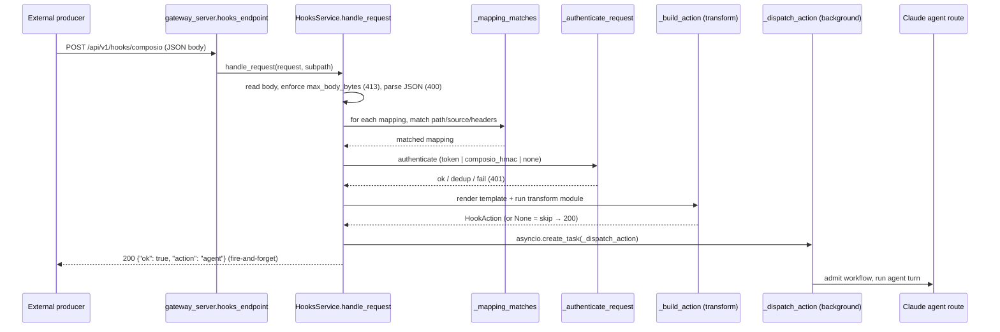
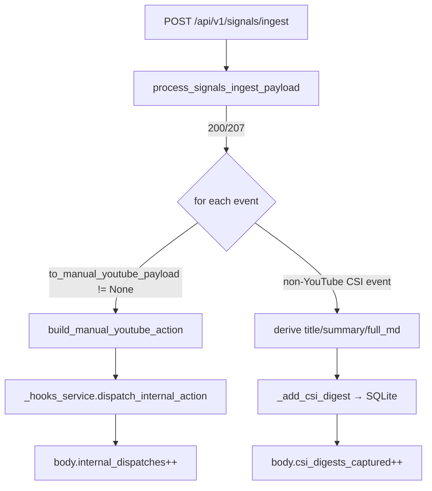

# Webhook Architecture

Inbound webhooks let external producers (Composio triggers, manual YouTube URL
ingestion, the CSI signals fan-in) push events into the Universal Agent runtime,
where they are matched against configured mappings, authenticated, transformed
into agent prompts, and dispatched to a Claude agent route. The implementation
lives entirely in-process inside the FastAPI gateway.

## Endpoints

All webhook routes are declared in `gateway_server.py` and delegate to a single
`HooksService` singleton (`gateway_server.py::_hooks_service`, constructed in the
gateway lifespan setup).

| Method | Path | Handler | Auth | Purpose |
|---|---|---|---|---|
| `POST` | `/api/v1/hooks/{subpath:path}` | `gateway_server.py::hooks_endpoint` → `HooksService.handle_request` | Per-mapping (token / `composio_hmac` / none) | Generic external webhook ingress. `subpath` is the routing key matched against mappings. |
| `GET` | `/api/v1/hooks/readyz` | `gateway_server.py::hooks_readyz` → `HooksService.readiness_status` | **None** (deliberately auth-free for health probes) | Readiness + config introspection. |
| `POST` | `/api/v1/signals/ingest` | `gateway_server.py::signals_ingest_endpoint` | Handled inside `signals_ingest.process_signals_ingest_payload` | CSI / creator-signal fan-in. Routes YouTube events through hooks, captures non-YouTube events as CSI digests. |

If `_hooks_service` is `None` (hooks loop disabled at startup), `/api/v1/hooks/*`
returns `503` and `readyz` returns `{"ready": false, "reason": "hooks_service_not_initialized"}`.

## Request lifecycle (`/api/v1/hooks/{subpath}`)

Key behaviors in `HooksService.handle_request`:

- **Fast-ack, async dispatch.** The HTTP response returns `200` as soon as an
  action is built; the actual agent run happens in a background
  `asyncio.create_task(self._dispatch_action(action))`. Producers get an ack,
  not a result.
- **First-match wins.** Mappings are evaluated in config order; the first one
  whose `_mapping_matches` passes is used.
- **Status codes:** `404` "Hooks disabled" when `config.enabled` is false;
  `413` payload too large; `400` invalid JSON / body read error; `401` when a
  mapping matched but auth failed; `404` "No matching hook found" when nothing
  matched; `200` on accept/skip/dedup; `500` on unhandled exception.

## Configuration & loading

Config is assembled in `HooksService._load_config`:

1. Reads the `hooks` block from `ops_config.json` (via `load_ops_config()`).
2. Calls `_maybe_bootstrap_youtube_hooks` to inject default YouTube mappings
   when no mappings are configured (see below).
3. Applies env-var overrides: `UA_HOOKS_ENABLED` (on/off) and `UA_HOOKS_TOKEN`.
4. Validates into the `HooksConfig` Pydantic model.

`HooksConfig` fields: `enabled` (default `False`), `token`, `base_path`
(default `/hooks`), `max_body_bytes` (default `256 KiB`), `transforms_dir`,
and a list of `HookMappingConfig` `mappings`.

### Mapping schema (`HookMappingConfig`)

- `id` — label for logs/readiness.
- `match` — `{path, source, headers}`. `path` must equal the request `subpath`;
  `source` matches `payload["source"]`; `headers` are compared case-insensitively.
  An absent `match` matches everything.
- `action` — `"agent"` (run a Claude agent) or `"wake"`. **`wake` is not
  implemented** — `_dispatch_action` logs and drops it.
- `auth` — `HookAuthConfig{strategy, secret_env, timestamp_tolerance_seconds=300,
  replay_window_seconds=600}`.
- `transform` — `{module, export}` pointing at a Python file under
  `transforms_dir` that exports a `transform(context)` callable.
- `message_template` / `text_template` / `name` / `session_key` — templates
  rendered with `{{ payload.x }}` / `{{ headers.y }}` dot-notation substitution
  (`_render_template`).
- `to` — target agent route (e.g. `youtube-expert`, `email-handler`).
- `model`, `thinking`, `timeout_seconds`, `deliver`, `allow_unsafe_external_content`.

### Auto-bootstrap (`_maybe_bootstrap_youtube_hooks`)

When `ops_config.json` has no mappings, the service can self-provision YouTube
mappings so a fresh stack does not silently drop hook ingress. Gated by
`UA_HOOKS_AUTO_BOOTSTRAP` (default ON; set to `0/false/off` to disable). It looks
for transform files under `transforms_dir` (default `../webhook_transforms`
relative to the ops config dir):

- `composio_youtube_transform.py` → adds a `composio-youtube-trigger` mapping
  (match `path: composio`, `auth: composio_hmac`) **only if** `COMPOSIO_WEBHOOK_SECRET`
  is set.
- `manual_youtube_transform.py` → adds a `youtube-manual-url` mapping
  (match `path: youtube/manual`, `auth: token`) **only if** a token is configured.
  Manual ingestion is never exposed without token auth.

Bootstrap also sets `max_body_bytes` to `1 MiB` and enables hooks if `enabled`
was unset.

**Code-verified gap vs. legacy docs:** the transform files actually present on
disk at the repo-root `webhook_transforms/` directory are
`manual_youtube_transform.py` and `agentmail_transform.py` (plus `__init__.py`).
There is **no** `composio_youtube_transform.py` in the tree, so the
`composio-youtube-trigger` bootstrap branch will not fire even with
`COMPOSIO_WEBHOOK_SECRET` set — the legacy doc's reference to that transform is
stale. `agentmail_transform.py` exists but is not auto-bootstrapped (it has no
bootstrap branch) and the production email path does not route through it
(see "Email ingress is NOT a webhook" below).

## Authentication (`_authenticate_request`)

Three strategies, selected per-mapping via `auth.strategy`:

| Strategy | Mechanism |
|---|---|
| `none` | Always passes. |
| `token` (default) | If `config.token` is unset, the mapping is **open** (returns `True`). If set, requires `Authorization: Bearer <token>` or `X-UA-Hooks-Token` header to match exactly (`_extract_token`). |
| `composio_hmac` | Standard-Webhooks-style HMAC. Reads `COMPOSIO_WEBHOOK_SECRET`; requires `webhook-id`, `webhook-timestamp`, `webhook-signature` headers. Verifies timestamp within `timestamp_tolerance_seconds`, recomputes HMAC-SHA256 over `id.timestamp.body` (base64), and compares with `hmac.compare_digest`. |

**Gotcha — token absent means open.** Under the default `token` strategy, if no
`config.token`/`UA_HOOKS_TOKEN` is configured, the webhook is unauthenticated by
design (`# Explicitly allow open webhook mappings when no token is configured`).
Set `UA_HOOKS_TOKEN` to lock down token-strategy mappings.

**Composio replay protection.** Within `replay_window_seconds`, a repeated
`webhook-id` is treated as a duplicate: auth still passes but `handle_request`
returns `200 {"ok": true, "deduped": true}` without dispatching. Seen IDs are
tracked in-memory (`_seen_webhook_ids`) and pruned by `_cleanup_seen_webhook_ids`
— so dedup does not survive a process restart.

## Action building & transforms

`_build_action` first creates a base action from the mapping's templates
(`_create_base_action`), then optionally runs the transform module. The transform
is loaded from disk via `importlib` and **cached** in `self.transform_cache`
keyed by resolved module path (`_load_transform`). A transform may:

- return `None` → the hook is **skipped** (`200 {"skipped": true}`),
- return a `dict` → merged over the base action fields,
- raise → surfaced as `500`.

`build_manual_youtube_action` (module-level) constructs the canonical YouTube
agent action: it normalizes the video target, derives a `session_key`
(`yt_<channel>__<video>`), picks `learning_mode` from `mode`
(`explainer_only` / `explainer_plus_code` / `auto`), and emits a structured
prompt routing the run to `youtube-expert` with artifact-path rules.

## Internal (trusted) dispatch path

For in-process producers that should bypass external auth, `HooksService`
exposes:

- `dispatch_internal_payload(subpath, payload, headers)` — runs the payload
  through mapping match + transform without auth, then dispatches.
- `dispatch_internal_action(action_payload)` — validates a `HookAction` and
  dispatches directly (no mapping/auth at all).
- `dispatch_internal_action_with_admission` / `..._background_with_admission` —
  same, but return the admission/execution decision dict.

These are used by the signals-ingest fan-in (below) and by other gateway code
that wants to reuse hook transforms and the agent-dispatch machinery.

## Signals ingest (`/api/v1/signals/ingest`)

`signals_ingest_endpoint` parses the JSON body and calls
`signals_ingest.process_signals_ingest_payload(payload, headers)` for validation
and status. On success (`200`/`207`) it iterates `extract_valid_events(payload)`:

- **YouTube events** are converted to a manual-YouTube action and dispatched via
  the trusted internal path (no external auth) to the `youtube-expert` agent.
- **Non-YouTube CSI events** are *not* dispatched to an agent. They are parsed
  into lean digests (title/summary/full markdown extracted heuristically from the
  event subject) and stored via `_add_csi_digest` for the dashboard CSI feed.
  Those digests can later be emailed to Simone via
  `POST /api/v1/dashboard/csi/digests/{digest_id}/send-to-simone`.

## Workflow admission, concurrency & retries

Agent-kind dispatches for stateful routes (notably YouTube tutorial runs) go
through `WorkflowAdmissionService` before executing (`_admit_workflow_with_retry`
→ `_admit_workflow_once`). The admission decision can be
`run` / `attach_to_existing_run` / `defer` / `skip_duplicate` / `escalate_review`,
giving the service dedup-by-video-id and crash-recovery semantics. DB lock
contention is retried with exponential backoff (bounded by
`UA_HOOKS_WORKFLOW_ADMISSION_RETRY_CEILING_SECONDS`); exhaustion returns
`{"decision": "failed", "reason": "runtime_db_locked", "retryable": true}`.

Agent dispatch concurrency is capped (`UA_HOOKS_AGENT_DISPATCH_CONCURRENCY`,
default `1`) with a pending queue (`UA_HOOKS_AGENT_DISPATCH_QUEUE_LIMIT`,
default `40`) and overflow-notification cooldown.

## Environment variables

| Var | Default | Effect |
|---|---|---|
| `UA_HOOKS_ENABLED` | (ops_config) | Force-enable/disable all hook ingress. |
| `UA_HOOKS_TOKEN` | unset | Token for `token`-strategy mappings. **Unset = token mappings are open.** |
| `UA_HOOKS_AUTO_BOOTSTRAP` | on | Auto-provision YouTube mappings when none configured. |
| `COMPOSIO_WEBHOOK_SECRET` | unset | HMAC secret for `composio_hmac` strategy; also gates composio mapping bootstrap. |
| `UA_HOOKS_AGENT_DISPATCH_CONCURRENCY` | `1` | Max concurrent agent dispatches. |
| `UA_HOOKS_AGENT_DISPATCH_QUEUE_LIMIT` | `40` | Pending dispatch queue cap. |
| `UA_HOOKS_DEFAULT_TIMEOUT_SECONDS` | `0` (none) | Default agent timeout for hook runs. |
| `UA_HOOKS_YOUTUBE_TIMEOUT_SECONDS` | `1800` | YouTube tutorial run timeout. |
| `UA_HOOKS_YOUTUBE_IDLE_TIMEOUT_SECONDS` | (set) | Idle-progress timeout for YouTube runs. |
| `UA_HOOKS_YOUTUBE_INGEST_MODE` | disabled | Local-worker transcript pre-ingest mode. |
| `UA_HOOKS_YOUTUBE_INGEST_URL(S)` | — | Local ingest worker endpoint(s). |
| `UA_HOOKS_YOUTUBE_INGEST_FAIL_OPEN` | `false` | Proceed in degraded mode on ingest failure. |
| `UA_HOOKS_YOUTUBE_INGEST_MIN_CHARS` | `160` | Minimum transcript length to accept. |
| `UA_HOOKS_YOUTUBE_INGEST_COOLDOWN_SECONDS` | `600` | Per-target ingest cooldown. |
| `UA_HOOKS_YOUTUBE_DISPATCH_DEDUP_TTL_SECONDS` | `3600` | Dispatch dedup window. |
| `UA_HOOKS_STARTUP_RECOVERY_ENABLED` | on | Recover interrupted YouTube sessions at startup. |
| `UA_HOOKS_WORKFLOW_ADMISSION_RETRY_*` | 5 / 30 / 300 s | Admission DB-lock backoff base / max-delay / ceiling. |

(Most YouTube/ingest knobs are read in `HooksService.__init__`; full surface is
echoed by `readiness_status`.)

## Email ingress is NOT a webhook

A recurring point of confusion: **production inbound email does not use this
webhook path.** Email arrives over a WebSocket/AgentMail polling path and is
processed by the `email-handler` route. The hooks layer is *aware* of the
`email-handler` route (`hooks_service.py::EMAIL_HANDLER_CANONICAL` /
`_is_email_handler_route`) but the live email pipeline does not enter through
`/api/v1/hooks/*`. Note also that reply-text extraction
(`gateway_server.py::_extract_agentmail_reply_content`) lives in the email
pipeline, not the webhook path.

> [VERIFY: if a webhook-based email ingress mapping is ever reactivated, it would
> need parity with the WebSocket path's reply-extraction
> (`_extract_agentmail_reply_content`) to avoid quoting the full thread back into
> the agent prompt. This is a forward-looking caveat carried from the legacy doc,
> not a code-observed bug in the current path.]

## Gotchas summary

- **Fire-and-forget.** A `200` ack does not mean the agent run succeeded — it
  means an action was built and a background task was created.
- **Open-by-default token auth.** No `UA_HOOKS_TOKEN` → `token`-strategy
  mappings accept any caller. Lock down explicitly.
- **`wake` action is a no-op** — dropped with a log line.
- **Composio dedup is in-memory** — does not survive restart; the durable
  dedup is the workflow-admission layer keyed on video id.
- **Transforms are cached** by resolved path — editing a transform file requires
  a process restart to pick up changes.
- **`/api/v1/hooks/readyz` is intentionally auth-free** so probes don't generate
  401 noise.

## Operations

- **Composio subscription registration:**
  `scripts/register_composio_webhook_subscription.py` registers the production
  Composio webhook subscription pointing at `/api/v1/hooks/composio`. Related
  config secrets: `COMPOSIO_WEBHOOK_SECRET`, `COMPOSIO_WEBHOOK_URL`,
  `COMPOSIO_WEBHOOK_SUBSCRIPTION_ID`.
- **Active production subpaths** (when configured): `composio` and
  `youtube/manual`.
- **Health check:** `GET /api/v1/hooks/readyz` should return
  `ready=true, hooks_enabled=true` with a non-empty `mapping_ids`. Failure
  signatures: `404 Hooks disabled` (hooks not enabled), `401 Unauthorized`
  (auth mismatch / HMAC failure), `404 No matching hook found` (no mapping for
  the subpath), dispatch-queue overflow notifications.

## Related Telegram caveat

Telegram is **polling-based, not webhook-based**. Legacy webhook-registration
helpers (`scripts/register_webhook.py`, `start_telegram_bot.sh`) are stale
relative to the current bot in `bot/main.py` and should not be treated as a
live webhook ingress for this subsystem.
