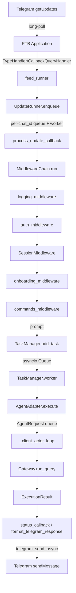

# Telegram Channel

The Telegram channel is a **long-polling bot** (not a webhook) that lets an allowlisted human chat with the Universal Agent (Simone) over Telegram DM. It is implemented as a small middleware framework around `python-telegram-bot` (PTB) under `src/universal_agent/bot/`, runs as its own process, and reaches the agent through the same Gateway abstraction the rest of the system uses.

## What it is

- A standalone process started via `python -m universal_agent.bot.main` (`bot/main.py::run_bot`).
- Polls Telegram's `getUpdates` API via PTB's `app.updater.start_polling()` — there is **no inbound HTTP endpoint / webhook**.
- Authenticates inbound users against an allowlist of numeric Telegram user IDs.
- Forwards each prompt to the agent through a `Gateway` (external HTTP gateway in production, in-process for local dev).
- Sends replies (and proactive heartbeat messages) back over the Telegram HTTP API.

## Process lifecycle (`bot/main.py::run_bot`)

1. `bootstrap_runtime_environment(...)` runs. If `policy.enable_telegram_poll` is false, the bot logs and exits immediately — this is the kill switch (see [Runtime policy gating](#runtime-policy-gating)).
2. `get_telegram_bot_token()` reads `TELEGRAM_BOT_TOKEN`; empty → log error and return.
3. A process heartbeat thread starts (`process_heartbeat.start`, file default `/var/lib/universal-agent/heartbeat/telegram.heartbeat`, 10s interval; override via `UA_TELEGRAM_PROCESS_HEARTBEAT_FILE` / `UA_TELEGRAM_PROCESS_HEARTBEAT_INTERVAL_SECONDS`).
4. Core components are wired: `FileSessionStore`, a `MiddlewareChain`, an `AgentAdapter`, a `TaskManager`, and an `UpdateRunner`.
5. PTB app is built with the token. A single `TypeHandler(Update, feed_runner)` catch-all plus an explicit `CallbackQueryHandler(feed_runner)` route **every** update into the `UpdateRunner`.
6. `agent_adapter.initialize()` connects the gateway and (optionally) starts the heartbeat service; `task_manager.worker(agent_adapter)` is launched as a background task.
7. `app.updater.start_polling()` begins long-polling; the process idles in a `while True: sleep(1)` loop until cancelled.

> [VERIFY] `start.sh` / `START_HERE/start.sh` invoke `uvicorn universal_agent.bot.main:app` — but `bot/main.py` exports **no `app` ASGI object** (only `run_bot()`). The canonical launcher is the systemd unit (`python -m universal_agent.bot.main`) and `START_HERE/START.sh` (`python -m src.universal_agent.bot.main`). The uvicorn invocation in `start.sh` appears stale/broken.

## Message flow



### Ordering guarantees

Two layers serialize work:

- **`UpdateRunner`** (`bot/core/runner.py`) keeps a **per-`chat_id` queue + worker task**, so updates from one chat are processed strictly in order (no races). Different chats run concurrently.
- **`AgentAdapter._client_actor_loop`** (`bot/agent_adapter.py`) is a **single global actor** draining one `request_queue` sequentially — so the agent itself only runs one gateway query at a time, regardless of how many chats are active.

The `TaskManager` sits between them with its own `asyncio.Queue` and a soft concurrency cap (`MAX_CONCURRENT_TASKS`, default 5) — but because the AgentAdapter actor is single-threaded, real agent concurrency is effectively 1.

## Middleware chain (`bot/core/middleware.py`)

Koa/Express-style `await next()` chain. Registered order in `main.py`:

1. **`logging_middleware`** — logs update id / user / chat.
2. **`auth_middleware`** — allowlist gate. If `get_allowed_user_ids()` is non-empty and the user is not in it, replies "⛔ Unauthorized access." and calls `ctx.abort()`. **An empty allowlist allows everyone** (the `if allowed_user_ids and ...` short-circuits).
3. **`SessionMiddleware`** — looks up a stored `session_id` for the chat from `FileSessionStore` and stashes it on `ctx`. (Note: this maps chat_id→session_id in `.sessions/telegram.json`, but the actual agent session is created independently by `AgentAdapter`; see [Session scheme](#session-scheme).)
4. **`onboarding_middleware`** — handles `/start` and `/help`, replies with the intro text, aborts.
5. **`commands_middleware`** — the main command router (below).

`ctx.abort()` sets `ctx.aborted`, which the chain checks before each step to stop deeper middlewares.

## Commands (`bot/plugins/commands.py`)

Text-message commands (all case-insensitive on the prefix):

| Command | Behavior |
|---|---|
| `/agent <prompt>` | Queue a task with the prompt. Empty prompt → usage hint. |
| *(plain text, no leading `/`)* | Treated as an implicit `/agent` prompt. |
| `/status` | Show last 5 tasks for the user + current session mode. |
| `/continue` | Enable continuation mode (next runs reuse the pinned session). |
| `/new` | Disable continuation mode (next run starts fresh). |
| `/cancel [task_id]` | Cancel a *pending* task (running tasks cannot be force-cancelled). |
| `/menu` | Render an inline-button quick-action keyboard. |
| `/briefing` | Read today's `<artifacts>/autonomous-briefings/<date>/DAILY_BRIEFING.md`; send as text or as a file if >4000 chars. Path base is `UA_ARTIFACTS_DIR` (hardcoded fallback `/home/kjdragan/lrepos/universal_agent/artifacts`); `<date>` is computed with `datetime.now(timezone.utc)` — **UTC, not Houston time**, so the briefing can roll over before/after the operator's local midnight. |
| `/delegate <objective>` | Queue a task prefixed with `[DELEGATION REQUIRED]:`. |

Inline-button callbacks handled: `menu_status`, `menu_cancel`, `menu_briefing`, `menu_delegate`, and `vp_accept_<id>` / `vp_reject_<id>` (the VP-mission accept/reject buttons are currently **placeholders** — they edit the message but the comment notes `TODO: Integrate with VP Orchestration approval API`).

Keyboard builders live in `bot/telegram_keyboards.py` (`make_vp_approval_keyboard`, `make_main_menu_keyboard`).

### One active task per user

`TaskManager.add_task` rejects a new task if the user already has a `pending`/`running` task, raising `ValueError("active_task:<id>")`. `commands_middleware` catches this and tells the user to wait / check `/status`. On success it replies `"On it."`.

## Task lifecycle (`bot/task_manager.py`)

`Task` states: `pending → running → completed | error | canceled`. `TaskManager.worker`:

- Pulls task ids off an `asyncio.Queue`.
- Skips pre-cancelled tasks.
- Soft-waits while `active_tasks >= max_concurrent` (`MAX_CONCURRENT_TASKS`).
- Records `queue_wait_seconds` (telemetry log line `telegram_task_queue_wait`).
- Calls `agent_adapter.execute(task, continue_session=...)`.
- Fires `status_callback(task)` on running/completion/error transitions — this is what pushes "📝 Task Update", the formatted result, or the failure text back to the user.

Continuation mode is tracked per-user in a `Set[int]` (`continuation_mode`); it stays ON across `/agent` runs until the user issues `/new`.

## Agent execution & session scheme

`AgentAdapter.execute` wraps each task in an `AgentRequest` (with a `reply_future`), pushes it to `request_queue`, and waits with a timeout (`telegram_task_timeout_seconds()`, default **1800s / 15min**, env `UA_TELEGRAM_TASK_TIMEOUT_SECONDS`). On timeout it sets `task.status="error"` with a hint mentioning the workspace and the env var.

### Session scheme (`_get_or_create_session`)

- **Workspace key:** `tg_<user_id>` under `_telegram_workspace_base()` (default `<repo>/AGENT_RUN_WORKSPACES`, override `UA_WORKSPACES_DIR`).
- **Session id:** `tg_<user_id>_<8-hex>` — a **fresh session per query** by default. This intentionally avoids context-token accumulation across messages.
- **Gateway user id:** `telegram_<user_id>`.
- **Continuity:** instead of reusing the SDK session, the adapter persists a `SessionCheckpointGenerator` checkpoint (`run_checkpoint.json`) into the workspace after each run and **injects the prior checkpoint** (`<prior_session_context>…`) into the next prompt. `/continue` (continuation mode) instead tries `gateway.resume_session(workspace_key)` and only falls back to fresh+checkpoint on failure.
- Sessions are tagged `metadata["source"] = "telegram"` and `metadata["telegram_user_id"]` for dashboard visibility.

### Gateway selection (`AgentAdapter.initialize`)

```
if UA_GATEWAY_URL:        -> ExternalGateway(base_url=UA_GATEWAY_URL)   # canonical production path
else:                     -> InProcessGateway()                        # local-dev only
    requires UA_TELEGRAM_ALLOW_INPROCESS == "1" else raises RuntimeError
```

**Architectural note (gateway-bypass):** `InProcessGateway` runs the agent inside the bot process and **does not go through the gateway server's session store** (per the comment in `agent_adapter.py`). Production must set `UA_GATEWAY_URL` so the bot is a thin client and sessions live in the shared gateway. The production systemd unit enforces this: it sets `UA_TELEGRAM_ALLOW_INPROCESS=0` and exports `UA_GATEWAY_URL=http://127.0.0.1:${UA_LOCAL_WORKER_GATEWAY_PORT:-8012}`.

## Outbound sending (`services/telegram_send.py`)

All sends (task replies, proactive heartbeats, status updates) go through the shared `telegram_send_async` / `telegram_send_sync` utility, not raw PTB calls. It posts directly to the Telegram HTTP API, applies a unified retry policy (bounded retries, rate-limit awareness), and reads `TELEGRAM_BOT_TOKEN` if no token is passed. `main.py::_send_with_retry` is a thin wrapper over it (the `bot` arg is accepted for compatibility but unused).

### Formatting (`bot/normalization/formatting.py`)

`format_telegram_response` builds a stats header (⏱ time, 🔧 tool count, 🏭 code-exec), MarkdownV2-escapes the response body (`escape_markdown(..., version=2)`), appends an optional Logfire trace link, and **truncates to Telegram's 4096-char limit** (`truncate_message`, which prefers paragraph/sentence/word break points and appends a "_Message truncated…_" suffix). Long `/briefing` content is sent as a file instead.

## Heartbeat / proactive messages

When the **in-process** gateway path is used *and* `heartbeat_enabled()` is true, `AgentAdapter` spins up a `HeartbeatService` bridged by `BotConnectionAdapter` (`bot/heartbeat_adapter.py`). The adapter fakes the connection-manager interface the heartbeat service expects (`session_connections`, `broadcast`). On a `heartbeat_summary` broadcast it extracts the recipient id from the session id via `session_id[3:]` and pushes the text via the send callback. (In the production ExternalGateway path, the heartbeat is managed externally and this in-process service does not start.)

> [VERIFY] **Latent id mismatch.** `heartbeat_adapter.py::broadcast` slices `session_id[3:]` and its inline comment assumes `session_id = f"tg_{user_id}"`. But the real session ids minted by `agent_adapter._get_or_create_session` are `tg_<user_id>_<8hex>` (`session_id = f"tg_{user_id}_{uuid.uuid4().hex[:8]}"`). So `session_id[3:]` actually yields `<user_id>_<8hex>`, not a clean numeric user id, and the value is then passed straight to `send_message_callback` as the Telegram chat target. This is a code-level inconsistency (the adapter expects the no-suffix form), not a doc fabrication; the in-process heartbeat path is the only consumer.

## Runtime policy gating

`enable_telegram_poll` is a `FactoryRuntimePolicy` field resolved by role (`runtime_role.py::build_factory_runtime_policy`):

| Role | `enable_telegram_poll` default |
|---|---|
| `HEADQUARTERS` | `True` |
| `LOCAL_WORKER` | `False` |
| `STANDALONE_NODE` | env `UA_STANDALONE_ENABLE_TELEGRAM_POLL` (default `False`) |

Override for any role with capability flag **`UA_CAPABILITY_TELEGRAM_POLL`**. If the resolved policy is false, `run_bot` exits before doing anything.

## Environment variables

| Var | Purpose | Default |
|---|---|---|
| `TELEGRAM_BOT_TOKEN` | Bot token (PTB + send utility). | — (required) |
| `TELEGRAM_ALLOWED_USER_IDS` | Comma-separated numeric user IDs allowed to use the bot. | empty (= allow all) |
| `ALLOWED_USER_IDS` | **Deprecated** legacy alias for the above; emits a warning. | — |
| `UA_GATEWAY_URL` | External gateway base URL (production path). | unset → in-process |
| `UA_TELEGRAM_ALLOW_INPROCESS` | Permit in-process gateway when `UA_GATEWAY_URL` unset. | `1` (config default) / `0` (prod systemd) |
| `UA_TELEGRAM_TASK_TIMEOUT_SECONDS` | Per-task gateway wait timeout. | `1800` (15 min) |
| `UA_WORKSPACES_DIR` | Workspace base for `tg_<user_id>` dirs. | `<repo>/AGENT_RUN_WORKSPACES` |
| `MAX_CONCURRENT_TASKS` | TaskManager soft concurrency cap. | `5` |
| `UA_TELEGRAM_PROCESS_HEARTBEAT_FILE` | Liveness heartbeat file path. | `/var/lib/universal-agent/heartbeat/telegram.heartbeat` |
| `UA_TELEGRAM_PROCESS_HEARTBEAT_INTERVAL_SECONDS` | Heartbeat interval. | `10` |
| `UA_CAPABILITY_TELEGRAM_POLL` | Force-enable/disable polling regardless of role. | unset |
| `UA_STANDALONE_ENABLE_TELEGRAM_POLL` | Polling default for STANDALONE role. | `False` |

## Related Telegram surfaces (not the bot runtime)

Telegram is also used as an **outbound** delivery surface independent of this interactive bot — both go through `services/telegram_send.py`. Example: `services/digest_delivery_reminder.py` pushes reminders/digests via the same send utility. These outbound paths do not consume `getUpdates` and are not gated by `enable_telegram_poll`.

Legacy **webhook** helpers still exist in the tree — `start_telegram_bot.sh` and `scripts/register_webhook.py` — from a pre-polling era. They are **stale**: the current runtime is polling-only. Do not register a webhook against the prod bot token; it would conflict with `getUpdates`.

## Gotchas

- **Allowlist naming drift.** The canonical var is **`TELEGRAM_ALLOWED_USER_IDS`**. `ALLOWED_USER_IDS` is a deprecated fallback that logs a warning (`config.py::_telegram_allowed_user_ids_raw`). An **empty** allowlist means *everyone is allowed* — `auth_middleware` only enforces when the set is non-empty. Don't deploy production with an empty allowlist expecting it to deny.
- **Polling, not webhook.** There is no inbound HTTP route; do not look for a webhook endpoint. Liveness = the polling process + its heartbeat file.
- **In-process gateway bypasses the shared session store.** Always set `UA_GATEWAY_URL` in production; the local systemd unit additionally pins `UA_TELEGRAM_ALLOW_INPROCESS=0` so a misconfiguration fails loud rather than silently running an isolated agent.
- **Fresh session per query.** Continuity comes from checkpoint injection, not SDK session reuse. `/continue` opts into actual `resume_session`.
- **Effective concurrency is 1.** The single `_client_actor_loop` serializes all agent runs despite `MAX_CONCURRENT_TASKS=5`.
- **`status_callback` sends to `task.user_id` as the chat id.** Works for DMs (user_id == chat_id); group replies would need the Task to also carry a chat_id (noted as future work in `main.py`).
- **Stale uvicorn launcher.** `start.sh` references a non-existent `bot.main:app`. Use the systemd unit or `python -m universal_agent.bot.main`.
- **Stale webhook helpers.** `start_telegram_bot.sh` / `scripts/register_webhook.py` predate the polling architecture. Registering a webhook on the prod token will break `getUpdates`.
