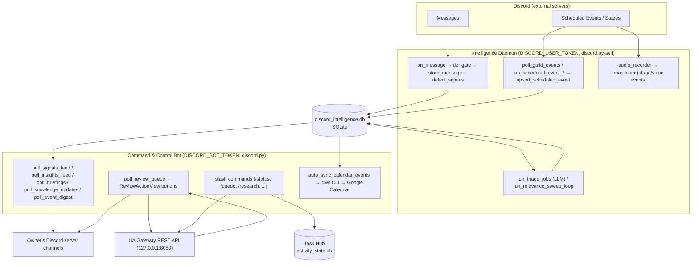

# Discord Operations

Operator-facing reference for the Universal Agent Discord subsystem. This describes
how UA connects to Discord, what it ingests, what runs on a schedule, the slash
commands and approval buttons an operator interacts with, and how it is deployed.

> The Discord package lives at the **repo root** in `discord_intelligence/`, NOT under
> `src/universal_agent/`. It imports UA library code (`universal_agent.task_hub`,
> `universal_agent.infisical_loader`, `universal_agent.durable.db`) but ships as a
> standalone package run by its own systemd units.

## Two bots, two tokens

The subsystem is split into **two separate processes** with **two different Discord
identities**. Do not conflate them — they authenticate differently, run on different
service units, and have non-overlapping responsibilities.

| Process | Module | Token | Library | Role |
|---|---|---|---|---|
| **Intelligence Daemon** | `discord_intelligence.daemon` | `DISCORD_USER_TOKEN` (owner's user account) | `discord.py-self` | Passive, read-only monitoring of every server the owner is in; message/event ingestion; audio recording of stages/voice events |
| **Command & Control Bot** | `discord_intelligence.cc_bot` | `DISCORD_BOT_TOKEN` (bot identity) | standard `discord.py` | Posts feeds/embeds, slash commands, the human-review approval UI; lives on the owner's own server |

Rationale (from `ADDENDUM_User_Token_Architecture.md`): a **bot** can only see servers it
has been invited to, which is impossible for large public servers the owner has no admin
rights on. A **user token** sees everything the owner sees. The daemon therefore uses the
user token for ingestion only — it **never sends messages, reacts, or mutates** anything
on the user account. All outbound activity goes through the bot token on the CC server.

> **TOS note (preserved from `ADDENDUM_User_Token_Architecture.md`):** automating a user
> token is technically against Discord ToS. The daemon mitigates detection risk by keeping a
> single persistent gateway connection, doing passive ingestion only (no REST polling beyond
> scheduled-event fetches), and never sending/reacting/joining/leaving from the user account.

## Configuration & secrets

`config.py` loads `config.yaml` (next to it) and pulls secrets from Infisical via
`init_secrets()` → `initialize_runtime_secrets(force_reload=False)`. Secrets are only
fetched if `DISCORD_USER_TOKEN` is not already in the environment.

- `get_discord_token()` returns `DISCORD_USER_TOKEN` (daemon). Raises if unset.
- `cc_bot.main()` reads `DISCORD_BOT_TOKEN` directly from env. Raises if unset.
- `get_db_path()` resolves the SQLite DB next to the package, default
  `discord_intelligence/discord_intelligence.db` (override via `config.yaml` `database.path`).

`config.yaml` also holds the triage/insight/relevance model names (ZAI/GLM proxy models),
the keyword interest list used by signal detection, and the scheduling intervals.

### Environment-variable flags

| Var | Default | Read in | Effect |
|---|---|---|---|
| `UA_DISCORD_INGEST_TIERS` | `A,B` | `daemon.py` | Comma list of channel tiers whose messages are stored at all. Anything below is silently dropped at `on_message`. |
| `UA_DISCORD_TRIAGE_TIERS` | `A` | `daemon.py` | Tiers swept by the periodic LLM triage job. |
| `UA_DISCORD_TRIAGE_BATCH_LIMIT` | `50` | `daemon.py` | Max messages per channel per triage batch. |
| `UA_DISCORD_AUTO_CREATE_RELEASE_TASKS` | `0` (off; set to `0` in the systemd template) | `daemon.py` | When on, a high-severity `release_detected` signal auto-creates a Task Hub mission. Off → signal is stored only and logged. |
| `UA_DISCORD_SEND_SIMONE_ALERTS` | `0` (off) | `daemon.py` | When on, non-release high-severity signals fire `send_simone_alert`. Off → stored + logged only. |
| `UA_DISCORD_TEXT_EVENT_FALLBACK_ENABLED` | `0` (off) | `daemon.py` | When on, text-mention "event" signals create a supplementary `text_evt_*` event record. Primary event discovery is the structured API. |
| `UA_DISCORD_AUTO_SYNC_CALENDAR_EVENTS` | `1` (on) | `cc_bot.py` | Enables the 15-min loop syncing structured Discord events to Google Calendar. |
| `UA_DISCORD_CALENDAR_SYNC_DAILY_LIMIT` | `10` | `cc_bot.py` | Cap on auto calendar syncs per day. |
| `UA_DISCORD_CALENDAR_SYNC_RETRY_FAILED_AFTER_HOURS` | `6` | `cc_bot.py` | How long before retrying a failed calendar sync. |
| `UA_DISCORD_BRIEFINGS_DIR` | `<repo>/kb/briefings` | `cc_bot.py` | Directory the briefings poller watches for new `*.md` files. |
| `UA_DISCORD_CALENDAR_ID` | `primary` | `calendar_sync.py` | Target Google Calendar id. |
| `UA_GATEWAY_URL` | `http://127.0.0.1:8080` | `integration/gateway_client.py` | UA gateway base URL for review/approval calls. |
| `UA_INTERNAL_API_TOKEN` / `UA_OPS_TOKEN` | — | `integration/gateway_client.py` | Internal service token sent as `x-ua-internal-token`. |

The default-OFF posture on `AUTO_CREATE_RELEASE_TASKS` and `SEND_SIMONE_ALERTS` is the
current safe baseline: passive Discord signals are **recorded** but do not autonomously
spawn work or page Simone unless explicitly opted in.

## Channel tiers

Each channel row in SQLite has a `tier` column (`channels` table, default `'C'`).
`daemon.py` uses two tier gates:

- **Ingest gate** (`INGEST_TIERS`, default `A,B`): in `on_message`, the channel's tier is
  looked up; if it is not in the ingest set the message is dropped before storage. Default
  fallback tier for an unknown channel is `C`, so unconfigured channels are ignored.
- **Triage gate** (`TRIAGE_TIERS`, default `A`): only these tiers are pulled for the
  periodic LLM triage batch.

Tiers are assigned by the operator. The inventory tool seeds the catalog:
`discord_intelligence/inventory/discord_inventory.py` enumerates every server/channel the
token can see and writes `discord_channel_inventory.json` + `.csv` with blank `_tier` /
`_monitor` columns for the operator to annotate. DB tier mutation is via
`DiscordIntelligenceDB.set_channel_tier` / `update_channel_config`. Note:
`set_channel_tier` issues a raw `UPDATE channels SET tier = ?` with **no value
validation** at the DB layer — the A/B/C/E tier vocabulary is a convention enforced
by callers, not a database constraint.

> **Gotcha:** `discord_inventory.py` reads `DISCORD_BOT_TOKEN`, so a bare run only sees
> bot-invited servers. The ADDENDUM intends inventory to run on the **user** token for
> full coverage — run it with `DISCORD_USER_TOKEN` exported as `DISCORD_BOT_TOKEN` (or
> adapt the script) to enumerate everything the owner sees.

## What the Daemon does (ingestion side)

`DiscordIntelligenceClient` (`daemon.py`) starts these `tasks.loop`s in `setup_hook`:

- `run_triage_jobs` — every `scheduling.triage_interval_minutes` (default 60). Pulls
  channels for each triage tier and runs `run_triage_batch` (LLM) per channel.
- `run_relevance_sweep_loop` — every `relevance_sweep_interval_minutes` (default 5).
  Classifies unfiltered messages as signal vs noise (`run_relevance_sweep`).
- `poll_guild_events` — every `event_poll_interval_minutes` (default 30). Fetches each
  guild's structured scheduled events, upserts them, and starts recording any **active**
  stage/voice event not already being recorded. This is the catch-up path for events
  created while the daemon was offline.
- `run_audio_maintenance` — every 6 h. Transcribes events with audio but no transcript,
  then runs 30-day retention cleanup.

Real-time gateway handlers:

- `on_message` — tier gate → `store_message` → `detect_signals` (see below) → store each
  signal. High-severity `release` signals optionally create a Task Hub mission (flagged);
  other high-severity signals optionally send a Simone alert (flagged).
- `on_scheduled_event_create/update/delete` — upsert the event; on
  `scheduled → active` transition for stage/voice, join and record; on
  `active → completed/canceled`, stop and transcribe.
- `on_stage_instance_create/delete` — catches **impromptu** stages started without a
  scheduled event; records them under a synthetic `stage_<id>` event id.

### Signal detection (`signals.py`)

`detect_signals(message_content, channel_tier, author_id=None)` is **deterministic regex**, not an LLM. Rules:

1. `tier_a_activity` (severity high) — any message in a Tier-A channel.
2. `release_detected` (high) — a version pattern (`v?\d+\.\d+\.\d+...`) **plus** a
   release-announcement word, suppressed if the text looks like install/stack-trace noise
   or is >60% code block.
3. `keywords_matched:<list>` (medium) — matches against the `keywords` list in
   `config.yaml` (e.g. "claude code", "mcp", "anthropic API").
4. `text_event_detected` (medium) — message ≥30 chars containing an event word **and** a
   time indicator, not mostly code. This is the supplementary text path (gated by
   `UA_DISCORD_TEXT_EVENT_FALLBACK_ENABLED`); structured-API events are primary.

## What the C&C Bot does (operator-facing side)

`CCBot` (`cc_bot.py`) runs polling loops that fan content from the SQLite DB to named
channels on the owner's server. Channels are resolved by name, primarily under the
`🔬 INTELLIGENCE` and `📋 OPERATIONS` category emojis.

| Loop | Interval | Source → Destination channel |
|---|---|---|
| `poll_database` | 60 s | unnotified `scheduled_events` → `#event-calendar` (with ✅ 🎙️ 📋 ❌ reactions) |
| `poll_signals_feed` | 90 s | unnotified signals → `#signals-feed` (release → `#release-tracker`; high severity also → `#alerts`) |
| `poll_insights_feed` | 120 s | unnotified triage insights → `#announcements-feed` |
| `poll_knowledge_updates` | 120 s | KB updates → `#knowledge-updates` |
| `poll_briefings` | 30 min | new `*.md` in briefings dir → `#briefings` (dedup via `.posted_cache.json`) |
| `poll_event_digest` | 15 min | runs `event_digest.run_pipeline()` |
| `poll_review_queue` | 90 s | gateway review tasks → `#review-queue` (with approval buttons) |
| `auto_sync_calendar_events` | 15 min | structured events → Google Calendar (if flag on) |

### Event-calendar reactions (`on_raw_reaction_add`)

On `#event-calendar` embeds the operator reacts to act on a discovered event:

- ✅ — sync event to Google Calendar (via the gws CLI).
- 🎙️ — flag for audio recording/notes and create a Task Hub mission.
- 📋 — acknowledge only.
- ❌ — decline (sets `status='declined'`, deletes the notice).

### Review-queue approval UI (`views/review_queue.py`)

`#review-queue` posts a `ReviewActionView` per task — a **persistent** button row
(`timeout=None`, re-registered in `setup_hook` via `bot.add_view(ReviewActionView())`)
so buttons survive bot restarts. `custom_id` encodes the task id as `review:<action>:<task_id>`.

| Button | Action |
|---|---|
| **Approve** | `gateway_client.approve_task` (dispatch + claim); falls back to `task_action("approve")` |
| **Reject** | opens `RejectFeedbackModal` → `task_action("park", reason=...)` |
| **Revise** | opens `ReviseNotesModal` → parks original + creates a `[Revision]` Task Hub mission |
| **Later** | `task_action("snooze")` |

All button actions route through the **UA gateway REST API** (`integration/gateway_client.py`)
rather than touching the Task Hub DB directly, for concurrency safety and parity with the
web dashboard. Approvals are attributed `agent_id="discord_kevin"`.

### Slash commands

Registered in `setup_commands(bot)` and synced in `setup_hook`:

| Command | Purpose |
|---|---|
| `/status` | UA overview (pending reviews + dispatch-queue count) via gateway |
| `/queue` | tasks pending human review (gateway) |
| `/task_add` | create a Task Hub item (high priority → posts a mission thread) |
| `/task_list`, `/mission_list`, `/mission_status` | Task Hub item queries |
| `/research` | commission an ATLAS research mission (tags `research`, `ATLAS`) |
| `/briefing` | post the newest briefing markdown |
| `/wiki_query`, `/wiki_add` | query/insert `knowledge_updates` |
| `/discord_search` | search ingested `messages` |
| `/discord_signals`, `/discord_insights` | recent detected signals / insights |
| `/monitor_list` | count of Tier B / Tier C monitored channels |
| `/setup_webhooks` | create `UA-Artifact-Router` webhooks on `#reports` / `#code-artifacts` |
| `/config_triage_frequency` | **stub** — returns a confirmation but does not persist |

> **Simone chat:** `on_message` also watches `#simone-chat`. A message from the hard-coded
> owner id (`351727866549108737`) is wrapped into a Task Hub mission tagged
> `simone-chat`/`direct-prompt` for Simone's loop to pick up. The owner id is a literal
> in `cc_bot.py` — `[VERIFY: confirm this is still the correct owner Discord id]`.

Operational notes preserved from the legacy guide:

- `/task_add` with `priority >= 3` auto-spawns a `#mission-status` tracking thread so VPs
  can report back without spamming.
- `/research <topic>` injects an ATLAS-tagged mission at status `open` so it is claimed on
  the next heartbeat, and also spawns a `#mission-status` thread.
- Discord acts as the operator's tactical surface: a typical loop is `/briefing morning`
  → `/discord_insights` → `/wiki_query` (dedup check) → `/research` to commission ATLAS,
  all from a phone, with results landing back in `#reports` (via `/setup_webhooks` hooks).

## Task Hub integration (`integration/task_hub.py`)

- `create_task_hub_mission(...)` writes **directly** to the activity DB
  (`connect_runtime_db(get_activity_db_path())`), `project_key="immediate"`,
  `source_kind="discord_intelligence"`, `agent_ready=True`. Used by the daemon's
  release-task path, the 🎙️ reaction, `/task_add`, `/research`, and the Revise modal.
- Approval/rejection actions go through the **gateway** (`approve_task_via_gateway`,
  `reject_task_via_gateway`) — never direct DB writes — for concurrency safety.

## Calendar sync (`calendar_sync.py`)

`sync_event_to_calendar` shells out to the **Google Workspace CLI (`gws`)** via
`asyncio.create_subprocess_exec`, building a `calendar events insert` command. It is the
same gws auth machinery used elsewhere in UA:

- `gws_subprocess_env()` materializes the four base64 Infisical secrets
  (`GWS_CREDENTIALS_ENC_B64`, `GWS_TOKEN_CACHE_B64`, `GWS_ENCRYPTION_KEY_B64`,
  `GWS_CLIENT_SECRET_JSON_B64`) into `~/.config/gws/` and forces
  `GOOGLE_WORKSPACE_CLI_KEYRING_BACKEND=file` for headless operation. Raw blobs are popped
  from the subprocess env so they never leak.
- `gws_command_prefix()` resolves in order: `UA_GWS_COMMAND` (shlex-split), else the
  `UA_GWS_BINARY_PATH` binary (default `gws`) on PATH, else `npx -y` the
  `UA_GWS_NPX_PACKAGE` (default `@googleworkspace/cli`) — the npx fallback gated by
  `UA_GWS_ALLOW_NPX_FALLBACK` (default on).
- Calendar event ids are deterministic (`discord<event_id>` sanitized) so re-sync dedupes;
  a "already exists", "duplicate", or `409` from the CLI is treated as success.

> gws auth is the #1 operational time-sink in UA. If calendar sync fails with
> `invalid_grant`, the OAuth refresh token has expired (Google "Testing" mode → ~7-day
> expiry). See the gws runbook in the project `CLAUDE.md` and
> `docs/03_Operations/82_Email_Architecture...`.

## Deployment

Two systemd units (templates in `deployment/systemd/templates/`), both restarted by
`deploy.yml` on every production deploy alongside the gateway/api/webui/telegram services:

- **`ua-discord-intelligence.service`** → `python -m discord_intelligence.daemon`.
  Runs from `__APP_ROOT__/.venv`. The template hard-sets `UA_DISCORD_AUTO_CREATE_RELEASE_TASKS=0`.
- **`ua-discord-cc-bot.service`** → `uv run --with "discord.py>=2.3.0" python -m discord_intelligence.cc_bot`.
  Restarts faster (`RestartSec=5`).

`deploy.yml` does a **baseline-aware** health check on both Discord units: it records
`systemctl is-active` *before* the restart, and only fails the deploy if a service was
healthy pre-deploy but is down after (a regression). Chronically-down Discord services
surface as a warning, not a deploy failure — so a broken Discord bot will **not** block
unrelated deploys.

> **Stale-doc / dependency gotcha:** `discord_intelligence/requirements.txt` says the daemon
> needs a *separate* venv at `/opt/discord-daemon-venv` because `discord.py` and
> `discord.py-self` both install to the `discord` namespace and conflict. But the systemd
> template runs the daemon from `__APP_ROOT__/.venv`. Whichever venv runs the daemon must
> have `discord.py-self` (not standard `discord.py`) installed, or user-token auth fails.
> `[VERIFY: confirm which interpreter ua-discord-intelligence actually uses on the VPS and
> that it has discord.py-self.]`

## CSI Discord watchlist (separate surface)

`src/universal_agent/api/routers/csi_discord_watchlist.py` is a small FastAPI router
(`/api/v1/csi/discord`) that reads/writes a `discord_watchlist.json` under `CSI_DATA_DIR`
(default `/var/lib/universal-agent/csi`). It is the CSI watchlist editor surface (mirrors
the YouTube watchlist) and is **distinct** from the runtime bots above — it does not connect
to Discord itself. `proactive_signals.generate_discord_cards` reads the daemon's SQLite DB
to fold Discord insights into the convergence/CSI card stream.

## Operator quick reference

- **Bot offline?** Check `systemctl status ua-discord-cc-bot` / `ua-discord-intelligence`
  on the VPS. A crash loop will log but won't block deploys.
- **Not ingesting a channel?** Its tier is likely below `UA_DISCORD_INGEST_TIERS`
  (default `A,B`). Re-tier via DB (`set_channel_tier`) — unconfigured channels default to `C`
  and are dropped.
- **Want release signals to auto-spawn work?** Set `UA_DISCORD_AUTO_CREATE_RELEASE_TASKS=1`
  (it is forced `0` in the daemon systemd template — override needs a code/template change,
  since `.env` is clobbered on deploy).
- **Calendar sync broken?** Almost always expired gws OAuth — refresh per the gws runbook.
- **Approve/reject from Discord** uses the gateway REST API; if buttons error, check the
  gateway is up and `UA_INTERNAL_API_TOKEN` is set.
