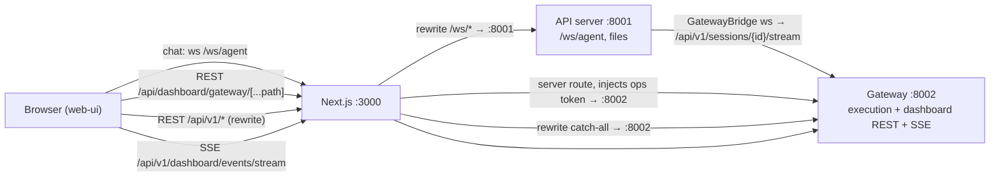
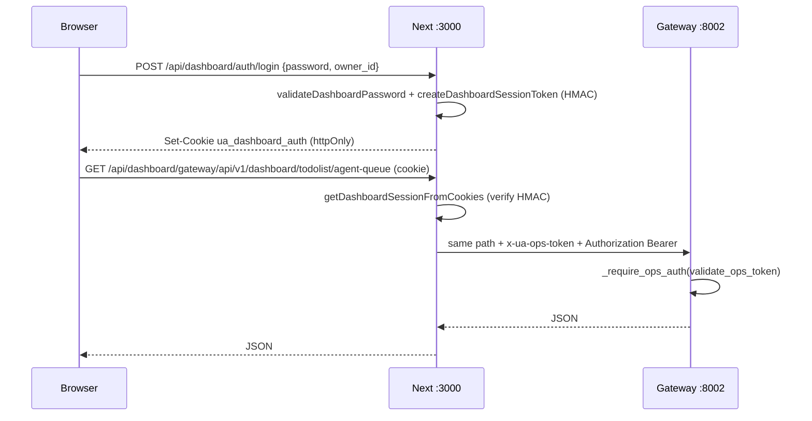

# Web UI Communication

This doc covers how the **Next.js Web UI** (`web-ui/`) talks to the Python backend:
the **chat panel** (live agent conversation over WebSocket), the **activity log /
events** layer (SSE + REST), the **Task Hub dashboard** REST contract, the dashboard
**auth surface** (login cookie + ops-token proxy), and how a chat turn becomes a
tracked Task Hub run.

It is deliberately scoped to the *communication plumbing*. The agent execution engine,
Task Hub schema, and individual dashboard panels are documented elsewhere; here we trace
the wires between browser and backend.

## The three processes

There are three distinct servers in play. Getting them straight is the single most
important thing for working in this area.

| Process | Default port | Entry point | Role |
|---|---|---|---|
| **Next.js Web UI** | 3000 | `web-ui/` (Next dev/prod server) | Serves the dashboard, proxies REST, holds the dashboard auth cookie, signs/decodes session tokens. |
| **API server** | 8001 | `api/server.py::__main__` (`UA_API_PORT`, `UA_API_HOST`) | Thin WebSocket/file/proxy layer. Hosts `/ws/agent`, file/artifact REST, and a passthrough proxy of `/api/v1/sessions/{id}/stream`. |
| **Gateway server** | 8002 | `gateway_server.py::__main__` (`UA_GATEWAY_PORT`, `UA_GATEWAY_HOST`) | The canonical execution engine + the bulk of dashboard REST (`/api/v1/dashboard/*`, `/api/v1/ops/*`) + the real session-stream WebSocket and SSE event stream. |

The API server (8001) does **not** run the agent itself in production. When
`UA_GATEWAY_URL` is set, the API server's WebSocket handler proxies/forwards to the
gateway (8002), which is the same engine the CLI uses. That bridge-selection logic is
the heart of this subsystem (see [Bridge selection](#bridge-selection)).



## Next.js routing: rewrites vs. server route handlers

Two different mechanisms move browser requests to the backend, and they have different
auth behavior. See `web-ui/next.config.js`.

**1. `rewrites()` — transparent proxy, no auth injection.** These forward the raw
request (including the browser's cookies) straight to a backend port:

- `/api/vps/*`, `/api/artifacts/*`, `/api/files/*`, `/api/viewer/*`, `/api/link/*` → API server `:8001`
- `/ws/*` → API server `:8001` (this is how the chat WebSocket reaches `/ws/agent`)
- `/api/:path((?!dashboard/gateway).*)` → Gateway `:8002` (catch-all for everything except the gateway route below)

The negative-lookahead on the catch-all is load-bearing: `/api/dashboard/gateway/*`
must NOT hit this rewrite, because it is handled by a real route handler that injects
the ops token. Order matters — the `viewer` and `link` rewrites are placed before the
catch-all so they reach 8001 instead of being swept to 8002.

**2. `app/api/dashboard/gateway/[...path]/route.ts` — authenticated proxy.** This is a
Node server route (`runtime = "nodejs"`, `dynamic = "force-dynamic"`) that:

- Reads and validates the dashboard session cookie (`getDashboardSessionFromCookies`); returns 401 if `authRequired && !authenticated`.
- Strips hop-by-hop headers, sets `x-ua-dashboard-owner: <ownerId>`, and **injects the ops token** as both `x-ua-ops-token` and `Authorization: Bearer <token>` (`gatewayOpsToken()` reads `UA_DASHBOARD_OPS_TOKEN` → `UA_OPS_TOKEN` → `NEXT_PUBLIC_UA_OPS_TOKEN`).
- Tries multiple gateway base URLs in order (`UA_DASHBOARD_GATEWAY_URL`, `NEXT_PUBLIC_GATEWAY_URL`, `UA_GATEWAY_URL`, then `127.0.0.1:8002`/`localhost:8002`), with a bounded total deadline and per-attempt timeout, retrying transient failures on GET/HEAD only.
- Optionally serves **dev-mode stubs** (`getStubDataForPath`) when `UA_DEV_MODE_STUBS` is enabled (default: on outside production). Stubs are served on a fast path *before* hitting upstream, and as a fallback on upstream-unavailable / 500-HTML / 404. This is why a dev dashboard renders fake data even with no gateway running — it is intentional, not a bug.

> Gotcha: the gateway ops token never reaches the browser through this path — it is
> added server-side in the Node route. The browser only ever holds the HMAC-signed
> dashboard cookie. Do not expose `UA_OPS_TOKEN` to client code.

## Chat panel: the live WebSocket

### Client side (`web-ui/lib/websocket.ts`)

`AgentWebSocket` is the browser chat client. Key behaviors:

- **URL resolution:** `NEXT_PUBLIC_WS_URL` if set; otherwise `${ws|wss}://<host>/ws/agent` where host is forced to `localhost:8001` when running on localhost. So the chat socket bypasses the Next rewrite in local dev and hits the API server directly.
- **Session resumption:** the session id is stored in `sessionStorage` under `universal_agent_session_id` (tab-scoped; migrated once from a legacy `localStorage` global key). On `connect()` it appends `?session_id=<id>` to resume. A `connected` event with `lobby: true` is NOT persisted as a session.
- **Outbound messages:** `{type: "query", data: {text, client_turn_id}}`, plus `approval`, `input_response`, `ping`, `cancel`. `client_turn_id` is a client-generated id used by the gateway for turn dedup.
- **Health:** sends `ping` every `NEXT_PUBLIC_UA_WS_PING_INTERVAL_MS` (30s); if no `pong` within `NEXT_PUBLIC_UA_WS_STALE_AFTER_MS` (90s) it force-reconnects. Reconnect uses exponential backoff (base `..._RECONNECT_BASE_DELAY_MS` 1000, factor 1.6, cap `..._RECONNECT_MAX_DELAY_MS` 30000) with jitter, up to `..._MAX_RECONNECT_ATTEMPTS` (20). A connection is only counted "stable" (resetting the attempt counter) if it survives 3s.
- **Status state machine:** driven entirely by `onclose` (single source of truth); `onerror` only emits a warning + error callback to avoid OFFLINE→CONNECTING flicker. `query_complete`/`cancelled` → `connected`; `status: processing` (non-heartbeat) → `processing`.

### Wire protocol (`api/events.py`)

`EventType` is the canonical enum for the chat wire format. Server→client:
`text`, `tool_call`, `tool_result`, `thinking`, `status`, `heartbeat`,
`auth_required`, `error`, `session_info`, `iteration_end`, `work_product`,
`input_required`, `input_response`, `system_event`, `system_presence`, plus control
events `connected`, `query_complete`, `cancelled`, `pong`. Client→server: `query`,
`approval`, `ping`, `cancel`.

`WebSocketEvent.to_json()` serializes `{type, data, timestamp}`. The `connected` event
(`create_connected_event`) carries both a nested `data.session` object and legacy flat
aliases at the top level — older clients read the flat fields; current clients read
`data.session.session_id`.

### API-server side (`api/server.py::websocket_agent` at `/ws/agent`)

This is what the browser connects to (via the `/ws/*` rewrite or directly to 8001).
Flow:

1. **Auth** via `_authenticate_dashboard_ws` (see [Auth surface](#auth-surface)). Closes with `4401` if auth required and not satisfied. If a `session_id` query param is supplied, ownership is enforced via `_enforce_session_owner` (closes `4403` on mismatch).
2. Registers the socket in a per-process `ConnectionManager` (a flat `connection_id → WebSocket` map with a per-send timeout).
3. Resolves a **bridge** (`get_agent_bridge()`) and creates/resumes a session. `session_id == "global_agent_flow"` is a special observer session.
4. **Passive gateway forwarder:** when `UA_GATEWAY_URL` is set, it opens a *second* upstream WebSocket to `{gateway}/api/v1/sessions/{id}/stream` and forwards background broadcasts (heartbeats, system events) into the browser socket. While an active query is streaming in-flight, runtime event types are suppressed from this forwarder to avoid duplicates (`query_stream_event_types` filter).
5. **Message loop:** a `query` is run in a background `asyncio.Task` (`stream_query`) so the loop can still receive `input_response` mid-query. Duplicate-query guards: ignore while `in_flight`, and ignore identical text within 2s. `input_response`/`cancel` are delegated to the bridge.

### Bridge selection

`api/agent_bridge.py::create_agent_bridge` (aliased `get_agent_bridge`) picks the
execution backend **per connection** (never a global singleton — bridges hold
session/socket pointers that would race):

```
if UA_GATEWAY_URL:        -> GatewayBridge   (proxy to gateway :8002 — production)
elif not UA_FORCE_LEGACY_AGENT_BRIDGE:
                          -> ProcessTurnBridge (in-process turn execution)
else:                     -> AgentBridge      (legacy in-process UniversalAgent)
```

In production `UA_GATEWAY_URL` is set, so the chat path is: browser → API `/ws/agent`
→ `GatewayBridge` → gateway `/api/v1/sessions/{id}/stream`. This guarantees the Web UI
uses the *same canonical engine as the CLI*.

`GatewayBridge` (`api/gateway_bridge.py`):
- Creates/resumes sessions via REST to the gateway (`POST/GET /api/v1/sessions`).
- For a query, opens a WS to the gateway stream, sends `{type: "execute", data: {user_input}}`, and translates each gateway event back into a `WebSocketEvent` via `_convert_gateway_event` (a `type_map` from gateway names to `EventType`). `heartbeat_summary`/`heartbeat_indicator` are wrapped as `system_event`.
- Streaming-text dedup: once a `text` event with `time_offset` is seen, a later `text` with `data.final == true` is dropped (the gateway emits an incremental stream then a final consolidated copy).
- Sends auth headers to the gateway: `Authorization: Bearer <token>` + `x-ua-internal-token` + `x-ua-ops-token`, where token = `UA_INTERNAL_API_TOKEN` → `UA_OPS_TOKEN`.

> Gotcha (operational): both the API server and gateway call
> `initialize_runtime_secrets()` in `__main__` *before* binding, specifically so
> `UA_OPS_TOKEN` / `UA_INTERNAL_API_TOKEN` are present in `os.environ`. If they aren't,
> `GatewayBridge` sends no auth header, the gateway closes the session WS with 403, and
> the dashboard shows a "Gateway unreachable" banner with the API logging "Gateway
> broadcast forwarder error" on a loop. These tokens live only in Infisical, never in
> the deploy.yml `.env` bootstrap dict.

### API-server passthrough proxy (`/api/v1/sessions/{id}/stream`)

`api/server.py::websocket_session_stream_proxy` is a raw pass-through so a deployment
can route the canonical stream path to *either* the API server or the gateway. It does
dashboard auth (or accepts the internal service token), enforces session ownership
(unless authenticated with the internal token), then bidirectionally pipes frames
between the browser socket and the upstream gateway socket.

## Gateway side: session stream + lobby

The real execution WebSocket lives in `gateway_server.py`.

- `@app.websocket("/ws/agent")` (`websocket_agent_compat`) is a compatibility shim for the Next.js chat page. If `?session_id=` is present it delegates to `websocket_stream`; if absent it enters **lobby mode** (`_websocket_lobby`).
- **Lobby mode** accepts the socket and sends a `connected` event with `session_id="", lobby=true`, servicing only pings, until the first `execute`/`query` arrives — *then* it creates a session on demand and hands off to `websocket_stream(skip_accept=True)` replaying the queued message. This prevents phantom idle sessions cluttering the dashboard.
- `@app.websocket("/api/v1/sessions/{session_id}/stream")` (`websocket_stream`) is the canonical endpoint. It validates the session id, registers in the gateway's `ConnectionManager`, resumes/creates the session, enforces the user allowlist (`is_user_allowed`), and emits `connected`. If a turn is already running on reattach, it sends a `status: processing` reattach notice.

The gateway's `ConnectionManager` is richer than the API server's: it tracks
`session_id → {connection_id}` so `broadcast(session_id, data)` can fan a payload to
every socket attached to a session, plus mirror it to any observer attached to the
`global_agent_flow` session (`_annotate_global_flow_payload` stamps origin session ids).
Send failures/timeouts (`WS_SEND_TIMEOUT_SECONDS`) evict stale connections and bump
`ws_send_timeouts`/`ws_send_failures`/`ws_stale_evictions` metrics.

### Turn admission + policy gating

Inside the message loop (`execute`/`query`):

- `/btw <prompt>` enters an ephemeral sidebar session; `/return` exits it. This is UA's own
  minor command (in-memory state via `session_hub.py::set_active_sidebar`), **not** Claude Code's
  native `/btw` slash command — they are unrelated.
- Each turn is admitted under a per-session lock via `_admit_turn`, which returns `accepted` / `busy` / `duplicate_in_progress` / `duplicate_completed`. Only one turn runs per session at a time; rejected turns get a `status` + `query_complete(completed=false)`.
- Before admission, the request is run through session **policy** (`evaluate_request_against_policy`): a `deny` decision emits an error + notification; `require_approval` parks the request in `_pending_gated_requests`, raises an approval, and the user must approve then send `resume`/`continue`.
- The accepted turn runs in a background task (`_run_gateway_session_request`), and `gateway.execute(...)` events are broadcast to all session connections via `manager.broadcast`.

### Chat turn → tracked Task Hub run

This is the bridge between the chat panel and the Task Hub dashboard contract.
`_should_track_chat_panel_request` returns True for interactive user/chat turns (run
kind in `{user, chat_panel, interactive_chat}`) that aren't already claimed and don't
set `skip_task_hub_tracking`. When True, `_prepare_tracked_chat_execution`:

- Creates a Task Hub row `task_id = chat:<session_id>:<turn_id>` with `source_kind="chat_panel"`, labels `["chat-panel","interactive"]`, status open.
- Allocates a fresh execution run workspace (`allocate_execution_run`, run-per-task), claims the task for agent `todo:<session_id>`, and stamps routing to **Simone inline** (`should_delegate=false`) — direct chat messages address Simone herself.
- Replaces the raw user input with a `build_todo_execution_prompt(...)` execution prompt, and re-stamps request metadata with `source="chat_panel_task_hub"`, run lineage (`workflow_run_id`, `workspace_dir`, `codebase_root`, repo-mutation flags), and the claimed task/assignment ids.
- Disables the heartbeat for that session (`skip_heartbeat`, `unregister_session`) so the interactive session isn't double-driven.

A parallel lightweight hook tracks the **`simone_chat`** lifecycle row:
`_record_simone_chat_operator_message` (fires on every inbound operator turn; creates
the row on first message, bumps `last_operator_message_at`, resumes a completed row) and
`_record_simone_chat_query_complete` (stamps `completion_proposed_at` on `query_complete`;
an auto-completer cron later promotes proposed → completed). Both are fire-and-forget and
swallow errors so a Task Hub blip never blocks chat delivery.

## Chat Panel vs. Activity Log: a frontend routing split

A crucial point that is invisible from the backend: **the Chat Panel and the in-session
Activity Log are fed by the same WebSocket** and split apart *client-side* in
`web-ui/lib/store.ts::processWebSocketEvent`. There is no separate transport.

- `text` / `thinking` → `appendToStream(...)` → the **Chat Panel** (agent/sub-agent speech and reasoning).
- `tool_call` / `tool_result` / `status` (with `is_log`) / `iteration_end` → `addToolCall` / `updateToolCall` / `addLog` → the **Activity Log** (`components/CombinedActivityLog.tsx`).

So "what belongs in chat" vs "what belongs in the activity log" is a rendering decision,
not a wire-level one. The store coalesces consecutive `text` from the same author into a
single chat bubble (`appendToStream`), and `finishStream()` finalizes a bubble on author
change or `query_complete` — notably **not** on `tool_call` (a deliberate fix; finishing
on every tool call previously fragmented one agent turn into many bubbles). Author
attribution and per-agent styling are resolved by `getAgentStyle(author)` in
`app/page.tsx`.

`processWebSocketEvent` also dedupes events within a 500ms window (`getEventDedupeKey`),
and the `connected` handler guards against a gateway session id overwriting an existing
VP-observer session.

This is also why the API server's passive gateway-broadcast forwarder suppresses runtime
event types while an active query is in-flight — otherwise the same `text`/`tool_call`
would arrive twice and the store's 500ms dedupe wouldn't always catch it.

## Activity log / events layer

The dashboard "Events" surface (a separate page from the in-session Activity Log above)
consumes two endpoints on the gateway:

- **REST snapshot:** `GET /api/v1/dashboard/events` (and `_query_activity_events`) returns filtered activity events.
- **SSE live stream:** `GET /api/v1/dashboard/events/stream` returns `text/event-stream`. It first emits a `snapshot` payload (`kind: "snapshot"` with all matching events + the current max sequence), then tails the `activity_event_stream` table, emitting `kind: "event"` rows as they append and `kind: "heartbeat"` every `heartbeat_seconds` (default 20, clamped 2–60). The client passes `since_seq` to resume from a cursor; `once=true` returns a single payload and closes. Disabled → 503 if `_dashboard_events_sse_enabled` is off.

The SSE response sets `Cache-Control: no-cache`, `Connection: keep-alive`,
`X-Accel-Buffering: no` (the last disables nginx buffering so events flush
immediately). Counters (`events_sse_connects`, `events_sse_payloads`,
`events_sse_heartbeats`, `events_sse_disconnects`, `events_sse_errors`) are tracked per
connection.

> Note: the chat WebSocket and the activity SSE stream are independent transports for
> different surfaces. The chat panel uses the WebSocket; the Events page uses SSE. Do
> not conflate them — a chat `system_event` over WS is not the same channel as an
> activity-stream row over SSE, even though both can describe similar happenings.

## Task Hub dashboard REST contract

The Task Hub dashboard panels (todolist, mission-control, kanban, approvals, etc.) are
served by `/api/v1/dashboard/*` endpoints on the gateway, reached from the browser via
the authenticated `app/api/dashboard/gateway/[...path]` proxy (which injects the ops
token). Representative endpoints (all gated by `_require_ops_auth`):

- Queues: `GET /api/v1/dashboard/todolist/agent-queue`, `.../personal-queue`, `.../completed`, `.../dispatch-queue`
- Per-task actions: `POST /api/v1/dashboard/todolist/tasks/{id}/action`, `/dispatch`, `/approve`, `/decompose`, `/refine`, `/answer-question`; `GET .../tasks/{id}`, `.../history`, `.../subtasks`, `.../failure-context`
- Mission control: `GET /api/v1/dashboard/mission-control/{tiles,cards,ledger,diagnostics}`, card actions (`thumbs`, `snooze`, `comment`, `dismiss`, `complete`, `dispatch-to-codie`)
- simone_chat lifecycle: `POST /api/v1/dashboard/simone_chat/{task_id}/{complete,reopen}`

These are ordinary JSON REST endpoints; the only communication-layer subtlety is the
auth path (cookie at the Next proxy, ops token injected to the gateway).

> **Dashboard read-path invariant.** GET dashboard endpoints (and their helpers) must
> return the latest *stored* snapshot — they must never recompute it inline. Concretely:
> never call `task_hub.rebuild_dispatch_queue` from a GET handler. The dispatch-queue GET
> (`dashboard_todolist_dispatch_queue`) only reads via `task_hub.get_dispatch_queue`;
> `rebuild_dispatch_queue` is reserved for the explicit POST
> `.../dispatch-queue/rebuild` and the heartbeat eligibility probe
> (`_task_hub_has_dispatch_eligible_items`). Likewise, Proactive-Signals GETs must not
> run CSI/Discord sync inline (use `sync=background` + a cooldown). When a dashboard
> panel is slow, the fix is *never* to raise the Next.js proxy timeout
> (`UA_DASHBOARD_GATEWAY_PROXY_TOTAL_TIMEOUT_MS`) — that masks an inline recompute that
> belongs on a writer path. Full rationale:
> `03_Operations/113_Task_Hub_Dashboard_Read_Path_Performance_2026-04-16.md`.

## Auth surface

There are **two** token-signing implementations that must agree, plus the gateway's
ops-token gate. The cookie is the bridge.

### Dashboard session cookie (the operator login)

The cookie `ua_dashboard_auth` is an HMAC-SHA256-signed token `payloadB64.sig` where the
payload is `{owner_id, exp, roles}`.

- **Signed/issued by Next** (`web-ui/lib/dashboardAuth.ts::createDashboardSessionToken`, set by `app/api/dashboard/auth/login/route.ts`). The login route validates the password (PBKDF2 owner records from `UA_DASHBOARD_OWNERS_JSON`/`UA_DASHBOARD_OWNERS_FILE`, or a single `UA_DASHBOARD_PASSWORD`), then sets an `httpOnly`, `sameSite=lax`, `secure`-in-prod cookie.
- **Verified by Python** (`api/server.py::_decode_dashboard_session_token`) using the *same* secret. The signing secret resolves identically on both sides: `UA_DASHBOARD_SESSION_SECRET` → `UA_OPS_TOKEN` → `UA_DASHBOARD_PASSWORD`. If these differ between the Next process and the Python process, the cookie validates on one side and fails on the other.
- **Auth required?** `_dashboard_auth_required()` / `dashboardAuthRequired()`: explicit `UA_DASHBOARD_AUTH_ENABLED` flag wins; else true if owners are configured; else true if `UA_DASHBOARD_PASSWORD` is set. So with no owners and no password, the dashboard is open (auth not required) and every request resolves to the default owner.
- TTL: `UA_DASHBOARD_SESSION_TTL_SECONDS` (default 86400, min 60).
- **Fails closed when no secret is configured.** A legacy concern flagged a hardcoded `ua-dashboard-dev-secret` fallback as a security gap; that fallback no longer exists in current code. If auth is required but no signing secret resolves, `_dashboard_session_secret()` returns `""` and `_decode_dashboard_session_token` logs `dashboard_session_secret_missing` and rejects (the Next side `createDashboardSessionToken` throws). There is no insecure default anymore.

### Internal service token (server-to-server)

`_authenticate_dashboard_request` / `_authenticate_dashboard_ws` (API server) and
`_require_ops_auth` / `_require_session_api_auth` (gateway) accept an internal token via
`Authorization: Bearer`, `x-ua-internal-token`, or `x-ua-ops-token`. On the API server
`_internal_service_token()` = `UA_INTERNAL_API_TOKEN` → `UA_OPS_TOKEN`. A request bearing
this token is treated as authenticated as the default owner and **bypasses the cookie
check** — this is how the Next gateway proxy and the bridges authenticate to the gateway.

### Gateway ops auth (`_require_ops_auth`)

Most `/api/v1/dashboard/*` and `/api/v1/ops/*` endpoints call `_require_ops_auth`,
which validates the bearer/ops token via `validate_ops_token` against a JWT secret
(`OPS_JWT_SECRET`) and/or legacy `OPS_TOKEN`. If neither `OPS_TOKEN` nor
`OPS_JWT_SECRET` is configured, the gate is a **no-op** (open). Legacy token acceptance
is allowed via `OPS_AUTH_ALLOW_LEGACY` and logged once as a deprecation. A short-lived
JWT can be minted at `POST /auth/ops-token` (gated by `_require_ops_token_issuance_auth`,
which requires the bootstrap `SESSION_API_TOKEN`/`OPS_TOKEN`).

### Session WS auth on the gateway

`_require_session_ws_auth` gates the gateway session-stream WebSocket. Auth is required
when `UA_DEPLOYMENT_PROFILE == "vps"` or `SESSION_API_TOKEN` is set. It accepts
`SESSION_API_TOKEN` *or* `OPS_TOKEN` (the dashboard proxy sends the ops token while
`SESSION_API_TOKEN` may resolve to a separate internal token — both are legitimate).
On VPS with the token unset, the handshake is closed 403/4401 → "Gateway unreachable"
banner (see the Infisical bootstrap gotcha above).



## Environment variables (communication-relevant)

| Var | Where read | Effect |
|---|---|---|
| `UA_GATEWAY_URL` | API server, agent_bridge | If set, Web UI uses `GatewayBridge` → gateway; also enables the passive gateway broadcast forwarder. |
| `UA_FORCE_LEGACY_AGENT_BRIDGE` | agent_bridge | Forces the legacy in-process `AgentBridge` (only when `UA_GATEWAY_URL` unset). |
| `UA_API_PORT` / `UA_API_HOST` | api/server `__main__` | API server bind (default 8001 / 0.0.0.0). |
| `UA_GATEWAY_PORT` / `UA_GATEWAY_HOST` | gateway `__main__` | Gateway bind (default 8002 / 0.0.0.0). |
| `UA_INTERNAL_API_TOKEN` / `UA_OPS_TOKEN` | both servers, bridges | Internal service token for server-to-server auth; also a fallback signing secret. |
| `UA_DASHBOARD_AUTH_ENABLED` | both auth impls | Explicit override of whether dashboard login is required. |
| `UA_DASHBOARD_PASSWORD` | both auth impls | Single shared dashboard password (and fallback signing secret). |
| `UA_DASHBOARD_OWNERS_JSON` / `UA_DASHBOARD_OWNERS_FILE` | both auth impls | Multi-owner PBKDF2 records (env overrides file by owner_id). |
| `UA_DASHBOARD_SESSION_SECRET` | both auth impls | Preferred HMAC signing secret for the session cookie. Must match across Next + Python. |
| `UA_DASHBOARD_SESSION_TTL_SECONDS` | Next | Cookie TTL (default 86400). |
| `UA_DASHBOARD_OWNER_ID` | both | Default owner id. |
| `UA_DASHBOARD_OPS_TOKEN` | Next gateway proxy | Preferred ops token injected to gateway (falls back to `UA_OPS_TOKEN`). |
| `UA_DASHBOARD_GATEWAY_URL` / `NEXT_PUBLIC_GATEWAY_URL` | Next gateway proxy | Upstream gateway candidates (before localhost fallbacks). |
| `UA_DASHBOARD_GATEWAY_PROXY_TOTAL_TIMEOUT_MS` / `..._ATTEMPT_TIMEOUT_MS` | Next gateway proxy | Proxy timeouts (defaults 30000 / 15000, capped). |
| `UA_DASHBOARD_ENFORCE_OWNER_FILTER` | Next gateway proxy | Adds `owner=<id>` query param to certain ops endpoints. |
| `UA_DEV_MODE_STUBS` | Next gateway proxy | Serve canned dashboard data when upstream missing (default on outside prod). |
| `SESSION_API_TOKEN` (`UA_INTERNAL_API_TOKEN`) / `UA_DEPLOYMENT_PROFILE` | gateway | Gate session WS + REST auth; `vps` profile forces auth. |
| `OPS_TOKEN` / `OPS_JWT_SECRET` / `OPS_AUTH_ALLOW_LEGACY` | gateway | `_require_ops_auth` validation; both unset → ops endpoints open. |
| `NEXT_PUBLIC_WS_URL` | browser | Override chat WebSocket URL. |
| `NEXT_PUBLIC_UA_WS_*` | browser | Reconnect/ping/stale tuning (see [Client side](#client-side-web-uilibwebsockets)). |
| `LOGFIRE_TOKEN` | both | Surfaced as `logfire_enabled` in session info. |

## Gotchas summary

- **Three processes, two auth schemes.** Cookie (operator) at the Next layer; ops/internal token (server-to-server) at the gateway. The Next gateway-proxy route bridges them by validating the cookie then injecting the token.
- **The session-cookie secret must match** between the Next process and the Python process, or login validates on one side and fails on the other.
- **Infisical bootstrap before bind.** Both servers load runtime secrets in `__main__` so `UA_OPS_TOKEN`/`UA_INTERNAL_API_TOKEN` are present before any auth gate or bridge call. Missing → 403 on session WS → "Gateway unreachable" banner.
- **Dev stubs are intentional.** A dev dashboard renders fake panel data via `getStubDataForPath` when the gateway is down; this is `UA_DEV_MODE_STUBS`, not a real backend response.
- **Lobby mode prevents phantom sessions.** A chat socket with no `session_id` does not create a session until the first query.
- **Bridges are per-connection, never global** — they hold session/socket state that would race across concurrent clients.
- **Chat turns become tracked Task Hub runs** (`chat:<session>:<turn>`, source_kind `chat_panel`, routed to Simone inline), and a parallel `simone_chat` row tracks the conversation lifecycle.
- The catch-all rewrite's negative lookahead on `dashboard/gateway` is load-bearing — without it the authenticated proxy route would be shadowed by a transparent rewrite that injects no token.
- **Chat panel and in-session Activity Log share one WebSocket;** the split is a frontend routing decision in `store.ts`, not a transport boundary. The standalone Events page (SSE) is yet another channel.
- **session_id vs run_id.** A live chat session has a websocket `session_id`; the durable workspace/run has a separate `run_id`. The canonical file tree lives under the run workspace — prefer the run-backed file APIs (`GET /api/v1/runs/{run_id}/files[...]`) over the legacy session-scoped routes (`/api/files?session_id=...`).
- The gateway session stream accepts **both** `{type:"query", data:{text}}` and `{type:"execute", data:{user_input}}`; both converge into the same request path. The browser chat client sends `query`; the `GatewayBridge` sends `execute`.

### Architectural / operational notes (carried context, partly outside this code path)

- **Three independent trust surfaces** (dashboard cookie+HMAC, ops token, CSI ingest HMAC) do not share a common abstraction. The dashboard proxy injecting ops tokens on behalf of an authenticated cookie user is the seam that joins the first two.
- **`web-ua` `.env.local` is regenerated on every deploy** from Infisical (via `scripts/render_service_env_from_infisical.py`); the Next.js process has no Infisical SDK, so deploy-time rendering is the required pattern for `UA_DASHBOARD_*` / `UA_OPS_TOKEN` to reach it. VPS-side hand edits to `.env.local` do not survive a deploy.
- **Telegram bypasses this gateway session model** entirely (its own `tg_<user_id>` session scheme); it is not part of the Web UI communication path described here.
