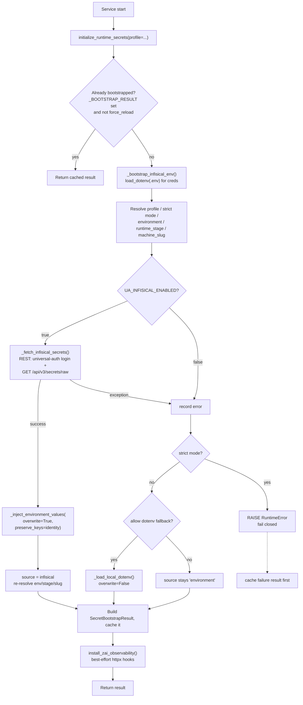

# Secrets & Infisical

## What this subsystem is

Infisical is the single source of truth (SSOT) for all Universal Agent application configuration and secrets. At process start, every UA Python service calls `initialize_runtime_secrets()` (`src/universal_agent/infisical_loader.py`), which authenticates to Infisical with machine-identity (universal-auth) credentials, fetches every secret in the project at the configured path, and injects them onto `os.environ`. The vault is **authoritative**: fetched values overwrite anything already in the environment, with a small carve-out for "bootstrap identity" keys (machine role/stage/slug and the Infisical creds themselves).

There is exactly one bootstrap dependency that does **not** come from Infisical: the machine-identity credentials needed to talk to Infisical in the first place. These live in a tiny `.env` file on disk. Three are the actual *credentials* and are validated as required in `infisical_loader.py::_fetch_infisical_secrets` (`INFISICAL_CLIENT_ID`, `INFISICAL_CLIENT_SECRET`, `INFISICAL_PROJECT_ID`); a fourth, `INFISICAL_ENVIRONMENT`, sits alongside them but is *configuration*, not a credential — when unset, `_normalize_infisical_environment` defaults it to `production` on the production VPS (`_on_production_vps()`) and to `development` everywhere else. Everything else is pulled from the vault.

> Operator rule (from CLAUDE.md): never read secrets from `.env`/`os.getenv` except for the Infisical bootstrap creds. Call `initialize_runtime_secrets()` at startup. Never commit secrets.

## The bootstrap flow



### Step by step (`initialize_runtime_secrets`)

1. **Singleton guard.** A module-level `_BOOTSTRAP_RESULT` cached under `_BOOTSTRAP_LOCK` makes this idempotent. The first successful (or strict-failure) call wins; later calls return the cache unless `force_reload=True`. This is why dozens of entrypoints can each call it safely — only the first does real work.
2. **Resolve runtime identity.** Profile via `_resolve_profile` (default `local_workstation`; valid: `local_workstation`, `standalone_node`, `vps`). Strict mode via `_strict_mode_for_profile` — **defaults ON for `vps` and `standalone_node`**, OFF for `local_workstation`, overridable with `UA_INFISICAL_STRICT`. Environment is normalized via `_normalize_infisical_environment` (legacy aliases like `dev`→`development`, `prod`→`production` are mapped). `runtime_stage` and `machine_slug` are derived (see below).
3. **Fetch.** If `UA_INFISICAL_ENABLED` (default `true`), `_fetch_infisical_secrets()` reads the bootstrap creds, validates the three required ones are present (`CLIENT_ID`, `CLIENT_SECRET`, `PROJECT_ID`), then calls the REST API.
4. **Inject.** Fetched values go through `_inject_environment_values(..., overwrite=True, preserve_keys=_BOOTSTRAP_IDENTITY_KEYS)`.
5. **Re-resolve identity** from the now-injected env (the vault can override `INFISICAL_ENVIRONMENT` etc., except identity keys).
6. **Fallback / fail-closed.** If the fetch failed or Infisical was disabled and `source != "infisical"`: in strict mode, **raise `RuntimeError` and cache a failure result** (fail closed — no silent degradation in prod); otherwise optionally load a local `.env` via `_load_local_dotenv` (overwrite=False).
7. **Observability hook.** Best-effort `install_zai_observability()` monkey-patches httpx to capture outbound ZAI traffic. Wrapped in a bare `except` so it can never break bootstrap.

## The fetch path (REST, not the SDK or CLI)

`_fetch_infisical_secrets_via_rest()` uses `httpx` directly:

- `POST {api_url}/api/v1/auth/universal-auth/login` with `{clientId, clientSecret}` → `accessToken`.
- `GET {api_url}/api/v3/secrets/raw` with `workspaceId`, `environment`, `secretPath`, `recursive=true`, `include_imports=true`, bearer auth.
- Parses `payload["secrets"]`, reading `secretKey`/`secretValue` (with snake_case fallbacks).

`api_url` defaults to `https://app.infisical.com` and is trailing-slash-stripped. `secret_path` defaults to `/`. Timeout is 20s.

> Note: although CLAUDE.md and the launcher docstring describe the "Python Infisical SDK," the actual fetch in `infisical_loader.py` is hand-rolled REST via `httpx`. There is no `infisicalsdk` import in the loader. The CLI (`infisical run`) is deliberately *not* used at runtime — it needs an interactive login context that the VPS lacks. [VERIFY: confirm no other code path uses the SDK; the loader does not.]

## Bootstrap identity keys — the "overwrite=True but identity preserved" rule

This is the single most important behavior to understand. Historically `_inject_environment_values` defaulted to `overwrite=False`, so **any** key already in `os.environ` was silently skipped. On the VPS, systemd `Environment=` + the bootstrap `.env` + module-import side effects pre-populate ~37 keys before bootstrap runs. Any of those overlapping an Infisical secret stayed frozen at its bootstrap value forever — operator-flippable flags like `UA_ATLAS_DIRECT_DISPATCH_ENABLED` were unreachable from the vault.

The fix: Infisical is authoritative (`overwrite=True`), **except** for a frozen set of identity keys that must never be moved by remote config (`_BOOTSTRAP_IDENTITY_KEYS`):

```
INFISICAL_CLIENT_ID, INFISICAL_CLIENT_SECRET, INFISICAL_PROJECT_ID,
INFISICAL_API_URL, INFISICAL_ENVIRONMENT, INFISICAL_SECRET_PATH,
UA_RUNTIME_STAGE, UA_MACHINE_SLUG, UA_DEPLOYMENT_PROFILE,
FACTORY_ROLE, UA_INFISICAL_ENABLED, UA_INFISICAL_STRICT,
UA_INFISICAL_ALLOW_DOTENV_FALLBACK, UA_DOTENV_PATH
```

The injection logic, in order:

```python
# 1. exclude_prefixes filter
# 2. identity carve-out: if clean_key in preserve_keys and already in os.environ -> skip
# 3. general overwrite gate: if not overwrite and clean_key in os.environ -> skip
# 4. else os.environ[clean_key] = value
```

So a pre-set identity key wins over the vault **even when `overwrite=True`**. Everything else: vault wins.

There is one special alias inside the injector: setting `ZAI_API_KEY` also sets `Z_AI_API_KEY` (for `zai_vision` tool compatibility).

## Runtime identity resolution

`runtime_role.py` resolves the machine's identity:

- `resolve_runtime_stage(raw)` — validates against `{development, staging, local, production}`; raises on unknown. Returns `None` if unset.
- `resolve_machine_slug(raw)` — falls back through `UA_MACHINE_SLUG` → `UA_FACTORY_ID` → `INFISICAL_MACHINE_IDENTITY_NAME` → `socket.gethostname()`.
- `resolve_factory_role(raw)` — `FACTORY_ROLE` ∈ `{HEADQUARTERS, LOCAL_WORKER, STANDALONE_NODE}`; **unknown values fall back to `LOCAL_WORKER`** (fail-safe, logged CRITICAL).

`_resolve_runtime_stage_for_bootstrap` precedence: explicit `UA_RUNTIME_STAGE` → environment-if-valid-stage → `production` if profile is `vps` → else `development`.

`runtime_bootstrap.py::bootstrap_runtime_environment` is the higher-level wrapper that calls `initialize_runtime_secrets`, then `apply_xai_key_aliases()` (mirrors `GROK_API_KEY` ↔ `XAI_API_KEY`), then `normalize_llm_provider_override()`, then `build_factory_runtime_policy()`. Use this when you need the policy object, not just secrets.

## Environment flags (defaults)

| Flag | Default | Effect |
|---|---|---|
| `UA_INFISICAL_ENABLED` | `true` | Master switch for the Infisical fetch. `0` skips it entirely. |
| `UA_INFISICAL_STRICT` | `true` on `vps`/`standalone_node`, else `false` | Fail-closed: raise if Infisical can't load. |
| `UA_INFISICAL_ALLOW_DOTENV_FALLBACK` | `true` on `local_workstation`, else `false` | Allow `.env` fallback when Infisical is unavailable (non-strict only). |
| `UA_DEPLOYMENT_PROFILE` | `local_workstation` | One of `local_workstation`, `standalone_node`, `vps`. |
| `UA_DOTENV_PATH` | repo-root `.env` | Override the bootstrap/fallback `.env` location. |
| `INFISICAL_ENVIRONMENT` | `development` | Vault environment; legacy aliases normalized. |
| `INFISICAL_SECRET_PATH` | `/` | Path within the project. |
| `INFISICAL_API_URL` | `https://app.infisical.com` | API base. |

`_env_flag` parsing: truthy `{1,true,yes,on}`, falsy `{0,false,no,off}`, anything else → default.

## `dev mirrors prod` — and the trap it creates

The key design property: dev and prod run the **identical** bootstrap code with the **same vault**, differing only in `INFISICAL_ENVIRONMENT` (dev = `development`, prod = `production`) and profile/strictness. There is no separate dev secrets store and no dev-only code path inside the loader. On a local workstation, if Infisical is briefly unreachable, the non-strict `.env` fallback keeps you running; on the VPS, strict mode refuses to start with stale or missing secrets.

**The trap:** Infisical's `development` environment is often a near-mirror of `production` for parity. Combined with `overwrite=True`, that means a local `just dev` run pulls down prod-shaped values for keys like `UA_HEARTBEAT_ENABLED=1`, `UA_CRON_ENABLED=1`, etc. — and would happily start autonomous loops on the desktop, burning ZAI quota and colliding with prod.

The defense lives in `loop_control.py::should_run_loop` (verified): when `UA_RUNTIME_STAGE=development`, any truthy `UA_<NAME>_ENABLED` is **ignored** as "historical-prod-parity pollution." Dev defaults every loop OFF; the only way to turn a loop on in dev is the explicit operator opt-in `UA_DEV_<NAME>_FORCE_ON=1`. An explicit `UA_<NAME>_ENABLED=0/false` is still honored (operator asked for off). `explain_loop_decision` prints the reasoning at boot (grep `loop_control:`).

This is the practical consequence of "vault is authoritative": secrets flow reliably, but *enablement flags* must be re-gated in dev because the vault values are prod's, not dev's.

## Deploy-time `.env` bootstrap (VPS)

`deploy.yml` **rewrites** `/opt/universal_agent/.env` on every deploy with a clean bootstrap dict (the three Infisical creds plus `INFISICAL_ENVIRONMENT=production`, `UA_RUNTIME_STAGE=production`, `FACTORY_ROLE=HEADQUARTERS`, `UA_DEPLOYMENT_PROFILE=vps`, `UA_MACHINE_SLUG=vps-hq-production`, `UA_INFISICAL_ENABLED=1`, plus port config). File is `chown ua:ua`, `chmod 600`.

> **Gotcha (operator-critical):** because deploy *overwrites* the VPS `.env`, hand-edits to `/opt/universal_agent/.env` do NOT survive a deploy. Durable values must live either in Infisical (preferred) or in the deploy.yml bootstrap dict / code defaults. This bit the team before (see MEMORY: ".env clobbered by deploy").

### Deploy preflight

After writing the bootstrap `.env`, `deploy.yml` runs `scripts/deploy_validate_runtime.sh` (which drives `scripts/validate_runtime_bootstrap.py`) with `--expect-environment production`, `--expect-runtime-stage production`, `--expect-factory-role HEADQUARTERS`, `--expect-deployment-profile vps`, `--expect-machine-slug vps-hq-production`, and `--require UA_OPS_TOKEN`. This confirms Infisical connectivity and that the resolved identity matches expectations **before** services restart — a fail-closed gate, not a post-hoc check.

## Rendering env files for services that can't call Infisical

Some consumers (notably the Next.js `web-ui`) can't run the Python bootstrap, so `scripts/render_service_env_from_infisical.py` materializes a small env file from the Infisical-loaded process env:

- `initialize_runtime_secrets(profile=..., force_reload=True)` to load the vault, then
- `--entry OUT=SRC1,SRC2` mappings; each output key takes the **first non-empty** source value (`_render_lines`). This is the "token fallback order" — e.g. `UA_DASHBOARD_OPS_TOKEN=UA_DASHBOARD_OPS_TOKEN,UA_OPS_TOKEN` falls back to `UA_OPS_TOKEN` if the first is empty.
- `--include-runtime-identity` also emits stage/role/slug keys (`_runtime_identity_entries`).
- `--allow-missing` writes empty values instead of failing; otherwise a missing required key raises.
- Output is written `0o640`.

Invoked from `deploy.yml`, `scripts/install_vps_webui_env.sh`, `scripts/install_local_webui_env.sh`, and `scripts/dev_up.sh`. The VPS installer renders to a temp file, then installs it mode `640` at `$APP_ROOT/.env.webui` and wires it via a systemd drop-in `EnvironmentFile=-...`. Ownership is `root:$APP_USER` (i.e. `root:ua`, the intended path) when `APP_USER` resolves as a real user (`install -o root -g "$APP_USER"`); it falls back to `root:root -m 640` if that user lookup fails.

## Writing secrets back to Infisical

Two write paths:

1. **`infisical_loader.upsert_infisical_secret(key, value)`** — runtime single-key upsert. REST: tries `PATCH /api/v3/secrets/raw/{key}` first; on 404/not-found falls back to `POST` (create). On success it also sets `os.environ[key]` so the change reflects immediately without a restart. **If bootstrap creds are missing it updates only `os.environ` and returns `False`.**
2. **`scripts/infisical_upsert_secret.py`** — batch CLI for ad-hoc/provisioning. Supports `--secret KEY=VALUE` (literal) and `--secret-env NAME` (read `NAME` from current env and upsert its value). Can `--ensure-environment` (create the env via `POST /api/v1/projects/{id}/environments`). Computes a create/update/unchanged plan, supports `--dry-run`, and uses the v4 batch endpoint (`/api/v4/secrets/batch`, POST for creates, PATCH for updates).

> Consumers must use path 1 (or path 2), **never the raw `infisical_client` SDK** — it is not a UA dependency and adds a second, divergent auth path. Example: the CSI Threads daily token-refresh sync (`CSI_Ingester/development/scripts/csi_threads_infisical_sync.py`, run by `csi-threads-token-refresh-sync.service`) loops over the refreshed secret payload and calls `infisical_loader.upsert_infisical_secret` per key. Because that primitive resolves environment/path from the same `INFISICAL_*` env the refresh read path (`_fetch_infisical_secrets`) uses, the write lands at exactly the env/path the secrets were read from (production / `/` on the VPS). It previously imported `infisical_client` directly and crashed every run with `ModuleNotFoundError` after the token refresh had already succeeded — the refresh worked but the persist-to-vault step never ran. The codebase is now SDK-free: the `infisical-python` package was removed from the project on 2026-05-12 (no cp313 wheel; `httpx` covers the universal-auth + `/api/v3/secrets/raw` surface), and the last code references (`CSI_Ingester/development/csi_ingester/infisical_bootstrap.py`, which now reads via its own REST helper `_fetch_via_rest`) no longer import it.

> Operator note: Kevin standing-authorized self-service Infisical mutations via the machine-id creds in shell. Never `set`/delete/rotate production secrets without explicit approval; never print secret VALUES to chat.

### Infisical CLI gotchas (ad-hoc shell use)

When using the `infisical` CLI directly (not the REST loader above), several sharp edges recur:

- **Environment slugs are strict full names** — `development` / `production` / `staging`. Passing `--env=prod` or `--env=dev` does **not** alias; it returns a cryptic `Folder with path '/' in environment 'prod' was not found`. Always use the full slug (matching `_LEGACY_INFISICAL_ENV_ALIASES`, which only normalizes the aliases on the *Python* path, not the CLI).
- **Expired CLI session silently triggers an interactive login** instead of erroring — empty output is the tell that this happened. Always pass `--token` (a universal-auth token from the machine-id creds) so headless invocations fail loudly instead of hanging on a login prompt.
- **Bare `infisical secrets` with no subcommand hangs / returns empty** when piped. Use an explicit subcommand (`secrets get`, `run -- <cmd>`).

## Self-service secret access for agents (machine-identity)

Agents (Claude Code, Cody, etc.) have machine-identity Infisical creds pre-loaded in their shell — fetch secrets directly instead of asking the operator. Sources: Kevin's desktop `~/.config/ua/infisical-machine-id`, VPS `/opt/universal_agent/.env`. Both export `INFISICAL_CLIENT_ID` / `INFISICAL_CLIENT_SECRET` / `INFISICAL_PROJECT_ID`. The interactive user-CLI session at `~/.infisical/infisical-config.json` is flaky for headless calls — **DO NOT rely on it; always use universal-auth (machine-identity)**.

**Inject every secret into a child process (preferred pattern):**
```bash
TOK=$(infisical login --method=universal-auth \
        --client-id="$INFISICAL_CLIENT_ID" \
        --client-secret="$INFISICAL_CLIENT_SECRET" --plain --silent)
INFISICAL_TOKEN="$TOK" infisical run \
    --projectId="$INFISICAL_PROJECT_ID" --env=development --silent -- \
    <your command>
```

**Single-key read:** swap `run … -- <cmd>` for `secrets get KEY_NAME --plain --silent` (token + projectId/env flags stay the same).

**Guardrails — NON-NEGOTIABLE:**
- **NEVER print secret VALUES to chat.** `infisical secrets` with `--plain` dumps `KEY=VALUE` pairs (not just keys). Filter with `awk -F= '{print $1}'` when you only want to enumerate names.
- Prefer `infisical run -- CMD` over fetching to shell variables — the secret stays inside the child process and never lands in your env or command history.
- Ask the operator before reading production secrets if the task could be done in dev.
- Never `infisical secrets set` / delete / rotate without explicit operator approval.
- For UA's own Python services, the canonical bootstrap is still `initialize_runtime_secrets()` — use the CLI only for ad-hoc diagnostics, script invocations, and one-off lookups.

**Desktop `claude` Hostinger lazy-load:** bare `claude` on Kevin's desktop lazy-loads `HOSTINGER_API_TOKEN` (and only that) via `_ua_load_mcp_secrets` in `~/.bashrc`, cached at `~/.cache/ua/hostinger_token`. This replaced an eager `infisical secrets get` block on 2026-05-17 because it was hanging Antigravity terminals on an interactive arrow-key prompt that `--silent` didn't suppress. If MCP Hostinger stops resolving, `rm ~/.cache/ua/hostinger_token` forces a refresh on next `claude` launch.

## Interactive `claude` launcher (the MCP placeholder path)

Interactive `claude` sessions do **not** run the UA service bootstrap, so `${VAR}` placeholders in `.mcp.json` (e.g. `AGENTMAIL_API_KEY`, `DISCORD_BOT_TOKEN`, `HOSTINGER_API_TOKEN`) would substitute to empty and MCP children would fail. `scripts/claude_with_mcp_env.sh` → `scripts/_claude_launcher.py` solves this:

1. Source `$UA_INSTALL_ROOT/.env` bootstrap creds (auto-detects `/opt/universal_agent` then the repo root).
2. Call `initialize_runtime_secrets(exclude_prefixes=("ANTHROPIC_",))` so the entire `ANTHROPIC_*` namespace is filtered at injection time — keeping Anthropic Max OAuth (`~/.claude/.credentials.json`) as the resolved auth path instead of being overridden by a vault `ANTHROPIC_API_KEY` / `ANTHROPIC_BASE_URL` (which routes to ZAI/GLM).
3. **Defense-in-depth strips** after bootstrap: remove any leaked `ANTHROPIC_*` (`_strip_interactive_routing_vars`) and the exact names `GH_TOKEN`/`GITHUB_TOKEN` (`_strip_named_interactive_vars`) — a stale Infisical `GH_TOKEN` was breaking every interactive `gh` call and `/ship`'s deploy watching; stripping it lets `gh` resolve file-stored OAuth.
4. `os.chdir(UA_ORIGINAL_CWD)` then `execvp("claude", ...)`.

The `exclude_prefixes` parameter on `initialize_runtime_secrets` exists specifically for this path. **UA Python services call without it** — they need the `ANTHROPIC_*` keys for direct-SDK code paths. The wrapper also auto-injects `--dangerously-skip-permissions` for interactive sessions but skips it for management subcommands (`agents`, `auth`, `doctor`, `mcp`, etc.).

## `.mcp.json` rule

Every value in `.mcp.json` MUST be a `${VAR}` placeholder, never a literal token. Resolution happens via the launcher above. `infisical run` (the CLI) is the wrong primitive — no headless auth context on the VPS.

When upserting the corresponding secret with the CLI, note that `KEY=@file` syntax is **not** supported by `infisical secrets set` — it stores the literal string `@file` as the value, not the file's contents. Pass the value through a shell variable instead (so it also never lands in shell history).

> **Secret-leak class lesson (operator-critical):** if a token ever lands in a literal in `.mcp.json` (or any committed file), history-rewriting cannot fully neutralize it — GitHub caches dangling commits (~90 days) and any fork/clone retains the value. **Revocation/rotation at the vendor is the only true remediation.** This is the whole reason the placeholder rule exists. (Learned from the Hostinger token incident.)

## What lives in the vault (categories)

The loader pulls **everything** at `secret_path` (default `/`) with `recursive=true`, so all of the following land on `os.environ` at startup:

- **App secrets / API keys** — `AGENTMAIL_API_KEY`, `DISCORD_BOT_TOKEN`, `HOSTINGER_API_TOKEN`, `GITHUB_TOKEN`/`GH_TOKEN`, `X_BEARER_TOKEN` (Claude Code intel lane), `GROK_API_KEY`/`XAI_API_KEY` (aliased by `apply_xai_key_aliases`), etc.
- **ZAI routing vars** (5) — `ANTHROPIC_BASE_URL`, `ANTHROPIC_AUTH_TOKEN`, `ANTHROPIC_DEFAULT_HAIKU_MODEL`, `ANTHROPIC_DEFAULT_SONNET_MODEL`, `ANTHROPIC_DEFAULT_OPUS_MODEL` — route UA Python services + spawned `claude` subprocesses through the ZAI/GLM proxy. Plus `ANTHROPIC_API_KEY` for direct-SDK code paths. **These are exactly the keys the interactive launcher excludes** (see above) — they must reach services but never interactive `claude`.
- **Operator-flippable feature flags** — `UA_*_ENABLED`, `UA_ATLAS_DIRECT_DISPATCH_ENABLED`, `UA_CRON_BACKFILL_ON_RESTART`, etc. Flip them in the vault and restart the service to pick up (the process reads secrets at startup only).
- **MCP `.mcp.json` placeholder values** — resolved into the child MCP processes via the launcher.

> [VERIFY: legacy docs assert control-plane creds like `TAILSCALE_ADMIN_API_TOKEN` are stored under a dedicated path (`/tailscale`) and "not injected into the normal app runtime." The loader fetches `recursive=true` from `INFISICAL_SECRET_PATH` (default `/`), which WOULD recurse into sub-paths. Whether control-plane secrets are actually excluded depends on them living in a *different Infisical environment* (not just a sub-path) — confirm before relying on the isolation claim.]

## Gotchas summary

- **Vault wins by default.** `overwrite=True` since the identity-keys refactor. If a flag won't take effect, check whether it's in `_BOOTSTRAP_IDENTITY_KEYS` (those are pinned to the bootstrap value).
- **Strict mode fails closed on VPS.** A missing/unreachable Infisical at startup raises and the failure result is cached — the process won't limp along on stale env. Kill switch: `UA_INFISICAL_ENABLED=0` (but then strict mode still fails closed unless you also flip strictness).
- **Deploy clobbers VPS `.env`.** Durable config goes in Infisical or the deploy bootstrap dict, not hand-edits.
- **Errors are sanitized.** `_safe_error` returns only the exception class name — secret values never reach logs.
- **Bootstrap is a singleton.** `force_reload=True` is required to re-fetch (the render script uses it).
- **`Z_AI_API_KEY` alias** is auto-derived from `ZAI_API_KEY` inside the injector.
- **REST, not SDK/CLI.** The runtime fetch is hand-rolled `httpx`, not `infisicalsdk` or `infisical run`.
- **Restart to pick up changes.** Secrets are read at process startup only. Changing a value in the vault has no effect until the service restarts (or `upsert_infisical_secret` is used in-process, which also mutates `os.environ`).
- **`/proc/<pid>/environ` is unreliable for verification.** It shows the env at exec time, not later `os.environ` mutations from the Infisical inject. To verify injection in a long-running process, use in-process checks or end-to-end endpoint behavior, not `/proc`.
- **Dev enablement flags are gated separately.** Vault `development` mirrors prod; `loop_control.py` ignores truthy `UA_*_ENABLED` in dev. Use `UA_DEV_<NAME>_FORCE_ON=1` to turn a loop on locally.
