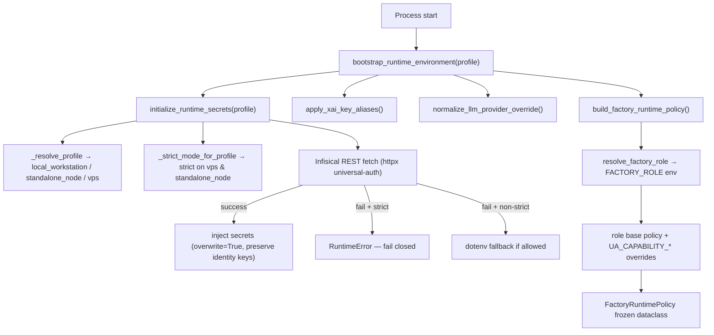

# Runtime Bootstrap & Profiles

## What this is

Every Universal Agent process — gateway, API server, bot/main, the delegation
bridge, ad-hoc scripts — starts by resolving **what kind of node it is** and
**what it is allowed to do**. That resolution is centralized in three modules:

- `runtime_bootstrap.py` — the single orchestrator (`bootstrap_runtime_environment`).
- `infisical_loader.py` — Infisical-first secret loading (`initialize_runtime_secrets`).
- `runtime_role.py` — identity/stage/profile resolution and the role→policy matrix.

The runtime mode is **not** decided by scattered feature flags alone. It is the
product of three orthogonal axes:

| Axis | Env var | Code | Values |
|---|---|---|---|
| Deployment profile | `UA_DEPLOYMENT_PROFILE` | `infisical_loader._resolve_profile` | `local_workstation`, `standalone_node`, `vps` |
| Runtime stage | `UA_RUNTIME_STAGE` | `runtime_role.resolve_runtime_stage` | `development`, `staging`, `local`, `production` |
| Factory role | `FACTORY_ROLE` | `runtime_role.resolve_factory_role` | `HEADQUARTERS`, `LOCAL_WORKER`, `STANDALONE_NODE` |

Profile decides the **secret-strictness posture**. Role decides the **runtime
capability policy** (gateway surface, delegation, UI, CSI, AgentMail). Stage is
mostly an Infisical/observability label derived from the Infisical environment.

## Bootstrap pipeline

`runtime_bootstrap.bootstrap_runtime_environment(*, profile=None)` runs four
steps and returns a frozen `RuntimeBootstrapResult(secrets, policy, llm_provider_override)`:

```python
def bootstrap_runtime_environment(*, profile=None):
    secrets = initialize_runtime_secrets(profile=profile)   # 1. load secrets
    apply_xai_key_aliases()                                  # 2. XAI key aliasing
    llm_provider_override = normalize_llm_provider_override()# 3. provider override
    policy = build_factory_runtime_policy()                  # 4. role → policy
    return RuntimeBootstrapResult(...)
```



Call sites (all bootstrap before reading downstream config):
`bot/main.py`, `agent_core.py`, `agent_setup.py`, `main.py`,
`gateway_server.py` (in lifespan, with `profile=_DEPLOYMENT_PROFILE`),
`api/server.py`, and the delegation `bridge_main.py` (which calls
`initialize_runtime_secrets` directly). The result is cached process-wide.

## 1. Deployment profile resolution

`infisical_loader._resolve_profile(profile)`:
- explicit `profile` argument wins, else `UA_DEPLOYMENT_PROFILE`, else
  `local_workstation`.
- value lower-cased; anything not in
  `{local_workstation, standalone_node, vps}` falls back to `local_workstation`.

The gateway reads the profile **eagerly at module import** into
`_DEPLOYMENT_PROFILE`, because the VPS bootstrap `.env`
(`UA_DEPLOYMENT_PROFILE=vps`) is not otherwise loaded until the lifespan runs —
see the explicit early `load_dotenv(override=False)` block in
`gateway_server.py`. Module-level code that reads `os.getenv` would otherwise
miss it.

Profile controls:
- **Infisical strict mode** (`_strict_mode_for_profile`): `vps` and
  `standalone_node` default strict; `local_workstation` default non-strict.
  Override with `UA_INFISICAL_STRICT`.
- **Dotenv fallback default** (`UA_INFISICAL_ALLOW_DOTENV_FALLBACK`): defaults
  **on** only for `local_workstation`.
- **Runtime-stage default** (`_resolve_runtime_stage_for_bootstrap`): if no
  explicit `UA_RUNTIME_STAGE` and the Infisical environment isn't a valid
  stage, `vps` → `production`, everything else → `development`.

## 2. Infisical-first secret bootstrap

`infisical_loader.initialize_runtime_secrets(profile=None, *, force_reload=False, exclude_prefixes=())`:

1. Resolve profile, strict mode, normalized Infisical environment, runtime
   stage, and machine slug; write `INFISICAL_ENVIRONMENT`, `UA_RUNTIME_STAGE`,
   `UA_MACHINE_SLUG` back into `os.environ`.
2. If `UA_INFISICAL_ENABLED` (default true): fetch secrets via
   `_fetch_infisical_secrets` and inject with `overwrite=True`.
3. On fetch failure: in **strict mode**, store a failure result and
   **raise `RuntimeError`** (fail closed); otherwise optionally load the local
   `.env` dotenv fallback.
4. Cache and return a frozen `SecretBootstrapResult`.

The result is process-cached behind `_BOOTSTRAP_LOCK`; subsequent calls return
the cached result unless `force_reload=True`.

### Infisical is authoritative — with an identity carve-out

Secrets are injected with `overwrite=True`, so vault values **win over**
pre-existing `os.environ` entries (systemd `Environment=`, bootstrap `.env`,
module-import side effects). This is deliberate: before this change, any key
already present was silently skipped, which made Infisical-managed feature flags
(e.g. operator-flippable disables like `UA_ATLAS_DIRECT_DISPATCH_ENABLED`)
unreachable from the vault on the VPS.

The carve-out is `_BOOTSTRAP_IDENTITY_KEYS` (passed as `preserve_keys`): when one
of these is already set in the environment it is **never** moved by remote
config. These are the true identity keys — `INFISICAL_*` connection settings,
`UA_RUNTIME_STAGE`, `UA_MACHINE_SLUG`, `UA_DEPLOYMENT_PROFILE`, `FACTORY_ROLE`,
and the `UA_INFISICAL_*` / `UA_DOTENV_PATH` bootstrap switches. The machine's
role/stage/slug can therefore never be flipped by a vault value.

### Fetch mechanism (REST via httpx)

`_fetch_infisical_secrets` authenticates with **universal-auth**
(`POST /api/v1/auth/universal-auth/login`) and reads secrets from
`/api/v3/secrets/raw` using `httpx` directly. There is a sibling
`_fetch_infisical_secrets_via_rest` helper using the same endpoints. Required:
`INFISICAL_CLIENT_ID`, `INFISICAL_CLIENT_SECRET`, `INFISICAL_PROJECT_ID`
(missing any → `RuntimeError`). Tunable: `INFISICAL_ENVIRONMENT`,
`INFISICAL_SECRET_PATH` (default `/`), `INFISICAL_API_URL`
(default `https://app.infisical.com`).

> The current implementation is REST/httpx only. (Earlier docs described an
> "Infisical SDK path with REST fallback" — that does not match current code.)

### Environment normalization & aliases

`_normalize_infisical_environment` lower-cases and maps legacy aliases via
`_LEGACY_INFISICAL_ENV_ALIASES`: `dev→development`, `prod→production`,
`staging-hq→staging`, `kevins-desktop-hq-dev→development`. Empty → `development`.

`_inject_environment_values` also aliases `ZAI_API_KEY` → `Z_AI_API_KEY` for the
zai_vision tool.

### `SecretBootstrapResult`

Frozen dataclass: `ok`, `source` (`infisical` / `dotenv` / `environment` /
`none`), `strict_mode`, `loaded_count`, `fallback_used`, `environment`,
`runtime_stage`, `machine_slug`, `deployment_profile`, `errors`. Errors are
sanitized to exception **type names only** (`_safe_error`) so secret values
never leak into logs.

### `exclude_prefixes` — the interactive-`claude` carve-out

The interactive `claude` launcher passes `exclude_prefixes=("ANTHROPIC_",)` so
`ANTHROPIC_*` keys (e.g. `ANTHROPIC_API_KEY`) are not injected onto `os.environ`,
which would otherwise override the Anthropic Max OAuth path. UA Python services
that genuinely need those keys call without `exclude_prefixes`.

### Bootstrap success is not a permanence guarantee

Bootstrap sets process state at init time. It does **not** stop later code from
mutating `os.environ`. Subsystems that read secrets directly from the live
environment after startup (e.g. `youtube_ingest.py` reading `PROXY_USERNAME` /
`PROXY_PASSWORD`) can observe missing values if intervening code clobbered the
parent env. The contract: child-process env sanitization is fine, but the
parent's runtime secrets must be restored immediately after a child spawn, and
long-running service code must not treat `os.environ` as scratch. When a fresh
process bootstraps fine but a live service acts as if secrets are missing,
suspect a post-bootstrap mutation, not a bootstrap bug.

## 3. Machine identity

`resolve_machine_slug(raw_slug=None)` resolves, in order: explicit arg →
`UA_MACHINE_SLUG` → `UA_FACTORY_ID` → `INFISICAL_MACHINE_IDENTITY_NAME` →
`socket.gethostname()`. The gateway's `_derive_factory_id` layers role suffixes
on top of the hostname when no explicit id is set (`<host>-hq` for HQ, bare
`<host>` for LOCAL_WORKER, `<host>-node` for standalone), with a
`factory-<uuid8>` last resort.

## 4. Factory role → runtime policy

`resolve_factory_role(raw_role=None)`: reads `FACTORY_ROLE`, defaults to
`HEADQUARTERS`, and **fails safe to `LOCAL_WORKER`** (logged `critical`) on an
unknown value. `build_factory_runtime_policy` then maps role → a frozen
`FactoryRuntimePolicy`.

### Policy matrix

| Field | HEADQUARTERS | LOCAL_WORKER | STANDALONE_NODE |
|---|---|---|---|
| `gateway_mode` | `full` | `health_only` | `full` |
| `start_ui` | `True` | `False` | `True` |
| `enable_telegram_poll` | `True` | `False` | `UA_STANDALONE_ENABLE_TELEGRAM_POLL` (default `False`) |
| `heartbeat_scope` | `global` | `local` | `local` |
| `delegation_mode` | `publish_and_listen` | `listen_only` | `disabled` |
| `enable_csi_ingest` | `True` | `False` | `True` |
| `enable_agentmail` | `True` | `False` | `True` |

Derived properties: `can_publish_delegations` (true only for
`publish_and_listen`), `can_listen_delegations` (true for `publish_and_listen`
or `listen_only`), `is_headquarters`.

### Capability overrides (`UA_CAPABILITY_*`)

After computing the role base policy, `build_factory_runtime_policy` applies
explicit per-field env overrides **only when the var is non-empty**:

| Policy field | Override env var | Type |
|---|---|---|
| `start_ui` | `UA_CAPABILITY_START_UI` | bool |
| `enable_telegram_poll` | `UA_CAPABILITY_TELEGRAM_POLL` | bool |
| `enable_csi_ingest` | `UA_CAPABILITY_CSI_INGEST` | bool |
| `enable_agentmail` | `UA_CAPABILITY_AGENTMAIL` | bool |
| `gateway_mode` | `UA_CAPABILITY_GATEWAY_MODE` | str |
| `heartbeat_scope` | `UA_CAPABILITY_HEARTBEAT_SCOPE` | str |
| `delegation_mode` | `UA_CAPABILITY_DELEGATION_MODE` | str |

Bool overrides go through `_env_flag` (`1/true/yes/on` vs `0/false/no/off`);
an empty var leaves the role default in place. String overrides are taken
verbatim with **no validation** — an invalid `UA_CAPABILITY_GATEWAY_MODE`
would be stored as-is. (This override layer is not in the legacy doc.)

## 5. Gateway enforcement of the policy

The gateway builds a module-level `_FACTORY_POLICY = build_factory_runtime_policy()`
and enforces it operationally, not just descriptively:

- **`health_only` HTTP surface** — `enforce_factory_role_http_surface`
  middleware: when `gateway_mode == "health_only"`, every request path not in
  `_LOCAL_WORKER_ALLOWED_PATHS` (`/api/v1/health`, `/api/v1/hooks/readyz`,
  `/api/v1/youtube/ingest`) returns **403**.
- **WebSocket** — disabled for `health_only`; the session WS closes with code
  `4403`.
- **Delegation routes** — gated on `can_publish_delegations` /
  `can_listen_delegations`; HQ-only fleet routes require
  `is_headquarters` / `FactoryRole.HEADQUARTERS`.
- The policy snapshot (role, gateway_mode, delegation_mode, heartbeat_scope, the
  capability booleans) is surfaced in health/heartbeat payloads, and the
  delegation `heartbeat.py` re-derives it with `build_factory_runtime_policy(factory_role)`
  to advertise node capabilities.

## 6. LLM provider override

`normalize_llm_provider_override` reads `LLM_PROVIDER_OVERRIDE`, upper-cases it,
and accepts only `{ZAI, ANTHROPIC, OPENAI, OLLAMA}`. An unsupported value is
logged (`warning`), **popped from `os.environ`**, and `None` is returned — a
controlled normalization step, not a free-form setting.

## Canonical environment controls

Identity / mode:
`UA_DEPLOYMENT_PROFILE`, `FACTORY_ROLE`, `UA_RUNTIME_STAGE`, `UA_MACHINE_SLUG`,
`UA_FACTORY_ID`, `INFISICAL_MACHINE_IDENTITY_NAME`,
`UA_STANDALONE_ENABLE_TELEGRAM_POLL`, `LLM_PROVIDER_OVERRIDE`.

Capability overrides:
`UA_CAPABILITY_START_UI`, `UA_CAPABILITY_TELEGRAM_POLL`,
`UA_CAPABILITY_CSI_INGEST`, `UA_CAPABILITY_AGENTMAIL`,
`UA_CAPABILITY_GATEWAY_MODE`, `UA_CAPABILITY_HEARTBEAT_SCOPE`,
`UA_CAPABILITY_DELEGATION_MODE`.

Infisical bootstrap:
`UA_INFISICAL_ENABLED`, `UA_INFISICAL_STRICT`,
`UA_INFISICAL_ALLOW_DOTENV_FALLBACK`, `UA_DOTENV_PATH`,
`INFISICAL_CLIENT_ID`, `INFISICAL_CLIENT_SECRET`, `INFISICAL_PROJECT_ID`,
`INFISICAL_ENVIRONMENT`, `INFISICAL_SECRET_PATH`, `INFISICAL_API_URL`.

## Gotchas (code-verified)

- **`/proc/<pid>/environ` shows exec-time env only**, not runtime `os.environ`
  mutations — unreliable for verifying Infisical injection in long-running
  processes. Verify in-process or via endpoint behavior.
- **Production deploy wipes the bootstrap `.env`** from scratch on every deploy
  (deterministic key set). VPS-side `.env` edits do not survive; durable values
  must live in code defaults or the deploy bootstrap dict.
- **Infisical `development` often mirrors `production`** for parity, so truthy
  `UA_*_ENABLED` flags can leak into dev; loops gate on explicit
  `UA_DEV_<NAME>_FORCE_ON=1` opt-in instead.
- **Strict-mode failure is sharp but correct**: `vps` / `standalone_node`
  fail closed (RuntimeError) when Infisical is unreachable unless
  `UA_INFISICAL_STRICT` is explicitly relaxed.

## Fail-safe summary

- invalid deployment profile → `local_workstation`
- invalid factory role → `LOCAL_WORKER` (logged critical)
- invalid `LLM_PROVIDER_OVERRIDE` → ignored and removed from env
- strict-profile Infisical failure → `RuntimeError` (fail closed)
