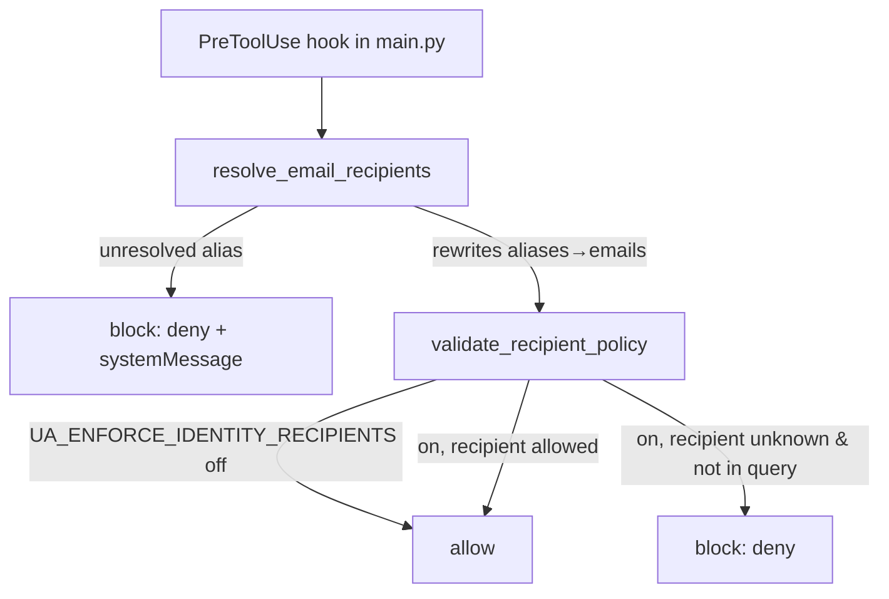
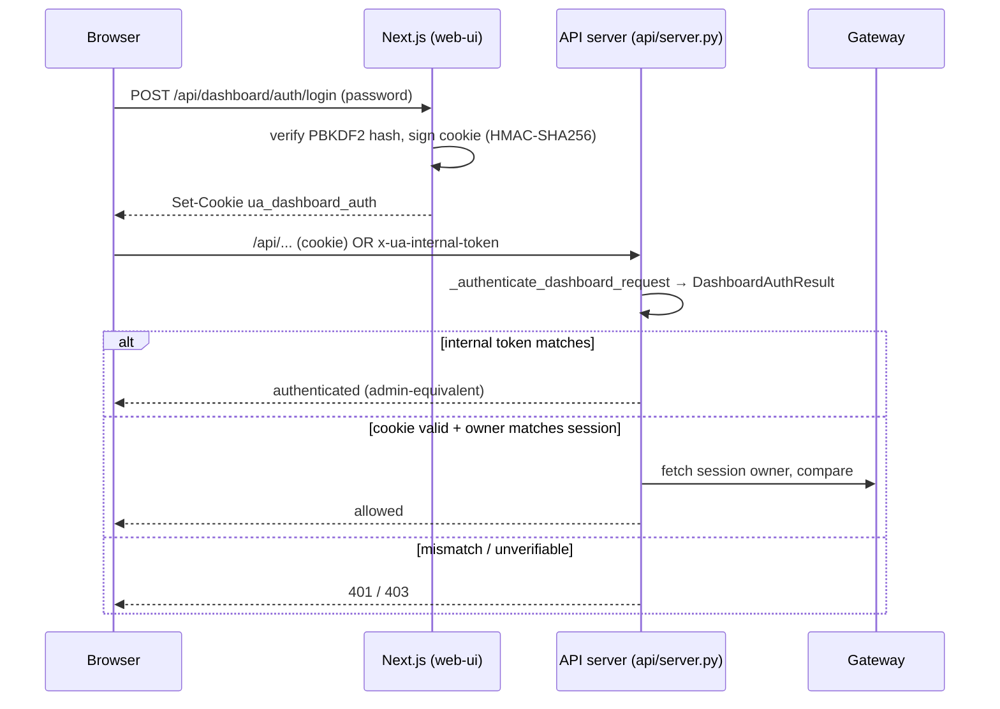

# Identity & Auth

This subsystem covers two distinct concerns that are easy to conflate:

1. **Identity** — *who is the user, and which email addresses are theirs.* A small
   in-process registry (`identity/`) that resolves a session `user_id`, resolves
   email aliases like "me" / "my gmail" to real addresses, and (optionally)
   enforces a recipient allow-policy on outbound email tool calls.
2. **Auth** — *is this caller allowed to hit this surface.* Three independent
   trust surfaces guard the HTTP/WS attack surface: **ops auth** (JWT or legacy
   bearer token) on `/api/v1/ops/*`, **dashboard auth** (HMAC-signed cookie) on
   the web UI's `/api/*`, and **CSI ingest auth** (shared-secret + HMAC request
   signature) on `/api/v1/signals/ingest`.

These do **not** share a common abstraction. Each is its own validator with its
own env vars. That is intentional today but is a known architectural seam — the
dashboard proxy injects ops tokens on behalf of authenticated users, so the two
surfaces are coupled operationally even though their code is separate.

---

## 1. Identity registry & resolver (`identity/`)

### `resolve_user_id` (`identity/resolver.py`)

The cheapest, most-called primitive. Resolves the effective session user id in
strict priority order:

```
requested_id  →  COMPOSIO_USER_ID  →  DEFAULT_USER_ID  →  "user_universal"
```

Called from `gateway.py`, `execution_engine.py`, `agent_setup.py`,
`api/agent_bridge.py`, `api/process_turn_bridge.py`, `urw/integration.py`,
and `gateway_server.py`. Anywhere a session needs an
owner id but none was supplied, this is the fallback chain.

> `resolve_user_id` is purely an *identity* helper — it is **not** an
> authorization check. The final fallback `"user_universal"` is always returned;
> it never raises. Do not treat a resolved `user_id` as proof of authorization.

### `load_identity_registry` (`identity/registry.py`)

Builds an immutable `IdentityRegistry` (frozen dataclass) describing the
operator's own email identity. `@lru_cache`d — call `clear_identity_registry_cache()`
after mutating the relevant env vars/file (e.g. in tests).

Inputs, merged from two sources (env wins for scalars; file and env both
contribute to lists/aliases):

| Field | Env var | File key (`identity_registry.json`) |
|---|---|---|
| primary email | `UA_PRIMARY_EMAIL` | `primary_email` |
| secondary emails (CSV) | `UA_SECONDARY_EMAILS` | `secondary_emails` (list) |
| explicit aliases (`alias:email,…`) | `UA_EMAIL_ALIASES` | `aliases` (dict) |

File path resolution: `UA_IDENTITY_REGISTRY_PATH` if set, else `./identity_registry.json`
in the CWD if it exists, else no file. Missing/invalid JSON is swallowed
(`FileNotFoundError` / `JSONDecodeError` → `{}`).

Every candidate email is validated against a simple regex (`_EMAIL_RE`); invalid
addresses are silently dropped, and an invalid `primary_email` becomes `None`.

**Auto-derived aliases** (`_build_aliases`): the default alias keys `me`,
`my email`, `myself` all map to `primary_email`. Secondary emails ending in
`@gmail.com` register `my gmail` / `gmail`; `@outlook.com` or `@hotmail.com`
register `my outlook` / `outlook`. Explicit aliases are layered on top. Alias
keys are normalized (lower-cased, whitespace-collapsed) before lookup.

### Email recipient resolution & policy enforcement

Two functions act on tool inputs, both invoked from the **PreToolUse hook** in
`main.py` (`resolve_email_recipients` then `validate_recipient_policy`):

- **`resolve_email_recipients(tool_name, tool_input)`** — rewrites alias values
  (`me`, `my gmail`, …) into real addresses in the `recipient_email` / `to` /
  `cc` / `bcc` fields. Recognizes both a direct send-email tool
  (`_is_email_tool` → name contains `SEND_EMAIL`) and the Composio
  multi-execute wrapper (`…COMPOSIO_MULTI_EXECUTE_TOOL`), recursing into each
  nested tool's `arguments`. Returns `(updates|None, errors, replacements)`.
  - If a value *is* a registered alias key but has no resolved target (e.g.
    `my outlook` with no outlook secondary configured), it is returned as an
    **error** — `main.py` then **blocks** the tool call with a `permissionDecision: deny`
    and a systemMessage telling the operator to set `UA_PRIMARY_EMAIL`.
- **`validate_recipient_policy(tool_name, tool_input, user_query)`** — a
  *recipient allow-list* gate. **Disabled by default**; only enforced when
  `UA_ENFORCE_IDENTITY_RECIPIENTS` ∈ {`1`,`true`,`yes`}. When on, every concrete
  recipient address must either be one of the registry's known emails
  (`all_emails()` = primary + secondaries) **or** appear verbatim in the user's
  query text. Anything else is returned as invalid and blocked by `main.py`.



---

## 2. Ops auth — `/api/v1/ops/*` (`auth/ops_auth.py`)

Guards the operational API surface (durable runs, Task Hub, channels, calendar,
factory, etc. — ~150 `_require_ops_auth(request)` call sites in `gateway_server.py`,
plus a blanket middleware `enforce_ops_auth_http_surface` that gates every path
under `/api/v1/ops/`).

### Token model — JWT preferred, legacy bearer tolerated

`validate_ops_token(token, *, jwt_secret, legacy_token, allow_legacy)` returns an
`OpsAuthValidationResult(ok, mode, subject, claims, error)`:

- **JWT path** (token has exactly two `.`): decoded with HS256, `audience="ua-ops"`,
  `issuer="universal-agent"`. Distinguishes `jwt_expired` vs `jwt_invalid` vs
  `jwt_secret_not_configured`.
- **Legacy path**: constant-time (`hmac.compare_digest`) comparison against
  `legacy_token`. Only attempted when `allow_legacy` is true and a legacy token
  is configured.

`issue_ops_jwt(jwt_secret, subject, ttl_seconds=3600)` mints the HS256 token
(claims: `iss`, `aud`, `sub`, `iat`, `exp`).

### Configuration (read at import, refreshable)

| Var | Meaning | Default |
|---|---|---|
| `UA_OPS_TOKEN` | legacy shared bearer token; also seeds `SESSION_API_TOKEN` if `UA_INTERNAL_API_TOKEN` unset | `""` |
| `UA_INTERNAL_API_TOKEN` | internal service token (`SESSION_API_TOKEN`) | falls back to `UA_OPS_TOKEN` |
| `UA_OPS_JWT_SECRET` | HS256 signing secret for JWTs | `""` |
| `UA_OPS_AUTH_ALLOW_LEGACY` | accept the legacy token path (`allow_legacy_ops_auth()`) | **`True`** |

`_refresh_ops_auth_config_from_env()` re-reads all four globals so a config flip
(e.g. via the config-reload endpoint) takes effect without a restart.

### Gateway enforcement behavior (`gateway_server.py::_require_ops_auth`)

```python
if not OPS_TOKEN and not OPS_JWT_SECRET:
    return  # <-- open access when NEITHER credential is configured
```

> **Gotcha / security note:** if *both* `UA_OPS_TOKEN` and `UA_OPS_JWT_SECRET`
> are empty, `_require_ops_auth` returns immediately — the ops surface is **open**.
> This is the documented "optional hard gate" design (the gate only exists once a
> credential is configured), but it means a misconfigured prod with no ops creds
> exposes `/api/v1/ops/*` unauthenticated. Always configure at least one in
> hardened deployments.

Token extraction order: `Authorization: Bearer <t>` → `x-ua-ops-token` header →
explicit `token_override` arg. On the first accepted *legacy* token, a one-shot
deprecation warning is logged (`_OPS_LEGACY_DEPRECATION_EMITTED`) nudging callers
toward JWTs from `/auth/ops-token`.

### Token issuance — `POST /auth/ops-token`

- Only available when the node is **headquarters** (`_FACTORY_POLICY.is_headquarters`);
  otherwise 403.
- Bootstrap-gated by `_require_ops_token_issuance_auth`: caller must present
  `SESSION_API_TOKEN` (`UA_INTERNAL_API_TOKEN`) or `UA_OPS_TOKEN`. If neither is
  configured → 503 (can't bootstrap-issue without a bootstrap credential).
- Requires `UA_OPS_JWT_SECRET` (else 503). Mints a 3600s JWT for the requested
  `subject` (default `"ops"`).

---

## 3. Dashboard auth — web UI `/api/*` (HMAC-signed cookie)

The dashboard session cookie (`ua_dashboard_auth`) is **minted in the Next.js
layer** (`web-ui/lib/dashboardAuth.ts`, `web-ui/app/api/dashboard/auth/login/route.ts`),
**not** in Python. The Python API server (`api/server.py`) only *mirror-validates*
the same cookie so it can enforce identical auth state on REST/file/artifact/WS
endpoints. There is no Python route that issues or sets this cookie.

### Cookie format

`<payload_b64url>.<hmac_sha256_sig>` where the payload JSON carries `owner_id`,
`exp` (and `roles`, set by the Next.js minter). The signature is
`base64url(HMAC-SHA256(secret, payload_b64))`, `=` padding stripped. Validation
(`_decode_dashboard_session_token`): split on `.`, constant-time compare the
signature, decode the payload, reject if `exp <= now`, then normalize `owner_id`.

### When is auth required (`_dashboard_auth_required`)

1. `UA_DASHBOARD_AUTH_ENABLED` explicit truthy/falsy wins outright.
2. else required if owners are configured (`_owners_configured()` — non-empty
   `UA_DASHBOARD_OWNERS_JSON` / `UA_DASHBOARD_OWNERS_FILE` / default
   `config/dashboard_owners.json`, each owner needing `owner_id` + `password_hash`).
3. else required if `UA_DASHBOARD_PASSWORD` is set.

If auth is **not** required, every request is treated as authenticated under the
default owner lane (`UA_DASHBOARD_OWNER_ID` or `owner_primary`).

### Session-signing secret (`_dashboard_session_secret`)

Resolution order — **identical** on the Python (`api/server.py`) and Next.js
(`dashboardAuth.ts`) sides:

```
UA_DASHBOARD_SESSION_SECRET  →  UA_OPS_TOKEN  →  UA_DASHBOARD_PASSWORD
```

> **Resolved security gap (was a P0):** legacy docs warned of a hardcoded dev
> fallback `ua-dashboard-dev-secret` appended to this chain. **That fallback has
> been removed.** Today, if no secret resolves, the Python side returns `""`,
> logs `dashboard_session_secret_missing`, and **fails closed** (every cookie is
> rejected → 401). The Next.js minter throws
> `"Dashboard session signing secret is not configured."`. No silent insecure
> default remains. *(Verified 2026-05-29 in both files.)*

### Password hashing

Owner passwords use **PBKDF2-SHA256** (`pbkdf2_sha256$<iterations>$<salt_b64>$<hash_b64>`,
iterations ≥ 100_000), verified in Next.js with `crypto.timingSafeEqual`. The
single shared `UA_DASHBOARD_PASSWORD` is the fallback when no owner records exist.

### Internal trusted-caller bypass

Both `_authenticate_dashboard_request` (HTTP) and `_authenticate_dashboard_ws`
(WebSocket) honor an internal-token bypass: if the request presents
`Authorization: Bearer`, `x-ua-internal-token`, or `x-ua-ops-token` matching the
`_internal_service_token()` (`UA_INTERNAL_API_TOKEN` → `UA_OPS_TOKEN`), it is
treated as authenticated **regardless of cookie state**, logged as
`dashboard_internal_token_auth`. This is **admin-equivalent access** — the
dashboard→gateway proxy uses it to forward authenticated user requests upstream.

### Enforcement & owner-lane filtering

`require_dashboard_auth` middleware runs on every `/api/*` path (except
`/api/health`), stashes the result on `request.state.dashboard_auth`, and returns
401 `Dashboard login required.` when auth is required but absent.

`_enforce_session_owner` is the *real* per-resource boundary: it compares the
authenticated owner against the session's owner (fetched from the gateway) and
403s on mismatch. Notable allow-bypasses (each with an in-code rationale comment):
- **system-owned sessions** are visible from the dashboard owner lane. The
  membership test is `_is_system_session_owner(owner_id)`, which (a) checks the
  `_SYSTEM_SESSION_OWNERS` set literal — `webhook`, `user_ui`, `user_cli`,
  `ops_tutorial_review`, `cron_system`, `ops:system-configuration-agent`,
  `daemon` — and (b) separately matches the prefixes `cron:`, `worker_`, `vp.`.
  The prefix logic lives in `_is_system_session_owner`, **not** in the set
  literal itself.
- **daemon sessions** (`daemon_*` / `run_daemon_*`): ownership is meaningless
  because the shared daemon runtime's stored owner is just "last dispatcher", so
  the primary dashboard owner is allowed through. (The `daemon` owner entry was
  added specifically to unbreak the Task Hub *Workspace* button.)
- **hook/cron sessions** (`session_hook_`, `run_session_hook_`, `cron_`) are
  inspectable by the primary dashboard owner.



---

## 4. CSI ingest auth — `POST /api/v1/signals/ingest` (`signals_ingest.py`)

The third, separate trust surface. `_verify_auth` enforces a layered check:

1. Feature flag: `UA_SIGNALS_INGEST_ENABLED` (default **off**) → else 503
   `signals_ingest_disabled`.
2. Shared secret `UA_SIGNALS_INGEST_SHARED_SECRET` must be set → else 503
   `signals_ingest_secret_missing`.
3. `Authorization: Bearer <shared_secret>` constant-time compare → else 401.
4. Replay/signature headers required: `x-csi-request-id`, `x-csi-timestamp`,
   `x-csi-signature`.
5. Timestamp within tolerance (`UA_SIGNALS_INGEST_TIMESTAMP_TOLERANCE_SECONDS`,
   default 300s, floor 30s) → else 401.
6. HMAC-SHA256 over `f"{timestamp}.{request_id}.{canonical_json(payload)}"` with
   the shared secret, constant-time compared against the hex signature → else 401.

After auth, the payload is validated (`CSIIngestRequest`), optionally filtered by
`UA_SIGNALS_INGEST_ALLOWED_INSTANCES`, and per-event de-duplicated by `event_id`.

This is a true signed-webhook surface (bearer + timestamped HMAC + replay
window), distinct from both ops JWT auth and the dashboard cookie.

---

## The three trust surfaces at a glance

| Surface | Code | Mechanism | Primary env vars | Default posture |
|---|---|---|---|---|
| Ops API (`/api/v1/ops/*`) | `auth/ops_auth.py` + `gateway_server.py` | JWT (HS256) or legacy bearer | `UA_OPS_JWT_SECRET`, `UA_OPS_TOKEN`, `UA_OPS_AUTH_ALLOW_LEGACY` | **open if neither credential set** |
| Dashboard (`/api/*`) | `api/server.py` + `web-ui/lib/dashboardAuth.ts` | HMAC-signed cookie + PBKDF2 password; internal-token bypass | `UA_DASHBOARD_SESSION_SECRET`, `UA_DASHBOARD_PASSWORD`, `UA_DASHBOARD_OWNERS_*`, `UA_DASHBOARD_AUTH_ENABLED`, `UA_INTERNAL_API_TOKEN` | fails closed (401) when required + no secret |
| CSI ingest (`/api/v1/signals/ingest`) | `signals_ingest.py` | shared-secret bearer + timestamped HMAC signature | `UA_SIGNALS_INGEST_ENABLED`, `UA_SIGNALS_INGEST_SHARED_SECRET`, `UA_SIGNALS_INGEST_TIMESTAMP_TOLERANCE_SECONDS` | **disabled (503) by default** |

**No shared abstraction.** `UA_OPS_TOKEN` does triple duty (legacy ops bearer,
internal-service token fallback, and dashboard-session-secret fallback), which is
the main reason these surfaces are operationally entangled despite living in
three separate modules. Treat any holder of `UA_OPS_TOKEN` as effectively admin
across ops + dashboard.
