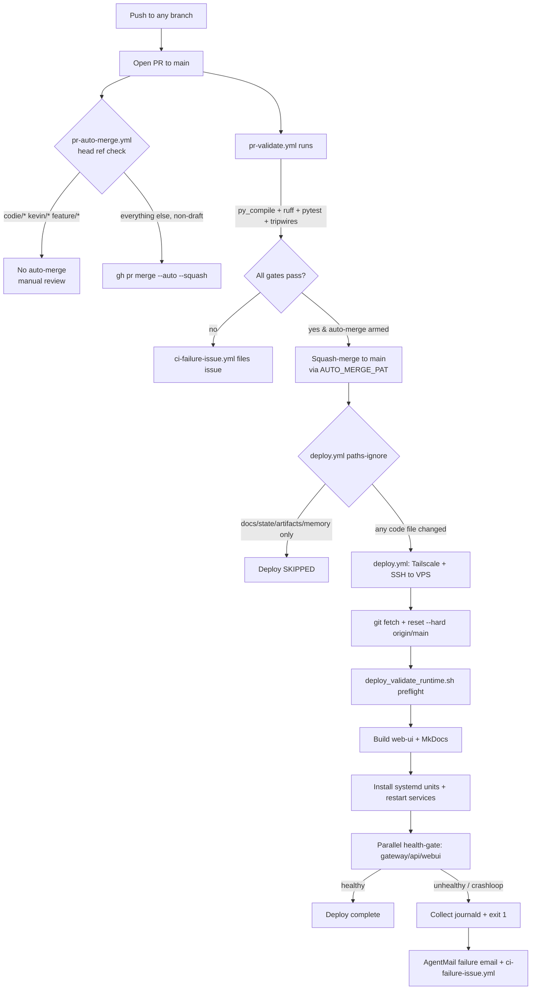

# Deployment & CI/CD

This subsystem governs how code moves from a branch to running production. Everything is GitHub-Actions-driven and SSH-into-the-VPS based — there is no container registry, no blue/green, no Kubernetes. The model is: **any branch → PR → CI gate → squash-merge to `main` → `main` push triggers a single deploy workflow that SSHes into the VPS, fast-forwards the checkout, rebuilds, and restarts systemd services.**

There are seven workflow files in `.github/workflows/`. Five are the CI/CD core; two are scheduled content jobs that share the deploy plumbing's conventions (paths-ignore, auto-merge).

| Workflow | Trigger | Purpose |
|---|---|---|
| `pr-validate.yml` | `pull_request` (base `main` or `feature/latest2`) | The only pre-deploy gate. py_compile + ruff + unit tests + tripwires. |
| `pr-auto-merge.yml` | `pull_request_target` (base `main`) | Enables GitHub auto-merge (squash) on all non-draft PRs except `codie/*`, `kevin/*`, `feature/*`. |
| `pr-rebase-watchdog.yml` | push to `main`, every 15 min, manual | Heals PRs that went `DIRTY` against `main` (auto-rebase for bot branches, comment for human branches). |
| `deploy.yml` | push to `main` (with `paths-ignore`), manual | The production deploy. SSH → fetch → reset → rebuild → restart → health-gate. |
| `ci-failure-issue.yml` | `workflow_run completed` on the named workflows | Files a `ci-failure` GitHub issue on any failed run; auto-closes it when the same workflow+branch goes green. |
| `nightly-doc-drift-audit.yml` | cron 18:35 UTC, manual | Audits doc drift, commits report to `main` via auto-merged PR, dispatches VP missions on the VPS. |
| `openclaw-release-sync.yml` | cron Tue/Fri 20:35 UTC, manual | Scans OpenClaw releases, commits report, dispatches a VP sync mission. |

> Branch-model history baked into the code comments: `develop` was retired 2026-05-10; `feature/latest2` is retired in practice but **still listed** as a `pull_request` base in `pr-validate.yml` (transitional convenience — see Gotchas). The home base is `main`. A `post-merge-deploy.yml` bridge workflow existed briefly to work around the GITHUB_TOKEN suppression bug and was deleted 2026-05-11 once the `AUTO_MERGE_PAT` swap made the natural `push` trigger fire deploys (it was producing double-deploys).

### Production targets

| Area | Value |
|---|---|
| Git branch | `main` |
| VPS checkout | `/opt/universal_agent` (fallback `/opt/universal_agent_repo` if the primary path is occupied by a non-git legacy dir) |
| Service user | `ua` |
| Gateway / API ports | `8002` / `8001` |
| Web UI port | `3000` |
| Web UI URL | `https://app.clearspringcg.com` (public), `https://uaonvps` (tailnet) |
| API URL | `https://api.clearspringcg.com` (public), `https://uaonvps:8443` (tailnet) |

### Required GitHub secrets

`TAILSCALE_OAUTH_CLIENT_ID`, `TAILSCALE_OAUTH_SECRET`, `VPS_SSH_HOST`, `VPS_SSH_USER`, `VPS_SSH_KEY`, `INFISICAL_CLIENT_ID`, `INFISICAL_CLIENT_SECRET`, `INFISICAL_PROJECT_ID`, `AGENTMAIL_API_KEY` (deploy-failure email, best-effort), `AUTO_MERGE_PAT` (fine-grained PAT scoped to `Contents: R+W` + `Pull requests: R+W`).

### Tailscale ACL requirement

CI authenticates as `tag:ci-gha` and SSHes to the VPS (`tag:vps`). The tailnet SSH policy must contain an `action: accept` rule from `tag:ci-gha` to `tag:vps` for users `root`/`ua`, with TCP/22 allowed in the network grants. Without `action: accept`, gws/Tailscale falls into an interactive "additional check" prompt and the SSH preflight fails fast with a targeted error.

## End-to-end flow



## The deploy job (`deploy.yml`)

### Trigger and `paths-ignore`

Deploy fires on `push` to `main` and on `workflow_dispatch`. It has a `paths-ignore` list so docs-only / state-only commits don't restart production:

```yaml
paths-ignore:
  - 'docs/**'
  - '**.md'
  - 'reports/**'
  - 'state/**'
  - 'artifacts/**'
  - 'memory/**'
```

GitHub semantics matter here: **deploy is skipped only when *every* changed file in the push matches a `paths-ignore` glob.** A mixed code+docs commit still deploys. This is intentional and is the safe default — the two scheduled jobs (doc-drift, openclaw-sync) commit only into `artifacts/`/`docs/` so their auto-merged PRs land on `main` without restarting the gateway.

### Concurrency guard

```yaml
concurrency:
  group: deploy-production
  cancel-in-progress: false
```

`cancel-in-progress: false` **queues** concurrent deploys instead of cancelling them. When several PRs squash-merge within seconds, their `push` events would otherwise fire `deploy.yml` simultaneously and collide on `/opt/universal_agent/.git/index.lock` (`fatal: Unable to create ... index.lock: File exists`). Serializing means last-write-wins on production, every deploy runs to completion. (Audit note: legacy docs described this as "not yet implemented" — it shipped 2026-05-11 and is live in code.)

### Connection: Tailscale, then SSH

The job connects to Tailscale (`tailscale/github-action@v4`, tag `tag:ci-gha`), then SSHes to the VPS using `VPS_SSH_HOST` / `VPS_SSH_USER` / `VPS_SSH_KEY` secrets. There's a 60s **SSH preflight** that checks for an interactive Tailscale "additional check" prompt and emits a targeted `::error::` if the CI identity tag lacks `action=accept` to the target tag.

The real deploy runs inside a `timeout 30m ssh ... << 'EOF'` heredoc. Keepalive is tuned: `ServerAliveInterval=30 ServerAliveCountMax=120` (up to 60 min idle tolerance) so long silent remote steps (systemd `daemon-reload` + `enable --now` on a busy VPS) don't drop the TCP connection and exit 255 on a deploy that actually succeeded.

### The remote deploy sequence (inside the heredoc)

The remote user is `ua`. `PROD_DIR=/opt/universal_agent`. Steps, in order:

1. **Bootstrap clone** if `$PROD_DIR/.git` is missing (with fallbacks to `/opt/universal_agent_repo` if the dir exists but isn't a git checkout).
2. **Stale-lock guard:** if `$PROD_DIR/.git/index.lock` exists and no git process is running, remove it; if a git process *is* running, wait 10s then remove anyway.
3. **Fast-forward:** `git fetch origin main` → `git reset --hard origin/main` → `git update-ref refs/heads/main $(git rev-parse origin/main)`. The `update-ref` is required because `reset --hard` moves HEAD + working tree but leaves the local `main` branch pointer stale; without it, an operator running `git checkout main` during incident recovery lands on old code.
4. **`sudo chown -R ua:ua $PROD_DIR`** (tolerates `|| true` for transient SQLite WAL/SHM ENOENT).
5. **Write a clean bootstrap `.env`** via inline Python. This is a *fixed* dict — Infisical creds plus runtime identity (`UA_RUNTIME_STAGE=production`, `FACTORY_ROLE=HEADQUARTERS`, `UA_DEPLOYMENT_PROFILE=vps`, `UA_MACHINE_SLUG=vps-hq-production`, ports 8001/8002/3000). **The VPS `.env` is overwritten on every deploy** — VPS-side manual edits do not survive. Durable values must live in code defaults or this bootstrap dict.
6. **Runtime preflight:** `bash scripts/deploy_validate_runtime.sh ...` (see below). This is the gate that can abort the deploy *before* any service restart.
7. **Render webui env** from Infisical (`render_service_env_from_infisical.py` → `web-ui/.env.local`).
8. **Install CLIs idempotently:** NotebookLM (`uv tool install`), goplaces (v0.3.0 tarball), hackernews-pp-cli (into `~/.local/bin/` so it survives `git clean`).
9. **Build web-ui** (`npm install` only if `package.json` changed — detected via the `node_modules/.package-json-mtime` sentinel file; then `rm -rf .next && npm run build`, `NODE_OPTIONS=--max-old-space-size=1536`). Force a full reinstall by deleting the sentinel on the VPS. The `.next` wipe is required because partial/corrupt manifests survive otherwise (cause of the "client reference manifest for route does not exist" webui crash).
10. **Build MkDocs** (`.venv/bin/mkdocs build`, non-fatal — warns on failure). Note: the deploy *builds* the static docs site but does NOT restart a docs service — the `universal-agent-docs` unit (serves the built site on `localhost:8100`, exposed to the tailnet via `tailscale serve`) is a one-time setup via `scripts/configure_docs_server.sh`, not part of the deploy restart cycle.
11. **Deployment-window flag:** `touch /tmp/ua-deployment-window` (suppresses CSI canary SLO alerts during restart), with an `EXIT` trap cleanup and a background `sleep 1500 && rm` safety net.
12. **Install canonical systemd units** from repo templates: `install_vps_systemd_units.sh --lane production`, `install_vp_worker_services.sh vp.coder.primary vp.general.primary`, and CSI's `csi_install_systemd_extras.sh` (timers + services).
13. **Capture discord baseline** (`is-active` of `ua-discord-cc-bot` / `ua-discord-intelligence`) *before* restart, so the health gate can distinguish a deploy-caused regression from a pre-existing crash loop.
14. **Sync project skills** to `/home/ua/.claude/skills/` via `rsync -a --delete` so VP worker subprocesses (running from `AGENT_RUN_WORKSPACES/`) can discover them.
15. **Restart services:** `systemctl restart universal-agent-gateway universal-agent-api universal-agent-webui universal-agent-telegram ua-discord-cc-bot ua-discord-intelligence`, plus VP workers (`universal-agent-vp-worker@vp.coder.primary` / `@vp.general.primary` if enabled).
16. **Interpreter sanity:** `ensure_current_venv_interpreter` compares each service's `ExecMainPID`'s `/proc/$pid/exe` against `$PROD_DIR/.venv/bin/python` and restarts again if a service is running an old interpreter.
17. **Health gate** (see below).
18. **Clear the deployment-window flag** and `trap - EXIT`.

### Runtime preflight: `scripts/deploy_validate_runtime.sh`

This script runs (as `ua`) *before any restart*. It's a hard abort point — a preflight failure ends the deploy without taking the running services down. Sequence in `ensure_runtime_is_ready`:

1. `ensure_existing_venv_is_usable` — removes a corrupted `.venv` (missing `bin/python3`), one inaccessible to `ua`, one that can't report its version, or one whose Python is not `3.13` (forces a clean rebuild on a version mismatch — added after the deploy #449 cp312→cp313 incident).
2. `ensure_python_runtime` — `uv python install 3.13`.
3. `sync_dependencies` — `uv sync --python 3.13 --no-install-package manim --no-install-package pycairo --no-install-package manimpango`.
4. `ensure_venv_python_executable` — fixes a missing execute bit on the rebuilt interpreter.
5. `run_validation_cycle` — four checks, all must pass:
   - `validate_runtime_bootstrap.py` against `$PROD_DIR/.env` with `--expect-*` identity assertions (environment=production, runtime-stage=production, factory-role=HEADQUARTERS, deployment-profile=vps, machine-slug=vps-hq-production) and `--require UA_OPS_TOKEN`.
   - `verify_observability_runtime.py` — real Logfire/OpenTelemetry imports.
   - `verify_service_imports.py` — service entrypoints import cleanly.
   - `preflight_migrations.py` — runs `ensure_schema` against **snapshot copies** of the production DBs. This catches the migration class of failure that crashlooped production on 2026-05-27 (`vp_missions.priority_tier` ALTER ordering) *before* a restart, instead of after an 8-minute gateway crashloop.
6. If the validation cycle fails, the script does ONE recovery attempt: nuke `.venv`, re-sync, re-validate. A second failure aborts.

### Health gate and crashloop abort

After restart, three HTTP health checks run **in parallel** (backgrounded, statuses collected from a tmpdir):

| Service | URL | Max attempts × interval | Budget |
|---|---|---|---|
| gateway | `http://127.0.0.1:8002/api/v1/health` | 96 × 5s | 8 min |
| api | `http://127.0.0.1:8001/api/health` | 24 × 5s | 2 min |
| webui | `http://127.0.0.1:3000/dashboard` | 24 × 5s | 2 min |

The gateway gets 8 minutes because its FastAPI lifespan startup runs ~700+ lines of synchronous subsystem init (factory registry, runtime DB schema migration, heartbeat/daemon session seeds, task lifecycle reconcile, email mapping reconcile, recovery sweep, cron registration, session reaper, workspace archiver, stale-VP-mission reconcile) before it begins serving. Accumulated production state pushed cold-start past the old 4-min window (Deploys #436/#437 both timed out at 4:00 even though the gateway came up healthy seconds later).

Each health-wait iteration calls `scripts/check_crashloop.sh <name> <unit> <attempt> 5`. That helper tracks the unit's `NRestarts` across calls in a `/tmp` cache; after attempt 3, if the unit restarted ≥5 times during the wait it emits `::error::` with the last 80 journald lines and exits 1 — **fail-fast instead of burning the full retry budget on a service that will never come up.** (This helper was lifted out of an inline deploy.yml block because the GHA workflow validator silently rejected the equivalent inline shell — see Gotchas.)

**Discord health is baseline-aware** (`check_discord_regression`): a discord service that was active pre-deploy but is down post-deploy fails the deploy (true regression); a service that was already down before the deploy emits `::warning::` only and does NOT block. This stops chronic discord flakiness from masking real PR-caused failures (PR #259, 2026-05-12).

On any failure, the job dumps `systemctl status` + 120 lines of journald for gateway/api/webui and `exit 1`s.

### Failure notification

A final `if: failure()` step posts a `[deploy-failed]` email to AgentMail (`oddcity216@agentmail.to` → `kevinjdragan@gmail.com`) with the commit, branch, run URL, and a journald hint. Best-effort: a missing `AGENTMAIL_API_KEY` or a send error never double-faults the deploy. Independently, `ci-failure-issue.yml` files a GitHub issue for the failed `Deploy` run.

### Systemd units and resource limits

Deploy renders + installs canonical units from repo templates (`deployment/systemd/templates/`) so a restart always targets the current checkout's `WorkingDirectory`/`ExecStart`/`EnvironmentFile` rather than a drifted host-only unit. The gateway template (`universal-agent-gateway.service.template`) pins cgroup limits: `MemoryMax=8G` (hard — systemd kills the cgroup if exceeded), `MemoryHigh=6G` (soft — triggers kernel reclaim), `TasksMax=500` (process-count cap). VP worker units (`universal-agent-vp-worker@.service`) are tighter: `MemoryMax=3G`, `MemoryHigh=2G`, `TasksMax=256`.

### Expected deploy times

| Scenario | Time |
|---|---|
| First deploy on a fresh VPS (cold npm build) | ~20–25 min |
| Normal deploy, no `package.json` change | ~10–15 min |
| Deploy after `package.json` change (fresh npm install) | ~15–20 min |

The job's `timeout-minutes: 35` accommodates the worst-case cold build.

### How code gets shipped: `/ship`

The operator/agent path is the `/ship` slash command (`.claude/commands/ship.md`): commit + push the current branch, open a PR to `main`, and self-enable auto-merge. It refuses to run from `main` (prevents direct-to-production commits that bypass the pr-validate gate). `gh pr create --base main` is the manual equivalent. Tier-1 `/ship` PRs self-enable auto-merge, so `pr-auto-merge.yml` is mainly for bot/Claude branches that didn't go through `/ship`.

## PR validation (`pr-validate.yml`)

The single pre-deploy gate. Runs on `pull_request` with base `feature/latest2` or `main`. Concurrency is one run per PR, `cancel-in-progress: true`.

A non-obvious-but-critical detail: every `run:` block uses `shell: bash -euo pipefail {0}`. GHA's default is `bash -e {0}` (no pipefail), under which a line like `pytest ... | tail -50` exits 0 because `tail`'s exit code wins. That bug masked 12 pre-existing pytest failures for hours on PR #153.

Gates, in order:

1. **Checkout** at `fetch-depth: 50` (sized for a triple-dot diff against base; the old `fetch-depth: 0` made the initial fetch huge and stall-prone — PR #259 timed out at 15 min on it).
2. **Python 3.13** + `uv sync --frozen`.
3. **Identify changed `.py` files** via `git diff --diff-filter=AMR origin/$BASE_REF...HEAD -- '*.py'`. Downstream steps skip when no Python changed.
4. **py_compile** every changed `.py` (catches the SyntaxError class — the 2026-05-07 import-storm failure).
5. **Block `.py.bak` / `.swp` / `.orig`** stray artifacts (autonomous patchers leave these).
6. **Architecture-canvas pointer verify** — only fires when `docs/architecture-view/` or `scripts/build_architecture_view.py` is touched.
7. **Ruff** on changed files only: `--select E9,F --ignore E402,F401,F541,F811,F841`. Scoped to new code; whole-repo ruff revealed ~8000 pre-existing rot findings that are a separate cleanup effort. `F821` (undefined name) stays selected as a real-bug signal.
8. **Guard against hardcoded date literals in `tests/`** (`check_test_date_literals.py`) — catches fixtures that age out of rolling windows.
9. **Run `tests/unit -x -q`** (the fast subset; full suite runs nightly elsewhere).

GitHub branch protection is what *enforces* these; this workflow only produces the passing/failing check.

> **`py_compile` is necessary but not sufficient.** It catches the SyntaxError class but **not** module-load-time `NameError`s — e.g. a registry/mapping dict at the top of a file that references wrapper functions defined later in the same file. That class of failure passes `py_compile` cleanly and only blows up at import. The mitigations layered on top: keep mapping/registry dicts at the file bottom (so referenced symbols already exist), rely on Gate 7's `F821` (undefined name) selection, and — for any change that touches an import-order-sensitive module — validate with a real import (`uv run python <file>`), not just `py_compile`. The deploy preflight's `verify_service_imports.py` is the production-side backstop for the same class (it import-loads service entrypoints before any restart).

## Auto-merge (`pr-auto-merge.yml`)

Triggers on `pull_request_target` (base `main`). Enables GitHub auto-merge (squash, delete-branch) on every non-draft PR **except** these head-ref prefixes:

```yaml
if: |
  !startsWith(github.event.pull_request.head.ref, 'codie/') &&
  !startsWith(github.event.pull_request.head.ref, 'kevin/') &&
  !startsWith(github.event.pull_request.head.ref, 'feature/') &&
  !github.event.pull_request.draft
```

So `claude/*`, `worktree-*` (the `EnterWorktree` helper's branch shape), `fix/*`, `docs/*`, `chore/*` all auto-merge once `pr-validate.yml` passes. `codie/*` (autonomous code-writer), `kevin/*` and `feature/*` (operator-authored) require manual review. **Safety is in CI, not in branch naming.**

The token is critical:

```yaml
GH_TOKEN: ${{ secrets.AUTO_MERGE_PAT || secrets.GITHUB_TOKEN }}
```

It uses `AUTO_MERGE_PAT`, **not** `GITHUB_TOKEN`. A squash-merge performed with `GITHUB_TOKEN` does not chain to downstream workflow runs (GitHub suppresses workflow events triggered by the default token), so `deploy.yml` would never fire. The PAT makes the merge push a "real" event that triggers deploy. The `|| secrets.GITHUB_TOKEN` fallback keeps the workflow functional if the PAT is absent — but in that degraded mode, deploy won't auto-fire.

## Rebase watchdog (`pr-rebase-watchdog.yml`)

Heals the "auto-merge enabled but branch went `DIRTY` against main" deadlock. GitHub does **not** run `pr-validate.yml` on a conflicting PR, so auto-merge has nothing to wait on and the PR sits silent. The `DIRTY` transition is caused by `main` moving forward, which emits no PR event — hence the triggers are **push to main**, a **15-min cron** backstop, and `workflow_dispatch` (not `pull_request synchronize`).

It GraphQL-queries open PRs (only GraphQL exposes `mergeStateStatus` + `autoMergeRequest` together), filters to non-draft + auto-merge-enabled + `DIRTY`, then:

- `claude/*`, `worktree-*` → **auto-rebase**: fresh shallow clone, `git rebase origin/main`, `git push --force-with-lease`. On conflict, abort and comment manual instructions.
- everything else (`kevin/*`, `feature/*`, `codie/*`, unknown) → **comment only** (conservative; a `rebase-needed-comment` label suppresses repeat comments per dirty cycle).

A second job clears the `rebase-needed-comment` label from PRs that are no longer `DIRTY`.

## CI failure issue filer (`ci-failure-issue.yml`)

Runs on `workflow_run completed` for: `Deploy`, `PR Validate`, `PR Auto-Merge`, `Auto-Promote to Production`, `Nightly Documentation Drift Audit`, `OpenClaw Release Sync`.

> [VERIFY: the `Auto-Promote to Production` workflow is named in the trigger list but there is **no** `auto-promote*.yml` file in `.github/workflows/`. This appears to be a stale leftover from the retired `develop`→`main` promotion era. Harmless (a non-existent workflow never fires the trigger), but it's dead config.]

- **`file-issue`** (on `conclusion == failure`): ensures a `ci-failure` label exists, dedups per `run_id`, and opens one issue per failed run titled `[ci-watchdog] <workflow> failed on <branch> (<sha>) — run_id=N`. Critically, it passes `--repo` explicitly to every `gh` call: without it, `gh` shells out to `git rev-parse` on a checkout-less runner and dies with `fatal: not a git repository` — a bug that silently filed **0** issues across 64 runs before being fixed 2026-05-11.
- **`close-issue`** (on `conclusion == success`): closes any open `ci-failure` issue whose title matches the same **workflow + branch** (branch-level, not SHA-level — the green re-run is usually a different SHA on the same branch).

Per `docs/operations/operating_hours_dormancy.md`, this watcher runs **24/7** — it's an infrastructure-event handler, not content generation, so it's exempt from the active-hours dormancy default. A PR that fails at 3 AM gets surfaced for the morning fix.

This is also the authoritative notification channel for headless agent sessions: after pushing a PR, poll `gh issue list --label ci-failure`.

## Scheduled content jobs

Two scheduled jobs piggyback on the deploy plumbing's conventions. Both are dormancy-aware (scheduled inside the active-hours window, with a 35-min minute-offset to dodge scheduling delay and the half-hourly hackernews ticks):

- **`nightly-doc-drift-audit.yml`** (18:35 UTC daily): runs `doc_drift_auditor.py`, asserts both report files exist, commits them to `main` via an auto-merged `chore/drift-report-<date>` PR (force-add because `artifacts/`/reports are gitignored; `deploy.yml` `paths-ignore` suppresses the prod deploy), then — only if drift was found — Tailscale+SSHes to the VPS and runs `doc_maintenance_agent` to dispatch VP missions.
- **`openclaw-release-sync.yml`** (Tue/Fri 20:35 UTC): runs `openclaw_release_scanner.py`, and only if new releases exist, commits the report via auto-merged `chore/openclaw-sync-<date>` PR and dispatches `openclaw_sync_agent` on the VPS.

Both use the `gh pr merge --admin` → `--squash` → manual fallback chain and clean up orphan branches from prior failed runs. Note these jobs use Python **3.12** in CI (`setup-uv` + `uv sync --python 3.12`), unlike `pr-validate.yml` and the deploy preflight which pin **3.13**.

## Verifying a deploy actually shipped

A commit on a branch is not deployed. A commit on `main` is not deployed until the `Deploy` workflow run is green AND live VPS state confirms it. The canonical SHA check is the public, no-auth endpoint:

```
GET http://<host>:8002/api/v1/version   →  gateway_server.py::version_info
```

It returns cached `_VERSION_INFO` (`_capture_version_info`). Browser/agent verifiers MUST hit this and confirm the target SHA before declaring any end-to-end verification valid (per `CLAUDE.md` § Production Verification Rules). The deploy's restart is the guarantee that the new SHA is live — but only after the health gate passes.

## Gotchas / non-obvious behaviors (code-verified)

- **`.env` is wiped on every deploy.** `deploy.yml` rewrites `/opt/universal_agent/.env` from a fixed bootstrap dict each run. Manual VPS-side edits to `.env` do not survive. Durable config must go in code defaults or the bootstrap dict in `deploy.yml`.
- **`paths-ignore` is all-or-nothing.** Deploy skips only when *every* changed file in the push matches an ignore glob. A single code file in a mostly-docs commit triggers a full deploy + restart.
- **Auto-merge needs `AUTO_MERGE_PAT`.** With only `GITHUB_TOKEN`, merges succeed but `deploy.yml` never auto-fires (default-token pushes don't chain workflow events).
- **`feature/latest2` is stale config in `pr-validate.yml`.** It's retired in practice but still listed as a `pull_request` base branch. New bot/Claude branches PR directly to `main`. Harmless but misleading.
- **`Auto-Promote to Production` in `ci-failure-issue.yml` is dead config** — no such workflow file exists. (See `[VERIFY]` above.)
- **The crashloop helper lives in a separate script on purpose.** `scripts/check_crashloop.sh` was extracted from inline deploy.yml shell because GHA's workflow validator silently rejected `deploy.yml` on certain inline-shell edits (the `2026-05-27 deployyml-parser-quirk`). Smoke-test deploy.yml edits by pushing to a feature branch.
- **Deploy concurrency queues; it does not cancel.** Multiple near-simultaneous merges to `main` run their deploys serially (last-write-wins on prod). This also means a failed/hung deploy holds the queue — subsequent merges wait behind it.
- **Health-gate timeouts are not necessarily failures.** The gateway's 8-min budget exists precisely because cold-start can legitimately take minutes; #436/#437 timed out at the old 4-min window despite coming up healthy. If you tighten the budget, expect false-negative deploy failures.
- **CI uses two Python versions.** `pr-validate.yml` + deploy preflight pin **3.13**; the two scheduled content jobs use **3.12**. (The cp313 migration dropped `infisical-python`; UA now talks to Infisical over httpx — see `infisical_loader.py`.)
- **`pipefail` is opt-in in GHA.** Both `pr-validate.yml` (`defaults.run.shell: bash -euo pipefail {0}`) and the remote deploy heredoc (`set -euo pipefail`) force it. New `run:` blocks that pipe to `tail`/`head` without pipefail will silently swallow failures.
- **`AUTO_MERGE_PAT` expires.** Default fine-grained PATs expire after 1 year. On expiry, `gh pr merge --auto` calls 401/403 and auto-merge silently stops. Fix: regenerate the token and overwrite the existing `AUTO_MERGE_PAT` secret value (no workflow change). (Operational fact, not code-verified — preserved from legacy ops doc.)
- **`.venv` corruption blocks `uv sync` even as the right user.** A stale symlink to an inaccessible/old-version interpreter makes `uv sync` fail with "not a valid Python environment." `deploy_validate_runtime.sh::ensure_existing_venv_is_usable` is the code that detects this (missing `bin/python3`, unreadable interpreter, non-3.13 version) and force-rebuilds. Manual break-glass is `rm -rf /opt/universal_agent/.venv` then re-deploy.
- **Lifecycle-miss during the deploy window is expected, not a failure.** Service restarts SIGTERM (exit 143) in-flight tasks. The `/tmp/ua-deployment-window` flag lets downstream guardrails reclassify these as dashboard-only warnings (no email/telegram) so deploy-restart noise doesn't page the operator. The failure record + assignment reopen are unchanged.
- **A deploy cannot heal an expired OAuth refresh token.** Runtime Google OAuth credentials — `gws` (Gmail/Calendar) and YouTube (`kevinjdragan@gmail.com`) — are materialized from Infisical at *service start*, so a deploy re-applies whatever token is currently stored. But while the OAuth apps remain in Google "Testing" mode, their refresh tokens expire ~7 days regardless of deploys; the symptom is `invalid_grant: Bad Request` (gws) / `401 Invalid authentication credentials` (YouTube). The durable fix is publishing the OAuth app "Testing" → "In production" (operator defers this by choice; the YouTube watchdog `youtube_oauth_watchdog.py` + one-tap email re-auth is the accepted interim — see `youtube_oauth_health.py`). Re-deploying does **not** refresh an already-dead token. Operational detail: > [VERIFY: the gws `GWS_*_B64` runtime materialization path was not located under `src/` in this pass; corroborated by the root `CLAUDE.md` gws runbook.] Full runbook lives in `ops-vps-recovery`.
- **Two CI helper scripts are the real abort points.** `deploy_validate_runtime.sh` (pre-restart preflight: venv health, deps, bootstrap identity, observability, service imports, migration preflight) and `check_crashloop.sh` (post-restart fail-fast). A deploy can be aborted *before* services are touched (preflight) or *during* the health-wait (crashloop), each with structured diagnostics.
