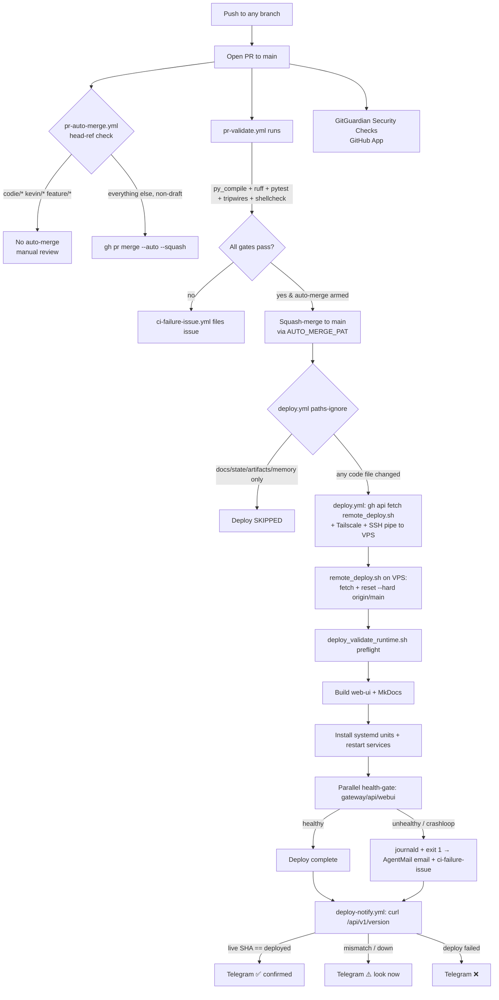

# Deployment & CI/CD

This subsystem governs how code moves from a branch to running production. Everything is GitHub-Actions-driven and SSH-into-the-VPS based — there is no container registry, no blue/green, no Kubernetes. The model is: **any branch → PR → CI gate → squash-merge to `main` → the `main` push triggers a deploy workflow that fetches the committed deploy script, pipes it over SSH into the VPS, fast-forwards the checkout, rebuilds, restarts systemd services, and confirms health → a separate notifier confirms the live SHA back to the operator.**

## Workflow inventory

`.github/workflows/` holds eight workflows. Six are the CI/CD core; two are documentation-governance gates owned by the doc-system (covered by the documentation-governance rules in `project_docs/CLAUDE.md` — listed here only for completeness).

| Workflow (`name:`) | File | Trigger | Purpose |
|---|---|---|---|
| **PR Validate** | `pr-validate.yml` | `pull_request` → `main` | The only pre-deploy code gate: py_compile + ruff + unit tests + tripwires + ShellCheck on deploy scripts. |
| **PR Auto-Merge** | `pr-auto-merge.yml` | `pull_request_target` → `main` | Enables GitHub auto-merge (squash) on all non-draft PRs except `codie/*`, `kevin/*`, `feature/*`. |
| **PR Rebase Watchdog** | `pr-rebase-watchdog.yml` | push to `main`, 15-min cron, manual | Heals PRs that went `DIRTY` against `main` (auto-rebase for bot branches, comment for human branches). |
| **Deploy** | `deploy.yml` | push to `main` (with `paths-ignore`), manual | The production deploy. Fetches `remote_deploy.sh` → SSH-pipes it to the VPS → fetch/reset/rebuild/restart/health-gate. |
| **Deploy Notify** | `deploy-notify.yml` | `workflow_run` on **Deploy** completed | Truthful deploy-complete signal to the operator's Telegram: confirms the **live** `/api/v1/version` SHA (Rule A) and reports ✅ / ⚠️ / ❌. |
| **CI Failure Issue Filer** | `ci-failure-issue.yml` | `workflow_run completed` on the watched workflows | Files a `ci-failure` GitHub issue on any failed run; auto-closes it when the same workflow+branch goes green. |
| Documentation Audit | `doc-audit.yml` | `pull_request` touching `project_docs/**` | Doc-governance PR gate (`doc_audit.py`). Doc-system owned. |
| Nightly Documentation Health | `doc-nightly.yml` | cron `35 18 * * *`, manual | Nightly doc-accuracy sweep (ZAI). Doc-system owned. |

Dependency bumps are automated by `.github/dependabot.yml` (`pip` + `github-actions`, weekly), which opens PRs against `main` that flow through the same gate.

### Branch policy — single source of truth

Two workflows make branch-prefix decisions (`pr-auto-merge.yml` auto-merge eligibility; `pr-rebase-watchdog.yml` rebase-vs-comment). They use different mechanisms (a GHA `if:` expression vs. a bash `case`) and encode *different* partitions, so they are intentionally not merged into one module — but this table is the **authoritative policy** both must match. If you change either workflow's branch handling, update this table in the same PR.

| Branch prefix | Auto-merge? (`pr-auto-merge`) | DIRTY-PR action (`pr-rebase-watchdog`) |
|---|---|---|
| `claude/*` | ✅ auto-merge | auto-rebase (force-push) |
| `worktree-*` (EnterWorktree) | ✅ auto-merge | auto-rebase (force-push) |
| `fix/*`, `docs/*`, `chore/*`, `dependabot/*` | ✅ auto-merge | comment only |
| `codie/*` | ❌ manual review | comment only |
| `kevin/*`, `feature/*` | ❌ manual review (operator) | comment only |
| **any** PR labeled `ci-autofix` | ✅ auto-merge (label override) | n/a |

All auto-merges still wait for `pr-validate` + GitGuardian to pass — **safety is in CI, not in the branch name.**

> **Branch-model history (baked into code comments):** `develop` was retired 2026-05-10 and `feature/latest2` 2026-05-13; both are gone, and `main` is the only PR target. A `post-merge-deploy.yml` bridge briefly existed to work around the GITHUB_TOKEN suppression bug and was deleted 2026-05-11 once the `AUTO_MERGE_PAT` swap made the natural `push` trigger fire deploys (it was producing double-deploys). The previous two scheduled content jobs (`nightly-doc-drift-audit.yml`, `openclaw-release-sync.yml`) were retired 2026-05-30 (#577).

### Production targets

| Area | Value |
|---|---|
| Git branch | `main` |
| VPS checkout | `/opt/universal_agent` (fallback `/opt/universal_agent_repo` if the primary path is occupied by a non-git legacy dir) |
| Service user | `ua` |
| Gateway / API ports | `8002` / `8001` |
| Web UI port | `3000` |
| Web UI URL | `https://app.clearspringcg.com` (public), `https://uaonvps` (tailnet) |
| API URL | `https://api.clearspringcg.com` (public), `https://uaonvps:8443` (tailnet) |

### Required GitHub secrets

`TAILSCALE_OAUTH_CLIENT_ID`, `TAILSCALE_OAUTH_SECRET`, `VPS_SSH_HOST`, `VPS_SSH_USER`, `VPS_SSH_KEY`, `INFISICAL_CLIENT_ID`, `INFISICAL_CLIENT_SECRET`, `INFISICAL_PROJECT_ID`, `AGENTMAIL_API_KEY` (deploy-failure email, best-effort), `AUTO_MERGE_PAT` (fine-grained PAT scoped to `Contents: R+W` + `Pull requests: R+W`), `UA_OPERATOR_TELEGRAM_BOT_TOKEN` + `UA_OPERATOR_TELEGRAM_CHAT_ID` (Deploy Notify → operator Telegram channel; mirror the Infisical values, set 2026-05-30).

### Tailscale ACL requirement

CI authenticates as `tag:ci-gha` and SSHes to the VPS (`tag:vps`). The tailnet SSH policy must contain an `action: accept` rule from `tag:ci-gha` to `tag:vps` for users `root`/`ua`, with TCP/22 allowed in the network grants. Without `action: accept`, Tailscale falls into an interactive "additional check" prompt and the SSH preflight fails fast with a targeted error.

## End-to-end flow



## The deploy job (`deploy.yml`)

### Trigger and `paths-ignore`

Deploy fires on `push` to `main` and on `workflow_dispatch`. It has a `paths-ignore` list so docs-only / state-only commits don't restart production:

```yaml
paths-ignore:
  - 'docs/**'
  - '**.md'
  - 'reports/**'
  - 'state/**'
  - 'artifacts/**'
  - 'memory/**'
```

GitHub semantics matter here: **deploy is skipped only when *every* changed file in the push matches a `paths-ignore` glob.** A mixed code+docs commit still deploys. (Note: `project_docs/**` is not in the list, but doc PRs are `**.md` so they're still covered.)

### Concurrency guard

```yaml
concurrency:
  group: deploy-production
  cancel-in-progress: false
```

`cancel-in-progress: false` **queues** concurrent deploys instead of cancelling them. When several PRs squash-merge within seconds, their `push` events would otherwise fire `deploy.yml` simultaneously and collide on `/opt/universal_agent/.git/index.lock` (`fatal: Unable to create ... index.lock: File exists`). Serializing means last-write-wins on production and every deploy runs to completion.

### How the deploy script reaches the VPS (decomposed 2026-05-30)

The remote deploy logic is a committed, ShellCheck-able script — `scripts/deploy/remote_deploy.sh` — **not** an inline heredoc. `deploy.yml` (≈160 lines) does, in its single SSH step:

1. **SSH preflight** — a 60s `ssh ... "echo SSH_OK"` that detects an interactive Tailscale "additional check" prompt and emits a targeted `::error::` if `tag:ci-gha` lacks `action=accept` to `tag:vps`.
2. **Fetch the script for this exact commit** via the GitHub API (no `actions/checkout`):
   ```bash
   gh api "repos/${GITHUB_REPOSITORY}/contents/scripts/deploy/remote_deploy.sh?ref=${GITHUB_SHA}" \
     -H "Accept: application/vnd.github.raw" > /tmp/remote_deploy.sh
   ```
3. **Pipe it over SSH stdin to `bash -s`**, prepending the three Infisical bootstrap secrets as `export` lines through the same stdin stream:
   ```bash
   {
     printf 'export INFISICAL_CLIENT_ID=%q\n'     "$INFISICAL_CLIENT_ID"
     printf 'export INFISICAL_CLIENT_SECRET=%q\n' "$INFISICAL_CLIENT_SECRET"
     printf 'export INFISICAL_PROJECT_ID=%q\n'    "$INFISICAL_PROJECT_ID"
     cat /tmp/remote_deploy.sh
   } | timeout 30m ssh -i ~/.ssh/deploy_key ... \
       -o ServerAliveInterval=30 -o ServerAliveCountMax=120 "$SSH_USER@$SSH_HOST" 'bash -s'
   ```

Why this shape:
- **Secrets via stdin, not argv** — the three `INFISICAL_*` values never appear in the VPS process table, and `remote_deploy.sh` stays free of `${{ secrets }}` placeholders (so it is lintable and runnable locally). The script fails fast (`${VAR:?}`) if any is missing.
- **`gh api` instead of `actions/checkout`** — checkout pins a deprecated Node-20 action *and* its post-job submodule cleanup chokes (a benign exit-128 warning) on the repo's orphaned `.claude/agents/agent-browser` / `test-remotion-project` gitlinks (committed with no `.gitmodules`). Fetching one file at `$GITHUB_SHA` sidesteps both and guarantees the script version matches the deployed commit.
- **`bash -s` over stdin removes the heredoc-delimiter / GHA-parser fragility class** entirely (the `2026-05-27 deployyml-parser-quirk` could no longer recur, since there is no large embedded shell block in the YAML).
- Keepalive (`ServerAliveInterval=30 ServerAliveCountMax=120`, up to 60 min idle tolerance) keeps the session alive through long silent remote steps so they don't drop the TCP connection and exit 255 on a deploy that actually succeeded.

### The remote deploy sequence (`scripts/deploy/remote_deploy.sh`)

Runs as `ua`, `PROD_DIR=/opt/universal_agent`. The body is byte-identical to the bash that previously lived in the heredoc. Steps, in order:

1. **Bootstrap clone** if `$PROD_DIR/.git` is missing (with fallbacks to `/opt/universal_agent_repo`).
2. **Stale-lock guard:** remove `$PROD_DIR/.git/index.lock` if no git process holds it (wait 10s then remove if one does).
3. **Fast-forward:** `git fetch origin main` → `git reset --hard origin/main` → `git update-ref refs/heads/main $(git rev-parse origin/main)`. The `update-ref` keeps the local `main` pointer in sync; without it an operator running `git checkout main` during recovery lands on stale code.
4. **`sudo chown -R ua:ua $PROD_DIR`** (`|| true` for transient SQLite WAL/SHM ENOENT).
5. **Write a clean bootstrap `.env`** via inline Python — a *fixed* dict (Infisical creds + runtime identity: `UA_RUNTIME_STAGE=production`, `FACTORY_ROLE=HEADQUARTERS`, `UA_DEPLOYMENT_PROFILE=vps`, `UA_MACHINE_SLUG=vps-hq-production`, ports 8001/8002/3000). **The VPS `.env` is overwritten on every deploy** — VPS-side manual edits do not survive.
6. **Runtime preflight:** `bash scripts/deploy_validate_runtime.sh ...` — a hard abort point *before* any restart (see below).
7. **Render webui env** from Infisical (`render_service_env_from_infisical.py` → `web-ui/.env.local`).
8. **Install CLIs idempotently:** NotebookLM (`uv tool install`), goplaces (v0.3.0 tarball), hackernews-pp-cli (into `~/.local/bin/` so it survives `git clean`).
9. **Build web-ui** (`npm install` only if `package.json` changed — `node_modules/.package-json-mtime` sentinel; then `rm -rf .next && npm run build`, `NODE_OPTIONS=--max-old-space-size=1536`). The `.next` wipe prevents the "client reference manifest for route does not exist" crash.
10. **Build MkDocs** (`.venv/bin/mkdocs build`, non-fatal). The deploy *builds* the static docs site but does not restart a docs service.
11. **Deployment-window flag:** `touch /tmp/ua-deployment-window` (suppresses CSI canary SLO alerts during restart), with an `EXIT` trap cleanup + a background `sleep 1500 && rm` safety net.
12. **Install canonical systemd units** from repo templates (`install_vps_systemd_units.sh --lane production`, `install_vp_worker_services.sh`, CSI's `csi_install_systemd_extras.sh`).
13. **Capture discord baseline** (`is-active` of `ua-discord-cc-bot` / `ua-discord-intelligence`) *before* restart, so the health gate can tell a deploy-caused regression from a pre-existing crash loop.
14. **Sync project skills** to `/home/ua/.claude/skills/` via `rsync -a --delete` so VP worker subprocesses (running from `AGENT_RUN_WORKSPACES/`) discover them.
15. **Restart services:** `systemctl restart universal-agent-gateway universal-agent-api universal-agent-webui universal-agent-telegram ua-discord-cc-bot ua-discord-intelligence`, plus VP workers if enabled.
16. **Interpreter sanity:** `remote_deploy.sh::ensure_current_venv_interpreter` compares each service's `ExecMainPID`'s `/proc/$pid/exe` against `$PROD_DIR/.venv/bin/python` and restarts again if a service is running an old interpreter.
17. **Health gate** (see below).
18. **Clear the deployment-window flag** and `trap - EXIT`.

### Runtime preflight: `scripts/deploy_validate_runtime.sh`

Runs (as `ua`) *before any restart* — a preflight failure ends the deploy without taking running services down. Sequence in `ensure_runtime_is_ready`:

1. `ensure_existing_venv_is_usable` — removes a corrupted `.venv` (missing `bin/python3`, inaccessible to `ua`, can't report version, or not Python `3.13` — the version-mismatch rebuild was added after the deploy #449 cp312→cp313 incident).
2. `ensure_python_runtime` — `uv python install 3.13`.
3. `sync_dependencies` — `uv sync --python 3.13 --no-install-package manim --no-install-package pycairo --no-install-package manimpango`.
4. `ensure_venv_python_executable` — fixes a missing execute bit on the rebuilt interpreter.
5. `run_validation_cycle` — four checks, all must pass: `validate_runtime_bootstrap.py` (with `--expect-*` identity assertions + `--require UA_OPS_TOKEN`), `verify_observability_runtime.py` (real Logfire/OTel imports), `verify_service_imports.py` (entrypoints import cleanly), `preflight_migrations.py` (runs `ensure_schema` against **snapshot copies** of the prod DBs — catches the migration class that crashlooped production 2026-05-27, *before* a restart).
6. On validation failure: ONE recovery attempt (nuke `.venv`, re-sync, re-validate); a second failure aborts.

### Health gate and crashloop abort

After restart, three HTTP health checks run **in parallel** (backgrounded, statuses collected from a tmpdir):

| Service | URL | Max attempts × interval | Budget |
|---|---|---|---|
| gateway | `http://127.0.0.1:8002/api/v1/health` | 96 × 5s | 8 min |
| api | `http://127.0.0.1:8001/api/health` | 24 × 5s | 2 min |
| webui | `http://127.0.0.1:3000/dashboard` | 24 × 5s | 2 min |

The gateway gets 8 minutes because its FastAPI lifespan startup runs ~700+ lines of synchronous subsystem init (factory registry, runtime DB schema migration, heartbeat/daemon session seeds, task lifecycle reconcile, email-mapping reconcile, recovery sweep, cron registration, session reaper, workspace archiver, stale-VP-mission reconcile) before it begins serving. Accumulated production state pushed cold-start past the old 4-min window (Deploys #436/#437 both timed out at 4:00 even though the gateway came up healthy seconds later). **This cold-start is the single largest deploy-latency source, and it is app-startup code, not a pipeline problem** — slimming the lifespan is tracked separately.

Each health-wait iteration calls `scripts/check_crashloop.sh <name> <unit> <attempt> 5`, which tracks the unit's `NRestarts` across calls in a `/tmp` cache; after attempt 3, if the unit restarted ≥5 times it emits `::error::` with 80 journald lines and exits 1 — **fail-fast instead of burning the full retry budget on a service that will never come up.**

**Discord health is baseline-aware** (`remote_deploy.sh::check_discord_regression`): a discord service active pre-deploy but down post-deploy fails the deploy (true regression); one already down before the deploy emits `::warning::` only. This stops chronic discord flakiness from masking real PR-caused failures (PR #259, 2026-05-12). On any failure, the job dumps `systemctl status` + 120 lines of journald for gateway/api/webui and `exit 1`s.

### Failure & success notification

Two complementary, independent signals:

- **Deploy failure email** — a final `if: failure()` step in `deploy.yml` posts a `[deploy-failed]` email to AgentMail (`oddcity216@agentmail.to` → `kevinjdragan@gmail.com`) with commit/branch/run-URL. Best-effort: a missing `AGENTMAIL_API_KEY` or send error never double-faults the deploy.
- **Deploy Notify (`deploy-notify.yml`)** — a separate `workflow_run`-triggered workflow that fires on **every** terminal state of Deploy (success and failure). It independently curls the public `https://app.clearspringcg.com/api/v1/version` and compares the **live** short SHA to the SHA Deploy ran on (Rule A), then sends one Telegram line: ✅ "live SHA confirmed", ⚠️ "success but live SHA `X` (expected `Y`) / endpoint down — look now", or ❌ "Deploy `<conclusion>`". Decoupled on purpose (fires even if the deploy job dies abruptly; a bug in it can't break a deploy); best-effort send (warns, never hard-fails). This closes the gap where `deploy.yml` emailed only on failure and was silent on success. (`deploy.yml` itself is in `paths-ignore` terms always a code deploy, so docs-only merges never trigger Deploy and therefore never ping.)
- Independently, **`ci-failure-issue.yml`** files a GitHub issue for any failed `Deploy` run.

### Systemd units and resource limits

Deploy renders + installs canonical units from repo templates (`deployment/systemd/templates/`) so a restart always targets the current checkout's `WorkingDirectory`/`ExecStart`/`EnvironmentFile`. The gateway template pins `MemoryMax=8G` (hard kill), `MemoryHigh=6G` (soft reclaim), `TasksMax=500`. VP worker units are tighter: `MemoryMax=3G`, `MemoryHigh=2G`, `TasksMax=256`.

### Expected deploy times

| Scenario | Time |
|---|---|
| First deploy on a fresh VPS (cold npm build) | ~20–25 min |
| Normal deploy, no `package.json` change | ~2–4 min (typical), up to ~8 min if the gateway cold-start is heavy |
| Deploy after `package.json` change (fresh npm install) | ~15–20 min |

The job's `timeout-minutes: 35` accommodates the worst-case cold build.

### How code gets shipped: `/ship`

The operator/agent path is the `/ship` slash command: commit + push the current branch, open a PR to `main`, and self-enable auto-merge. It refuses to run from `main`. `gh pr create --base main` is the manual equivalent. After opening a PR, autonomous sessions **watch, don't poll** — `gh pr checks <pr> --watch` (backgrounded) — and rely on the Deploy Notify Telegram ping as the deploy-side signal rather than polling `/api/v1/version`.

## PR validation (`pr-validate.yml`)

The single pre-deploy code gate. Runs on `pull_request` with base `main` (only — `feature/latest2` was removed 2026-05-30). Concurrency: one run per PR, `cancel-in-progress: true`.

Critical detail: every `run:` block uses `shell: bash -euo pipefail {0}`. GHA's default `bash -e {0}` lacks pipefail, under which `pytest ... | tail -50` exits 0 because `tail`'s exit code wins — that bug masked 12 pytest failures for hours on PR #153.

Gates, in order:

1. **uv install** (`astral-sh/setup-uv`) and Python 3.13, then `uv sync --frozen`. No package cache (see Gotchas — it was removed as net-negative).
2. **Checkout** at `fetch-depth: 50` (sized for a triple-dot diff; the old `fetch-depth: 0` made the initial fetch stall-prone).
3. **Identify changed `.py` files** (`git diff --diff-filter=AMR origin/$BASE_REF...HEAD -- '*.py'`); downstream steps skip when no Python changed.
4. **py_compile** every changed `.py` (the SyntaxError class — the 2026-05-07 import storm).
5. **Block `.py.bak` / `.swp` / `.orig`** stray artifacts.
6. **Architecture-canvas pointer verify** — only when `docs/architecture-view/` or `scripts/build_architecture_view.py` is touched.
7. **Ruff** on changed files only: `--select E9,F --ignore E402,F401,F541,F811,F841` (`F821` stays as a real-bug signal).
8. **Guard against hardcoded date literals in `tests/`** (`check_test_date_literals.py`).
9. **ShellCheck deploy scripts** — `shellcheck -S warning scripts/deploy/*.sh` (added 2026-05-30 once the deploy logic became a real script; `-S warning` blocks errors/warnings, allows style-level notes).
10. **Run `tests/unit -x -q`** (the fast subset; full suite runs elsewhere). This is the dominant runtime (~150s+).

GitHub branch protection is what *enforces* these. GitGuardian Security Checks (a GitHub App, not a workflow) runs alongside as a required secret-scan check on every PR.

> **`py_compile` is necessary but not sufficient.** It catches the SyntaxError class but **not** module-load-time `NameError`s (e.g. a registry dict referencing functions defined later in the same file). Mitigations: keep mapping/registry dicts at file bottom, rely on Gate 7's `F821`, validate import-order-sensitive changes with a real import (`uv run python <file>`). The deploy preflight's `verify_service_imports.py` is the production-side backstop.

## Auto-merge (`pr-auto-merge.yml`)

Triggers on `pull_request_target` (base `main`). Enables GitHub auto-merge (squash, delete-branch) on every non-draft PR **except** these head-ref prefixes:

```yaml
if: |
  !startsWith(github.event.pull_request.head.ref, 'codie/') &&
  !startsWith(github.event.pull_request.head.ref, 'kevin/') &&
  !startsWith(github.event.pull_request.head.ref, 'feature/') &&
  !github.event.pull_request.draft
```

So `claude/*`, `worktree-*` (the `EnterWorktree` helper's branch shape), `fix/*`, `docs/*`, `chore/*`, `dependabot/*` all auto-merge once `pr-validate.yml` passes. `codie/*`, `kevin/*`, `feature/*` require manual review. **Safety is in CI, not in branch naming.**

The token is critical — `GH_TOKEN: ${{ secrets.AUTO_MERGE_PAT || secrets.GITHUB_TOKEN }}`. A squash-merge performed with `GITHUB_TOKEN` does not chain to downstream workflow runs (GitHub suppresses workflow events from the default token), so `deploy.yml` would never fire. The PAT makes the merge push a "real" event that triggers deploy. The `|| GITHUB_TOKEN` fallback keeps the workflow functional if the PAT is absent — but deploy won't auto-fire in that degraded mode.

## Rebase watchdog (`pr-rebase-watchdog.yml`)

Heals the "auto-merge enabled but branch went `DIRTY` against main" deadlock. GitHub does **not** run `pr-validate.yml` on a conflicting PR, so auto-merge has nothing to wait on. The `DIRTY` transition is caused by `main` moving forward, which emits no PR event — hence the triggers are **push to main**, a **15-min cron**, and `workflow_dispatch`.

It GraphQL-queries open PRs (only GraphQL exposes `mergeStateStatus` + `autoMergeRequest` together), filters to non-draft + auto-merge-enabled + `DIRTY`, then:

- `claude/*`, `worktree-*` → **auto-rebase**: fresh shallow clone, `git rebase origin/main`, `git push --force-with-lease`. On conflict, abort and comment manual instructions.
- everything else → **comment only** (a `rebase-needed-comment` label suppresses repeat comments). A second job clears the label from PRs no longer `DIRTY`.

**Two tokens, one purpose each (fixed 2026-05-30):** `GH_TOKEN = GITHUB_TOKEN` is used for `gh pr comment`/`gh pr edit` (the workflow grants `pull-requests: write`); `PUSH_PAT = AUTO_MERGE_PAT` is used *only* in the git push URL so force-pushes fire downstream Validate. Previously the fine-grained PAT was used for everything, but it lacks the PR-comment scope, so every conflict-comment failed with `Resource not accessible by personal access token (addComment)` and hard-failed the whole heal run. Advisory comments are also best-effort (`|| true`) so a notification hiccup never fails the heal.

## CI failure issue filer (`ci-failure-issue.yml`)

Runs on `workflow_run completed` for: **Deploy**, **PR Validate**, **PR Auto-Merge**, **PR Rebase Watchdog**, **Documentation Audit**, **Nightly Documentation Health** (list corrected 2026-05-30 — added PR Rebase Watchdog, whose failures were previously unsurfaced; dropped the dead `Auto-Promote to Production` and retired doc-drift/openclaw entries).

- **`file-issue`** (on `conclusion == failure`): ensures a `ci-failure` label exists, dedups per `run_id`, opens one issue per failed run titled `[ci-watchdog] <workflow> failed on <branch> (<sha>) — run_id=N`. It passes `--repo` explicitly to every `gh` call: without it `gh` shells out to `git rev-parse` on a checkout-less runner and dies `fatal: not a git repository` — a bug that silently filed **0** issues across 64 runs before being fixed 2026-05-11.
- **`close-issue`** (on `conclusion == success`): closes any open `ci-failure` issue matching the same **workflow + branch** (branch-level, since the green re-run is usually a different SHA).

Runs **24/7** (infrastructure-event handler, exempt from active-hours dormancy). For headless agent sessions this is an authoritative failure channel: poll `gh issue list --label ci-failure`.

## Documentation-governance gates (doc-system owned)

Two workflows enforce the rebuilt documentation system (canonical docs in `project_docs/`); they are listed here for the complete CI picture but are owned by the doc-system:

- **Documentation Audit** (`doc-audit.yml`): `pull_request` touching `project_docs/**` / `scripts/doc_audit.py`. Runs `python scripts/doc_audit.py` (stdlib-only — **errors fail the PR**: frontmatter schema, `code_paths` globs resolve, `file::symbol` citations grep-resolve, no line-number citations, orphan/link check) plus a tripwire that fails any automated doc-fix PR touching non-doc paths.
- **Nightly Documentation Health** (`doc-nightly.yml`): cron `35 18 * * *`. Runs `doc_audit.py --warn-only`, `gen_doc_index.py --check`, and a ZAI-backed `doc_accuracy_sweep.py --open-issue` accuracy batch (the sweep step uses `uv` pinned to Python 3.12).

## Verifying a deploy actually shipped

A commit on a branch is not deployed. A commit on `main` is not deployed until the `Deploy` run is green AND live VPS state confirms it. The canonical SHA check is the public, no-auth endpoint:

```
GET https://app.clearspringcg.com/api/v1/version   →  gateway_server.py::version_info
```

It returns cached `_VERSION_INFO` (`gateway_server.py::_capture_version_info`) including `commit_sha` / `short_sha`. Browser/agent verifiers MUST hit this and confirm the target SHA before declaring any end-to-end verification valid (`CLAUDE.md` § Production Verification Rules). Deploy Notify performs exactly this check automatically and reports the result to Telegram.

## Gotchas / non-obvious behaviors (code-verified)

- **`.env` is wiped on every deploy.** `remote_deploy.sh` rewrites `/opt/universal_agent/.env` from a fixed bootstrap dict each run. Manual VPS-side edits do not survive. Durable config must go in code defaults or that dict.
- **`paths-ignore` is all-or-nothing.** Deploy skips only when *every* changed file matches an ignore glob. A single code file in a mostly-docs commit triggers a full deploy + restart.
- **Auto-merge needs `AUTO_MERGE_PAT`.** With only `GITHUB_TOKEN`, merges succeed but `deploy.yml` never auto-fires (default-token pushes don't chain workflow events). The PAT also expires (~1 year for fine-grained PATs); on expiry `gh pr merge --auto` 401/403s and auto-merge silently stops — regenerate and overwrite the secret value (no workflow change).
- **The deploy script is fetched, not checked out.** `deploy.yml` pulls `scripts/deploy/remote_deploy.sh` via `gh api` at `$GITHUB_SHA`. Adding `actions/checkout` back would reintroduce the Node-20 deprecation. (The orphaned-gitlink exit-128 trap — `.claude/agents/agent-browser` / `test-remotion-project` committed as `.gitmodules`-less submodule pointers — was cleaned up 2026-05-30 via `git rm --cached` + `.gitignore`, so checkout would no longer choke on it; but `gh api` is still leaner and pins the deployed SHA.)
- **No large shell blocks in workflow YAML.** The deploy logic lives in `remote_deploy.sh` (ShellCheck-gated) and the crashloop helper in `check_crashloop.sh`, specifically because GHA's workflow validator silently rejected `deploy.yml` on certain inline-shell edits (the `2026-05-27 deployyml-parser-quirk`). Keep new deploy logic in the script, not the YAML.
- **Deploy concurrency queues; it does not cancel.** Near-simultaneous merges deploy serially (last-write-wins). A failed/hung deploy holds the queue — subsequent merges wait behind it.
- **Health-gate timeouts are not necessarily failures.** The gateway's 8-min budget exists because cold-start can legitimately take minutes; #436/#437 timed out at the old 4-min window despite coming up healthy. Tightening it risks false-negative deploy failures.
- **`pipefail` is opt-in in GHA.** Both `pr-validate.yml` (`defaults.run.shell: bash -euo pipefail {0}`) and `remote_deploy.sh` (`set -euo pipefail`) force it.
- **No uv package cache in PR-Validate (removed 2026-05-30, verified net-negative).** A `setup-uv enable-cache` layer shipped briefly (PR #583) but never hit: `pr-validate` only runs on `pull_request`, so each PR wrote its own cache scoped to `refs/pull/N/merge` and `main` never populated a fresh-key cache to restore from — every PR cold-missed *and* paid the save/restore overhead. The cache's ceiling was modest regardless because `pytest` (~150s, roughly half the ~5-min run) dominates and a dep cache can't touch it. **The real PR-Validate speed lever is pytest sharding/parallelization** (a separate, higher-value effort). Don't re-add a uv cache without also warming it on `main` — and even then weigh it against just sharding pytest.
- **Comment a `# shellcheck`-prefixed line breaks the ShellCheck gate.** ShellCheck parses any comment starting with `# shellcheck` as a directive (SC1073/1072). Don't open a comment line with that string in `scripts/deploy/*.sh`.
- **`.venv` corruption blocks `uv sync` even as the right user.** A stale symlink to an inaccessible/old interpreter makes `uv sync` fail. `deploy_validate_runtime.sh::ensure_existing_venv_is_usable` detects this (missing `bin/python3`, unreadable, non-3.13) and force-rebuilds. Break-glass: `rm -rf /opt/universal_agent/.venv` then re-deploy.
- **Lifecycle-miss during the deploy window is expected.** Restarts SIGTERM (exit 143) in-flight tasks; the `/tmp/ua-deployment-window` flag lets guardrails reclassify these as dashboard-only (no email/telegram) so deploy-restart noise doesn't page the operator.
- **A deploy cannot heal an expired OAuth refresh token.** `gws` (Gmail/Calendar) and YouTube (`kevinjdragan@gmail.com`) creds are materialized from Infisical at *service start*, so a deploy re-applies whatever is stored — but while the OAuth apps are in Google "Testing" mode their refresh tokens expire ~7 days regardless. Symptom: `invalid_grant` (gws) / `401 Invalid authentication credentials` (YouTube). Durable fix: publish the OAuth app to production (operator defers; YouTube watchdog + one-tap re-auth is the interim). Full runbook: `ops-vps-recovery`.
- **Telegram bot-token log hygiene (separate from deploy).** The interactive Telegram bot (`bot/main.py`) logs its `TELEGRAM_BOT_TOKEN` in the httpx getUpdates/sendMessage URL every ~10s to journald. Rotating that token + silencing httpx INFO logging is a tracked follow-up (operator-gated via @BotFather). This does not affect the deploy notifier, which uses the separate `UA_OPERATOR_TELEGRAM_*` channel.

## Autonomous CI-failure auto-fix loop (Phase 2)

**Status (2026-05-30):** LIVE. Phase 1 (#602) gave event-driven issue filing + label-gated auto-merge. Phase 2 closes the loop: when a watched workflow fails, the system autonomously fixes it (via Cody) or escalates to the operator — **event-driven (no polling), with no sleeping GHA runners, decoupled from Simone's cognition, and coordinated** so it never collides with whoever already owns the failure.

```mermaid
flowchart TD
    A[CI workflow fails] -->|workflow_run completed, conclusion=failure| B[ci-failure-issue.yml file-issue job]
    B --> C[File ci-failure GitHub issue]
    B --> D[POST /api/v1/hooks/ci-failure\nx-ua-ops-token, public URL, non-fatal]
    D --> E{Dedicated gateway route\nbefore the hooks catch-all}
    E -->|dedup: 1 timer per pr|branch:workflow:sha| F[cron one-shot\nrun_at +15m, delete_after_run\nDURABLE — survives deploy restart]
    F -->|grace fires| G[ci_failure_grace_recheck.py\nre-verify via gh]
    G -->|issue closed / PR merged / newer push / run green / already claimed| H[Stand down\ncoordination win]
    G -->|orphaned + autofixable workflow + PR| I[Claim issue: label ci-autofix-dispatched\nqueue Cody fix mission]
    I --> J[Cody: STEP 0 re-verify-or-noop\nfix, push to PR branch\nself-label PR ci-autofix]
    J --> K[pr-auto-merge.yml lands PR once green]
    G -->|orphaned + Deploy/infra/secret/oauth/no-PR| L[Telegram escalate\nlabel needs-operator]
```

**Why a dedicated route, not the hooks engine.** `hooks_service.handle_request` only emits `agent`/`wake` actions — routing CI-failure through it would wake an agent and put CI triage back into Simone's cognition. The dedicated `@app.post("/api/v1/hooks/ci-failure")` route (defined *before* the `/api/v1/hooks/{subpath}` catch-all so it wins) keeps the loop deterministic and out of agent reasoning.

**Why a grace window.** The session that owns a failure almost always fix-forwards it within minutes. So we never act immediately: the gateway schedules a durable one-shot ~15-min timer and `ci_failure_grace_recheck.py` re-verifies before doing anything. **Re-verify happens at every stage** (TOCTOU guard): schedule-time dedup, grace-fire `decide_action`, and the Cody brief's STEP 0.

| Piece | Location |
|---|---|
| GHA POST step | `.github/workflows/ci-failure-issue.yml` → `file-issue` job, step "Notify UA CI-failure auto-fix hook" (public URL, `x-ua-ops-token`, **no `actions/checkout`, no Tailscale** → avoids the orphaned-gitlink `git exit 128` class; non-fatal) |
| Inbound route | `gateway_server.py` → `@app.post("/api/v1/hooks/ci-failure")` (`_require_ops_auth`; schedules the cron one-shot) |
| Durable grace timer | `cron_service.add_job(run_at=now+grace, delete_after_run=True, command="!script universal_agent.scripts.ci_failure_grace_recheck --payload-b64 …")` |
| Grace-fire logic | `scripts/ci_failure_grace_recheck.py` — pure `classify_failure` / `decide_action` + `gh`-injectable `gather_repo_state`; executors `dispatch_cody_fix` / `escalate_to_operator` |
| Cody enqueue | `services/proactive_task_builder.queue_proactive_task` (source_kind `proactive_codie`, `codebase_root` + `external_effect_policy`) |
| Telegram escalate | `services/telegram_send.telegram_send_sync` (`UA_OPERATOR_TELEGRAM_*`) |
| Tests | `tests/unit/test_ci_failure_grace_recheck.py` |

**Classification.** Cody-fixable = `PR Validate` / `Documentation Audit` / `Nightly Documentation Health` **with a PR present** (the remedy is a code edit on the PR branch). Everything else — `Deploy`, `PR Auto-Merge`, `PR Rebase Watchdog`, or any push-to-main with no PR — escalates to the operator (the remedy is infra/secret/merge-state, not a code edit).

**Config / secrets.** `UA_CI_AUTOFIX_ENABLED` (default on; kill switch), `UA_CI_AUTOFIX_GRACE_SECONDS` (default 900, min 60). `UA_OPS_TOKEN` must exist as a GitHub Actions repo secret (mirrors Infisical prod); the GHA step skips the POST if it's unset.

**Interim being retired.** Until this hook is verified live, `memory/HEARTBEAT.md` "CI/CD Health Check" keeps Simone polling `ci-failure` issues each beat. Once live-verified, that directive is removed so CI triage fully leaves Simone's cognition.
