# Execution Environments

Universal Agent runs Claude in several distinct **execution profiles**. The same
`claude` binary (and the same Claude Agent SDK) is wired to *different model
backends and different auth credentials* depending on who is invoking it and why.
Mistaking one profile for another is the single biggest source of confusion in
this system, so this doc maps each profile to the exact code that selects its
backend.

There are two axes to keep separate:

1. **Model backend / auth** — Anthropic Max (OAuth, real Opus/Sonnet) vs. the
   ZAI proxy (GLM models, cheap). This is decided by which `ANTHROPIC_*` env
   vars are present (or scrubbed) in the process that spawns `claude`.
2. **Execution transport** — interactive terminal, in-process Claude Agent SDK,
   or a spawned `claude --print` CLI subprocess.

## The three profiles at a glance

| Profile | Who | Backend / auth | Transport | Selected by |
|---|---|---|---|---|
| **Interactive coding** | Operator at a terminal (`claude`, Antigravity) | Anthropic Max via OAuth (`~/.claude/.credentials.json`) | Interactive TTY | `scripts/claude_with_mcp_env.sh` → `_claude_launcher.py` strips `ANTHROPIC_*` so OAuth wins |
| **Autonomous principals** | Simone heartbeats, Atlas, dispatch sweep, intel crons | ZAI proxy / GLM | In-process Claude Agent SDK | `initialize_runtime_secrets()` injects `ANTHROPIC_BASE_URL`/`ANTHROPIC_AUTH_TOKEN` from Infisical (no exclude) |
| **Cody per-task** | VP-dispatched coding/demo missions | **Anthropic Max by default** (since 2026-05-11 PM); ZAI on override | `claude --print` CLI subprocess (anthropic) or SDK (zai) | `services/cody_mode.resolve_cody_mode` → `vp_orchestration` forces `execution_mode="cli"` for anthropic |

The rest of this doc explains each.

```mermaid
flowchart TD
    subgraph Interactive["Interactive coding (operator)"]
      A1["claude / Antigravity"] --> A2["claude_with_mcp_env.sh"]
      A2 --> A3["_claude_launcher.py<br/>initialize_runtime_secrets(exclude=ANTHROPIC_*)"]
      A3 --> A4["execvp claude<br/>OAuth (Anthropic Max)"]
    end
    subgraph Autonomous["Autonomous principals"]
      B1["Simone / Atlas / crons"] --> B2["initialize_runtime_secrets()<br/>NO exclude"]
      B2 --> B3["ANTHROPIC_BASE_URL=ZAI on os.environ"]
      B3 --> B4["in-process Claude Agent SDK<br/>routed to ZAI/GLM"]
    end
    subgraph Cody["Cody per-task missions"]
      C1["vp_dispatch_mission"] --> C2["resolve_cody_mode()"]
      C2 -->|anthropic| C3["execution_mode=cli<br/>_build_cli_env scrubs ANTHROPIC_*"]
      C3 --> C4["claude --print --model claude-opus-4-8<br/>OAuth / CLAUDE_CODE_OAUTH_TOKEN"]
      C2 -->|zai| C5["execution_mode=autonomous<br/>SDK on ZAI"]
    end
```



---

## Profile 1 — Interactive coding (Anthropic Max via OAuth)

When the operator runs `claude` on the desktop (or in an Antigravity terminal),
the goal is to use the **Anthropic Max plan** (real Opus/Sonnet/Haiku through
OAuth) *and* have UA's MCP servers and Infisical-backed secrets available so the
`${VAR}` placeholders in `.mcp.json` resolve.

`claude` is aliased to `scripts/claude_with_mcp_env.sh`, which hands off to
`scripts/_claude_launcher.py`. The flow:

1. **`claude_with_mcp_env.sh`** resolves `UA_INSTALL_ROOT` (honor explicit env →
   `/opt/universal_agent` → the repo containing the script). It saves the
   operator's CWD in `UA_ORIGINAL_CWD`, `cd`s into `UA_INSTALL_ROOT` so `uv run`
   finds the right venv, then `exec uv run python _claude_launcher.py …`.
2. It **auto-injects `--dangerously-skip-permissions`** for interactive sessions,
   but *skips* that flag for management subcommands (`agents`, `auth`,
   `auto-mode`, `doctor`, `install`, `mcp`, `plugin(s)`, `project`,
   `setup-token`, `ultrareview`, `update`/`upgrade`) which reject it. See the
   `case "$_first_arg"` block.
3. **`_claude_launcher.py`** sources `$UA_INSTALL_ROOT/.env` (Infisical bootstrap
   creds only), then calls `initialize_runtime_secrets(exclude_prefixes=("ANTHROPIC_",))`.
   The exclude is the whole point: **any `ANTHROPIC_*` var on `os.environ`
   overrides OAuth.** `ANTHROPIC_API_KEY` makes Claude Code treat it as an
   external API key (→ "Invalid API key · Fix external API key" UI when it's for
   a different account); `ANTHROPIC_BASE_URL` routes to ZAI/GLM. Both are wrong
   interactively.
4. Defense-in-depth: after the Infisical load, `_strip_interactive_routing_vars`
   removes any `ANTHROPIC_*` that leaked from a non-Infisical source (bootstrap
   `.env`, parent shell). It also strips `GH_TOKEN`/`GITHUB_TOKEN`
   (`_strip_named_interactive_vars`) because a stale Infisical `GH_TOKEN`
   shadowed the file-stored OAuth (`~/.config/gh/hosts.yml`) and broke every
   interactive `gh` call (and therefore `/ship`'s deploy watching).
5. It `os.chdir(UA_ORIGINAL_CWD)` so Claude Code opens in the directory the
   operator was actually in (not UA's repo), runs an optional
   `claude_session_baseline` git baseline check, then `os.execvp("claude", …)`
   with all the bootstrapped secrets inherited.

Net result: MCP secrets present, `ANTHROPIC_*` absent → Claude Code resolves to
OAuth (`~/.claude/.credentials.json`) = Anthropic Max.

### Explicit ZAI opt-in: the `zai` shell function

The operator can deliberately route an interactive session to cheap GLM
inference with the `zai` function (in `~/.bashrc`):

```bash
zai() {
  # source repo .env for universal-auth creds, mint an Infisical token,
  # then: INFISICAL_TOKEN=$tok infisical run --env=development -- claude "$@"
}
```

`zai` runs `claude` *inside* `infisical run` with the `development` env, so the
ZAI routing vars are injected for that one process only. Plain `claude` stays on
Max; `zai` is the explicit cheap path.

> Why not `infisical run` for the *default* path? The CLI needs an interactive
> `infisical login` session or independent machine-identity parsing; from a fresh
> VPS shell it triggers a non-tty login prompt and fails. The Python SDK path
> (`initialize_runtime_secrets`) is the canonical headless auth and is what the
> launcher uses. The `zai` function works because the operator's repo `.env`
> carries the universal-auth creds it shells out with.

### MCP credential lazy-load (desktop)

Plain `claude` on the desktop lazy-loads only `HOSTINGER_API_TOKEN` via
`_ua_load_mcp_secrets` in `~/.bashrc`, cached at `~/.cache/ua/hostinger_token`
(mode 0600). Delete that file to force a refresh. (Historical note: an earlier
eager `infisical secrets get` on every shell hung Antigravity PTYs on an
arrow-key prompt; the lazy machine-identity loader fixed both speed and headless
correctness.)

---

## Profile 2 — Autonomous principals (ZAI / GLM)

Simone heartbeats, Atlas, the dispatch sweep, and the intel crons run
**in-process** inside the UA daemon using the Claude Agent SDK. They are *not*
launched through `_claude_launcher.py`. They get their model backend from
`initialize_runtime_secrets()` called at service startup **without** the
`exclude_prefixes` filter, so the `ANTHROPIC_BASE_URL` / `ANTHROPIC_AUTH_TOKEN` /
`ANTHROPIC_DEFAULT_*_MODEL` vars staged in Infisical land on `os.environ` and
route the SDK to the ZAI/GLM proxy. This is by design — these loops run
continuously and use cheap inference; there is no per-task model switch.

UA also keeps `ANTHROPIC_API_KEY` in Infisical for *direct-SDK* code paths
(refinement agent, the gateway vision endpoint, etc.) that call Anthropic
directly rather than through the agent loop.

The same `initialize_runtime_secrets` powers `infisical_loader._load_local_dotenv`
and the Infisical injection path; `exclude_prefixes` is honored at the
injection step (`infisical_loader.py::initialize_runtime_secrets`,
`_inject` filter), which is what the interactive launcher relies on.

> The ZAI routing keys staged in Infisical (`development`/`production`) are:
> `ANTHROPIC_BASE_URL`, `ANTHROPIC_AUTH_TOKEN`, `ANTHROPIC_DEFAULT_HAIKU_MODEL`,
> `ANTHROPIC_DEFAULT_SONNET_MODEL`, `ANTHROPIC_DEFAULT_OPUS_MODEL` (added
> 2026-05-07). They are loaded onto `os.environ` at runtime and **never written to
> `.env` on disk**.

> **Verification gotcha:** `/proc/<pid>/environ` shows *exec-time* env, not the
> runtime `os.environ`. UA Python services receive ZAI vars via
> `initialize_runtime_secrets()` injecting into `os.environ` *at runtime*, so
> `/proc/<gateway-pid>/environ` for `ANTHROPIC_BASE_URL` is always empty — that
> does **not** mean ZAI routing failed. For the `claude` CLI subprocess (a node
> binary that doesn't mutate its own env at runtime) `/proc/environ` *is*
> reliable. The bulletproof routing check is a two-terminal `ss` socket sniffer
> (does the connection go to `api.anthropic.com` or `api.z.ai`?) — `claude config
> list` self-reports can lie when env vars override settings.

---

## Profile 3 — Cody per-task missions

Cody is Simone's downstream task executor (not a `.claude/agents/` sub-agent — it
runs as VP-dispatched missions via Task Hub). Every Cody task carries a
`cody_mode` that picks between `"anthropic"` (Anthropic Max) and `"zai"`
(GLM proxy).

### Mode resolution — `services/cody_mode.resolve_cody_mode`

Priority order (highest first):

1. **`task.cody_mode`** — per-task override on `task_hub_items`.
2. **DB setting `cody_default_mode`** — operator-configurable from the dashboard
   tile, persisted in `task_hub_settings` (read via `_resolve_db_setting`).
3. **`UA_CODY_DEFAULT_MODE`** env var — deploy-time override, usually unset.
4. **`_HARDCODED_FALLBACK_MODE = "anthropic"`** — the final default.

> **Correction to legacy docs / stale comments.** The hardcoded fallback was
> flipped from `"zai"` to `"anthropic"` on **2026-05-11 PM** by operator
> decision (`cody_mode.py::_HARDCODED_FALLBACK_MODE`). Cody now defaults to real
> Anthropic Max for **every** task unless explicitly overridden — not just for
> `/opt/ua_demos/` workspaces. Note that two function signatures in
> `claude_cli_client.py` (`_execute_cli_session(cody_mode="zai")` and
> `_build_cli_env(cody_mode="zai")`) and a module docstring in that file still
> carry a default/comment of `"zai"`. Those are *parameter defaults / stale
> comments* on the CLI client, **not** the dispatch default — by the time a
> mission reaches the CLI client, `vp_orchestration` has already resolved and
> plumbed the real mode into the payload. The authoritative default lives in
> `cody_mode.py`. `[VERIFY: consider aligning the cody_mode_default param/comment
> in claude_cli_client.py with "anthropic" to remove the cross-file confusion.]`

`resolve_from_payload` is the downstream variant used by the VP worker / CLI
client when the task row is no longer in scope — it reads `payload.cody_mode`
or `payload.metadata.cody_mode`, falls through to env / hardcoded default, and
**does not** consult the DB setting (the dispatch decision is already baked in).

`get_default_mode_state` / `set_default_mode` back the dashboard tile (current
mode + who/when changed + source: `db_setting` / `env_var` / `hardcoded_default`).
`set_default_mode` raises `ValueError` on an invalid mode so the settings
endpoint can return 400.

### Mode → execution transport — `tools/vp_orchestration.vp_dispatch_mission`

`cody_mode` is the **source of truth for "use Anthropic"**, and it forces the
transport:

```python
if resolved_cody_mode == "anthropic":
    resolved_execution_mode = "cli"           # Anthropic endpoint + workspace OAuth
    # explicit execution_mode != "cli" is IGNORED (logged warning)
elif explicit_exec_mode:
    resolved_execution_mode = explicit_exec_mode
else:
    resolved_execution_mode = "sdk"
```

So: `anthropic` → `execution_mode="cli"` (spawn `claude --print`); `zai` (or no
mode) → SDK / autonomous in-process. An explicit `execution_mode` cannot override
the `cli` transport when `cody_mode="anthropic"` — to get the SDK path you must
set `cody_mode="zai"`.

### The CLI subprocess — `vp/clients/claude_cli_client.py`

When `execution_mode="cli"`, `ClaudeCodeCLIClient.run_mission` spawns
`claude --print --output-format stream-json --verbose` as a subprocess and
monitors its JSON stream. Key behaviors:

- **Env scrub for anthropic mode** (`_build_cli_env`): when `cody_mode ==
  "anthropic"`, the subprocess env is `os.environ` *minus every `ANTHROPIC_*`
  key*, so the spawned `claude` falls through to workspace-local OAuth (the Max
  plan) instead of the daemon's ZAI routing. It also force-sets
  `CLAUDE_CODE_EXPERIMENTAL_AGENT_TEAMS=1` (Agent Teams is the point of Anthropic
  mode) and forwards a long-lived OAuth token from `CLAUDE_CODE_OAUTH_TOKEN`
  (or legacy `ANTHROPIC_MAX_OAUTH_TOKEN`) into the env, explicitly popping any
  stale `ANTHROPIC_API_KEY` (Claude Code prefers an API key over OAuth when both
  are present). For `zai` mode the env is plain `os.environ` with Agent Teams
  conditional on the flag.

  > **OAuth token gotcha (verified 2026-05-26):** `claude setup-token` produces a
  > `sk-ant-oat01-...` token meant for `CLAUDE_CODE_OAUTH_TOKEN`. An earlier
  > version put it in `ANTHROPIC_API_KEY`, which Claude Code rejected as "Invalid
  > API key · Fix external API key". The token must go in
  > `CLAUDE_CODE_OAUTH_TOKEN`.

- **Model selection**: only when `cody_mode == "anthropic"`, it appends
  `--model` from `UA_CODY_CLI_MODEL` (default **`claude-opus-4-8`**). Set the var
  to `default` or empty to use the CLI's own default (Sonnet, no `--model` flag).
  ZAI/SDK paths ignore `--model` and have their own routing.

- **Auth-failure short-circuit**: `_is_auth_failure` scans the outcome for
  markers like `invalid authentication credentials` / `authentication_error`.
  On a 401 it aborts retries immediately (same env → same 401) and returns a
  `failed` outcome with `_AUTH_FAILURE_OPERATOR_HINT` telling the operator to
  re-auth on the VPS via `claude setup-token` (long-lived, recommended for
  headless) or interactive `claude`.

- **Other env tweaks** (both modes): sets `CURRENT_RUN_WORKSPACE` /
  `CURRENT_SESSION_WORKSPACE`, removes `UA_INFISICAL_STRICT` (don't enforce
  Infisical in the subprocess), forwards `REPORT_MAX_CONCURRENT_AGENTS` if set.

- **Workspace guardrails** (`_resolve_workspace` / `_enforce_cli_target_guardrails`):
  CLI target paths are blocked from writing into the UA repo tree
  (`AGENT_RUN_WORKSPACES`, `artifacts`, `Memory_System`, repo root) unless a repo
  mutation was explicitly requested into an approved codebase path. Use the VP
  handoff root or another external path.

- **Token usage capture** (`_record_mission_token_usage`): every completed
  mission records cost/usage into `cody_token_tracking` for the dashboard tile,
  regardless of mode, so the operator can compare costs.

- **Stream buffer**: `CLI_STREAM_BUFFER_LIMIT = 10 MiB` — the default asyncio
  64 KiB line buffer overflows on large `tool_result` blocks and would crash the
  whole mission with `LimitOverrunError`.

### Demo workspaces — `services/cody_implementation`

Demo missions in `/opt/ua_demos/<id>/` add a second layer of Anthropic defense:
`_scrubbed_env()` returns `os.environ` minus every `ANTHROPIC_*` key
(`LEAKY_ANTHROPIC_ENV_PREFIX = "ANTHROPIC_"`), applied **unconditionally** when
`scrub_env=True`. This is the same namespace-strip pattern as the interactive
launcher and `_build_cli_env`, so any newly-added `ANTHROPIC_*` var is scrubbed
without a code change. Demo scaffolds also ship a vanilla `.claude/settings.json`
as belt-and-suspenders.

What environment a demo lands in is determined entirely by **which directory you
`cd` into** before invoking `claude`, plus whether any `ANTHROPIC_*` leaked from
the parent shell. Outside `/opt/ua_demos/` → ZAI (the user-global
`~/.claude/settings.json` carries the ZAI `env` block); inside a demo dir → the
vanilla project-local settings let the Max-plan OAuth session win.

**CLI vs SDK auth wrinkle in demos:** the OAuth session set up by
`claude /login` (run once from inside a demo workspace, e.g.
`cd /opt/ua_demos/_smoke && claude /login`) is enough for the **`claude` CLI**
and for Cody operating Claude Code. It is **NOT** enough for Python that imports
`from anthropic import Anthropic` — the SDK ignores OAuth and needs an
`ANTHROPIC_API_KEY` in the workspace env (from the same Max-plan account, never
committed to a settings file). This is why both transports exist.

> **Canonical Cody-on-Anthropic credential:** `CLAUDE_CODE_OAUTH_TOKEN` in
> Infisical (a `claude setup-token` long-lived `sk-ant-oat01-...` token). The old
> `/home/ua/.claude/.credentials.json` on the VPS is orphan state from a prior
> interactive session — nothing in production reads it. `_build_cli_env` forwards
> `CLAUDE_CODE_OAUTH_TOKEN` into the subprocess.

> **Emergency ZAI-bypass:** the `/opt/ua_demos/` Anthropic-native environment runs
> on the real Anthropic API, so it is immune to ZAI peak-time throttling
> (ZAI's customer base peaks during Beijing business hours, which overlaps US
> Central night). It can serve as an emergency override for a phase-boundary
> backfill that must run during ZAI peak — at the cost of real Anthropic billing.

---

## Local development — `just dev`

Local dev runs on the operator's **desktop**, not the VPS (the VPS is
production-only). `just dev` (see `justfile`):

- Requires a repo-root `.env` with Infisical bootstrap creds (created once by
  `scripts/bootstrap_local_hq_dev.sh`); it fails fast if `.env` is missing or
  lacks `INFISICAL_CLIENT_ID`.
- Sources `.env`, then runs three services in parallel with prefixed output:
  **gateway (:8002)**, **API (:8001)**, **web-ui Next.js dev server (:3000)**.
- A `trap` ensures Ctrl-C tears down the whole process tree. `just dev-kill`
  cleans up stragglers from a crashed run; `just dev-gateway` / `just dev-webui`
  run individual services.

**Autonomous loops are OFF in dev by default.** The dev stack sets
`UA_RUNTIME_STAGE=development`, which flips loop gating into a defensive mode.

### Loop gating — `loop_control.should_run_loop`

`is_development_runtime()` returns true iff `UA_RUNTIME_STAGE == "development"`.
For each loop `<name>`, `should_run_loop(name, prod_default=...)`:

- **Dev**: only `UA_DEV_<NAME>_FORCE_ON=1` turns the loop on. A truthy
  `UA_<NAME>_ENABLED` is **deliberately ignored** — it's treated as
  prod-parity pollution mirrored into Infisical's `development` env. A falsy
  `UA_<NAME>_ENABLED` still forces off.
- **Prod / staging / unset**: original semantics — `UA_<NAME>_ENABLED` truthy →
  on, falsy → off, else `prod_default`.

So to test heartbeat/cron/dispatch/etc. locally you must opt the specific loop in
with `UA_DEV_<NAME>_FORCE_ON=1`. (`feature_flags.heartbeat_enabled` and friends
defer to this; the dev/prod split was tightened on 2026-05-11 Phase D after a
desktop run fired heartbeat despite the gates because Infisical's dev env
mirrored `UA_ENABLE_HEARTBEAT=1` from prod.)

### Two local lanes (definition)

The desktop supports two distinct local lanes — do **not** point the main repo
checkout at a worker bootstrap:

| | **HQ Dev Lane** | **Desktop Worker Lane** |
|---|---|---|
| Checkout | `~/lrepos/universal_agent` | `~/universal_agent_factory` |
| Infisical env | `development` | `staging` or `production` |
| Runtime stage | `development` | `staging`/`production` |
| Factory role | `HEADQUARTERS` | `LOCAL_WORKER` |
| Ports (gateway) | `8002` | helpers on `8012` |
| Bootstrap | `bootstrap_local_hq_dev.sh` | `bootstrap_local_worker_stage.sh --stage …` |

Use HQ Dev for normal localhost development (serves `/dashboard/*`). Use the
Worker Lane only when you want the desktop to participate in staging/production
as a local worker (runs under `universal-agent-local-factory.service`). If
localhost starts returning role-based `403`s on HQ dashboard pages, the checkout
is almost certainly no longer bootstrapped as `development` / `HEADQUARTERS` /
`local_workstation`.

### Why no full local autonomy alongside VPS prod

Kevin's ZAI coding plan is **single-concurrent-session**. Running
heartbeats/agents on the desktop while VPS production also runs them
double-bills the same plan. So the canonical workflow when full autonomy is
needed is to develop *directly against the VPS* via **Antigravity Remote-SSH**
(editor local, workspace + terminal + side-panel extension run on the VPS;
bidirectional SSHFS over Tailscale makes `/home/kjdragan/...` resolve on both
sides). Tailscale is a hard dependency for that daily workflow. `just dev` on the
desktop (loops off) avoids the double-billing problem for ordinary app work.

---

## Tool surface by execution mode

The *appropriate* tool surface differs per profile because the model behind each
is trained on a different tool schema, and cross-calling burns the wrong quota.

| Need | Autonomous (ZAI/GLM) | Interactive (Max) | Demo (Max) |
|---|---|---|---|
| Search the web | `webSearchPrime` MCP (ZAI) | `WebSearch` (Claude built-in) | `WebSearch` |
| Fetch / extract a URL | `webReader` MCP (ZAI) | `WebFetch` (Claude built-in) | `WebFetch` |
| Vision | `zai-mcp-server` (ZAI) | Claude built-in | Claude built-in |

`WebSearch` is on UA's `DISALLOWED_TOOLS` list (`agent_core.py::DISALLOWED_TOOLS`,
verified — includes `"WebSearch"` and `"mcp__composio__WebSearch"`). That
disallow applies to the **autonomous Claude Agent SDK runtime** only — it's a
UA-internal config, not a Claude Code config, so interactive/demo `claude`
sessions are not gated by it and `WebSearch`/`WebFetch` work there normally.
Calling a ZAI MCP from an interactive/demo session burns ZAI quota for an
Anthropic-side use; an autonomous-mode call to `WebSearch` hits the disallow
list. Pick the surface that matches the mode.

---

## Gotchas / common mistakes

- **"Cody runs on ZAI."** Wrong since 2026-05-11 PM. Cody defaults to Anthropic
  Max for every task. Revert only via per-task `cody_mode="zai"`, the dashboard
  tile, or `UA_CODY_DEFAULT_MODE=zai`.
- **"Anthropic Max is only for `/opt/ua_demos/`."** Wrong. `_build_cli_env`
  scrubs `ANTHROPIC_*` for any Cody mission with `cody_mode="anthropic"`
  regardless of workspace location.
- **`claude agents` (plural) vs `claude agent`.** `claude agents` opens the
  session-roster "Agent View" manager; `claude agent` (singular) is parsed as a
  prompt argument and does nothing special.
- **A stale `ANTHROPIC_*` (or `GH_TOKEN`) leaking into an interactive session**
  breaks OAuth / `gh`. The launcher strips both, but a manually-exported var in
  the parent shell after launch can still poison it.
- **`UA_INSTALL_ROOT/.env` must be readable.** Production `.env` is mode 0600;
  running the launcher as a non-owning user fails with an explicit error.
- **The VPS `.env` is wiped on every deploy** (`deploy.yml`), so VPS-side `.env`
  edits don't survive. Durable values belong in code defaults or the deploy
  bootstrap dict, and Infisical secrets load only at process start (so new
  secrets need a service restart).
- **OAuth refresh tokens expire ~7 days** while the OAuth app is in Google/Anthropic
  "Testing" mode. The durable fix is publishing the app to production; until then
  interactive/headless OAuth creds need periodic re-auth. A stale
  `~/.claude/.credentials.json` returns 401 from `api.anthropic.com` — refresh
  with `cd ~ && claude /login` (interactive) or `claude setup-token` (long-lived,
  recommended for headless). `[VERIFY: 7-day expiry is an operational fact from
  the OAuth app config, not enforced in this repo's code.]`
- **Any `claude` subprocess not wrapped with the Infisical/ZAI env will hit the
  Anthropic Max budget, not ZAI** — because the 2026-05-07 inversion removed
  `ANTHROPIC_*` from `~/.claude/settings.json`. Wrap with the launcher (or export
  the ZAI vars) if you intend a subprocess to use ZAI.
- **Next.js web-ui `.env.local` is regenerated fresh on every deploy** (from
  Infisical via `render_service_env_from_infisical.py`) — the Anthropic SDK has no
  Infisical integration, so deploy-time rendering is the required pattern.
