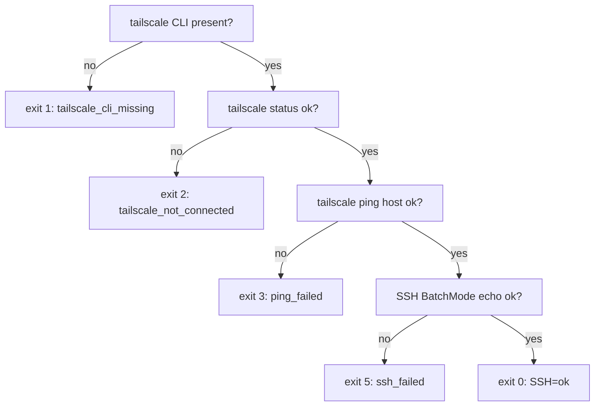

# Networking: Tailscale, Residential Proxy, SSHFS

This doc covers the three networking substrates the Universal Agent platform relies on:

1. **Tailscale** — the private overlay network connecting Kevin's desktop, the VPS, and CI runners. All SSH/file traffic between machines rides this tailnet.
2. **Residential proxy** — DataImpulse (default) / Webshare (alternate) rotating residential egress, used by the YouTube ingest path to dodge YouTube's datacenter-IP block. VPS-relevant by nature (the ingest runs there).
3. **SSHFS** — the cross-machine file bridge that mounts the desktop's `/home/kjdragan/...` tree onto the VPS at the same path, plus the rsync-based workspace mirror used for debugging.

> Scope note: the three subsystems are loosely coupled. Tailscale is the transport everything else assumes. The proxy is an application-layer concern of YouTube ingest only. SSHFS is an OS-level convenience layer plus a separate rsync mirror — neither is gated by application code.

---

## 1. Tailscale

### 1.1 Hostnames: `uaonvps` (MagicDNS) vs `srv1360701` (raw)

Two names refer to the same VPS:

- **`uaonvps`** — the **MagicDNS** name. This is what scripts and operators use to reach the box (`ssh ua@uaonvps`, `ssh root@uaonvps`). It only resolves when Tailscale's MagicDNS is active on the connecting machine. Every script defaults to a `uaonvps`-based host:
  - `scripts/tailscale_vps_preflight.sh::VPS_HOST` → `root@uaonvps`
  - `scripts/bootstrap_vps_access.sh::VPS_HOST` → `ua@uaonvps`
  - `scripts/sync_remote_workspaces.sh::DEFAULT_REMOTE_HOST` → `root@uaonvps`
  - `src/universal_agent/api/server.py` → `os.getenv("UA_REMOTE_SSH_HOST", "root@uaonvps")`
- **`srv1360701`** — the **raw provider hostname** (Hostinger). This is the device's actual machine name in the tailnet and is what `infrastructure/tailscale/device_roles.json` keys on for tag assignment, **because the Tailscale admin API indexes devices by raw hostname.** MagicDNS (`uaonvps`) is an alias layered on top (configured in the Tailscale admin console, not in this repo); the device identity for ACL/tag purposes is `srv1360701`.

The desktop is `mint-desktop`. `gateway_server.py` records the provider relationship in prose: "VPS provider: Hostinger (`uaonvps`, accessed via Tailscale as `uaonvps`)."

**Which name to use where** (this trips people up constantly):

| Context | Use this name |
|---|---|
| `device_roles.json` / admin API scripts | `srv1360701` |
| SSH commands / preflight scripts | `uaonvps` |
| `tailscale status --json` (peers reported by raw hostname) | `srv1360701` |
| `tailscale status` (text mode shows MagicDNS) / `tailscale ping` / `tailscale ssh` | `uaonvps` |

### 1.2 Device roles and ACL policy (declarative, in-repo)

The tailnet's device tags and SSH ACL are version-controlled under `infrastructure/tailscale/` and applied by two scripts:

`infrastructure/tailscale/device_roles.json` maps hostnames to tags:

```json
{
  "devices": {
    "mint-desktop": ["tag:operator-workstation"],
    "srv1360701":   ["tag:vps"]
  }
}
```

`infrastructure/tailscale/tailnet-policy.hujson` declares tag ownership and SSH grants. The SSH policy lets `tag:operator-workstation` and `tag:ci-gha` SSH into `tag:vps` as users `root` and `ua`:

```hujson
"ssh": [
  { "action": "accept", "src": ["tag:operator-workstation"], "dst": ["tag:vps"], "users": ["root", "ua"] },
  { "action": "accept", "src": ["tag:ci-gha"],               "dst": ["tag:vps"], "users": ["root", "ua"] }
]
```

**Apply tooling** (both back onto `src/universal_agent/tailscale_admin.py`, whose `TailscaleAdminClient` base URL is `https://api.tailscale.com` — the `/api/v2/...` segment is part of each request path, e.g. `get_acl` GETs `/api/v2/tailnet/{seg}/acl` and `set_device_tags` POSTs `/api/v2/device/{id}/tags`):

| Script | Purpose | Key flags |
|---|---|---|
| `scripts/tailscale_set_device_tags.py` | Reconcile device tags against `device_roles.json` | `--roles-file`, `--tailnet`, `--host`, `--dry-run` |
| `scripts/tailscale_apply_policy.py` | Validate + apply an ACL/policy overlay (merged onto live ACL) | `--policy-file`, `--tailnet`, `--write-merged-json`, `--dry-run` |

Both require an admin API token via `TAILSCALE_ADMIN_API_TOKEN` (env-var name overridable with `--token-env`) and a tailnet via `--tailnet` or `TAILSCALE_TAILNET`. Both secrets live in Infisical `production`: `TAILSCALE_TAILNET=kjdragan.github` and `TAILSCALE_ADMIN_API_TOKEN` (a `tskey-api-...` admin key from the `ua-admin-automation` identity, generated at `https://login.tailscale.com/admin/settings/keys`). `tailscale_apply_policy.py` does an **optimistic-concurrency** apply: it reads the live ACL, captures its ETag (`TailscaleAdminClient.get_acl` → `TailscaleACLState.etag`), merges the overlay (`merge_policy_overlay`, which unions list fields and overlays dict keys), `validate_acl`'s the result, then `apply_acl(merged, etag=...)`. `--dry-run` stops after validation.

`tailscale_set_device_tags.py` is idempotent: it prints `TAILSCALE_DEVICE_TAGS_OK` when current == desired and only POSTs `/api/v2/device/{id}/tags` when they differ.

### 1.3 Preflight + connectivity checks

`scripts/tailscale_vps_preflight.sh` is the canonical "can I reach the VPS over the tailnet?" probe. It emits machine-parseable `TAILSCALE_PREFLIGHT_*` lines and exits non-zero on the first failing stage:



Auth mode is governed by `UA_SSH_AUTH_MODE` (default `keys`, key path `UA_VPS_SSH_KEY` → `~/.ssh/id_ed25519`). On `ssh_failed`, if the error mentions `additional check` or `login.tailscale.com`, it prints `TAILSCALE_PREFLIGHT_HINT=interactive_check_required` — the Tailscale "check mode" / device-approval URL must be opened manually.

**ACL troubleshooting posture (operational, from the runbook):** many Tailscale SSH failures are *transient* — session re-auth, tag-sync propagation delay, node-key rotation — and self-resolve. Always re-verify current state (`tailscale status`, re-run the preflight) before investing in code remediation. Don't write a fix for a flap.

### 1.4 Sandbox bootstrap (ephemeral tailnet join)

`scripts/bootstrap_vps_access.sh` provisions a throwaway sandbox so an isolated Claude session can drive the VPS as if locally attached. It:

1. **Refuses to run outside a sandbox** (`sandbox_ok` heuristic: `$HOME == /root` and hostname matches `^(vm|sandbox|claude-)`). Override with `FORCE_BOOTSTRAP=1`.
2. Installs `openssh-client`, `curl`, `jq`.
3. Installs Tailscale and starts `tailscaled` in **userspace-networking** mode (no kernel module): `--tun=userspace-networking --socks5-server=localhost:1055 --state=mem:`.
4. `tailscale up` with `--authkey=$TS_AUTHKEY --ephemeral --ssh --accept-routes=false --accept-dns=false` (ephemeral node, auto-deregisters on logout).
5. Installs + auth's the Infisical CLI via `INFISICAL_TOKEN`.

Required env: `TS_AUTHKEY` (one-time ephemeral key), `INFISICAL_TOKEN`, `INFISICAL_PROJECT_ID`. Optional: `VPS_HOST` (default `ua@uaonvps`), `SANDBOX_HOSTNAME`. Idempotent — safe to re-run in the same sandbox.

### 1.5 `tailscale serve` staging proxies (optional)

`scripts/configure_tailnet_staging.sh` configures **tailnet-only** HTTPS staging endpoints with `tailscale serve --yes --bg`:

- UI: `--https=${UA_TAILNET_STAGING_UI_HTTPS_PORT:-443}` → `${UA_TAILNET_STAGING_UI_TARGET:-http://127.0.0.1:3000}`
- API: `--https=${UA_TAILNET_STAGING_API_HTTPS_PORT:-8443}` → `${UA_TAILNET_STAGING_API_TARGET:-http://127.0.0.1:8002}`

Modes: `--ensure` (default), `--verify-only`, `--reset`. It health-checks the local targets (`UA_TAILNET_STAGING_API_HEALTH_PATH` default `/api/v1/health`, UI `/`) retrying `HEALTH_MAX_ATTEMPTS` (default 12) × `HEALTH_SLEEP_SECONDS` (default 5). **Gotcha:** if the tailnet hasn't enabled Serve, the script detects `Serve is not enabled on your tailnet` and exits with a clear policy-blocker message rather than a raw error.

### 1.6 Tailnet HTML scratchpad — emailed reports → live, interactive HTML (added 2026-06-01)

A reusable delivery pattern: render an artifact as **standalone HTML**, publish it to a tailnet-served directory, and hand the operator a **link** instead of an attachment. The HTML then opens as a real web page in a browser — clickable table-of-contents, working anchors, any in-page interactivity — on **any device on the tailnet** (desktop, phone, tablet). This is the durable fix for the fact that email and PDF *viewers* silently drop intra-document links (Gmail won't render `.html` attachments at all and shows raw source; its inline PDF viewer ignores internal "jump to section" links). It is also the primary way to surface rendered HTML to a **terminal-only operator with no IDE** (reports, diffs, architecture diagrams, visual-explainer pages).

- **Serve config (live on the VPS):** `sudo tailscale serve --bg --set-path /scratch /home/ua/ua_scratch`. Served directly by the Tailscale daemon — reboot-safe, no extra static-server process to babysit. `--set-path` / directory serves require root (`sudo`; `ua` has passwordless sudo as of 2026-06-01); plain port-proxy serves work under the `tailscale set --operator=ua` grant *without* sudo.
- **URL shape:** `https://uaonvps.taildcc090.ts.net/scratch/<token>/<name>.html` — auto-HTTPS via the `ts.net` cert. **Tailnet membership is the auth**: reachable only from the operator's own devices, never the public internet. An unguessable `<token>` subdir is good hygiene but not the security boundary.
- **Publish:** use `scripts/publish_scratch.sh <html-file> [slug]` (`scripts/publish_scratch.sh::cmd_publish`) — it auto-detects whether it runs on the VPS (writes directly) or anywhere else on the tailnet (copies over `ssh ua@uaonvps`), generates an unguessable slug, sets readable perms (dir `0755`/file `0644`), and prints the URL on stdout (so `URL=$(scripts/publish_scratch.sh f.html)` works). `--init` idempotently (re-)establishes the `/scratch` serve mapping; `--status` prints `tailscale serve status`. Manual fallback: write the HTML to `/home/ua/ua_scratch/<token>/<name>.html` (token = unguessable slug), then return the URL. The scratch dir lives in `ua`'s home, so it survives `/opt/universal_agent` deploys; the served `/scratch` mapping survives reboots.
- **Don't disturb** the other serve mappings (`/`→:3000 dashboard, `:8443`→:8002 API, etc.) — only add/modify `/scratch`. Verify with `tailscale serve status` after any change (it must still list `/` → :3000).
- **Origin:** the YouTube daily digest "clickable TOC" problem (see `04_intelligence/05_youtube_csi_flow.md` § A.9). The digest emails a meta-synthesis summary; the full per-video report with its clickable index is published here and linked.

---

## 2. Residential Proxy

### 2.1 Why it exists

YouTube blocks transcript/metadata fetches from datacenter IPs. The VPS *is* a datacenter IP, so any ingest there must egress through a **rotating residential proxy**. The code is explicit (`youtube_ingest.py`):

> "Falling back to no-proxy is intentionally NOT done here: from a VPS datacenter IP, YouTube blocks transcript fetches outright, so a no-proxy attempt is a guaranteed waste. If you ever run this from a residential machine, set `UA_YOUTUBE_TRANSCRIPT_NOPROXY_FALLBACK=1` to re-enable it."

So the proxy is "VPS-only" in the operational sense: it's the egress path for the ingest workload, which lives on the VPS. There is no separate code flag that gates the proxy by host; it's gated by whether credentials are present and by `require_proxy`. (The desktop transcript worker was decommissioned April 2026 — all transcript fetching now runs on the VPS.)

**Approved uses (policy — the proxy is cost-sensitive, not a general scraping tunnel):**

- YouTube transcript fetching (primary path, `youtube_ingest.py`, exposed via `/api/v1/youtube/ingest`, called by CSI enrichment)
- YouTube metadata extraction that is explicitly metadata-only
- Approved TGTG proxy inheritance (`tgtg/config.py::_build_proxy_list` auto-builds a rotating-residential URL from the same shared creds when explicitly enabled)

Indiscriminate scraping through the residential pool is **disallowed** — it burns paid bandwidth.

### 2.2 Provider selection: DataImpulse (default) vs Webshare

`youtube_ingest.py::_build_proxy_config` routes on `PROXY_PROVIDER` (default `dataimpulse`):

```python
provider = (os.getenv("PROXY_PROVIDER") or "dataimpulse").strip().lower()
if provider == "dataimpulse":
    return _build_dataimpulse_proxy_config()
return _build_webshare_proxy_config()
```

| | DataImpulse (default) | Webshare |
|---|---|---|
| Builder | `_build_dataimpulse_proxy_config` → `GenericProxyConfig` | `_build_webshare_proxy_config` → `WebshareProxyConfig` |
| Cred env | `DATAIMPULSE_PROXY_USER` / `DATAIMPULSE_PROXY_PASS` | `PROXY_USERNAME`/`PROXY_PASSWORD` or `WEBSHARE_PROXY_USER`/`WEBSHARE_PROXY_PASS` |
| Host | `DATAIMPULSE_PROXY_HOST` → `gw.dataimpulse.com` | `WEBSHARE_PROXY_HOST`/`PROXY_HOST` → `p.webshare.io` |
| Port | `DATAIMPULSE_PROXY_PORT` → `823` (HTTP/HTTPS; SOCKS5 is `824`, unused) | `WEBSHARE_PROXY_PORT`/`PROXY_PORT` → `80` |
| Zone targeting | username gets `__cr.us` appended if it has no `__` suffix | `filter_ip_locations` via `PROXY_FILTER_IP_LOCATIONS`/`PROXY_LOCATIONS`/`YT_PROXY_FILTER_IP_LOCATIONS`/`WEBSHARE_PROXY_LOCATIONS` |
| Disabled when | creds missing → returns `(None, "disabled")` | creds missing → returns `(None, "disabled")` |

> **Note on "failover":** the scope line says "DataImpulse default / Webshare failover," but the code does **not auto-failover between providers within a single run.** `_build_proxy_config` picks one provider per `PROXY_PROVIDER` value and stays there. "Failover" is an **operational** posture — flip `PROXY_PROVIDER` (env / Infisical) to switch providers — not a runtime fallback. The runtime resilience is *IP rotation within the chosen pool* (see §2.3), not provider switching. [VERIFY: confirmed by reading `_build_proxy_config` — no cross-provider retry exists in code as of 2026-05-29.]

Both builders return `(None, "module_unavailable")` if `youtube_transcript_api.proxies` can't be imported.

### 2.3 IP-rotation retry (the real resilience mechanism)

Residential pools rotate egress IP per connection, and ~15-25% of pool IPs are pre-flagged by YouTube (other tenants' prior abuse) and fail deterministically. So ingest retries with a fresh `YouTubeTranscriptApi` (new connection → new egress IP) up to `UA_YOUTUBE_TRANSCRIPT_PROXY_RETRIES` (default **6**, raised from 3 on 2026-05-21). At a 25% flag rate, `0.25**6 ≈ 0.02%` chance all attempts land on flagged IPs.

A subtle classification gotcha lives here: a mix of `TranscriptsDisabled` + `RequestBlocked` for the *same* video across attempts means the underlying state is "IP blocked" (YouTube serves a sanitized response the library mis-parses as "subtitles disabled"). The code tracks exception classes across attempts to reclassify such failures as `request_blocked`.

When `require_proxy=True` and no proxy config could be built, ingest hard-fails with a `proxy_not_configured` reason naming the missing env vars for the active provider.

### 2.3a Pre-ingest triage gate (zero-cost bandwidth saver)

Before any proxy bandwidth is spent, `youtube_ingest.py::_should_skip_video_by_metadata` screens the *free* metadata (YouTube Data API v3 / yt-dlp) and skips transcript fetches for low-value videos. Gates:

| Gate | Threshold | Why |
|---|---|---|
| Too short | `< _MIN_DURATION_SECONDS` (60s) | promos/intros/shorts — minimal transcript value |
| Too long | `> _MAX_DURATION_SECONDS` (5400s / 1.5h), overridable per-channel | likely livestream replay — excessive bandwidth |
| Music | `category_id == 10` | lyrics-only filler |
| Live/upcoming | `live_broadcast_content ∈ {live, upcoming}` | no transcript yet / hours of low-density chat |

Skipped videos return `failure_class: "pre_ingest_triage"`, `status: "skipped"`, `proxy_bandwidth_saved: True`. `pre_ingest_triage` is registered **non-retryable** so the hooks service never retries it. The duration cap accepts a `max_duration_seconds_override` so gold channels (e.g. Lex Fridman's multi-hour interviews) aren't auto-triaged out.

### 2.3b DataImpulse usage stats

`youtube_ingest.py::get_dataimpulse_usage_stats` queries `https://gw.dataimpulse.com:777/api/stats` with Basic Auth using the same `DATAIMPULSE_PROXY_USER`/`PASS` creds — useful for monitoring residential bandwidth consumption. Returns `{"error": "dataimpulse_credentials_missing"}` if creds are unset.

### 2.4 Diagnostic + credential tooling

| Script | Purpose |
|---|---|
| `scripts/check_proxy.py` | **Provider-agnostic** transport probe. `--provider {webshare,dataimpulse}` (default `PROXY_PROVIDER` env → `dataimpulse`). Runs TCP → HTTP → HTTPS-CONNECT → YouTube `generate_204` probes, prints a JSON report with `bootstrap`, `proxy` (redacted URL), and per-probe results. Calls `initialize_runtime_secrets()` first. |
| `scripts/check_webshare_proxy.py` | Webshare-specific variant of the same probe (predates the agnostic one). Knows `CANONICAL_WEBSHARE_HOST = p.webshare.io` vs `LEGACY_WEBSHARE_HOST = proxy.webshare.io`. |
| `scripts/update_webshare_proxy_credentials.py` | Push `PROXY_USERNAME`/`PROXY_PASSWORD` into Infisical (`development` + `production` by default). Supports `--dry-run`, `--environments`. |

**Webshare host gotcha:** `p.webshare.io:80` is the **rotating residential** endpoint. `proxy.webshare.io` is the **legacy static-proxy** host (no longer used). `check_proxy.py` emits a warning if it resolves the legacy host.

Credentials and host/port are *all* read from env (Infisical-populated). Never hard-code proxy creds; `check_proxy.py` redacts them in its report (`_redacted_proxy_url` shows only the first 3 chars of the username).

---

## 3. SSHFS + Remote Workspace Mirror

There are **two distinct cross-machine file mechanisms.** Don't conflate them.

### 3.1 SSHFS path bridge (OS-level, not in repo)

When UA runs on the VPS, the desktop's `/home/kjdragan/...` tree is mounted onto the VPS at the **identical path** via SSHFS over Tailscale. This means VPS-side code can `open("/home/kjdragan/...")` and it resolves transparently to the desktop file — no fetcher tool needed. This is the "Path Guarantee" / "Cross-Machine File Resolution" capability described in `CLAUDE.md`.

**How it's set up (added 2026-04-23):** a **VPS-side systemd mount unit** mounts the workstation's `/home/kjdragan` at the same path on the VPS via SSHFS over Tailscale, authenticating with the `id_ed25519` key. This is what makes "refer to `/home/kjdragan/...` directly from VPS code" work transparently.

**Code reality:** there is **no `sshfs` mount command anywhere in `scripts/`.** Grep for `sshfs` returns only *comments and docs* (e.g. `bootstrap_vps_access.sh`, `end_session_cleanup.sh`, `CLAUDE.md`). The mount unit lives on the VPS filesystem, not in this repo — from the code's perspective the SSHFS bridge is an *assumed OS substrate*, not a version-controlled component. The `ua` VPS user reads the desktop paths through this mount; there is no `kjdragan` account on the VPS. To inspect/repair it, check the VPS for the sshfs systemd mount unit.

### 3.2 Remote workspace mirror (rsync over Tailscale SSH)

`scripts/sync_remote_workspaces.sh` is a **separate, rsync-based** mirror — *not* SSHFS — used to pull VPS `AGENT_RUN_WORKSPACES` and durable `artifacts` down to the desktop for debugging. Transport is `rsync -e ssh` over the tailnet:

- Default host `root@uaonvps` (`UA_REMOTE_SSH_HOST`), remote dir `/opt/universal_agent/AGENT_RUN_WORKSPACES` (`UA_REMOTE_WORKSPACES_DIR`).
- SSH auth mode `UA_SSH_AUTH_MODE` default `tailscale_ssh` (vs `keys`); SSH options hard-set `BatchMode=yes`, `ConnectTimeout=10`, `ServerAliveInterval=15`, `StrictHostKeyChecking=accept-new`.
- Runs a **tailnet preflight** (`run_tailnet_preflight`, gated by `UA_TAILNET_PREFLIGHT` default `force` / `UA_SKIP_TAILNET_PREFLIGHT`) before each cycle; skips the cycle if the tailnet is unreachable.
- `runtime_state.db` (+ `-shm`/`-wal`) are **excluded by default** unless `--include-runtime-db` — this matters because runtime vs activity DB confusion has burned audits before.
- Modes: `--once`, `--interval N` (continuous), `--status-json` (freshness probe, no rsync), `--session-id <id>` (one workspace).
- Safety: any remote-delete mode (`--delete-remote-after-sync`, `--prune-remote-when-local-missing`) **requires** `--allow-remote-delete`. Ready-marker gating (`sync_ready.json`, min-age `UA_REMOTE_SYNC_READY_MIN_AGE_SECONDS` default 45) and an optional remote ops toggle (`--respect-remote-toggle` against `/api/v1/ops/remote-sync`) prevent syncing mid-run workspaces.

Companion scripts: `scripts/pull_remote_workspaces_now.sh` (one-shot), `scripts/remote_workspace_sync_control.sh` (control), `scripts/install_remote_workspace_sync_timer.sh` (systemd timer).

---

## Environment Variable Reference

| Var | Default | Used by | Purpose |
|---|---|---|---|
| `UA_VPS_HOST` / `UA_REMOTE_SSH_HOST` | `root@uaonvps` | preflight, sync, api/server | VPS SSH target (MagicDNS name) |
| `UA_SSH_AUTH_MODE` | `keys` (preflight) / `tailscale_ssh` (sync) | preflight, sync | SSH auth: `keys` vs `tailscale_ssh` |
| `UA_VPS_SSH_KEY` | `~/.ssh/id_ed25519` | preflight | SSH private key |
| `TAILSCALE_ADMIN_API_TOKEN` | — | tags/policy scripts | Tailscale admin API token |
| `TAILSCALE_TAILNET` | — | tags/policy scripts | Tailnet name |
| `TS_AUTHKEY` | — | bootstrap | Ephemeral tailnet auth key |
| `FORCE_BOOTSTRAP` | `0` | bootstrap | Override sandbox-only guard |
| `PROXY_PROVIDER` | `dataimpulse` | youtube_ingest, check_proxy | Select proxy provider |
| `DATAIMPULSE_PROXY_USER` / `_PASS` | — | youtube_ingest | DataImpulse creds |
| `DATAIMPULSE_PROXY_HOST` / `_PORT` | `gw.dataimpulse.com` / `823` | youtube_ingest | DataImpulse endpoint |
| `PROXY_USERNAME` / `PROXY_PASSWORD` | — | youtube_ingest, Webshare | Webshare creds (also `WEBSHARE_PROXY_USER/PASS`) |
| `WEBSHARE_PROXY_HOST` / `PROXY_HOST` | `p.webshare.io` | youtube_ingest | Webshare host (rotating endpoint) |
| `WEBSHARE_PROXY_PORT` / `PROXY_PORT` | `80` | youtube_ingest | Webshare port |
| `PROXY_FILTER_IP_LOCATIONS` (+ aliases) | — | youtube_ingest | Webshare geo targeting |
| `UA_YOUTUBE_TRANSCRIPT_PROXY_RETRIES` | `6` | youtube_ingest | Fresh-IP retry count |
| `UA_YOUTUBE_TRANSCRIPT_NOPROXY_FALLBACK` | `0` | youtube_ingest | Re-enable no-proxy fallback (residential host only) |
| `UA_REMOTE_WORKSPACES_DIR` | `/opt/universal_agent/AGENT_RUN_WORKSPACES` | sync | Remote dir to mirror |
| `UA_TAILNET_PREFLIGHT` / `UA_SKIP_TAILNET_PREFLIGHT` | `force` / `false` | sync | Tailnet preflight gating |
| `UA_TAILNET_STAGING_*` | see §1.5 | staging serve | Ports/targets/health for `tailscale serve` |

---

## Gotchas (code-verified)

- **No automatic provider failover.** Provider is fixed per `PROXY_PROVIDER` per run; "Webshare failover" = an operator env flip, not a runtime fallback.
- **Legacy Webshare host trap.** Use `p.webshare.io` (rotating residential), not `proxy.webshare.io` (legacy static). `check_proxy.py` warns on the legacy host.
- **SSHFS is not in this repo.** The mount is an OS-level substrate. The repo's `sync_remote_workspaces.sh` is rsync, a different thing — debugging mirror, not the live path bridge.
- **`uaonvps` requires MagicDNS.** If a machine isn't on the tailnet with MagicDNS, `uaonvps` won't resolve; the device's real name is `srv1360701`.
- **Tailscale "check mode" can block SSH.** Preflight's `interactive_check_required` hint means you must open the `login.tailscale.com` approval URL — automated retry won't fix it.
- **`runtime_state.db` excluded from mirror by default.** Use `--include-runtime-db` if you actually need it; otherwise you're looking at a workspace without its runtime DB.
- **Remote deletes need an explicit `--allow-remote-delete`.** Belt-and-suspenders against accidentally pruning production workspaces.
- **Most Tailscale SSH failures are transient.** Re-auth / tag-sync delay / node-key rotation self-resolve — verify current state before coding a remediation.
- **Pre-ingest triage burns no proxy bandwidth.** A `pre_ingest_triage` skip is *intentional* (short/long/music/live video), not a proxy failure — and it's non-retryable.
- **Triage duration cap is per-channel overridable.** Gold channels with multi-hour content pass a `max_duration_seconds_override` so they aren't auto-skipped by the 1.5h global cap.
