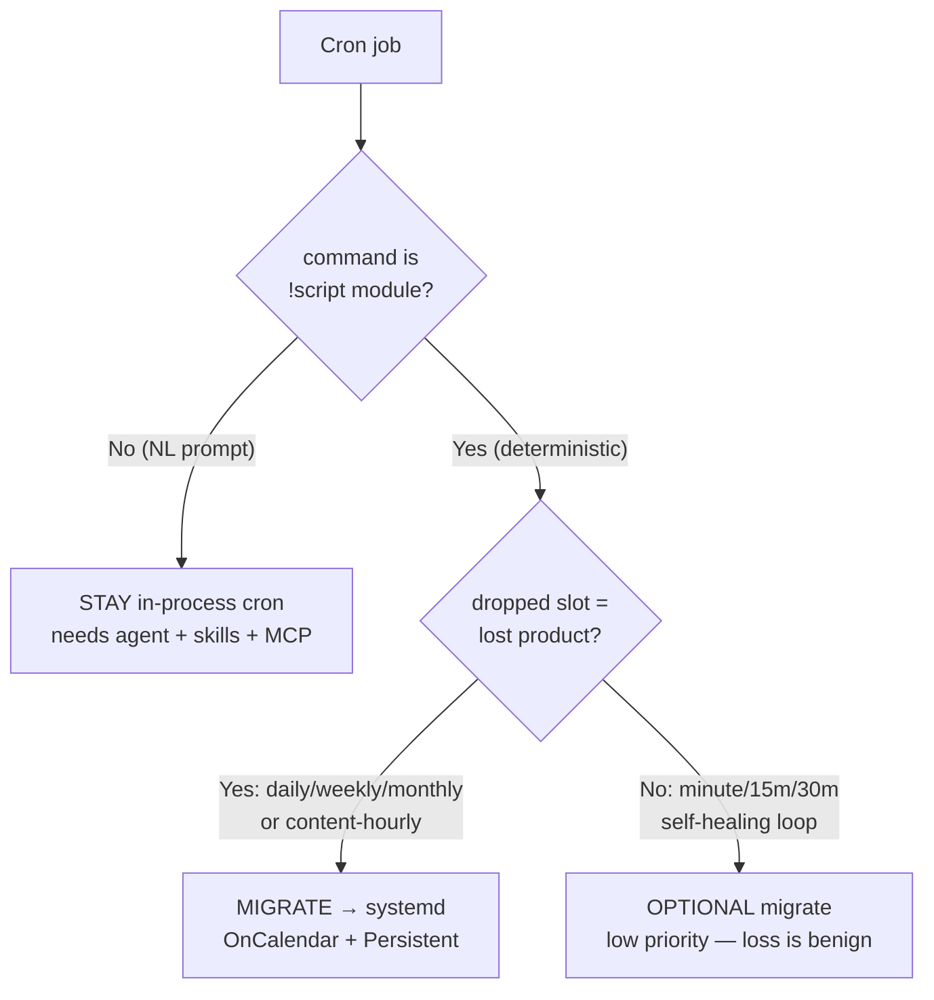
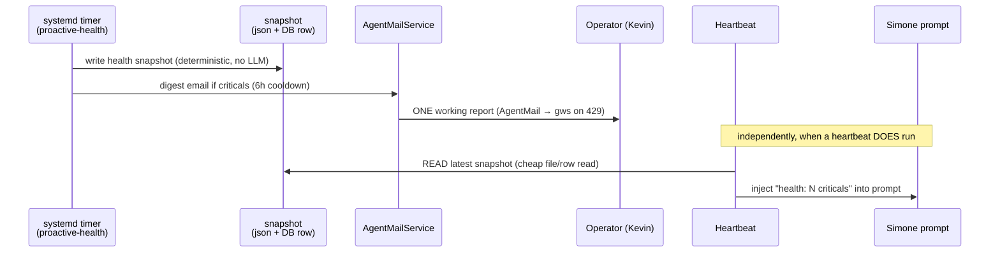
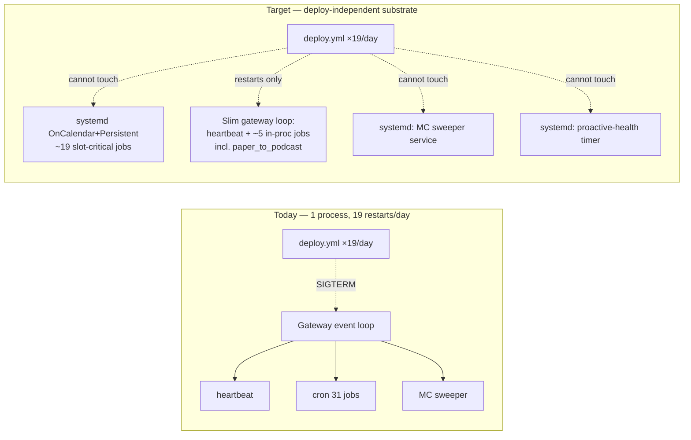

# ADR: Scheduling Substrate Redesign

> **ADR status: PARTIALLY IMPLEMENTED.** Phases **B** (Mission Control sweeper
> service, #749) and **C** (proactive-health timer + delivery contract) have
> **shipped** — see their **As-built** notes in Decision 2 / Decision 3 and the
> migration-phases section. Phase **A** (deterministic jobs → timers) is now
> **partially implemented**: **batch 1** (5 maintenance/audit jobs) and **batch 2**
> (the 6 content-daily jobs — 3 `proactive_report_*` slots sharing one service,
> `proactive_artifact_digest`, `intel_auto_promoter`, `codie_proactive_cleanup`)
> have **shipped** — see the **As-built** notes under Phase A. Phase A batches 3–4
> remain **PROPOSED**, gated on the operator decision points in the final section.
> Phase **D** (canonical-store hygiene) **shipped 2026-06-05** — root-caused to a
> **skill placeholder DB path** (`evaluate-and-author-intel-brief/SKILL.md`), not
> the originally-hypothesized stray relative-cwd *source* writer; see its
> **As-built** note. The orphan-DB cleanup + recovery of 18 undelivered intel
> briefs is the one operator-gated follow-up carved out of Phase D. NOTE: the operator chose to
> **keep all 3 daily reports** (morning/midday/afternoon), superseding the
> Decision-4 "drop midday/afternoon" consolidation proposal (which was never
> implemented — midday was still live and emailing at migration time). The
> original design intent below is preserved; the As-built notes record where the
> shipped reality refined it. Grounded against deployed HEAD `e7014bba`
> (re-verify before implementing further — production deploys land ~19×/day).
>
> **Holistic as-built review (2026-06-06).** An 8-facet review verified the shipped
> phases against live production: deploy-independence (0 monotonic-regressed
> timers, all `OnCalendar`+`Persistent`), no double-fire / no fire-loss (all 11
> migrated rows `enabled=false` in the live `cron_jobs.json`, the timers the sole
> firers, 0 post-gate in-process runs), health-reaches-operator (a real digest
> email with a genuine SES `message_id`), and the decoupled-observational sweeper
> (own PID, survived a deploy) **all HOLD live**. Findings + the drift/regression
> list + the operator-gated adjustment list:
> `…/scratch/ua-holistic-review/holistic_review_findings.html`. Closeouts it
> surfaced shipped in **PR #757** (youtube workspace fork-guard, hackernews
> source-liveness park, proactive-health `TimeoutStartSec`, runbook-string
> repoint). Remaining designed work: Phase A batches 3–4 (operator-gated) and the
> 18-brief recovery.

## 1. Context

Universal Agent's recurring work is driven by **six independent schedulers** with
very different restart-survival properties, and most of them funnel through a
single process — the gateway — that restarts roughly **19 times per day** (one per
`deploy.yml` run; each merge to `main` runs `scripts/deploy/remote_deploy.sh`,
which does `git reset --hard origin/main` then `sudo systemctl restart
universal-agent-gateway …`). The consequences:

1. **In-process cron drops slots.** The gateway cron (`cron_service.py::CronService._scheduler_loop`,
   a fixed 1-second poll) runs with restart-backfill **gated OFF by default**
   (`cron_service.py::CronService.start` only replays the `_backfill_queue` when
   `UA_CRON_BACKFILL_ON_RESTART` is truthy; default `"0"`). A cron slot that lands
   entirely inside a deploy/restart window is therefore **silently dropped** — the
   audit measured **17 %** lost ticks on `simone_chat_auto_complete` and **49 %**
   on `atlas_direct_dispatch`. The flag is OFF *deliberately*: firing every missed
   heavy cron simultaneously at boot starves the asyncio event loop and times out
   the deploy health-check (the 2026-05-16 incident). **"Just turn backfill on" is
   not the fix.**

2. **Health findings reach no one on a skipped heartbeat.** The System-2 health
   invariants and the proactive-health email are coupled to Simone's heartbeat
   tick (`heartbeat_service.py::HeartbeatService._run_heartbeat`), which is itself
   gated behind seven early-returns in `heartbeat_service.py::HeartbeatService._process_session`.
   When the heartbeat short-circuits (lock/cooldown/dormancy/empty-directive), the
   health check never runs that tick — and even when it does, the daemon
   subprocess often resolves `gateway_server.py::_agentmail_service` to `None` and
   skips the email.

3. **Mission Control is a co-tenant, not a consumer.** The Chief-of-Staff sweeper
   (`services/mission_control_intelligence_sweeper.py::run_sweeper_loop`) shares
   the gateway event loop with the cron and heartbeat schedulers. It can starve
   them (its `tick()` queries a ~1.2 GB SQLite store) or be starved by them, and it
   dies on every deploy restart — despite being **purely observational** (it
   creates cards and a readout; it never dispatches work).

This ADR defines a **target substrate** that (a) makes must-fire jobs
deploy-independent, (b) makes health findings reach the operator and Simone
independent of LLM/heartbeat availability, and (c) makes Mission Control a
read-only consumer that can neither starve nor be starved.

### 1.1 The six schedulers today (re-verified live)

| # | Substrate | Driver | Restart-survival | Role |
|---|---|---|---|---|
| A | Asyncio heartbeat | `heartbeat_service.py::HeartbeatService._scheduler_loop` (1–30 s tick, ~11 min real cadence) | **Dies on deploy** (gateway loop) | Simone orchestration + health tick |
| B | In-process cron | `cron_service.py::CronService._scheduler_loop` (1 s poll, 31 jobs) | **Dies on deploy; drops missed slots** | All registered crons |
| C | Mission Control sweeper | `services/mission_control_intelligence_sweeper.py::run_sweeper_loop` (60 s) | **Dies on deploy** (gateway loop) | Observational cards + readout |
| D | systemd timers | 15 UA units under `deployment/systemd/` + CSI | **Deploy-independent** (OS PID-1) | CSI lane + maintenance |
| E | OS crontab (`ua`) | `cron.service` (2 legacy noop jobs) | Deploy-independent | none real (S4 removing) |
| F | GitHub Actions | `deploy.yml` etc. (off-VPS) | Off-process | **Causes** the restarts |

Substrate **D is the dependable model.** But it has its own failure mode (see
§3.1): the dead units (`universal-agent-service-watchdog.timer`,
`universal-agent-oom-alert.timer`, `universal-agent-youtube-playlist-poller.timer`)
all use **monotonic-only** scheduling (`OnBootSec`/`OnUnitActiveSec`, **no**
`OnCalendar`) where `Persistent=true` is a no-op — once the self-chaining
`OnUnitActiveSec` loop breaks there is no wall-clock anchor to re-arm, and
`NextElapse` goes to `infinity`. Every **healthy** UA timer (the 11 `csi-*` units +
`universal-agent-uv-cache-prune.timer`) uses **`OnCalendar` + `Persistent=true`**,
which gives free OS-level catch-up after downtime. **The target substrate is
specifically `OnCalendar` + `Persistent`, never monotonic-only.**

## 2. The five decisions

### Decision 1 — Substrate policy + per-job target table

**Question.** Which jobs must be deploy-independent (→ systemd `OnCalendar`
timers) and which genuinely need live-agent/session/LLM context (→ stay in
`cron_service`)?

**Two-axis criterion (recommended).**

1. **Live-agent axis.** Read the job's `command`:
   - `!script universal_agent.<module>` → **deterministic Python** (runs as a
     `cron_service.py::CronService._run_job` subprocess already, *not* in the
     gateway loop). Eligible for a systemd timer.
   - A natural-language prompt (the agent must load skills/MCP and reason) →
     **must stay in-process**: it needs the Claude runtime, the skill loader, and
     MCP servers that only exist inside the gateway/agent session.
2. **Slot-criticality axis (for eligible jobs).**
   - A **dropped slot loses irreplaceable product** (daily / weekly / monthly
     cadence, or content-bearing hourly) → **migrate first**; `Persistent=true`
     gives OS-level catch-up so a slot inside a deploy window is replayed, not lost.
   - A **dropped slot self-heals on the next tick** (minute / 15-min / 30-min
     control-plane loops) → migration is **optional / low priority**:
     `Persistent` buys nothing for a missed minute, and the loss is benign
     frequency reduction, not lost product.

**Why this is right, not just convenient.** The live-agent axis is observable
in the data — exactly **3 of 31** jobs are NL prompts; the rest are `!script`
modules already running as subprocesses, so moving their *scheduling* off the
gateway changes nothing about how they execute, only that they stop dying with
the gateway. The slot-criticality axis is what makes `Persistent=true` matter:
it is the mechanism that closes the "daily slot lost in a deploy window" gap
(Decision 5) for migrated jobs.

#### Per-job target-substrate table (all 31 live jobs, `cron_jobs.json` @ `e05b62fb`)

Legend — **Substrate**: `systemd` = `OnCalendar`+`Persistent` timer (migrate);
`in-proc` = stay in `cron_service`; `in-proc?` = optional/low-priority migrate;
`drop` = consolidate/remove (see Decision 4 / S4).

| job_id | system_job | sched (CT unless UTC) | kind | cadence | substrate | rationale |
|---|---|---|---|---|---|---|
| e1e094743c | youtube_daily_digest | `0 6` | det | daily | **systemd** | lost slot = no digest that day; YouTube-OAuth secrets via EnvironmentFile |
| 257f8812b4 | youtube_gold_channel_poller | `30 5` | det (`services.*`) | daily | **systemd** | feeds the 06:00 digest; order via timer time, not in-proc coupling |
| f9cf9e5b90 | youtube_oauth_watchdog | `0 7` | det | daily | **systemd** | token-expiry guard must not be a deploy casualty |
| 89d41cc817 | nightly_wiki | `15 3` | det | daily | **systemd** | overnight product; NotebookLM via CLI not agent runtime |
| cc5fde061b | morning_briefing | `30 6` | det | daily | **systemd** | AM product; `briefings_agent` deterministic |
| 42480a1873 | evening_briefing | `0 18` | det | daily | **systemd** | PM product; same module `--mode=evening` |
| 9dea8c1899 | proactive_artifact_digest | `35 8` | det | daily | **systemd ✅ migrated (batch 2)** | distinct content (unseen PRs/builds); keep (Decision 4) |
| 3a3693d74e | proactive_report_morning | `5 7` | det | daily | **systemd ✅ migrated (batch 2)** | report; operator kept all 3 reports |
| 0c55a85ebf | proactive_report_midday | `5 12` | det | daily | **systemd ✅ migrated (batch 2)** | operator kept all 3 reports — supersedes the Decision-4 "drop" proposal (never implemented; midday was still live + emailing) |
| f143a79e94 | proactive_report_afternoon | `5 16` | det | daily | **systemd ✅ migrated (batch 2)** | operator kept all 3 reports — supersedes the Decision-4 "drop" proposal |
| c6d41e434e | scratch_pruning | `0 7` | det | daily | **systemd ✅ migrated (batch 1)** | maintenance; benign but deploy-independent is cleaner |
| 6321bde1a9 | codie_proactive_cleanup | `30 1` | det (enqueue) | daily | **systemd ✅ migrated (batch 2)** | the enqueue is deterministic; Cody executes downstream. Registers via bespoke `add_job` path → bespoke disable gate |
| df1def4ad2 | vault_lint_contradictions | `0 7 1 * *` | det | monthly | **systemd ✅ migrated (batch 1)** | strongest `Persistent` case — a lost monthly slot = a lost month |
| 73767a8730 | architecture_canvas_drift | `30 6 * * 1` | det | weekly | **systemd ✅ migrated (batch 1)** | weekly product |
| c8061c36c9 | insight_scoring_health | `0 8 * * 0` | det | weekly | **systemd ✅ migrated (batch 1)** | weekly calibration audit |
| 6d29a53e64 | vp_coder_workspace_pruning | `5 17 * * 0` | det | weekly | **systemd ✅ migrated (batch 1)** | weekly maintenance |
| 9ad58b493f | csi_demo_triage_rank | `5 10,15` | det (LLM API) | 2×/day | **systemd** | LLM via API key, not agent runtime; slot-bearing |
| 6f661208f8 | intel_auto_promoter | `35 10,15` | det | 2×/day | **systemd ✅ migrated (batch 2)** | promotes triage output; capped/day; pure SQLite (no `TimeoutStartSec`) |
| 013f433539 | hourly_intel_digest | `0 6-21` | det | hourly | **systemd** | content-hourly, ~3 hrs/day lost today; "LLM-independent path" by design |
| csi_convergence_sync | csi_convergence_sync | `0 6-21` | det (LLM) | hourly | **systemd** | content-hourly, ~25 % restart-cancelled today |
| b4caa05aba | cron_artifact_reminders_sweep | `*/30 6-21` | det | 30-min | **systemd ✅ migrated (2026-06-08)** | was `in-proc?` (self-healing, optional); migrated to `universal-agent-artifact-reminders-sweep.timer` alongside its sibling `proactive_artifact_digest` when the desktop-duplicate timer was retired. ExecStart module now self-bootstraps secrets (it had inherited the gateway env in-process) |
| 95a651abc5 | vp_mission_pr_reconciler | `*/15 6-20` | det | 15-min | **in-proc?** | self-healing reconcile; next sweep covers |
| 2e2e40373e | simone_chat_auto_complete | `*/1` UTC | det | minute | **in-proc?** | 17 % lost but benign; control-plane (operator call) |
| 8d0f1af6ee | atlas_direct_dispatch | `*/1` UTC | det | minute | **in-proc?** | 49 % lost but benign; control-plane dispatch (operator call) |
| 2afe05ab96 | paper_to_podcast_daily | `0 21` | **prompt** | daily | **in-proc** | needs `paper-to-podcast-tf` skill + arXiv MCP + `nlm` CLI; **cannot** be a pure timer → Decision 5 catch-up target |
| 6df69e8e9e | — ("24 Hour Update") | `0 7` | **prompt** | daily | **drop** | overlaps `morning_briefing` (Decision 4) |
| a652c8dce5 | — ("CODIE cleanup #1") | `30 1` | **prompt** | daily | **drop** | exact-slot duplicate of 6321bde1a9 (S4 removing) |
| 5ed062c04d | — (freelance_scout) | `0 8,20` | shell | — | **disabled** | already off; S4 territory |
| claude_code_intel_sync | claude_code_intel_sync | `0 8,16,22` | det | — | **disabled** | off-by-design (X credits); leave |
| a3c4deeb3b | hackernews_snapshot | `0,30 6-21` | det | — | **disabled** | off via PR #734; leave |
| c501cd6a6e | hourly_insight_email | `0 6-21` | det | — | **disabled** | superseded by hourly_intel_digest (S4 removing) |

**Counts:** **19 → systemd** (slot-critical deterministic — counts the
`systemd / drop` hybrid row `proactive_report_afternoon`, which becomes systemd
only if the operator keeps a 2× report cadence in Decision 4, else drops),
4 → **in-proc?** (optional sub-hourly), 1 → **in-proc** (paper_to_podcast prompt),
3 → **drop** (consolidate), 4 → **disabled** (no action). Grand total reconciles
to 31. The in-process *daily* footprint shrinks to **one** job (paper_to_podcast),
which is what makes Decision 5's catch-up structurally bounded.
>
> *Update 2026-06-08:* `cron_artifact_reminders_sweep` — an `in-proc?` target — was
> opportunistically migrated to a systemd timer (it was already a VPS in-process cron
> with a now-removed desktop-`--user` duplicate; consolidating onto a timer removed the
> double-fire risk). So the live optional set is **3 → in-proc?** and slot-critical/opt
> systemd is **20**. The frozenset `systemd_migrated_jobs.py::SYSTEMD_MIGRATED_SYSTEM_JOBS`
> remains the machine source of truth.

> Migration caveat (carries into every `systemd` row): a job lifted out of the
> in-process runtime must get its `required_secrets` via an `EnvironmentFile`
> the way healthy `csi-*` units do (the S2 pattern — see §3.1). The secret-bearing
> jobs are the YouTube-OAuth set (e1e094743c, 257f8812b4, f9cf9e5b90), the
> NotebookLM-cookie set (89d41cc817), the `UA_OPS_TOKEN` briefings
> (cc5fde061b, 42480a1873), and the Anthropic-key triage (9ad58b493f).

### Decision 2 — Decouple the Chief-of-Staff / Mission Control sweeper

**Question.** How do we make `run_sweeper_loop` a read-only consumer that can
neither starve nor be starved by the core schedulers, and is not a deploy
casualty?

**Constraint (verified, must preserve).** The sweeper is **observational**: a
grep across `services/mission_control_intelligence_sweeper.py` for
`claim_next` / `dispatch_sweep` / `route_all_to_simone` / `perform_task_action` /
`INSERT INTO task_hub` returned **zero** matches. Its only writes are tile colors
(`mission_control_tile_states`), infrastructure/tier-1 cards (the Mission Control
card store), and the tier-2 readout (`generate_and_store_readout`). It must stay
that way and read **durable DB state**, not in-process gateway memory.

| Option | Effect | Verdict |
|---|---|---|
| (a) **Own long-lived systemd service** (`Type=simple`, runs the loop as its own process, *excluded* from the deploy restart list) | Fully off the gateway loop; deploy-independent; keeps the 60 s cadence + the existing `asyncio.to_thread(sweeper.tick)` offload; one persistent DB connection | **RECOMMENDED** |
| (b) Out-of-loop worker thread in the gateway | Still a deploy casualty; GIL contention with the gateway; doesn't remove the co-tenancy | Rejected |
| (c) systemd `OnCalendar` timer every 60 s | Re-pays process + DB-connection startup every minute; awkward for a continuous loop; tier-1/tier-2 cadence already lives in DB sentinel rows so it *could* work, but churn is wasteful | Acceptable fallback only |

**Recommendation: (a).** A dedicated `universal-agent-mission-control-sweeper.service`
running the existing `run_sweeper_loop` as its own process, removed from the
gateway lifespan. Because it already reads the canonical Task Hub store via the
`durable/db.py::get_activity_db_path` resolver and writes the MC stores (never
gateway in-process memory), the extraction is clean. Isolating it means its
1.2 GB-store `tick()` can never block the heartbeat/cron loop again (the original
`to_thread` mitigation stays), and a gateway deploy no longer kills the readout.

**Relationship to S3.** S3 fixes the tier-2 `state_since`-on-skip bug *inside*
`services/mission_control_intelligence_sweeper.py::_write_tier2_meta` — correct
regardless of where the loop runs. S5 **assumes S3 landed** and simply relocates
the already-fixed loop into its own process. Independent of S1/S2/S4.

**As-built (S5 Phase B, implemented).** Option (a) shipped, with one refinement to
the "excluded from the deploy restart list / deploy-independent" framing above: the
service is **restarted on each deploy** (the installer
`scripts/install_vps_mission_control_sweeper.sh` re-runs `enable --now` + `restart`
from `remote_deploy.sh`) so it picks up new code, and determinism comes from the
**durable `__tier1_meta__` / `__tier2_meta__` cadence sentinels** that survive the
restart — not from excluding it from the restart list. The win is therefore *process
isolation* (off the gateway event loop), not literal deploy-immunity; a fast restart
with durable state is correct. Entrypoint:
`services/mission_control_sweeper_main.py`; unit:
`deployment/systemd/universal-agent-mission-control-sweeper.service`. The full as-built
description lives in `04_intelligence/11_mission_control_intelligence.md`.

### Decision 3 — Deterministic health checks + a delivery contract

**Question.** How do we run the ~19 `proactive_health` invariant probes
independent of Simone's LLM and the heartbeat tick, and guarantee findings reach
(a) Simone's prompt and (b) the operator as **one working report**?

**Grounded current state.** The 9 invariant modules under
`services/invariants/` register ~21 probes (20 unique ids — the count grew
post-design with `mission_control_sweeper_liveness` (#751), `disk_usage_health`,
and the youtube transcript/enrichment coverage split;
`services/invariants/proactive_pipeline_invariants.py` alone carries 11); `services/proactive_health.py::build_proactive_health_payload`
aggregates them **in-memory** (no DB row, no JSON written by the builder). The
operator email path already exists —
`services/proactive_health_notifier.py::run_pre_flight_check` →
`_notify_critical` → `AgentMailService.send_email(...)` with a 6 h cooldown
(`DEFAULT_COOLDOWN_SECONDS = 21600`, dedup key `proactive_health_critical:<finding_id>`).
**The gap is coupling, not the mailer:** `run_pre_flight_check` is invoked from
`heartbeat_service.py::HeartbeatService._run_heartbeat`, and the seven
`heartbeat_service.py::HeartbeatService._process_session` early-returns
(lock / retry-not-due / not-scheduled / dormancy / no-targets / empty-directive /
require-file) skip `_run_heartbeat` entirely on those ticks. Plus the
daemon-subprocess `agentmail=None` race (S1's target).

**Recommendation.** A deterministic, LLM-free **systemd timer job**
(`universal-agent-proactive-health.{service,timer}`, `OnCalendar` ~every 5–10 min,
`Persistent=true`) that:

1. Calls `services/proactive_health.py::build_proactive_health_payload` and
   writes a **durable health snapshot** — formalize the existing
   `work_products/proactive_health_latest.json` sidecar
   (`services/proactive_health_notifier.py` already writes it) as the canonical
   snapshot, optionally mirrored to a `proactive_health_snapshots` row in
   `activity_state.db`.
2. Emails the operator via the **same** `proactive_health_notifier` path
   (`AgentMailService.send_email`, 6 h cooldown, INCIDENT/ACTION tags) — but now
   constructed as a fresh `AgentMailService(); await startup()` in the timer's own
   subprocess (the S1 pattern), so the `agentmail=None` race is structurally
   gone. **Collapse the current per-finding emails into one digest email per run**
   ("Proactive Health: N criticals"), still cooldown-gated per finding-set.

**Delivery contract (two independent paths, neither blocked by the heartbeat):**

- **(a) Operator** gets the report from the **timer**, not the heartbeat — so a
  skipped/locked/dormant heartbeat can no longer silence it.
- **(b) Simone** learns of findings by **reading the snapshot** the timer wrote
  (a cheap file/row read that survives skip-mode), injected into her prompt on
  any tick that runs. Compute moves out of the heartbeat; only a read remains.

**Relationship to S1.** S1 makes `proactive_health_notifier.py` construct a real
mailer in a subprocess (fixing `agentmail=None`). S5's timer job **runs in a
subprocess and reuses exactly that fix** — S5 **assumes S1 landed**; without it
the timer would hit the same race. Independent of S2/S3/S4.

**As-built (S5 Phase C, implemented).** Shipped as recommended, with these
concretions:

- **Deploy posture = deploy-independence** (the *opposite* axis from Phase B's
  long-lived isolated service): a `Type=oneshot` `.service` driven by a
  `.timer` with `OnCalendar=*:0/10` + `Persistent=true` + a small
  `RandomizedDelaySec`. It rides through the ~19 daily deploy `daemon-reload`s
  and replays a slot missed inside a deploy window. **Never monotonic** (the S2
  dead-timer lesson). The timer is *not* added to the is-active watchdog (a
  oneshot is inactive between runs); its correctness guarantee is
  `OnCalendar`+`Persistent`.
- **Durable snapshot = a singleton row in `activity_state.db`** (table
  `proactive_health_snapshots`, `id=1` upsert) resolved via
  `durable/db.py::get_activity_db_path`, so the timer and the heartbeat agree on
  the path with zero ambiguity — replacing the **ephemeral** per-heartbeat-
  workspace `proactive_health_latest.json` sidecar the timer could never share.
  A fixed-path JSON mirror (`AGENT_RUN_WORKSPACES/proactive_health/latest.json`)
  is written best-effort for the dashboard. New store:
  `services/proactive_health_snapshot.py`.
- **The row also carries the digest-cooldown state**
  (`last_digest_fingerprint` / `last_digest_sent_at_utc`) because a fresh
  oneshot has **no** in-memory `_notifications` cache — the cooldown must be
  durable. The 6 h window is keyed on the **finding-SET** fingerprint (sorted
  `finding_id`s); a new or changed critical resets it.
- **One digest email** (not per-finding): `proactive_health_notifier.py::send_critical_digest`
  reuses `_acquire_agentmail_service` / `_construct_started_agentmail_service`
  (S1's subprocess mailer, AgentMail-primary with the gws/HTTP-429 fallback) and
  the INCIDENT/ACTION `email_tags`; the timer decides the cooldown, the function
  just sends and closes any owned handle in a `finally`.
- **Heartbeat compute → read swap.** The `build_proactive_health_payload` +
  `run_pre_flight_check` block was **removed** from
  `heartbeat_service.py::HeartbeatService._run_heartbeat` (no double-compute /
  "backup"); `heartbeat_service.py::_compose_heartbeat_prompt` now injects a
  read-only `== PROACTIVE HEALTH (N critical / M warn) ==` block sourced from
  the snapshot (a cheap read that survives skip-mode), modeled on the existing
  System-1 `== DATABASE HEALTH ALERTS ==` block. That read-only block is gated
  by `not task_focused` (like the System-1 block), so task-dispatch heartbeat
  ticks omit it; the operator timer-email path is unaffected.
- **Entrypoint:** `services/proactive_health_timer_main.py` (run via
  `python -m universal_agent.services.proactive_health_timer_main`) — secrets
  via `initialize_runtime_secrets()` FIRST, then function-local imports. Units:
  `deployment/systemd/universal-agent-proactive-health.{service,timer}`;
  installer `scripts/install_vps_proactive_health_timer.sh` wired into
  `remote_deploy.sh`. `gateway_server.py::ops_proactive_health` is unchanged
  (still recomputes live on demand). The in-process `run_pre_flight_check` path
  is retained as the notifier primitive (still used by tests and the
  `email_test` endpoint's sibling helper) but has **no production caller** after
  the heartbeat removal — retiring it is a follow-up.
- **Follow-up — DONE (2026-06-05):** `services/invariants/mission_control_sweeper_liveness.py`
  warns when the Phase B sweeper's per-tick heartbeat (`last_checked_at` on the
  `__tier1_meta__` row, NOT the sparse `state_since` — the S3 trap) goes stale
  beyond ~5× cadence, so a wedged-but-alive sweeper surfaces through this same
  health path. **WARN-only** (never emails — the digest is criticals-only) and
  phase-gated (no-op when `UA_MC_PHASE_1_ENABLED` is off), so it can't become a
  false page. Threshold tunable via `UA_MC_SWEEPER_LIVENESS_MAX_STALE_SECONDS`.

### Decision 4 — Consolidations (keep / merge / drop)

| Item | Finding | Recommendation |
|---|---|---|
| **Report pipeline** | 3× `proactive_report_*` (07:05/12:05/16:05, all `proactive_report_agent`) + `proactive_artifact_digest` (08:35, `proactive_digest_agent`). All 3 reports were "fires-noop" on email (S1 fixing); midday already missed a full day. Pipeline-stats change slowly; convergence content is *already* delivered hourly by `hourly_intel_digest`. | **Merge 3 → 1** (keep `proactive_report_morning`; drop midday + afternoon), or 3 → 2 (morning + afternoon) if the operator wants a PM read. **Keep `proactive_artifact_digest`** — distinct content (unseen CODIE PRs / tutorial builds). |
| **Two AM products** | `morning_briefing` (06:30, deterministic `briefings_agent`) vs the prompt-based **"24 Hour Update"** (07:00, `6df69e8e9e`, needs a live agent; legacy operator cron, no `system_job`; runs `generate_system_health_report.py` + reads `morning_report_latest.md`). Both are AM digests 30 min apart. | **Drop the "24 Hour Update" prompt; keep deterministic `morning_briefing`,** folding in the 24 h system-health summary. Removes the last in-process daily *prompt* besides paper_to_podcast → shrinks Decision 5's catch-up surface to one job. (It emails the operator directly — confirm no specific reliance.) |
| **One mailer** | `services/agentmail_service.py::AgentMailService` is the one true mailer; `send_email` → `_send_direct` → on HTTP 429 → `_send_via_gmail_cli`. `services/mail_service.py` does **not** exist (the dummy import S1 is removing). **The 429→gws fallback is gated by `UA_AGENTMAIL_GMAIL_FALLBACK`, which defaults OFF.** | **Make `AgentMailService.send_email` the single sanctioned send path** (S1 already moves the report/digest agents + health notifier onto it; the systemd health job uses it too). **Set `UA_AGENTMAIL_GMAIL_FALLBACK=1` durably in the deploy bootstrap** (not a VPS-only `.env` edit — deploy wipes it) so the fallback is actually reachable under AgentMail's tight daily limit. |
| **One canonical DB** | The split-brain is **not** activity-vs-runtime: `durable/db.py::get_activity_db_path` → `AGENT_RUN_WORKSPACES/activity_state.db` (Task Hub) **and** `durable/db.py::get_runtime_db_path` → `AGENT_RUN_WORKSPACES/runtime_state.db` are **both legitimate live DBs** (deliberately separate to avoid write contention). The real split-brain is **5 orphan `task_hub.db` copies** + **stray relative-cwd writers** (repo-root `task_hub.db` and `.agent/task_hub.db` were touched within hours — some subprocess runs with `cwd=repo-root` and falls to a relative default instead of the absolute resolver). | **(1)** Delete the 5 orphan `task_hub.db` copies (S4 handles the static ones). **(2)** Root-cause the stray writers: force every Task-Hub writer through `durable/db.py::get_activity_db_path` (absolute) regardless of cwd. **Keep `runtime_state.db` separate by design** — do **not** merge it into `activity_state.db`. |

### Decision 5 — Backfill + deploy-window-aware scheduling

**Question.** How does a daily slot landing inside a deploy window stop being
silently lost, **without** re-enabling the boot-storm that
`UA_CRON_BACKFILL_ON_RESTART=0` prevents?

**Reconciling with why the flag is OFF.** `UA_CRON_BACKFILL_ON_RESTART` is a
**global, all-or-nothing** switch: when on, `cron_service.py::CronService.start`
fires the *entire* `_backfill_queue` at boot, simultaneously, on the gateway event
loop → starvation → failed health check (2026-05-16). The redesign does **not**
flip it. Instead it removes the *need* for it on two fronts:

1. **Migrated jobs (the slot-critical majority) → OS-level catch-up.** A systemd
   `OnCalendar` + `Persistent=true` unit replays a missed calendar event after
   downtime **natively**, one unit at a time, staggered by per-unit
   `RandomizedDelaySec`. No thundering herd: each timer is an independent OS
   entity, not N coroutines waking on one loop. This is exactly how the healthy
   `csi-*` units already behave through the 19 daily restarts.

2. **The few jobs that stay in-process → bounded, jittered, deploy-window-aware
   catch-up.** After Phase A/D, the in-process *daily* footprint is **one** job
   (paper_to_podcast). For that residue, replace the global flag with a per-job
   mechanism that reuses primitives already in `cron_service.py`:
   - **Gate on a real deploy**, not any restart: only catch up when
     `cron_service.py::_is_deploy_window_active` confirms the marker file
     `/tmp/ua-deployment-window` (stamped by `remote_deploy.sh`) or sub-60 s
     uptime — so a crash-loop never triggers catch-up.
   - **Rate-limit**: run catch-ups through the existing
     `cron_service.py::CronService._run_job` semaphore (`UA_CRON_MAX_CONCURRENCY`,
     default 2), never all at once.
   - **Jitter**: stagger each catch-up by a per-job random delay (the
     `RandomizedDelaySec` idea, in-process), so even several never pile onto one
     tick.
   - **Selective**: only jobs whose dropped slot loses product opt in. Because
     the slot-critical set has migrated to systemd, the opt-in list is ~1 job.

   This extends the mechanism `cron_service.py::CronService._run_job` *already*
   has — it downgrades a deploy-killed run to `cancelled` and advances
   `next_run_at` to `now + _DEPLOY_CANCEL_BACKFILL_OFFSET_SEC` (5 s) so the next
   boot reschedules it — from "a run that started and was killed" to "a slot that
   never started inside the window."

## 3. Migration plan (phased; each phase is its own future PR with rollback)

> Sequencing principle: each phase is independently shippable and reversible, and
> each is gated on its own operator decision. **None of S1–S4 is a hard
> blocker to *authoring* a phase, but the phases assume specific S1–S4 fixes have
> landed (called out below).**

### Phase A — Migrate slot-critical deterministic jobs → systemd timers ✅ PARTIALLY IMPLEMENTED (batches 1 + 2)
- **What moves:** the 19 `systemd`-tagged jobs in the Decision-1 table become
  `.service` + `.timer` pairs (`OnCalendar`, `Persistent=true`, `RandomizedDelaySec`),
  installed by a deploy-wired installer that follows the
  `scripts/install_uv_cache_prune_timer.sh` precedent. The matching rows in
  `cron_jobs.json` are disabled (not deleted) so rollback is a flag flip.
- **Rollback:** disable the timer, re-enable the in-process registration — the
  cron registration code path is preserved, so reversal is config-only and instant.
- **S1–S4 relationship:** **assumes S2 landed** — S2 establishes the pattern of
  wiring a timer installer into `scripts/deploy/remote_deploy.sh` (and fixes the
  `EnvironmentFile` secret-loading the migrated secret-bearing jobs depend on).
  Independent of S1/S3/S4. Does **not** re-do S2's watchdog/oom fixes.

> **As-built — batch 1 (5 jobs, this PR).** The first sub-batch migrated the 5
> low-blast-radius maintenance/audit jobs (`scratch_pruning`,
> `vault_lint_contradictions`, `architecture_canvas_drift`,
> `insight_scoring_health`, `vp_coder_workspace_pruning`), establishing the
> reusable per-job recipe later batches reuse. Two design intents were refined:
>
> 1. **Double-fire prevention is a code gate, not a `cron_jobs.json` flip.** A
>    one-off `enabled:false` in `cron_jobs.json` does **not** stick, because
>    `gateway_server.py::_register_system_cron_job` re-applies each job's
>    env-gated `enabled` default on every gateway boot. So the durable disable is
>    `gateway_server.py::_is_migrated_to_systemd` (backed by the
>    `_SYSTEMD_MIGRATED_SYSTEM_JOBS` frozenset), ANDed into each
>    `_ensure_*_cron_job()`'s `enabled=` arg → `_register_system_cron_job(enabled=False)`
>    flips/keeps the row disabled every boot. Rollback is the
>    `UA_SYSTEMD_TIMER_MIGRATION_DISABLED=1` env flag (global) or removing a job
>    from the frozenset (per-job) + disabling the timer.
> 2. **Per-job secret-bootstrap audit (cross-process trap).** An in-process cron
>    subprocess inherits the gateway's loaded Infisical env; a systemd oneshot
>    does not. Of the 5, only `insight_scoring_health` touches Infisical-resolved
>    secrets (LLM + AgentMail + DB) — its `initialize_runtime_secrets(profile="local_workstation")`
>    was changed to `initialize_runtime_secrets()` so the unit's
>    `UA_DEPLOYMENT_PROFILE=vps` backstop drives a strict production load (mirrors
>    `services/proactive_health_timer_main.py`). The other 4 are pure FS/git/yaml
>    with no Infisical dependency (`vault_contradiction_lint` already self-bootstraps).
>    `vp_coder_workspace_pruning` is a verified no-op in prod today
>    (`UA_VP_CODER_WORKSPACE_ROOT` unset) and no-ops identically under systemd.
>
> Units live in `deployment/systemd/universal-agent-<job>.{timer,service}`,
> installed by `scripts/install_vps_phase_a_batch1_timers.sh` (wired into
> `scripts/deploy/remote_deploy.sh`). The VPS runs systemd 255, so the timers use
> the `OnCalendar=… America/Chicago` TZ-suffix form (DST handled by systemd, no
> UTC conversion). Guard: `tests/unit/test_phase_a_batch1_timers.py`. Note:
> `architecture_canvas_drift_check` returns exit 1 on pointer drift, so its
> oneshot enters `failed` on a genuine finding (by-design signal, mirrors the old
> failed-tick; deliberately NOT in the is-active watchdog specs so it can't
> false-page).
>
> **Oneshot timeout (recipe note for A2–A4).** A `Type=oneshot` defaults to
> `TimeoutStartSec=infinity` — the VPS `DefaultTimeoutStartUSec` (90s) applies
> only to long-lived services, so long-running migrated jobs are NOT killed
> mid-run. The risk is the inverse: a hung oneshot stays `active` forever and its
> `.timer` will not start the next run while it is active, silently stalling the
> schedule. So any job that does an LLM call or a network/WebSocket connection
> should set an explicit `TimeoutStartSec=<registration timeout_seconds>` so a
> hang is killed and the next slot self-heals. In batch 1 only
> `insight_scoring_health` qualifies (LLM + AgentMail WebSocket) →
> `TimeoutStartSec=600`; the pure-FS jobs keep the `infinity` default.

> **As-built — batch 2 (6 content-daily jobs).** Migrated `proactive_report_morning`,
> `proactive_report_midday`, `proactive_report_afternoon`, `proactive_artifact_digest`,
> `intel_auto_promoter`, `codie_proactive_cleanup`. Three new wrinkles beyond batch 1:
>
> 1. **Shared service, multiple timers.** The 3 report slots run the *identical*
>    command (`proactive_report_agent`, no slot arg — it derives morning/midday/
>    afternoon from wall-clock), so they share ONE
>    `universal-agent-proactive-report.service` driven by three `.timer`s
>    (07:05/12:05/16:05 CT). The operator chose to **keep all 3 reports**,
>    superseding the unimplemented Decision-4 "drop midday/afternoon" proposal.
> 2. **Bespoke double-fire gate for the non-`_register_system_cron_job` job.**
>    `codie_proactive_cleanup` registers via a direct `_cron_service.add_job/update_job`
>    path, so the batch-1 `enabled=` AND-gate does not reach it. Its disable lives
>    inside `gateway_server.py::_ensure_codie_proactive_cleanup_cron_job`: when
>    `_is_migrated_to_systemd` is true it flips any existing enabled row to disabled
>    and registers nothing. (The 4 `_register_system_cron_job` jobs use the standard
>    `enabled=` gate; `intel_auto_promoter`'s base is `enabled=True` so its gate is
>    `enabled=not _is_migrated_to_systemd(...)`.)
> 3. **Profile-hardcode fix #2/#3 + `TimeoutStartSec` only where it earns it.**
>    `proactive_report_agent` and `proactive_digest_agent` both hardcoded
>    `initialize_runtime_secrets(profile="local_workstation")` (same trap as
>    `insight_scoring_health`) → dropped to bare `initialize_runtime_secrets()`.
>    `intel_auto_promoter_cron` was already bare and `codie_cleanup_enqueue` touches
>    no secrets (pure SQLite), so neither needed a change. `TimeoutStartSec` is set
>    only on the network/LLM units (report 600, digest 300); the pure-SQLite units
>    (promoter, codie) keep the `infinity` default. `codie` runs with `--no-nudge`
>    (its in-process idle-dispatch nudge needs gateway singletons a subprocess lacks;
>    the live dispatch loop picks up the enqueued row regardless).
>
> Units: `deployment/systemd/universal-agent-{proactive-report,proactive-report-*,proactive-artifact-digest,intel-auto-promoter,codie-proactive-cleanup}.*`,
> installed by `scripts/install_vps_phase_a_batch2_timers.sh`. Guard:
> `tests/unit/test_phase_a_batch2_timers.py`. Stale `tests/gateway/` create-path
> assertions for the report/digest jobs were corrected (`:00` → real `5 7`/`5 12`/
> `5 16`/`35 8`) and re-homed to the `UA_SYSTEMD_TIMER_MIGRATION_DISABLED` seam.

### Phase B — Extract the Mission Control sweeper to its own service ✅ IMPLEMENTED
- **What moves:** `run_sweeper_loop` leaves the gateway lifespan and becomes
  `universal-agent-mission-control-sweeper.service` (own process). It **is** restarted
  on each deploy (to pick up new code); the durable `__tierN_meta__` cadence sentinels
  survive the restart, so the win is process isolation, not deploy-exclusion. See the
  **As-built** note under Decision 2.
- **Rollback:** re-add the lifespan hook, stop+disable the unit.
- **S1–S4 relationship:** **assumes S3 landed** (the readout-cadence fix travels
  with the code). Independent of S1/S2/S4. Preserves the observational constraint.

### Phase C — Health invariants → systemd timer + delivery contract ✅ IMPLEMENTED
- **What moves:** a `universal-agent-proactive-health.{service,timer}` computes the
  payload deterministically, writes the durable snapshot, and emails the operator
  via the S1-fixed mailer (digest, 6 h cooldown). The heartbeat switches from
  **compute** (`run_pre_flight_check` inside `_run_heartbeat`) to **read-snapshot**
  for Simone's prompt.
- **As-built:** shipped with deploy-independence (oneshot `.service` +
  `OnCalendar=*:0/10`/`Persistent` `.timer`), the durable snapshot as a singleton
  `proactive_health_snapshots` row in `activity_state.db` (+ JSON mirror), a
  single `send_critical_digest` email cooldown-keyed on the finding-set, and the
  heartbeat compute block removed in favor of a read-only `== PROACTIVE HEALTH ==`
  prompt block. Full detail in the Decision 3 **As-built** note above.
- **Rollback:** revert the heartbeat to the pre-flight compute call; disable the
  timer. (The endpoint `gateway_server.py::ops_proactive_health` is unchanged
  throughout — it keeps serving live state.)
- **S1–S4 relationship:** **assumes S1 landed** (subprocess mailer fix). Independent
  of S2/S3/S4.

### Phase D — Canonical-store hygiene (AS-BUILT 2026-06-05)

The original Phase-D framing ("reports 3 → 2 + delete the stray relative-cwd
`task_hub.db` writer + one canonical DB") was **two-thirds moot** by the time it
ran; the remaining third was real and partly different from the hypothesis.
Verified live against deployed `6ca49f0f`:

- **Premise corrections:**
  - **Report consolidation DROPPED** — the operator kept all 3 `proactive_report_*`
    runs (see the banner + Decision 4). Withdrawn, not implemented.
  - **Mailer flag already shipped in S1** — `UA_AGENTMAIL_GMAIL_FALLBACK=1` lives
    in the `remote_deploy.sh` bootstrap since S1, not here.
  - **The `UA_ARTIFACTS_DIR` literal-string fallback was already fixed.**
    `artifacts.py::resolve_artifacts_dir` is the correct canonical resolver
    (default `<repo-root>/artifacts`; its `legacy = root / "UA_ARTIFACTS_DIR"`
    branch is read-only back-compat). `main.py`, `agent_setup.py`,
    `api/server.py`, and `cron_service.py` all default to the absolute
    `<repo>/artifacts`, **not** the literal string. The on-disk
    `/opt/universal_agent/UA_ARTIFACTS_DIR/` directory is a **stale leftover from
    older code** (newest content 2026-06-04), not an active writer.

- **Actual root cause of the live `task_hub.db` split-brain (the real Phase-D
  finding):** the skill `evaluate-and-author-intel-brief/SKILL.md` (Phase 0)
  instructed the Atlas LLM `sqlite3.connect("/path/to/activity_state.db")` — a
  **placeholder**. Atlas substituted a cwd-relative path; its
  `task_hub.py::perform_task_action` and `proactive_artifacts.py::upsert_artifact`
  calls (both take `conn` from the caller — they never resolve a path themselves)
  then created the full task_hub + proactive schema in `.agent/task_hub.db`
  (subprocess workdir) and repo-root `task_hub.db`. The hourly digest reads only
  canonical `activity_state.db` via `durable/db.py::get_activity_db_path`, so the
  forked rows were invisible. Confirmed live: **18 `intel_brief` ship briefs
  (2026-06-04→06-05) authored into orphans and never delivered.** The prior
  handoff's `grep src/` missed it because the writer is a **skill markdown**, not
  source. Adversarially verified (`confidence 0.85`); the only unobserved link is
  a live trace of the LLM's substituted path.

- **What shipped (this PR):**
  - `evaluate-and-author-intel-brief/SKILL.md` → `connect_runtime_db(get_activity_db_path())`
    (the canonical pattern the sibling `hourly-intel-digest/SKILL.md` already uses).
  - `cody-task-dispatcher` / `cody-progress-monitor` skills: broken import of the
    **non-existent** `universal_agent.activity_db` → `universal_agent.durable.db`.
  - `src/query_tasks.py`: repointed off the non-existent `get_task_hub_db_path`
    and the stale `task_hub.db` to `durable/db.py::get_activity_db_path`; dropped
    the hardcoded desktop `sys.path`.
  - `UA_ARTIFACTS_DIR` **hardcoded-desktop-path** fallbacks → `resolve_artifacts_dir()`
    (`bot/plugins/commands.py` ×2; `scripts/freelance_scout_agent.py` had a *dead*
    `artifacts_dir` removed and its `work_products` path → `artifacts.py::repo_root`).
  - `remote_deploy.sh` bootstrap pins `UA_ARTIFACTS_DIR=<PROD_DIR>/artifacts`
    (belt-and-suspenders — makes every `getenv("UA_ARTIFACTS_DIR")` consumer land
    canonically regardless of cwd).
  - Regression guards: `tests/unit/test_canonical_store_resolvers_phaseD.py`
    (resolver cwd-independence + env override + skill-content pins forbidding a
    placeholder/relative connect and the wrong import module) and an env-override
    case in `tests/unit/test_artifacts_dir_resolution.py`.

- **Deferred — operator-gated / out of scope (NOT in this PR):**
  - **Orphan cleanup + 18-brief recovery = operator decision.** Recovering the
    undelivered briefs requires upserting into the **fenced-off 2.5 GB live**
    `activity_state.db` (idempotent via deterministic
    `proactive_artifacts.py::make_artifact_id`, so no duplicate emails — but it is
    a prod write, and the 2026-06-04 briefs fall outside the digest's 24h
    lookback). All 5 orphan `task_hub.db` copies are snapshotted at
    `/home/ua/phaseD_orphan_snapshots_2026-06-05/`. The ~88 non-deliverable
    queue/signal orphan rows are safe to drop outright. The literal
    `UA_ARTIFACTS_DIR/` dir + 0-byte `activity_state.db`/`activity.db` stubs are
    safe to remove after relocating their real artifacts.
  - `youtube_daily_digest.py::_workspace_dir` cwd-relative fallback (different DB
    family — `.csi_digests.db` / `youtube_ingestion_state.db`; a known-working
    pipeline that warrants its own verification) and the non-live relative-default
    footguns (`urw/plan_persistence.py`, `tgtg/config.py`).

- **Rollback:** revert the skill/script edits and the bootstrap key. The orphan
  snapshots remain; no canonical data was touched.
- **S1–S4 relationship:** **builds on S1** (mailer + report-agent DB repoint to
  `get_activity_db_path`). The report-pipeline / AM-product consolidation that S4
  deferred to S5 is **withdrawn** (operator kept all 3 reports); the durable
  mailer-flag shipped in S1. The surviving Phase-D work is the canonical-store
  (skill/artifact-dir) hygiene above.

### What this ADR does NOT change (S1–S4 stay as-is)
S5 is the **target architecture**; the S1–S4 local fixes are correct and
complementary independent of it:
- **S1** (real `AgentMailService` in the report/digest agents + the health
  notifier subprocess, report-agent DB repoint to `get_activity_db_path`) — S5
  *depends on* this for Phase C and Decision 4's mailer.
- **S2** (watchdog/oom → `OnCalendar`+`Persistent`, reinstall wired into
  `remote_deploy.sh`, CSI str/Path + env-file fixes) — S5 *generalizes* this
  installer-into-deploy pattern in Phase A.
- **S3** (tier-2 `state_since`-on-skip fix) — S5 *relocates* the fixed sweeper in
  Phase B.
- **S4** (dead-weight removal) — S5's Phase D *continues* the consolidation S4
  deferred.

## 4. Operator decision points (only Kevin can decide)

1. **Substrate policy (Decision 1).** Approve the two-axis rule: deterministic
   `!script` + slot-critical (daily/weekly/monthly + content-hourly) → systemd
   `OnCalendar`+`Persistent`; live-agent prompts + slot-benign sub-hourly loops →
   stay in-process?
2. **Phase-A job set (Decision 1).** Approve migrating the 19 listed jobs to
   systemd timers? Specifically: do the minute-cadence **control-plane** loops
   (`atlas_direct_dispatch`, `simone_chat_auto_complete`) migrate too (making
   dispatch deploy-independent), or stay in-process?
3. **Mission Control extraction (Decision 2).** Approve moving `run_sweeper_loop`
   to its own `universal-agent-mission-control-sweeper.service`, excluded from the
   deploy restart list?
4. **Health timer + delivery contract (Decision 3).** Approve the systemd
   proactive-health timer that computes + emails the operator a digest, with the
   heartbeat reading the snapshot for Simone?
5. **Report pipeline (Decision 4).** 3 reports → **1** (morning only) or **2**
   (morning + afternoon)? Keep `proactive_artifact_digest` (recommended yes)?
6. **AM products (Decision 4).** Drop the prompt-based **"24 Hour Update"** in
   favor of deterministic `morning_briefing` (folding in the 24 h health summary)?
   It currently emails you directly.
7. **One mailer (Decision 4).** Set `UA_AGENTMAIL_GMAIL_FALLBACK=1` durably in the
   deploy bootstrap so the AgentMail-429 → gws fallback is reachable (currently
   default OFF)?
8. **One canonical DB (Decision 4).** Approve deleting the 5 orphan `task_hub.db`
   copies and root-causing the stray relative-cwd writers (force absolute
   `get_activity_db_path`), keeping `runtime_state.db` separate by design?
9. **Implementation wave.** This ADR is design-only. Approve proceeding to an
   implementation wave (Phases A–D, sequenced, each its own PR with rollback and a
   live VPS smoke per the production-verification rules)?

## 5. References

- As-is cron behavior: [`03_agents/04_cron_and_scheduling.md`](../03_agents/04_cron_and_scheduling.md)
- Heartbeat + proactive-health pre-flight: [`03_agents/03_heartbeat_service.md`](../03_agents/03_heartbeat_service.md)
- Deploy pipeline + `remote_deploy.sh`: [`04_deployment_and_cicd.md`](04_deployment_and_cicd.md)
- Mission Control sweeper tiers: [`04_intelligence/11_mission_control_intelligence.md`](../04_intelligence/11_mission_control_intelligence.md)
- DB segregation (activity vs runtime): [`01_architecture/03_database_architecture.md`](../01_architecture/03_database_architecture.md)
- Canonical scheduling map (point-in-time runtime measurement, `e05b62fb`): tailnet scratchpad `ua-scheduling-map`.
