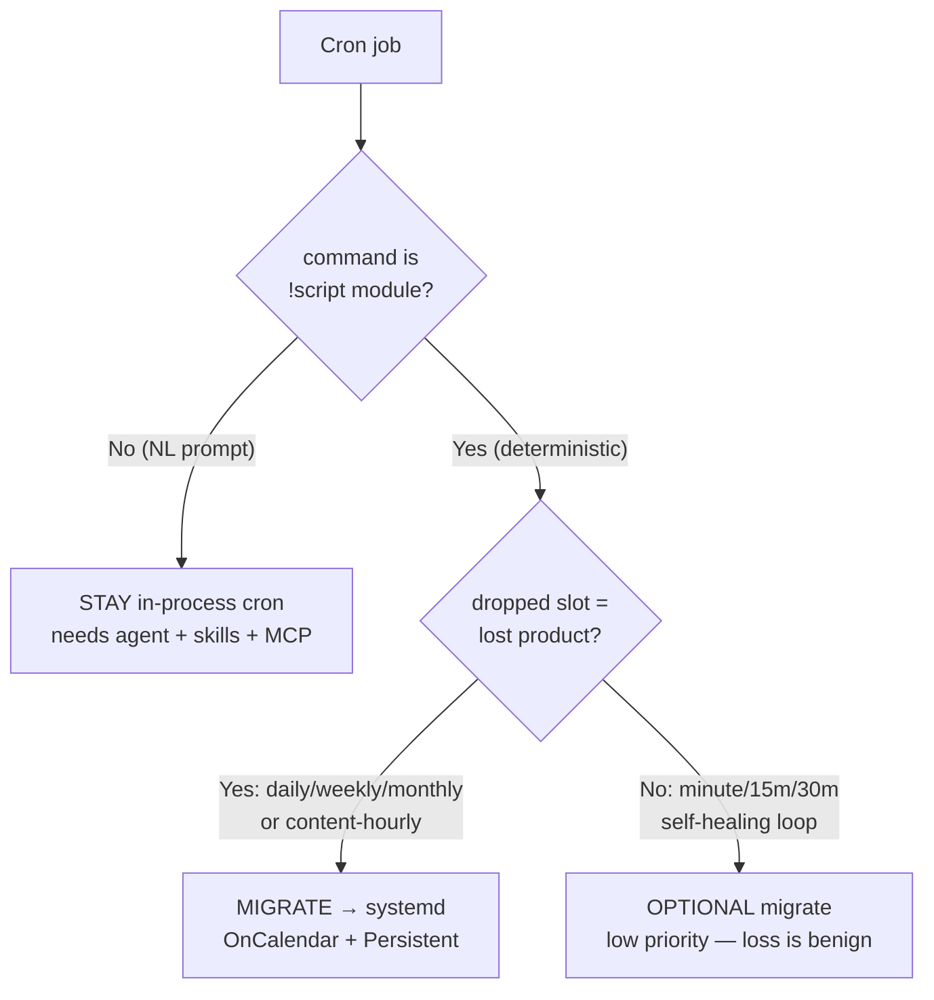
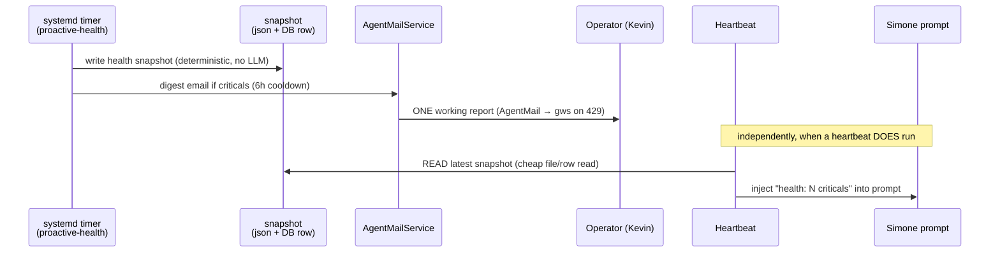
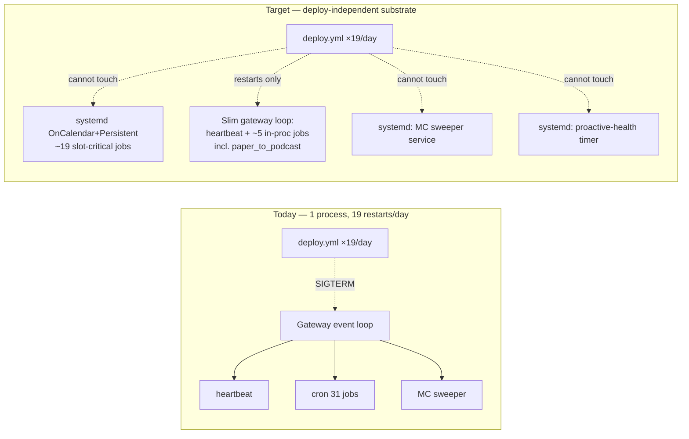

# ADR: Scheduling Substrate Redesign

> **ADR status: PROPOSED — design only, pending operator approval.**
> This document makes **no code, cron, or systemd change**. It is the target
> architecture that the local fixes in sessions S1–S4 migrate *toward*; it
> supersedes none of them. Implementation is a **future wave**, gated on the
> operator decision points in the final section. Grounded against deployed HEAD
> `e05b62fb` (re-verify before implementing — production deploys land ~19×/day).

## 1. Context

Universal Agent's recurring work is driven by **six independent schedulers** with
very different restart-survival properties, and most of them funnel through a
single process — the gateway — that restarts roughly **19 times per day** (one per
`deploy.yml` run; each merge to `main` runs `scripts/deploy/remote_deploy.sh`,
which does `git reset --hard origin/main` then `sudo systemctl restart
universal-agent-gateway …`). The consequences:

1. **In-process cron drops slots.** The gateway cron (`cron_service.py::CronService._scheduler_loop`,
   a fixed 1-second poll) runs with restart-backfill **gated OFF by default**
   (`cron_service.py::CronService.start` only replays the `_backfill_queue` when
   `UA_CRON_BACKFILL_ON_RESTART` is truthy; default `"0"`). A cron slot that lands
   entirely inside a deploy/restart window is therefore **silently dropped** — the
   audit measured **17 %** lost ticks on `simone_chat_auto_complete` and **49 %**
   on `atlas_direct_dispatch`. The flag is OFF *deliberately*: firing every missed
   heavy cron simultaneously at boot starves the asyncio event loop and times out
   the deploy health-check (the 2026-05-16 incident). **"Just turn backfill on" is
   not the fix.**

2. **Health findings reach no one on a skipped heartbeat.** The System-2 health
   invariants and the proactive-health email are coupled to Simone's heartbeat
   tick (`heartbeat_service.py::HeartbeatService._run_heartbeat`), which is itself
   gated behind seven early-returns in `heartbeat_service.py::HeartbeatService._process_session`.
   When the heartbeat short-circuits (lock/cooldown/dormancy/empty-directive), the
   health check never runs that tick — and even when it does, the daemon
   subprocess often resolves `gateway_server.py::_agentmail_service` to `None` and
   skips the email.

3. **Mission Control is a co-tenant, not a consumer.** The Chief-of-Staff sweeper
   (`services/mission_control_intelligence_sweeper.py::run_sweeper_loop`) shares
   the gateway event loop with the cron and heartbeat schedulers. It can starve
   them (its `tick()` queries a ~1.2 GB SQLite store) or be starved by them, and it
   dies on every deploy restart — despite being **purely observational** (it
   creates cards and a readout; it never dispatches work).

This ADR defines a **target substrate** that (a) makes must-fire jobs
deploy-independent, (b) makes health findings reach the operator and Simone
independent of LLM/heartbeat availability, and (c) makes Mission Control a
read-only consumer that can neither starve nor be starved.

### 1.1 The six schedulers today (re-verified live)

| # | Substrate | Driver | Restart-survival | Role |
|---|---|---|---|---|
| A | Asyncio heartbeat | `heartbeat_service.py::HeartbeatService._scheduler_loop` (1–30 s tick, ~11 min real cadence) | **Dies on deploy** (gateway loop) | Simone orchestration + health tick |
| B | In-process cron | `cron_service.py::CronService._scheduler_loop` (1 s poll, 31 jobs) | **Dies on deploy; drops missed slots** | All registered crons |
| C | Mission Control sweeper | `services/mission_control_intelligence_sweeper.py::run_sweeper_loop` (60 s) | **Dies on deploy** (gateway loop) | Observational cards + readout |
| D | systemd timers | 15 UA units under `deployment/systemd/` + CSI | **Deploy-independent** (OS PID-1) | CSI lane + maintenance |
| E | OS crontab (`ua`) | `cron.service` (2 legacy noop jobs) | Deploy-independent | none real (S4 removing) |
| F | GitHub Actions | `deploy.yml` etc. (off-VPS) | Off-process | **Causes** the restarts |

Substrate **D is the dependable model.** But it has its own failure mode (see
§3.1): the dead units (`universal-agent-service-watchdog.timer`,
`universal-agent-oom-alert.timer`, `universal-agent-youtube-playlist-poller.timer`)
all use **monotonic-only** scheduling (`OnBootSec`/`OnUnitActiveSec`, **no**
`OnCalendar`) where `Persistent=true` is a no-op — once the self-chaining
`OnUnitActiveSec` loop breaks there is no wall-clock anchor to re-arm, and
`NextElapse` goes to `infinity`. Every **healthy** UA timer (the 11 `csi-*` units +
`universal-agent-uv-cache-prune.timer`) uses **`OnCalendar` + `Persistent=true`**,
which gives free OS-level catch-up after downtime. **The target substrate is
specifically `OnCalendar` + `Persistent`, never monotonic-only.**

## 2. The five decisions

### Decision 1 — Substrate policy + per-job target table

**Question.** Which jobs must be deploy-independent (→ systemd `OnCalendar`
timers) and which genuinely need live-agent/session/LLM context (→ stay in
`cron_service`)?

**Two-axis criterion (recommended).**

1. **Live-agent axis.** Read the job's `command`:
   - `!script universal_agent.<module>` → **deterministic Python** (runs as a
     `cron_service.py::CronService._run_job` subprocess already, *not* in the
     gateway loop). Eligible for a systemd timer.
   - A natural-language prompt (the agent must load skills/MCP and reason) →
     **must stay in-process**: it needs the Claude runtime, the skill loader, and
     MCP servers that only exist inside the gateway/agent session.
2. **Slot-criticality axis (for eligible jobs).**
   - A **dropped slot loses irreplaceable product** (daily / weekly / monthly
     cadence, or content-bearing hourly) → **migrate first**; `Persistent=true`
     gives OS-level catch-up so a slot inside a deploy window is replayed, not lost.
   - A **dropped slot self-heals on the next tick** (minute / 15-min / 30-min
     control-plane loops) → migration is **optional / low priority**:
     `Persistent` buys nothing for a missed minute, and the loss is benign
     frequency reduction, not lost product.

**Why this is right, not just convenient.** The live-agent axis is observable
in the data — exactly **3 of 31** jobs are NL prompts; the rest are `!script`
modules already running as subprocesses, so moving their *scheduling* off the
gateway changes nothing about how they execute, only that they stop dying with
the gateway. The slot-criticality axis is what makes `Persistent=true` matter:
it is the mechanism that closes the "daily slot lost in a deploy window" gap
(Decision 5) for migrated jobs.

#### Per-job target-substrate table (all 31 live jobs, `cron_jobs.json` @ `e05b62fb`)

Legend — **Substrate**: `systemd` = `OnCalendar`+`Persistent` timer (migrate);
`in-proc` = stay in `cron_service`; `in-proc?` = optional/low-priority migrate;
`drop` = consolidate/remove (see Decision 4 / S4).

| job_id | system_job | sched (CT unless UTC) | kind | cadence | substrate | rationale |
|---|---|---|---|---|---|---|
| e1e094743c | youtube_daily_digest | `0 6` | det | daily | **systemd** | lost slot = no digest that day; YouTube-OAuth secrets via EnvironmentFile |
| 257f8812b4 | youtube_gold_channel_poller | `30 5` | det (`services.*`) | daily | **systemd** | feeds the 06:00 digest; order via timer time, not in-proc coupling |
| f9cf9e5b90 | youtube_oauth_watchdog | `0 7` | det | daily | **systemd** | token-expiry guard must not be a deploy casualty |
| 89d41cc817 | nightly_wiki | `15 3` | det | daily | **systemd** | overnight product; NotebookLM via CLI not agent runtime |
| cc5fde061b | morning_briefing | `30 6` | det | daily | **systemd** | AM product; `briefings_agent` deterministic |
| 42480a1873 | evening_briefing | `0 18` | det | daily | **systemd** | PM product; same module `--mode=evening` |
| 9dea8c1899 | proactive_artifact_digest | `35 8` | det | daily | **systemd** | distinct content (unseen PRs/builds); keep (Decision 4) |
| 3a3693d74e | proactive_report_morning | `5 7` | det | daily | **systemd** | keep as the surviving report (Decision 4) |
| 0c55a85ebf | proactive_report_midday | `5 12` | det | daily | **drop** | consolidate — over-frequent (Decision 4) |
| f143a79e94 | proactive_report_afternoon | `5 16` | det | daily | **systemd / drop** | keep only if operator wants 2× (Decision 4) |
| c6d41e434e | scratch_pruning | `0 7` | det | daily | **systemd** | maintenance; benign but deploy-independent is cleaner |
| 6321bde1a9 | codie_proactive_cleanup | `30 1` | det (enqueue) | daily | **systemd** | the enqueue is deterministic; Cody executes downstream |
| df1def4ad2 | vault_lint_contradictions | `0 7 1 * *` | det | monthly | **systemd** | strongest `Persistent` case — a lost monthly slot = a lost month |
| 73767a8730 | architecture_canvas_drift | `30 6 * * 1` | det | weekly | **systemd** | weekly product |
| c8061c36c9 | insight_scoring_health | `0 8 * * 0` | det | weekly | **systemd** | weekly calibration audit |
| 6d29a53e64 | vp_coder_workspace_pruning | `5 17 * * 0` | det | weekly | **systemd** | weekly maintenance |
| 9ad58b493f | csi_demo_triage_rank | `5 10,15` | det (LLM API) | 2×/day | **systemd** | LLM via API key, not agent runtime; slot-bearing |
| 6f661208f8 | intel_auto_promoter | `35 10,15` | det | 2×/day | **systemd** | promotes triage output; capped/day |
| 013f433539 | hourly_intel_digest | `0 6-21` | det | hourly | **systemd** | content-hourly, ~3 hrs/day lost today; "LLM-independent path" by design |
| csi_convergence_sync | csi_convergence_sync | `0 6-21` | det (LLM) | hourly | **systemd** | content-hourly, ~25 % restart-cancelled today |
| b4caa05aba | cron_artifact_reminders_sweep | `*/30 6-21` | det | 30-min | **in-proc?** | self-healing; migrate only if convenient |
| 95a651abc5 | vp_mission_pr_reconciler | `*/15 6-20` | det | 15-min | **in-proc?** | self-healing reconcile; next sweep covers |
| 2e2e40373e | simone_chat_auto_complete | `*/1` UTC | det | minute | **in-proc?** | 17 % lost but benign; control-plane (operator call) |
| 8d0f1af6ee | atlas_direct_dispatch | `*/1` UTC | det | minute | **in-proc?** | 49 % lost but benign; control-plane dispatch (operator call) |
| 2afe05ab96 | paper_to_podcast_daily | `0 21` | **prompt** | daily | **in-proc** | needs `paper-to-podcast-tf` skill + arXiv MCP + `nlm` CLI; **cannot** be a pure timer → Decision 5 catch-up target |
| 6df69e8e9e | — ("24 Hour Update") | `0 7` | **prompt** | daily | **drop** | overlaps `morning_briefing` (Decision 4) |
| a652c8dce5 | — ("CODIE cleanup #1") | `30 1` | **prompt** | daily | **drop** | exact-slot duplicate of 6321bde1a9 (S4 removing) |
| 5ed062c04d | — (freelance_scout) | `0 8,20` | shell | — | **disabled** | already off; S4 territory |
| claude_code_intel_sync | claude_code_intel_sync | `0 8,16,22` | det | — | **disabled** | off-by-design (X credits); leave |
| a3c4deeb3b | hackernews_snapshot | `0,30 6-21` | det | — | **disabled** | off via PR #734; leave |
| c501cd6a6e | hourly_insight_email | `0 6-21` | det | — | **disabled** | superseded by hourly_intel_digest (S4 removing) |

**Counts:** **19 → systemd** (slot-critical deterministic — counts the
`systemd / drop` hybrid row `proactive_report_afternoon`, which becomes systemd
only if the operator keeps a 2× report cadence in Decision 4, else drops),
4 → **in-proc?** (optional sub-hourly), 1 → **in-proc** (paper_to_podcast prompt),
3 → **drop** (consolidate), 4 → **disabled** (no action). Grand total reconciles
to 31. The in-process *daily* footprint shrinks to **one** job (paper_to_podcast),
which is what makes Decision 5's catch-up structurally bounded.

> Migration caveat (carries into every `systemd` row): a job lifted out of the
> in-process runtime must get its `required_secrets` via an `EnvironmentFile`
> the way healthy `csi-*` units do (the S2 pattern — see §3.1). The secret-bearing
> jobs are the YouTube-OAuth set (e1e094743c, 257f8812b4, f9cf9e5b90), the
> NotebookLM-cookie set (89d41cc817), the `UA_OPS_TOKEN` briefings
> (cc5fde061b, 42480a1873), and the Anthropic-key triage (9ad58b493f).

### Decision 2 — Decouple the Chief-of-Staff / Mission Control sweeper

**Question.** How do we make `run_sweeper_loop` a read-only consumer that can
neither starve nor be starved by the core schedulers, and is not a deploy
casualty?

**Constraint (verified, must preserve).** The sweeper is **observational**: a
grep across `services/mission_control_intelligence_sweeper.py` for
`claim_next` / `dispatch_sweep` / `route_all_to_simone` / `perform_task_action` /
`INSERT INTO task_hub` returned **zero** matches. Its only writes are tile colors
(`mission_control_tile_states`), infrastructure/tier-1 cards (the Mission Control
card store), and the tier-2 readout (`generate_and_store_readout`). It must stay
that way and read **durable DB state**, not in-process gateway memory.

| Option | Effect | Verdict |
|---|---|---|
| (a) **Own long-lived systemd service** (`Type=simple`, runs the loop as its own process, *excluded* from the deploy restart list) | Fully off the gateway loop; deploy-independent; keeps the 60 s cadence + the existing `asyncio.to_thread(sweeper.tick)` offload; one persistent DB connection | **RECOMMENDED** |
| (b) Out-of-loop worker thread in the gateway | Still a deploy casualty; GIL contention with the gateway; doesn't remove the co-tenancy | Rejected |
| (c) systemd `OnCalendar` timer every 60 s | Re-pays process + DB-connection startup every minute; awkward for a continuous loop; tier-1/tier-2 cadence already lives in DB sentinel rows so it *could* work, but churn is wasteful | Acceptable fallback only |

**Recommendation: (a).** A dedicated `universal-agent-mission-control-sweeper.service`
running the existing `run_sweeper_loop` as its own process, removed from the
gateway lifespan. Because it already reads the canonical Task Hub store via the
`durable/db.py::get_activity_db_path` resolver and writes the MC stores (never
gateway in-process memory), the extraction is clean. Isolating it means its
1.2 GB-store `tick()` can never block the heartbeat/cron loop again (the original
`to_thread` mitigation stays), and a gateway deploy no longer kills the readout.

**Relationship to S3.** S3 fixes the tier-2 `state_since`-on-skip bug *inside*
`services/mission_control_intelligence_sweeper.py::_write_tier2_meta` — correct
regardless of where the loop runs. S5 **assumes S3 landed** and simply relocates
the already-fixed loop into its own process. Independent of S1/S2/S4.

### Decision 3 — Deterministic health checks + a delivery contract

**Question.** How do we run the ~19 `proactive_health` invariant probes
independent of Simone's LLM and the heartbeat tick, and guarantee findings reach
(a) Simone's prompt and (b) the operator as **one working report**?

**Grounded current state.** The 8 invariant modules under
`services/invariants/` register 19 probes (`services/invariants/proactive_pipeline_invariants.py`
alone carries 11); `services/proactive_health.py::build_proactive_health_payload`
aggregates them **in-memory** (no DB row, no JSON written by the builder). The
operator email path already exists —
`services/proactive_health_notifier.py::run_pre_flight_check` →
`_notify_critical` → `AgentMailService.send_email(...)` with a 6 h cooldown
(`DEFAULT_COOLDOWN_SECONDS = 21600`, dedup key `proactive_health_critical:<finding_id>`).
**The gap is coupling, not the mailer:** `run_pre_flight_check` is invoked from
`heartbeat_service.py::HeartbeatService._run_heartbeat`, and the seven
`heartbeat_service.py::HeartbeatService._process_session` early-returns
(lock / retry-not-due / not-scheduled / dormancy / no-targets / empty-directive /
require-file) skip `_run_heartbeat` entirely on those ticks. Plus the
daemon-subprocess `agentmail=None` race (S1's target).

**Recommendation.** A deterministic, LLM-free **systemd timer job**
(`universal-agent-proactive-health.{service,timer}`, `OnCalendar` ~every 5–10 min,
`Persistent=true`) that:

1. Calls `services/proactive_health.py::build_proactive_health_payload` and
   writes a **durable health snapshot** — formalize the existing
   `work_products/proactive_health_latest.json` sidecar
   (`services/proactive_health_notifier.py` already writes it) as the canonical
   snapshot, optionally mirrored to a `proactive_health_snapshots` row in
   `activity_state.db`.
2. Emails the operator via the **same** `proactive_health_notifier` path
   (`AgentMailService.send_email`, 6 h cooldown, INCIDENT/ACTION tags) — but now
   constructed as a fresh `AgentMailService(); await startup()` in the timer's own
   subprocess (the S1 pattern), so the `agentmail=None` race is structurally
   gone. **Collapse the current per-finding emails into one digest email per run**
   ("Proactive Health: N criticals"), still cooldown-gated per finding-set.

**Delivery contract (two independent paths, neither blocked by the heartbeat):**

- **(a) Operator** gets the report from the **timer**, not the heartbeat — so a
  skipped/locked/dormant heartbeat can no longer silence it.
- **(b) Simone** learns of findings by **reading the snapshot** the timer wrote
  (a cheap file/row read that survives skip-mode), injected into her prompt on
  any tick that runs. Compute moves out of the heartbeat; only a read remains.

**Relationship to S1.** S1 makes `proactive_health_notifier.py` construct a real
mailer in a subprocess (fixing `agentmail=None`). S5's timer job **runs in a
subprocess and reuses exactly that fix** — S5 **assumes S1 landed**; without it
the timer would hit the same race. Independent of S2/S3/S4.

### Decision 4 — Consolidations (keep / merge / drop)

| Item | Finding | Recommendation |
|---|---|---|
| **Report pipeline** | 3× `proactive_report_*` (07:05/12:05/16:05, all `proactive_report_agent`) + `proactive_artifact_digest` (08:35, `proactive_digest_agent`). All 3 reports were "fires-noop" on email (S1 fixing); midday already missed a full day. Pipeline-stats change slowly; convergence content is *already* delivered hourly by `hourly_intel_digest`. | **Merge 3 → 1** (keep `proactive_report_morning`; drop midday + afternoon), or 3 → 2 (morning + afternoon) if the operator wants a PM read. **Keep `proactive_artifact_digest`** — distinct content (unseen CODIE PRs / tutorial builds). |
| **Two AM products** | `morning_briefing` (06:30, deterministic `briefings_agent`) vs the prompt-based **"24 Hour Update"** (07:00, `6df69e8e9e`, needs a live agent; legacy operator cron, no `system_job`; runs `generate_system_health_report.py` + reads `morning_report_latest.md`). Both are AM digests 30 min apart. | **Drop the "24 Hour Update" prompt; keep deterministic `morning_briefing`,** folding in the 24 h system-health summary. Removes the last in-process daily *prompt* besides paper_to_podcast → shrinks Decision 5's catch-up surface to one job. (It emails the operator directly — confirm no specific reliance.) |
| **One mailer** | `services/agentmail_service.py::AgentMailService` is the one true mailer; `send_email` → `_send_direct` → on HTTP 429 → `_send_via_gmail_cli`. `services/mail_service.py` does **not** exist (the dummy import S1 is removing). **The 429→gws fallback is gated by `UA_AGENTMAIL_GMAIL_FALLBACK`, which defaults OFF.** | **Make `AgentMailService.send_email` the single sanctioned send path** (S1 already moves the report/digest agents + health notifier onto it; the systemd health job uses it too). **Set `UA_AGENTMAIL_GMAIL_FALLBACK=1` durably in the deploy bootstrap** (not a VPS-only `.env` edit — deploy wipes it) so the fallback is actually reachable under AgentMail's tight daily limit. |
| **One canonical DB** | The split-brain is **not** activity-vs-runtime: `durable/db.py::get_activity_db_path` → `AGENT_RUN_WORKSPACES/activity_state.db` (Task Hub) **and** `durable/db.py::get_runtime_db_path` → `AGENT_RUN_WORKSPACES/runtime_state.db` are **both legitimate live DBs** (deliberately separate to avoid write contention). The real split-brain is **5 orphan `task_hub.db` copies** + **stray relative-cwd writers** (repo-root `task_hub.db` and `.agent/task_hub.db` were touched within hours — some subprocess runs with `cwd=repo-root` and falls to a relative default instead of the absolute resolver). | **(1)** Delete the 5 orphan `task_hub.db` copies (S4 handles the static ones). **(2)** Root-cause the stray writers: force every Task-Hub writer through `durable/db.py::get_activity_db_path` (absolute) regardless of cwd. **Keep `runtime_state.db` separate by design** — do **not** merge it into `activity_state.db`. |

### Decision 5 — Backfill + deploy-window-aware scheduling

**Question.** How does a daily slot landing inside a deploy window stop being
silently lost, **without** re-enabling the boot-storm that
`UA_CRON_BACKFILL_ON_RESTART=0` prevents?

**Reconciling with why the flag is OFF.** `UA_CRON_BACKFILL_ON_RESTART` is a
**global, all-or-nothing** switch: when on, `cron_service.py::CronService.start`
fires the *entire* `_backfill_queue` at boot, simultaneously, on the gateway event
loop → starvation → failed health check (2026-05-16). The redesign does **not**
flip it. Instead it removes the *need* for it on two fronts:

1. **Migrated jobs (the slot-critical majority) → OS-level catch-up.** A systemd
   `OnCalendar` + `Persistent=true` unit replays a missed calendar event after
   downtime **natively**, one unit at a time, staggered by per-unit
   `RandomizedDelaySec`. No thundering herd: each timer is an independent OS
   entity, not N coroutines waking on one loop. This is exactly how the healthy
   `csi-*` units already behave through the 19 daily restarts.

2. **The few jobs that stay in-process → bounded, jittered, deploy-window-aware
   catch-up.** After Phase A/D, the in-process *daily* footprint is **one** job
   (paper_to_podcast). For that residue, replace the global flag with a per-job
   mechanism that reuses primitives already in `cron_service.py`:
   - **Gate on a real deploy**, not any restart: only catch up when
     `cron_service.py::_is_deploy_window_active` confirms the marker file
     `/tmp/ua-deployment-window` (stamped by `remote_deploy.sh`) or sub-60 s
     uptime — so a crash-loop never triggers catch-up.
   - **Rate-limit**: run catch-ups through the existing
     `cron_service.py::CronService._run_job` semaphore (`UA_CRON_MAX_CONCURRENCY`,
     default 2), never all at once.
   - **Jitter**: stagger each catch-up by a per-job random delay (the
     `RandomizedDelaySec` idea, in-process), so even several never pile onto one
     tick.
   - **Selective**: only jobs whose dropped slot loses product opt in. Because
     the slot-critical set has migrated to systemd, the opt-in list is ~1 job.

   This extends the mechanism `cron_service.py::CronService._run_job` *already*
   has — it downgrades a deploy-killed run to `cancelled` and advances
   `next_run_at` to `now + _DEPLOY_CANCEL_BACKFILL_OFFSET_SEC` (5 s) so the next
   boot reschedules it — from "a run that started and was killed" to "a slot that
   never started inside the window."

## 3. Migration plan (phased; each phase is its own future PR with rollback)

> Sequencing principle: each phase is independently shippable and reversible, and
> each is gated on its own operator decision. **None of S1–S4 is a hard
> blocker to *authoring* a phase, but the phases assume specific S1–S4 fixes have
> landed (called out below).**

### Phase A — Migrate slot-critical deterministic jobs → systemd timers
- **What moves:** the 19 `systemd`-tagged jobs in the Decision-1 table become
  `.service` + `.timer` pairs (`OnCalendar`, `Persistent=true`, `RandomizedDelaySec`),
  installed by a deploy-wired installer that follows the
  `scripts/install_uv_cache_prune_timer.sh` precedent. The matching rows in
  `cron_jobs.json` are disabled (not deleted) so rollback is a flag flip.
- **Rollback:** disable the timer, re-enable the `cron_jobs.json` row — the cron
  registration code is untouched, so reversal is config-only and instant.
- **S1–S4 relationship:** **assumes S2 landed** — S2 establishes the pattern of
  wiring a timer installer into `scripts/deploy/remote_deploy.sh` (and fixes the
  `EnvironmentFile` secret-loading the migrated secret-bearing jobs depend on).
  Independent of S1/S3/S4. Does **not** re-do S2's watchdog/oom fixes.

### Phase B — Extract the Mission Control sweeper to its own service
- **What moves:** `run_sweeper_loop` leaves the gateway lifespan and becomes
  `universal-agent-mission-control-sweeper.service` (own process, excluded from the
  deploy restart list).
- **Rollback:** re-add the lifespan hook, stop+disable the unit.
- **S1–S4 relationship:** **assumes S3 landed** (the readout-cadence fix travels
  with the code). Independent of S1/S2/S4. Preserves the observational constraint.

### Phase C — Health invariants → systemd timer + delivery contract
- **What moves:** a `universal-agent-proactive-health.{service,timer}` computes the
  payload deterministically, writes the durable snapshot, and emails the operator
  via the S1-fixed mailer (digest, 6 h cooldown). The heartbeat switches from
  **compute** (`run_pre_flight_check` inside `_run_heartbeat`) to **read-snapshot**
  for Simone's prompt.
- **Rollback:** revert the heartbeat to the pre-flight compute call; disable the
  timer. (The endpoint `gateway_server.py::ops_proactive_health` is unchanged
  throughout — it keeps serving live state.)
- **S1–S4 relationship:** **assumes S1 landed** (subprocess mailer fix). Independent
  of S2/S3/S4.

### Phase D — Consolidations
- **What moves:** reports 3 → 1 (or 2); drop the "24 Hour Update" prompt; enforce
  one mailer (set `UA_AGENTMAIL_GMAIL_FALLBACK=1` in the deploy bootstrap);
  one-canonical-DB (delete orphan `task_hub.db` copies + force stray writers onto
  `get_activity_db_path`).
- **Rollback:** re-add the dropped cron rows; revert the bootstrap flag; (DB
  orphan deletes are not reversible but are provably dead — snapshot before
  delete).
- **S1–S4 relationship:** **builds on S1** (mailer) and **S4** — S4 already removed
  `a652c8dce5` / `hourly_insight_email` and the OS-crontab noops; Phase D handles
  the report-pipeline + AM-product consolidation that **S4 explicitly deferred to
  S5**, plus the durable mailer-flag and stray-writer root-cause.

### What this ADR does NOT change (S1–S4 stay as-is)
S5 is the **target architecture**; the S1–S4 local fixes are correct and
complementary independent of it:
- **S1** (real `AgentMailService` in the report/digest agents + the health
  notifier subprocess, report-agent DB repoint to `get_activity_db_path`) — S5
  *depends on* this for Phase C and Decision 4's mailer.
- **S2** (watchdog/oom → `OnCalendar`+`Persistent`, reinstall wired into
  `remote_deploy.sh`, CSI str/Path + env-file fixes) — S5 *generalizes* this
  installer-into-deploy pattern in Phase A.
- **S3** (tier-2 `state_since`-on-skip fix) — S5 *relocates* the fixed sweeper in
  Phase B.
- **S4** (dead-weight removal) — S5's Phase D *continues* the consolidation S4
  deferred.

## 4. Operator decision points (only Kevin can decide)

1. **Substrate policy (Decision 1).** Approve the two-axis rule: deterministic
   `!script` + slot-critical (daily/weekly/monthly + content-hourly) → systemd
   `OnCalendar`+`Persistent`; live-agent prompts + slot-benign sub-hourly loops →
   stay in-process?
2. **Phase-A job set (Decision 1).** Approve migrating the 19 listed jobs to
   systemd timers? Specifically: do the minute-cadence **control-plane** loops
   (`atlas_direct_dispatch`, `simone_chat_auto_complete`) migrate too (making
   dispatch deploy-independent), or stay in-process?
3. **Mission Control extraction (Decision 2).** Approve moving `run_sweeper_loop`
   to its own `universal-agent-mission-control-sweeper.service`, excluded from the
   deploy restart list?
4. **Health timer + delivery contract (Decision 3).** Approve the systemd
   proactive-health timer that computes + emails the operator a digest, with the
   heartbeat reading the snapshot for Simone?
5. **Report pipeline (Decision 4).** 3 reports → **1** (morning only) or **2**
   (morning + afternoon)? Keep `proactive_artifact_digest` (recommended yes)?
6. **AM products (Decision 4).** Drop the prompt-based **"24 Hour Update"** in
   favor of deterministic `morning_briefing` (folding in the 24 h health summary)?
   It currently emails you directly.
7. **One mailer (Decision 4).** Set `UA_AGENTMAIL_GMAIL_FALLBACK=1` durably in the
   deploy bootstrap so the AgentMail-429 → gws fallback is reachable (currently
   default OFF)?
8. **One canonical DB (Decision 4).** Approve deleting the 5 orphan `task_hub.db`
   copies and root-causing the stray relative-cwd writers (force absolute
   `get_activity_db_path`), keeping `runtime_state.db` separate by design?
9. **Implementation wave.** This ADR is design-only. Approve proceeding to an
   implementation wave (Phases A–D, sequenced, each its own PR with rollback and a
   live VPS smoke per the production-verification rules)?

## 5. References

- As-is cron behavior: [`03_agents/04_cron_and_scheduling.md`](../03_agents/04_cron_and_scheduling.md)
- Heartbeat + proactive-health pre-flight: [`03_agents/03_heartbeat_service.md`](../03_agents/03_heartbeat_service.md)
- Deploy pipeline + `remote_deploy.sh`: [`04_deployment_and_cicd.md`](04_deployment_and_cicd.md)
- Mission Control sweeper tiers: [`04_intelligence/11_mission_control_intelligence.md`](../04_intelligence/11_mission_control_intelligence.md)
- DB segregation (activity vs runtime): [`01_architecture/03_database_architecture.md`](../01_architecture/03_database_architecture.md)
- Canonical scheduling map (point-in-time runtime measurement, `e05b62fb`): tailnet scratchpad `ua-scheduling-map`.
