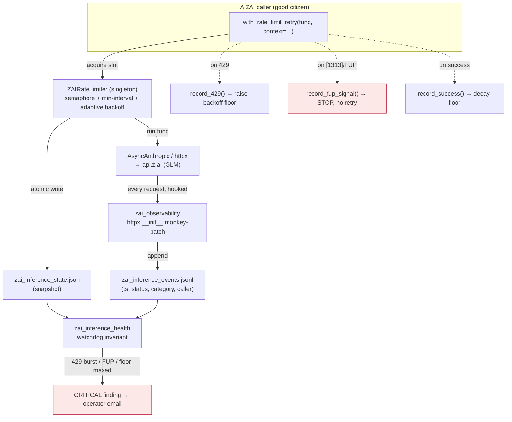

# ZAI Rate Limiter & Inference Governance

> **Read this before you add, move, or "optimise" any ZAI/`api.z.ai` LLM call.**
> This is the canonical source for how Universal Agent governs its ZAI inference
> traffic: the concurrency limiter, the observability hook that watches every
> outbound ZAI request, and the watchdog that pages when the account is being
> throttled. The single most important fact is in [§6](#6-the-load-bearing-truth-the-limiter-is-half-adopted):
> **the limiter only protects the account if every caller uses it, and today most
> do not.**

## 1. What this is, in one paragraph

UA's autonomous principals and intelligence pipelines run their cheap inference on
the **ZAI proxy** (`api.z.ai`, GLM models — see
[`04_intelligence/14_model_tiering_by_process.md`](../04_intelligence/14_model_tiering_by_process.md)).
ZAI enforces an **account-wide** usage limit: too many requests too fast across the
whole account returns `429` — and in its harshest form a **Fair-Usage-Policy (FUP)**
rejection (ZAI error `[1313]`) that means *stop*, not *back off*. To stay under that
ceiling UA has a three-part governance system: (1) **`ZAIRateLimiter`** — a
process-global concurrency gate + adaptive backoff that callers acquire around each
ZAI call; (2) **`zai_observability`** — an httpx monkey-patch that records *every*
outbound ZAI request to a JSONL events log (so even callers that skip the limiter are
seen); and (3) **`zai_inference_health`** — a watchdog invariant that reads the
limiter snapshot + the events log and pages the operator when 429s burst or a FUP
signal appears.

## 2. Why it exists (the problem)

| Failure mode | Symptom | Consequence |
|---|---|---|
| Burst concurrency | Many ZAI calls fire at once (e.g. a 6-wide `asyncio.gather`) | `429 Too Many Requests` — throughput collapses |
| Sustained frequency | Steady high request rate across the whole process | Account-wide `429`; *all* callers throttled, not just the noisy one |
| Fair-Usage-Policy trip | ZAI `[1313]` "request frequency has been limited" | **Ban risk.** Retrying makes it worse. Must stop. |

The defining property: **these limits are account-level, not per-model and not
per-caller.** A well-behaved caller can be `429`'d purely because *other* callers in
the same process saturated the account. That is why governance has to be global, and
why partial adoption ([§6](#6-the-load-bearing-truth-the-limiter-is-half-adopted))
defeats it.

> [VERIFY: the exact server-side meaning of ZAI error `[1313]` is **not documented in
> this repo** — `rate_limiter.py::FUP_KEYWORDS` carries the literal `"1313"` token with
> the comment "Refine after first real FUP response from ZAI." The code *treats* it as
> an account-wide, model-agnostic "stop entirely" condition. Do not assert ZAI's wire
> semantics as fact; treat the model-agnostic framing as UA's working assumption.]

## 3. Architecture — the governance triad



Three modules, three jobs:

| Module | Symbol(s) | Job |
|---|---|---|
| `rate_limiter.py` | `ZAIRateLimiter`, `with_rate_limit_retry` | **Enforce** — concurrency cap, inter-request spacing, adaptive backoff, FUP-aware stop |
| `services/zai_observability.py` | `install_zai_observability`, `_identify_caller`, `_capture` | **Observe** — record every ZAI request (incl. callers that skip the limiter) |
| `services/invariants/zai_inference_health.py` | `zai_inference_health` | **Alert** — read snapshot + events, page on 429 burst / FUP / sustained throttle |

The limiter is a **process-global singleton** (`ZAIRateLimiter.get_instance`). Its
protection scope is exactly one OS process. Daemon subprocesses (heartbeat,
csi-ingester) each get their **own** fresh singleton, which is why state is also
persisted to disk (see [§4.4](#44-state-persistence-why-a-snapshot-file)).

## 4. The limiter implementation (`rate_limiter.py`)

### 4.1 `acquire()` — the gate every good citizen passes through

`ZAIRateLimiter.acquire` is an `@asynccontextmanager` that enforces **two** limits at
once:

1. **Concurrency** — `await self._semaphore.acquire()` (an `asyncio.Semaphore` sized
   to `max_concurrent`). At most N ZAI calls run at once across all callers sharing
   the singleton.
2. **Inter-request spacing** — under `_request_lock`, if less than
   `_min_request_interval` has elapsed since the last request start, it sleeps the
   difference (plus small jitter). This defeats *sliding-window* quotas that a pure
   concurrency cap would not.

The semaphore is released in a `finally`, so a crash inside the `yield` never leaks a
slot.

### 4.2 `with_rate_limit_retry()` — the wrapper callers should use

The ergonomic entry point. `with_rate_limit_retry(func, *args, max_retries=5,
context="...", **kwargs)` loops up to `max_retries` times; each attempt runs inside
`acquire(context)` and dispatches on the outcome:

```text
success            → record_success(); return result
[1313] / FUP match → record_fup_signal(); raise   (STOP — never retry)
"429"/"too many"   → record_429(); sleep get_backoff(attempt); continue
any other error    → raise                          (not a rate-limit problem)
```

`context` is a free-text label (e.g. `"mission_control_chief_of_staff"`) that flows
into logs, the snapshot, and the FUP record — always pass a meaningful one.

### 4.3 Adaptive backoff & FUP — the three `record_*` methods

All three take `_state_lock` and call `_persist_snapshot()`:

- **`record_429(context)`** — if this 429 is within 10s of the previous one it is
  treated as *related*: `_consecutive_429s` increments and the backoff **floor**
  ramps `min(8.0, initial_backoff * 1.5**consecutive)`. Otherwise the streak resets.
- **`record_success()`** — decays the floor back toward `initial_backoff` (`* 0.9`)
  and walks `_consecutive_429s` down. The system self-heals once ZAI recovers.
- **`record_fup_signal(context, snippet)`** — increments `_total_fup_events`, stores
  the snippet/context, logs at ERROR. **This is categorically different from a 429:**
  a 429 is "slow down and retry"; a FUP/`[1313]` is "stop now — retrying raises the
  ban risk." The watchdog escalates it CRITICAL with no grace period.

`get_backoff(attempt)` returns `backoff_floor * 2**attempt` plus 10–50% jitter, capped
at `max_backoff` — exponential per-attempt, on top of the adaptive floor, with jitter
to prevent thundering-herd re-synchronisation.

### 4.4 State persistence (why a snapshot file)

`_persist_snapshot()` does an **atomic** temp-file + `os.replace` write to the path
from `_get_state_path()` (`UA_ZAI_INFERENCE_STATE_PATH`, else
`AGENT_RUN_WORKSPACES/zai_inference_state.json`). Reason: the limiter singleton lives
in memory, but the **watchdog** (and daemon subprocesses) run in *different* processes
with their own fresh singleton. The snapshot is the cross-process source of truth the
watchdog reads. The write is best-effort — a snapshot failure logs a warning and never
crashes the limiter.

### 4.5 Configuration (environment variables)

Defaults below are the **actual code defaults** in `ZAIRateLimiter.__init__`.

| Env var | Code default | Meaning |
|---|---|---|
| `ZAI_MAX_CONCURRENT` | **`2`** | Max parallel ZAI requests through the singleton |
| `ZAI_INITIAL_BACKOFF` | **`1.0`** | Starting backoff floor (seconds) |
| `ZAI_MAX_BACKOFF` | **`30.0`** | Hard cap on any single backoff |
| `ZAI_MIN_INTERVAL` | **`0.5`** | Minimum seconds between request *starts* |
| `UA_ZAI_INFERENCE_STATE_PATH` | (derived) | Override snapshot location |

### 4.6 Loop resilience (multi-loop processes)

asyncio primitives bind — lazily, on first **contended** use (CPython 3.10+
`asyncio.mixins._LoopBoundMixin`; the uncontended fast path never binds) — to one
event loop. The singleton is used from more than one loop in two real patterns:

1. **Sequential loops** — the convergence subprocess (`scripts/csi_convergence_sync.py`)
   drives each LLM call through sync→async bridges that create a **fresh loop per
   call** (`asyncio.run()` in `proactive_convergence.py::_detect_clusters_llm` and
   friends). A primitive bound in one loop raises `RuntimeError: ... is bound to a
   different event loop` when contended from the next.
2. **Concurrent loops** — the gateway can run sync background work on a Starlette
   threadpool thread, which itself calls `asyncio.run()` **while the gateway's main
   loop keeps serving** and using the limiter. Here the old loop is *not* dead, so an
   in-place primitive swap would hand out fresh full-cap semaphores on both sides —
   silently un-enforcing the cap at exactly the worst moment.

The design therefore serves a **per-loop primitives bundle**
(`rate_limiter.py::_LoopPrimitives`, holding the semaphore + min-interval lock) from
`ZAIRateLimiter._get_loop_primitives`: each loop gets its own bundle; closed loops are
pruned on the next bundle creation; `acquire` pairs its `release()` with the bundle it
actually acquired (captured local). Shared adaptive state (floors, streaks, totals)
lives behind a **`threading.Lock`** — its critical sections are fully synchronous, so
it can never loop-bind, and it is correct across threads (an `asyncio.Lock` never
was). Deliberate trade-off: when two loops are genuinely live at once, each enforces
`max_concurrent` independently (process admission ≤ cap × live loops) — that pattern
is a call-site bug, so the limiter counts it (`cross_loop_conflicts` in the snapshot)
and loud-logs `zai_rate_limiter_cross_loop_conflict` so it gets fixed at the source.
Pinned by `tests/unit/test_rate_limiter_loop_resilience.py`; the two-live-loops
regression test there is the **hard gate** for flipping the `_call_llm` routing flag
in production.

## 5. Observability & watchdog

### 5.1 The httpx hook (`zai_observability.py`)

`install_zai_observability()` (called once at runtime bootstrap from
`infisical_loader.py`, after secrets load — the "P7" instrumentation) monkey-patches
`httpx.Client`/`AsyncClient.__init__` so **every** outbound request to `api.z.ai` is
captured — regardless of whether the caller used the limiter. `_capture` writes a JSON
line per request to `AGENT_RUN_WORKSPACES/zai_inference_events.jsonl`:
`{ts, method, url_path, host, status, category, caller, ...}`. `_classify_response`
buckets each into `ok` / `rate_limited_429` / `fup_signal` / etc.

**The caller-attribution gotcha — read this before trusting the events log.**
`_identify_caller()` walks the stack to the *first* frame inside
`/universal_agent/` (skipping SDK/framework frames). Because the shared seam
`llm_classifier.py::_call_llm` is where the `AsyncAnthropic` client physically lives,
**every caller that routes through `_call_llm` is attributed to `llm_classifier.py`**,
not to the real originator (convergence, dispatch routing, calendar, etc.). Modules
that build their *own* client (e.g. `mission_control_chief_of_staff.py`,
`mission_control_tier1.py`, `discord_intelligence/relevance_filter.py`,
`session_dossier.py`) show up as themselves. **Consequence:** the events log can tell
you *how many* ZAI calls happened and *which bucket*, but it **cannot decompose the
`llm_classifier.py` aggregate by flow** — for that you must reason from cron cadence
and per-run loop structure, not from the events file.

### 5.2 The watchdog (`zai_inference_health.py`)

`zai_inference_health` is a pipeline `@invariant` (id `zai_inference_health`) that runs
each heartbeat. It reads the limiter snapshot, tails the events JSONL, and counts UA
Python processes, then emits **one** finding listing every triggered condition:

1. **Sustained 429s** — `consecutive_429s ≥ 3` from the snapshot (in-band callers).
2. **429 burst** — `≥ N` 429s in a rolling 10-min window *from the events log* — this
   is what catches the **direct-httpx bypassers** the snapshot can't see.
3. **FUP signal** in the last 30 min (snapshot or events) → **CRITICAL, no grace.**
4. **Backoff floor pinned at the max cap** → sustained throttle.
5. **UA process count over soft limit** → WARN (self-induced choking).

FUP wins severity if present. This is the alarm behind the
`[ACTION/INCIDENT] [Proactive Health] … zai_inference_health` emails.

## 6. The load-bearing truth: the limiter is *half-adopted*

`with_rate_limit_retry` / `acquire()` only constrain the account if **all** ZAI
callers go through them. They do not. As of `last_verified`, of ~20 distinct
**opus/`glm-5.1`** call sites, **only three** acquire the limiter.

**Goes through the limiter (≈9 sites):**

- `services/mission_control_chief_of_staff.py::synthesize_readout` (opus)
- `tools/corpus_refiner.py` (opus)
- `scripts/youtube_daily_digest.py` — map step (`glm-4.5-air`) **and** reduce/single-call (opus)
- `discord_intelligence/relevance_filter.py` (`glm-4.5-air`)
- `discord_intelligence/triage.py` (`glm-4.5-air`)
- `scripts/cleanup_report.py`, `scripts/parallel_draft.py`, `scripts/generate_outline.py` (opus)

**Bypasses the limiter (the high-frequency hot paths):**

- **The entire `llm_classifier.py::_call_llm` fan-out** (defaults to
  `model_resolution.py::resolve_opus` = `glm-5.1`): `classify_priority`,
  `classify_agent_route`, `generate_calendar_task_description`, `extract_due_at`,
  `extract_disjointed_tasks`, `classify_tutorial_buildability`, plus the convergence
  steps `proactive_convergence.py::_refine_cluster_with_llm` (fired up to 2-wide — lowered
  from 6 on 2026-06-10 — via a *local* `asyncio.Semaphore`, **not** the ZAI limiter; now
  defaults to the sonnet tier `glm-5-turbo`, not opus, per the A/B), the ideation sweep,
  and the signature path. (Only `proactive_convergence.py::triage_candidate` lowers itself,
  to `glm-4.5-air`.)
- Modules with their own un-limited client: `services/csi_url_judge.py`,
  `services/csi_intelligence_pass.py`, `services/csi_demo_triage_ranker.py` (raw httpx,
  literal `glm-4.6`), `services/proactive_work_recap.py`,
  `services/calendar_task_bridge.py`, `services/cron_artifact_notifier.py`,
  `services/proactive_intelligence_report.py`, `services/refinement_agent.py`,
  `services/decomposition_agent.py`, `services/health_evaluator.py`,
  `services/claude_code_intel.py`, `proactive_signals.py`, `wiki/llm.py`,
  `services/mission_control_tier1.py`, `services/mission_control_event_titles.py`,
  `services/session_dossier.py` (local semaphore only), and the URW pipeline
  (`urw/decomposer.py`, `urw/phase_planner.py`, `urw/evaluator.py`).

**Why this matters:** because the limit is account-wide, the unbounded bypassers
saturate the FUP ceiling, and the *good-citizen* callers (e.g. the CoS readout, which
correctly acquires the semaphore) then eat `429`s as **collateral**. A process-global
semaphore that two of ten callers honour provides ~zero FUP protection. **Lowering a
model tier reduces a flow's *pressure*; routing it through the limiter addresses the
*concurrency/frequency* — the two are independent levers and FUP needs the second.**

## 7. How to add a ZAI call correctly (for new code)

1. **Default to the right tier, not the flagship.** `_call_llm`'s default is
   `resolve_opus()` (`glm-5.1`). Classification / extraction / routing / judging
   should pass `model=resolve_haiku()` (`glm-4.5-air`) or `resolve_sonnet()`
   (`glm-5-turbo`). See [`04_intelligence/14_model_tiering_by_process.md`](../04_intelligence/14_model_tiering_by_process.md).
2. **Go through the limiter.** Wrap the actual ZAI call in
   `with_rate_limit_retry(func, context="<your-flow>")`, or `async with
   ZAIRateLimiter.get_instance().acquire("<your-flow>")` if you need finer control.
   Pass a descriptive `context`.
3. **Never retry a FUP.** If you handle errors yourself, treat `_is_fup_error(str(e))`
   as terminal — stop and surface it; do not loop.
4. **Bound your concurrency.** A local `asyncio.gather` of N ZAI calls is N concurrent
   requests against the account *even if* each is wrapped — the singleton semaphore
   (default 2) is the real ceiling; don't assume a local `Semaphore(6)` is safe.
5. **You're already observed.** You do not need to add logging for 429s — the httpx
   hook captures every request. But the hook does **not** throttle; observation is not
   enforcement.

## 8. Worked example — the 2026-06-10 burst

The morning `zai_inference_health` CRITICAL ("ZAI 429 burst — 108 responses in 10 min,
top caller `llm_classifier.py`") is this system working as designed *and* exposing its
gap. The events log attributed the burst to `llm_classifier.py` — but per
[§5.1](#51-the-httpx-hook-zai_observabilitypy) that is the shared-seam aggregate, not
the true originator.

The driver was the **convergence cluster-refine** sweep
(`proactive_convergence.py::_refine_cluster_with_llm`): one **opus** `_call_llm` per
coarse SQL bucket, ~100+ buckets/run, fanned out **6-wide** via a *local*
`asyncio.Semaphore` (not the ZAI limiter), running **every hour**. The evidence:

- A single 18:00 UTC run logged **101 `convergence LLM refine failed` 429 lines** —
  and that counts *only the failures* (successful refines aren't logged).
- **2,139 of 2,591** requests in the `llm_classifier.py` events bucket that day were
  `429`s (~82% rejection).
- The minute-0-of-the-hour spike in the events log lines up with the convergence
  timer's cadence.

> **Epistemics (be honest about this):** cluster-refine being the worst offender is
> **proven at the flow level** (the fan-out, the burst-of-6, the per-run 429 counts).
> Its precise *daily* call total (~1.6k–2.4k) is **inferred, not measured** — the
> seam-attribution collapse ([§5.1](#51-the-httpx-hook-zai_observabilitypy)) makes the
> per-flow split inside the `llm_classifier.py` bucket structurally unmeasurable.

Two `daemon_simone_todo` runs were FUP-killed mid-flight (`[1313]`), which then tripped
the `execution_missing_lifecycle_mutation` guardrail. The fix space is the two
independent levers in [§6](#6-the-load-bearing-truth-the-limiter-is-half-adopted):
**tier** (move the hot judging/classification off `glm-5.1`) **and** **enforcement**
(route `_call_llm` through the limiter, and/or lower `UA_CONVERGENCE_LLM_CONCURRENCY`).

**Resolution (2026-06-10, first pass — the tier lever):** cluster-refine was dropped to
the sonnet tier (`glm-5-turbo`) and its concurrency lowered 6 → 2. An A/B over 30 live
buckets (`scripts/convergence_model_ab.py`, run twice) showed glm-5-turbo matches the
former opus default's precision (both 2/30) at ~35% lower latency, while the cheaper
haiku/`glm-4.7` tiers over-confirm and fail the precision gate. The **enforcement** lever
(routing `_call_llm` through the limiter — which needs the loop-resilient limiter, see
[§4.6](#46-loop-resilience-multi-loop-processes)) remains the durable fix if 429/FUP
pressure persists under the lower-tier + lower-concurrency configuration. The
loop-resilience prerequisite shipped 2026-06-11 (`_ensure_loop_primitives`).

Two things worth knowing before acting on this:

1. **Cluster-refine has a per-stage model knob.** `proactive_convergence.py::_cluster_judge_overrides`
   reads `UA_CONVERGENCE_JUDGE_MODEL` (plus `_BASE_URL` / `_API_KEY`) and passes it to
   `_call_llm` — so lowering its tier is a **config flip**, not a code edit. The knob was
   built explicitly to A/B the opus default against a cheaper tier. (Triage has its own,
   `UA_INTEL_TRIAGE_MODEL`, already defaulted to `glm-4.5-air`.)
2. **There is an A/B backstop.** `scripts/convergence_model_ab.py` sweeps that knob over the
   *same* SQL buckets through the real `_refine_cluster_with_llm`, reporting per-tier
   agreement / thesis quality / latency / 429s — so a tier change is decided on evidence,
   not inference. (The YouTube digest has its own comparator, `scripts/youtube_digest_compare.py`.)
   See [`04_intelligence/14_model_tiering_by_process.md`](../04_intelligence/14_model_tiering_by_process.md).

## 9. Related docs

- [`04_intelligence/14_model_tiering_by_process.md`](../04_intelligence/14_model_tiering_by_process.md)
  — which model each process uses and why (the *pressure* lever).
- [`01_architecture/04_model_choice_and_resolution.md`](../01_architecture/04_model_choice_and_resolution.md)
  — tier resolvers, ZAI tier→model map, ZAI-proxy vs Anthropic-native routing.
- [`02_runtime_bootstrap_and_profiles.md`](02_runtime_bootstrap_and_profiles.md)
  — where `install_zai_observability()` is wired into secret bootstrap.
