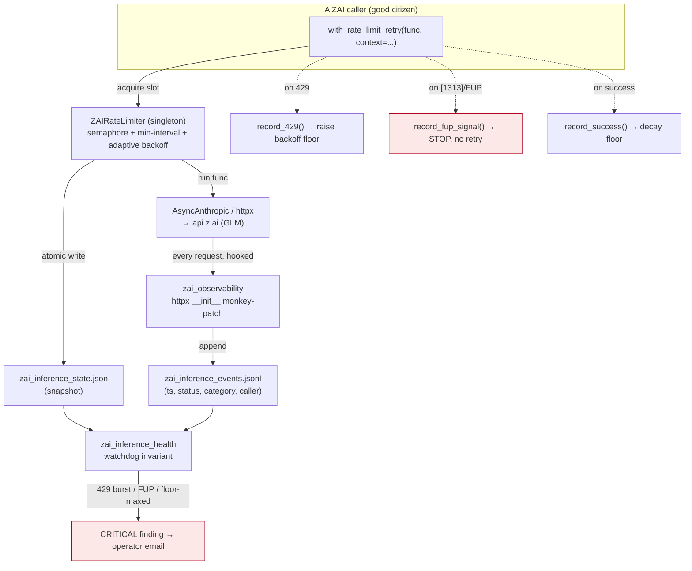

# ZAI Rate Limiter & Inference Governance

> **Read this before you add, move, or "optimise" any ZAI/`api.z.ai` LLM call.**
> This is the canonical source for how Universal Agent governs its ZAI inference
> traffic: the concurrency limiter, the observability hook that watches every
> outbound ZAI request, and the watchdog that pages when the account is being
> throttled. The single most important fact is in [§6](#6-the-load-bearing-truth-the-limiter-is-half-adopted):
> **the limiter only protects the account if every caller uses it, and today most
> do not.**

## 1. What this is, in one paragraph

UA's autonomous principals and intelligence pipelines run their cheap inference on
the **ZAI proxy** (`api.z.ai`, GLM models — see
[`04_intelligence/14_model_tiering_by_process.md`](../04_intelligence/14_model_tiering_by_process.md)).
ZAI enforces an **account-wide** usage limit: too many requests too fast across the
whole account returns `429` — and in its harshest form a **Fair-Usage-Policy (FUP)**
rejection (ZAI error `[1313]`) that means *stop*, not *back off*. To stay under that
ceiling UA has a three-part governance system: (1) **`ZAIRateLimiter`** — a
process-global concurrency gate + adaptive backoff that callers acquire around each
ZAI call; (2) **`zai_observability`** — an httpx monkey-patch that records *every*
outbound ZAI request to a JSONL events log (so even callers that skip the limiter are
seen); and (3) **`zai_inference_health`** — a watchdog invariant that reads the
limiter snapshot + the events log and pages the operator when 429s burst or a FUP
signal appears.

## 2. Why it exists (the problem)

| Failure mode | Symptom | Consequence |
|---|---|---|
| Burst concurrency | Many ZAI calls fire at once (e.g. a 6-wide `asyncio.gather`) | `429 Too Many Requests` — throughput collapses |
| Sustained frequency | Steady high request rate across the whole process | Account-wide `429`; *all* callers throttled, not just the noisy one |
| Fair-Usage-Policy trip | ZAI `[1313]` "request frequency has been limited" | **Ban risk.** Retrying makes it worse. Must stop. |

The defining property: **these limits are account-level, not per-model and not
per-caller.** A well-behaved caller can be `429`'d purely because *other* callers in
the same process saturated the account. That is why governance has to be global, and
why partial adoption ([§6](#6-the-load-bearing-truth-the-limiter-is-half-adopted))
defeats it.

> **Verified wire fact (2026-06-11):** ZAI delivers its **standard throttle** as a
> `429` whose JSON body carries `code: "1313"` plus the full Fair-Usage-Policy text
> ("usage pattern does not comply with the Fair Usage Policy, and your request
> frequency has been limited"). A 12-hour journald sample showed **1058 of 1058**
> logged 429s carrying `1313`. There is **no separate gentle-429 vs harsh-FUP wire
> signal** — so UA treats a 1313-texted 429 as the rate-limit **gradient** (back off,
> retry, shrink concurrency) and reserves cliff handling (`fup_signal` /
> `record_fup_signal`) for FUP-keyword bodies on **non-429** responses (e.g. a
> suspension text on a 403) or gradient *saturation*. The per-model scope of the
> limit remains unproven — the per-tier design is deliberately safe under both
> per-model and account-total interpretations.

## 3. Architecture — the governance triad



Three modules, three jobs:

| Module | Symbol(s) | Job |
|---|---|---|
| `rate_limiter.py` | `ZAIRateLimiter`, `with_rate_limit_retry` | **Enforce** — concurrency cap, inter-request spacing, adaptive backoff, FUP-aware stop |
| `services/zai_observability.py` | `install_zai_observability`, `_identify_caller`, `_capture` | **Observe** — record every ZAI request (incl. callers that skip the limiter) |
| `services/invariants/zai_inference_health.py` | `zai_inference_health` | **Alert** — read snapshot + events, page on 429 burst / FUP / sustained throttle |

The limiter is a **process-global singleton** (`ZAIRateLimiter.get_instance`). Its
protection scope is exactly one OS process. Daemon subprocesses (heartbeat,
csi-ingester) each get their **own** fresh singleton, which is why state is also
persisted to disk (see [§4.4](#44-state-persistence-why-a-snapshot-file)).

## 4. The limiter implementation (`rate_limiter.py`)

### 4.1 `acquire()` — the gate every good citizen passes through

`ZAIRateLimiter.acquire` is an `@asynccontextmanager` that enforces **two** limits at
once:

1. **Concurrency** — `await self._semaphore.acquire()` (an `asyncio.Semaphore` sized
   to `max_concurrent`). At most N ZAI calls run at once across all callers sharing
   the singleton.
2. **Inter-request spacing** — under `_request_lock`, if less than
   `_min_request_interval` has elapsed since the last request start, it sleeps the
   difference (plus small jitter). This defeats *sliding-window* quotas that a pure
   concurrency cap would not.

The semaphore is released in a `finally`, so a crash inside the `yield` never leaks a
slot.

### 4.2 `with_rate_limit_retry()` — the wrapper callers should use

The ergonomic entry point. `with_rate_limit_retry(func, *args, max_retries=None,
context="...", model_tier=None, max_total_seconds=None, **kwargs)` loops up to
`max_retries` times; each attempt runs inside `acquire(context, model_tier=…)` and
dispatches on the outcome. `max_retries=None` (the default) resolves **tier-aware**
via `rate_limiter.py::_resolve_max_retries` — the opus tier uses `ZAI_OPUS_MAX_RETRIES`
if set (fewer doomed retries on the cap-1, FUP-contended tier — each failed retry
itself feeds ZAI's frequency throttle; the failed logical task re-queues), every other
tier uses `ZAI_MAX_RETRIES` (default 5). An explicit int always wins. Outcome dispatch:

```text
success                  → record_success(model_tier); return result
"429"/"too many"         → record_429(model_tier); RELEASE slot;
  (even when FUP-texted)   sleep get_backoff(attempt, model_tier); retry
FUP text on a NON-429    → record_fup_signal(); raise   (CLIFF — never retry)
ZAIFupPauseError         → propagate (account paused; fail fast)
any other error          → raise            (not a rate-limit problem)
```

**Why 429-first dispatch (changed 2026-06-11):** ZAI's *standard* throttle response
is a 429 whose body carries code `1313` + the Fair-Usage text (verified: 1058/1058
journald 429s over 12h). Treating every 1313-texted body as the account cliff would
mean no retry ever happens and the watchdog pages CRITICAL continuously for routine
throttle. So a 429-shaped error is the **gradient** regardless of its text; the
**cliff** (`record_fup_signal`) is FUP text on a non-429 response (suspension etc.)
or gradient *saturation* (see §4.7). Backoff sleeps happen **outside** the acquired
slot, so a cap-1 tier is never monopolized by one failing call's retry saga.
`max_total_seconds` lets budgeted callers (convergence's 600s box) cap the whole
retry saga. Logical outcomes are tracked distinctly from wire 429s:
`total_succeeded_after_retry` vs `total_429s_exhausted` (+`last_exhausted_at`) in
the snapshot — wire counts amplify under retries and no longer mean failure.

`context` is a free-text label (e.g. `"mission_control_chief_of_staff"`) that flows
into logs, the snapshot, and the FUP record — always pass a meaningful one. NOTE:
because the wrapper consumes `max_retries`/`context`/`model_tier`/
`max_total_seconds`, the wrapped func can never receive kwargs by those names.

### 4.3 Adaptive backoff & FUP — the three `record_*` methods

All three take `_state_lock` and call `_persist_snapshot()`:

- **`record_429(context)`** — if this 429 is within 10s of the previous one it is
  treated as *related*: `_consecutive_429s` increments and the backoff **floor**
  ramps `min(max(initial_backoff, 8.0), initial_backoff * 1.5**consecutive)`. The
  ceiling is `max(initial_backoff, 8.0)` so a conservative `ZAI_INITIAL_BACKOFF`
  (now **10s** by default) is never clamped *down* mid-storm — a 1s first backoff
  is a glitchy-retry pattern, not a rate-limiting posture, and the floor only ever
  applies *after* a 429 so a larger value is free on healthy traffic. (For the old
  1.0 default the ceiling is `max(1.0, 8.0)=8.0` — unchanged.) Otherwise the streak resets.
- **`record_success()`** — decays the floor back toward `initial_backoff` (`* 0.9`)
  and walks `_consecutive_429s` down. The system self-heals once ZAI recovers.
- **`record_fup_signal(context, snippet)`** — increments `_total_fup_events`, stores
  the snippet/context, logs at ERROR. **This is categorically different from a 429:**
  a 429 is "slow down and retry"; a FUP/`[1313]` is "stop now — retrying raises the
  ban risk." The watchdog escalates it CRITICAL with no grace period.

`get_backoff(attempt)` returns `backoff_floor * 2**attempt` plus 10–50% jitter, capped
at `max_backoff` — exponential per-attempt, on top of the adaptive floor, with jitter
to prevent thundering-herd re-synchronisation.

### 4.4 State persistence (why a snapshot file)

`_persist_snapshot()` does an **atomic** temp-file + `os.replace` write to the path
from `_get_state_path()` (`UA_ZAI_INFERENCE_STATE_PATH`, else
`AGENT_RUN_WORKSPACES/zai_inference_state.json`). Reason: the limiter singleton lives
in memory, but the **watchdog** (and daemon subprocesses) run in *different* processes
with their own fresh singleton. The snapshot is the cross-process source of truth the
watchdog reads. The write is best-effort — a snapshot failure logs a warning and never
crashes the limiter.

### 4.5 Configuration (environment variables)

Defaults below are the **actual code defaults** in `ZAIRateLimiter.__init__`.

| Env var | Code default | Meaning |
|---|---|---|
| `ZAI_MAX_CONCURRENT` | **`2`** | Max parallel ZAI requests through the legacy (tierless) gate |
| `ZAI_INITIAL_BACKOFF` | **`10.0`** | Starting backoff floor (seconds) — conservative-by-default; only fires after a 429 |
| `ZAI_MAX_BACKOFF` | **`30.0`** | Hard cap on any single backoff |
| `ZAI_MIN_INTERVAL` | **`0.5`** | Minimum seconds between request *starts* (global, all tiers) |
| `ZAI_MAX_RETRIES` | **`5`** | Default retry attempts per logical call (non-opus tiers) |
| `ZAI_OPUS_MAX_RETRIES` | prod **`3`** | Opus-tier retry budget — fewer doomed retries on the cap-1, FUP-contended tier (each failed retry feeds the frequency throttle; the failed task re-queues). Unset → `ZAI_MAX_RETRIES`. |
| `ZAI_OPUS_MIN_INTERVAL` | code **`0.0`** / prod **`8`** | Post-response gap (s) between consecutive **opus** calls — paces the cap-1 opus burst (e.g. convergence ideation synthesis) so it can't trip the account-level frequency throttle. "call → response → delay → next", held under the opus gate so it never blocks haiku/sonnet. Default off; enabled via Infisical. |
| `UA_ZAI_INFERENCE_STATE_PATH` | (derived) | Override snapshot location |
| `ZAI_TIER_CAP_{OPUS,SONNET,MID,HAIKU}` | **`1/2/3/4`** | Per-tier AIMD seed caps (§4.7) |
| `ZAI_TIER_CAP_MIN_*` / `ZAI_TIER_CAP_MAX_*` | **`1` / `3,5,5,6`** | Per-tier AIMD bounds |
| `ZAI_TIER_INCREASE_STREAK` | **`20`** | Clean successes required before a +1 |
| `ZAI_TIER_INCREASE_QUIET_SECONDS` | **`60`** | Min quiet time since the tier's last 429 |
| `ZAI_TIER_INCREASE_COOLDOWN_SECONDS` | **`120`** | Min spacing between increases |
| `ZAI_TIER_SATURATION_429S` | **`6`** | Consecutive 429s at min cap ⇒ cliff escalation |
| `ZAI_FUP_FREEZE_SECONDS` | **`1800`** | Cliff: additive-increase freeze |
| `ZAI_FUP_ACQUIRE_PAUSE_SECONDS` | **`180`** | Cliff: fail-fast acquire pause |

### 4.6 Loop resilience (multi-loop processes)

asyncio primitives bind — lazily, on first **contended** use (CPython 3.10+
`asyncio.mixins._LoopBoundMixin`; the uncontended fast path never binds) — to one
event loop. The singleton is used from more than one loop in two real patterns:

1. **Sequential loops** — the convergence subprocess (`scripts/csi_convergence_sync.py`)
   drives each LLM call through sync→async bridges that create a **fresh loop per
   call** (`asyncio.run()` in `proactive_convergence.py::_detect_clusters_llm` and
   friends). A primitive bound in one loop raises `RuntimeError: ... is bound to a
   different event loop` when contended from the next.
2. **Concurrent loops** — the gateway can run sync background work on a Starlette
   threadpool thread, which itself calls `asyncio.run()` **while the gateway's main
   loop keeps serving** and using the limiter. Here the old loop is *not* dead, so an
   in-place primitive swap would hand out fresh full-cap semaphores on both sides —
   silently un-enforcing the cap at exactly the worst moment.

The design therefore serves a **per-loop primitives bundle**
(`rate_limiter.py::_LoopPrimitives`, holding the semaphore + min-interval lock) from
`ZAIRateLimiter._get_loop_primitives`: each loop gets its own bundle; closed loops are
pruned on the next bundle creation; `acquire` pairs its `release()` with the bundle it
actually acquired (captured local). Shared adaptive state (floors, streaks, totals)
lives behind a **`threading.Lock`** — its critical sections are fully synchronous, so
it can never loop-bind, and it is correct across threads (an `asyncio.Lock` never
was). Deliberate trade-off: when two loops are genuinely live at once, each enforces
`max_concurrent` independently (process admission ≤ cap × live loops) — that pattern
is a call-site bug, so the limiter counts it (`cross_loop_conflicts` in the snapshot)
and loud-logs `zai_rate_limiter_cross_loop_conflict` so it gets fixed at the source.
Pinned by `tests/unit/test_rate_limiter_loop_resilience.py`; the two-live-loops
regression test there is the **hard gate** for flipping the `_call_llm` routing flag
in production.

### 4.7 Per-tier AIMD concurrency controller

On top of the legacy global semaphore, the limiter runs one **dynamic concurrency
cap per model tier** — `rate_limiter.py::TIERS` = `opus / sonnet / mid / haiku`
(callers map a wire model id to its tier with
`utils/model_resolution.py::model_id_to_tier` and pass `model_tier=` through
`with_rate_limit_retry`/`acquire`). Tiers run **additively** (throughput = the sum
of the caps), so the flagship never runs many-wide while cheap tiers keep moving.
Admission goes through `rate_limiter.py::_AdaptiveGate` — a counting gate whose
capacity is read live on every decision (`holders < cap`), so cap changes are plain
int writes with **no debt bookkeeping** (an earlier debt-counter design could
deadlock a tier when a decrease landed before its semaphore lazily existed — pinned
by `tests/unit/test_rate_limiter_aimd.py`). Gates live in the per-loop bundle
(§4.6); callers without a `model_tier` keep the legacy global semaphore unchanged.

The cap moves AIMD-style (TCP congestion control over an unknown, time-varying
limit — seed low, discover headroom from success, never probe for the cliff):

| Signal | Transition | Where |
|---|---|---|
| 429 (gradient) | **Halve** the tier cap — at most once per *congestion event* (only if the tier has succeeded since its last decrease; a wall-clock cooldown would serially halve through one retry saga's spread-out 429s) + per-tier backoff-floor ramp | `record_429(context, model_tier=…)` |
| Sustained clean streak | **+1** cap, gated by streak ≥ `ZAI_TIER_INCREASE_STREAK`, quiet ≥ `ZAI_TIER_INCREASE_QUIET_SECONDS` since the last 429, cooldown ≥ `ZAI_TIER_INCREASE_COOLDOWN_SECONDS` since the last increase, no FUP freeze, below the tier max | `record_success(model_tier=…)` |
| Cliff (non-429 FUP, or saturation) | **All** tiers slam to min; additive increases freeze for `ZAI_FUP_FREEZE_SECONDS`; new acquires **fail fast** (`ZAIFupPauseError`) for `ZAI_FUP_ACQUIRE_PAUSE_SECONDS` | `record_fup_signal` |
| Saturation | 429s persisting at MINIMUM cap (`ZAI_TIER_SATURATION_429S` consecutive) escalate to the cliff — the gradient bottomed out and ZAI is still rejecting | `record_429` → `record_fup_signal` |

Seeds/bounds (env-overridable per tier via `ZAI_TIER_CAP_<TIER>` /
`ZAI_TIER_CAP_MIN_<TIER>` / `ZAI_TIER_CAP_MAX_<TIER>`; code defaults are the
durable config since the VPS `.env` is wiped on deploy):

| tier | start | min | max |
|---|---|---|---|
| opus | 1 | 1 | 3 |
| sonnet | 2 | 1 | 5 |
| mid | 3 | 1 | 5 |
| haiku | 4 | 1 | 6 |

**Verifying the controller in production:** every cap change emits a
`zai_tier_cap_change tier=… old=… new=… reason=429_halve|clean_increase|fup_slam
pid=…` log line — **journald is the primary verification channel.** The snapshot's
`tiers` blob is a quick glance only: it is single-file, last-writer-wins across UA
processes (each process has its own singleton; the hourly convergence subprocess
restarts at seed caps), so it carries `pid`/`process_name`/`singleton_created_at`
for attribution — and the cross-process **timestamp** fields (`last_429_at`,
`last_exhausted_at`, `acquire_pause_until`, `freeze_until`, …) are
**merged-on-write** (`_persist_snapshot` keeps the max of the on-disk and own
value) so one process's success writes can't erase another's outcome alarms.
Expect the increase side to be ~inert outside the long-lived gateway:
short-lived subprocesses discard learned caps — deployed behavior is
approximately *static seeds + fast fall + cliff stop*, which is acceptable policy
(the seeds are workable; the controller's job is protection first).

Accepted limitations (reviewed and deliberate):

- **Saturation needs an exhaustion outcome.** The cliff escalation requires
  recent retry exhaustion (`ZAI_TIER_SATURATION_EXHAUSTION_WINDOW_SECONDS`,
  default 120s) in addition to min-cap consecutive 429s — raw wire-429 streaks
  alone are reachable in seconds by overlapping retry sagas that all still
  succeed.
- **The acquire-pause is per-process** (in-memory; the snapshot merge makes it
  *visible* cross-process, but only the recording process enforces it).
- **Legacy `acquire()` users see `ZAIFupPauseError` as a hard error** during a
  pause. `mission_control_chief_of_staff.py::synthesize_readout` catches it and
  returns its fallback readout (and reports `note_retry_exhausted` when its
  retries burn out on 429s); the report scripts (`corpus_refiner`,
  `youtube_daily_digest`, `cleanup_report`, `parallel_draft`,
  `generate_outline`) fail their current item/run and are rerunnable — accepted.
- **`_AdaptiveGate` cap increases take effect on the next release/acquire**
  (no cross-loop waiter notification — futures may only be touched from their
  own loop; an increase follows a success, which releases a slot microseconds
  later).
- **Bypasser-demotion window:** while the flag is on and any in-band 429 is
  recent, a concurrent *bypasser* burst demotes to the managed WARN — the
  forensics (per-model breakdown) stay in the finding's `observed_value`.
- **Routed calls drop the SDK's internal retry entirely** (`max_retries=0`),
  including its single connection-error retry — transient transport errors
  surface to callers (which fail closed per item).
- **Flag flips require a service restart** to be seen by long-lived processes
  (env is read at call time but injected at process start via
  `initialize_runtime_secrets`); the hourly convergence subprocess picks a flip
  up on its next run.

## 5. Observability & watchdog

### 5.1 The httpx hook (`zai_observability.py`)

`install_zai_observability()` (called once at runtime bootstrap from
`infisical_loader.py`, after secrets load — the "P7" instrumentation) monkey-patches
`httpx.Client`/`AsyncClient.__init__` so **every** outbound request to `api.z.ai` is
captured — regardless of whether the caller used the limiter. `_capture` writes a JSON
line per request to `AGENT_RUN_WORKSPACES/zai_inference_events.jsonl`:
`{ts, method, url_path, host, status, model, category, fup_texted, caller, caller_fn,
input_tokens, output_tokens, cache_creation_input_tokens, cache_read_input_tokens, ...}`.
`_classify_response` buckets each into `ok` / `rate_limited_429` / `fup_signal` / etc.

Four load-bearing details of the capture path (1–3 added 2026-06-11; 4 added 2026-06-13):

1. **Non-streaming bodies are force-read in the hook.** At response-hook time with a real
   transport the body is not yet read, so `response.text` raises
   `httpx.ResponseNotRead` — which was silently swallowed, leaving `body_snippet`
   empty on *every* production event and blinding FUP detection entirely (12,559
   events, zero `fup_signal`, while journald showed 1313 text on every 429). The
   hooks call `response.read()` / `await response.aread()` before `_capture`
   (`zai_observability.py::_on_response_sync` / `_on_response_async`). As of
   2026-06-13 this read covers **all non-streaming responses, not just `status >= 400`**
   — so the success-body `usage` block can be parsed for per-call token counts
   (detail 4). httpx caches read content, so the SDK consumer reads the same buffer
   unaffected. **Streaming bodies (`content-type: text/event-stream`) are NEVER
   force-read** (`zai_observability.py::_is_streaming_response`) — that would consume
   the stream out from under the consumer. No ZAI call streams today (verified
   2026-06-13), so this is future-proofing.
2. **`model` field.** `_capture` parses the request's JSON body
   (`zai_observability.py::_model_from_request`, fail-soft to `"unknown"`) so events
   can be bucketed per model/tier — the per-tier 429 signal the AIMD limiter work
   and `convergence_change_monitor.py` consume.
3. **`category` vs `fup_texted`.** Per the verified wire fact in §2, a 1313-texted
   429 classifies as `rate_limited_429` (gradient); `fup_signal` is reserved for
   FUP-keyword bodies on non-429 responses (the cliff). The boolean `fup_texted`
   field marks any FUP-keyword body regardless of status, preserving throttle-text
   visibility without conflating it with the cliff category.
4. **Per-call token usage (2026-06-13).** `_capture` parses the response body's
   `usage` block (`zai_observability.py::_usage_from_response`, fail-soft to zeros)
   into `input_tokens` / `output_tokens` / `cache_creation_input_tokens` /
   `cache_read_input_tokens`, handling both the Anthropic-compatible
   (`input_tokens`/`output_tokens`) and OpenAI-compatible
   (`prompt_tokens`/`completion_tokens`) shapes. The `model` still comes from the
   *request* body (detail 2); only token counts come from the response, and only
   for non-streaming `status < 400` responses. This is what lets the dashboard
   answer *which process burns the most ZAI tokens*, not just which 429s most.

**Caller attribution — names the real consumer, not the plumbing.**
`_identify_caller()` walks the stack to the first frame inside `/universal_agent/`,
skipping SDK/framework frames (`_SKIP_FRAME_FRAGMENTS`) **and the two wrapper frames
by function name** (`_SKIP_FRAME_FUNCS` = `with_rate_limit_retry`, `_call_llm`). This
matters because `_call_llm` (the `llm_classifier` seam) passes the raw
`client.messages.create` SDK method into `with_rate_limit_retry`, so the SDK frame is
skipped and — without the function-name skip — the walk would stop on the limiter/seam
wrapper, collapsing every limiter-routed call to `rate_limiter.py` (or `llm_classifier.py`).
Skipping the wrappers by NAME (not whole file) lets the walk land on the **true
originator** — `proactive_convergence.py`, `mission_control_chief_of_staff.py`, the
specific `classify_*` in `llm_classifier.py`, `wiki/llm.py`, etc. — while still crediting
a real `classify_*` consumer that lives in the seam file. The "Top 429 callers" panel
therefore names the actual culprit. (Historical note: before this fix and before the
limiter flag, calls attributed to `rate_limiter.py` / a flat `llm_classifier.py`
aggregate; the events log now decomposes by real flow.)

**Stage granularity (`caller_fn`, 2026-06-13).** Alongside the file-level `caller`,
`_capture` records `caller_fn` = `file::function` (the resolved caller frame plus its
function name — both derived from one stack walk via
`zai_observability.py::_resolve_caller_frame`, so they can never disagree;
`_identify_caller`'s file-only contract is unchanged). This lets token spend be
attributed to a *stage within* a process — e.g. distinguishing
`proactive_convergence.py::_detect_clusters_llm_async` (the sonnet cluster judge) from
the convergence brief-writer — which the file-level key alone cannot.

### 5.3 Per-process token aggregation (`zai_status.analyze_token_usage`)

`zai_status.py::analyze_token_usage(now, window_seconds, top_n)` is a read-only,
**pure-Python (no LLM)** single pass over the events JSONL that groups token spend by
`caller` (with per-`caller_fn` stage and per-tier sub-breakdowns) over an arbitrary
window — up to ~6 days, the JSONL retention, with no durable store. Per process it
sums input/output tokens and computes the churn signals the ZAI-Control token panel
surfaces: `reject_pct`, `retry_input_tokens` (input tokens on 429'd attempts — the
wasted full-prompt re-sends), `retry_multiplier` (≈ total-input ÷ first-attempt input),
and `dormant_tokens` (spend in the 22:00–06:00 America/Chicago dormancy window). Events
predating the token-capture upgrade read as zero tokens, so an older window degrades
gracefully to a request-count proxy (`token_events_seen` distinguishes "no data yet"
from "genuinely 0"). The CLI `scripts/zai_token_report.py` (`python -m
universal_agent.scripts.zai_token_report --hours 24`) renders the same aggregation as a
terminal table — the operator's on-demand "where did our tokens go" snapshot.

### 5.4 Stage catalog + the token panel (zero-runtime-LLM explanations)

The token panel attributes spend to a `caller_fn` stage, but a name like
`_detect_clusters_llm_async` doesn't tell the operator *what the stage does* or
*whether its model tier is justified*. Rather than have the running product call an LLM
to explain each stage (a recurring inference tax we explicitly avoid), the explanations
are **pre-built once** (in an interactive Claude session that reads the code) and stored
as a committed JSON lookup — `services/zai_function_catalog.json` — that the product
reads with a pure-Python dict lookup. `services/zai_function_catalog.py` provides
`load_catalog` / `lookup` (exact `file::function` then file-level fallback) /
`function_source_hash` (AST-extracts a described function's source and hashes it) /
`annotate_stale` (flags entries whose stored `source_sha` no longer matches the current
source — i.e. the function was refactored and its description may have rotted) /
`coverage` (real `file.py::function` stages with no entry — the "N stages undescribed"
signal driving an occasional re-population pass; `_is_describable_stage` excludes legacy
file-level events and `<string>` exec frames so the count isn't inflated by un-catalogable
noise). Each entry carries a `role`, the `tier_current`, and a
`tier_verdict` (`appropriate` | `review`) — the trade-off assessment baked into the
reference, so the panel can flag tier-misallocation candidates (e.g. an `opus`
extraction/evaluation stage that a cheaper tier would serve). Regenerate the JSON after
editing descriptions so `source_sha` stays current (guarded by
`test_zai_function_catalog.py::test_committed_catalog_not_stale`).

`zai_status.py::build_token_usage` joins the catalog onto the aggregation, and the
gateway serves it at **`GET /api/v1/ops/zai/token-usage?hours=N`** (`gateway_server.py::
ops_zai_token_usage`, `asyncio.to_thread`-offloaded, on-demand — NOT the 5s status
poll). The dashboard renders a sixth section on the ZAI-Control tab
(`web-ui/app/dashboard/zai-control/page.tsx::TokenPanel`): a window selector
(1h/6h/24h/3d/6d), a **Refresh** button (no live polling — operator-driven), and a
per-process table (calls, reject %, in/out/total tokens, retry-multiplier, dormancy
spend) whose rows expand to the per-stage breakdown with each stage's catalog
description, role, tier, and `review`/`stale`/`undescribed` badges.

### 5.2 The watchdog (`zai_inference_health.py`)

`zai_inference_health` is a pipeline `@invariant` (id `zai_inference_health`) that runs
each heartbeat. It reads the limiter snapshot, tails the events JSONL, and counts UA
Python processes, then emits **one** finding listing every triggered condition:

1. **Sustained 429s** — `consecutive_429s ≥ 3` from the snapshot (in-band callers).
2. **429 burst** — `≥ N` 429s in a rolling 10-min window *from the events log* — this
   is what catches the **direct-httpx bypassers** the snapshot can't see.
3. **FUP signal** in the last 30 min (snapshot or events) → **CRITICAL, no grace.**
4. **Backoff floor pinned at the max cap** → sustained throttle.
5. **UA process count over soft limit** → WARN (self-induced choking).
6. **FUP acquire-pause active** (`acquire_pause_until` in the future) → **CRITICAL** —
   the limiter hit the cliff and is failing acquires fast (§4.7).
7. **Retries exhausted recently** (`last_exhausted_at` in the last 30 min) →
   **CRITICAL** — logical calls are failing despite limiter-managed retries.
8. **Cross-loop conflicts** (`cross_loop_conflicts > 0`) → WARN — two live loops used
   the limiter concurrently; fix the call-site pattern (§4.6).

**Managed-throttle demotion (active only while `UA_LLM_CLASSIFIER_LIMITER_ENABLED`
is on):** with the hot seam routed through the limiter, conditions 1/2/4 are *normal
managed states* during a burst — wire 429 counts amplify under retries while logical
work succeeds. They demote to WARN (`*_managed` condition names) whenever the
snapshot shows recent in-band 429 recording with **no** recent exhaustion and **no**
pause; the CRITICAL alarms are then the *outcomes* (conditions 3/6/7) plus any burst
with NO recent snapshot activity (= a bypasser, the original 2026-05-21 gap). Flag
off ⇒ alarm behavior identical to the pre-AIMD watchdog — legacy direct-record
callers never increment the exhaustion counters, so the demotion would mask genuine
sustained throttle for them.

FUP/pause/exhaustion win severity if present. This is the alarm behind the
`[ACTION/INCIDENT] [Proactive Health] … zai_inference_health` emails.

## 6. Adoption status: the seam is now routable (flag-gated)

`with_rate_limit_retry` / `acquire()` only constrain the account if **all** ZAI
callers go through them. As of 2026-06-11 the biggest gap is closed *behind a
flag*: `llm_classifier.py::_call_llm` — the shared seam carrying ~89% of all
429s — routes through `with_rate_limit_retry` with the per-tier AIMD limiter
(§4.7) when **`UA_LLM_CLASSIFIER_LIMITER_ENABLED`** is on (default OFF; parse
via `feature_flags.py::_is_truthy`). The wrap engages **only when the
effective base URL targets a ZAI host** (`llm_classifier.py::_targets_zai`,
mirroring `zai_observability.ZAI_HOSTS`) — the per-stage `base_url` override
to real Anthropic keeps the direct path, since its 429s are unrelated to the
ZAI account. On the routed path the SDK client is built with `max_retries=0`
(retry policy lives in ONE layer; same pairing as
`mission_control_chief_of_staff.py`), and each logical call's retry saga is
budget-boxed (`UA_LLM_CLASSIFIER_LIMITER_BUDGET_SECONDS`, default 300).

The pre-flag state, kept for context — of ~20 distinct **opus/`glm-5.1`** call
sites, **only three** acquired the limiter:

**Goes through the limiter (≈9 sites):**

- `services/mission_control_chief_of_staff.py::synthesize_readout` (opus)
- `tools/corpus_refiner.py` (opus)
- `scripts/youtube_daily_digest.py` — map step (`glm-4.5-air`) **and** reduce/single-call (opus)
- `discord_intelligence/relevance_filter.py` (`glm-4.5-air`)
- `discord_intelligence/triage.py` (`glm-4.5-air`)
- `scripts/cleanup_report.py`, `scripts/parallel_draft.py`, `scripts/generate_outline.py` (opus)

**Bypasses the limiter (the high-frequency hot paths):**

- **The entire `llm_classifier.py::_call_llm` fan-out** (defaults to
  `model_resolution.py::resolve_opus` = `glm-5.1`): `classify_priority`,
  `classify_agent_route`, `generate_calendar_task_description`, `extract_due_at`,
  `extract_disjointed_tasks`, `classify_tutorial_buildability`, plus the convergence
  steps `proactive_convergence.py::_refine_cluster_with_llm` (sequential / 1-wide — lowered
  6 → 2 → 1 (2026-06-13, storm-avoidance) — via a *local* `asyncio.Semaphore`, **not** the ZAI limiter; now
  defaults to the sonnet tier `glm-5-turbo`, not opus, per the A/B), the ideation sweep,
  and the signature path. (Only `proactive_convergence.py::triage_candidate` lowers itself,
  to `glm-4.5-air`.)
- Modules with their own un-limited client: `services/csi_url_judge.py`,
  `services/csi_intelligence_pass.py`, `services/csi_demo_triage_ranker.py` (raw httpx,
  literal `glm-4.6`), `services/proactive_work_recap.py`,
  `services/calendar_task_bridge.py`, `services/cron_artifact_notifier.py`,
  `services/proactive_intelligence_report.py`, `services/refinement_agent.py`,
  `services/decomposition_agent.py`, `services/health_evaluator.py`,
  `services/claude_code_intel.py`, `proactive_signals.py`, `wiki/llm.py`,
  `services/mission_control_tier1.py`, `services/mission_control_event_titles.py`,
  `services/session_dossier.py` (local semaphore only), and the URW pipeline
  (`urw/decomposer.py`, `urw/phase_planner.py`, `urw/evaluator.py`).

**Why this matters:** because the limit is account-wide, the unbounded bypassers
saturate the FUP ceiling, and the *good-citizen* callers (e.g. the CoS readout, which
correctly acquires the semaphore) then eat `429`s as **collateral**. A process-global
semaphore that two of ten callers honour provides ~zero FUP protection. **Lowering a
model tier reduces a flow's *pressure*; routing it through the limiter addresses the
*concurrency/frequency* — the two are independent levers and FUP needs the second.**

## 7. How to add a ZAI call correctly (for new code)

1. **Default to the right tier, not the flagship.** `_call_llm`'s default is
   `resolve_opus()` (`glm-5.1`). Classification / extraction / routing / judging
   should pass `model=resolve_haiku()` (`glm-4.5-air`) or `resolve_sonnet()`
   (`glm-5-turbo`). See [`04_intelligence/14_model_tiering_by_process.md`](../04_intelligence/14_model_tiering_by_process.md).
2. **Go through the limiter.** Wrap the actual ZAI call in
   `with_rate_limit_retry(func, context="<your-flow>")`, or `async with
   ZAIRateLimiter.get_instance().acquire("<your-flow>")` if you need finer control.
   Pass a descriptive `context`.
3. **Never retry a FUP.** If you handle errors yourself, treat `_is_fup_error(str(e))`
   as terminal — stop and surface it; do not loop.
4. **Bound your concurrency.** A local `asyncio.gather` of N ZAI calls is N concurrent
   requests against the account *even if* each is wrapped — the singleton semaphore
   (default 2) is the real ceiling; don't assume a local `Semaphore(6)` is safe.
5. **You're already observed.** You do not need to add logging for 429s — the httpx
   hook captures every request. But the hook does **not** throttle; observation is not
   enforcement.
6. **If you're judging/classifying/extracting N independent items in a loop, BATCH.**
   Fewer *calls* is the actual Fair-Usage lever (rejection is concurrency/frequency-
   driven, not token-driven). Replace a `for item in items:` LLM fan-out with one
   structured-output call per chunk of ~20 items returning a verdict array keyed by
   index. Use the shared helper rather than re-deriving the mechanics (see §7.1).

### 7.1 The `batched_judge` helper (`services/batched_judge.py`)

`batched_judge(items, *, build_prompt, parse, fail_closed, ...)` owns the *mechanics*
of the batching pattern proven in PR #989 (the convergence cluster judge): chunking at
`batch_size` (default 20 — the empirically-best inverted-U point: a 61-bucket sweep
found ~20/call beats both per-item and one-giant-call on F1, call count, *and* tokens),
the sequential/bounded fan-out under `Semaphore(concurrency)` (default 1, storm-
avoidance), mapping the `{"verdicts":[{index,...}]}` array back to items by index (with
a single-item bare-verdict fallback), fail-closed **per chunk** on a non-FUP error, the
one-shot **FUP circuit breaker** (re-raise → skip remaining chunks), and a monotonic
`deadline`. It threads a full `model_overrides` dict (not a bare model id) so a site
keeps its A/B `base_url`/`api_key` routing. Each call-site keeps the *semantics*:
`build_prompt`, the schema, the per-item cache, and the gate (inside `parse`).

It returns `list[BatchedResult]` aligned 1:1 with `items`; `BatchedResult.ok` is
**False** when the value is a fail-closed substitution. **Cache contract:** a call-site
that caches verdicts must only `cache_put` results where `.ok is True` — caching a
fail-closed value would suppress a real item until the TTL expires.

**Adopters:**
- **P1 — `wiki/llm.py::extract_facets_batched`** (default-ON behind a kill-switch;
  wiki = low precision-risk). See
  [`04_intelligence/07_llm_wiki.md`](../04_intelligence/07_llm_wiki.md).
- **P2 — `proactive_convergence.py::_batched_triage_overrides_async`** (sweep-level
  editorial triage; the index is lifted into the shared `system` once/chunk).
  Knob `UA_INTEL_TRIAGE_BATCH_SIZE` (default **1 = legacy per-candidate**). Fail-closed
  ⇒ `retry` (verdict='', no Task Hub card), never a silent `ship`. See
  [`04_intelligence/10_proactive_pipeline.md`](../04_intelligence/10_proactive_pipeline.md).
- **P3 — `llm_classifier.py::classify_tutorial_buildability_batched`** (cache-read
  FIRST, so steady-state cache hits never reach the LLM; the win is concentrated on
  cold-cache/backfill). Knob `UA_TUTORIAL_BUILDABILITY_BATCH_SIZE` (default **1 =
  legacy per-video**). Per-item `method='fallback'` ⇒ not cached / retried. See
  [`04_intelligence/15_demo_tutorial_pipeline_adr.md`](../04_intelligence/15_demo_tutorial_pipeline_adr.md).

P2 and P3 are **HIGH-precision gates → default-OFF until a live batched-vs-per-item
A/B holds** (call/token reduction **and** verdict agreement on real data). The A/B
harness is `python -m universal_agent.scripts.zai_batch_triage_ab` (read-only on the
prod DBs; emits a JSON + Markdown report with a per-item divergence table).

## 8. Worked example — the 2026-06-10 burst

The morning `zai_inference_health` CRITICAL ("ZAI 429 burst — 108 responses in 10 min,
top caller `llm_classifier.py`") is this system working as designed *and* exposing its
gap. The events log attributed the burst to `llm_classifier.py` — but per
[§5.1](#51-the-httpx-hook-zai_observabilitypy) that is the shared-seam aggregate, not
the true originator.

The driver was the **convergence cluster-refine** sweep
(`proactive_convergence.py::_refine_cluster_with_llm`): one **opus** `_call_llm` per
coarse SQL bucket, ~100+ buckets/run, fanned out **6-wide** via a *local*
`asyncio.Semaphore` (not the ZAI limiter), running **every hour**. The evidence:

- A single 18:00 UTC run logged **101 `convergence LLM refine failed` 429 lines** —
  and that counts *only the failures* (successful refines aren't logged).
- **2,139 of 2,591** requests in the `llm_classifier.py` events bucket that day were
  `429`s (~82% rejection).
- The minute-0-of-the-hour spike in the events log lines up with the convergence
  timer's cadence.

> **Epistemics (be honest about this):** cluster-refine being the worst offender is
> **proven at the flow level** (the fan-out, the burst-of-6, the per-run 429 counts).
> Its precise *daily* call total (~1.6k–2.4k) is **inferred, not measured** — the
> seam-attribution collapse ([§5.1](#51-the-httpx-hook-zai_observabilitypy)) makes the
> per-flow split inside the `llm_classifier.py` bucket structurally unmeasurable.

Two `daemon_simone_todo` runs were FUP-killed mid-flight (`[1313]`), which then tripped
the `execution_missing_lifecycle_mutation` guardrail. The fix space is the two
independent levers in [§6](#6-the-load-bearing-truth-the-limiter-is-half-adopted):
**tier** (move the hot judging/classification off `glm-5.1`) **and** **enforcement**
(route `_call_llm` through the limiter, and/or lower `UA_CONVERGENCE_LLM_CONCURRENCY`).

**Resolution (2026-06-10, first pass — the tier lever):** cluster-refine was dropped to
the sonnet tier (`glm-5-turbo`) and its concurrency lowered 6 → 2. An A/B over 30 live
buckets (`scripts/convergence_model_ab.py`, run twice) showed glm-5-turbo matches the
former opus default's precision (both 2/30) at ~35% lower latency, while the cheaper
haiku/`glm-4.7` tiers over-confirm and fail the precision gate. The **enforcement** lever
(routing `_call_llm` through the limiter — which needs the loop-resilient limiter, see
[§4.6](#46-loop-resilience-multi-loop-processes)) remains the durable fix if 429/FUP
pressure persists under the lower-tier + lower-concurrency configuration. The
loop-resilience prerequisite shipped 2026-06-11 (`_ensure_loop_primitives`).

**Resolution (2026-06-11, frequency-cut pass):** three further pressure cuts, all in
the *frequency* axis (separate from the limiter/AIMD enforcement work). (1) The
dashboard-tick duplicate convergence invoker was removed —
`proactive_signals.py::sync_generated_cards` no longer calls
`proactive_convergence.sync_topic_signatures_from_csi`, so an open dashboard (300 s
`?sync` cooldown) no longer re-fires the full LLM convergence fan-out every ~5 min
(verified bursts of ~200 calls/min); the hourly `csi-convergence-sync` timer is now the
sole producer. (2) `_detect_clusters_llm_async` gained a FUP circuit breaker: the first
`_is_fup_error`-matched refine failure aborts the remaining ~60 buckets for the run
instead of grinding through more doomed `[1313]` calls. (3) The Mission Control
Chief-of-Staff tier-2 cadence ceiling was raised 300 s → 1800 s
(`mission_control_intelligence_sweeper.py::SweeperConfig.tier2_ceiling_seconds`), cutting
its ~12–13 opus-tier readouts/hour ~6x; its ZAI-error branch
(`mission_control_chief_of_staff.py::_record_throttle`) records the throttle **429-shape
first** — a 429-shaped error records via `record_429` even when its body also carries the
`[1313]` Fair-Usage text (verified 1058/1058 on the VPS), and `record_fup_signal` (the
no-grace CRITICAL watchdog tier) is reserved for a genuine **non-429** account-level cliff
(e.g. a 403 suspension), so routine throttle does not page.

Two things worth knowing before acting on this:

1. **Cluster-refine has a per-stage model knob.** `proactive_convergence.py::_cluster_judge_overrides`
   reads `UA_CONVERGENCE_JUDGE_MODEL` (plus `_BASE_URL` / `_API_KEY`) and passes it to
   `_call_llm` — so lowering its tier is a **config flip**, not a code edit. The knob was
   built explicitly to A/B the opus default against a cheaper tier. (Triage has its own,
   `UA_INTEL_TRIAGE_MODEL`, already defaulted to `glm-4.5-air`.)
2. **There is an A/B backstop.** `scripts/convergence_model_ab.py` sweeps that knob over the
   *same* SQL buckets through the real `_refine_cluster_with_llm`, reporting per-tier
   agreement / thesis quality / latency / 429s — so a tier change is decided on evidence,
   not inference. (The YouTube digest has its own comparator, `scripts/youtube_digest_compare.py`.)
   See [`04_intelligence/14_model_tiering_by_process.md`](../04_intelligence/14_model_tiering_by_process.md).

## 9. Emergency control plane + dashboard (`services/zai_control.py`)

A live, operator-facing control surface for ZAI pressure, layered ON TOP of the AIMD
limiter and observability — it does not replace them. A single JSON file,
`AGENT_RUN_WORKSPACES/zai_inference_control.json` (override `UA_ZAI_CONTROL_PATH`), lives
outside the git tree so it **survives deploys**, and is read LIVE (≤2s in-process cache)
by the enforcement points. Written atomically by the gateway control endpoint.

**The safety invariant: every read FAILS OPEN.** A missing / corrupt / unreadable control
file yields the empty state — env-default caps, no pause — never "paused", never a raise,
never a startup crash. So the control plane is **not on the critical restore path**: the
system runs normally without it, and the worst case of a control-plane bug is "the
emergency levers silently don't engage; fall back to systemctl/Infisical."

### 9.1 The lever ladder (`zai_control.py::LEVELS`)

Lowest → greatest, dashboard-controllable L0–L4 (L5 is out-of-band):

| Lvl | Effect (control file) | Enforced where |
|---|---|---|
| 0 Normal | clear overrides + pause | env-default caps |
| 1 Trim | caps opus 1/1, sonnet/mid/haiku 1/2 | limiter (routed callers) |
| 2 Minimal | all caps 1/1 | limiter |
| 3 Cheap-only | all caps 1/1 + `tier_pause` {opus, mid} | limiter |
| 4 Global pause | `global_pause.active` (default 30m TTL) | **httpx hook (ALL callers)** + limiter |
| 5 Full dark | (not a control-file state) stop systemd services | manual/CLI |

**Coverage:** L4 global pause is enforced in `zai_observability.py::_on_request_sync` /
`_on_request_async` (which raise `ZAIGloballyPausedError` for any `api.z.ai` request while
paused) — the 100% chokepoint, every UA process, limiter-adopted or not. L1–L3 (per-tier
caps via `zai_control.effective_tier_cap`, and `tier_pause`) are enforced in
`rate_limiter.py::ZAIRateLimiter.acquire` + `_effective_tier_cap` — they cover only callers
routed through the limiter (the `_call_llm` seam + native users), and an explicit operator
cap override **wins over the AIMD autotuner** while present. L4 is the guaranteed nuke; it
keeps services (and the dashboard) up while ZAI traffic is zero, which is why it's preferred
over L5 for the dashboard. The TTL on the pause is the self-heal so a forgotten pause clears.

### 9.2 Endpoints + dashboard

- **GET `/api/v1/ops/zai/status`** (`gateway_server.py::ops_zai_status` →
  `services/zai_status.py::build_status`) — per-tier 429 rejection RATES over 1m/10m/60m,
  FUP/1313 counts, effective caps, outcome counters, per-caller breakdown, control state.
  All reads fail soft.
- **POST `/api/v1/ops/zai/control`** (`gateway_server.py::ops_zai_control`) — actions
  `set_level` / `set_global_pause` / `set_tier_caps` / `set_tier_pause` / `clear`. Auth via
  `_require_ops_auth`; validates tiers ∈ `TIERS`, caps ≥ 1.
- **Dashboard:** `web-ui/app/dashboard/zai-control/page.tsx` ("ZAI Control" in the System nav)
  — polls status every 5s. Renders: the L0–L4 ladder + reset/global-pause buttons; one **per-tier
  card** per tier (opus/sonnet/mid/haiku) showing the effective cap (with ± steppers, override
  badge, pause), and **429 + FUP for each of the 1m / 10m / 60m windows**; the rolling rejection-rate
  block (1m/10m/60m totals + the **Top 429 callers** list, which names the real consumer — see §5.1);
  and (polled every 10s) the **Proactive activity controls** panel (§9.4), whose timer/service rows
  render in a responsive **two-column** grid. All reads fail soft; the page renders even with zero
  ZAI traffic or a missing source.

### 9.3 Watchdog integration

`zai_inference_health.py` surfaces the control state (`control_intervention_level`,
`control_global_pause_active`, `control_tier_pauses`) read-only and **never alarms on an
intentional operator pause** (an active pause emits a WARN-level visibility marker, not a
CRITICAL — during a global pause ZAI traffic is zero anyway, so the 429/FUP conditions don't
fire). Reads fail open.

The *service*-watchdog (`scripts/vps_service_watchdog.sh`, a separate mechanism) is the reason
the activity panel (§9.4) treats `universal-agent-mission-control-sweeper.service` specially:
its `DEFAULT_SERVICE_SPECS` watch-set includes the sweeper, so `check_service` `systemctl
restart`s the sweeper whenever it is found inactive. A plain `stop` is therefore fought once the
watchdog timer is running; `mask` makes the `restart` fail, which is why the sweeper is flagged
`watchdog_guarded` and its declarative off is `["stop","mask"]` (on = `["unmask","start"]`). No
other allowlisted proactive unit is in the watchdog's watch-set, so `stop` suffices for them.

### 9.4 Proactive activity controls (per-process on/off)

`services/zai_activity_control.py` + the gateway endpoints `ops_zai_activities` (GET
`/api/v1/ops/zai/activities`) and `ops_zai_activity_control` (POST
`/api/v1/ops/zai/activity-control`) give the operator a per-process on/off surface for the
ZAI-consuming **proactive workloads** — the companion to §9.1's per-*rate* levers. Used to bring
the system up one consumer at a time after a dark, killing any single workload that eats rate
limit without touching the rest.

**Security (this surface shells `systemctl` from a web endpoint):**
- **Hardcoded allowlist** (`zai_activity_control.py::ALLOWLIST`) — only the 23 proactive timers +
  5 continuous services (`mission-control-sweeper`, the two `vp-worker@` instances, the two
  discord services). Core/infra units (`gateway`/`api`/`webui`/`docs`/`telegram`/`service-watchdog`
  /`oom-alert`/`*-prune`/`proactive-health`/`youtube-oauth-watchdog`) are excluded by construction
  and enumerated in `NEVER_CONTROLLABLE`; a unit test asserts the two sets are disjoint.
- **Action allowlist** (`ALLOWED_ACTIONS`) — only the benign verbs `{start, stop, restart, enable,
  disable, mask, unmask}`.
- **No shell** — `control_unit` runs `subprocess.run(["sudo","-n","systemctl",<action>,<unit>])`
  with an argv list; the action verb and unit are allowlist-validated before the call (in the
  service AND the gateway). The read path (`get_unit_state` → `systemctl show`) needs no privilege,
  so only the mutating control uses `sudo -n` (non-interactive — fails fast, never blocks on a
  password prompt; `ua` has passwordless sudo on the VPS).
- **Auth** — GET is `_require_ops_auth`; the mutating POST adds `_require_headquarters_role_for_fleet`
  (mirrors `local_factory_service_control`, the other systemctl-shelling endpoint).
- **Fail-soft** — per-unit state reads degrade to `"unknown"` and never raise; a control failure
  returns a structured `{ok:false, returncode, stderr}` rather than crashing the gateway.

The off/on **policy** is declarative metadata per allowlist entry (`off_actions`/`on_actions`),
so the watchdog-guarded sweeper's mask workaround lives in data, not in compound shell logic — the
backend stays one validated verb per call. The dashboard panel renders grouped rows (Timers /
Continuous services) with a HEAVY badge, running/enabled/masked state, last/next run, an On/Off
toggle that dispatches the unit's action list, a "Stop all proactive" convenience button, and the
in-process loops (heartbeat/cron) **read-only** with their Infisical-flag state.

> Toggling is **live but not deploy-durable**: a deploy re-arms the timers (`systemctl enable
> --now`), so for durable suppression across a deploy use the L4 pause (control file survives
> deploys) or the `UA_DISABLE_HEARTBEAT`/`UA_DISABLE_CRON` Infisical flags, not a panel `stop`.

### 9.5 Per-process HEALTH column

Each activity row also carries a **`health`** verdict, folded onto the `/api/v1/ops/zai/activities`
response by `gateway_server.py::_list_activities_with_health` and computed by the pure resolver
`services/zai_activity_health.py::resolve_activity_health`. It exists because the operational state
(`active_state`/`running`) only answers *"did the process run and exit 0?"* — never *"did the job
produce its expected output?"*. The motivating bug: `csi-quality-assessment` ran green/exit-0 nightly
while grading an empty DB.

The verdict is the **worst of two independent signals, never an inference**:

- **systemd baseline — the ONLY source of `healthy` (green).** For a long-running *service* row:
  `ActiveState`/`NRestarts` (active→`healthy`, failed→`critical`, ≥3 restarts→`degraded`). For a
  oneshot *timer* row: the **sibling `.service`**'s last-run `Result`/`ExecMainStatus`
  (`zai_activity_control.py::sibling_service_unit` + `get_last_run_results`; the `.timer` itself only
  reports `waiting`). Green is produced **only** by a real last-run success — never by the absence of
  an invariant finding (pipeline invariants `return None` both when healthy *and* when outside their
  active window, e.g. `proactive_reports_daily_trio` is silent before 5 PM, so "no finding = healthy"
  would false-green at 3 AM).
- **invariant overlay — escalation only.** A mapped deep invariant from
  `proactive_health.py::build_proactive_health_payload` (its `"invariants"` list) escalates the row
  to `degraded`/`critical` when a finding fires; it never produces green. Shared invariants drill into
  their `observed_value` so they escalate only the relevant row (`proactive_reports_daily_trio` →
  `periods_missing`; `csi_source_liveness` → `stale_sources[].source`). The `cron_staleness` /
  `cron_consecutive_failures` aggregates overlay any unit whose pipeline appears in their failing-job
  list. The unit→invariant map is `zai_activity_health.py::_UNIT_INVARIANT`.

The `health.deep_probe` flag records whether a deep invariant covers the unit; a systemd-green row with
`deep_probe=False` renders **`ok?`** (zinc) rather than `ok` (emerald) — the *running-but-unverified*
blind spot (13 of the 28 units today have no deep probe). `health.status` ∈ `{healthy, degraded,
critical, no_probe, unknown}`; `no_probe` (a timer that never ran this boot / an in-process loop) is a
first-class, deliberately-surfaced state. The whole enrichment is **additive and fail-soft** — any
exception leaves `health.status="unknown"` and never breaks the panel — and the expensive
`build_proactive_health_payload` call is **TTL-cached** (`_ACTIVITY_HEALTH_TTL_SECONDS`) so the
dashboard's 10s poll doesn't re-run the full invariant suite (DB + filesystem) each tick. The frontend
badge is `web-ui/app/dashboard/zai-control/page.tsx::HealthBadge`.

## 10. Related docs

- [`04_intelligence/14_model_tiering_by_process.md`](../04_intelligence/14_model_tiering_by_process.md)
  — which model each process uses and why (the *pressure* lever).
- [`01_architecture/04_model_choice_and_resolution.md`](../01_architecture/04_model_choice_and_resolution.md)
  — tier resolvers, ZAI tier→model map, ZAI-proxy vs Anthropic-native routing.
- [`02_runtime_bootstrap_and_profiles.md`](02_runtime_bootstrap_and_profiles.md)
  — where `install_zai_observability()` is wired into secret bootstrap.
