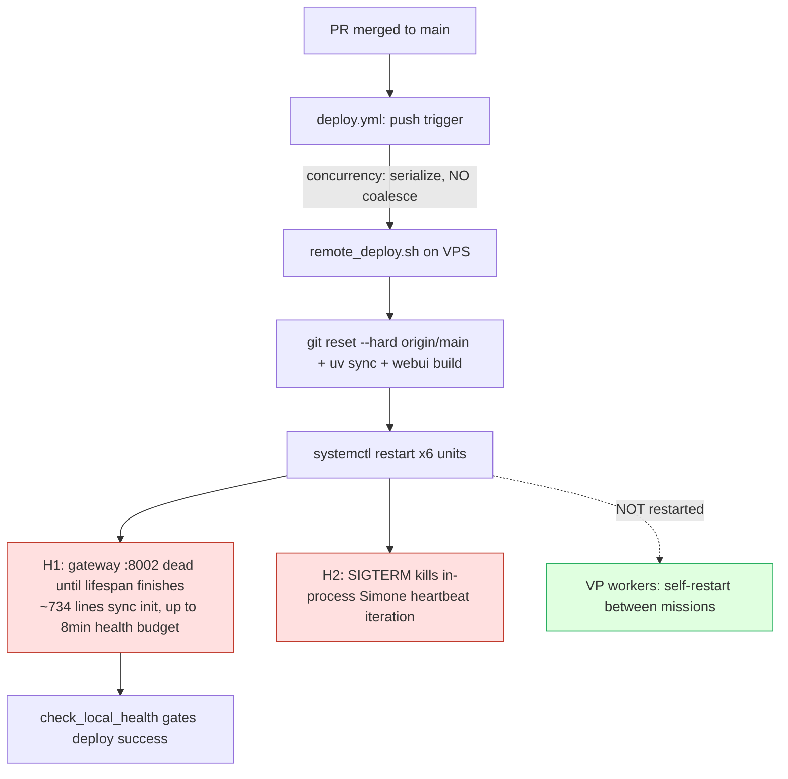
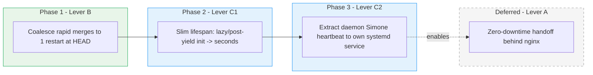
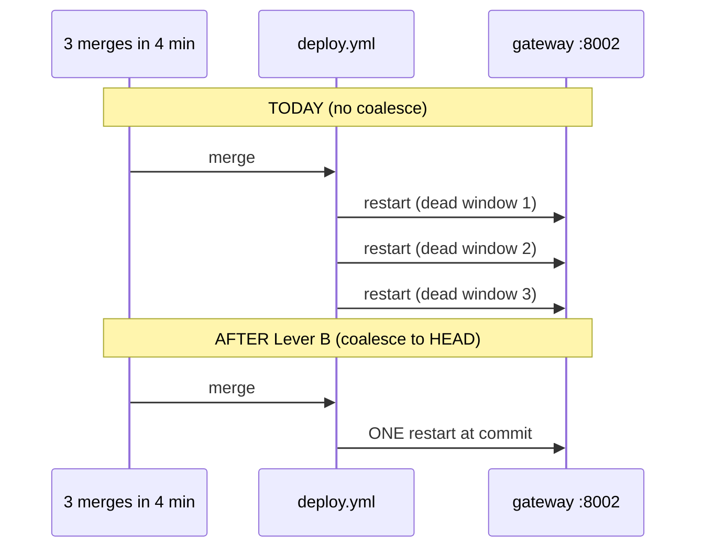

# ADR: Deploy-Restart Resilience for the Gateway

> **ADR status: ACCEPTED — phased implementation.** The operator approved the
> hybrid recommendation **B → C1 → C2, defer A** (2026-06-11). Phases land as
> separate PRs, each with a rollback, verified between phases.
>
> - **Phase B (coalesce redundant deploys): ✅ IMPLEMENTED** — `scripts/deploy/deploy_coalesce.py`
>   (unit-tested decision) + a fail-safe gate step in `.github/workflows/deploy.yml`.
>   See the **As-built** note under §4.
> - **Phase C1 (slim lifespan): ✅ MEASURED — reorder MOOT.** The first instrumented
>   restart logged **pre-yield = 1.49s** (dominated by `config_csi_redis_factory`=1.37s;
>   `heartbeat_daemon_subsystem_and_startup_reconcile`=0.11s; everything else ≤0.01s).
>   The "minutes-long cold start / 8-min health budget" premise was stale — the heavy
>   synchronous startup-recovery sweep had already been moved to a background thread
>   (2026-05-16 incident). Nothing left to slim, so the reorder is **moot**;
>   `startup_timing.py::StartupPhaseTimer` stays as a permanent guardrail. H1 (dead
>   `:8002` window) is therefore minor (~1.5s lifespan + import). See §4 **As-built**.
> - **Phase C2 (decouple in-process Simone heartbeat): ✅ IMPLEMENTED — graceful drain.**
>   The C1 measurement deflated H1, and a full heartbeat→own-service *extraction* proved
>   deeply coupled to gateway-resident session state (the `InProcessGateway`, the
>   WebSocket manager, the in-memory session/adapter registry — see §4 **As-built**), so
>   C2 ships as the cheaper, equally-H2-killing **graceful SIGTERM drain**: the gateway
>   shutdown now *awaits* an in-flight heartbeat iteration within a bounded budget before
>   exit, instead of cancelling it mid-flight. Full extraction is **deferred** (now even
>   less justified). See §4 **As-built**.
> - **Lever A (zero-downtime): DEFERRED** — effectively unjustified once C1 showed H1 is ~1.5s.
>
> Deploy handling is 24/7 P0 infra (exempt from dormancy). This ADR is a sibling to
> [`08_scheduling_substrate_adr.md`](08_scheduling_substrate_adr.md) — Lever C2
> below is the same "extract a singleton out of the gateway into its own systemd
> service" pattern that ADR's Decision 2 used for the Mission Control sweeper.

## 1. Context

Every merge to `main` triggers `.github/workflows/deploy.yml`, which SSHes to the
VPS and runs `scripts/deploy/remote_deploy.sh`. The production stack restart is a
**blunt** `systemctl restart` of six units:

```
universal-agent-gateway universal-agent-api universal-agent-webui \
universal-agent-telegram ua-discord-cc-bot ua-discord-intelligence
```

(There are **three copies** of this list in `remote_deploy.sh` — sudo, non-sudo,
and a `service`-manager fallback — which must be kept in sync.)

At the current cadence (~19 deploys/day) this produces **~141 gateway
restart journal lines / 7 days**. PR #941 quieted the *symptom* on the dashboard
(`ServiceStatusBanner` now needs 2 consecutive failed `/api/v1/version` probes
before going red). This ADR addresses the *cause*: the restart itself.

### 1.1 Two distinct harms (do not conflate them)

| # | Harm | Mechanism | Who feels it |
|---|------|-----------|--------------|
| **H1** | **Dead `:8002` window** | `gateway_server.py::lifespan` runs ~734 lines of **synchronous pre-yield init** (factory registry, runtime-DB schema migration, heartbeat/daemon session seed, task-lifecycle reconcile, autonomous-cron registration, session reaper, workspace archiver, `_reconcile_stale_vp_missions_on_startup`) **before** FastAPI begins serving. `remote_deploy.sh::check_local_health` budgets up to **8 min** (96×5s) for the gateway to answer `/api/v1/health`. During that window `:8002` refuses connections. | Dashboard banner; any external `:8002` hit 502s; in-flight HTTP requests at SIGTERM time. |
| **H2** | **In-process autonomous work SIGTERM'd** | Daemon **Simone heartbeat/todo** iterations run *inside the gateway process* (`heartbeat_service`, `process_heartbeat`). The unit is `Type=simple`, `Restart=always`, default `KillMode=control-group` → a restart sends **SIGTERM to the whole cgroup**, interrupting any in-flight heartbeat iteration. | Autonomous Simone work mid-iteration ("deploy-restart casualty"). |

### 1.2 What is NOT harmed (corrects a common framing)

**VP worker missions are already protected.** They run in separate
`universal-agent-vp-worker@*.service` processes, are **deliberately not
restarted** by `remote_deploy.sh`, and pick up new code by self-restarting
**between** missions: `worker_loop._should_restart_for_code_currency()` + the
unit's `Restart=always`. A running mission keeps heartbeating its claim lease
from its own process, so the gateway's startup reconciler sees a live claim and
leaves it alone. **The gateway restart does not kill VP missions** — it kills
in-process daemon work (H2), a narrower blast radius than "deploys kill Cody/Simone work."

### 1.3 Frequency driver

`deploy.yml` **serializes** deploys (`concurrency: { group: deploy-production,
cancel-in-progress: false }` — queues, never cancels) but does **not coalesce**.
N merges in a burst = **N full restarts**, even though only the last commit's
code matters.

### 1.4 The central constraint: the gateway is a stateful singleton

The lifespan seeds heartbeat/daemon **sessions**, registers **autonomous crons**,
and runs **reconcilers** (task lifecycle, stale VP missions), a **session reaper**,
and a **workspace archiver**. Two gateway instances running at once would
**double-run** all of this (duplicate cron registration, duplicate reconcile,
duplicate daemon sessions). **This is why naive blue-green / two-instance
zero-downtime is unsafe today** — and it is the precondition every "zero-downtime"
idea must satisfy first.



## 2. The three levers (orthogonal — combine, don't choose one)

### Lever A — Zero-downtime gateway handoff
Eliminate the dead `:8002` window so in-flight requests **drain** instead of being
refused. Mechanisms: socket-activated handoff, or blue-green behind nginx
(`deploy/nginx/universal-agent-app` already fronts the app; gateway `:8002`,
webui `:3000`, tailnet TLS via `tailscale serve`).
**Blocked by §1.4** — requires a "serving" vs "scheduling/daemon" split so only
one instance owns the singletons before two instances can coexist. Highest effort.
Fully fixes H1 for HTTP; only **partially** fixes H2 (drains HTTP, but in-process
daemon work still has to migrate to the surviving instance).

### Lever B — Coalesce / debounce deploys
Collapse N rapid merges into **one** restart that deploys the **latest** commit.
Cheapest lever. Reduces the **frequency** of H1 and H2; does not reduce per-restart
cost. Natural hook: a short debounce/batch window keyed on the existing
`concurrency: deploy-production` guard so queued runs collapse to HEAD.
**Must preserve:** latest code always deploys, and the health-gate stays intact.

### Lever C — Cut per-restart cost (at the source)
- **C1 — Slim the synchronous pre-yield lifespan.** Make the ~734 lines of
  `gateway_server.py::lifespan` init lazy / post-yield / backgrounded so cold-start
  drops from **minutes to seconds**. This is the code's own stated
  "right architectural fix" (the comment above the 8-min health budget in
  `remote_deploy.sh::check_local_health`). Directly shrinks H1.
- **C2 — Decouple in-process daemon Simone from the gateway lifecycle.** Move the
  heartbeat/daemon-session loop into its **own systemd service** (mirrors
  `08_scheduling_substrate_adr.md` Decision 2, which extracted the Mission Control
  sweeper). A gateway restart then no longer SIGTERMs autonomous work. **Removes H2
  at the source**, and is the first half of the serving/scheduling split that
  Lever A needs.

## 3. Lever comparison

| | Fixes H1 (dead window) | Fixes H2 (SIGTERM casualty) | Cuts frequency | Effort | Risk | Precondition |
|---|:---:|:---:|:---:|:---:|:---:|---|
| **A** zero-downtime | ✅ (HTTP) | ⚠️ partial | — | **High** | High (singleton double-run if rushed) | §1.4 split (started by C2) |
| **B** coalesce | indirect (fewer) | indirect (fewer) | ✅ | **Low** | Med (must keep latest+health-gate) | none |
| **C1** slim lifespan | ✅ (sec not min) | — | — | **Med** | Med (init ordering bugs) | none |
| **C2** extract heartbeat svc | — | ✅ | — | **Med** | Med (singleton ownership, lease handoff) | none |

## 4. Recommendation — hybrid, phased: **B → C1 → C2, defer A**



**Why this order.** B is the cheapest cut and **de-risks everything else** (fewer
restarts = fewer chances to trip any bug, immediately). C1 shrinks the dead window
to seconds per the codebase's own stated direction. C2 removes the actual
autonomous-work casualty (H2) and **delivers the serving/scheduling split** that A
requires. A is a large project whose marginal gain is small once B+C have made
restarts cheap and casualty-free — so it is naturally last, and only if still
warranted.



### Phase B — As-built (deploy coalescing)

Implemented as a unit-tested decision script plus a minimal, fail-safe gate in the
deploy job (the risky logic lives in tested Python, not YAML — keeping the
`deploy.yml` change small to dodge the parser quirk in §5.1):

- `scripts/deploy/deploy_coalesce.py::should_skip_redundant_deploy` — pure decision:
  skip iff a **strictly-newer** Deploy run (higher monotonic `run_id`) is still in an
  **active** state (`queued`/`in_progress`/…). `deploy_coalesce.py::main` is the CLI
  the workflow calls (runs JSON on stdin, `--my-run-id`, prints `skip=true|false`).
- `.github/workflows/deploy.yml` — a `Coalesce redundant deploys` step (`id: coalesce`,
  `if: github.event_name == 'push'`) fetches the script at the deploy SHA, feeds it
  `gh run list --workflow=deploy.yml --json databaseId,status,event`, and writes the
  decision to `$GITHUB_OUTPUT`. The Tailscale + Deploy steps gate on
  `steps.coalesce.outputs.skip != 'true'`.
- **Safety invariants** (covered by `tests/unit/test_deploy_coalesce.py`): the newest
  run never skips itself (latest code always ships); only active newer runs supersede
  (a newer *completed* run never causes a skip); and any error / missing token scope /
  malformed input ⇒ `skip=false` (proceed) — coalescing can never *block* a deploy,
  only no-op. `workflow_dispatch` runs always proceed (the step is push-only).
- **Net effect:** a burst of N merges collapses to **2 restarts** (the already-running
  first + the newest), not N. **Known residual:** if the newest run later *fails*, an
  intermediate coalesced run won't have shipped its (older-but-newer-than-first) code;
  the existing deploy-failure email surfaces this, and the next merge re-deploys HEAD.

### Phase C1 — As-built (measure-first instrumentation)

Reading `gateway_server.py::lifespan` revised the premise: the pre-yield body is
**already mostly non-blocking** — most loops are `asyncio.create_task`'d and many
are deferred via `_run_after_deployment_window`, and the Mission Control sweeper
was already extracted (S5). The genuinely *blocking* awaited-inline work is a
handful of calls (`ensure_schema`/`_ensure_activity_schema`/`_activity_prune_old`,
config+CSI+Redis+factory-registry setup, dashboard prewarm, the heartbeat/daemon
subsystem incl. `ensure_daemon_sessions()`, and `_reconcile_stale_vp_missions_on_startup()`).
So a blind reorder is poorly justified — **measure before optimizing.**

- `src/universal_agent/startup_timing.py::StartupPhaseTimer` — a pure, clock-injectable
  segment timer (`mark(name)` closes the segment since the last mark; `summary()`
  ranks segments slowest-first with the total). Unit-tested (`tests/unit/test_startup_timing.py`).
- `gateway_server.py::lifespan` — a `_startup_timer` is created at the top and
  `mark()`'d at six checkpoints (bootstrap / config+csi+redis+factory / runtime-db+schema /
  dashboard-prewarm / heartbeat+daemon+startup-reconcile / background-loops). Just
  before `yield` it logs `⏱️  Gateway startup timing — …`. Pure instrumentation:
  no behavior change, no reorder.
- **As-measured (2026-06-12):** the first instrumented restarts logged
  `⏱️  gateway lifespan pre-yield 1.49s; slowest segments: config_csi_redis_factory=+1.37s,
  heartbeat_daemon_subsystem_and_startup_reconcile=+0.11s, runtime_db_connect_and_schema=+0.01s,
  dashboard_prewarm=+0.01s, bootstrap_runtime_environment=+0.00s, background_loops_spawned=+0.00s`.
  Pre-yield blocking is **~1.5s, not minutes** — the heavy synchronous startup-recovery
  sweep was already backgrounded in the 2026-05-16 incident, and the dominant remaining
  segment (`config_csi_redis_factory`, ~1.4s) is one-time factory/Redis wiring that is
  unsafe to defer past `yield`. **Verdict: the C1 reorder is moot** — there is nothing
  left worth slimming. The instrumentation stays as a permanent guardrail (so a future
  regression that re-fattens the lifespan is visible), and we proceeded directly to C2.

### Phase C2 — As-built (graceful heartbeat drain, not extraction)

**Decision.** The literal ADR C2 was "extract the daemon Simone heartbeat into its own
systemd service" (mirroring the Mission Control sweeper). A coupling map of the
heartbeat↔gateway call graph (2026-06-12) showed that, unlike the self-contained sweeper
`tick()`, the heartbeat is **deeply gateway-resident**: `HeartbeatService` holds the live
`InProcessGateway` and drives `gateway.execute(session, …)`; it needs the WebSocket
`ConnectionManager` (broadcast + foreground-lock detection via `session_connections`); it
uses the gateway callbacks `_drain_system_events` / `_emit_heartbeat_event`; and the daemon
sessions it runs live in the gateway's in-memory `_sessions`/`_adapters` registry. A true
extraction would have to re-home that session/adapter/WS state into a second process (or RPC
back to the gateway) **and** introduce a single-owner lease (landmine #3) — large, high-risk
work, in the exact subsystem the operator was mid-tuning for ZAI/GLM 429s. Its only unique
payoff (the serving/scheduling split that **Lever A** needs) is now unjustified, because C1
showed H1 is ~1.5s.

So C2 ships the cheaper boundary that **removes H2 at the source just as well**: a
**graceful SIGTERM drain**. The mapping confirmed the precondition — a single heartbeat
iteration (`heartbeat_service.py::HeartbeatService._run_heartbeat`) is an in-process,
awaitable `asyncio` task whose `finally` already finalizes/reopens its Task Hub assignment,
and systemd already grants `TimeoutStopSec=90s` after SIGTERM before SIGKILL. Today the
shutdown path *cancels* that iteration unconditionally (`stop()` → `task.cancel()`); the
drain *awaits* it instead.

- `src/universal_agent/graceful_drain.py::drain_inflight` — a small, dependency-free helper
  that awaits an in-flight awaitable up to a budget and classifies the outcome
  (`NOTHING_IN_FLIGHT` / `DRAINED` / `TIMED_OUT`). On timeout it deliberately does **not**
  cancel — the caller owns the fallback. Unit-tested (`tests/unit/test_graceful_drain.py`).
- `heartbeat_service.py::HeartbeatService._scheduler_loop` now runs each iteration as a
  tracked child task (`self._inflight_iteration`) and stops starting new iterations once
  `running` is cleared; `HeartbeatService.stop(*, drain=…, drain_timeout=…)` drains the
  in-flight iteration via `drain_inflight`, then falls back to the legacy
  `task.cancel()` — never worse than before. Budget: `UA_HEARTBEAT_DRAIN_TIMEOUT_SECONDS`
  (code default **45s**, comfortably under the 90s stop window). Kill-switch:
  `heartbeat_service.py::heartbeat_drain_on_shutdown_enabled` (`UA_HEARTBEAT_DRAIN_ON_SHUTDOWN_ENABLED`,
  default ON). Behavior-tested via the real `start()`/`stop()` loop (`tests/unit/test_heartbeat_drain.py`).
- `gateway_server.py::lifespan` shutdown now calls `_heartbeat_service.stop(drain=heartbeat_drain_on_shutdown_enabled())`.
- `deployment/systemd/templates/universal-agent-gateway.service.template` pins
  `TimeoutStopSec=90s` explicitly (== the current systemd default — no restart-timing
  change) so the drain budget always keeps headroom. `KillMode` stays `control-group`:
  the drained work is in-process, so the main process catches SIGTERM and drains it without
  needing `KillMode=mixed`. (`mixed` is noted as an optional follow-up only if a future
  iteration is found to spawn child processes that must outlive the SIGTERM.)
- **Scope it removes:** the in-flight-iteration casualty (H2) for the common case where an
  iteration finishes within the budget. A long iteration that exceeds the budget still
  falls back to cancel — its `finally` reopens the Task Hub item exactly as today, so the
  drain is strictly an improvement, never a regression.
- **Verification:** drain logic is unit-verified (15 tests). End-to-end H2 reduction is
  only confirmable on a live restart with an iteration in flight — measured post-deploy via
  the activity-DB lifecycle-miss signal (`deploy_restart_casualty` on
  `execution_missing_lifecycle_mutation` rows) before/after, plus reading the new
  `💓 Heartbeat drained in-flight iteration in …s before shutdown` shutdown log line.

## 5. Landmines (carry into every phase)

1. **deploy.yml YAML-parser quirk** — the GHA validator has silently rejected
   `deploy.yml` on `check_local_health`-adjacent edits even when `actionlint` +
   `pyyaml` pass (see `memory/project_2026-05-27_deployyml_parser_quirk.md`).
   **Smoke-test any `deploy.yml` change on a feature branch first** (escaped `+`
   in the branches filter). `actionlint` alone is NOT sufficient.
2. **Health-gate integrity** — `check_local_health` is the only pre-deploy gate.
   Coalescing must not let a bad commit skip the gate, and must still deploy the
   *latest* commit, not a stale queued one.
3. **Singleton double-run (§1.4)** — never run two gateway instances, or two
   heartbeat owners, without an explicit single-owner lease. C2 and A both must
   define who owns crons/reconcilers/daemon sessions.
4. **Do not fold VP workers into a restart scheme** — they self-restart between
   missions on purpose (`worker_loop._should_restart_for_code_currency`).
   Restarting them mid-deploy was the original mission-casualty bug.
5. **24/7 P0** — deploy handling is exempt from dormancy. A broken deploy pipeline
   is a production outage. Stage carefully; each phase ships with a rollback.
6. **`.env` is clobbered every deploy** (`deploy.yml` rewrites `/opt/universal_agent/.env`)
   — any new durable config goes in the deploy bootstrap dict or code defaults,
   not a VPS-side hand-edit (see `memory/feedback_env_clobbered_by_deploy.md`).

## 6. Operator decision points (only Kevin can decide)

- **D1 — Start with Phase 1 (Lever B coalescing)?** Cheapest, immediate, lowest
  risk. Recommended first ship.
- **D2 — Coalesce mechanism:** a debounce window in `deploy.yml` keyed on the
  concurrency guard, vs. a "deploy at most every N minutes / collapse-to-HEAD"
  batch. (Recommend the concurrency-guard debounce — least new machinery.)
- **D3 — Appetite for C1 (slim lifespan)?** Medium effort, touches gateway startup
  ordering. Biggest single reducer of the dead window.
- **D4 — Approve the serving/scheduling split (C2 → eventually A)?** This is the
  architectural commitment; it's consistent with the scheduling-substrate ADR's
  direction but is real work.

## 7. References

- Sibling ADR: [`08_scheduling_substrate_adr.md`](08_scheduling_substrate_adr.md) (Decision 2 = the extract-a-service pattern C2 reuses).
- `scripts/deploy/remote_deploy.sh` — restart block, `check_local_health`, `ensure_current_venv_interpreter`.
- `.github/workflows/deploy.yml` — `concurrency: deploy-production`, `paths-ignore`, push trigger.
- `src/universal_agent/gateway_server.py::lifespan` — the synchronous pre-yield init.
- `src/universal_agent/vp/worker_loop.py::_should_restart_for_code_currency` — VP worker self-restart contract.
- Memories: `project_2026-05-27_deployyml_parser_quirk`, `feedback_env_clobbered_by_deploy`, `project_2026-05-26_gateway_eventloop_starvation` (in-process daemon work starving the loop is the same surface H2 lives on).
