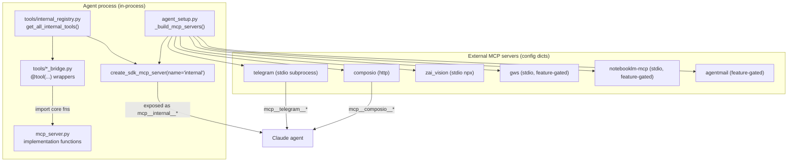

# MCP Server & Tools

This subsystem is how Universal Agent exposes custom (non-built-in) tools to its
Claude agents. There are two physically distinct surfaces that share a lot of
code, and conflating them is the single most common mistake here:

1. **The in-process `internal` SDK MCP server** — the production path. Tools are
   registered directly inside the agent process via the Claude Agent SDK's
   `create_sdk_mcp_server(...)`. No subprocess, no stdio. This is what agents
   actually call at runtime.
2. **The standalone FastMCP server (`src/mcp_server.py`)** — a `FastMCP`
   instance ("Local Intelligence Toolkit") that *can* run as a stdio subprocess
   (`mcp.run(transport="stdio")` under `if __name__ == "__main__"`). In current
   production it is **not** spawned as a subprocess. Instead, its tool
   *implementation functions* are imported directly by the in-process bridge
   wrappers and executed in-process. The `@mcp.tool()` decorations on those
   functions are effectively dormant in the production wiring.

**Design rationale (Vocal vs Silent).** The in-process-vs-subprocess split is
not arbitrary. The guiding ADR distinguishes "Vocal" tools (run in-process so the
agent's event stream — and therefore the Web UI — sees real-time progress; the
`StdoutToEventStream` bridge described below is what makes this work) from
"Silent" tools (run as isolated subprocesses for environment isolation). Rule of
thumb: anything that runs more than a few seconds should be Vocal so the operator
gets terminal-style disclosure of progress; third-party or unstable tools that
risk polluting the agent's environment go Silent. This is why the heavy local
toolkit was migrated in-process while the external servers (telegram, zai_vision,
gws, etc.) stay as stdio subprocesses.

The legacy name for the stdio path was `local_toolkit`. Those tool slugs
(`mcp__local_toolkit__*`) are now hard-banned in `constants.py::DISALLOWED_TOOLS`
precisely because they were replaced by the in-process `internal` server. If you
see `mcp__local_toolkit__...` anywhere live, it is dead/forbidden.

## High-level topology



## The `internal` server: how tools get registered

`agent_setup.py::_build_mcp_servers` builds the dict of MCP servers handed to the
SDK. The `internal` entry is the in-process one:

```python
"internal": create_sdk_mcp_server(
    name="internal",
    version="1.0.0",
    tools=get_all_internal_tools(self.enable_memory)
),
```

Because the server is named `internal`, every tool inside it is exposed to the
agent as `mcp__internal__<tool_name>` (the SDK's `mcp__<server>__<tool>`
convention). The `<tool_name>` is the `name=` passed to the SDK `@tool(...)`
decorator on each wrapper — **not** the Python function name (which usually ends
in `_wrapper`).

> [VERIFY: tool-name layering across the SDK boundary]. The naming has three
> decoupled layers: the Python function (`*_wrapper`), the SDK `@tool(name=...)`
> decorator value, and the prompt text agents are told to call. Prompt text that
> says "use `mcp__internal__task_hub_task_action`" can drift from what the SDK
> actually exposes (the SDK has been observed to strip/normalize the
> `mcp__internal__` prefix at native exposure in some surfaces). The practical
> rule: inspect the *live* tool list via SDK reflection before concluding a tool
> is missing, and when renaming a tool, change the Python fn, the `@tool`
> decorator `name=`, AND every markdown prompt that references it together — they
> do not update each other.

### The registry is the single source of truth

`tools/internal_registry.py` is the central manifest. Three functions matter:

- `get_core_internal_tools()` — the always-on list of ~50 wrapper callables.
- `get_memory_tools()` — `memory_get_wrapper`, `memory_search_wrapper`; added
  only when `enable_memory=True`.
- `get_live_chrome_tools()` — returns `LIVE_CHROME_TOOLS` **only if**
  `UA_ENABLE_LIVE_CHROME=1`, else `[]`.
- `get_all_internal_tools(enable_memory)` — composes the three above. This is
  what `agent_setup` calls.

`get_internal_tool_slugs(enable_memory)` derives the human/discovery-facing
names by reading each wrapper's `.name` attribute (falling back to `__name__`)
and stripping a trailing `_wrapper`. It is used by
`utils/composio_discovery.py` (`INPROCESS_MCP_TOOLS = get_internal_tool_slugs(enable_memory=True)`)
to advertise the local tool surface during capability discovery. Note discovery
defaults `enable_memory=True` "for documentation completeness," so the slug list
can be a superset of what a given agent (with memory disabled) actually has.

### What's in the core tool set

The core list registered into `internal` spans these bridges (all in
`src/universal_agent/tools/`):

| Bridge file | Representative tools | Purpose |
|---|---|---|
| `research_bridge.py` | `run_research_pipeline`, `run_research_phase`, `run_report_generation`, `crawl_parallel`, `generate_outline`, `draft_report_parallel`, `cleanup_report`, `compile_report` | The multi-phase research → report pipeline |
| `local_toolkit_bridge.py` | `list_directory`, `write_text_file`, `append_to_file`, `inspect_session_workspace`, `generate_image`, `generate_image_with_review`, `describe_image`, `preview_image`, `upload_to_composio`, `finalize_research`, `ask_user_questions`, `batch_tool_execute`, `prepare_agentmail_attachment`, `agentmail_send_with_local_attachments`, `agentmail_reply_with_local_attachments` | File/workspace ops, image gen/vision, AgentMail-with-attachment helpers; wraps `mcp_server.py` core fns in-process |
| `pdf_bridge.py` | `html_to_pdf` | HTML → PDF |
| `mermaid_bridge.py` | `mermaid_to_image` | Mermaid → image |
| `x_trends_bridge.py` | `x_trends_posts` | xAI/Grok `x_search` evidence fetch |
| `csi_bridge.py` | `csi_recent_reports`, `csi_opportunity_bundles`, `csi_source_health`, `csi_watchlist_snapshot` | Read-only CSI snapshots from `csi.db` |
| `task_hub_bridge.py` | `task_hub_task_action`, `task_hub_decompose` | Task Hub mutations from inside a turn |
| `task_hub_simone_verbs.py` | `task_re_evaluate`, `task_redirect_to`, `task_request_revision` | Simone-callable "unstick" verbs (closes the Simone-directs-Cody loop) |
| `wiki_bridge.py` | `wiki_init_vault`, `wiki_sync_internal_memory`, `wiki_query`, `wiki_lint`, `wiki_ingest_external_source` | LLM Wiki vault ops |
| `vp_orchestration.py` | `vp_dispatch_mission`, `vp_get_mission`, `vp_list_missions`, `vp_wait_mission`, `vp_cancel_mission`, `vp_read_result_artifacts` | VP (Cody/Atlas) mission control |
| `artifact_publisher.py` | `mcp__internal__publish_artifact` | Move completed work into the durable artifacts dir |
| `kb_bridge.py` | `kb_list`, `kb_get`, `kb_register`, `kb_update` | NotebookLM KB registry |
| `memory.py` | `memory_get`, `memory_search` | Tiered memory reads (only when `enable_memory`) |
| `live_chrome_bridge.py` | `chrome_connect`, `chrome_list_tabs`, `chrome_navigate`, ... | CDP live-Chrome attach (only when `UA_ENABLE_LIVE_CHROME=1`) |

### Bridge wrapper shape

Every in-process tool wrapper follows the same SDK contract: it is an `async`
function decorated with `claude_agent_sdk.tool(name=..., description=...,
input_schema={...})`, takes a single `args: dict`, and returns an MCP content
envelope:

```python
@tool(name="list_directory", description="...", input_schema={"path": str})
async def list_directory_wrapper(args: dict[str, Any]) -> dict[str, Any]:
    path = args.get("path")
    with StdoutToEventStream(prefix="[Local Toolkit]"):
        result_str = list_directory_core(path)
    return {"content": [{"type": "text", "text": result_str}]}
```

`StdoutToEventStream` bridges the wrapped function's stdout/stderr into the agent
event stream so progress shows up in the Web UI. `local_toolkit_bridge.py`
imports the heavy implementations from `mcp_server.py` (e.g.
`list_directory as list_directory_core`) under a `try: from mcp_server import ...`
/ `except ImportError: from src.mcp_server import ...` shim — this is the
mechanism by which the standalone FastMCP module's logic runs in-process without
the stdio subprocess.

## External MCP servers (config dicts, not in-process)

`_build_mcp_servers` also returns plain server-config dicts that the SDK launches
or connects to:

- **`composio`** — `type: http`, pointed at `self._session.mcp.url` with an
  `x-api-key` header from `COMPOSIO_API_KEY`. This is the big remote toolkit
  surface (Gmail, Slack, Calendar, etc.). Exposed as `mcp__composio__*`.
- **`telegram`** — `type: stdio`, spawns `mcp_server_telegram.py` with
  `TELEGRAM_BOT_TOKEN` / `TELEGRAM_ALLOWED_USER_IDS` in env.
- **`zai_vision`** — `type: stdio`, `npx -y @z_ai/mcp-server` for GLM image/video
  analysis. Note the env-var rename gotcha: Infisical stores `ZAI_API_KEY`, but
  the npm package wants `Z_AI_API_KEY`, so the builder maps
  `Z_AI_API_KEY = os.environ.get("Z_AI_API_KEY") or os.environ.get("ZAI_API_KEY", "")`.
- **`gws`** — feature-gated stdio server for Google Workspace CLI. Built by
  `services/gws_mcp_bridge.build_gws_mcp_server_config()`, which returns `None`
  (server omitted) unless `gws_cli_enabled()` is true AND the gws binary is found
  on `$PATH`. See the gws auth runbook in CLAUDE.md for the keyring/Infisical
  materialization story.
- **`notebooklm-mcp`** — feature-gated; built by
  `notebooklm_runtime.build_notebooklm_mcp_server_config()` (default off for
  context-budget reasons). **NOTE (2026-06-04):** the `paper-to-podcast-tf` skill no
  longer drives the notebook / source / audio / quiz chain through this MCP server — it
  uses the `nlm` CLI instead. The long-lived MCP server's `refresh_auth` intermittently
  returns a *false* "Authentication expired" (its live homepage probe gets transiently
  redirected — e.g. under IP throttling — and never recovers), which made the cron abandon
  NotebookLM and emit an LLM text transcript instead of audio. The `nlm` CLI authenticates
  fresh from the on-disk profile on every invocation and reliably generates audio (verified
  end-to-end 2026-06-04: a 34 MB / ~18 min `.m4a`). The deterministic credential gate lives
  in `notebooklm_runtime.run_auth_preflight()` (`nlm login --check`).
- **`arxiv-mcp-server`** — feature-gated; built by
  `arxiv_runtime.build_arxiv_mcp_server_config()`, gated by `UA_ENABLE_ARXIV_MCP`
  (default off; **on in production** via the Infisical secret). Launched as
  `uv tool run arxiv-mcp-server`; `arxiv_runtime.arxiv_mcp_uv_command()` resolves
  `uv` to an absolute path because the systemd unit's `$PATH` omits
  `/usr/local/bin`. Pre-installed durably on the VPS with `uv tool install
  'arxiv-mcp-server[pdf]'` so `uv tool run` is instant/offline. Exposes
  `mcp__arxiv-mcp-server__{search_papers,download_paper,read_paper,list_papers}`.
  Required by the `paper-to-podcast-tf` skill / `paper_to_podcast_daily` cron — the
  server enforces arXiv's 3-second rate limit automatically, which is what stops
  the raw-`arxiv`-library HTTP 429 storms that previously failed the nightly run.
  Registered in **both** `agent_setup.py::_build_mcp_servers` (legacy bridge path)
  and `main.py::setup_session` (the live execution-engine path the cron uses).
- **`agentmail`** — the *official* AgentMail MCP server, built by
  `agentmail_official.build_agentmail_mcp_server_config()`. Gated by
  `UA_AGENTMAIL_MCP_ENABLED` (default on: returns `None` only when explicitly set
  to `0/false/no/off`) and requires `AGENTMAIL_API_KEY`. This is separate from
  the in-process `agentmail_send_with_local_attachments` helper, which exists to
  attach local files (the official server can't read local disk).

Several entries in `_build_mcp_servers` are commented out (`edgartools`,
`video_audio`, `youtube`) and the comment `# local_toolkit subprocess disabled in
favor of in-process tools` documents the migration described above.

## Tool gating: deny-list, not allow-list

UA does **not** hand the SDK an allow-list of permitted tools. It hands a
`disallowed_tools` deny-list (`agent_setup.py`, sourced from
`constants.py::DISALLOWED_TOOLS`). Everything registered is available unless
explicitly banned. Notable bans:

- Hallucinated/legacy: `TaskOutput`, `TaskResult` (+ lowercase + composio
  variants).
- `WebSearch` / `web_search` / `mcp__composio__WebSearch` — UA routes web search
  through its own research tools / ZAI MCPs, not the built-in.
- All `mcp__local_toolkit__*` slugs — replaced by in-process `internal` tools.
- `mcp__composio__COMPOSIO_REMOTE_WORKBENCH` — primary agents must never use the
  remote workbench directly.
- All Composio crawl/fetch tools
  (`COMPOSIO_CRAWL_WEBPAGE/URL/WEBSITE`, `COMPOSIO_FETCH_URL/WEBPAGE`) — all
  crawling must go through Crawl4AI via `run_research_phase` / `crawl_parallel`.

When `enable_memory` is false, `memory_get` / `memory_search` are also appended
to the deny-list (belt-and-suspenders: they're already excluded from the
registered tool set).

A separate `TODO_EXECUTION_DISALLOWED_TOOLS` (just `TaskStop`/`taskstop`) applies
to the ToDo-execution delivery lane. `PRIMARY_ONLY_BLOCKED_TOOLS` is
**intentionally empty** — the codebase comment explains that PreToolUse-hook
subagent detection is unreliable, so primary-vs-subagent steering is done at the
prompt level, not via a hook deny-list.

## Workspace resolution inside tools

File-writing tools resolve the target workspace through
`mcp_server.py::_resolve_workspace`, a layered fallback (highest priority first):

1. An explicit `preferred` argument.
2. The session-scoped `ContextVar` via
   `execution_context.get_current_workspace()` — concurrency-safe.
3. A marker file: `CURRENT_RUN_WORKSPACE_FILE` / `CURRENT_SESSION_WORKSPACE_FILE`
   env, else `<workspaces_root>/.current_run_workspace` (legacy
   `.current_session_workspace`).
4. Env vars `CURRENT_RUN_WORKSPACE` / `CURRENT_SESSION_WORKSPACE` (static, often
   stale in long-running processes — deliberately last).

The first pass only accepts candidates that look like a real durable workspace
(`_is_valid_session_workspace`: name starts with `session_`/`run_`, or contains
`session_policy.json` / `run_manifest.json` / `*_checkpoint.json`). If none
match, it falls back to the most-recently-modified `run_`/`session_` dir under
the workspaces root, and only as a last resort accepts any existing candidate
(with a WARN log).

The workspaces root is `_resolve_workspaces_root()`: `UA_WORKSPACES_DIR` if set,
else `<repo-root>/AGENT_RUN_WORKSPACES`.

The durable artifacts root is separate: `_resolve_artifacts_root()` returns
`UA_ARTIFACTS_DIR` if set, else `<repo-root>/artifacts`. **Do not confuse the two
roots** — workspaces (`AGENT_RUN_WORKSPACES`) are ephemeral scratch; artifacts
(`UA_ARTIFACTS_DIR`) are durable.

`write_text_file` enforces a security boundary: a write is allowed only if the
resolved absolute path lies under the current workspace OR under the artifacts
root; otherwise it returns `Error: write denied`. Relative paths anchor at the
workspace first (matching the agent's mental model of `work_products/foo.md`),
falling back to the artifacts root. `append_to_file` mirrors the same resolution
but requires the file to already exist (use the native `Write` tool to create,
then `append_to_file` for chunked >50KB writes).

`fix_path_typos` auto-corrects common model mistakes:
`AGENT_RUNSPACES → AGENT_RUN_WORKSPACES`, and literal/`$`-prefixed
`UA_ARTIFACTS_DIR` path fragments → the resolved artifacts root.

## Circuit breakers (runaway guardrails)

The standalone module wraps tools with `trace_tool_output`, which runs
`_tool_circuit_breaker_precheck(tool_name, kwargs)` **before** executing the
tool. This is a per-session, in-memory counter (`_SESSION_TOOL_TOTAL_CALLS`,
`_SESSION_TOOL_CALLS_BY_NAME`) keyed by resolved workspace. Limits are read from
`<workspace>/session_policy.json` under `limits.max_tool_calls` and
`limits.max_tool_calls_by_tool[<tool>]`.

Key behaviors observed in code:

- **Opt-in / conservative.** Limits enforce only when a workspace resolves AND
  the limit is a positive integer. With no `session_policy.json`, nothing is
  enforced — ad-hoc usage is never broken.
- When tripped, the precheck returns a JSON error blob
  (`"Tool circuit breaker: max_tool_calls exceeded..."`) instead of running the
  tool, tagged `blocked_by: session_policy`.
- Counters increment pre-execution, so the *over-limit* call is the one rejected.

**Where the breaker actually fires.** The in-process `internal` wrappers in
`tools/*_bridge.py` are decorated with the SDK `@tool(...)`, *not*
`@trace_tool_output`. However, the heavy core functions they import from
`mcp_server.py` (`write_text_file`, `list_directory`, `generate_image`,
`run_research_pipeline`, etc.) *are* stacked `@mcp.tool()` + `@trace_tool_output`.
Because the bridge wrappers call those decorated core functions, the precheck
*does* run on the bridge → core path for every tool whose implementation lives in
`mcp_server.py`. The breaker does **not** cover wrappers whose logic is entirely
self-contained in the bridge file (no decorated core fn behind them) — those
bypass the precheck. So the guardrail's reach is "any call that ultimately
executes a `@trace_tool_output`-decorated core function," which is most of the
file/research/image surface but not 100% of `mcp__internal__*`.

A second, independent guardrail lives in `batch_tool_execute`: a hard
`MAX_BATCH_SIZE = 20` cap (returns an error blob if exceeded), and batch calls
run with a bounded thread pool. `batch_tool_execute` can dispatch both
`mcp__composio__*` actions and local tools in one call, and auto-saves Composio
SEARCH results into the workspace inbox so the agent doesn't have to shell out.

## The research pipeline tools

The research bridge exposes a staged pipeline whose tool descriptions
deliberately discourage the agent from "verifying" outputs with `Bash`/`ls`
(efficiency: trust the JSON receipt):

- `run_research_pipeline` — the unified one-shot: Search → Crawl → Refine →
  Outline → Draft → Compile.
- `run_research_phase` — Phase 1 only: Crawl & Refine → `refined_corpus.md`.
- `run_report_generation` — Phase 2 only: Outline → Draft → Compile →
  `report.html` (accepts `corpus_data` directly for non-search tasks).
- `crawl_parallel` — concurrent crawl4ai scrape; **requires `session_dir`**.

These wrappers resolve a workspace/task name via the bridge's own
`_resolve_workspace_hint` / `_resolve_task_name` helpers and then call the
corresponding core coroutine imported from `mcp_server.py`. Corpus reduction is
handled by `tools/corpus_refiner.py::refine_corpus_programmatic` plus the
size-limit and filter constants defined at the top of `mcp_server.py`
(`BATCH_MAX_TOTAL` from `UA_BATCH_MAX_WORDS` default 50000,
`FILTER_BLACKLIST_DOMAINS`, URL/title/promo skip-token lists, etc.).

## Observability

`mcp_server.py` configures Logfire (`service_name="local-toolkit"`,
`logfire.instrument_mcp()`) when `LOGFIRE_TOKEN` is present. When
`UA_EMIT_LOCAL_TRACE_IDS` is truthy (default on), `trace_tool_output` prepends a
`[local-toolkit-trace-id: <hex>]` line to string tool outputs so a tool result
can be tied back to its OpenTelemetry trace. `set_mcp_log_callback` lets a host
redirect `mcp_log()` output to the UI.

## Gotchas

- **In-process vs stdio.** The `internal` server is in-process; the
  `local_toolkit` stdio subprocess is disabled. The `@mcp.tool()` decorators in
  `mcp_server.py` are dormant in production — those functions run because the
  bridge wrappers import and call them, not because the stdio server is up.
- **`.mcp.json` credentials must be `${VAR}` placeholders, never literals.** A
  literal Hostinger token sat in `.mcp.json` in git for 78 days (Jan–May 2026).
  Placeholders are resolved at launch by `scripts/claude_with_mcp_env.sh` via
  `initialize_runtime_secrets()`. (This applies to the interactive-Claude
  `.mcp.json`, a separate surface from the SDK `_build_mcp_servers` dict, but the
  same secret-hygiene rule holds.)
- **ZAI key rename.** `ZAI_API_KEY` (Infisical) vs `Z_AI_API_KEY` (npm package)
  — the `zai_vision` builder maps between them.
- **Two roots, two purposes.** `AGENT_RUN_WORKSPACES` (ephemeral) ≠
  `UA_ARTIFACTS_DIR` (durable). Tools resolve them via distinct functions; read
  the resolver before scripting a `find`/`ls` diagnostic.
- **No per-workspace access control.** Workspace ownership is enforced only by
  convention at the API level — any process with filesystem access to
  `AGENT_RUN_WORKSPACES` can read another workspace's files. The
  `write_text_file` boundary check guards *writes* (must be under the current
  workspace or artifacts root) but does not isolate sessions from each other.
- **Discovery slug list can overstate availability.** `composio_discovery`
  builds `INPROCESS_MCP_TOOLS` with `enable_memory=True`, so memory tools appear
  in the advertised list even for agents that have memory disabled.
- **Composio Twitter/X is intentionally suppressed** in
  `discover_connected_toolkits` regardless of connection state, and all Composio
  crawl/fetch + remote-workbench tools are globally banned in `DISALLOWED_TOOLS`.
- **Gemini image-gen prefers an AI Studio key, not a Cloud project key.**
  `mcp_server.py::generate_image` reads `GEMINI_IMAGE_API_KEY` first and only
  falls back to `GEMINI_API_KEY`. The org-level GCP policy on the image project
  silently blocks plain Cloud-Console project keys from the Generative Language
  API (`API_KEY_SERVICE_BLOCKED`) even when the API is enabled; AI Studio keys
  (from aistudio.google.com) bypass org restrictions. A 403-despite-enabled on
  Imagen → suspect org policy before chasing IAM. Store the AI Studio key as
  `GEMINI_IMAGE_API_KEY` separately.
- **NLM-first routing for specialized artifacts.** When both a generic in-process
  tool (`generate_image`) and a specialized NotebookLM tool (`studio_create`,
  `research_import` — exposed via the external `notebooklm-mcp` server) exist,
  agents tend to default to the generic tool unless the prompt *explicitly*
  mandates the specialist. For KB-pipeline work the intended order is
  research → `research_import`, reports → `studio_create(report)`, infographics →
  `studio_create(infographic)`, audio → `studio_create(audio)`. If artifacts are
  landing as generic images instead of KB studio outputs, the prompt — not the
  tool wiring — is usually the cause.
