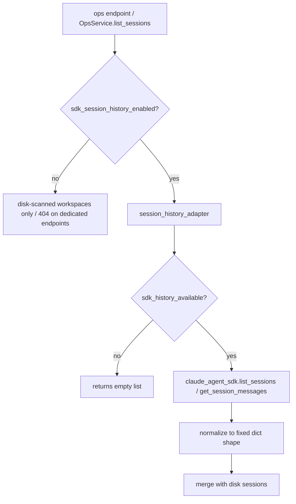

# SDK Integration

This subsystem is a thin layer of **adapters and helpers that sit between Universal
Agent and the upstream `claude_agent_sdk` package**, plus a small standalone
**harness V2** module (interview + verification) used by the interactive
massive-task runner. Two physically separate directories own these concerns:

| Directory | Concern |
|---|---|
| `src/universal_agent/sdk/` | Version probing, session-history adapter, typed task-event extraction — all defensive wrappers around `claude_agent_sdk` symbols that may or may not exist at runtime. |
| `src/universal_agent/harness/` | Planning-phase interview tool (CLI Q&A) and tiered task-completion verifier. Independent of the SDK package; named "Harness V2." |

Everything here is **best-effort and optional**. Each helper degrades to a safe
no-op (`unknown`, `[]`, `None`, or "skipped") when the underlying SDK symbol is
missing or a feature flag is off. None of it is on a hot path that fails the run
if absent.

> Scope boundary: this doc covers only the `sdk/` and `harness/` helper directories.
> The SDK's **permission/hook/subagent contract** (`ClaudeAgentOptions`,
> `disallowed_tools`, PreToolUse/PostToolUse hook schemas, subagent-context detection
> via `transcript_path`, `AgentDefinition`, `.claude/agents/*.md` frontmatter) lives in
> the agent-setup/hooks/guardrails code paths and is documented separately — not here.
> The legacy `docs/002_SDK_PERMISSIONS_HOOKS_SUBAGENTS.md` is that other subsystem.
>
> Likewise the **tool-name layer** — how the SDK strips the `mcp__internal__` prefix
> when exposing internal tools natively, so a tool registered as
> `mcp__internal__task_hub_task_action` surfaces simply as `task_hub_task_action` —
> is owned by the MCP tools doc, not here. When chasing a "missing tool," inspect the
> live SDK tool list rather than trusting prompt text, which can name a stale prefix.

---

## 1. SDK runtime info (`sdk/runtime_info.py`)

Probes the installed `claude_agent_sdk` for its version and the version of the
Claude Code CLI it bundles, and logs a startup banner.

- `read_sdk_runtime_info() -> SdkRuntimeInfo` — imports `claude_agent_sdk`, reads
  `__version__`, then attempts `from claude_agent_sdk import _cli_version` and reads
  `__cli_version__`. Any failure (missing package, missing private symbol) returns
  the string `"unknown"` for the affected field. Never raises.
- `sdk_version_is_at_least(required, *, current=None) -> bool` — compares
  dot-separated version tuples via `_safe_version_tuple` (strips non-digits per
  token, so `"0.1.48rc1"` → `(0, 1, 48, 1)`). Returns `False` if the current
  version is `"unknown"`.
- `emit_sdk_runtime_banner(required="0.1.48") -> SdkRuntimeInfo` — logs the two
  versions at INFO, and logs a WARNING if below `required`. It only *warns*; it does
  not abort startup.

`SdkRuntimeInfo` is a frozen dataclass with `sdk_version` and `bundled_cli_version`.

**Call sites.** `agent_setup.py::AgentSetup.initialize` and `main.py` both call
`emit_sdk_runtime_banner(required="0.1.48")` at startup and echo the result into
their own log line (`🔧 Claude Agent SDK runtime: sdk=… bundled_cli=…`). The
required minimum `0.1.48` is hardcoded at both call sites, not centralized.

> Gotcha: the bundled-CLI probe relies on the **private** `claude_agent_sdk._cli_version`
> module. If upstream renames or removes it, `bundled_cli_version` silently becomes
> `"unknown"` — this is expected and non-fatal, not a bug to chase.

---

## 2. Session-history adapter (`sdk/session_history_adapter.py`)

Wraps the SDK's native session-history APIs (`list_sessions`,
`get_session_messages`) and normalizes their output into plain JSON-friendly
dicts the gateway/ops layer can serialize.

- `sdk_history_available() -> bool` — true only if `claude_agent_sdk` imports AND
  exposes both `list_sessions` and `get_session_messages`. Gates everything else.
- `list_sessions(*, directory=None, limit=100, include_worktrees=True)` — calls the
  SDK, then normalizes each row to a fixed dict shape: `session_id`, `summary`
  (falls back to `first_prompt`), `first_prompt`, `custom_title`, `git_branch`,
  `cwd`, `file_size`, `last_modified_epoch_ms`, `last_modified` (ISO-UTC via
  `_to_iso_utc_from_epoch_ms`), `workspace_dir` (= `cwd`), `source="sdk_history"`.
  Rows with no `session_id` are dropped. Any exception → `[]` + a WARNING log.
- `get_session_messages(session_id, *, directory=None, limit=100, offset=0)` —
  normalizes to `type`, `uuid`, `session_id`, `parent_tool_use_id`, `message`, and
  a `preview` (≤240 chars, built by `_coerce_message_preview` which flattens
  content blocks → text and collapses whitespace). Empty session_id or unavailable
  SDK → `[]`.
- `list_session_summaries_for_workspace(workspace_root, *, limit=100)` — calls
  `list_sessions` rooted at the workspace, then **filters to sessions whose `cwd` is
  under that root** (via `Path.relative_to`). Sessions with no `cwd` are included
  when the query is explicitly rooted.

The helpers use `_safe_getattr`, which reads from either dicts or objects, so they
tolerate the SDK returning either shape.

### How it surfaces

The adapter is **feature-flagged off by default** behind
`sdk_session_history_enabled(default=False)` (see §5). Three consumers:

- `ops_service.py::OpsService.list_sessions` — disk-scanned workspaces are the
  source of truth; when the flag is on, SDK history rows are *merged in*. If a
  session already exists from disk, the SDK row is attached as `item["sdk_history"]`;
  otherwise it is appended with `status="history_only"`.
- `gateway_server.py` — two ops endpoints expose it directly:
  - `GET /api/v1/ops/sdk/sessions` → `list_session_summaries_for_workspace(WORKSPACES_DIR)`
  - `GET /api/v1/ops/sdk/sessions/{session_id}/messages` → `get_session_messages`
  - Both return **HTTP 404 "SDK session history is disabled"** when the flag is off,
    and both require ops auth (`_require_ops_auth`).
- `gateway.py` — merges SDK rows into its own `list_sessions` summaries similarly.

---

## 3. Typed task events (`sdk/task_events.py`)

The SDK can emit typed lifecycle messages for sub-tasks. This module turns those
typed objects into a flat JSON payload for the trace and event stream.

- `extract_typed_task_payload(msg) -> dict | None` — dispatches on
  `msg.__class__.__name__`:
  - `TaskStartedMessage` / `TaskStarted` → `task_lifecycle="started"`
  - `TaskProgressMessage` / `TaskProgress` → `"progress"`
  - `TaskNotificationMessage` / `TaskNotification` → `"notification"`
  - anything else → `None`
  It then pulls a fixed set of optional attributes (`task_id`, `description`,
  `status`, `summary`, `session_id`, `tool_use_id`, `task_type`, `last_tool_name`,
  `output_file`, `subtype`, `uuid`) plus `data` and `usage`, coercing everything to
  JSON-safe values via `_to_json_compatible` (recurses dicts/lists, strips
  underscore-prefixed keys from `__dict__`, falls back to `str()`).

### How it surfaces

Gated by `sdk_typed_task_events_enabled(default=False)` (see §5). The response-stream
loop in **both** `agent_core.py` and `main.py` calls
`extract_typed_task_payload(msg)` per streamed message *only when the flag is active*.
When a payload comes back it is appended to `trace["typed_task_messages"]` and a
STATUS `AgentEvent` is yielded (`Task started/progress/notification: 
`,
summary truncated to 200 chars).

> Note: matching is by **class name string**, not `isinstance`. This is deliberate —
> it avoids a hard import dependency on SDK symbols that may not exist in older SDKs.
> The trade-off is that a class rename upstream silently stops matching.

---

## 4. Harness V2 (`harness/`)

A self-contained module for the interactive "massive task" runner. Despite living
next to the SDK helpers, it does **not** depend on `claude_agent_sdk`. Module
docstring describes it as: Mission Manifest tracking (`mission.json`), a planning
phase with an interview tool, and an approval gate before execution.

`harness/__init__.py` re-exports `ask_user_questions` and `present_plan_summary`.

### 4a. Interview tool (`harness/interview_tool.py`)

A Rich-based CLI Q&A flow adapted from the Claude SDK `AskUserQuestion` pattern.

- `ask_user_questions(questions) -> dict[str, str]` — renders each question as a Rich
  table of numbered options (plus an auto-appended "Other" for free-text), validates
  input in a loop, and supports `multiSelect` (comma-separated indices). Returns a
  `{question_text: answer}` map. On entry it flushes stdin (`termios.tcflush`) to
  drop leftover characters from a multi-line objective paste.
- `present_plan_summary(mission) -> bool` — renders the mission's clarifications and
  planned tasks as Rich panels/tables and prompts `Confirm.ask("Approve this plan…")`
  (default `True`). This is the **approval gate**.

**Call sites.**
- `main.py` imports `ask_user_questions` (aliased `do_interview`) as the default
  interview function in the massive-task flow, and calls `present_plan_summary` at
  the approval gate. Answers are persisted to `interview_answers.json` in the
  workspace. A "ruthless autonomy" mode bypasses the interview entirely, synthesizing
  `"Proceed with best judgment (Autonomy Mode)"` for every question.

> Gotcha — **two different `ask_user_questions` exist.** The agent-facing in-process
> tool `mcp__local_toolkit__ask_user_questions` (registered in
> `tools/local_toolkit_bridge.py` as `ask_user_questions_wrapper`) wraps
> `mcp_server.ask_user_questions`, **NOT** `harness.interview_tool.ask_user_questions`.
> The harness version is only used by `main.py`'s interactive massive-task planner.
> Don't conflate them. (Also: `hooks.py` blocks `ask_user_questions` from
> `todo_execution` contexts, steering blocked work to `task_hub_task_action` instead.)

### 4b. Task verifier (`harness/verifier.py`)

`TaskVerifier` performs tiered verification of an agent's completion claim against
the `output_artifacts` declared in a `mission.json` task.

| Tier | Method | Check |
|---|---|---|
| 1 BINARY | `verify_artifacts` | Do declared artifact glob patterns match at least one file? |
| 2 FORMAT | `verify_format` | Non-empty + valid per extension: `.json` parses, `.html` has `<html`/`<!doctype`, `.pdf` starts with `%PDF-`; `.md`/`.txt` just non-empty. |
| 3 SEMANTIC | `verify_semantic` (async) | Optional, lenient LLM "vibe check" against `success_criteria`. |

- `verify_task(task, workspace_dir, tier=2)` — sync entry point; runs Tier 1, then
  Tier 2 if `tier>=2`. **Tier 3 is skipped in the sync path** (returns a
  `tier_note="semantic_skipped"`); callers must use the async variant.
- `verify_task_async(..., tier=2)` — runs Tier 1+2 then, if `tier>=3` and a client is
  present, the semantic check.
- `verify_semantic` — reads up to 2 artifacts (first 1.5KB each), asks the LLM to
  answer just `YES`/`NO`. **Fail-safe by design**: no client → pass; no
  `success_criteria` → pass; LLM exception → pass ("skipped"). It only fails on an
  explicit `NO` without `YES`.

> Gotcha — Tier 1 has a hardcoded **"Inbox Pattern" fallback**: if an artifact
> pattern contains `search_results` and ends in `.json` and doesn't match, it retries
> against `search_results/processed_json/`. This is a narrow research-pipeline
> accommodation baked into the generic verifier.
>
> Gotcha — **Tier 3 is effectively dead code at the live call site.** `verify_semantic`
> calls `self.client.generate_content(model="gemini-2.0-flash-exp", …)` — i.e. it
> expects a **Gemini** client interface. But the `main.py` massive-task call site
> (`main.py::TaskVerifier(client=client)`) passes the run's `ClaudeSDKClient`
> (constructed via `main.py` `ClaudeSDKClient(options)`), which has **no
> `generate_content` method**. So when Tier 3 fires it raises `AttributeError`, the
> `except Exception` block in `verify_semantic` catches it, and the fail-safe returns
> `(True, "semantic check skipped (error: …)")` — Tier 3 is silently always-pass here.
> The other `main.py` verifier usage explicitly passes `client=None` ("Tier 2 only"),
> which short-circuits Tier 3 to a clean skip before any LLM call.

---

## 5. Feature flags & env vars

All defined in `feature_flags.py`. The pattern is identical: an explicit
`UA_DISABLE_*` wins over `UA_ENABLE_*`, and the function `default` argument is the
fallback. Every current call site passes `default=False`, so **all three SDK
features are OFF unless explicitly enabled**.

| Helper | Disable var (wins) | Enable var | Default | Gates |
|---|---|---|---|---|
| `sdk_typed_task_events_enabled` | `UA_DISABLE_SDK_TYPED_TASK_EVENTS` | `UA_ENABLE_SDK_TYPED_TASK_EVENTS` | off | typed task-event extraction in the response stream |
| `sdk_session_history_enabled` | `UA_DISABLE_SDK_SESSION_HISTORY` | `UA_ENABLE_SDK_SESSION_HISTORY` | off | session-history adapter + `/api/v1/ops/sdk/*` endpoints |

The required SDK version `0.1.48` is **not** an env var — it is a literal argument to
`emit_sdk_runtime_banner` at each call site.

---

## 6. Summary of contracts & gotchas

- **Defensive by construction.** Every SDK probe is wrapped in try/except and returns
  a safe sentinel; missing SDK symbols never crash the runtime.
- **Off by default.** Typed task events and session history both require an explicit
  `UA_ENABLE_*` env var.
- **Class-name dispatch, not isinstance**, in `task_events.py` — robust to missing
  symbols, fragile to upstream renames.
- **Two `ask_user_questions`** — harness vs. local-toolkit-bridge/mcp_server are
  distinct implementations.
- **Verifier Tier 3 is fail-open** and appears to target a Gemini client; Tier 1/2
  are deterministic file checks and are the path actually exercised by the default
  `TaskVerifier(client=None)` usage.
