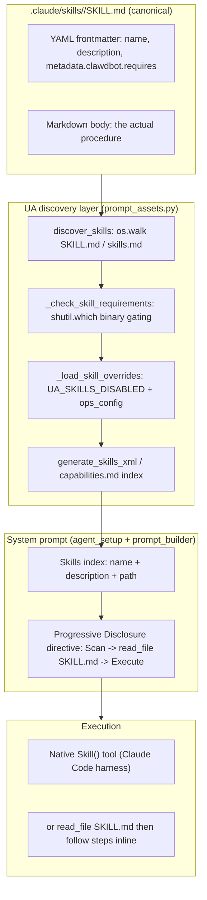

# Skills System

Skills are **Standard Operating Procedures (SOPs)** packaged as a folder under `.claude/skills/<name>/` containing a `SKILL.md` (the canonical contract for that skill) plus any helper scripts/assets. There are ~84 skills checked into the repo today. A skill encodes "the optimized way to do task X" — for example, fetching a YouTube transcript, sending email through Simone's inbox, running the ClaudeDevs intel lane, or scaffolding a project.

**The single most important rule: the per-skill `SKILL.md` is canonical.** Nothing in this doc, in `HEARTBEAT.md`, or in any prompt re-documents the steps a skill performs. The system only *advertises* skills and tells the model to read the `SKILL.md` before executing.

## Two layers: discovery/advertising vs. native invocation

UA does NOT implement a skill executor. There is no Python function that "runs a skill." Skills are executed by the **Claude Code harness's native `Skill` tool** (`Skill(skill='<name>', args='...')`). What the UA codebase *does* implement is the **discovery + advertising** layer that makes the model aware which skills exist and gates ones whose binaries are missing.



### Layer 1 — discovery (`prompt_assets.py::discover_skills`)

`discover_skills(skills_dir=None)` walks two roots, **project skills override user skills**:

1. **Project (highest priority):** `skills_dir` arg, else `UA_SKILLS_DIR`, else `<repo>/.claude/skills`.
2. **User (fallback, only when `skills_dir` arg is None):** `UA_USER_SKILLS_DIR`, else `~/.claude/skills`.

> **Gotcha — `.agents/skills/` is NOT discovered.** The repo also carries a parallel
> `.agents/skills/` tree (task-forge `*-tf` outputs and others), but `discover_skills`
> only walks `.claude/skills` + `~/.claude/skills`. A skill that exists *only* under
> `.agents/skills/<name>/` is never injected into any in-process principal's prompt — it
> is dead. This silently bit `paper-to-podcast-tf` (the `paper_to_podcast_daily` cron):
> the skill lived only in `.agents/skills/`, so the GLM cron agent never received its
> "use the `mcp__arxiv-mcp-server__*` tools, don't shell out to the raw library"
> instructions and improvised raw-`arxiv` HTTP that hit 429s. Fix = keep the canonical
> copy under `.claude/skills/<name>/`.

It recursively `os.walk`s each root (`followlinks=True`) looking for a marker file named `SKILL.md` or `skills.md` (case-insensitive — `VALID_MARKERS = {"skill.md", "skills.md"}`). For each match it parses the YAML frontmatter between the leading `---` fences and builds a dict:

```python
skill_entry = {
    "name": name,                       # frontmatter "name" or folder name
    "description": ...,                 # frontmatter "description"
    "path": skill_md,                   # absolute path to SKILL.md
    "enabled": is_avail,                # binary-gating result
    "frontmatter": frontmatter,         # full metadata exposed
}
```

Dedup is by normalized name (`_normalize_skill_key` = `strip().lower()`); the first occurrence wins, so a project skill shadows a same-named user skill. Malformed/unparseable `SKILL.md` files are skipped (logged as `skill_parse_error`), never fatal.

### Layer 2 — binary gating (`_check_skill_requirements`)

A skill can declare required CLI binaries in frontmatter under `metadata.clawdbot.requires`:

```yaml
metadata: {"clawdbot":{"emoji":"🌤️","requires":{"bins":["curl"]}}}
```

- `requires.bins` — **all** must resolve via `shutil.which`; first missing one → `(False, "Missing binary: <bin>")`.
- `requires.anyBins` — **at least one** must resolve, else `(False, "Missing any of: [...]")`.

A gated skill is still *discovered* but marked `enabled=False` with a `disabled_reason`, and a `logfire.info("skill_gated", ...)` event is emitted. **Gotcha:** on any exception during the check, the function returns `(True, "")` — it fails *open* (allows the skill) to avoid blocking valid skills on a parsing hiccup.

### Layer 3 — operator overrides (`_load_skill_overrides`)

Two override sources can force-disable a skill regardless of binaries:

- **`UA_SKILLS_DISABLED`** env var — comma-separated skill names; each is normalized and set to `False`.
- **`ops_config` `skills.entries`** — the runtime ops config (validated by `ops_config.py`'s JSON schema, dashboard-editable) can carry `skills: { entries: { <name>: { enabled: false } } }` (or a bare bool). This lets the operator toggle skills live without a deploy.

A skill with `overrides.get(key) is False` is dropped from discovery entirely (not just marked unavailable).

## How skills reach the model's context

`AgentSetup` (`agent_setup.py`) is the in-process entrypoint (used by Simone and other Agent-SDK principals). With `enable_skills=True` (the default), `AgentSetup.initialize()` calls `discover_skills()`, stores the result on `self._discovered_skills`, and builds `self._skills_xml` via `generate_skills_xml`. The hand-assembled prompt is built later in `AgentSetup._build_system_prompt`, which passes `skills_xml=self._skills_xml` into `prompt_builder.build_system_prompt`. There are **two** places skills surface in the prompt:

1. **`skills_xml`** — a Markdown checklist (despite the `_xml` name it's Markdown) passed through to `prompt_builder.build_system_prompt(..., skills_xml=...)`. Header: `## 📚 AVAILABLE SKILLS (Standard Operating Procedures)` / "You MUST read the relevant SOP before executing these tasks", one line per skill: `- **<name>**: <description> (Path: <path>)`.

2. **`capabilities.md`** — `AgentSetup` generates a richer capabilities registry into the workspace (`<workspace>/capabilities.md`) organized by domain, with a "📚 Standard Operating Procedures (Skills)" section that lists each skill and renders **gated ones struck through**: `- ~~**<name>**~~ (Unavailable: <reason>)`. This is the file referenced by `docs/03_Operations/13_Skill_Dependency_Setup_Guide.md` for diagnosing missing-binary skills. The prompt instructs **Progressive Disclosure**: Scan the index → `read_file` the full `SKILL.md` → execute step-by-step.

So the model never gets full skill bodies up front — only an index. It pulls the body on demand, either via the native `Skill()` tool or by `read_file`-ing the `SKILL.md` path.

## Invocation by principals

| Principal / path | Mechanism | Notes |
|---|---|---|
| **Simone (in-process Agent SDK)** | Native `Skill(skill='...', args='...')` tool + `read_file` progressive disclosure | Hooks actively redirect bad patterns to the native tool — e.g. `hooks.py` rewrites raw YouTube fetches to `Skill(skill='youtube-transcript-metadata', args='<url>')`. |
| **Cody / VP Coder (CLI subprocess)** | Native `Skill()` tool inside `claude --print` | `claude_cli_client.py` spawns the Claude Code CLI in the mission workspace; the CLI resolves `.claude/skills/` natively. If the mission payload carries a `skill` field, the prompt is prefixed with `Use the skill: <name>\nInvoke it with: Skill(skill='<name>', args='<objective>')`. VP missions also always invoke the `self-brief-and-attest` skill first. |
| **Operator dashboard** | `gateway_server.py::_load_skill_catalog` | Read-only catalog endpoint; re-uses `_check_skill_requirements` and the same ops_config overrides to show enabled/gated state in the UI. |

**Key distinction:** because Cody/VP run the real Claude Code CLI subprocess, they get skill resolution for free from the harness — UA's `discover_skills` layer is for the in-process SDK principals whose system prompt is hand-assembled by `AgentSetup`/`prompt_builder`.

## SKILL.md format (the contract)

Minimal valid frontmatter:

```yaml
---
name: weather
description: Get current weather and forecasts (no API key required).
homepage: https://wttr.in/:help
metadata: {"clawdbot":{"emoji":"🌤️","requires":{"bins":["curl"]}}}
---
```

- `name` — used as the dedup key and the `Skill(skill='<name>')` argument. Falls back to the folder name if absent.
- `description` — what shows in the prompt index; should be trigger-rich so the model knows *when* to use it.
- `metadata.clawdbot.requires.bins` / `.anyBins` — optional binary gating.
- Body — the procedure. Helper scripts live alongside `SKILL.md` in the skill folder.

## Dependency / gated-binary setup

When `capabilities.md` shows a skill as `~~**name**~~ (Unavailable: Missing binary: <bin>)`, the binary named in `requires.bins`/`anyBins` is not on `$PATH`. Resolution:

- **Python deps** — use `uv add` (see the `dependency-management` skill); never raw `pip` in this project.
- **System binaries** — install via the platform package manager (`apt`/`brew`/etc.). Agents cannot `sudo`; surface the install command to the operator. The `dependency-management` SKILL.md documents the common compile-failure → system-lib mapping (Pango/Cairo for Manim, `libgl1` for cv2, `libpq-dev` for psycopg2, ffmpeg for media).
- After installing, re-run discovery (e.g. `verify_capabilities.py`, which builds `AgentSetup(enable_skills=True)` and checks the generated `capabilities.md`).

> [VERIFY] The legacy `docs/03_Operations/13_Skill_Dependency_Setup_Guide.md` lists specific gated skills (1password→`op`, obsidian→`obsidian-cli`, tmux, spotify→`spogo`). Whether each is currently gated depends on what's installed on the host; the gating mechanism (`_check_skill_requirements`) is verified, the specific list is environment-dependent.

## Env vars / flags

| Var / flag | Effect | Default |
|---|---|---|
| `UA_SKILLS_DIR` | Override project skills root | `<repo>/.claude/skills` |
| `UA_USER_SKILLS_DIR` | Override user skills root | `~/.claude/skills` |
| `UA_SKILLS_DISABLED` | Comma-separated skill names to force-disable | unset |
| `AgentSetup(enable_skills=...)` | Toggle discovery for an in-process principal | `True` |
| `ops_config` `skills.entries.<name>.enabled` | Live operator toggle (dashboard) | unset (inherits) |

## Gotchas (code-verified)

- **The `Skill` tool is the harness's, not UA's.** Grepping `src/` for a skill executor finds nothing — only references that *tell the model* to call `Skill(...)`. UA owns discovery/gating/advertising, not execution.
- **`skills_xml` is Markdown, not XML** despite the variable name.
- **Binary gating fails open.** An exception inside `_check_skill_requirements` enables the skill. A truly broken skill can therefore appear available.
- **Project shadows user by normalized name.** Two skills named the same (case/whitespace-insensitive) collapse to the project one; the user one silently disappears.
- **Don't re-document a skill's steps elsewhere.** Per project rules (`Pre-Implementation Reading`), the `SKILL.md` is canonical; HEARTBEAT/prompt should only point at it by name. Duplicating steps causes drift.
- **`discover_skills` prints a `DEBUG:` line to stdout** on every call (`print(f"DEBUG: discover_skills called ...")`). Noisy but harmless; not gated behind a verbose flag.
